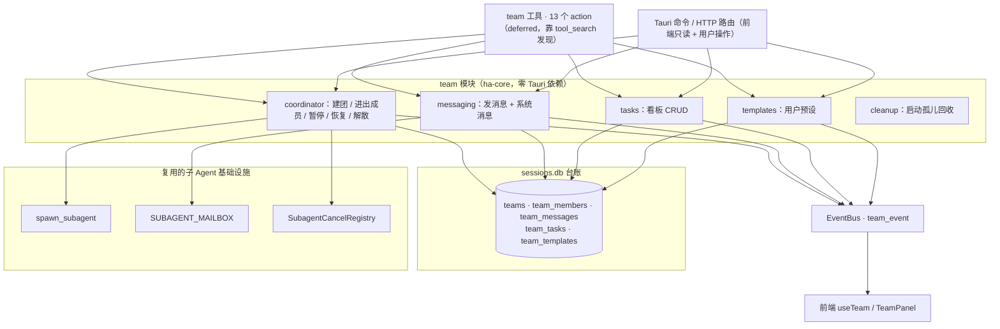
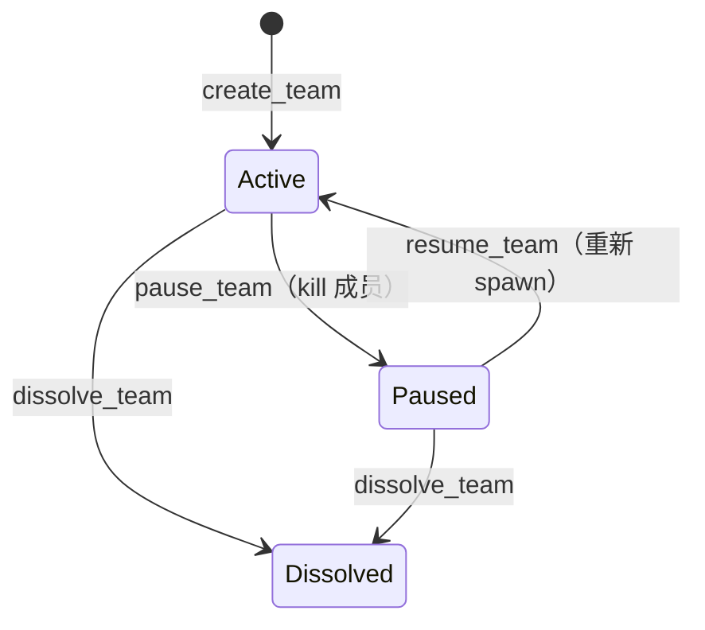
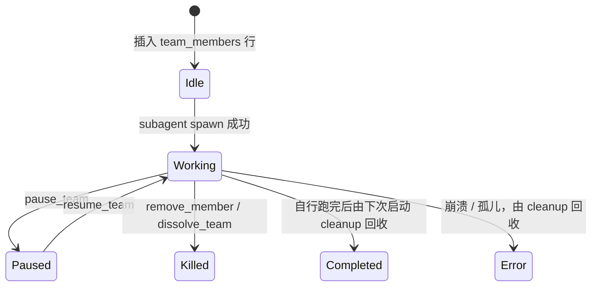
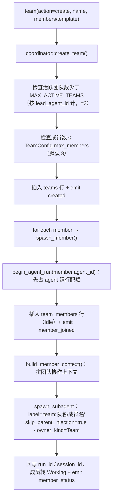
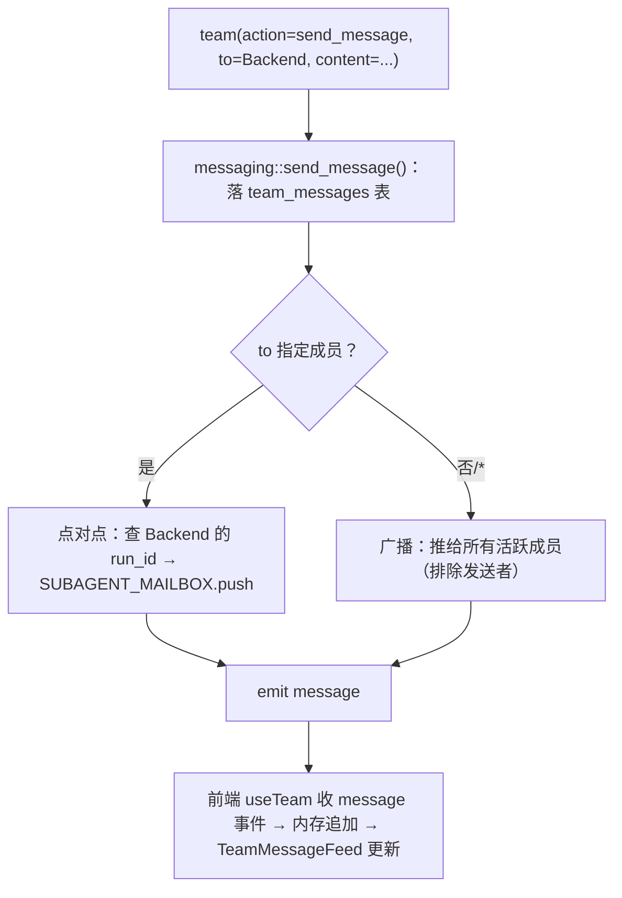
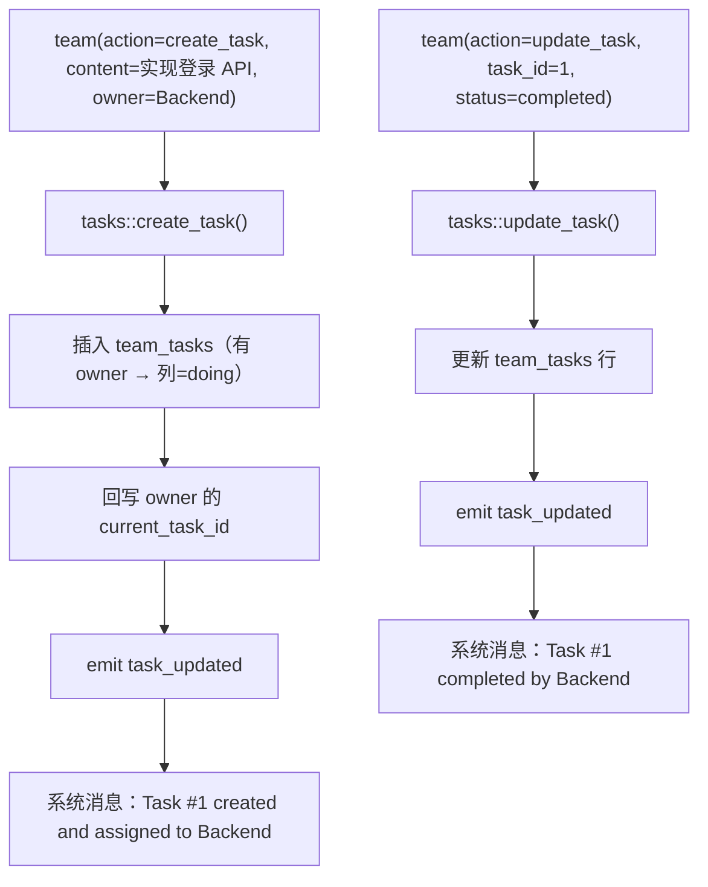
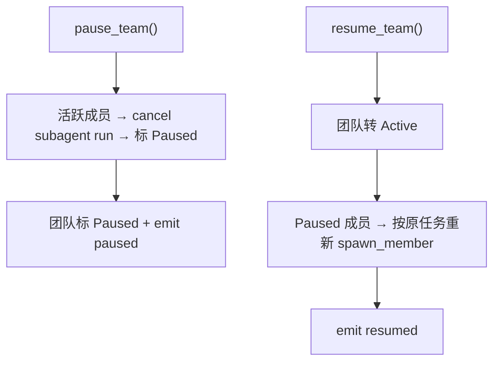
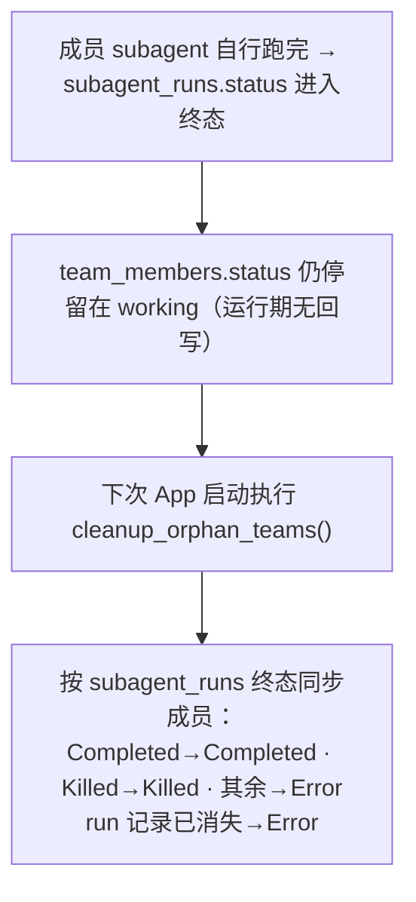
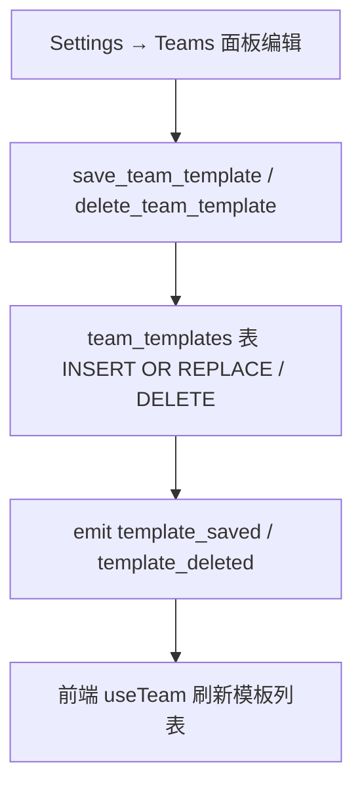

# Agent Team 多 Agent 协作系统

> 返回 [文档索引](../README.md) | 更新时间：2026-07-23

## 关联源码

- 编排层：[`crates/ha-core/src/team/`](../../crates/ha-core/src/team/)（`coordinator` / `messaging` / `tasks` / `templates` / `cleanup` / `db` / `types` / `events`）
- 模型可调用的工具：[`crates/ha-core/src/tools/team.rs`](../../crates/ha-core/src/tools/team.rs)、斜杠命令 [`slash_commands/handlers/team.rs`](../../crates/ha-core/src/slash_commands/handlers/team.rs)
- 面向用户本人的控制面：Tauri 命令 [`src-tauri/src/commands/team.rs`](../../src-tauri/src/commands/team.rs)、HTTP 路由 [`crates/ha-server/src/routes/team.rs`](../../crates/ha-server/src/routes/team.rs)
- 前端：[`src/components/team/`](../../src/components/team/)、模板配置 [`src/components/settings/teams-panel/`](../../src/components/settings/teams-panel/)
- 依赖的下层系统：[subagent](subagent.md)、[background-jobs](background-jobs.md)

## 核心思想

一个复杂任务往往能拆成几条可以并行推进、各有专长的支线：前端搭页面、后端写接口、测试补用例。子 Agent 系统已经能"父派子、子返父"，但那是一次性的单向委派——子 Agent 之间彼此看不见，父 Agent 必须亲自拆活、逐个分发、逐个收结果。

Agent Team 把这种关系翻转成**对等协作**：把几个子 Agent 变成有名字、有颜色、常驻的团队成员，让它们共享一块任务看板、互相直接发消息。协作不再由父 Agent 居中转发，而是由成员各自认领任务、更新进度、向队友广播。

一个关键设计取舍让这套系统很轻：**团队成员本质上就是子 Agent run**。它复用了子 Agent 已有的 spawn / cancel / 邮箱三件套，只在其上补了四样东西——

1. **具名身份**：固定名字 + 轮转分配的颜色，而不是临时 UUID；
2. **持久状态**：成员、任务、消息都落 `sessions.db`，App 重启也在；
3. **双向消息**：成员之间可以直接发消息（点对点或广播），投递复用子 Agent 邮箱；
4. **共享看板**：一块 Kanban 任务板，谁都能建任务、认领、推进。

理解整个系统只需抓住一句话：**协作靠的是成员主动调工具（发消息、动看板），而不是靠父会话回收结果**。团队成员刻意设了 `skip_parent_injection: true`，它跑完后不会把结果注入回创建团队的会话；进度完全通过成员自己发的消息和看板变更显现。数据库里的 5 张表是共享状态的唯一真相源，EventBus 把每一次变更推给前端 UI。

### 与子 Agent 系统的关系

| 维度 | 子 Agent | Agent Team |
|------|---------|-----------|
| 生命周期 | 一次性任务，完成即销毁 | 持久存在，可反复接活 |
| 身份 | 临时 UUID（run_id） | 固定名字 + 颜色标识 |
| 通信 | 单向：子→父返回结果 | 双向：成员之间直接发消息 |
| 协作模式 | 父 Agent 拆任务 → 分发 → 收结果 | 共享任务看板，成员自行领活 |
| 结果处理 | 完成后自动注入父会话 | 不注入父会话（`skip_parent_injection: true`），进度靠成员显式发消息 / 更新看板 |
| 数据存储 | `subagent_runs` 单表 | 5 张独立表（teams / members / messages / tasks / templates） |

## 架构总览

Team 是薄薄一层编排逻辑，夹在"入口"与"子 Agent 基础设施"之间，自己只管 5 张台账表并向 EventBus 广播变更：



### 模块结构

```
crates/ha-core/src/team/
├── mod.rs            # 常量（DEFAULT_MAX_MEMBERS=8、MAX_ACTIVE_TEAMS=3）、8 色轮转分配
├── types.rs          # Team / TeamMember / TeamMessage / TeamTask / TeamTemplate 等类型与枚举
├── db.rs             # SessionDB impl：5 张表的 CRUD
├── coordinator.rs    # 核心编排：create_team / spawn_member / add / remove / dissolve / pause / resume / status
├── messaging.rs      # 成员间消息 + 系统消息，投递走 SUBAGENT_MAILBOX
├── tasks.rs          # 任务看板 CRUD + 依赖字段（blocked_by/blocks）存储 + 系统消息
├── templates.rs      # 用户预设 CRUD（无内置模板，全部来自 Settings → Teams）
├── events.rs         # 统一 team_event 发射 helper
└── cleanup.rs        # 启动时把孤儿成员状态与其 subagent run 对齐
```

### 入口与前端

| 层 | 文件 | 职责 |
|----|------|------|
| 模型工具 | `tools/team.rs` | `team` 工具处理器，13 个 action 的参数解析与调度 |
| 斜杠命令 | `slash_commands/handlers/team.rs` | `/team` → PassThrough 给 LLM，由模型自行调工具 |
| Tauri IPC | `src-tauri/src/commands/team.rs` | 桌面命令（读取 + 用户操作） |
| HTTP REST | `ha-server/src/routes/team.rs` | `/api/teams*` 端点 |

前端组件集中在 `src/components/team/`：

| 组件 | 职责 |
|------|------|
| `useTeam.ts` | `useTeam` + `useActiveTeam` hooks，订阅 `team_event`（成员重载 300ms 防抖） |
| `TeamPanel.tsx` | 右侧主面板（概览 / 任务看板 / 消息 三 Tab） |
| `TeamDashboard.tsx` | 成员网格 + 进度条 + 统计 |
| `TeamMemberCard.tsx` | 单成员状态卡片（颜色标识、状态徽章、token 计数） |
| `TeamTaskBoard.tsx` / `TeamTaskCard.tsx` | Kanban 四列看板与任务卡片 |
| `TeamMessageFeed.tsx` / `TeamMessageBubble.tsx` | 消息流（DOM 只渲染最近 200 条）+ 输入框 + 消息气泡 |
| `TeamToolbar.tsx` | 操作栏（暂停 / 恢复 / 解散） |
| `TeamMiniIndicator.tsx` | 聊天标题栏迷你指示器（面板关闭时显示，自行取数） |

团队没有专门的"创建对话框"——创建由模型调 `team(action="create")` 完成。模板的增删改 UI 在 `src/components/settings/teams-panel/`（`TemplateListView` / `TemplateEditView` / `MemberRow` / `AgentSelector`）。

## 数据模型

### 团队状态机

团队只有三态。暂停会 kill 所有活跃成员但保留分配，恢复时按原任务重新拉起；解散不检查当前状态，从 Active 或 Paused 都能直接进入 Dissolved：



### 成员状态机

成员六态。插入行时为 `Idle`，subagent 拉起成功立刻转 `Working`。要点在于**终态不是实时回收的**（见下文"成员生命周期与终态回收"）：



- 活跃判定 `is_active()`：`Idle | Working`
- 终态判定 `is_terminal()`：`Completed | Error | Killed`

### SQLite 台账

五张表都落在 `sessions.db`，是团队共享状态的唯一真相源。

**teams**

| 字段 | 类型 | 说明 |
|------|------|------|
| `team_id` | TEXT PK | UUID v4 |
| `name` | TEXT | 团队名称 |
| `description` | TEXT | 可选描述 |
| `lead_session_id` | TEXT | 创建团队的父会话 ID |
| `lead_agent_id` | TEXT | 创建团队的 Agent ID |
| `status` | TEXT | active / paused / dissolved |
| `created_at` / `updated_at` | TEXT | RFC 3339 |
| `template_id` | TEXT | 创建时使用的模板 ID（可空） |
| `config_json` | TEXT | `TeamConfig` JSON：`maxMembers` / `autoDissolveOnComplete` / `sharedContext` |

**team_members**

| 字段 | 类型 | 说明 |
|------|------|------|
| `member_id` | TEXT PK | UUID v4 |
| `team_id` | TEXT FK | 所属团队 |
| `name` | TEXT | 成员名称（如 "Frontend"、"Tester"） |
| `agent_id` | TEXT | 使用的 Agent ID |
| `role` | TEXT | lead / worker / reviewer |
| `status` | TEXT | idle / working / paused / completed / error / killed |
| `run_id` | TEXT | 关联的 `subagent_runs.run_id`（可空） |
| `session_id` | TEXT | 成员的隔离会话 ID（可空） |
| `color` | TEXT | 颜色标识（hex，如 `#3B82F6`） |
| `current_task_id` | INTEGER | 当前执行的任务 ID（可空） |
| `model_override` | TEXT | 模型覆盖（可空） |
| `role_description` | TEXT | 角色身份描述，注入成员 system prompt（来自模板成员的 `description`） |
| `joined_at` | TEXT | RFC 3339 |
| `last_active_at` | TEXT | 最后活跃时间（可空） |
| `input_tokens` / `output_tokens` | INTEGER | 累计 token（见下方 token 说明） |

**team_messages**

| 字段 | 类型 | 说明 |
|------|------|------|
| `message_id` | TEXT PK | UUID v4 |
| `team_id` | TEXT FK | 所属团队 |
| `from_member_id` | TEXT | 发送者。哨兵值：`*system*` 系统消息、`*user*` 用户手动发、`*lead*` 创建团队的会话经工具发 |
| `to_member_id` | TEXT | 接收者 member_id；NULL = 广播 |
| `content` | TEXT | 消息内容 |
| `message_type` | TEXT | chat / task_update / handoff / system（枚举有 4 种，当前代码只产出 `chat` 与 `system`） |
| `timestamp` | TEXT | RFC 3339 |

分页用 `(timestamp, message_id)` 复合游标，同一毫秒插入的多条也能确定性翻页；`timestamp` 是 RFC 3339，字典序即时间序。

**team_tasks**

| 字段 | 类型 | 说明 |
|------|------|------|
| `id` | INTEGER PK | 自增 |
| `team_id` | TEXT FK | 所属团队 |
| `content` | TEXT | 任务描述 |
| `status` | TEXT | 模型可写的自由文本，无枚举约束；仅 `pending`（创建默认）与 `completed`（补一条系统消息）有代码语义，其余取值无系统行为 |
| `owner_member_id` | TEXT | 负责人 member_id（可空） |
| `priority` | INTEGER | 优先级（数字越小越靠前，默认 100） |
| `blocked_by` | TEXT | JSON 数组，阻塞此任务的其他任务 ID |
| `blocks` | TEXT | JSON 数组，被此任务阻塞的其他任务 ID |
| `column_name` | TEXT | Kanban 列：backlog / todo / doing / review / done |
| `created_at` / `updated_at` | TEXT | RFC 3339 |

`blocked_by` / `blocks` 只做存储，系统不会在阻塞任务完成时自动解锁下游——依赖关系是给成员和 UI 看的提示，不是自动调度器。

**team_templates**

| 字段 | 类型 | 说明 |
|------|------|------|
| `template_id` | TEXT PK | 标识符（UUID 或用户自定义） |
| `name` | TEXT | 模板名称 |
| `description` | TEXT | 模板描述 |
| `members_json` | TEXT | `TeamTemplateMember[]` JSON |
| `builtin` | INTEGER | 物理列仍在（写入恒为 0、读取时不映射进结构体），系统不再发行内置模板 |
| `created_at` / `updated_at` | TEXT | RFC 3339，保存时由服务端赋值后回传 |

## 协作是怎么发生的

### 建团：一次调用铺开若干成员

模型调 `team(action="create", name, members)`（或 `template="<name>"`），coordinator 先过两道限额，插入团队行并广播 `created`，再逐个 spawn 成员：



限额有个非显然点：活跃团队上限用的是模块常量 `MAX_ACTIVE_TEAMS`（=3，按 `lead_agent_id` 统计），成员上限用的是 `TeamConfig.max_members`（默认 8）；这两个才是真正被强制的值。`spawn_member` 刻意在写入成员行**之前**先 `begin_agent_run` 预留成员自身 agent 的运行配额，避免"团队还在跑、成员 agent 却被删"的竞态。

### 成员间通信：直达对方邮箱

成员调 `team(action="send_message", to="Backend", content=...)`。消息落库后，通过成员的 `run_id` 直接投进子 Agent 邮箱——对方的 tool loop 会在下一轮 drain 到 `[Team msg from <发送者>]: ...`。`to="*"` 或省略即广播给除发送者外的所有活跃成员：



看板变更也会自动生成一条**系统消息**（`*system*` 广播），让全队都看到进展。

### 任务看板：建任务、认领、推进

`create_task` 插入任务行，若指定 owner 则把列设为 `doing` 并回写该成员的 `current_task_id`（无 owner 则落 `todo` 列）；`update_task` 改状态 / owner / 列 / 内容，状态变成 `completed` 时补一条系统消息：



### 暂停 / 恢复

暂停 = kill 所有活跃成员的 subagent run 并标 `Paused`，团队转 `Paused`；恢复 = 团队转回 `Active`，把每个 `Paused` 成员按其 `current_task_id` 对应的任务文本（找不到就用"继续之前的工作"占位）重新 spawn：



### 成员生命周期与终态回收（非显然）

这是最容易被误解的一环。因为成员设了 `skip_parent_injection: true`，它跑完后**不会**把结果注入回创建团队的会话，也没有运行期的回调把成员状态改成 `Completed`。实际行为是：



也就是说，**运行期唯一会把成员推入终态的路径是显式动作**：`remove_member` / `dissolve_team` 把活跃成员标 `Killed`，`pause_team` 标 `Paused`。成员自然完成后的状态对齐是"惰性"的，靠启动清理补上；崩溃会在底层收敛为 `Interrupted`，同样在清理时映射为 `Error`。团队本身则保持 `Active`，把"下一步怎么办"交给用户决定。

> **token 计数说明**：`input_tokens` / `output_tokens` 目前只在插入成员时写入 0，运行期没有回写入口（`update_team_member_tokens` 无调用方）。因此 Dashboard 上的 token 统计当前恒为 0，属已知的未接线项而非实时用量。

## 成员系统上下文

每个成员的 subagent 通过 `SpawnParams.extra_system_context` 注入一段团队协作上下文（真实为英文），告诉它自己是谁、队友有谁、怎么沟通、任务是什么：

```
## Team Collaboration Context
You are a member of team "Auth Team".
- Your name: Frontend
- Your role: Worker

### Your Role Identity          （可选块，来自成员的 role_description）
资深前端工程师，负责登录页交互…

### Teammates
- Backend (Worker): 实现登录 API
- Tester (Reviewer): 编写集成测试

### Communication
- Send message to a teammate: team(action="send_message", team_id="xxx", to="<name>", content="...")
- Broadcast to all: team(action="send_message", team_id="xxx", to="*", content="...")
- Update your task: team(action="update_task", team_id="xxx", task_id=<id>, status="completed")
- Create a new task: team(action="create_task", team_id="xxx", content="...", owner="Frontend")

### Your Assignment
构建登录页面的 React 组件

### Shared Context               （可选块，来自 TeamConfig.shared_context）
全队共用的背景信息…
```

其中 "Your Role Identity" 和 "Shared Context" 是可选块：前者只在成员有非空 `role_description` 时出现，后者只在团队配置了 `shared_context` 时出现。队友列表会带上各自当前任务的描述（无任务则显示 `awaiting assignment`）。

## 工具 API

`team` 工具用 action 分发，共 13 个 action：

| Action | 参数 | 说明 |
|--------|------|------|
| `create` | name, members / template | 创建团队（内联成员列表或引用模板名） |
| `dissolve` | team_id | 解散团队，kill 所有成员 |
| `add_member` | team_id, name, task, agent_id?, role?, model?, description? | 向活跃团队加成员 |
| `remove_member` | team_id, member_id | 移除并 kill 成员 |
| `send_message` | team_id, to, content | 发消息给成员或广播（to="*"） |
| `create_task` | team_id, content, owner?, priority?, blocked_by? | 创建任务 |
| `update_task` | team_id, task_id, status / owner / column / content | 更新任务 |
| `list_tasks` | team_id, status? | 列出任务（可按状态过滤） |
| `list_members` | team_id | 列出成员 |
| `status` | team_id | 团队全量状态摘要（含 token 汇总） |
| `pause` | team_id | 暂停所有成员 |
| `resume` | team_id | 恢复暂停成员 |
| `list_templates` | — | 列出已保存的用户预设（来自 `team_templates`） |

`send_message` / `create_task` / `update_task` 的 `to` / `owner` 都接受**成员名字**，处理器会解析成 member_id；解析不到时按原字符串透传。工具本身是 `internal` 且默认 **deferred**——不在默认工具列表里，模型经 `tool_search` 发现（当且仅当某 Agent 把它配成 eager 时，系统提示才会额外注入一段团队使用指引）。

## 用户自定义预设

系统不发行内置模板。固定模板很难匹配每个团队的实际工作流，硬编码反而成为干扰，因此模板完全由用户在设置里定义：`templates::all_templates()` 直接读 `team_templates` 表，没有就返回空——模型调 `team(action="list_templates")` 拿到的也是同一份用户配置，空表时工具会提示改用内联 `members=[...]`。

### 配置入口

**Settings → Teams** 面板（面向用户本人的控制面）可添加 / 编辑 / 删除模板，为每个成员定义名字 + Agent + 角色 + 默认任务描述（`default_task_template`）。模板保存后即可在 `team(action="create", template="<name>")` 引用，一键铺开成员。模板与 Agent 松耦合：删掉某个 Agent 后，引用它的成员会 spawn 失败（只记一条 warn 日志），团队照常创建、只是缺这名成员，`create` 不向模型报错（成员级 fallback 尚未实现）。

内联成员会覆盖模板成员——即便传了 `template`，只要同时给了 `members`，就以内联为准。

### 工具 / 命令访问

| 入口 | 用法 |
|------|------|
| `team(action="list_templates")` | 模型工具：列出用户已保存的预设 |
| `list_team_templates` (Tauri) / `GET /api/team-templates` | 前端读取模板列表 |
| `save_team_template` (Tauri) / `POST /api/team-templates` | 保存或更新模板 |
| `delete_team_template` (Tauri) / `DELETE /api/team-templates/:id` | 删除模板 |



## Agent 配置

`AgentConfig.team`（`TeamAgentConfig`）挂在每个 Agent 上：

| 字段 | 类型 | 默认 | 是否生效 |
|------|------|------|---------|
| `enabled` | bool | true | **是**：控制系统提示里的团队使用指引段（含 deferred 激活指引）。team 工具本身始终暴露且可调用，`enabled=false` 不阻止建团 |
| `maxActiveTeams` | u32 | 3 | 声明字段，当前未接入强制逻辑 |
| `maxMembersPerTeam` | u32 | 8 | 声明字段，当前未接入强制逻辑 |
| `memberModel` | Option<String> | None | 声明字段，当前未被消费 |

需要留意：真正被强制的限额来自模块常量与 `TeamConfig`——活跃团队数用 `MAX_ACTIVE_TEAMS`（=3），每队成员数用 `TeamConfig.max_members`（=8）。`TeamAgentConfig` 里那三个数值 / 模型字段目前只是 schema 占位，尚未接到创建路径上，只有 `enabled` 是活的开关。

## EventBus 事件

所有变更走统一事件名 `team_event`，用 `type` 字段区分。以下是编排层**实际发射**的类型：

| type | payload | 触发时机 |
|------|---------|---------|
| `created` | Team 全量 | 团队创建 |
| `member_joined` | TeamMember | 成员加入 |
| `member_status` | {teamId, memberId, status} | 成员转 working（spawn）/ killed（remove） |
| `message` | TeamMessage | 成员间消息或系统消息 |
| `task_updated` | TeamTask | 任务创建 / 变更 |
| `paused` / `resumed` | {teamId} | 团队暂停 / 恢复 |
| `dissolved` | {teamId, name} | 团队解散 |
| `template_saved` / `template_deleted` | 模板 / {templateId} | 模板保存 / 删除 |

前端 `useTeam` 订阅 `team_event`，按类型分策略：

- `member_joined` / `member_status` → 300ms 防抖后重载成员列表
- `message` → 事件带完整消息，按 messageId 去重后内存追加（`TeamMessageFeed` 的 DOM 侧只渲染最近 200 条）
- `task_updated` → 事件带完整任务，直接内存更新对应项
- `paused` / `resumed` / `dissolved` → 整体重载

> `useTeam` 里还保留了一个 `member_completed` 分支，但编排层当前并不发射该事件（成员自然完成的状态对齐走启动清理，见"成员生命周期与终态回收"）。

## 前端交互

### TeamPanel（右侧面板）

```
┌──────────────────────────────────────────────┐
│ Team: "Auth Team"       [暂停] [解散]         │
├──────────────────────────────────────────────┤
│ [概览]  [任务看板]  [消息]                     │
├──────────────────────────────────────────────┤
│ 概览: 成员卡片网格 + 进度条 + token 统计        │
│ 任务看板: 四列 Kanban (Todo/Doing/Review/Done) │
│ 消息: 实时消息流 + 输入框                       │
└──────────────────────────────────────────────┘
```

### ChatScreen 集成

- `useActiveTeam(sessionId)` 按 `leadSessionId` 发现当前会话的活跃团队
- 团队创建时自动展开 TeamPanel
- 面板关闭时显示 `TeamMiniIndicator`（自行取数）

## API 端点

### Tauri 命令

| 命令 | 说明 |
|------|------|
| `list_teams` | 列出团队（按 session 过滤或全部活跃） |
| `get_team` | 获取团队详情 |
| `get_team_members` | 获取成员列表 |
| `get_team_messages` | 获取最新消息（默认 50 条），返回 `(messages, hasMore)` |
| `get_team_messages_before` | 按复合游标加载更早的消息（无限滚动），返回 `(messages, hasMore)` |
| `get_team_tasks` | 获取任务列表 |
| `send_user_team_message` | 用户手动发消息给团队（发送者 `*user*`） |
| `list_team_templates` / `save_team_template` / `delete_team_template` | 用户模板列出 / 保存 / 删除 |
| `create_team` / `pause_team` / `resume_team` / `dissolve_team` | 团队创建与生命周期操作 |

### HTTP 路由

| 方法 | 路径 | 说明 |
|------|------|------|
| GET | `/api/teams` | 列出团队 |
| POST | `/api/teams` | 创建团队 |
| GET | `/api/teams/:id` | 获取团队 |
| GET | `/api/teams/:id/members` | 获取成员 |
| GET | `/api/teams/:id/messages` | 获取最新消息 |
| GET | `/api/teams/:id/messages/before` | 按游标加载更早的消息 |
| POST | `/api/teams/:id/messages` | 发送消息 |
| GET | `/api/teams/:id/tasks` | 获取任务 |
| POST | `/api/teams/:id/pause` | 暂停 |
| POST | `/api/teams/:id/resume` | 恢复 |
| POST | `/api/teams/:id/dissolve` | 解散 |
| GET | `/api/team-templates` | 列出用户模板 |
| POST | `/api/team-templates` | 保存或更新模板 |
| DELETE | `/api/team-templates/:id` | 删除模板 |

`add_member` / `remove_member` 只有模型工具入口，没有对应的 HTTP / Tauri 端点。

## 边界情况与非显然行为

| 场景 | 处理 |
|------|------|
| 成员执行崩溃 | 底层 attempt 收敛为 `Interrupted`；非 Completed/Killed 的终态映射为 `Error` → 系统消息通知全队 → 用户可在 UI 重新添加 |
| 成员自然完成 | 运行期不回写；`team_members.status` 停在 `working`，靠下次启动 `cleanup_orphan_teams()` 对齐为 Completed/Error/Killed |
| App 重启 | `cleanup_orphan_teams()` 把 working 成员与其 subagent run 状态对齐；团队保持 Active 等用户决定 |
| 用户暂停 / 恢复成员 | 暂停 = kill subagent + 标 Paused + 保留任务分配；恢复 = 按原任务重新 spawn |
| 用户手动发消息 | TeamMessageFeed 输入框 → `send_user_team_message`（`*user*`）→ 投递到成员 mailbox |
| 并发限制 | 成员经 `spawn_subagent` 进入子 Agent 并发池，受 `max_concurrent_for_agent` 约束（读该 Agent 的 `subagents.maxConcurrent`，spawn 时 clamp 到 1–50，默认 8），超限拒绝；`spawn_member` 另在写行前 `begin_agent_run` 预留成员 agent 配额 |
| 跨会话事件 | `useActiveTeam` 按 `leadSessionId` 过滤，解散事件按 `teamId` 匹配 |
| token 统计 | 目前恒为 0（无运行期回写入口），非实时用量 |

## 与子 Agent 系统的集成点

1. **spawn**：`coordinator::spawn_member()` 调 `subagent::spawn_subagent()`，用 `label: "team:{队名}/{成员名}"`、`skip_parent_injection: true`、`owner_kind: Team` 标记团队成员；`group_id` 恒为 `None`（团队成员不参与子 Agent 分组投影）
2. **cancel**：复用 `SubagentCancelRegistry`，每个成员的 `run_id` 都注册其中，暂停 / 移除 / 解散经它 kill
3. **mailbox**：消息投递走 `SUBAGENT_MAILBOX.push(run_id, msg)`，成员的 tool loop 下一轮 drain
4. **cleanup**：`cleanup_orphan_teams()` 启动时读成员关联的 `subagent_runs` 状态并回写成员状态
