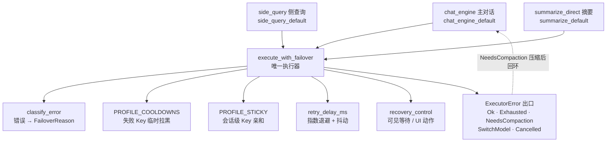
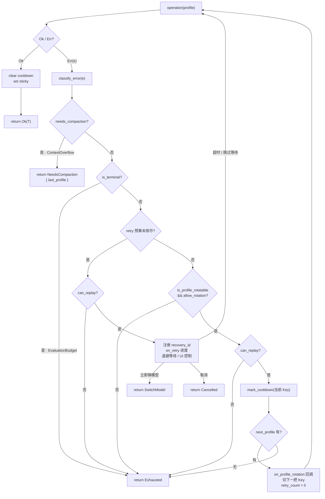
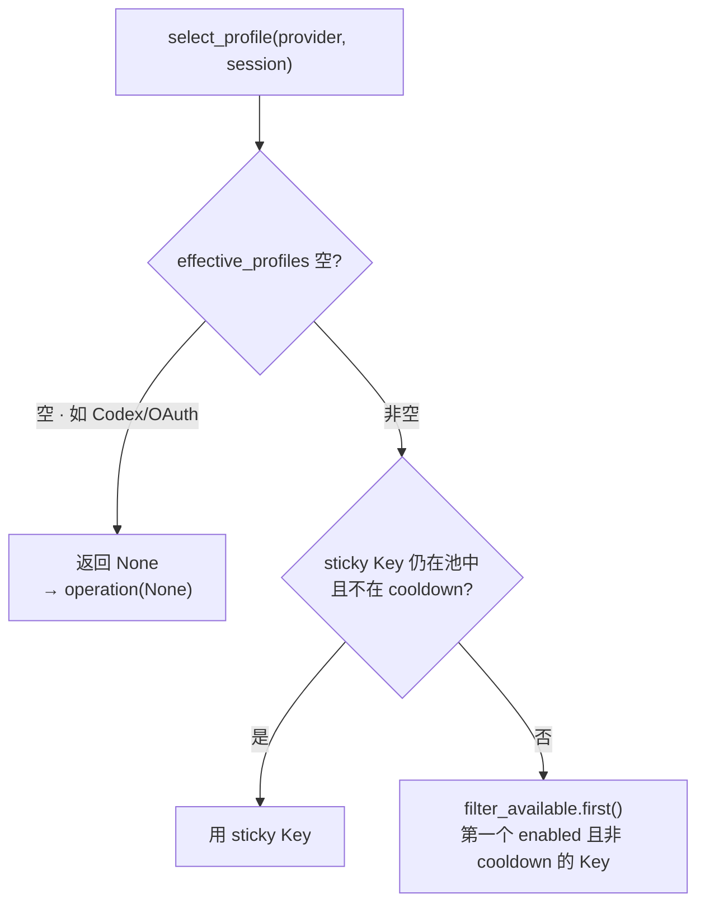

# Failover 系统

> 返回 [文档索引](../../README.md) | 关联：[Provider 系统](../core/provider-system.md) · [Chat Engine](../core/chat-engine.md) · [Side Query](side-query.md)

## 核心思想

任何一次 LLM 请求都可能失败，而失败的原因五花八门：限流、服务过载、网络抖动、密钥失效、余额耗尽、模型不存在、上下文超窗……不同原因需要截然不同的应对——有的该原地退避重试，有的该换一把 API Key，有的该压缩上下文再来，有的干脆没救、只能上交给上层换模型。

如果每个发起 LLM 请求的代码路径都自己写一套「捕获错误 → 判断类型 → 决定重试还是换 key」的逻辑，很快就会出现三种问题：分类口径不一致（同一个厂商错误体在 A 路径被当限流、在 B 路径被当未知错误）、prompt cache 被打穿（各自随机挑 key，命不中上一轮的缓存前缀）、以及重复造轮子。

Failover 系统把这套编排收敛成**一个执行器** [`execute_with_failover`](../../../crates/ha-core/src/failover/executor.rs)。它接受一个「发起请求」的异步闭包，在外面包上统一的：错误分类 → 决策（重试同 key / 轮换 key / 上交压缩 / 放弃） → 带抖动的指数退避 → 会话级 key 亲和。所有会发起 LLM 请求的路径——主对话、side_query、Tier 3 摘要——都必须经过它，禁止自己手写重试或 profile 选择。

三个关键设计：

- **分类是纯字符串判定**：把任意 API 错误消息映射到语义类别（`FailoverReason`），决策全部由类别驱动，与具体厂商解耦。
- **同 Provider 多 Key 轮换 + 会话亲和**：一个 Provider 可挂多把 API Key。失败的 key 进冷却，同一会话的连续多轮尽量粘在同一把 key 上（保住 prompt cache）。
- **上下文超窗不降级、而是上交压缩**：换更小的模型只会更糟，所以 `ContextOverflow` 不参与重试也不参与轮换，直接返回 `NeedsCompaction` 让主对话压缩后用同一把 key 重来。

## 架构总览



执行器本身不接触 EventBus / Tauri，保持 `ha-core` 的零壳依赖：进度提示、profile 轮换事件、可交互恢复动作都由 caller 通过回调注入。

## 三档 Policy

`FailoverPolicy` 控制每个调用点的重试 / 轮换激进程度。三档预设由 `chat_engine_default()` / `side_query_default()` / `summarize_default()` 暴露：

| Policy | 已知瞬时错误 `max_retries` | 未知错误 `max_unknown_retries` | `allow_profile_rotation` | 退避基准 / 上限 | 调用方 |
|---|---:|---:|---|---|---|
| `chat_engine_default` | 3 | 2 | true | 1000 / 10000 ms | [`chat_engine::engine`](../../../crates/ha-core/src/chat_engine/engine.rs) 主对话 |
| `side_query_default` | 1 | 1 | true | 1000 / 10000 ms | [`agent::side_query`](../../../crates/ha-core/src/agent/side_query.rs) 一次性侧查询 |
| `summarize_default` | 2 | 1 | **false** | 1000 / 10000 ms | [`agent::context::summarize_direct`](../../../crates/ha-core/src/agent/context.rs) Tier 3 摘要 |

**为什么 summarize 关掉 profile 轮换**：Tier 3 摘要用的 `DedicatedModelProvider` 已经绑定到某个具体 `provider:model`，而用户正在等本轮主对话的回复——这时候为了换一把 key 多花几秒，不如直接 fail，让上层快速降级到 side_query fallback / 紧急压缩。

**Codex 强制不参与 profile 轮换**：执行器内部 `allow_rotation = policy.allow_profile_rotation && provider.api_type != ApiType::Codex`，即使 caller 传 `chat_engine_default()`（其 `allow_profile_rotation=true`）也会被强制 false。Codex 走 OAuth，`effective_profiles()` 恒为空，根本没有可轮换的目标。此外 Codex adapter 自身已经有一层 3 次 transport retry（逐次通过流式回调发 `model_retry` 进度），执行器对 Codex 的所有 retryable 分类（含 Unknown）不再叠加第二层同模型重试，避免乘法放大——裸 HTTP 500 / 504 也统一归为 `Overloaded` 而非 Unknown，不会绕过这道闸门。

## 错误分类（FailoverReason）

`classify_error(&str)` 把任意 API 错误消息（HTTP 状态码、Provider 厂商错误体、reqwest 传输错误）映射到 **9 种**语义类别。绝大多数关键字是**全字符串小写子串匹配**，命中即返回，热路径成本可忽略。

唯一的例外是**裸 500 / 504**：这两个码含义太泛（"maximum output tokens is 500"、"model v504-preview" 都会误命中），所以它们必须借助一条编译期正则 `HTTP_STATUS_CODE_RE` 提供的显式上下文才算数——错误文本里得出现 `http` / `status` / `response code` / `api error(错误)` / `"status":` 之类的前缀。其余状态码（429、502、503、521、522、524、401、402、403、404）仍是直接子串匹配。

| Reason | 触发关键字（节选） | 行为 |
|---|---|---|
| `EvaluationBudget` | `evaluation budget exhausted` | **terminal**：评测预算耗尽，直接 Exhausted，永不重试 / 轮换 |
| `ContextOverflow` | `context length exceeded` / `context_length_exceeded` / `context window` / `maximum context length` / `prompt is too long` / `token limit` / `input too long` / `request too large` / `max_tokens` +(`exceed`\|`too large`) | **返回 `NeedsCompaction`**，不重试也不轮换 |
| `RateLimit` | `429` / `rate limit` / `rate_limit` / `too many requests` / `resource_exhausted` / `throttl` | 退避重试 + 可轮换 profile |
| `Overloaded` | `503` / `overloaded` / `service unavailable` / `temporarily unavailable` / `server_error` / `internal server error` / `502` / `521` / `522` / `524` / 500·504（**需 HTTP 上下文**）/ OpenAI 的 `An error occurred while processing your request…` | 退避重试 + 可轮换 profile |
| `Timeout` | `timeout` / `timed out` / `ETIMEDOUT` / `ECONNRESET` / `ECONNREFUSED` / `connection reset` / `connection refused` / `dns error` / `error sending request` / `error decoding response body` / `incomplete message` / `unexpected eof` / `connection closed before message completed` …（一整套传输层错误） | 仅退避重试，**不**轮换 profile |
| `Auth` | `401` / `unauthorized` / `invalid api key` / `invalid_api_key` / `authentication` / `403` / `forbidden` / `permission denied` | 可轮换 profile；Codex 场景由 chat_engine 在 Exhausted 出口补发 `codex_auth_expired` 引导重授权 |
| `Billing` | `402` / `payment required` / `billing` / `quota` / `insufficient_quota` / `exceeded your current quota` | 可轮换 profile |
| `ModelNotFound` | `404` / `model not found` / `model_not_found` / `provider not found` / `does not exist` / `not_found_error` | **不**重试 / **不**轮换，直接上交给上层跳下一个 fallback model |
| `Unknown` | 上面都不命中 | 谨慎重试（小预算，默认 2 次）；仍失败则上交给上层跳下一个 fallback model |

**判定顺序**（前置匹配优先于后置）：`EvaluationBudget → ContextOverflow → RateLimit → Overloaded → Timeout → Auth → Billing → ModelNotFound → Unknown`。顺序不是随意的——靠前的都是更具体的模式，得赶在错误文本一路 fall through 到 Unknown（小预算重试）之前命中：OpenAI 的 5xx 文案要在 `Overloaded` 段拦下；含 `token limit` / `prompt is too long` 等字样的超窗错误更要最先判定，否则会漏过所有类别落到 Unknown，被当成瞬时错误重试而错过压缩。

三条容易忽略的设计取舍：

- **`Timeout` 故意不算 `is_profile_rotatable`**：传输层错误换 key 也救不了，应当退避后重试同一把 key。否则一阵网络抽风会把所有 key 全打进 cooldown。
- **`EvaluationBudget` 是唯一 terminal**：评测预算耗尽是应用级终态，不再发任何 Provider 请求。
- **`ContextOverflow` 不是 terminal**：它是 `NeedsCompaction` 信号，交给 chat_engine 跑紧急压缩后重试，而不是直接失败。

## 单次调用的决策流程

执行器对每次 `operation(profile)` 的结果按下面的分支决策。retry 预算用尽后才考虑轮换 profile；轮换会把 `retry_count` 归零，让新 key 重新享有完整的重试预算。



图中的 `can_replay?` 是**重放守卫**：主对话把它接到 `had_tool_activity`，一旦本轮跨过了工具边界，就不再在执行器内重启同模型 / 同 profile 的 operation——保住已完成的工具上下文，不让重试把工具调用重放一遍。side_query / summarize 这类无副作用路径不设此守卫。

## Executor 出口

`execute_with_failover` 返回 `Result<T, ExecutorError>`，失败出口如下：

| 出口 | 何时触发 | Caller 行为 |
|---|---|---|
| `Ok(T)` | 操作成功 | 无；执行器已自动 `PROFILE_STICKY.set` + `PROFILE_COOLDOWNS.clear` |
| `Exhausted { last_reason, last_error }` | 所有 retry / 所有 profile 都试过 / 命中不可重试错误 / terminal | chat_engine 跳到 fallback chain 下一个 model；side_query / summarize 直接返回 |
| `NeedsCompaction { last_profile }` | 任意一次 attempt 命中 ContextOverflow | chat_engine 跑 `emergency_compact()` 后**把 sticky 写回同一把 key** 再调一次执行器；side_query / summarize 直接报错（无主对话上下文可压） |
| `SwitchModel { last_reason, last_error }` | 用户在可见退避期点击「立即换模型」 | chat_engine 跳过当前模型剩余重试，进入下一个 fallback model；没有下一个则终止，不重启同一条链 |
| `Cancelled` | 用户停止本轮对话 | chat_engine 进入统一取消收尾 |
| `NoProfileAvailable` | 执行器当前不产出此出口，保留供未来在 attempt 前置 cooldown 检查 | chat_engine 侧另有一条 `TerminationReason::NoProfileAvailable`，用于「压根没走到执行器」的快路径 |

### chat_engine 的 compaction-retry 闭环

主对话的双层循环（`for model_ref in fallback_chain { loop { ... } }`）专门为 `NeedsCompaction` 而设计。执行器之所以**不**自己跑压缩，有三条硬约束：

1. 压缩需要 `&mut AssistantAgent`，而 operation 闭包已经借走了 agent，两个可变借用会冲突；
2. 压缩只对主对话有意义——side_query / summarize 没有可压缩的对话历史；
3. 压缩完必须用**同一把 key** 重试，否则 prompt cache 前缀失效。

于是执行器把决策上交：拿到 `NeedsCompaction { last_profile }` → 主对话用 `last_profile` 重建 `compact_agent` → `emergency_compact(history)` → `PROFILE_STICKY.set(provider_id, session_id, profile.id)` → `continue`，让下一轮 `select_profile` 命中 sticky、用同一把 key 再发一次。压缩后 token 数减少，而缓存前缀不变，重试几乎零成本地撞上缓存。

`MAX_COMPACTION_RETRIES = 1`：连续两次 ContextOverflow（压缩完还溢出）就认定该模型的上下文窗口实在装不下，跳到 fallback chain 下一个模型。

## Profile 轮换：Cooldown + Sticky

同一个 `ProviderConfig` 挂多把 API Key 时（`auth_profiles`），执行器用两个**进程级单例 `LazyLock`** 维护轮换状态。二者都**只在内存**，重启进程即清零——历史失败不该惩罚下次启动。

`effective_profiles()` 是 key 池的唯一口径：Codex 恒返回空；否则取 `auth_profiles` 里 `enabled` 的那些；两者都空但 `api_key` 非空时，把裸 `api_key` 包成一把 `__legacy__` 合成 profile。

### `PROFILE_COOLDOWNS`：失败 Key 的临时拉黑

每条 cooldown 记录是 `(profile_id, until: Instant)`。命中以下错误时按 reason 注入 cooldown：

| Reason | Cooldown 时长 |
|---|---|
| `Overloaded` | 30 秒 |
| `RateLimit` | 60 秒 |
| `Auth` | 300 秒（5 分钟） |
| `Billing` | 600 秒（10 分钟） |
| 其他 | 0（不入 cooldown） |

`profile_cooldown_secs() == 0` 直接 short-circuit，不写 map。`mark_cooldown` 在 map 长度 > 100 时机会性 prune 过期项，避免无界增长。`filter_available(&[AuthProfile])` 单次 lock 批量过滤——一个 Provider 可能挂 10+ 把 key，逐个 lock 会拉锯。成功调用时 `clear(profile_id)` 立即解除 cooldown：上一次 RateLimit 的过期时间不该限制这次成功之后的下一次请求。

### `PROFILE_STICKY`：会话级 LRU 亲和

`(provider_id, session_id) → profile_id` 映射保证同会话连续多轮命中同一把 key——这对 prompt cache 至关重要：Anthropic 的 ephemeral cache 是 per-key 的，跨 key 等于全价重建。

实现是 per-provider 的 `StickyShard { map: HashMap, order: VecDeque }`，用旁挂的 `VecDeque` 记录使用顺序，换来 O(1) 的「驱逐最旧」而不必引入完整 LRU crate：

- `get` 命中后把该 session 提升到 `order` 末尾（最近使用）
- `set` 写 map + 提升；超过 `STICKY_MAX_SESSIONS_PER_PROVIDER = 500` 时 `pop_front()` 仅驱逐**单个**最旧 session

这里有个容易踩的坑：驱逐必须**只**丢最旧一个，而不能撞顶就清空整张表。清空整表的做法会在长跑进程上把所有会话的 key 亲和一次性抹掉，prompt cache 命中率随之断崖式下跌。单条 LRU 驱逐把这个问题根治。

### `select_profile` 优先级



轮换时调用的是 `next_profile(provider, tried)`：从 available 列表里跳过 `tried` 已经试过的 ID，取下一把。

## 退避重试与可控等待

### `retry_delay_ms`：指数退避 + 抖动

```text
delay  = min(base_ms * 2^attempt, max_ms)
jitter = rand_in(-delay/10, delay/10)
return   max(delay + jitter, 0)
```

三档默认 policy 都用 `base=1000ms` / `max=10000ms`。主对话已知瞬时错误最多 sleep 3 次（约 `1s ±10%`、`2s ±10%`、`4s ±10%`），未知错误 sleep 2 次；side query 只 sleep 1 次，避免一次性辅助请求拖太久。`max_ms=10000` 是 caller 自定义更高预算时的安全 clamp。抖动用一个基于纳秒 + thread-local 计数器的轻量伪随机，避免引入外部 crate。

### 可控等待与 UI 恢复动作

主对话每段可见退避会通过 [`recovery_control`](../../../crates/ha-core/src/recovery_control.rs) 注册一个进程内一次性等待，并把随机 `recovery_id` 放进 `model_retry` / `model_chain_retry` 事件；GUI 用同一段 `delay_ms` 显示真实倒计时和递减进度条。等待的四种归宿：`Elapsed`（正常退避到点）、`SkipWait`（用户跳过等待）、`SwitchModel`（用户立即换模型）、`Cancelled`（用户取消本轮）。

- 同模型等待提供「跳过等待」；确有后续 fallback model 时才额外提供「立即换模型」
- 整链恢复等待只提供「立即开始」，不会把「换模型」误用于重启链
- 控制请求必须**同时**精确匹配 `session_id + recovery_id`，且只接受第一个动作（`compare_exchange` 抢占）；旧卡片、重复点击、已过期等待一律返回 `applied=false`
- 控制状态不持久化，进程重启或等待结束即失效；它只缩短等待或沿既有 fallback 链前进，**不修改配置、不扩大重试预算**

桌面走 `control_model_recovery` Tauri command，HTTP / Web UI 走 `POST /api/chat/recovery/control`，两端最终都调用同一个 `recovery_control::request`。Codex adapter 的内部 transport retry 也注册同类等待，但它不知道外层模型链，因此只允许「跳过等待」，不显示「立即换模型」。

## 事件与前端提示

执行器保持零壳依赖，所有对外信号都由 caller 以回调注入：

- **profile 轮换**：caller 提供 `on_profile_rotation`。主对话在其中打点 `app_info!("provider", "failover", …)` 并 `emit_stream_event`：
  ```text
  { "type": "profile_rotation", provider_id, model_id, from_profile, to_profile, reason }
  ```
  （`from_profile` / `to_profile` 用的是 profile 的 label。）
- **重试进度**：`execute_with_failover_observed` 的 `on_retry` 回调。主对话把重试编码为 `model_retry`、整链额外恢复轮次编码为 `model_chain_retry`；GUI 与 IM 各自展示友好提示。可交互事件额外携带 `recovery_id` 与 `can_switch_model`，HTTP / Tauri 边界只转交精确匹配的动作。
- **Codex Auth 失败**：主对话在 `Exhausted { last_reason: Auth }` 出口对 Codex 额外补一条 `{ "type": "codex_auth_expired" }`，让前端弹「重新登录」——OAuth profile 不在常规 key 池，没有「轮换」概念，必须人工介入。

主对话的 forward-only 模型 fallback 另查 `had_non_replayable_tool_activity`：并发安全的只读工具会在 `tool_call` / `tool_result` 上标 `replay_safe=true`，即便发生过工具活动仍可切到本轮尚未尝试的下一模型；可变更状态的工具、以及缺少该元数据的旧事件则 fail closed（不切）。整链第二轮仍查 `had_tool_activity`，不会在任何工具完成后回到主模型。

## 调用方清单

| 调用点 | Policy | 说明 |
|---|---|---|
| [`chat_engine::engine`](../../../crates/ha-core/src/chat_engine/engine.rs) | `chat_engine_default` | 主对话；外层套 `for model in fallback_chain` 实现 model fallback，用 `execute_with_failover_observed` 接入重试进度与恢复动作 |
| [`agent::side_query`](../../../crates/ha-core/src/agent/side_query.rs) | `side_query_default` | 通过 `AssistantAgent::with_failover_context(&ProviderConfig)`（内部包成 `Arc`）注入；未注入时走 fast path（单次 direct call） |
| [`agent::context::summarize_direct`](../../../crates/ha-core/src/agent/context.rs) | `summarize_default` | Tier 3 dedicated summarize 路径，`DedicatedModelProvider` 持有自己的 `Arc<ProviderConfig>` |

新增 LLM 调用点时**必须**走执行器，不要：

- 自己写 retry 循环（重复轮子，错误分类会跟总口径不一致）
- 自己 select profile（绕过 sticky / cooldown，命中 prompt cache 失败）
- 直接 `match err { ... }` 决策（错过 Provider 厂商错误体的关键字匹配）

## 保证的行为

`failover/mod.rs` 与 `failover/executor.rs` 的单测把以下不变量钉死，可当作行为规格来读：

- **分类正确**：9 类 `FailoverReason` 各自命中；裸 500 / 504 无 HTTP 上下文时归 Unknown。
- **决策矩阵**：`is_retryable` / `is_terminal` / `is_profile_rotatable` / `profile_cooldown_secs` 对每个 reason 的取值。
- **退避**：`retry_delay_ms` 的 ±10% 抖动范围与 clamp。
- **Cooldown / Sticky**：0 时长不入 map；LRU 驱逐保留近期、`get` 触发提升。
- **执行器编排**：
  - *成功与亲和*：首次成功写 sticky，后续调用命中同一把 key。
  - *轮换*：Auth 轮换到下一把 key 并让 sticky 改指新 key；Billing 连轮两把 key 全失败后 Exhausted、两把都进 cooldown；关闭轮换后 Auth 立即 Exhausted，所有 profile 试尽同样 Exhausted；Codex 即便 policy 允许也不轮换。
  - *重试*：RateLimit / Unknown 预算用尽后 Exhausted，Timeout 重试后成功，ModelNotFound 直接不重试不轮换，Codex 的 Unknown 不叠第二层同模型重试。
  - *压缩*：ContextOverflow 携 `last_profile` 返回 NeedsCompaction。
  - *守卫与恢复*：重放守卫拦下重试与轮换；recovery id 精确匹配、旧 id 失效、「立即换模型」不等退避。

## 关键源文件

| 文件 | 职责 |
|---|---|
| [`crates/ha-core/src/failover/mod.rs`](../../../crates/ha-core/src/failover/mod.rs) | `FailoverReason` 枚举 + `classify_error` + `retry_delay_ms` + `ProfileCooldownTracker` + `ProfileStickyMap` + `select_profile` / `next_profile` |
| [`crates/ha-core/src/failover/executor.rs`](../../../crates/ha-core/src/failover/executor.rs) | `FailoverPolicy` 三档预设 + `ExecutorError` + `execute_with_failover` / `execute_with_failover_observed` 泛型执行器 |
| [`crates/ha-core/src/recovery_control.rs`](../../../crates/ha-core/src/recovery_control.rs) | 会话级一次性恢复等待、精确 ID 校验与 UI 动作唤醒 |
| [`crates/ha-core/src/chat_engine/engine.rs`](../../../crates/ha-core/src/chat_engine/engine.rs) | 主对话 fallback chain + compaction-retry 闭环 + `profile_rotation` / `model_retry` / `codex_auth_expired` 事件 emit |
| [`crates/ha-core/src/agent/side_query.rs`](../../../crates/ha-core/src/agent/side_query.rs) | side_query 接入执行器的 fast/slow path 切换 |
| [`crates/ha-core/src/agent/context.rs`](../../../crates/ha-core/src/agent/context.rs) | `summarize_direct()` 接入执行器的 `summarize_default` policy |
| [`crates/ha-config-schema/src/provider.rs`](../../../crates/ha-config-schema/src/provider.rs) | `AuthProfile.id / label / api_key / base_url / enabled` + `ProviderConfig.auth_profiles` + `effective_profiles()` |
