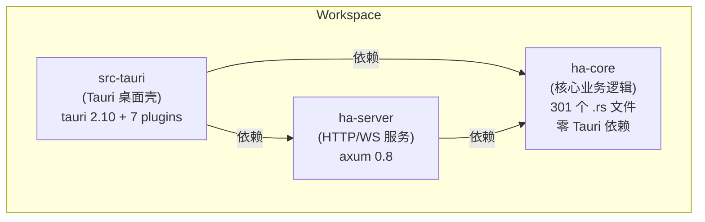
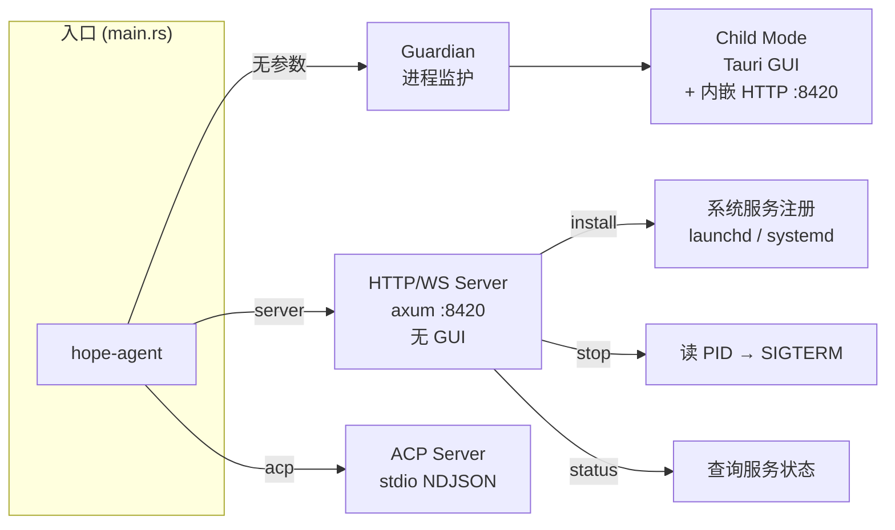
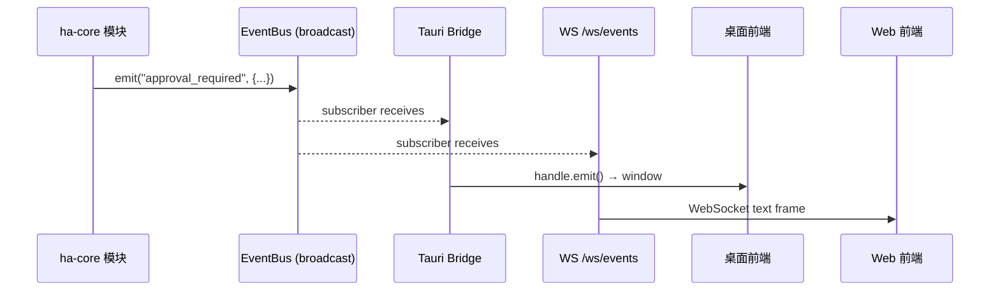
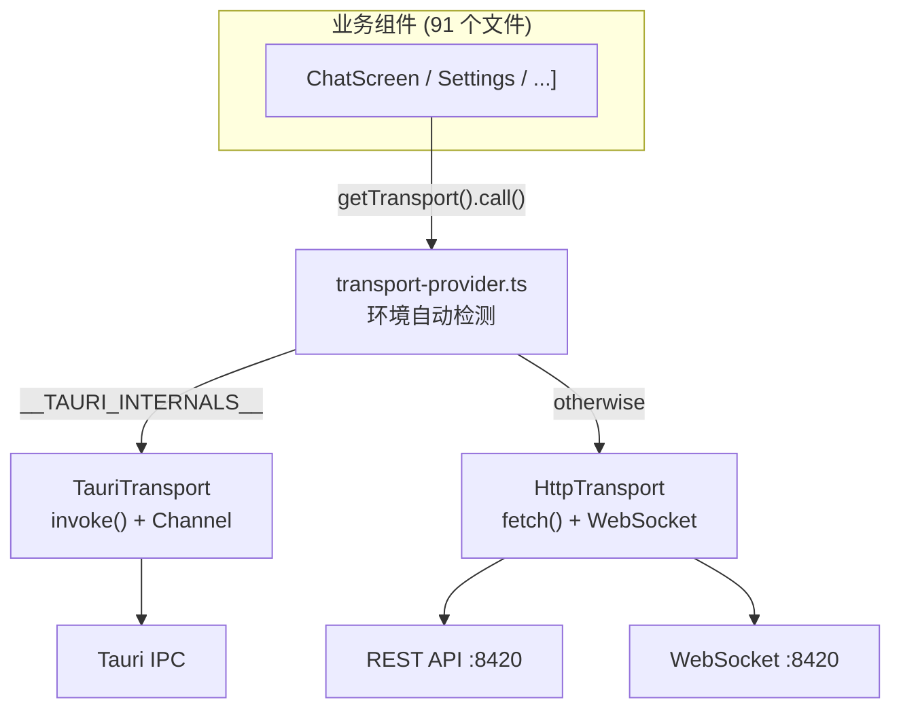
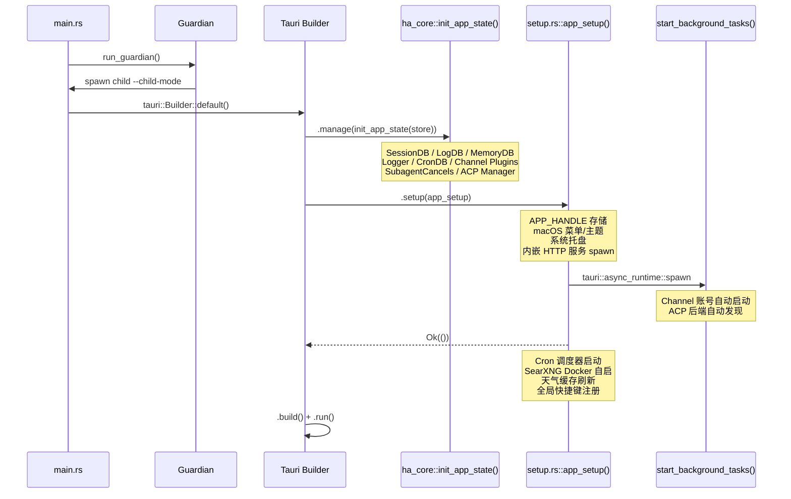
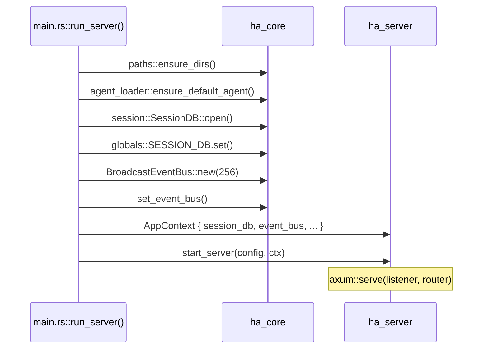
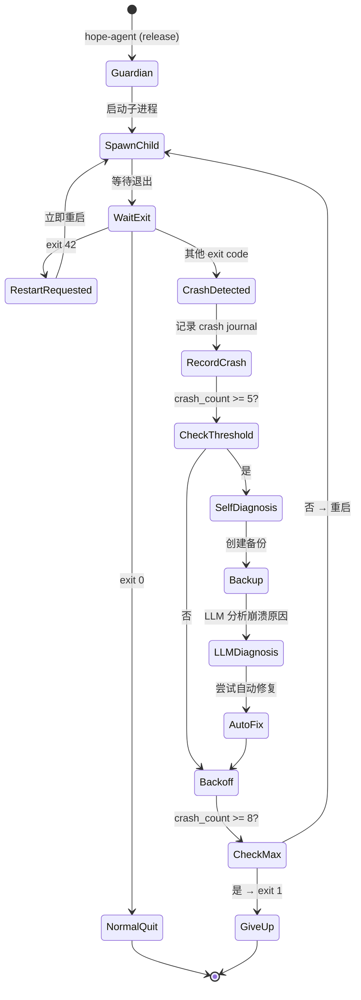
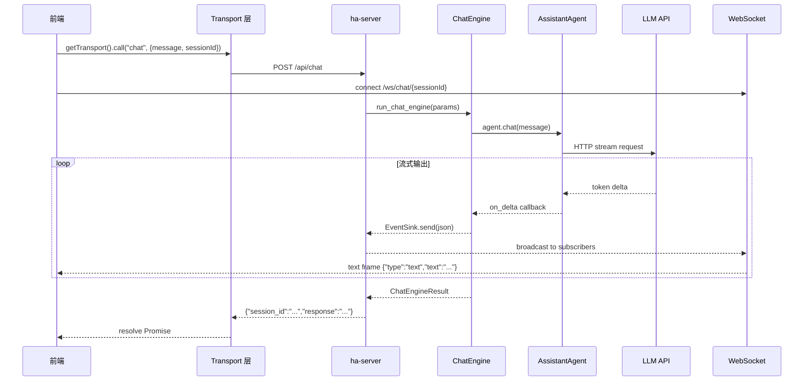

# 前后端分离架构

> 返回 [文档索引](../README.md) | 关联源码：`Cargo.toml`, `crates/ha-core/`, `crates/ha-server/`, `src-tauri/`

## 设计目标

将 Hope Agent 从 Tauri 单体应用重构为三层架构（核心库 / HTTP 服务 / 桌面壳），实现：

1. **核心逻辑框架无关** — `ha-core` 零 Tauri 依赖，可被任何 Rust 程序引用
2. **多入口运行** — 桌面 GUI、HTTP 守护进程、CLI stdio 三种模式共享同一核心
3. **前端双模式** — 同一 React 前端可在 Tauri WebView 和独立浏览器中运行

## Crate 依赖关系



**铁律**：`ha-core` 的 `Cargo.toml` 禁止出现 `tauri` 或 Tauri 插件依赖。

## 各 Crate 职责

### ha-core（核心库）

| 职责 | 说明 |
|------|------|
| 业务逻辑 | Agent、Chat Engine、Tool Loop、Plan Mode、Memory、Subagent 等全部核心能力 |
| 数据存储 | SessionDB、MemoryDB、LogDB、CronDB、ChannelDB — 全部 SQLite |
| 状态管理 | `AppState` + `OnceLock` 全局单例 + accessor 函数 |
| 事件系统 | `EventBus` trait — 替代原 Tauri `APP_HANDLE.emit()` |
| 接入层 | 12 个 IM 渠道插件、ACP stdio 协议 |
| 基础设施 | Guardian 保活、Service Install、Crash Journal、Self-Diagnosis |

**模块清单（40+）**：

```
agent/          AssistantAgent + 4 种 Provider + Side Query
chat_engine/    ChatEngineParams → EventSink 流式输出
memory/         SQLite + FTS5 + vec0 向量 + 8 种 Embedding
tools/          31 个内置工具 + 并发/串行执行引擎
channel/        12 个 IM 插件 + Worker 分发 + 媒体管道
plan/           六态状态机 + 双 Agent + 步骤追踪
subagent/       spawn + inject + Mailbox + 深度控制
skills/         SKILL.md 发现 + 懒加载 + Fork 模式
provider/       28 模板 + Failover Chain + Proxy
context_compact/ 5 层渐进式压缩 + API-Round 分组
session/        会话 + 消息持久化 + FTS5 搜索
cron/           定时任务 + Agent 执行
acp/            stdio JSON-RPC 服务器
acp_control/    ACP 控制面 + Runtime 发现
event_bus.rs    EventBus trait + BroadcastEventBus
globals.rs      10 个 OnceLock 全局 + AppState
guardian.rs     进程监护 + 指数退避 + 自修复
service_install.rs  macOS launchd / Linux systemd 注册
paths.rs        ~/.hope-agent/ 统一路径
logging/        非阻塞双写 + 脱敏
...
```

### ha-server（HTTP/WS 服务）

| 职责 | 说明 |
|------|------|
| REST API | 43 个端点（sessions/chat/providers/memory/config/agents） |
| WebSocket | `/ws/events`（全局事件广播）+ `/ws/chat/{session_id}`（流式输出） |
| 路由框架 | axum 0.8 + tower-http CORS |
| API Key 鉴权 | `middleware.rs` — `Authorization: Bearer` 头 + `?token=` 查询参数，`/api/health` 免鉴权 |
| 错误处理 | `AppError` — 显式 status code，不做字符串匹配 |

**关键类型**：

```rust
pub struct AppContext {
    pub session_db: Arc<SessionDB>,
    pub event_bus: Arc<dyn EventBus>,
    pub chat_streams: Arc<ChatStreamRegistry>,  // per-session WS 广播
    pub chat_cancels: Arc<RwLock<HashMap<String, Arc<AtomicBool>>>>,  // per-session 取消
}
```

### src-tauri（桌面壳）

| 职责 | 说明 |
|------|------|
| Tauri IPC | 150+ `#[tauri::command]` 处理函数 |
| 桌面集成 | 系统托盘、全局快捷键、窗口管理、macOS 菜单 |
| 薄封装 | `tauri_wrappers.rs` 为 ha-core 无 `#[tauri::command]` 的函数添加属性 |
| 内嵌服务 | `setup.rs` 中 spawn ha-server，配置从 `config.json` 的 `server` 字段读取 |
| 入口管理 | Guardian / Child / Server / ACP 四种模式 |

**文件结构（9 个文件）**：

```
src-tauri/src/
  lib.rs              pub use ha_core::*; + Tauri Builder
  main.rs             入口分发（server/acp/guardian/child）
  globals.rs          APP_HANDLE（仅 Tauri 专用）
  app_init.rs         薄封装 → ha_core::init_app_state()
  setup.rs            app_setup()：内嵌 HTTP 服务 + 快捷键 + 托盘
  commands/           150+ Tauri IPC 命令处理
  tauri_wrappers.rs   22 个薄 #[tauri::command] 封装
  shortcuts.rs        全局快捷键处理
  tray.rs             系统托盘菜单
```

---

## 运行模式



### 1. 桌面模式（默认）

```
hope-agent → Guardian → Child (Tauri GUI + 内嵌 HTTP)
```

- Guardian 监护子进程，崩溃自动重启（指数退避 1s→30s，最多 8 次）
- 第 5 次崩溃触发 backup + self-diagnosis + auto-fix
- 子进程启动 Tauri GUI，`setup.rs` 中同时 spawn ha-server
- 前端通过 Tauri IPC 调用后端（也可通过内嵌 HTTP 服务）
- 内嵌服务器配置从 `config.json` 的 `server` 字段读取（`EmbeddedServerConfig`）：
  - `bindAddr`：监听地址（默认 `127.0.0.1:8420`，设为 `0.0.0.0:8420` 可对外暴露）
  - `apiKey`：API Key 鉴权（`null` = 无鉴权）
- 修改后需重启应用生效

### 2. 服务器模式

```
hope-agent server [--bind 0.0.0.0:8420] [--api-key KEY]
```

- 无 GUI，纯 HTTP/WS 守护进程
- CLI `--api-key` 参数优先于 config.json 配置
- 初始化 ha-core 全部子系统（DB、IM 渠道、ACP、Cron）
- 写 PID 文件到 `~/.hope-agent/server.pid`
- 支持系统服务注册：

| 命令 | 说明 |
|------|------|
| `server install` | 注册系统服务（macOS launchd / Linux systemd） |
| `server uninstall` | 卸载系统服务 |
| `server status` | 查询运行状态 |
| `server stop` | 发送 SIGTERM 停止 |

### 3. ACP 模式

```
hope-agent acp [--agent-id default] [--verbose]
```

- stdio NDJSON JSON-RPC 协议
- 用于 IDE 直连（Zed、VS Code 等）

---

## 事件系统



### EventBus 架构

| 层 | 组件 | 说明 |
|----|------|------|
| 定义 | `ha-core::event_bus::EventBus` trait | `emit()` + `subscribe()` |
| 实现 | `BroadcastEventBus` | `tokio::sync::broadcast` channel |
| 桥接（Tauri） | `setup.rs` → EventBus subscriber → `handle.emit()` | 转发到 Tauri WebView |
| 桥接（HTTP） | `ws/events.rs` → EventBus subscriber → WS frame | 转发到 WebSocket 客户端 |
| 桥接（IM） | `ChannelStreamSink` → EventBus + mpsc | 转发到 IM 渠道 |

### 事件清单

| 事件名 | 来源 | 用途 |
|--------|------|------|
| `approval_required` | tools/approval.rs | 工具执行需要用户审批 |
| `agent:send_notification` | tools/notification.rs | 桌面通知 |
| `channel:stream_delta` | chat_engine/types.rs | IM 渠道流式 token |
| `channel:message_update` | channel/worker | IM 会话有新消息 |
| `channel:stream_start/end` | channel/worker | IM 流式状态变更 |
| `subagent_event` | subagent/helpers.rs | 子 Agent 生命周期 |
| `parent_agent_stream` | subagent/helpers.rs | 子 Agent 结果注入主对话 |
| `core_memory_updated` | tools/memory.rs | 记忆变更 |
| `ask_user_request` | tools/ask_user_question.rs | 向用户发起结构化问答 |
| `cron:run_completed` | cron/executor.rs | 定时任务完成 |
| `acp_control_event` | acp_control/events.rs | ACP 运行生命周期 |

---

## 前端 Transport 抽象层



### Transport 接口

```typescript
interface Transport {
  call<T>(command: string, args?: Record<string, unknown>): Promise<T>;
  openChatStream(sessionId: string | null, onEvent: (event: string) => void): ChatStream;
  listen(eventName: string, handler: (payload: unknown) => void): () => void;
}
```

### 运行时切换

```typescript
// 自动检测
getTransport()  // → TauriTransport 或 HttpTransport

// 手动切换（设置面板）
switchToRemote("https://my-server.com")  // 连接远程服务
switchToEmbedded()                        // 切回本地
```

### HttpTransport 命令映射

`transport-http.ts` 内部维护 143 个命令到 REST 端点的映射表：

```typescript
const COMMAND_MAP = {
  "list_sessions_cmd":  { method: "GET",    path: "/api/sessions" },
  "create_session_cmd": { method: "POST",   path: "/api/sessions" },
  "delete_session_cmd": { method: "DELETE",  path: "/api/sessions/{sessionId}" },
  "chat":               { method: "POST",   path: "/api/chat" },
  "get_providers":      { method: "GET",    path: "/api/providers" },
  // ... 138 more
};
```

---

## 初始化流程



### 服务器模式初始化（无 Tauri）



---

## 全局状态管理

### OnceLock 单例（ha-core）

| 静态变量 | 类型 | 用途 |
|---------|------|------|
| `EVENT_BUS` | `Arc<dyn EventBus>` | 事件广播 |
| `APP_LOGGER` | `AppLogger` | 结构化日志 |
| `SESSION_DB` | `Arc<SessionDB>` | 会话数据库 |
| `MEMORY_BACKEND` | `Arc<dyn MemoryBackend>` | 记忆存储 |
| `CRON_DB` | `Arc<CronDB>` | 定时任务 |
| `SUBAGENT_CANCELS` | `Arc<SubagentCancelRegistry>` | 子 Agent 取消 |
| `CHANNEL_REGISTRY` | `Arc<ChannelRegistry>` | IM 插件注册表 |
| `CHANNEL_DB` | `Arc<ChannelDB>` | IM 会话映射 |
| `ACP_MANAGER` | `Arc<AcpSessionManager>` | ACP 控制面 |
| `APP_STATE` | `Arc<AppState>` | 完整应用状态 |

### AppState 字段

| 字段 | 类型 | 说明 |
|------|------|------|
| `agent` | `Mutex<Option<AssistantAgent>>` | 当前 Agent 实例 |
| `config` | `Mutex<AppConfig>` | Provider 配置 |
| `session_db` | `Arc<SessionDB>` | 会话 DB |
| `chat_cancel` | `Arc<AtomicBool>` | 桌面模式取消标记 |
| `reasoning_effort` | `Mutex<String>` | 推理强度 |
| `codex_token` | `Mutex<Option<(String, String)>>` | Codex OAuth |
| `current_agent_id` | `Mutex<String>` | 当前 Agent ID |
| `log_db` / `logger` | LogDB / AppLogger | 日志 |
| `cron_db` | `Arc<CronDB>` | Cron |
| `subagent_cancels` | SubagentCancelRegistry | 子 Agent |
| `channel_cancels` | ChannelCancelRegistry | IM 渠道 |

### Tauri 专属全局（src-tauri）

| 静态变量 | 类型 | 用途 |
|---------|------|------|
| `APP_HANDLE` | `tauri::AppHandle` | Tauri 事件发射、窗口管理 |

---

## Guardian 保活机制



| 参数 | 默认值 | 说明 |
|------|--------|------|
| `max_crashes` | 8 | 最大连续崩溃次数 |
| `diagnosis_threshold` | 5 | 触发自修复的崩溃次数 |
| `crash_window_secs` | 600 | 超过此时间无崩溃重置计数器 |
| `backoff_delays` | [1, 3, 9, 15, 30] | 指数退避延迟（秒） |

---

## 系统服务注册

### macOS (launchd)

```
~/Library/LaunchAgents/com.hopeagent.server.plist
```

| 配置项 | 值 |
|--------|-----|
| Label | `com.hopeagent.server` |
| KeepAlive | `true`（进程消失自动拉起） |
| RunAtLoad | `true`（开机自启） |
| ProgramArguments | `[exe_path, "server", "--bind", addr]` |
| StandardOutPath | `~/.hope-agent/logs/server.stdout.log` |
| StandardErrorPath | `~/.hope-agent/logs/server.stderr.log` |

### Linux (systemd)

```
~/.config/systemd/user/hope-agent.service
```

| 配置项 | 值 |
|--------|-----|
| Restart | `on-failure` |
| RestartSec | `3` |
| WantedBy | `default.target` |

---

## HTTP API 端点一览

### Sessions

| Method | Path | 说明 |
|--------|------|------|
| POST | `/api/sessions` | 创建会话 |
| GET | `/api/sessions` | 列表（?agent_id=&limit=&offset=） |
| GET | `/api/sessions/{id}` | 获取会话 |
| DELETE | `/api/sessions/{id}` | 删除会话 |
| PATCH | `/api/sessions/{id}` | 重命名 |
| GET | `/api/sessions/{id}/messages` | 加载消息（?limit=50） |

### Chat

| Method | Path | 说明 |
|--------|------|------|
| POST | `/api/chat` | 发起对话（事件通过 WS 推送） |
| POST | `/api/chat/stop` | 停止指定 session 的对话 |
| POST | `/api/chat/approval/{request_id}` | 工具审批响应 |
| GET | `/api/chat/system-prompt` | 当前系统提示词 |
| GET | `/api/chat/tools` | 可用工具列表 |

### Providers

| Method | Path | 说明 |
|--------|------|------|
| GET | `/api/providers` | 列表 |
| POST | `/api/providers` | 添加 |
| PUT | `/api/providers/{id}` | 更新 |
| DELETE | `/api/providers/{id}` | 删除 |
| POST | `/api/providers/test` | 测试连接 |
| GET | `/api/providers/active-model` | 当前模型 |
| PUT | `/api/providers/active-model` | 切换模型 |

### Memory

| Method | Path | 说明 |
|--------|------|------|
| POST | `/api/memory` | 添加记忆 |
| GET | `/api/memory` | 列表（?limit=&offset=&scope=） |
| GET | `/api/memory/{id}` | 获取 |
| PUT | `/api/memory/{id}` | 更新 |
| DELETE | `/api/memory/{id}` | 删除 |
| POST | `/api/memory/search` | 语义搜索 |
| GET | `/api/memory/count` | 计数 |
| GET | `/api/memory/stats` | 统计 |

### Config

| Method | Path | 说明 |
|--------|------|------|
| GET/PUT | `/api/config/user` | 用户配置 |
| GET/PUT | `/api/config/web-search` | 搜索引擎配置 |
| GET/PUT | `/api/config/proxy` | 代理配置 |
| GET/PUT | `/api/config/compact` | 压缩配置 |
| GET/PUT | `/api/config/notification` | 通知配置 |
| GET/PUT | `/api/config/server` | 内嵌服务器配置（bind 地址 + API Key） |

### Agents

| Method | Path | 说明 |
|--------|------|------|
| GET | `/api/agents` | 列表 |
| GET | `/api/agents/{id}` | 获取配置 |
| PUT | `/api/agents/{id}` | 保存配置 |
| DELETE | `/api/agents/{id}` | 删除 |

### WebSocket

| Path | 说明 |
|------|------|
| `/ws/events` | 全局事件广播（多客户端同步） |
| `/ws/chat/{session_id}` | 对话流式输出（per-session broadcast） |

### Health

| Method | Path | 说明 |
|--------|------|------|
| GET | `/api/health` | `{"status":"ok","version":"0.1.0"}`（免鉴权） |

---

## 数据流：一次完整对话



---

## 多客户端支持

| 层面 | 机制 | 说明 |
|------|------|------|
| 全局事件 | `BroadcastEventBus` | 每个 WS 连接独立 Receiver，所有客户端同步收到 |
| 会话流式 | `ChatStreamRegistry` per-session broadcast | 多端可订阅同一 session 实时观看 |
| 并发对话 | per-session `AtomicBool` cancel map | 不同客户端不同会话互不干扰 |
| 审批系统 | EventBus 广播 + oneshot 响应 | 任何客户端可响应审批请求 |
