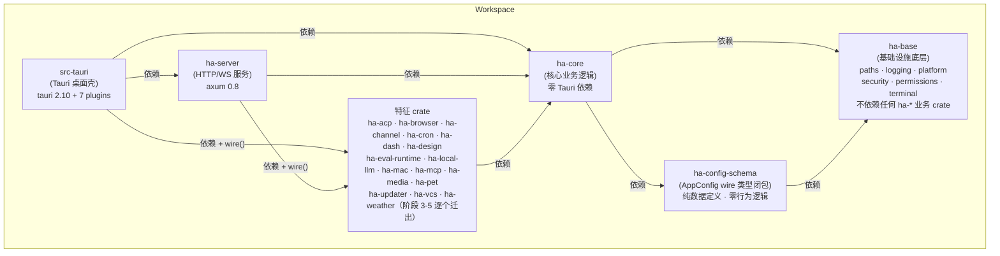
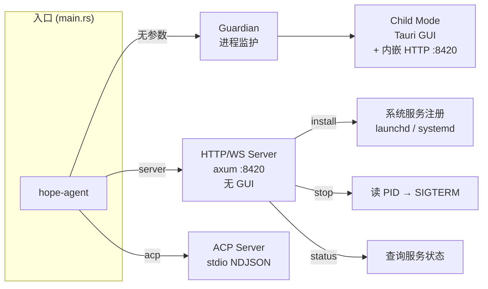
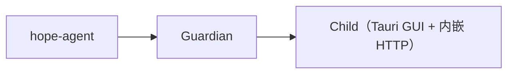
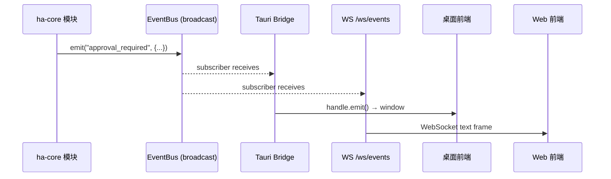
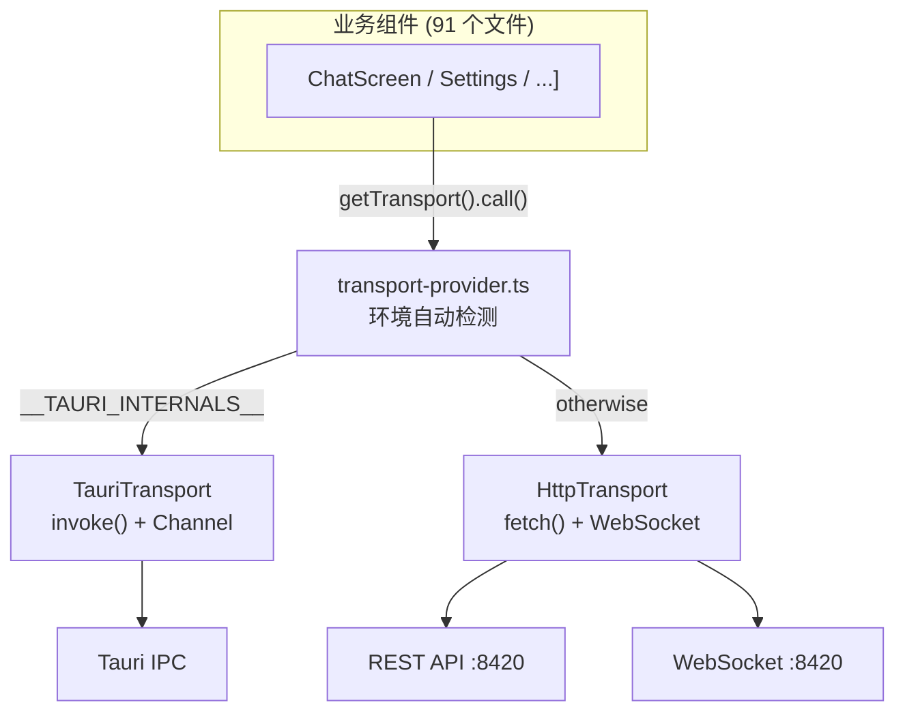
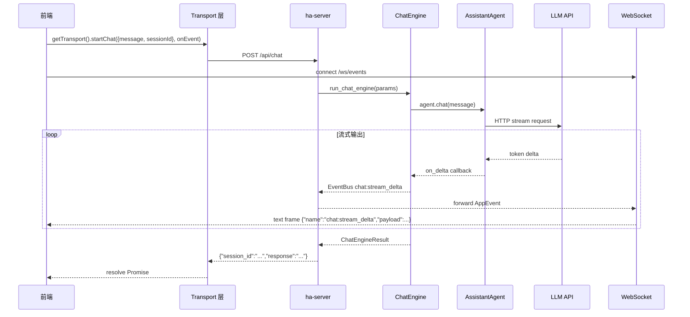

# 前后端分离架构

> 返回 [文档索引](../README.md) | 关联源码：`Cargo.toml`, `crates/ha-base/`, `crates/ha-core/`, `crates/ha-server/`, `src-tauri/`

## 设计目标

将 Hope Agent 从 Tauri 单体应用重构为分层架构（基础设施 / 核心库 / HTTP 服务 / 桌面壳），实现：

1. **核心逻辑框架无关** — `ha-core` 零 Tauri 依赖，可被任何 Rust 程序引用
2. **多入口运行** — 桌面 GUI、HTTP 守护进程、CLI stdio 三种模式共享同一核心
3. **前端双模式** — 同一 React 前端可在 Tauri WebView 和独立浏览器中运行

## Crate 依赖关系


```mermaid
graph TD
    subgraph Workspace
        HA_TAURI["src-tauri<br/>(Tauri 桌面壳)<br/>tauri 2.10 + 7 plugins"]
        HA_SERVER["ha-server<br/>(HTTP/WS 服务)<br/>axum 0.8"]
        HA_FEAT["特征 crate<br/>ha-acp · ha-browser · ha-channel · ha-cron · ha-dash · ha-design<br/>ha-eval-runtime · ha-local-llm · ha-mac · ha-mcp · ha-media · ha-pet<br/>ha-updater · ha-vcs · ha-weather（阶段 3-5 逐个迁出）"]
        HA_CORE["ha-core<br/>(核心业务逻辑)<br/>零 Tauri 依赖"]
        HA_SCHEMA["ha-config-schema<br/>(AppConfig wire 类型闭包)<br/>纯数据定义 · 零行为逻辑"]
        HA_BASE["ha-base<br/>(基础设施底层)<br/>paths · logging · platform<br/>security · permissions · terminal<br/>不依赖任何 ha-* 业务 crate"]
    end

    HA_TAURI -->|"依赖"| HA_SERVER
    HA_TAURI -->|"依赖 + wire()"| HA_FEAT
    HA_TAURI -->|"依赖"| HA_CORE
    HA_SERVER -->|"依赖 + wire()"| HA_FEAT
    HA_SERVER -->|"依赖"| HA_CORE
    HA_FEAT -->|"依赖"| HA_CORE
    HA_CORE -->|"依赖"| HA_SCHEMA
    HA_CORE -->|"依赖"| HA_BASE
    HA_SCHEMA -->|"依赖"| HA_BASE

```

**三条铁律**：

1. `ha-core` / `ha-config-schema` / `ha-base` 与全部特征 crate（`ha-updater` 起）的 `Cargo.toml` 禁止出现 `tauri` 或 Tauri 插件依赖。
2. `ha-base` 禁止依赖任何 `ha-*` 业务 crate。需要上层数据时**留注册钩子**，
   由 `ha-core` 在 `init_runtime()` 早期注入（见下方 ha-base 小节）。
3. `ha-config-schema` 只放数据定义（类型 + 自包含 impl + serde helper），
   只准依赖 ha-base 与叶子 crate；任何需要子系统服务的行为
   （`cached_config` / `mutate_config` / redact / validate / SSRF）留在 ha-core
   （见下方 ha-config-schema 小节）。

## 各 Crate 职责

### ha-base（基础设施底层）

依赖图最底层。这里只放**与业务无关的原语**：路径解析、日志、跨平台 shim、
安全守卫、系统权限、内嵌终端、阻塞 IO helper、TTL 缓存、EventBus trait。

| 职责 | 说明 |
|------|------|
| 路径单一来源 | `paths.rs` — 所有 `~/.hope-agent/` 下的路径入口 |
| 日志 | `logging/` — `AppLogger` / `LogDB` / `app_info!` 系列宏 + `APP_LOGGER` / `LOG_DB` 全局 |
| 跨平台原语 | `platform/` — 进程树终止、代理探测、原子替换、keep-awake、WSL |
| 安全守卫 | `security/` — SSRF 检查、Dangerous Mode 判定、HTTP 流式读取上限 |
| 系统权限 | `permissions.rs` — macOS/Windows 系统权限目录与请求 |
| 运行模式与版本 | `runtime_role.rs` — `RUNTIME_ROLE` / `APP_VERSION` 全局 + `is_desktop()` / `is_acp()` / `app_version()`（角色由装配层 `init_runtime` 经 `set_runtime_role` 写入） |
| 进程簿记 | `process_registry.rs` — 后台进程会话表；退出/输出通知经 `register_notifiers` 由上层注入 |
| 其它原语 | `blocking.rs` / `ttl_cache.rs` / `runtime_lock.rs` / `event_bus.rs` / `terminal.rs` / `crash_journal.rs` |

**反向依赖靠注册钩子解决**（ha-base 不能 `use` `AppConfig`）：

| 钩子 | 未注册时的行为 | 冲突（重复注册）时 |
|------|---------------|------------------|
| `paths::register_plans_dir_source` | 回落 `~/.hope-agent/plans/` | 记 `app_error!`，继续启动 |
| `process_registry::register_notifiers` | 不发进程退出/输出通知（簿记不受影响） | 记 `app_error!`，继续启动 |
| `security::dangerous::register_config_flag_source` | 返回 `false`（**fail-closed**，Dangerous Mode 配置来源视为未开启） | **panic**——它控制全局审批跳过，来源被顶替不可接受 |

**`ha-core` 对下游完全透明**：`lib.rs` 用 `pub use ha_base::*` + `#[macro_use]
extern crate ha_base` 全量再导出，所以 ha-core 内部的 `crate::paths::…` 与下游的
`ha_core::platform::…` / `ha_core::app_warn` **路径全部不变**。

> `app_info!` 展开为 `$crate::get_logger()`，`$crate` 解析到**定义宏的 crate**，
> 所以 `APP_LOGGER` / `LOG_DB` 及其 `require_*` 访问器必须与宏同住 ha-base；
> `globals.rs` 改为再导出以保持 `crate::globals::APP_LOGGER` 等既有路径。

### ha-config-schema（配置 wire 类型）

`AppConfig` 及其全部传递类型闭包（22 个子系统的 `*Config` / 枚举 / serde
helper / 自包含 impl）。**模块路径镜像 ha-core**（`memory` / `config` /
`tools::web_search` / `knowledge::maintenance` …），根部 `pub use ha_base::*`
与 ha-core 同构——因此被搬代码里 `crate::memory::X`、`crate::default_true`、
`crate::security::ssrf::SsrfConfig` 这类内部引用**原样成立**，`AppConfig::default()`
的四十余处 `crate::<mod>::XxxConfig::default()` 路径搬入后自然消解。

**再导出契约**：ha-core 各子系统在**原定义文件**里 `pub use
ha_config_schema::<mod>::{…};` 顶替被搬定义，既有 re-export 链
（`memory/mod.rs` 的 `pub use types::*` 等）不动，所以全仓
`crate::config::AppConfig` / `ha_core::mcp::McpServerConfig` 等路径零改动。
`config/mod.rs` 用 glob `pub use ha_config_schema::config::*;`。

**行为边界**（新增字段时最常踩的线）：

| 归属 | 内容 |
|------|------|
| schema | 类型定义、`Default`、clamp/effective 等只碰自身字段的 impl、serde default helper、`DEFAULT_AGENT_ID` 常量 |
| ha-core | `cached_config` / `mutate_config`（persistence）、redact 脱敏接线、`validate_server_config` / `check_ssrf` / `ssrf_policy_for` 等子系统自由函数、`HooksConfigExt` / `MaintenanceTasksExt` 扩展 trait（方法引用未下沉类型时的 coherence 出口） |

> 例外记录：`context_compact` 的 `default_tool_policies` 在 schema 侧用工具名
> 字面量（wire 格式 key，schema 不能反向依赖 ha-core 的 `TOOL_*` 常量），由
> ha-core `default_tool_policies_match_tool_name_constants` 测试锁死一致性；
> config 模块的纯类型测试（默认值 / 钳制 / serde 兼容）随类型住在 schema，
> `cargo test -p ha-config-schema` 已进 pre-push / CI 门禁。

### ha-core（核心库）

| 职责 | 说明 |
|------|------|
| 业务逻辑 | Agent、Chat Engine、Tool Loop、Plan Mode、Memory、Subagent、MCP、Project、Local LLM 等全部核心能力 |
| 数据存储 | SessionDB、MemoryDB、LogDB、CronDB、ChannelDB、ProjectDB、AsyncJobDB、LocalModelJobDB — 全部 SQLite（RecapDB 已随 ha-dash 迁出；大盘另有一条 `SQLITE_OPEN_READ_ONLY` 的 sessions/cron 读连接，见特征 crate 一节） |
| 状态管理 | `AppState` + `OnceLock` 全局单例 + accessor 函数 |
| 事件系统 | `EventBus` trait — 替代原 Tauri `APP_HANDLE.emit()` |
| 接入层 | 12 个 IM 渠道插件、ACP stdio 协议、MCP 客户端（4 种 transport） |
| 基础设施 | Guardian 保活、Self-Diagnosis（路径 / 日志 / 平台 / 安全 / runtime_lock 等原语已下沉 ha-base）|

**主要模块**（精确清单以 `ls crates/ha-core/src/` 为准，整体 ~50+ 顶层模块）：

```
agent/             AssistantAgent + 4 种 Provider + Side Query
chat_engine/       ChatEngineParams → EventSink 流式输出
memory/            SQLite + FTS5 + vec0 向量 + 多种 Embedding（含 dreaming）
tool_defs/         工具契约层：TOOL_* 名字常量 / ToolDefinition 家族 /
                   ToolExecContext / ToolScope / ToolRejection（详见下文）
tools/             内置工具集 + 并发/串行执行引擎（具体工具数量以 tools/ 子模块为准）
channel/           12 个 IM 插件（telegram / wechat / slack / feishu / discord / qqbot /
                   irc / signal / imessage / whatsapp / googlechat / line）+ Worker 分发 + 媒体管道
plan/              5 态状态机（plan 设计契约 + task 进度真相）+ 步骤追踪
subagent/          spawn + inject + Mailbox + 深度控制
skills/            SKILL.md 发现 + 懒加载 + Fork 模式 + draft 审核
provider/          多模板 + Failover Chain + Proxy + crud helper
                   （所有 provider/active_model 写入必须走 provider/crud.rs，详见下文）
context_compact/   5 层渐进式压缩 + API-Round 分组
session/           会话 + 消息持久化 + FTS5 搜索
project/           Project 容器（工作目录即真实文件，无独立 project_files；无反向 channel 认领）
mcp/               MCP 客户端（stdio / Streamable HTTP / SSE / WebSocket）
cron/              **台账**：CronDB + 排程算术 + 内存取消注册表（调度器 /
                   执行器 / 投递已随 ha-cron 迁出，见下文特征 crate 一节）
cron_defs/         cron_jobs / cron_run_logs 的 wire 类型（契约层）
coding_eval_defs.rs 评测 wire 类型（契约层；机器随 ha-eval-runtime 迁出，
                   kernel 的 coding_improvement 存的就是这些报告的 JSON）
cron_hooks.rs      cron 机器的反向钩子（起任务 / 取消 / 注入回投）
loop_control.rs    托管 /loop（复用 cron 持久化调度；**整体留 kernel**——
                   有 58 方法的 impl SessionDB 块）
local_model_jobs.rs 通用后台任务台账（DB / 快照 / spawn / finish / 进度；
                   memory reembed 与知识库 reembed 共用。Ollama 执行器已随
                   ha-local-llm 迁出，见下文特征 crate 一节）
async_jobs/        异步工具后台执行 + 重启回放
team/              Agent Team 模板 + 实例 + 任务
recap_hooks.rs     `/recap` 分发钩子（正文随 ha-dash 迁出，装配层只留 trampoline）
activity.rs        autonomy 活动快照（`impl SessionDB` 扩展，Core 工具 tools::goal 消费——
                   **刻意留 kernel**，代价见特征 crate 一节的 ha-dash 条目）
awareness/         跨会话行为感知 suffix
config/            cached_config / mutate_config（详见下文）
learning_events.rs Learning 埋点**发布面**（kernel 事件通道，见下文）
slash_defs/        Slash 命令契约层：命令表 / wire 类型 / parser / fuzzy /
                   转录落库 / 选择器渲染（详见下文）
slash_hooks.rs     Slash 分发三槽（装配层 → kernel / IM 渠道的唯一回调面）
slash_commands/    Slash **装配层**（handler 调各特征，位置在依赖图顶端）
globals.rs         OnceLock 全局 + AppState（logger / LogDB 全局已下沉 ha-base 并再导出）
guardian.rs        进程监护 + 指数退避 + 自修复
...
```

#### tool_defs（工具契约层）vs tools（分发注册表）

`tools/` 是**分发注册表 + adapter 目录**：它按名字认识每个工具实现，未来
随特征 crate 继续上浮。但 kernel 的 agent / async_jobs / permission /
system_prompt / context_compact 等模块只需要**契约物**——工具名常量、
schema 类型、执行上下文——把它们放在 `tools/` 会让「人人依赖的中间层」
同时指向全部特征，一个模块就把依赖图焊死（crate-split 方案 §3.2）。

因此契约物归位 [`tool_defs/`](../../crates/ha-core/src/tool_defs/)：

| 落点 | 内容 |
|------|------|
| `tool_defs/names.rs` | 全部内置工具的 `TOOL_*` 名字常量 + `IMAGE_BASE64_PREFIX` / `ASYNC_JOB_TIMEOUT_ARG`（纯字面量、零依赖）。`feishu_*` 名字例外，见下 |
| `tool_defs/types.rs` · `metadata.rs` | `ToolDefinition` / `ToolTier` / `CoreSubclass` / `BackgroundPolicy` + v2 sidecar metadata |
| `tool_defs/context.rs` | `ToolExecContext` 本体与卫星类型（`SessionDbHandle` / `PidSink` / `EffectiveArgsSink` / `ApprovalOrigin`）+ 与分发无关的纯方法 + runtime-timeout 策略三函数 |
| `tool_defs/scope.rs` | `ToolScope` 与 `is_memory_tool` / `is_kb_scoped_tool` / `is_*_scope_tool` / `tool_visible_with_filters` 可见性谓词 |
| `tool_defs/rejection.rs` | `ToolRejection` / `TOOL_ERROR_PREFIX` |
| `tool_defs/mac_control.rs` | `MacControlFocusAnchor` + `normalize_perform_ax_action`（审批分类代码不外迁红线） |
| `tool_defs/{extra,goal,loop,plan,task,update}_tools.rs` | 零外部依赖的单工具 schema 构造器 |
| `tool_defs/mod.rs` | 门面 `pub use` + `ToolProvider`（provider schema 适配枚举）+ `expand_tilde` |

`feishu_*` 名字常量已下沉 `tool_defs/names.rs` 的 `feishu_names` 子模块
（阶段 5 第五刀兑现——此前那条「刻意不下沉、留给 ha-channel 那刀一起破」的
例外就此关闭）。**整组 35 个一起下沉、不拆一半**：`permission::engine` 的
`classify_external_connector_action` 精确匹配其中 13 个，`EDIT_TOOLS` /
`permission::rules` / `hooks::condition` 另外要认
`TOOL_DRIVE_{UPLOAD,DOWNLOAD}_MEDIA`，而 adapter 整组随 ha-channel 上浮——
拆一半只会制造两处名字表。`ha_channel::tools::feishu` 对它 glob 再导出，
adapter 侧 `feishu::TOOL_*` 写法逐字不变；kernel 调用点用
`use crate::tool_defs::feishu_names as feishu;` 别名，13 个 match 分支一个字没动。
子模块名带 `_names` 后缀是**必须的**：叫 `feishu` 会与 `tools::feishu` 在
`tools/mod.rs` 的 glob 里撞名（rustc `private_item_shadows_public_glob_reexport`）。

**方向红线**：`tool_defs` 的**生产代码绝不**依赖 `tools::dispatch` /
`tools::registry` / 任何 adapter。需要分发层行为的方法一律改 extension
trait 挂在分发侧——`ToolDefinition::to_api_metadata` 因为要读
`is_globally_configured`（web_search / media_gen / feishu 配置态探测）
而成为
[`tools::dispatch::ToolDefinitionApiExt`](../../crates/ha-core/src/tools/dispatch.rs)，
与 ha-config-schema 的同名出口模式一致。**注意这条 trait 不在
`crate::tools` 门面 glob 里**：调用方须显式
`use ha_core::tools::dispatch::ToolDefinitionApiExt`（两个壳层的
`list_builtin_tools` 已接）。

> 遗留测试边（已知、刻意保留）：`tool_defs/types.rs` 与 `metadata.rs` 的
> `#[cfg(test)]` 里有 3 处 `crate::tools::dispatch::all_dispatchable_tools()`
> / `normalize_call_variant` 全表遍历断言。`cfg(test)` 不进 release 依赖图，
> 但 `tools/` 真正上浮为特征 crate 时 `cargo test` 仍要编——届时随
> crate-split 方案 §6 的通用做法挪进 `tests/` 集成测试。

**自动守卫**：同 crate 内加一条回边照样编译，光靠 review 守不住——
[`scripts/analyze-crate-deps.mjs`](../../scripts/analyze-crate-deps.mjs)
默认模式对 `tool_defs → tools::*` 生产边**零容忍**（非零退出），`--tests`
只放行上面登记的 3 条遗留测试边、多一条即失败。已接入 `.husky/pre-push`
与 `lint.yml` 的 frontend job（未新增 job 名，不涉 ruleset 同步）。

**公共面不放宽**：契约层子模块一律 `pub(crate) mod`，对外只暴露
`tool_defs/mod.rs` 显式 `pub use` 的 item，经 `crate::tools` glob 后
crate 外符号集与归位前**逐字相同**（`get_design_tool` 因迁移前就不在
`ha_core::tools::` 上而保持 `pub(crate) use`）。

反过来，**认识全表**的 schema 汇编留在 `tools/definitions/`：`core_tools`
（Core 总表，读 `tools::image` / `tools::settings` / `attachments` /
`awareness`）、`special_tools`（动态 schema，读 `media_gen` facade）、
`definitions/registry`（从 ToolDefinition 派生的只读查询缓存，读
`dispatch` 与 `mcp::tool_definitions`）。

kernel 新代码一律 `crate::tool_defs::…`；`crate::tools` 门面
`pub use crate::tool_defs::*` 全量再导出，故特征 crate 与壳层的
`ha_core::tools::…` 既有路径全部不变。

#### 装配层（composition root）：app_init · globals · slash_commands

分析器 `ASSEMBLY` 名单里的三个模块。名单的语义**只有一条**：以它们为
**源**的边不计入切割成本——目标形态里它们随门面 ha-core 落在特征 crate
之上，向下依赖任意特征都合法。

> 名单不等于「这三个都已经站在顶端」。实测入向：`slash_commands` 1 个模块
> （`app_init` 的钩子注册），`app_init` 5 个（裸 `is_desktop()` / `is_acp()`
> 判定），**`globals` 30 个模块 / 89 处**——它是 §3.3 记的 god registry，
> 阶段 5 才解构，现在只享受出边豁免。下面这条契约当前**只对
> `slash_commands` 成立**。

**`slash_commands` 的入向必须为零或走钩子**——否则下层模块反向依赖顶端，
拆 crate 时立刻成环。它因此拆成三块：

| 落点 | 内容 | 谁在用 |
|------|------|--------|
| [`slash_defs/`](../../crates/ha-core/src/slash_defs/)（契约层，kernel） | `registry`（内置命令静态表 + `IM_DISABLED_COMMANDS`）· `types`（`CommandAction` / `CommandResult` / 各 PickerItem）· `parser`（`is_command` / 文本→命令）· `fuzzy` · `history`（slash 转录落库 + 命令显示文本）· `canonical_builtin_command_name` · `format_session_picker_line` · `truncate_description` | IM 渠道与 kernel 直接用（对特征组零引用） |
| [`slash_hooks.rs`](../../crates/ha-core/src/slash_hooks.rs)（kernel 回调面） | 三槽原子注册：`dispatch`（执行命令）· `menu_entries`（IM 菜单同步）· `skill_command_help`（技能命令参数元数据） | 未装配语义：dispatch → `Err`（无装配的进程本就不跑 IM worker，调用方走既有错误分支、**不会**把命令喂给模型）、menu_entries → **内置命令表**（经同一 `im_menu_filter_and_cap` 收口，与装配层「`list_slash_commands` 失败回退内置表」同方向；**刻意不返回空表**——Telegram `set_my_commands` / Discord `bulk_overwrite_global_commands` 都是覆盖写，空表会抹掉平台已注册的命令，降级不该产生破坏性远端副作用）、skill_command_help → `None`（等价「不是技能命令」） |
| `slash_commands/`（装配层） | `handlers/` 全部命令实现 + 命令清单汇编 + 技能命令名冲突解析 | 只被壳层与钩子调用；`pub use` 再导出 slash_defs，既有 `slash_commands::{types,parser,registry,fuzzy}::…` 路径不变 |

钩子在 `init_runtime` 的 `REGISTER_BASE_HOOKS` 里注册（与 filesystem 根解析器、
config 写路径副作用同处）。**分析器 `ASSEMBLY` 名单与这条契约是同步关系**：
名单说「它的出边不算成本」，前提是入边已经清零或走钩子；哪天又出现特征模块
直接 `use crate::slash_commands::…`，名单就在说谎，应先把那条边改成钩子。

#### learning 事件：发布在 kernel、消费在 dashboard

`learning_events` 表的生产者遍布四层——kernel（`tools::memory` 的 recall
埋点）、未来的 ha-skills（skill CRUD）、ha-knowledge（维护调度）、以及
**已经独立的特征 crate ha-mcp**（工具调用成败）。发布面若留在 dashboard，
这些生产者全要反向依赖 ha-dash（ha-mcp 那条尤其荒谬：一个已拆出的 crate
为打点去依赖另一个特征 crate）。

发布与消费之间本就没有代码耦合，只共享表名与 kind 字符串：DDL / INSERT /
prune / 会话级联删除都在 `SessionDB`，dashboard 侧只有 4 个只读聚合。所以
`emit` + `EVT_*` 归位 [`learning_events.rs`](../../crates/ha-core/src/learning_events.rs)，
`dashboard::learning` 退化为纯订阅方并保留原路径再导出。**新增事件种类由
生产者侧声明**，dashboard 不需要预先认识——聚合按 kind 过滤，未知 kind 只是
不出现在现有卡片里。

#### 未迁出特征的依赖图：已无环（阶段 4 破环完成）

尚在 ha-core 里的 7 个候选特征（local-llm / knowledge / channel / cron /
dash / skills / improve）原本构成一个强连通分量——**环内任何成员都不能先于
破环单独成 crate**（已拆出的会依赖仍在残留 blob 里的环友，blob 又依赖已拆
出者，Cargo 直接拒绝）。四步破完：

| 步 | 手法 | 断掉的边 |
|----|------|---------|
| A | `slash_commands` 三分（见上「装配层」小节） | channel→skills 17 · skills→{cron 4, channel 3, improve 2, dash 2} |
| B | learning 事件发布面下沉 kernel（见上小节） | skills→dash 11 · knowledge→dash 1 |
| C | `im_kb_access_allowed` 随 `effective_kb_access` 归位 `knowledge::access`（纯谓词 `ChannelAccountConfig::kb_access_allowed_for` 进 ha-config-schema）——它是 KB 闸门本身、不是渠道行为 | knowledge→channel 1 |
| D | `local_model_jobs` 只留**通用后台任务台账**（DB / 快照类型 / spawn / finish / 进度写入 / 取消暂停），Ollama 执行器迁 `local_llm/jobs.rs`（阶段 5 已随 ha-local-llm 实际迁出 crate）——台账被 kernel 的 `memory::reembed_job` 与知识库 reembed 共用，本就是 kernel 设施 | knowledge→local-llm 1 |

> **已知取舍**：`retry_job` 按 kind 分派，其中 `MemoryReembed`（→ kernel）与
> `KnowledgeReembed`（→ 特征）并不是本地模型任务——它本质是任务中心「重试」
> 的**台账级**操作。但它同时要认识 5 个 Ollama kind，留 kernel 就成了
> kernel→特征 非法边，故随执行器走。后果：ha-local-llm 拆出后，壳层的通用
> retry 端点要经特征 crate 分派回 knowledge。彻底解法是「kind → starter」
> 注册表（各方装配期注册自己的 kind，与 tool registry 同型），留到阶段 5
> 装配层重整时一并做。

`node scripts/analyze-crate-deps.mjs` 现在输出「✅ 无环 —— 存在可行的拓扑
拆分顺序」。**无环 ≠ 任意顺序**：它保证的是存在一个可行顺序，而剩下的单向
边就是这个顺序的约束。当前单向边：**只剩 improve→skills 4**——dash / cron / channel 都已实际
拆出（它们的边现在是 crate 间依赖，不再进本表；ha-local-llm 同理）。

**方向：`A→B` 则 A（依赖方）先拆**，与直觉相反，理由是
`ha-core` 不依赖任何特征 crate（见下节共同契约）：

- 先拆 A：A 成为 ha-core 之上的 crate，它引用的 B 还在残留 blob 里 ⇒
  `A → ha-core`，合法；等 B 也拆出来，改成 `A → B` 仍合法。
- 先拆 B：残留 blob 里的 A 要引用已拆出的 B ⇒ `ha-core → B`，而
  `B → ha-core`，**Cargo 直接拒绝**——只能再花一轮把这条边改成钩子。
  这与「环内成员不能先于破环单独成 crate」是同一条约束的两种形态。

据此的可行顺序原为 **dash → cron → improve → channel → knowledge →
skills**；dash / cron / channel 已落地（improve 只拆出了 ha-eval-runtime
那一半，见该小节），**剩余约束只有 improve 先于 skills**。ha-local-llm
之所以能不排在这条序列里先走，正是因为它没有任何入边（需切 0）——它只依赖
别人，不被别人依赖。**新增任何特征间边前先跑
一次脚本**——成环会让后续拆分整个卡住。

### 特征 crate（ha-acp / ha-browser / ha-channel / ha-cron / ha-dash / ha-design / ha-eval-runtime / ha-local-llm / ha-mac / ha-mcp / ha-media / ha-pet / ha-updater / ha-vcs / ha-weather，阶段 3 起逐个迁出）

共同契约（对全部特征 crate 生效）：

- **依赖方向**：特征 crate → ha-core（借用 tools registry / config / EventBus
  等 kernel 服务）；**特征之间允许单向依赖**（无环即可——现有三条：
  ha-design → ha-browser（render_native 复用 Chrome PDF/截图 backend）、
  ha-design → ha-media（图/音 artifact 表单走 execute_image/execute_audio
  唯一入口）、ha-pet → ha-media（creator 生成 sprite）；
  ha-core **不知道**任何特征 crate 存在——kernel 需要特征
  行为的点全部倒转为注册钩子（工具分发条目 / 启动任务 / 专用 fn-pointer 钩子）。
- **装配**：每个调 `init_runtime` 的二进制在 init 前调 `<crate>::wire()`
  （幂等）。工具 `ToolDefinition` 仍在 ha-core（schema 目录阶段 4 才动），
  漏 wire 由 `registry_freeze` warn 兜底（有 definition 无 handler）。
- **装配任务三档**：`register_init_task(fn)`（`init_runtime` 主体内消费，
  **所有 role** 执行、tokio runtime 不保证存在——无条件子系统装配，如 acp
  的 SessionManager 创建）；`register_startup_task(StartupStage, fn)` 两档
  ——`PrimaryOnly`（原 primary-gated 块，如 updater 自动更新循环、acp
  backend 自动发现）与 `EveryProcess`（primary 门外，如 weather 桌面刷新
  ——desktop 判定在任务闭包内）。startup 两档消费点都在
  `start_background_tasks`，时序与各特征迁出前逐位一致。

各 crate：

- **ha-updater**（自升级）：manifest 检查 / 签名校验（Minisign 信任根
  `keys.rs`，CODEOWNERS 强制评审）/ 下载续传 / atomic swap / 服务重启 /
  `app_update` 工具（`tool.rs`）。红线见 [self-update](self-update.md)
  （验签 / pubkey 双处一致 / 用户确认 / 零 Tauri——桌面路径经
  `UpdaterBridge` 反向注册）。
- **ha-weather**（天气）：Open-Meteo 取数 / 缓存 / 桌面后台刷新 /
  `get_weather` 工具 / system prompt 天气段（经
  `system_prompt::register_weather_prompt_source` 钩子）/ settings 天气 key
  热刷新（经 `tools::register_weather_settings_refresh` 钩子）。
- **ha-mac**（macOS 控制）：Accessibility / 截屏 / 焦点 / `mac_control`
  工具。执行层安全代码留 kernel：`MacControlFocusAnchor`（审批焦点快照
  类型）与 `normalize_perform_ax_action`（AX 动作规范化，permission engine
  的 dangerous 判定消费）下沉 `tools/`；审批焦点 capture/restore 与 args
  sanitize/preflight 经 `tools::register_mac_control_exec_hooks` 四件套
  **原子注册**（部分注册＝防御残缺，不允许）。
- **ha-design**（设计空间，与 artifacts 合并——artifacts 是 design 的存储
  层，2-crate 环随合并消解）：design 服务层 / durable Artifact 注册表 /
  canvas_db / ffmpeg / `design`·`canvas`·`artifact` 三工具。session 边界
  经 `session::design_hooks` 三钩子原子注册（Design 线程工作目录派生 /
  会话清理级联 / incognito 开启守卫）；Artifact 隐私切换锁下沉
  `session::privacy`（incognito 切换与 durable 写入共享同一把锁，kernel
  持有）；design_chat_threads 自有表经 `SessionDB::with_raw_conn` 受控
  闭包访问（锁封装不外泄）。
- **ha-browser**（浏览器）：Chrome Extension backend / CDP backend /
  loopback broker / 观察缓冲 / `browser` 工具。kernel 边界经
  `browser_hooks` 四件套原子注册（broker spawn——minimal/ACP 也起故走
  专用钩子而非 startup 档 / 轮结束 finalize / 会话清理级联 / knowledge
  网页捕获——抓取脚本与 backend 协商在特征侧，kernel 只拿最终
  `BrowserTabCapture`）；`IMAGE_BASE64_PREFIX` 与 `MEDIA_ITEMS_PREFIX`
  等结果格式契约常量留 kernel；Chrome 扩展 rust-embed 及其
  rerun-if-changed 随迁 ha-browser build.rs。
- **ha-vcs**（VCS / 本地执行基建）：git 控制平面操作面（index/branch/
  commit/push/PR/handoff + 启动期对账）/ Docker·WSL 沙箱执行机器 /
  SearXNG Docker 部署。**类型随表下沉**：`git_operation_runs` 簿记
  （DDL / `GitOperationRun` / 类型化查询）与 `repository_revision`
  git 指纹小簇留 kernel `git_control.rs`（ha-design code_sync 同时消费）；
  沙箱配置面（`SandboxConfig` 持久化 + `DockerStatus` wire 类型 +
  调用方 trampoline）留 kernel `sandbox.rs`，调用方（tools::exec / cron /
  settings_reset / system_prompt / 壳层）签名与路径不变。kernel 边界经
  `vcs_hooks` 四件套原子注册（沙箱 check/ensure/exec 三口 + git 操作
  对账），未接线 fail-closed：ensure/exec 即 Err（沙箱红线「不可用即
  终止、绝不回落宿主机」）、对账 app_warn 跳过。**对账钩子由
  `recover_startup_session_state` 同步内联调用**（Primary 启动期，
  `init_runtime` 内唯一生产调用点；进程 tier 固定无晋升。ordering
  invariant 见 app_init——须先于 `replay_pending_jobs` 完成），不得改为
  后台任务。`worktree` / `project_bootstrap` 是 session 生命周期簿记
  （goal / workflow / subagent / 启动 reconciler 深度消费、git 与 DB
  写交织），**整体留 kernel**——分析器分组仅供参考，切割以边界成本为准。
- **ha-mcp**（MCP 客户端）：McpManager 注册表 / client / 四种 transport /
  OAuth（独立实现 + PKCE，凭据 0600）/ watchdog / `mcp_resource`·
  `mcp_prompt` 两工具 / owner API。kernel 侧留存 `ha_core::mcp` facade：
  wire 类型再导出（定义在 ha-config-schema）、`mcp__` 命名约定单一来源
  （`catalog::is_mcp_tool_name` 等，**特征侧不得另写前缀判定**）、
  auto-approve 信任谓词 `server_auto_approves_config`（安全语义留
  kernel，钩子只做运行时查表）。kernel 边界经 `mcp_hooks` 七件套原子
  注册（init/watchdog 两档起动面——minimal/ACP 也 init，与 browser
  broker 同型 / 工具定义快照 / server 配置查表 / call_tool 分发 /
  prompt 段 / settings 热更 reconcile），**未接线语义逐项镜像
  manager-None 的既有行为**（工具缺席 / auto-approve 恒 false /
  call_tool Err / reconcile Ok+warn）。
- **ha-media**（媒体）：图/音生成执行机器（23 个 provider adapters /
  execute / probe / catalog / voices）、STT 执行机器（9 个 provider 协议 /
  流式会话 / failover 转写）、`image_generate`·`audio_generate` 两工具。
  kernel 侧留存：`ha_core::media_gen`（crud / resolve 纯配置面 + wire
  类型与 SSRF 策略映射）与 `ha_core::stt`（crud / 链解析 / types /
  errors / 本地 catalog）。kernel 边界：单钩子
  `stt::register_stt_transcriber`（channel 语音 / knowledge 音频收集消
  费；未接线返 NoActiveModel 终态 + app_warn，调用方既有降级路径生效）；
  两工具 wire() 注册；STT 流式会话 GC 经 startup task（PrimaryOnly，档
  位与迁移前一致）。`execute_image`/`execute_audio` 唯一入口红线随机器
  在特征侧（ha-design / ha-pet 直接依赖）。
- **ha-pet**（桌面宠物）：sprite 包格式与校验 / 库 store / 导入（含
  Codex 兼容）/ creator / 活动投影。**类型随表下沉**：`ChatUiSurface`
  （chat_turns 表列 wire 类型，主对话投影边界的第一方 surface 标记）与
  `emit_activity_changed` + 活动修订计数留 kernel `pet.rs`（session /
  turns / chat_engine / knowledge / approval 写路径与壳层 chat 入口路径
  零改动）；活动候选行六表深查询下沉 `session::pet_activity`（特征侧不
  持 raw conn），投影裁剪（四态映射 / 未读判定 / incognito 脱敏）在特征
  侧。kernel 边界单钩子 `register_pet_config_updater`（选择校验 + 跨进
  程库锁 + mutate_config；未接线 Err fail-explicit——消费入口均为用户
  显式动作）。
- **ha-channel**（IM 渠道，阶段 5 第五刀）：12 个聊天平台插件、入站 worker
  分发与媒体管道、账号生命周期与启动重试 watchdog、主对话 IM 实时镜像
  （`im_mirror`，自 `chat_engine/` 迁出）、飞书业务 API 与 35 个工具 adapter。
  **本阶段最大一刀（约 4.5 万行）**。
  **分法同「台账 vs 机器」，但 kernel 侧多留了一层「契约与持有者」**：
  - `channel/db.rs`——`ChannelDB` 持 `SessionDB` 连接直接读写
    `channel_conversations`（表在 kernel 的 `sessions.db` 里），更是红线
    「一 chat ↔ 一 session **双向 1:1**、读写一律走 `channel/db.rs` helper」的
    **执行点**。同 `CronDB`。
  - `channel/cancel.rs`——绑着 `CHANNEL_CANCELS` 全局、`AppState.channel_cancels`
    与 `app_init` 里「两者必须共享同一 `Arc`」的 `ptr_eq_lock` 断言。
  - `channel/traits.rs` + `channel/registry.rs`——**契约与持有者，不是机器**：
    trait 零实现，registry 只按 `ChannelId` 存 `Arc<dyn ChannelPlugin>` 并转发
    start/stop/restart。这条判断是本刀的关键：**正因为它们留下，
    `CHANNEL_REGISTRY` 全局、`AppState` 字段与 src-tauri（9 处）/ ha-server
    （3 处）/ ha-cron（1 处）的全部调用点一处未改**——原计划照 `ACP_MANAGER`
    先例把全局迁出，那才是这一刀风险最高的部分，判断改了之后整块消失。
  - `channel/types.rs` / `config.rs`——`AppConfig` 可达 wire 类型，本就转发
    ha-config-schema。
  kernel 边界：[`channel_hooks`](../../crates/ha-core/src/channel_hooks.rs)
  **十六槽原子注册**——撤窗 5（`ask_user`/审批的决议路径遍布 kernel，红线要求
  每条都撤窗，部分注册＝部分路径留僵尸卡片，故与 `cron_hooks` 同样原子）、
  IM 实时镜像 2（`chat_engine` 只 attach→持有→收尾、从不读状态字段，故以
  `ImLiveMirror` trait object 过边界）、账号开关 1、watchdog 2、装配 6
  （插件装入 / dispatcher / 四个监听器 / watchdog 循环 / 失败登记）。
  未装配语义**刻意不统一**：撤窗一族 no-op（无窗可撤不是错误，fail loud 会让
  headless / ACP 的每次审批决议都告警），镜像一族 `None`（本会话未 attach），
  账号开关 `Err`（写入不能静默失败）。
  `InlineButton::callback_id` 的固有 impl 随类型留 kernel（孤儿规则）；
  菜单重同步 `spawn_channel_menu_resync_listener` 也留 kernel——它只用 registry
  的公开 `sync_commands_for_all()` 与 EventBus，不碰任何插件实现。
  **构建依赖同步拆分**：`protoc` / `prost` 只服务飞书长连接的 pbbp2 帧，
  `build.rs` 与 `proto/` 随本 crate 迁出，**ha-core 因此甩掉
  `prost-build` + `protoc-bin-vendored` 两个构建依赖**。
- **ha-cron**（排程，阶段 5 第三刀）：cron 的调度器 / 执行器 / 投递 /
  失败分类 / 时间线，以及 `manage_cron` 工具 adapter。
  **分法是「台账 vs 机器」，与破环那刀对 `local_model_jobs` 的处理同型**：
  `cron/db.rs` 的 `CronDB`、`cron/schedule.rs` 的排程算术（`validate_schedule`
  是合法性**唯一裁决**，owner 与模型共用）、`cron/cancel.rs` 的内存取消注册表
  与 `cron_defs` wire 类型**全部留 kernel**——台账被 kernel 侧深度消费：
  `loop_control` 的托管 `/loop` 全程持 `&CronDB`（20+ 处签名）、
  `agent_lifecycle` 改名 / 删除时重写 `cron_jobs.payload_json`、
  `agent::migration` 的启动期迁移。因此 `CRON_DB` 全局与 `AppState.cron_db`
  **不动**，壳层的 22 处 `state.cron_db` 一处未改。
  **`loop_control` 与 `tools::loop_tool` 也整体留 kernel**：前者有一个 58
  方法、2673 行的 `impl SessionDB` 块——固有 impl 只能待在定义 `SessionDB`
  的 crate 里，搬出去直接编译不过；改扩展 trait 也不行，kernel 有 15+ 处
  调用点，那会变成 kernel `use ha_cron::…` 的反向依赖。它对本 crate 的耦合
  极窄（3 处 `spawn_job_execution`），走钩子即可。
  **`wakeup` 同样留 kernel**：`schedule_wakeup` 不是 cron（AGENTS 明写
  「不复用入口」），对 cron 零引用、消费者全在 kernel（goal 的目标唤醒排程 /
  agent_lifecycle / session::cleanup_watcher）。分析器早先把它归进 cron 组
  纯属主题相似，本刀一并纠正——那 11 条「切边」是分组错误凭空记的。
  kernel 边界：`cron_hooks` 三槽原子注册（起任务 / 取消在跑任务 / subagent
  注入后按白名单回投，未装配语义逐项镜像迁移前「cron db 缺席」分支）+
  `manage_cron` 分发条目 + 调度器 PrimaryOnly startup task。
- **ha-dash**（大盘，阶段 5 第二刀）：用量总账聚合与 Insights、控制面
  （Goal / Workflow / Loop / Task / Plan）只读聚合、Coding Improvement 学习
  聚合、`/recap` 深度复盘（facets / 章节 / 渲染 / 保留期）。
  **`activity.rs` 刻意留 kernel**：它是 `impl SessionDB` 的扩展方法，唯一
  kernel 消费者是 **Core 工具** `tools::goal`——Core 工具在每种运行形态下都
  必须可用，把它的数据源放到特征钩子后面等于让 minimal / ACP 静默缺数据。
  分析器把它聚进 dash 组只是文本相邻（**方法语法调用边分析器不计**，同
  ha-vcs 记过的那个盲区），切割以边界成本为准。
  **取数方式是本刀的关键决定**：大盘原本直取 `SessionDB` 的私有 `conn`
  字段（38 处）。kernel 的 `with_conn_internal` 是 `pub(crate)`、**刻意不对
  特征 crate 暴露**（「核心库 schema 不做跨 crate 隐式 API」），而把七十多条
  只读聚合逐一包成 kernel 类型化方法等于把 7k 行 SQL 搬回 kernel。故 ha-dash
  用 `SQLITE_OPEN_READ_ONLY` **自开连接**（`db.rs`，sessions.db + cron.db 各
  一条）——**比暴露 `with_conn_internal` 更强**：那个拿到的 `&Connection` 仍
  能执行写语句、只读全靠约定，这里的句柄物理上写不了，正好把「大盘只读」
  红线落成强制。sessions.db 是 WAL，读不被写者阻塞、看到最近一次提交的
  快照；大盘本就是最终一致的报表视图。代价是**全局连接指向真实库路径**，
  fixture 测试必须经 `db::lock_dash_db()` + `point_at_test_db()` 注入并串行。
  kernel 边界三处：`awareness::register_session_facet_lookup`（awareness 只读
  facet 四个字段，故经窄视图 `SessionFacetView` 回传；**未装配即 None**，
  走 `collect_entries` 既有的 fallback_preview 分支——与迁移前 `RecapDb`
  打不开时逐位相同）、`recap_hooks::run_slash_recap`（`/recap` 的参数解析 /
  后台 spawn / 进度事件全在特征侧，装配层只留一行 trampoline；未装配即
  `Err`，同 `slash_hooks::dispatch`）、facet 保留期清理经 `wire()` 注册
  `PrimaryOnly` startup task（原位在 primary 块内，**但执行点前移**——该档
  在函数中段消费，早于原位约 160 行；该循环本就启动即扫一次再进 24h 周期）。
  `CNY_PER_USD` 随 `provider::Currency` **下沉 kernel**（两个 kernel 消费者
  self_diagnosis / eval_context 与 `Currency` 配对使用）。
  剩余对 cron / coding_improvement 的引用现为普通 `ha_core::…` 调用，等那
  两家拆出后成为特征间单向边——**ha-dash 排在拓扑序第一正是为此**。
- **ha-eval-runtime**（评测运行时，阶段 5 第四刀）：coding 评测 fixture
  runner / gold task pack / strategy 对照（`coding_eval`）、评测编排与制品仓
  （`evaluation`，自带 `evals.db`）、任务感知的只读上下文排序
  （`context_retrieval`）。
  **它不叫 ha-improve，因为 improve 域没拆完**。原方案把
  `coding_improvement` / `domain_eval` / `domain_quality`（三者合计 25.7k 行）
  一并划进 `ha-improve`；摸底否了：那三个模块共 **100 处直接
  `self.conn.lock()`**（含 `conn.transaction()`）写 kernel 的 `sessions.db`。
  搬走只有三条路——① 把 `SessionDB` 的**可写**连接开成跨 crate 公开 API
  （还得再加一个 `&mut` 版供 `transaction()` 用）；② 155 个 `impl SessionDB`
  方法转扩展 trait 并逐个改写方法体；③ 把这 155 个方法整体留 kernel、其余
  上浮。① 会永久击穿封装（拿到裸句柄即可绕过 kernel 对 `sessions` /
  `messages` 的不变量与事务边界），且直接推翻 ha-dash 那刀立下的契约——
  ha-dash 正是被这条契约逼去自开**只读**连接的；③ 只是换个位置放代码，
  不是拆分（90 个方法里 47 个非 pub、54 个碰 conn，与纯计算逻辑交织，
  切口靠人工逐方法判断）。**故这一刀只收不碰 kernel 连接的那三块**，
  剩下的等 typed repository / store 边界设计好再单独切，
  **不拿通用 `with_conn` 当过渡方案**（该结论已进 AGENTS 红线）。
  **kernel 侧留存 `coding_eval_defs`**（契约层，同 `tool_defs` / `slash_defs` /
  `cron_defs`）：kernel 的 `coding_improvement` 存的就是 `GoldTaskPackReport` /
  `StrategyEffectReport` 的 JSON（`coding_benchmark_*` 表），排行榜再解回来；
  提案晋升成正式 eval fixture 时还要按 `CodingEvalFixture` 校验一遍。类型跟着
  机器上浮就成环，故 46 个 wire 类型（`coding_eval_defs.rs`）下沉 kernel，
  `ha_eval_runtime::coding_eval` 对它 glob 再导出，既有路径逐字不变。
  其中 `RecordCodingEvalRunInput`（`CodingEvalFixture.seed_eval_runs` 的元素
  类型）原定义在 `coding_improvement`，一并下沉——否则契约层反向依赖业务层，
  与 `coding_improvement → coding_eval_defs` 的正向依赖构成源码环：同 crate 内
  能编译，却会在后续 improve 域上浮时变成真的 Cargo 反向依赖。
  `coding_improvement` 保留同名 re-export。
  **`review` / `verification` / `domain_workflow` / `lsp` 留 kernel**：前三个
  同时是 workflow 的内置步骤与 Goal / Loop 的模板来源（`workflow.review` /
  `workflow.verify` / `workflow.evidence.record` 三个 op 就在
  `workflow/runtime.rs` 里），上浮要给 runtime 开 6~7 个钩子；`lsp` 被 kernel
  核心路径消费（agent streaming loop 的诊断 prompt 段 + `apply_patch` /
  `edit` / `write` 三个 Core 工具的 `sync_file_after_tool`），同 `activity` /
  `local_model_jobs` / `CronDB` 的规则。
  **kernel 边界：零钩子** —— kernel 对这三个模块零引用，能力面全部经壳层
  暴露（Tauri 命令 / HTTP 路由 / `hope-agent-eval`）。因此它是**唯一没有
  `wire()` 的特征 crate**；不要为对齐补一个空 `wire()`，那只会让「漏调
  `wire()`」的真问题更难被发现。
  凭据面收窄了一处：`provider_resolution` 原本自己拼 raw Codex access token
  → encode → digest 三步，需要 `oauth::{CodexEvaluationToken,
  load_codex_token_for_evaluation}` 与 `config::encode_model_eval_codex_secret`
  三个 `pub(crate)` 项。改为 kernel 单一出口
  `oauth::mint_codex_evaluation_secret`，那三项得以保持不公开。
  **收窄的是装配职责，不是凭据可见性**——`encode_model_eval_codex_secret`
  只做 schema 封装与校验、不加密，返回的 secret 是**含 raw access token 的
  明文 JSON**，照样跨 crate 流向 ha-eval-runtime 并进隔离运行时的 config。
  那条路径的把关点是 CODEOWNERS 的 `provider_resolution.rs`（凭据去向）与
  `oauth.rs`（铸币点）两条。
  测试造 fixture 需要原始 SQL，走新增的 `SessionDB::with_conn_for_test`
  （`cfg(any(test, feature = "test-support"))`，与 `open_ephemeral_for_test`
  同档——生产构建里这个方法根本不存在，不能当后门）。
- **ha-local-llm**（本地模型，阶段 5 首刀——原 7-环成员出栈第一个）：
  Ollama 生命周期（检测 / 安装 / 启动 / 拉取 / 预载）、模型目录与硬件
  预算推荐、Ollama Library 元数据抓取、默认模型自维护 watchdog、本地
  embedding 后端与其模型下载执行器。**kernel 侧留存
  `ha_core::local_model_jobs`**：它是**通用后台任务台账**（DB / 快照
  类型 / spawn / finish / 进度写入 / 取消暂停 / replay），memory reembed
  与知识库 reembed 同样靠它记账——留 kernel 才不会让 knowledge 为了记账
  而依赖本 crate（阶段 4 破环第 D 步）。台账那组入口（`spawn_job` /
  `update_job(_with_bytes)` / `append_log` / `finish_job` /
  `emit_snapshot` / `require_db` / `ProgressThrottle` / `LocalModelJobsDB`
  的 `load`·`mark_cancelled`）**随本刀由 `pub(crate)` 转正为跨 crate 公开
  契约**；`spawn_job_with_successor` / `spawn_job_with_target_kb_ids` 的
  调用方仍在 kernel 内，故保持 `pub(crate)`，等 ha-knowledge 那刀再放宽。
  kernel 边界只有一处：自维护 watchdog 经 `wire()` 注册为 PrimaryOnly
  startup task。**primary 门保持一致，但执行点前移**——与 ha-media 的
  STT GC / ha-acp 的 backend 自动发现不同（那两处原本就在中段的 primary
  块里、位置没动），本块原是 `start_background_tasks` **末尾独立的**一个
  `if primary { … }`，现改由函数中段的
  `run_registered_startup_tasks(PrimaryOnly)` 消费，提前约 290 行。
  等价性不靠「原位」，靠两条：① primary 门相同（该档只此一处消费，ACP
  路径不消费，与原先 ACP 不调 `spawn_loop` 一致）；② watchdog 先 sleep
  一个 60s 的 `SWEEP_INTERVAL` 才跑第一轮，而中间那二百多行在
  `start_background_tasks` 自身层面无 `.await`（全是 spawn）。
  **后续装配重构不要反过来依赖这个新执行序**。
  `scraper`（Library 页面解析）随迁后离开 ha-core 的依赖树（它原是
  ha-core 内唯一使用者；ha-design 另有自己的一份声明）。
  **需切边为 0**——残留 core 对它零引用，是唯一一个不需要任何钩子倒转的
  特征。它自身对 knowledge 有 3 处引用（embedding 模型就位后触发知识库
  reembed），knowledge 尚在 ha-core 内，故现表现为普通 `ha_core::knowledge`
  调用；ha-knowledge 拆出后变为 crate 间单向边，方向不变。
  **已知取舍延续（`retry_job`）**：按 kind 分派的重试随执行器在本 crate，
  故壳层的通用「重试」端点会经本 crate 分派回 kernel 的 memory reembed /
  knowledge reembed。彻底解法是「kind → starter」注册表，留待装配层重整。
- **ha-acp**（ACP）：`acp`（Hope 自身作 ACP stdio server，`hope-agent acp`
  模式）+ `acp_control`（外部 ACP agent 控制面：注册表 / 健康探测 /
  SessionManager / `acp_spawn` 工具）。`ACP_MANAGER` 全局随迁特征侧
  （`acp_control::get_acp_manager`，kernel 的 globals 不再持有）；
  `AgentAcpConfig`（agent.json wire 类型）下沉 `agent_config.rs`、
  `AcpRun`/`AcpRunStatus`（acp_runs 表行类型）下沉 `session/acp_db.rs`，
  特征侧原路径再导出；prompt 段 binary 可用性经
  `system_prompt::register_acp_binary_resolver` 钩子。

### ha-server（HTTP/WS 服务）

| 职责 | 说明 |
|------|------|
| REST API | ~430 个端点（精确数以 `grep -rE '\.route\(' crates/ha-server/src/ \| wc -l` 为准；完整清单与 Tauri 命令对照见 [api-reference.md](api-reference.md)） |
| WebSocket | `/ws/events`（全局事件广播，含聊天流 `chat:stream_delta`、`channel:stream_delta` 等） |
| 路由框架 | axum 0.8 + tower-http CORS |
| API Key 鉴权 | `middleware.rs` — `Authorization: Bearer` 头 + `?token=` 查询参数，`/api/health` 与 `/api/server/status` 免鉴权 |
| 内嵌 Web GUI | `web_assets.rs` 用 `rust-embed` 把 Vite `dist/` 打进二进制；axum `fallback_service` 直返；`HA_WEB_ROOT` 可指向本地 `dist/` 做 dev override |
| 错误处理 | axum 风格 `Result<Json<T>, (StatusCode, String)>`，显式 status code，不做字符串匹配 |

**关键类型**：

```rust
pub struct AppContext {
    pub session_db: Arc<SessionDB>,
    pub event_bus: Arc<dyn EventBus>,
    pub chat_cancels: Arc<RwLock<HashMap<String, Arc<AtomicBool>>>>,  // per-session 取消
}
```

### src-tauri（桌面壳）

| 职责 | 说明 |
|------|------|
| Tauri IPC | ~430 个 `#[tauri::command]` 处理函数（精确数以 `grep -rE '#\[tauri::command\]' src-tauri/src/ \| wc -l` 为准；完整清单与 HTTP 对照见 [api-reference.md](api-reference.md)） |
| 桌面集成 | 系统托盘、全局快捷键、窗口管理、macOS 菜单 |
| 薄封装 | `tauri_wrappers.rs` 为 ha-core 无 `#[tauri::command]` 的函数添加属性 |
| 内嵌服务 | `setup.rs` 中 spawn ha-server，配置从 `config.json` 的 `server` 字段读取 |
| 入口管理 | Guardian / Child / Server / ACP 四种模式 |
| 错误边界 | 命令统一返回 `Result<T, CmdError>`（[`commands/error.rs`](../../src-tauri/src/commands/error.rs)，详见下文 §错误处理） |

**文件结构**（顶层 ~10 个 + `commands/` 子目录约 33 个文件）：

```
src-tauri/src/
  lib.rs              pub use ha_core::*; + Tauri Builder + invoke_handler! 注册
  main.rs             入口分发（server/acp/guardian/child）
  globals.rs          APP_HANDLE（仅 Tauri 专用）
  app_init.rs         薄封装 → ha_core::init_app_state()
  setup.rs            app_setup()：内嵌 HTTP 服务 + 快捷键 + 托盘
  tauri_wrappers.rs   薄 #[tauri::command] 封装（为 ha-core fn 加属性）
  shortcuts.rs        全局快捷键处理
  tray.rs             系统托盘菜单
  commands/           Tauri IPC 命令实现（按功能域拆分，~33 个文件）
    error.rs          CmdError（统一错误类型，IPC wire 上是字符串）
    chat.rs / session.rs / config.rs / provider/ / agent_mgmt.rs
    project.rs / mcp.rs / channel.rs / cron.rs / subagent.rs / team.rs
    plan.rs / memory.rs / skills.rs / dashboard.rs / recap.rs
    local_llm.rs / local_model_jobs.rs / local_embedding.rs
    filesystem.rs / runtime_tasks.rs / acp_control.rs / dreaming.rs
    auth.rs / browser.rs / docker.rs / url_preview.rs / onboarding.rs
    crash.rs / logging.rs / misc.rs / ...
```

---

## 运行模式


```mermaid
graph LR
    subgraph "入口 (main.rs)"
        MAIN["hope-agent"]
    end

    MAIN -->|"无参数"| GUARDIAN["Guardian<br/>进程监护"]
    GUARDIAN --> CHILD["Child Mode<br/>Tauri GUI<br/>+ 内嵌 HTTP :8420"]

    MAIN -->|"server"| SERVER["HTTP/WS Server<br/>axum :8420<br/>无 GUI"]
    MAIN -->|"acp"| ACP["ACP Server<br/>stdio NDJSON"]

    SERVER -->|"install"| LAUNCHD["系统服务注册<br/>launchd / systemd"]
    SERVER -->|"stop"| STOP["读 PID → SIGTERM"]
    SERVER -->|"status"| STATUS["查询服务状态"]
```

### 1. 桌面模式（默认）


```mermaid
flowchart LR
    HA["hope-agent"] --> GUARD["Guardian"] --> CHILD["Child（Tauri GUI + 内嵌 HTTP）"]
```

- Guardian 监护子进程，崩溃自动重启（指数退避 1s→30s，最多 8 次）
- 第 5 次崩溃触发 backup + self-diagnosis + auto-fix
- 子进程启动 Tauri GUI，`setup.rs` 中同时 spawn ha-server
- 前端通过 Tauri IPC 调用后端（也可通过内嵌 HTTP 服务）
- 内嵌服务器配置从 `config.json` 的 `server` 字段读取（`EmbeddedServerConfig`）：
  - `bindAddr`：监听地址（默认 `127.0.0.1:8420`，设为 `0.0.0.0:8420` 可对外暴露）
  - `apiKey`：API Key 鉴权（`null` = 无鉴权）
- 修改后需重启应用生效

### 2. 服务器模式

```
hope-agent server [--bind 0.0.0.0:8420] [--api-key KEY]
```

- 无 GUI，纯 HTTP/WS 守护进程
- CLI `--api-key` 参数优先于 config.json 配置
- 初始化 ha-core 全部子系统（DB、IM 渠道、ACP、Cron）
- 写 PID 文件到 `~/.hope-agent/server.pid`
- 支持系统服务注册：

| 命令 | 说明 |
|------|------|
| `server install` | 注册系统服务（macOS launchd / Linux systemd） |
| `server uninstall` | 卸载系统服务 |
| `server status` | 查询运行状态 |
| `server stop` | 发送 SIGTERM 停止 |

### 3. ACP 模式

```
hope-agent acp [--agent-id ha-main] [--verbose]
```

- stdio NDJSON JSON-RPC 协议
- 用于 IDE 直连（Zed、VS Code 等）

---

## 事件系统


```mermaid
sequenceDiagram
    participant Core as ha-core 模块
    participant Bus as EventBus (broadcast)
    participant Tauri as Tauri Bridge
    participant WS as WS /ws/events
    participant UI_T as 桌面前端
    participant UI_W as Web 前端

    Core->>Bus: emit("approval_required", {...})
    Bus-->>Tauri: subscriber receives
    Bus-->>WS: subscriber receives
    Tauri->>UI_T: handle.emit() → window
    WS->>UI_W: WebSocket text frame
```

### EventBus 架构

| 层 | 组件 | 说明 |
|----|------|------|
| 定义 | `ha-core::event_bus::EventBus` trait | `emit()` + `subscribe()` |
| 实现 | `BroadcastEventBus` | `tokio::sync::broadcast` channel |
| 桥接（Tauri） | `setup.rs` → EventBus subscriber → `handle.emit()` | 转发到 Tauri WebView |
| 桥接（HTTP） | `ws/events.rs` → EventBus subscriber → WS frame | 转发到 WebSocket 客户端 |
| 桥接（IM） | `ChannelStreamSink` → EventBus + mpsc | 转发到 IM 渠道 |

### 事件清单

> 字面量来源：`grep -rE 'bus\.emit\(' crates/ha-core/src/` + 同 grep 在 `crates/ha-acp/src/` / `crates/ha-mac/src/` / `crates/ha-design/src/` / `crates/ha-browser/src/` / `crates/ha-vcs/src/` / `crates/ha-mcp/src/` / `crates/ha-pet/src/` / `crates/ha-media/src/` / `crates/ha-local-llm/src/` / `crates/ha-dash/src/`（及后续特征 crate）/ `crates/ha-server/src/` / `src-tauri/src/`；常量定义集中在 `chat_engine/stream_broadcast.rs`、`local_model_jobs.rs`、`ha-mcp (events.rs)`、`ha-vcs (docker/mod.rs · git_control.rs EVENT_GIT_*)`、`tools/ask_user_question.rs`、`ha-design (tool_canvas/mod.rs)`、`ha-acp (acp_control/events.rs)`、`ha-mac (lib.rs EVENT_MAC_CONTROL_FRAME / ha-core tool_actions.rs EVENT_MAC_CONTROL_ACTION)`。

#### 聊天 / 流式

| 事件名 | 来源 | 用途 |
|--------|------|------|
| `chat:stream_delta` | chat_engine/stream_broadcast.rs | 主对话流式 token，带 `{sessionId, seq}` |
| `chat:stream_end` | chat_engine/stream_broadcast.rs | 主对话流式结束 |
| `channel:stream_delta` | chat_engine/stream_broadcast.rs | IM 渠道流式 token |
| `channel:stream_start` / `channel:stream_end` | channel/worker | IM 流式状态变更 |
| `channel:message_update` | channel/worker | IM 会话有新消息 |

#### 工具 / 审批 / 交互

| 事件名 | 来源 | 用途 |
|--------|------|------|
| `approval_required` | tools/approval.rs | 工具执行需要用户审批 |
| `session_pending_interactions_changed` | tools/approval.rs | session 的待响应交互（审批 + ask_user）数量变化，前端 300 ms 防抖刷新 |
| `ask_user_request` | tools/ask_user_question.rs | 向用户发起结构化问答 |
| `agent:send_notification` | tools/notification.rs | 桌面通知 |
| `tool_call_narration` 等 | tools/* | 内置工具调用相关事件 |

#### Subagent / Team / Plan

| 事件名 | 来源 | 用途 |
|--------|------|------|
| `subagent_event` | subagent/helpers.rs | 子 Agent 生命周期 |
| `parent_agent_stream` | subagent/helpers.rs | 子 Agent 结果注入主对话 |
| `team_event` | team/* | Agent Team 生命周期 |
| `plan_mode_changed` / `plan_submitted` / `plan_amended` / `plan_step_updated` / `plan_subagent_status` | plan/*, tools/plan_step.rs, tools/submit_plan.rs, tools/amend_plan.rs | Plan Mode 状态机 |

#### 记忆 / Recap / Dashboard

| 事件名 | 来源 | 用途 |
|--------|------|------|
| `core_memory_updated` | tools/memory.rs | 记忆变更（save / update / delete） |
| `memory_extracted` | memory_extract.rs | 自动提取写库后通知前端 |
| `recall_hit` / `recall_summary_used` | tools/memory.rs（发布面 kernel `learning_events.rs`）· ha-dash 的 dashboard/learning.rs（只读消费） | Learning 埋点 |
| `dreaming:cycle_complete` | memory/dreaming/pipeline.rs | Dreaming 离线固化完成 |
| `recap_progress` | ha-dash 的 recap/api.rs · recap/slash.rs（装配层 handler 只是 `recap_hooks` trampoline） | /recap 章节进度 |
| `session:title_updated` | session_title.rs | 会话标题生成完毕 |

#### Skills / MCP

| 事件名 | 来源 | 用途 |
|--------|------|------|
| `skill_activated` / `skill_used` / `skill_created` / `skill_patched` / `skill_discarded` | skills/* | Skill 生命周期与 Learning 埋点 |
| `skills:auto_review_complete` | skills/* | Draft 审核完成 |
| `skills:curator_proposals_ready` | skills/auto_review/curator.rs | Auto-curator 周期扫描产出草稿合并建议 |
| `mcp:servers_changed` (`EV_SERVERS_CHANGED`) | ha-mcp (events.rs) | MCP 服务器列表变更 |
| `mcp:server_status_changed` | ha-mcp (events.rs) | MCP 单个 server 状态切换（Ready / NeedsAuth / Failed 等） |
| `mcp:catalog_refreshed` | ha-mcp (events.rs) | MCP tool catalog 重建 |
| `mcp:server_log` | ha-mcp (events.rs) | MCP server 日志推送 |
| `mcp:auth_required` / `mcp:auth_completed` | ha-mcp (events.rs) | MCP OAuth 流程信号 |
| `mcp_tool_called` / `mcp_tool_failed` (`EVT_MCP_*`) | 常量 ha-core (learning_events.rs)，emit ha-mcp (invoke.rs) | Dashboard Learning 埋点 |

#### 项目 / Channel / 系统

| 事件名 | 来源 | 用途 |
|--------|------|------|
| `project:created` / `project:updated` / `project:deleted` | src-tauri / ha-server projects 路由 | 项目 CRUD |
| `project:file_uploaded` / `project:file_deleted` | projects 路由 | 项目附件变更 |
| `agents:changed` | agent_mgmt | Agent 列表变更 |
| `config:changed` | config/persistence.rs, tools/settings.rs, backup.rs | 任何 `mutate_config` 写入路径自动 emit，`{category, source}` 元数据 |
| `weather-cache-updated` | ha-weather (lib.rs) | 天气缓存刷新 |
| `mac_control:frame` (`EVENT_MAC_CONTROL_FRAME`) | ha-mac (lib.rs) | mutating 动作后的屏幕帧关联（actionId 缩略图，见 [macos-control](macos-control.md)） |
| `mac_control:action` (`EVENT_MAC_CONTROL_ACTION`) | tool_actions.rs | mac_control 动作时间线事件 |
| `session:git_progress` / `session:git_completed` (`EVENT_GIT_PROGRESS` / `EVENT_GIT_COMPLETED`) | ha-vcs (git_control.rs) | 长 Git 操作（push/PR/handoff）阶段进度与完结 |
| `session:git_changed` (`EVENT_GIT_CHANGED`) | ha-vcs (git_control.rs) | Git 状态变更后前端刷新 snapshot |
| `searxng:deploy_progress` (`EVENT_SEARXNG_DEPLOY_PROGRESS`) | ha-vcs (docker/mod.rs) | SearXNG Docker 部署进度，前端 progress UI 消费 |
| `acp_control_event` | ha-acp (acp_control/events.rs) | ACP 运行生命周期 |
| `cron:run_completed` | ha-cron (cron/executor.rs) | 定时任务完成 |

#### 异步任务 / 本地模型

| 事件名 | 来源 | 用途 |
|--------|------|------|
| `job:created` / `job:updated` / `job:progress` / `job:completed` / `job:mark_injected_failed` | async_jobs/* | 后台工具与 group 任务生命周期；subagent 仍走 `subagent:*` 流 |
| `local_model_job:created` / `:updated` / `:log` / `:completed` (`EVENT_LOCAL_MODEL_JOB_*`) | local_model_jobs.rs（台账，常量与 emit）· ha-local-llm 的 local_llm/jobs.rs（执行器发进度） | Ollama 安装 / pull / 模型加载等后台任务，进度自带 250 ms / phase-change 节流 |

#### 斜杠 / Canvas / Session

| 事件名 | 来源 | 用途 |
|--------|------|------|
| `slash:effort_changed` / `slash:plan_changed` / `slash:session_cleared` / `slash:model_switched` | channel/worker/slash.rs, slash_commands | 斜杠命令副作用通知 |
| `canvas_show` / `canvas_hide` / `canvas_reload` / `canvas_deleted` / `canvas_snapshot_request` / `canvas_eval_request` | ha-design (tool_canvas/mod.rs) | Canvas 面板控制 |
| `artifact:created` / `:updated` / `:verified` / `:archived` / `:deleted` | ha-design (artifacts/mod.rs) | Artifact 当前版本、验证和生命周期刷新 |
| `artifact:export_running` / `:export_ready` / `:export_failed` | ha-design (artifacts/mod.rs) | owner 导出 receipt 生命周期；PDF 缺 runtime 时另发 `browser:runtime_required` |
| `session_message_injected` | sessions / subagent | 子任务结果注入主会话消息流 |

#### 桌面专属（Tauri 直发，不进 EventBus 抽象层）

| 事件名 | 来源 | 用途 |
|--------|------|------|
| `new-session` / `open-settings` | shortcuts / tray | 全局快捷键 + 托盘菜单触发 |
| `shortcut-triggered` / `chord-first-pressed` / `chord-timeout` | shortcuts.rs | 快捷键交互反馈 |
| `openclaw-import` | agents | 历史 OpenClaw 导入进度 |

---

## 前端 Transport 抽象层


```mermaid
graph TD
    subgraph "业务组件 (91 个文件)"
        Comp["ChatScreen / Settings / ...]"]
    end

    Comp -->|"getTransport().call()"| Provider["transport-provider.ts<br/>环境自动检测"]

    Provider -->|"__TAURI_INTERNALS__"| Tauri["TauriTransport<br/>invoke() + Channel"]
    Provider -->|"otherwise"| HTTP["HttpTransport<br/>fetch() + WebSocket"]

    Tauri --> IPC["Tauri IPC"]
    HTTP --> REST["REST API :8420"]
    HTTP --> WS["WebSocket :8420"]
```

### Transport 接口

```typescript
interface Transport {
  call<T>(command: string, args?: Record<string, unknown>): Promise<T>;
  startChat(args: ChatStartArgs, onEvent: (event: string) => void): Promise<string>;
  listen(eventName: string, handler: (payload: unknown) => void): () => void;
}
```

### 运行时切换

```typescript
// 自动检测
getTransport()  // → TauriTransport 或 HttpTransport

// 手动切换（设置面板）
switchToRemote("https://my-server.com")  // 连接远程服务
switchToEmbedded()                        // 切回本地
```

### HttpTransport 命令映射

`transport-http.ts` 内部维护 ~424 个命令到 REST 端点的映射表（精确数以 `grep -cE '^\s*[a-z_][a-z_0-9]*:\s*\{' src/lib/transport-http.ts` 为准；完整对照表见 [api-reference.md](api-reference.md)）：

```typescript
const COMMAND_MAP = {
  list_sessions_cmd:  { method: "GET",    path: "/api/sessions" },
  create_session_cmd: { method: "POST",   path: "/api/sessions" },
  delete_session_cmd: { method: "DELETE", path: "/api/sessions/{sessionId}" },
  chat:               { method: "POST",   path: "/api/chat" },
  get_providers:      { method: "GET",    path: "/api/providers" },
  // ... 数百个命令省略
};
```

新增 invoke 时必须同步在 `transport-http.ts` 的 `COMMAND_MAP` 里登记一条；`api-reference.md` 是 Tauri ↔ HTTP 对齐的单一真相源。

---

## 初始化流程

三种模式共享 `ha_core::init_runtime(role)` 这一个全局单例 setter。它内部第一步就调 [`runtime_lock::acquire_or_secondary`](../../crates/ha-base/src/runtime_lock.rs)，在 `~/.hope-agent/runtime.lock` 上抢一把 OS 级 advisory exclusive lock：第一个抢到的进程是 **Primary**，做所有 startup cleanup + 跑独占性后台循环；其它进程是 **Secondary**，初始化 OnceLock 但跳过这些清扫与循环。后台任务变体按模式选 `start_background_tasks`（桌面 + server）或 `start_minimal_background_tasks`（acp），两个变体内部各自再按 `runtime_lock::is_primary()` gate Primary-only 部分。

三种模式的完整启动入口、Primary tier 跑哪些 cleanup、tier-agnostic 与 Primary-only 后台任务清单统一维护在 **[process-model.md](process-model.md)**（重点参考 [§ 启动入口（桌面独占）](process-model.md#启动入口桌面独占)、[§ Primary / Secondary 协作](process-model.md#primary--secondary-协作多进程并存)、[§ 跨模式能力对照](process-model.md#跨模式能力对照)）——本文不再复述以避免双份维护漂移。

---

## 全局状态管理

### OnceLock 单例（ha-core）

| 静态变量 | 类型 | 用途 |
|---------|------|------|
| `EVENT_BUS` | `Arc<dyn EventBus>` | 事件广播 |
| `APP_LOGGER` | `AppLogger` | 结构化日志 |
| `SESSION_DB` | `Arc<SessionDB>` | 会话数据库 |
| `MEMORY_BACKEND` | `Arc<dyn MemoryBackend>` | 记忆存储 |
| `CRON_DB` | `Arc<CronDB>` | 定时任务 |
| `LOG_DB` | `Arc<LogDB>` | 日志持久化（与 `APP_LOGGER` 异步 writer 分离） |
| `SUBAGENT_CANCELS` | `Arc<SubagentCancelRegistry>` | 子 Agent 取消 |
| `CHANNEL_CANCELS` | `Arc<ChannelCancelRegistry>` | IM 渠道取消（写桌面／HTTP／Channel 共读同一 Arc） |
| `CHANNEL_REGISTRY` | `Arc<ChannelRegistry>` | IM 插件注册表 |
| `CHANNEL_DB` | `Arc<ChannelDB>` | IM 会话映射 |
| `ACP_MANAGER` | `Arc<AcpSessionManager>` | ACP 控制面 |
| `CODEX_TOKEN_CACHE` | `Arc<tokio::Mutex<Option<(String, String)>>>` | Codex OAuth in-memory 快照 |
| `REASONING_EFFORT` | `Arc<tokio::Mutex<String>>` | 运行时推理强度 |
| `CACHED_AGENT` | `Arc<tokio::Mutex<Option<AssistantAgent>>>` | 兼容缓存 Agent（fallback 路径 + `/compact` / `/model` 操作对象） |

### AppState 字段

`AppState` 是 Tauri `State<'_, AppState>` 注入载体，ha-core 内部路径**不**通过它读写跨运行时状态——所有有对应 OnceLock 的字段都是 `Arc<…>.clone()`，Tauri 命令和 OnceLock 访问器看到的是同一份数据。`init_app_state()` 用 `debug_assert!` 强制这个不变量。

| 字段 | 类型 | 说明 |
|------|------|------|
| `agent` | `Arc<tokio::Mutex<Option<AssistantAgent>>>` | 与 [`CACHED_AGENT`] 共享 |
| `auth_result` | `Arc<tokio::Mutex<Option<anyhow::Result<TokenData>>>>` | 桌面 OAuth 登录 rendezvous，无跨运行时需求 |
| `reasoning_effort` | `Arc<tokio::Mutex<String>>` | 与 [`REASONING_EFFORT`] 共享 |
| `codex_token` | `Arc<tokio::Mutex<Option<(String, String)>>>` | 与 [`CODEX_TOKEN_CACHE`] 共享 |
| `current_agent_id` | `Mutex<String>` | 桌面专属 |
| `session_db` / `project_db` / `log_db` / `cron_db` | `Arc<…>` | 与对应 OnceLock 共享 |
| `chat_cancel` | `Arc<AtomicBool>` | 桌面专属 |
| `logger` | `AppLogger` | 与 `APP_LOGGER` 共享 |
| `subagent_cancels` | `Arc<SubagentCancelRegistry>` | 与 [`SUBAGENT_CANCELS`] 共享 |
| `channel_cancels` | `Arc<ChannelCancelRegistry>` | 与 [`CHANNEL_CANCELS`] 共享 |

### 跨模式能力（已对齐）

三种模式都调用 `ha_core::init_runtime(role)`，所有 OnceLock 在三种模式下都被 populate；`build_app_state()` 仅桌面用（构造 Tauri `AppState`），server / ACP 直接消费 OnceLock。后台任务变体按模式选 `start_background_tasks`（桌面 + server）或 `start_minimal_background_tasks`（acp）。

**多进程并存安全**：`init_runtime` 内部第一步抢 `~/.hope-agent/runtime.lock`（OS advisory lock，进程退出 / panic / SIGKILL / 断电时 OS 自动释放）。第一个抢到的进程是 **Primary** 跑 cleanup + 独占性循环；后续进程是 **Secondary** 只 init OnceLock 但跳过这些。模式不参与（FCFS），ACP-only 场景自然成为 Primary。详细 Primary-only 清单与 manual-API 不受影响的 carve-outs 见 [process-model.md § Primary / Secondary 协作](process-model.md#primary--secondary-协作多进程并存)。

历史 gap：
- `fix/server-acp-runtime-init` 之前，`hope-agent server start` 只手写 SessionDB / ProjectDB / EventBus 三个 OnceLock，`hope-agent acp` 只开 SessionDB；任何依赖其它 OnceLock 的工具（`recall_memory` / `manage_cron` / `subagent` 等）在 daemon 模式下都会 `"XXX not initialized"`。
- 同一分支早期把 cleanup 共享给三种模式但缺多进程协作，导致桌面 + ACP 共存时 ACP 的 startup cleanup 会 mark 桌面活的 subagent 失败、`clear_all_running` 让 cron 双跑、`replay_pending_jobs` 把活 async 工具标 Interrupted、最严重 **硬删除桌面无痕会话**。本次以 OS file lock 选举 Primary 修复。

### Tauri 专属全局（src-tauri）

| 静态变量 | 类型 | 用途 |
|---------|------|------|
| `APP_HANDLE` | `tauri::AppHandle` | Tauri 事件发射、窗口管理 |

---

## 错误处理 Contract（src-tauri 命令边界）

src-tauri 命令统一返回 `Result<T, CmdError>`（[`src-tauri/src/commands/error.rs`](../../src-tauri/src/commands/error.rs)）。

```rust
// commands/error.rs
pub struct CmdError(String);

impl<E: Into<anyhow::Error>> From<E> for CmdError {
    fn from(err: E) -> Self {
        // 用 alternate Display 输出 cause chain，让 .context("...") 加的上下文不丢
        Self(format!("{:#}", err.into()))
    }
}

impl Serialize for CmdError {
    fn serialize<S: Serializer>(&self, ser: S) -> Result<S::Ok, S::Error> {
        ser.serialize_str(&self.0)
    }
}
```

**硬规则**：

- 命令体内部 `?` 直接传播 `anyhow::Error` / `std::io::Error` / `serde_json::Error` / 任何 `Into<anyhow::Error>`，**不要再写 `.map_err(|e| e.to_string())`**
- IPC wire 上 `CmdError` 序列化成纯字符串，前端零迁移；与历史 `Result<T, String>` 命令在 IPC 层兼容
- 用户可见的纯文本错误用 `CmdError::msg("...")` 构造，取代散落的 `Err("msg".to_string())`
- HTTP 路由侧仍用 axum 习惯的 `Result<Json<T>, (StatusCode, String)>`，错误语义由 `routes/*` 自行映射

历史背景：commit `cdb6a495` / `8a7569aa` 之前每个命令都得手写 `.map_err(|e| e.to_string())?`，类型不安全、context chain 丢失；CmdError 统一收口后这些样板代码全部移除。

---

## Provider 写入集中化

所有 Provider 列表与 `active_model` 写入**必须**经过 [`crates/ha-core/src/provider/crud.rs`](../../crates/ha-core/src/provider/crud.rs) 的 helper：

| Helper | 语义 |
|--------|------|
| `add_provider` | 生成新 id 并 append（保持前端"新增后取最后一项"流程） |
| `update_provider` | 按 id 更新 |
| `delete_provider` / `delete_providers_by_api_type` | 删除 |
| `reorder_providers` | 排序 |
| `set_active_model` | 切换 active model |
| `add_and_activate_provider` | 复合：append + 立即激活 |
| `add_many_providers` | 批量导入 |
| `ensure_codex_provider_persisted` | Codex OAuth 兜底持久化 |
| `upsert_known_local_provider_model` | 本地 LLM 安装路径专用：按 known backend host/port 去重、补模型、启用 provider、`allow_private_network=true`、切 active model |

**禁止**在 Tauri / server / onboarding / importer / local_llm 任何路径里直接 `cfg.providers.push(...)` / `.retain(...)` / 手写 `cfg.active_model = ...`。Tauri 命令和 HTTP 路由只做薄壳和运行时 agent 重建，业务逻辑全在 `provider/crud.rs`。

详细流程（id 生成、唯一性、active_model 联动、known backend 匹配规则）见 [provider-system.md](provider-system.md)。

---

## 配置读写 Contract

详细规范见 [`docs/architecture/config-system.md`](config-system.md)。本节列硬规则：

- **读** 走 `ha_core::config::cached_config()`，返回 `Arc<AppConfig>` 快照（[`crates/ha-core/src/config/persistence.rs`](../../crates/ha-core/src/config/persistence.rs)）；禁止重新引入 `Mutex<AppConfig>` 或本地克隆
- **写** 走 `ha_core::config::mutate_config((category, source), |cfg| { ... })`：
  - 读最新快照、应用 closure、原子写盘、自动 emit `config:changed`、自动落 autosave 备份
  - 禁止 `load_config()` + 修改 + `save_config()` 手动克隆-改-存模式 —— 无法防并发 lost-update（历史 image_generate stale bug 的根因）
- 旧 `AppState::config: Mutex<AppConfig>` 字段已于 **2026-04-20 删除**；PR 里出现 `state.config.lock()` 一律 reject

GUI 设置面板 + `ha-settings` 技能 + Tauri / HTTP 命令对配置的所有写入路径都走这一个入口，否则会跟前端 `config:changed` 监听器、autosave 备份、CLI sync-version 这些副作用脱节。

---

## Guardian 保活机制

Guardian 父子进程在桌面 Release 默认启用：父进程监工、child 以 `--child-mode` 跑 Tauri；child 异常退出时父按指数退避重启，第 5 次崩溃触发备份 + LLM Self-Diagnosis + Auto-Fix，第 8 次放弃。完整状态图、退出码协议、参数表、Crash Journal schema、Self-Diagnosis prompt 与 fallback、Auto-Fix 覆盖范围全部归档在 **[reliability.md](reliability.md)**——本文不复述以避免双份维护。

`hope-agent server` 由 launchd / systemd 托管重启，**不要再叠 Guardian**；`hope-agent acp` 由 IDE 控制生命周期，也不走 Guardian。

---

## 系统服务注册

`hope-agent server install` 把进程登记给 OS 服务管理器：macOS launchd LaunchAgent（`KeepAlive=true`）、Linux systemd user unit（`Restart=on-failure`）、Windows Task Scheduler（`onlogon`，无自动重启）。完整 plist / unit 键值、ExecStart 转义规则、和 Guardian 的互斥关系见 **[reliability.md §Layer 3](reliability.md#4-layer-3--操作系统服务保活)**——避免与单一权威源同步漂移，本节不复述参数表。

---

## HTTP API 端点一览

完整清单（~430 个 REST 端点 + 1 个 WebSocket 端点）与对应 Tauri 命令对照见 **[api-reference.md](api-reference.md)**，本节只保留顶层结构索引：

| 功能域 | HTTP 前缀 | WebSocket |
|---|---|---|
| Sessions / Chat | `/api/sessions/*`、`/api/chat/*`、`/api/runtime-tasks/*` | `/ws/events` 上的 `chat:stream_delta` / `chat:stream_end` |
| Projects | `/api/projects/*`（CRUD + `/files`、`/sessions`、`/memories`、`/archive`） | `project:*` |
| Providers / Models / Agents | `/api/providers/*`、`/api/models/*`、`/api/agents/*`（含 OpenClaw scan / import） | `agents:changed` |
| MCP | `/api/mcp/servers/*`、`/api/mcp/global`、`/api/mcp/import/claude-desktop` | `mcp:*` |
| Memory | `/api/memory/*`（CRUD / search / reembed / import-export / global-md） | `core_memory_updated` / `memory_extracted` / `recall_hit` |
| Config | `/api/config/*`（40+ 分项：embedding / mmr / multimodal / ssrf / shortcuts / theme / language / autostart / server / default-agent / sandbox 等） | `config:changed` |
| Plan / Ask User | `/api/plan/*`、`/api/ask_user/respond` | `plan_*` / `ask_user_request` |
| Dashboard / Recap / Logging | `/api/dashboard/*`（含 `learning/*`、`insights`）、`/api/recap/*`、`/api/logs/*` | `recap_progress` |
| Cron / Subagent / Team | `/api/cron/*`、`/api/subagent/*`、`/api/teams/*`、`/api/team-templates/*` | `cron:run_completed` / `subagent_event` / `team_event` |
| Channels (IM) | `/api/channel/*`（含 wechat 登录二维码、validate、test-message） | `channel:*` |
| Artifacts / Canvas / Browser / Weather | `/api/artifacts/*`、`/api/artifact-exports/*`、`/api/canvas/*`（snapshot / eval / project 静态资源）、`/api/browser/*`、`/api/weather/*` | `artifact:*` / `canvas_*` / `browser:runtime_required` / `weather-cache-updated` |
| Skills / Slash | `/api/skills/*`（drafts / env / extra-dirs / preset-sources）、`/api/slash-commands/*` | `skill_*` / `slash:*` |
| Auth / ACP | `/api/auth/codex/*`、`/api/auth/session/restore`、`/api/acp/*`（backends / runs / config） | `acp_control_event` |
| Onboarding | `/api/onboarding/*`（state / draft / language / profile / safety / skills / server）、`/api/server/{generate-api-key,local-ips}` | — |
| Local LLM 助手 | `/api/local-llm/*`（hardware / recommendation / ollama-status / known-backends / library / preload / models / provider-model / default-model / embedding-config） | — |
| Local Model Jobs | `/api/local-model-jobs/*`（list / chat-model / embedding / ollama-{install,pull,preload} / cancel / pause / retry / logs） | `local_model_job:created/updated/log/completed` |
| Local Embedding | `/api/local-embedding/*` | — |
| Filesystem（远程目录浏览） | `/api/filesystem/list-dir`、`/api/filesystem/search-files` | — |
| URL Preview / SearXNG Docker | `/api/url-preview`、`/api/url-preview/batch`、`/api/searxng/{status,deploy,start,stop}`、`DELETE /api/searxng` | `searxng:deploy_progress` |
| Crash / Backup / Settings Backups | `/api/crash/*`、`/api/settings/backups/*`、`/api/crash/guardian` | — |
| Dreaming | `/api/dreaming/{run,diaries,status}` | `dreaming:cycle_complete` |
| Misc / Security / System / Desktop | `/api/misc/*`、`/api/security/*`、`/api/system/*`、`/api/desktop/*` | — |
| Dev tools | `/api/dev/{clear-sessions,clear-cron,clear-memory,reset-config,clear-all}` | — |
| 静态资源 | `/api/attachments/{session_id}/{filename}`、`/api/avatars/*`、`/api/generated-images/*`、`/api/canvas/projects/{pid}/{*rest}` | — |
| 全局事件推送 | — | `/ws/events`（EventBus → 文本帧，带 `{name, payload}`，可附 `missed`） |
| 免鉴权 | `/api/health`、`/api/server/status` | — |

---

## 数据流：一次完整对话


```mermaid
sequenceDiagram
    participant FE as 前端
    participant T as Transport 层
    participant S as ha-server
    participant CE as ChatEngine
    participant Agent as AssistantAgent
    participant LLM as LLM API
    participant WS as WebSocket

    FE->>T: getTransport().startChat({message, sessionId}, onEvent)
    T->>S: POST /api/chat
    FE->>WS: connect /ws/events

    S->>CE: run_chat_engine(params)
    CE->>Agent: agent.chat(message)
    Agent->>LLM: HTTP stream request

    loop 流式输出
        LLM-->>Agent: token delta
        Agent-->>CE: on_delta callback
        CE-->>S: EventBus chat:stream_delta
        S-->>WS: forward AppEvent
        WS-->>FE: text frame {"name":"chat:stream_delta","payload":...}
    end

    CE-->>S: ChatEngineResult
    S-->>T: {"session_id":"...","response":"..."}
    T-->>FE: resolve Promise
```

---

## 多客户端支持

| 层面 | 机制 | 说明 |
|------|------|------|
| 全局事件 | `BroadcastEventBus` | 每个 WS 连接独立 Receiver，所有客户端同步收到 |
| 会话流式 | `BroadcastEventBus` 上的 `chat:stream_delta` | 多端可按 `sessionId` 过滤并实时观看 |
| 并发对话 | per-session `AtomicBool` cancel map | 不同客户端不同会话互不干扰 |
| 审批系统 | EventBus 广播 + oneshot 响应 | 任何客户端可响应审批请求 |
