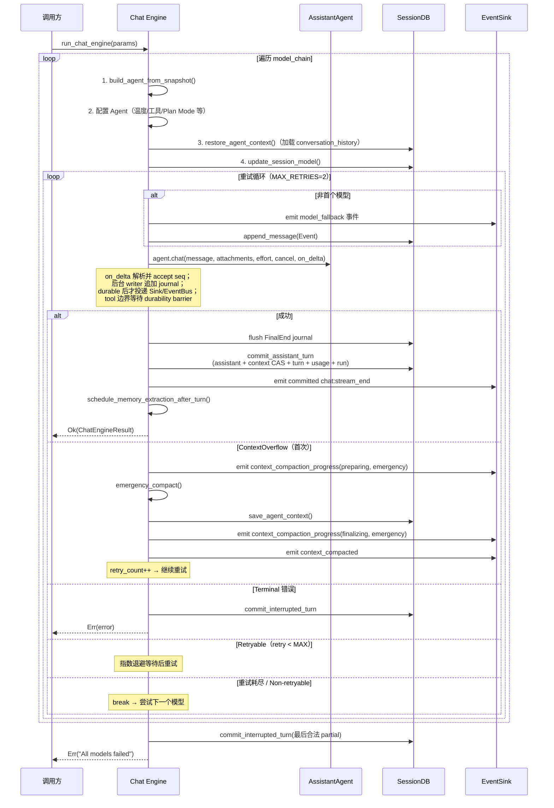
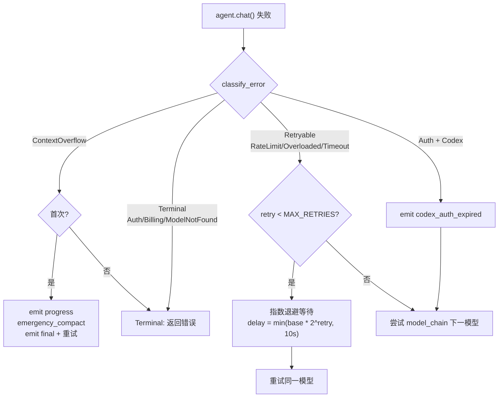
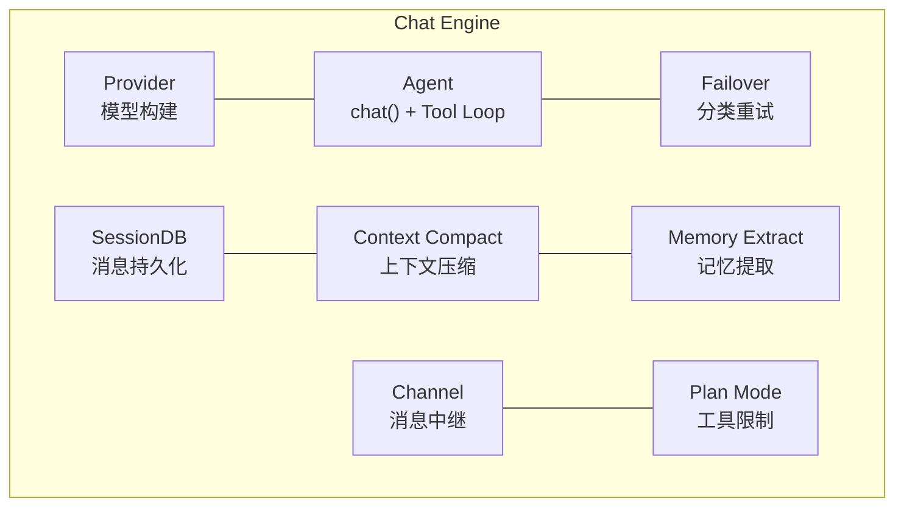

# Chat Engine 对话引擎架构

> 返回 [文档索引](../README.md) | 更新时间：2026-07-19

## 目录

- [概述](#概述)
- [模块结构](#模块结构)
- [核心类型](#核心类型)
  - [EventSink trait](#eventsink-trait)
  - [ChatEngineParams](#chatengineparams)
  - [ChatEngineResult](#chatengineresult)
  - [CapturedUsage](#capturedusage)
- [请求流程](#请求流程)
- [流式事件协议](#流式事件协议)
- [流式回调处理](#流式回调处理)
- [Durable Stream Coordinator](#durable-stream-coordinator)
- [Stream Broadcast & Reload Recovery](#stream-broadcast--reload-recovery)
- [Turn Lifecycle & Stop Recovery](#turn-lifecycle--stop-recovery)
- [用户消息持久队列](#用户消息持久队列)
- [Failover 集成](#failover-集成)
- [Post-turn Effects](#post-turn-effects)
- [记忆提取门控](#记忆提取门控)
- [集成关系](#集成关系)
- [文件清单](#文件清单)

---

## 概述

Chat Engine 是 Hope Agent 的对话编排入口，统一处理各类会话型请求：

| 来源 | EventSink 实现 | 说明 |
|---|---|---|
| UI 聊天（桌面） | `ChannelSink`（Tauri IPC Channel，定义在 src-tauri） | 用户直接交互（桌面模式） |
| UI 聊天（HTTP） | `NoopEventSink`（定义在 ha-core）+ `chat:stream_delta` EventBus | 用户直接交互（HTTP/WS 模式）；浏览器通过 `/ws/events` 接收流 |
| IM Channel | `ChannelStreamSink`（EventBus + mpsc） | Telegram / WeChat 等渠道 |
| Cron 定时任务 | `NoopEventSink` | 定时触发的对话复用同一个 noop sink，最终结果由 Cron delivery 处理 |
| ACP 协议 | stdio 协议输出层 | IDE 直连 |

Chat Engine 的业务依赖通过 `ChatEngineParams` 注入；流式耐久状态由进程级
`StreamCoordinator` writer 统一管理。调用方（`commands/chat.rs`、
`channel/worker.rs` 等）从 `State<AppState>` 或磁盘提取参数，构建 params 后调用
`run_chat_engine()`。ACP 虽不经过 `run_chat_engine()`，也创建同一类 durability sink，
不再维护私有的工具/上下文落库路径。

## 模块结构

```
crates/ha-core/src/chat_engine/
├── mod.rs              模块声明和 re-export
├── types.rs            EventSink trait + ChatEngineParams/Result + CapturedUsage
├── context.rs          Agent 构建 + 上下文恢复/保存 + 工具事件持久化 + Channel 中继 + 记忆提取
├── engine.rs           run_chat_engine() 核心引擎
├── durability.rs       StreamCoordinator：分配 seq、group commit、背压与耐久后广播
├── spool.rs            SQLite 不可用时的校验帧紧急日志
├── persister.rs        仅迁移兼容的 legacy placeholder writer；新流不使用
├── stream_broadcast.rs `chat:stream_delta` / `chat:stream_end` / `channel:stream_delta` 事件名 + 广播抽象
└── stream_seq.rs       ChatSource 枚举 + 每会话流序号注册表（重载恢复去重 cursor）
```

中性接口 [`turn_durability.rs`](../../crates/ha-core/src/turn_durability.rs) 定义
`TurnDurabilitySink`，因此 `AssistantAgent` 不反向依赖 `chat_engine`。

## 核心类型

### EventSink trait

抽象事件输出层，解耦引擎与具体输出通道：

```rust
pub trait EventSink: Send + Sync + 'static {
    fn send(&self, event: &str);
}
```

三种实现：

- **`ChannelSink`**（定义在 `src-tauri/src/commands/chat.rs`）— 包裹 `tauri::ipc::Channel<String>`，用于桌面模式 UI 直连。事件直接推送到 Tauri WebView 前端
- **`NoopEventSink`**（定义在 `crates/ha-core/src/chat_engine/types.rs`）— 丢弃所有事件。HTTP 模式、Cron 定时任务、subagent fork-and-forget 等"没有实时 UI 消费方"的入口共用此 sink；真正的浏览器流式输出由 Chat Engine 的 `chat:stream_delta` EventBus 双写路径推到 `/ws/events`
- **`ChannelStreamSink`**（定义在 `crates/ha-core/src/chat_engine/types.rs`）— 双路输出：(1) 通过 `EventBus` 发布 `channel:stream_delta` 事件推送到前端实时展示；(2) 通过 `mpsc::Sender` 转发到后台任务，驱动 IM 渠道的渐进式消息编辑（如 Telegram 消息实时更新）。`is_primary: Arc<AtomicBool>` gate 决定 (2) 是否真发到 IM——secondary observer 仅走 (1) 让 UI 渲染，不真发回 IM channel。Mid-turn 可 toggle。

### GUI ↔ IM live 流式镜像 (SinkRegistry fan-out)

GUI / HTTP 入口的 turn 在 IM attach 那一侧走 live 流式镜像：IM 用户实时看到 typewriter / per-round 边界 finalize / 媒体投递,与 IM 入站 turn 对称。实现走 [`crates/ha-core/src/chat_engine/im_mirror.rs`](../../crates/ha-core/src/chat_engine/im_mirror.rs):

- `attach_im_live_mirror(session_id, source)` —— `Desktop` / `Http` source 才返非空 state；通过 `channel_db.get_conversation_by_session(session_id)` 拿到 1:1 attach 行,获取对应 `ChannelAccountConfig.im_reply_mode()` / `show_thinking()` + plugin `capabilities()`,spawn `channel::worker::streaming::spawn_channel_stream_task`,把 `ChannelStreamSink` 注册到 [`SinkRegistry`](../../crates/ha-core/src/chat_engine/sink_registry.rs)。`emit_stream_event` 末尾的 `sink_registry().emit(session_id, &payload)` fan-out 把每帧 streaming event 转发到 IM 流式预览任务。
- `finalize_im_live_mirror(state, response)` —— drop SinkHandle(RAII 卸载 sink → 关闭 event_tx → stream task drain 后 EOF),`.await` stream task 拿 `StreamPreviewOutcome`(含 `PreviewHandle` + `finalized_rounds`),drain `RoundTextAccumulator`,按 `ImReplyMode` 复用 dispatcher 的 [`deliver_split` / `deliver_final_only` / `deliver_preview_merged`](../../crates/ha-core/src/channel/worker/dispatcher.rs)(已解耦 `MsgContext`,接受 `chat_id / thread_id / reply_to_message_id: Option<&str>` 三参显式形态)。

**两个通道独立走自己的发送通路**:GUI 永远走 Tauri IPC stream / HTTP `chat:stream_delta` 广播,不受 `imReplyMode` 影响;`imReplyMode` 仅决定 IM 端的呈现形态。

主 `event_sink`(GUI 的 `ChannelSink` / HTTP 的 `NoopEventSink`)**不入 SinkRegistry**——每消费方恰好收一次事件,SinkRegistry 只承载 fan-out 到 IM 的次级 sink。

错误 / 取消路径:engine 走 Err 不调 finalize,`ImLiveMirrorState` Drop 自动卸载 sink,IM 端保留半截 preview 与 IM 入站 cancel 行为一致。`source ∈ {Subagent, ParentInjection, Channel, Cron}` 在 attach 入口直接 no-op。

### ChatEngineParams

完整的请求参数包，调用方一次性构建：

| 分组 | 字段 | 类型 | 说明 |
|---|---|---|---|
| 基础 | `session_id` | `String` | 会话 ID |
| | `agent_id` | `String` | Agent ID |
| | `message` | `String` | 用户消息 |
| | `attachments` | `Vec<Attachment>` | 多模态附件 |
| | `session_db` | `Arc<SessionDB>` | 会话数据库 |
| 模型链 | `model_chain` | `Vec<ActiveModel>` | 预解析的模型降级链 |
| | `providers` | `Vec<ProviderConfig>` | Provider 配置快照 |
| | `codex_token` | `Option<(String, String)>` | Codex OAuth (access_token, account_id)；允许传 `None`，引擎侧在 `model_chain` 真的命中 Codex 时从磁盘 hydrate + refresh，三个入口（桌面 / HTTP / Channel）行为一致 |
| Agent 配置 | `resolved_temperature` | `Option<f64>` | 三层覆盖后的温度值 |
| | `web_search_enabled` | `bool` | 是否启用网络搜索 |
| | `notification_enabled` | `bool` | 是否启用通知 |
| | `canvas_enabled` | `bool` | 是否启用 Canvas |
| | `compact_config` | `CompactConfig` | 上下文压缩配置 |
| 可选 | `extra_system_context` | `Option<String>` | 额外系统提示词 |
| | `reasoning_effort` | `Option<String>` | 推理强度 |
| | `cancel` | `Arc<AtomicBool>` | 取消信号 |
| | `plan_agent_mode` | `Option<PlanAgentMode>` | Plan Mode 配置 |
| | `plan_mode_allow_paths` | `Option<Vec<String>>` | Plan Mode 路径白名单 |
| | `skill_allowed_tools` | `Vec<String>` | Skill 工具白名单 |
| | `denied_tools` | `Vec<String>` | 调用方执行策略级别的工具黑名单（与 schema 级过滤双重防御） |
| | `subagent_depth` | `u32` | 当前子 agent 嵌套深度，用于工具 schema 过滤与子 spawn 限制 |
| | `steer_run_id` | `Option<String>` | 关联 subagent run id；每轮 tool round 末尾 drain 对应 steer mailbox |
| | `auto_approve_tools` | `bool` | true 时所有工具调用免审批（IM 渠道 auto-approve 模式） |
| | `follow_global_reasoning_effort` | `bool` | Provider 循环是否在 turn 中途重读全局 reasoning effort |
| | `post_turn_effects` | `bool` | 成功响应后是否调度记忆提取 / 技能审核（subagent 等场景关掉）；会话标题有独立门控，不受此开关控制 |
| | `abort_on_cancel` | `bool` | 调用方取消时是否维持返回 `Err` 的生命周期语义；已耐久 partial/tool 仍原子收敛，不能因 source 不可见而丢弃 |
| | `persist_final_error_event` | `bool` | engine 是否落自身的最终错误事件（Channel 等已自管的入口设为 false） |
| | `source` | `ChatSource` | 流入口标识，驱动 `/api/server/status` 的 `activeChatCounts` 分类 |
| 输出 | `event_sink` | `Arc<dyn EventSink>` | 事件输出通道 |

### ChatEngineResult

```rust
pub struct ChatEngineResult {
    pub response: String,                  // 最终响应文本
    pub model_used: Option<ActiveModel>,   // 实际使用的模型
    pub agent: Option<AssistantAgent>,     // Agent 实例（UI chat 用于更新 State）
}
```

### CapturedUsage

从流式回调中捕获的 Token 使用量和性能指标：

```rust
struct CapturedUsage {
    pub input_tokens: Option<i64>,
    pub output_tokens: Option<i64>,
    pub model: Option<String>,
    pub ttft_ms: Option<i64>,        // Time To First Token
}
```

## 请求流程



### 7 步详解

1. **初始化** — 从 `model_chain` 构建 Agent，配置温度、工具限制、Plan Mode 等
2. **上下文恢复** — `restore_agent_context()` 从 DB 加载 `context_json`，反序列化为 `Vec<Value>` 设回 Agent
3. **流式执行** — 调用 `agent.chat()` 启动 LLM 请求 + Tool Loop，通过 `on_delta` 回调实时处理
4. **增量耐久** — coordinator 追加 journal，提交后才把对应 seq 广播；工具边界使用强制 durability barrier
5. **最终提交** — `commit_assistant_turn()` 原子写 assistant、context CAS、chat turn、usage 和 run 终态
6. **可见收尾** — 最终事务成功后发送 committed `chat:stream_end`，再后台调度记忆提取
7. **错误处理** — 分类错误、决定重试/降级/终止

## 流式事件协议

所有事件通过 `EventSink.send()` 以 JSON 字符串形式推送，前端通过 `type` 字段分发处理：

| type | 字段 | 说明 |
|---|---|---|
| `usage` | `input_tokens, output_tokens, model, ttft_ms, duration_ms` | Token 用量和性能指标 |
| `text_delta` | `text` | 文本增量 |
| `thinking_delta` | `content` | 思考内容增量 |
| `tool_call` | `call_id, name, arguments` | 工具调用发起 |
| `tool_result` | `call_id, result, duration_ms, is_error` | 工具执行结果 |
| `model_fallback` | `model, from_model, provider_id, model_id, reason, attempt, total, error` | 模型降级通知 |
| `context_compaction_progress` | `data.phase, data.kind` | live-only 上下文压缩进度；不持久化，GUI 用同一条 banner 原地更新 |
| `context_compacted` | `data` | 上下文压缩完成；final 事件是完成态唯一真相源，Tier ≥ 2 持久化 |
| `codex_auth_expired` | `error` | Codex OAuth Token 过期 |
| `event` | （通用） | 其他系统事件 |

## 流式回调处理

`on_delta` 闭包在 `agent.chat()` 的流式输出过程中被调用，只做解析、内存追加与
writer 通知：

**1. 累积与 flush 机制**

- 相邻 text/thinking 在 per-run buffer 合并，journal 只追加增量块，不反复覆盖累计全文
- 100ms / 16KiB 触发普通 flush；语义边界异步等待 durable 水位
- 最终响应先 flush 到 `accepted_seq == durable_seq`，再进入最终事务
- `thinking_start_time` 记录首个 `thinking_delta` 的时间，计算 thinking 总耗时

**2. 工具事件持久化**

`tool_call/tool_result` 都先作为 journal event 耐久；checkpoint/final commit 再按
`persistence_run_id + logical_block_seq` 幂等物化 Tool 消息。执行器只有在
tool-call durable barrier 完成后才允许产生副作用。

## Durable Stream Coordinator

非无痕会话采用「**耐久后展示**」：provider delta 先进入
`StreamCoordinator`，分配单调 `seq` 并合并相邻 text/thinking；后台 writer 把批次
追加到 `chat_stream_journal`，SQLite 事务成功（或紧急 spool 已 `sync_data`）后，才把
该批次投递到 per-call `EventSink`、EventBus、IM mirror。已经展示的内容因而必然具有
可恢复副本。回调热路径只解析、短锁追加和通知 writer，不做同步 SQLite I/O。

### 数据与状态机

- 每个会调用 `AssistantAgent::chat` / tool loop 的会话 turn 都有独立 `persistence_run_id`；Desktop/HTTP 可同时关联
  `chat_turns.id`，Channel/Cron/Subagent/ParentInjection/ACP 也创建 run，但不改变各自
  UI/取消语义。
- 不启动模型流的确定性本地回复（当前仅 Plan sub-agent 的“已转发/已启动”确认）不创建空
  journal run，但必须调用同一个 `commit_assistant_turn(run_id=None)` 原子写 assistant、CAS
  context、完成 chat_turn，且提交后才能展示/发送 completed end。
- 每个 profile/model 尝试使用递增 `attempt_no`。失败尝试只标
  `superseded`，journal 保留；最终物化只读取成功尝试。模型链全部失败时，选择最后一个
  含合法可见前缀的尝试生成 partial assistant。
- 切换 attempt 时在一个事务内把 session context CAS 恢复到 run 起点、删除该 run 已产生
  的 checkpoint materialized rows、标记旧 attempt superseded；工具调用审计仍完整保存在
  journal。新 attempt 的 reset marker 只在该事务完成后才能广播。
- `chat_stream_runs` 保存 accepted/durable/checkpoint/committed 四条水位；
  `chat_stream_attempts` 保存尝试状态；`chat_stream_journal` 以
  `(run_id, attempt_no, block_no)` 追加 compact payload、seq 范围和 BLAKE3 checksum。
- `messages.persistence_run_id + logical_block_seq` 的部分唯一索引保证恢复重放幂等。
  终态 journal 默认保留 24 小时，再由后台 GC 删除。

### Flush、group commit 与背压

默认 100ms 或 16KiB flush；tool call/result、role/round 边界、stop 和 final end 使用
立即 durability barrier。进程级 writer 可把多个 session 的批次写入同一短事务，目标是
单活跃流每秒不超过 10–20 次普通提交。

- durable lag 超过 2 秒或 dirty buffer 超过 1MiB：停止继续读取 provider，等待 writer。
- lag 超过 10 秒或 dirty buffer 超过 4MiB：取消模型并收敛为
  `PersistenceUnavailable`；未耐久内容不得广播。
- 工具执行前必须 `flush(ToolBoundary)`，因此工具副作用发生前，tool call 及前文已在
  journal；tool result 在下一轮模型请求前同样 checkpoint。

`HA_STREAM_DURABILITY_LEGACY_WRITER=1` 可关闭跨会话 group commit，回退为逐 run
事务，供紧急诊断使用；它**不**回退最终原子事务、错误传播或耐久后展示规则。

正常 journal flush 以结构化 debug 日志记录 batch 数、payload bytes 和 latency；背压、
commit 失败、spool fallback、恢复 bytes、checksum/gap 只记录 run/seq/尺寸/错误，不记录正文。

### Context CAS 与最终原子提交

`sessions.context_revision/context_run_id` 是上下文写入的 CAS 边界；run/attempt 的
`checkpoint_seq` 记录 provider-native context 已覆盖到哪个 durable journal seq。round
checkpoint 在同一事务中物化 durable journal 前缀、推进 checkpoint 水位并更新 context；
compaction 与最终提交都必须携带预期 revision。冲突时 fail closed，不允许旧 Agent 快照
覆盖新上下文。失败/崩溃收敛只把 checkpoint 后缀按 Anthropic/OpenAI Chat/Responses/Codex
原生结构重建，避免重复已完成 round，同时为未完成 tool call 合成匹配 result。

正常完成只有一个 `SessionDB::commit_assistant_turn` 事务，依次完成 journal 物化、最终
assistant、legacy trailing placeholder 清理、完整 context、交互式 `chat_turns`、usage
ledger、run/attempt 终态和 session 时间。任何 SQL 失败整体回滚，turn 不得伪装 completed。
成功 `chat:stream_end` 只能在该事务提交后发送。

停止/失败由 `commit_interrupted_turn` 原子收敛：只物化 checksum 正确且 seq 连续的最大
前缀，写明确恢复/中断事件，并将 turn/run 标为 interrupted/failed/recovered。

### 紧急 spool 与 Incognito

`sessions.db` 使用 WAL + `synchronous=FULL`。SQLite fatal 或持续不可用时，非无痕 run
写 `~/.hope-agent/stream_spool/{run_id}.log`：目录 0700、文件 0600、拒绝 symlink/
canonical escape，每帧带长度、attempt/block、seq 范围、checksum，并在广播前
`sync_data`；Unix 首次建文件还会 fsync 0700 父目录，确保目录项耐久。启动导入并完成
DB 事务后才删除 spool。SQLite 与 spool 都失败时立即停止
provider，不展示无法恢复的尾部。损坏 spool 的合法前缀恢复后，原文件改名隔离并保留
24 小时，由 journal GC 同步清理；不会因恢复成功立即销毁损坏证据。

Incognito 使用纯内存 coordinator，不创建 run/journal/spool/usage 行；其「关闭即焚」
隐私契约优先，因此不承诺进程崩溃恢复。

## Stream Broadcast & Reload Recovery

每条已经耐久的 stream delta 走双通道投递：

1. **主路径** — `EventSink.send()` 直接推 per-call sink（桌面 IPC Channel / `NoopEventSink`）
2. **保险路径 / 广播路径** — 同一事件经 `chat_engine::stream_broadcast` 注入序号后，通过 `EventBus` 发 `chat:stream_delta`（带 `{sessionId, seq}`）；HTTP / Tauri 前端订阅 `/ws/events` 或 Tauri 事件总线时统一从这里取流

seq 由 coordinator 在 accept 时分配，只有 `seq <= durable_seq` 才能进入上述通道；
`lastSeq` 只是 `acceptedSeq` 的兼容别名。`SessionStreamState` 还暴露
`durableSeq/committedSeq/persistenceRunId`，但前端不得把 cursor 直接跳到尚未通过 DB
快照验证的 accepted 水位。

重载 handshake 顺序固定为：先注册 delta/end listener，再并行读取 DB 消息窗口、
`get_session_stream_state` 和 `get_session_stream_snapshot`；用 snapshot 替换尾部临时
assistant，按 seq 重放 durable prefix，最后应用请求期间缓存的 `seq > throughSeq` 事件。
已 committed/recovered 的 snapshot 已被 canonical DB messages 表示，不重复重放 journal。
重复 delta/snapshot/迟到 stream_end 都按 `(stream_id, seq)` 幂等。

`chat:stream_end` 增量字段为 `finalSeq/durableSeq/assistantMessageId/
persistenceStatus`。只有 `persistenceStatus=committed` 才允许
`status=completed`；pending/degraded end 可以解除 loading，但不能清掉当前已展示的耐久
内容。

`ChatSource` 枚举区分 Desktop/HTTP/Channel/Cron/Subagent/ParentInjection/ACP，决定
active count 和输出语义；所有来源使用同一耐久协议。IM 渠道走的
`channel:stream_delta` 与主 chat 流分别走独立事件名互不混淆。
`sessions_send(wait=true)` 也必须走 Chat Engine；其调用超时会先设置 cancel，并给统一
中断事务一个有界收敛窗口，禁止再直接 drop 私有 `AssistantAgent::chat` future。

启动恢复严格在 async jobs/subagent injection 重放前运行：先兼容旧
streaming/orphaned 行，再导入 spool、扫描非终态 run、校验 checksum 与 seq 连续性，按
run/attempt 幂等物化最大合法前缀并写 Crash/Shutdown marker。缺口之后的 journal 不会被
拼接，损坏原文保留到 GC，结构化日志只记录 run/seq/error。

> 历史遗留的 per-session chat WebSocket 路由已于 commit `8860eb23` 移除，所有 stream 现统一走 `/ws/events` 单通道。

## Turn Lifecycle & Stop Recovery

用户可见的 Desktop / HTTP chat turn 在进入 Chat Engine 前会创建持久化
`chat_turns` 记录，并把 `turn_id` 传入 `ChatEngineParams`。turn 生命周期独立于
Plan task、stream seq 与消息持久化：

- `running`：turn 已创建并进入执行路径。
- `cancelling`：用户请求停止，后端只标记对应 session + turn 的 cancel flag。
- `completed`：正常完成。
- `interrupted`：用户停止、运行时取消、崩溃恢复等非错误中断。
- `failed`：模型链失败、配置错误或其它真实错误。

终态写入是幂等的，`finish_chat_turn_once` / `finish_chat_turn_after_execution`
不会让 late success 覆盖已中断 turn。Chat Engine 在可见 stream 结束时广播
`chat:stream_end`，payload 带 `sessionId / streamId / turnId / status /
interruptReason / error / finalSeq / durableSeq / assistantMessageId /
persistenceStatus`，前端据此清理 loading 并恢复停止后的展示状态。completed 只允许与
committed 同时出现。

启动恢复会把 DB 中残留的 `running` / `cancelling` turn 走统一 finalize（见下节）
拿到正确的 `Shutdown` / `Crash` reason 落 chat_turn 终态，同时清理内存
`active_turn` registry，避免热重启后 DB 已中断但内存仍报告 active。

HTTP chat route 还额外持有两个 Drop 兜底 guard：一是只移除本次请求注册的
cancel flag，避免客户端断开时把 stale cancel 留在 `chat_cancels`；二是当
Axum 因 HTTP 客户端断开而丢弃 handler future 时，外层 guard 只把 turn 标为
`cancelling/runtime_cancel`，不得直接写终态或广播 end。Chat Engine 的
`StreamLifecycle::Drop` 按精确 `persistence_run_id` 启动后台收敛：导入已 fsync 的 spool、
校验 journal 连续前缀、重建 provider-native context、执行 `commit_interrupted_turn`，事务
完成后才广播 `interrupted/runtime_cancel` 的 `chat:stream_end`。若 runtime 已经退出，run
保持 `running`，交给下一次启动恢复；不得以一个未物化 journal 的 HTTP Drop end 解除 loading。

`turn_id = None` 仍是非交互入口的显式设计：Cron、subagent、parent injection、IM
channel worker 与 ACP 不参与 GUI/HTTP 的 turn 级 stop 与 active-turn registry；但它们
全部拥有 `persistence_run_id` 并使用相同 journal/spool/最终提交协议。两种标识不能混用。

### 后台结果回注与前台让行

- Desktop / HTTP / IM / Cron 的前台回合在 `run_chat_engine` 入口持有 `ChatSessionGuard`。subagent、异步工具和 Workflow 阶段结果调用 `inject_and_run_parent` 时先等待该计数归零，因此不会把后台结果插进正在流式输出的用户回合。
- 同一 session 只允许一个 parent injection；其他 source 进入 `PENDING_INJECTIONS` 串行队列。等待超时不会丢结果，而是继续排队，由前台 guard drop 后唤醒。
- 用户新发消息会取消当前 injection model turn并重新排队；若 source 已被模型通过结果查询显式消费，`mark_run_fetched` 按 source run id 取消并抑制重试。Workflow checkpoint 另有 durable delivered/suppressed 事件，重启只补尚未 settled 的阶段结果。
- 后台工具与 Workflow 脚本有各自 worker/队列，子 Agent 也运行在独立 child session；它们等待终态不会持有前台 `ChatSessionGuard`。因此“后台任务仍在运行”与“用户能否继续聊天”正交，唯一共享的是 provider/机器资源与有界并发配额。

## 统一 Turn Finalize（`chat_engine::finalize`）

所有「非自然完成」的 turn 路径（用户停止 / runtime/request 取消 / 模型链失败 / 压缩失败 / 应用关闭 /
崩溃 / 配置缺失 / 其它内部异常）走统一的 reason/copy/provider-native 重建协议；新 journal run
最终由 `commit_interrupted_turn` 原子提交，legacy 行走 [`finalize_turn_context`](../../crates/ha-core/src/chat_engine/finalize/mod.rs)
收敛点，把发生了什么以三种形态同步出去：

1. **`context_json`**：按 reason 在 history 末尾拼一条 `[系统事件] ...` 中文
   marker 让模型下一轮明确感知；partial 内容（已产生的 text / thinking /
   tool_use）按当前 Provider 的 native 格式重建为结构化 blocks，被中断的
   `tool_use` 自动合成 `tool_result = "Tool execution was interrupted"` 防止
   Anthropic 等强校验 API 在下一轮返 400。
2. **`messages` 表 `role=event` 行**：用户版陈述性文案（已停止 / 应用已关闭 /
   认证失败 / ...），`is_error` 视 reason 设置；GUI 走现有事件居中渲染管线。
3. **IM 渠道通知（如 attach）**：复用 [`im_error_message`](../../crates/ha-core/src/chat_engine/im_error_message.rs)
   的 `CANCEL_NOTICE` / `format_im_engine_error` 模板，背景 task spawn 不阻塞
   engine 返回。

### TerminationReason 8 种

| reason | chat_turn status | interrupt_reason | 触发点 |
|---|---|---|---|
| `UserStop` | Interrupted | UserStop | engine 失败收敛 + 成功路径 cancel 检测；`abort_on_cancel=true` 的 Subagent 仍返回 Err，但已耐久 partial/tool 同样原子收敛 |
| `RuntimeCancel` | Interrupted | RuntimeCancel | engine future 被 runtime/request Drop；按 run_id 重放 durable prefix 后才结束 stream |
| `NoProfileAvailable` | Failed | NoProfile | engine 收敛时 `last_reason=None && last_error=None` + 配置缺失入口（Tauri / HTTP routes） |
| `ProviderFailed { last_kind, last_message, is_codex_auth }` | Failed | ProviderFailed | engine 收敛时 `ExecutorError::Exhausted` |
| `CompactionFailed { detail }` | Failed | CompactionFailed | engine emergency_compact 跑过仍 over-threshold，下一轮再返 ContextOverflow |
| `Shutdown` | Interrupted | Shutdown | 启动 sweep 看到 sentinel 文件（`~/.hope-agent/.shutdown-clean`） |
| `Crash` | Interrupted | CrashRecovery | 启动 sweep 看到 sentinel 缺失（panic / SIGKILL / 断电） |
| `Other { message }` | Failed | Unknown | 内部异常 / 边角失败兜底 |

### 启动 sweep（`app_init::recover_startup_session_state`）

执行顺序（同步）：
1. `sentinel::read_and_clear()` → `StartupCause::Clean` / `Crash`
2. `mark_orphaned_streaming_rows()` 把旧版本残留 `streaming` 翻 `orphaned`
3. `recover_durable_chat_streams()` group-import 紧急 spool，扫描非终态 run，校验各 attempt
   的 checksum/seq 连续性并原子重放最大合法前缀；事务完成后才删除正常 spool，损坏
   spool 隔离保留到 24 小时 GC
4. `find_stale_chat_turns_for_finalize()` 列仍为 `running` / `cancelling` 的 legacy turn（不 UPDATE）
5. 每个 legacy turn 调 `finalize_turn_context_blocking(cause.to_termination_reason(), …)`，
   reverse-rebuild 从 messages 表反查 partial 文本 / thinking / tool 行重建结构化
   blocks 写回 context_json，并写 event 行 + chat_turn 终态
6. `active_turn::clear_all()` 清内存 registry
7. 后续 `start_background_tasks` 才 spawn `async_jobs::replay_pending_jobs`，
   保证 dispatch_injection 看到的 history 已 finalize（避免 sweep 与 replay 竞态）

### 信号处理器（`crash_flush::install_signal_handlers`）

SIGTERM / SIGINT / Ctrl+C / Ctrl+Break 触发 `run_clean_shutdown()`：
1. `sentinel::write_clean_marker()` 写 sentinel 标记下次启动认作 Shutdown
2. `active_persisters::flush_all_blocking()` 只扫兼容期 legacy streaming placeholder；
   新流已经展示的 seq 此前已落 journal/spool，不依赖信号时抢救内存 buffer
3. `finalize_active_turns_for_shutdown()` 只对没有 running persistence run 的 legacy turn 调 `finalize_turn_context_blocking(Shutdown, …)`；新 run 保持非终态，交给下次启动按 journal/spool 原子恢复
4. `std::process::exit(0)`

**兼容路径次序红线**：legacy `flush_all_blocking` 必须在 legacy finalize **之前**；running
新 run 及其关联 chat_turn 必须整体跳过 legacy shutdown finalize，由下次启动的 journal/spool
recovery 幂等、原子收敛，禁止先推进 context 或写一个抢跑的 turn 终态。

### panic hook（`crash_flush::install_panic_hook`）

当前是幂等 no-op stub（仅 set 一个 `OnceLock`），**不设全局 `set_hook`、不做 flush、不引用进程组终止**。曾考虑过一个 SIGKILL 已注册 exec 子进程的全局 panic hook，但被否决：tokio task panic 常经 `JoinHandle` 边界被恢复而进程不退出，任意线程 panic 上的全局 kill 会拆掉不相关的长跑用户命令。per-task 子进程清理由 `tools::exec::ProcessGroupGuard::Drop` 处理；新流以每次广播前已耐久的 journal/spool 为保证，不靠 panic hook。兼容期 `StreamPersister::Drop` 仅照顾旧 placeholder。panic 不写 sentinel，等同 crash，下次启动 sweep 按 Crash reason 处理。

### exec 孙进程清理（`tools::exec::ProcessGroupGuard`）

`spawn_exec_waiter` 内 RAII guard：spawn child 后 attach guard，正常完成调
`disarm()`；timeout / 任务 panic / runtime shutdown 时 Drop 自动调
`terminate_process_tree(pid)` 杀整个进程组。替换原 `kill_on_drop(true)` 的单
进程 SIGKILL —— 修复 `exec` 跑 `sh -c 'cmd1 & cmd2 & wait'` 时孙进程被遗留
为孤儿的老问题。

### 重入保护

`active_turn::mark_finalized(turn_id) -> bool` test-and-insert：同一 turn 多次
进 finalize 第二次返回 `FinalizeOutcome::was_already_finalized = true`，调用方
据此 short-circuit 防止 marker / event 行重复落盘。

### Provider-native partial 重建

[`rebuild::rebuild_partial_assistant_blocks`](../../crates/ha-core/src/chat_engine/finalize/rebuild.rs)
按 `provider_kind` 分四个形态：

- **Anthropic**：`{role:assistant, content:[thinking, text, tool_use…]}`，thinking 不需要 signature；tool_use 必须有匹配 tool_result（synthesize_tool_results 自动补一条 `{role:user, content:[tool_result blocks]}`）。
- **OpenAI Chat**：`{role:assistant, content, reasoning_content, tool_calls}`，缺失字段直接省略；tool_result 用独立 `{role:tool, tool_call_id, content}` 消息。
- **OpenAI Responses / Codex**：`{type:message, role:assistant, content:[output_text]}` + 顶层 `{type:function_call …}` items。reasoning items 因为缺 `encrypted_content`（runtime partial 拿不到），thinking 被折叠进 `output_text` 文本。tool_result 用 `{type:function_call_output, call_id, output}` 顶层 item。

Partial blocks 在 `[系统事件]` marker 之前 push，所以模型读 history 时先看到结构化
partial，再看到「上面那段被中断了」的 system event 解释。

## 用户消息持久队列

忙时发送的用户消息以 `sessions.db.queued_turn_user_messages` 为唯一真相源，前端只持有当前会话投影，并在会话切换、窗口恢复和 `chat:turn_queue_changed` 后重新查询。队列按自增 `id` 保证会话内 FIFO，每会话硬上限 100 条。

状态机：

- `queued | fallback_after_reply`：可编辑、删除，也可作为下一独立回合发送。
- `waiting_tool_boundary`：绑定当前 `turn_id`，等待一批工具全部完成。
- `inserting`：工具边界已原子 claim；编辑、删除、取消均 CAS 失败，避免 UI 假删除。
- `dispatching`：正在创建下一独立回合；同样不可变。

普通续发只传 `queuedRequestId`。Desktop / HTTP 壳从 SQLite 取回真实正文、元数据和附件引用，防止刷新后依赖浏览器 `File` 对象，也避免 HTTP 列表暴露服务端绝对路径。用户消息落库时把 request id 写进 `messages.queue_request_id`（partial unique index）；启动恢复先删除已经存在对应消息的队列行，再将未提交的 `dispatching` 恢复为 `queued`、将未完成的工具插入恢复为 `fallback_after_reply`，实现崩溃后的 exactly-once 收敛。

工具插入只在 `assistant + tool_result` 已完整写入 provider-native history 后 claim 并 drain；没有出现工具边界、用户停止或回合失败时，`StreamLifecycle::finish` 把剩余绑定项原子降级为 `fallback_after_reply`。消息和附件在首次入队时即持久化；上传图片只在队列表保存 session-owned `file_path`，不把 base64 大块长期写进 SQLite。

接口必须保持双 Transport 对齐：Tauri commands 与 HTTP `GET/POST/PATCH/DELETE /api/chat/turn-message...` 同时提供 list / enqueue / edit / delete / insert / cancel。

## Failover 集成

Chat Engine 内置完整的模型降级和重试逻辑：



**退避参数：**
退避基数 / 上限 / 单模型重试次数已统一外移到 `failover::FailoverPolicy::chat_engine_default()`（见 [failover.md](./failover.md)），engine 内不再自管这三个常量。引擎本地仅保留一个常量 `MAX_COMPACTION_RETRIES = 1`（每模型最多紧急压缩重试 1 次），其它分类、退避、profile 轮换、Codex 强制不轮换等行为全部交给 `failover::executor::execute_with_failover` 配合 `chat_engine_default` policy 决定。

**Codex 特殊处理：** Auth 错误时，如果当前 Provider 是 Codex 类型，额外发送 `codex_auth_expired` 事件通知前端触发重新授权流程。

**ContextOverflow 特殊处理：** Chat Engine 重新构造同 profile 的临时 Agent，恢复会话 history 后执行 Tier 4 `emergency_compact()`，保存压缩后的 `context_json`，写回 `PROFILE_STICKY`，并用同一 profile 重试一次。非 incognito 会话会把 runtime ledger snapshot 交给 emergency compaction；incognito 或会话行已焚毁时跳过 ledger，避免 job/subagent id 被注入或持久化。

## Post-turn Effects

成功响应、assistant 消息落库、可见 stream 收尾并记录 stop lifecycle 后，Chat Engine 会先检查当前会话是否有 active Goal。若 Goal 仍需推进，`crate::goal::maybe_schedule_goal_continuation(...)` 会通过 wakeup 排一个短延迟 `<goal-continuation>` 注入，让模型下一轮先调用 `goal_status`，再继续执行、请求完成或请求阻塞。这个 Goal continuation 不受 `post_turn_effects` 开关控制；它属于 durable Goal runtime 的续跑语义，而不是记忆提取 / 技能审核这类普通后处理。Subagent source、paused/completed/cancelled/真实 blocked/budget exhausted Goal 不会续跑；同一 turn 去重，同一 Goal revision 有上限防止自激活失控。

自动标题是独立的会话能力：自主 Goal / Loop / Workflow turn 在模型执行前调用 `session_title::maybe_schedule_autonomous_start(...)`，避免长任务数分钟后才命名；每个成功回合在 assistant 落库后调用 `maybe_schedule_after_success(...)` 作带 assistant 上下文的兜底。两条路径均异步并按 session 去重，且不受 `post_turn_effects` 影响，因此 Loop 的 `ParentInjection` 回合也能生成 LLM 标题。

成功响应、assistant 消息落库并完成可见 stream 收尾后，若 `ChatEngineParams.post_turn_effects = true`，引擎会在最终 `Ok` 返回前调度两组普通后处理（均为后台 spawn，不阻塞调用方）：

1. **自动记忆提取** — `schedule_memory_extraction_after_turn(...)` 走「记忆提取门控」描述的四道 Gate；同时累积本轮 token / message 计入 Agent 维度的 extraction stats
2. **技能审核（auto_review）** — 复用同一轮统计，调用 `skills::author` 的 auto-review 通道对本轮新增/修改的 skill draft 做安全扫描与 promotion 决策

`post_turn_effects=false` 用于 subagent fork-and-forget、cron 子调用等“不该执行普通用户后处理”的入口，只跳过上述记忆 / 技能两项，不跳过受严格 title-source CAS 保护的会话标题。

> 实现位置参考 `crates/ha-core/src/chat_engine/engine.rs` 中 assistant message 持久化后的 stop lifecycle / Goal continuation / `post_turn_effects` 分支。

## 记忆提取门控

`schedule_memory_extraction_after_turn()` 在每次成功响应后检查门控；满足阈值时通过 `tokio::spawn` 后台执行记忆提取。可见聊天流在最终 assistant 行落库后立即结束，自动提取不会阻塞前端的停止按钮、会话列表转圈或 `POST /chat` 返回：

| 门控 | 条件 | 说明 |
|---|---|---|
| Gate 1 | `auto_extract == true` | 全局或 Agent 级配置 |
| Gate 2 | `manual_memory_saved == false` | 本轮未手动调用 save_memory |
| Gate 3 | 冷却保护 | 距上次提取 ≥ `extract_time_threshold_secs`（默认 300s） |
| Gate 4 | 内容阈值（任一满足） | Token ≥ 阈值（默认 8000）或 消息数 ≥ 阈值（默认 10） |

Gate 3（冷却）和 Gate 4（内容）需同时满足。后台提取调度后重置追踪状态。

**空闲超时兜底**：当阈值提取未触发时（追踪状态未重置），调度延迟任务（默认 30 分钟）。超时后从 DB 加载历史执行最终提取。新建会话时 `create_session()` 调用 `flush_all_idle_extractions()` 立即执行所有待提取。

提取使用的 provider/model 可独立配置（Agent 级 > 全局 > 当前模型），支持用廉价模型做提取以降低成本。

## 集成关系



| 模块 | 交互方式 | 说明 |
|---|---|---|
| **SessionDB** | `TurnDurabilitySink` / 最终事务 | journal、上下文 CAS、消息物化、turn 与 usage 原子提交 |
| **Provider** | `build_agent_from_snapshot()` | 根据 Provider 配置构建 Agent |
| **AssistantAgent** | `agent.chat()` | Tool Loop、流式输出、Side Query |
| **Failover** | `classify_error()` + `retry_delay_ms()` | 错误分类和退避计算 |
| **Context Compact** | `emergency_compact()` | ContextOverflow 时紧急压缩 |
| **Memory Extract** | `run_extraction()` | 自动记忆提取 |
| **Channel** | `attach_im_live_mirror()` + `finalize_im_live_mirror()` | desktop / HTTP turn → IM live 流式镜像（im_mirror.rs，复用 dispatcher 投递路径） |
| **Plan Mode** | `plan_agent_mode` + `plan_mode_allow_paths` | 透传到 Agent 限制工具和路径 |

## 文件清单

| 文件 | 职责 |
|---|---|
| `crates/ha-core/src/chat_engine/mod.rs` | 模块声明和 re-export |
| `crates/ha-core/src/chat_engine/types.rs` | EventSink trait、ChatEngineParams、ChatEngineResult、CapturedUsage |
| `crates/ha-core/src/turn_durability.rs` | Agent 可见的中性 durability trait、flush reason 与 snapshot 类型 |
| `crates/ha-core/src/chat_engine/context.rs` | Agent 构建、上下文恢复、Channel 中继、记忆提取 |
| `crates/ha-core/src/chat_engine/engine.rs` | `run_chat_engine()` 核心引擎：模型链遍历、重试循环、流式处理、failover |
| `crates/ha-core/src/chat_engine/durability.rs` | seq、buffer、group writer、背压、spool fallback 与耐久后广播 |
| `crates/ha-core/src/chat_engine/spool.rs` | 安全紧急 spool 帧读写与完整性校验 |
| `crates/ha-core/src/session/stream_persistence.rs` | additive schema、journal append/checkpoint、成功/中断事务、snapshot 与 GC |
| `crates/ha-core/src/chat_engine/persister.rs` | legacy placeholder 兼容；新流不使用 |
