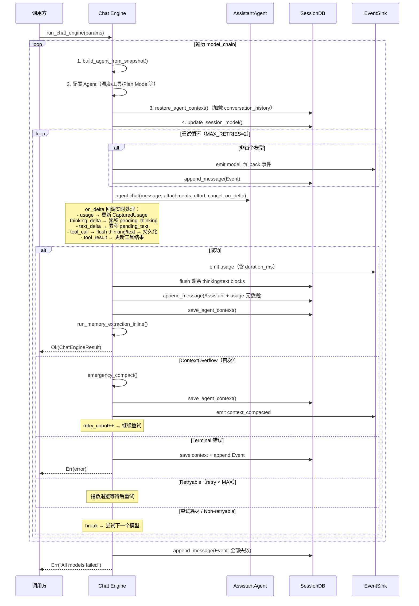
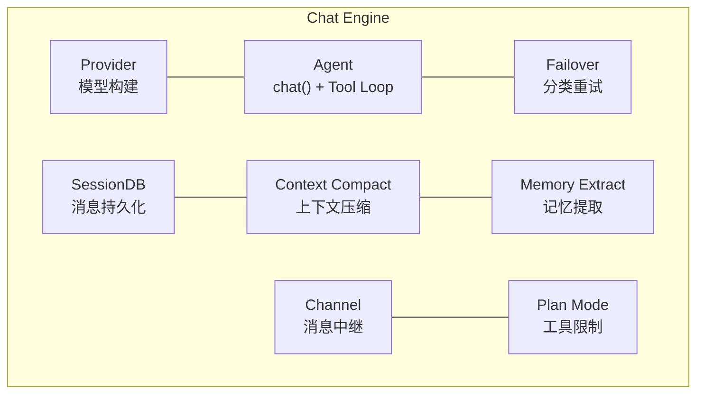

# Chat Engine 对话引擎架构

> 返回 [文档索引](../README.md) | 更新时间：2026-04-05

## 目录

- [概述](#概述)
- [模块结构](#模块结构)
- [核心类型](#核心类型)
  - [EventSink trait](#eventsink-trait)
  - [ChatEngineParams](#chatengineparams)
  - [ChatEngineResult](#chatengineresult)
  - [CapturedUsage](#capturedusage)
- [请求流程](#请求流程)
- [流式事件协议](#流式事件协议)
- [流式回调处理](#流式回调处理)
- [Failover 集成](#failover-集成)
- [记忆提取门控](#记忆提取门控)
- [集成关系](#集成关系)
- [文件清单](#文件清单)

---

## 概述

Chat Engine 是 Hope Agent 的对话编排入口，统一处理来自四种来源的请求：

| 来源 | EventSink 实现 | 说明 |
|---|---|---|
| UI 聊天（桌面） | `ChannelSink`（Tauri IPC Channel，定义在 src-tauri） | 用户直接交互（桌面模式） |
| UI 聊天（HTTP） | `WsSink`（WebSocket，定义在 ha-server） | 用户直接交互（HTTP/WS 模式） |
| IM Channel | `ChannelStreamSink`（EventBus + mpsc） | Telegram / WeChat 等渠道 |
| Cron 定时任务 | `ChannelSink` / `WsSink` | 定时触发的对话 |
| ACP 协议 | `ChannelSink` / `WsSink` | IDE 直连 |

Chat Engine 本身不持有状态，所有依赖通过 `ChatEngineParams` 注入。调用方（`commands/chat.rs`、`channel/worker.rs` 等）从 `State<AppState>` 或磁盘提取参数，构建 params 后调用 `run_chat_engine()`。

## 模块结构

```
crates/ha-core/src/chat_engine/
├── mod.rs       模块声明和 re-export
├── types.rs     EventSink trait + ChatEngineParams/Result + CapturedUsage
├── context.rs   Agent 构建 + 上下文恢复/保存 + 工具事件持久化 + Channel 中继 + 记忆提取
└── engine.rs    run_chat_engine() 核心引擎
```

## 核心类型

### EventSink trait

抽象事件输出层，解耦引擎与具体输出通道：

```rust
pub trait EventSink: Send + Sync + 'static {
    fn send(&self, event: &str);
}
```

三种实现：

- **`ChannelSink`**（定义在 `src-tauri/src/commands/chat.rs`）— 包裹 `tauri::ipc::Channel<String>`，用于桌面模式 UI 直连。事件直接推送到 Tauri WebView 前端
- **`WsSink`**（定义在 `crates/ha-server/src/routes/chat.rs`）— 通过 WebSocket 推送事件，用于 HTTP/WS 模式 UI 直连
- **`ChannelStreamSink`**（定义在 `crates/ha-core/src/chat_engine/types.rs`）— 双路输出：(1) 通过 `EventBus` 发布 `channel:stream_delta` 事件推送到前端实时展示；(2) 通过 `mpsc::Sender` 转发到后台任务，驱动 IM 渠道的渐进式消息编辑（如 Telegram 消息实时更新）

### ChatEngineParams

完整的请求参数包，调用方一次性构建：

| 分组 | 字段 | 类型 | 说明 |
|---|---|---|---|
| 基础 | `session_id` | `String` | 会话 ID |
| | `agent_id` | `String` | Agent ID |
| | `message` | `String` | 用户消息 |
| | `attachments` | `Vec<Attachment>` | 多模态附件 |
| | `session_db` | `Arc<SessionDB>` | 会话数据库 |
| 模型链 | `model_chain` | `Vec<ActiveModel>` | 预解析的模型降级链 |
| | `providers` | `Vec<ProviderConfig>` | Provider 配置快照 |
| | `codex_token` | `Option<(String, String)>` | Codex OAuth (access_token, account_id)；允许传 `None`，引擎侧在 `model_chain` 真的命中 Codex 时从磁盘 hydrate + refresh，三个入口（桌面 / HTTP / Channel）行为一致 |
| Agent 配置 | `resolved_temperature` | `Option<f64>` | 三层覆盖后的温度值 |
| | `web_search_enabled` | `bool` | 是否启用网络搜索 |
| | `notification_enabled` | `bool` | 是否启用通知 |
| | `image_gen_config` | `Option<ImageGenConfig>` | 图像生成配置 |
| | `canvas_enabled` | `bool` | 是否启用 Canvas |
| | `compact_config` | `CompactConfig` | 上下文压缩配置 |
| 可选 | `extra_system_context` | `Option<String>` | 额外系统提示词 |
| | `reasoning_effort` | `Option<String>` | 推理强度 |
| | `cancel` | `Arc<AtomicBool>` | 取消信号 |
| | `plan_agent_mode` | `Option<PlanAgentMode>` | Plan Mode 配置 |
| | `plan_mode_allow_paths` | `Option<Vec<String>>` | Plan Mode 路径白名单 |
| | `skill_allowed_tools` | `Vec<String>` | Skill 工具白名单 |
| 输出 | `event_sink` | `Arc<dyn EventSink>` | 事件输出通道 |

### ChatEngineResult

```rust
pub struct ChatEngineResult {
    pub response: String,                  // 最终响应文本
    pub model_used: Option<ActiveModel>,   // 实际使用的模型
    pub agent: Option<AssistantAgent>,     // Agent 实例（UI chat 用于更新 State）
}
```

### CapturedUsage

从流式回调中捕获的 Token 使用量和性能指标：

```rust
struct CapturedUsage {
    pub input_tokens: Option<i64>,
    pub output_tokens: Option<i64>,
    pub model: Option<String>,
    pub ttft_ms: Option<i64>,        // Time To First Token
}
```

## 请求流程



### 7 步详解

1. **初始化** — 从 `model_chain` 构建 Agent，配置温度、工具限制、Plan Mode 等
2. **上下文恢复** — `restore_agent_context()` 从 DB 加载 `context_json`，反序列化为 `Vec<Value>` 设回 Agent
3. **流式执行** — 调用 `agent.chat()` 启动 LLM 请求 + Tool Loop，通过 `on_delta` 回调实时处理
4. **响应持久化** — flush 未完成的 thinking/text blocks，保存 assistant 消息（附带 tokens、model、ttft_ms、duration_ms）
5. **上下文保存** — `save_agent_context()` 将更新后的 conversation_history 序列化存回 DB
6. **记忆提取** — inline 执行自动记忆提取（非 spawn），利用 side_query 缓存共享
7. **错误处理** — 分类错误、决定重试/降级/终止

## 流式事件协议

所有事件通过 `EventSink.send()` 以 JSON 字符串形式推送，前端通过 `type` 字段分发处理：

| type | 字段 | 说明 |
|---|---|---|
| `usage` | `input_tokens, output_tokens, model, ttft_ms, duration_ms` | Token 用量和性能指标 |
| `text_delta` | `text` | 文本增量 |
| `thinking_delta` | `content` | 思考内容增量 |
| `tool_call` | `call_id, name, arguments` | 工具调用发起 |
| `tool_result` | `call_id, result, duration_ms, is_error` | 工具执行结果 |
| `model_fallback` | `model, from_model, provider_id, model_id, reason, attempt, total, error` | 模型降级通知 |
| `context_compacted` | `data` | 上下文压缩完成 |
| `codex_auth_expired` | `error` | Codex OAuth Token 过期 |
| `event` | （通用） | 其他系统事件 |

## 流式回调处理

`on_delta` 闭包在 `agent.chat()` 的流式输出过程中被调用，承担两项职责：

**1. 累积与 flush 机制**

- `pending_text` / `pending_thinking` — 使用 `Arc<Mutex<String>>` 累积增量文本
- 遇到 `tool_call` 事件时，将累积内容 flush 为 `TextBlock` / `ThinkingBlock` 消息写入 DB
- 最终响应成功后，flush 剩余的 pending 内容
- `thinking_start_time` 记录首个 `thinking_delta` 的时间，计算 thinking 总耗时

**2. 工具事件持久化**

`persist_tool_event()` 拦截 `tool_call` 和 `tool_result` 事件：
- `tool_call` → 创建新的 Tool 消息（结果为空）
- `tool_result` → 通过 `call_id` 匹配更新已有 Tool 消息的 result、duration、is_error

## Failover 集成

Chat Engine 内置完整的模型降级和重试逻辑：

```mermaid
flowchart TD
    A[agent.chat() 失败] --> B{classify_error}
    B -->|ContextOverflow| C{首次?}
    C -->|是| D[emergency_compact + 重试]
    C -->|否| E[Terminal: 返回错误]
    B -->|Terminal<br/>Auth/Billing/ModelNotFound| E
    B -->|Retryable<br/>RateLimit/Overloaded/Timeout| F{retry < MAX_RETRIES?}
    F -->|是| G["指数退避等待<br/>delay = min(base * 2^retry, 10s)"]
    G --> H[重试同一模型]
    F -->|否| I[尝试 model_chain 下一模型]
    B -->|Auth + Codex| J[emit codex_auth_expired]
    J --> I

```

**退避参数：**
- `RETRY_BASE_MS = 1000`（1 秒起步）
- `RETRY_MAX_MS = 10000`（上限 10 秒）
- `MAX_RETRIES = 2`（每个模型最多重试 2 次）

**Codex 特殊处理：** Auth 错误时，如果当前 Provider 是 Codex 类型，额外发送 `codex_auth_expired` 事件通知前端触发重新授权流程。

## 记忆提取门控

`run_memory_extraction_inline()` 在每次成功响应后 inline 执行（非 `tokio::spawn`），以共享 Agent 实例的 side_query 缓存：

| 门控 | 条件 | 说明 |
|---|---|---|
| Gate 1 | `auto_extract == true` | 全局或 Agent 级配置 |
| Gate 2 | `manual_memory_saved == false` | 本轮未手动调用 save_memory |
| Gate 3 | 冷却保护 | 距上次提取 ≥ `extract_time_threshold_secs`（默认 300s） |
| Gate 4 | 内容阈值（任一满足） | Token ≥ 阈值（默认 8000）或 消息数 ≥ 阈值（默认 10） |

Gate 3（冷却）和 Gate 4（内容）需同时满足。提取成功后重置追踪状态。

**空闲超时兜底**：当 inline 提取未触发时（追踪状态未重置），调度延迟任务（默认 30 分钟）。超时后从 DB 加载历史执行最终提取（无 side_query 缓存共享）。新建会话时 `create_session()` 调用 `flush_all_idle_extractions()` 立即执行所有待提取。

提取使用的 provider/model 可独立配置（Agent 级 > 全局 > 当前模型），支持用廉价模型做提取以降低成本。

## 集成关系



| 模块 | 交互方式 | 说明 |
|---|---|---|
| **SessionDB** | 直接调用 | 消息追加、上下文存取、工具结果更新 |
| **Provider** | `build_agent_from_snapshot()` | 根据 Provider 配置构建 Agent |
| **AssistantAgent** | `agent.chat()` | Tool Loop、流式输出、Side Query |
| **Failover** | `classify_error()` + `retry_delay_ms()` | 错误分类和退避计算 |
| **Context Compact** | `emergency_compact()` | ContextOverflow 时紧急压缩 |
| **Memory Extract** | `run_extraction()` | 自动记忆提取 |
| **Channel** | `relay_to_channel()` | IM Channel 消息中继（context.rs） |
| **Plan Mode** | `plan_agent_mode` + `plan_mode_allow_paths` | 透传到 Agent 限制工具和路径 |

## 文件清单

| 文件 | 职责 |
|---|---|
| `crates/ha-core/src/chat_engine/mod.rs` | 模块声明和 re-export |
| `crates/ha-core/src/chat_engine/types.rs` | EventSink trait、ChatEngineParams、ChatEngineResult、CapturedUsage |
| `crates/ha-core/src/chat_engine/context.rs` | Agent 构建、上下文恢复/保存、工具事件持久化、Channel 中继、记忆提取 |
| `crates/ha-core/src/chat_engine/engine.rs` | `run_chat_engine()` 核心引擎：模型链遍历、重试循环、流式处理、failover |
