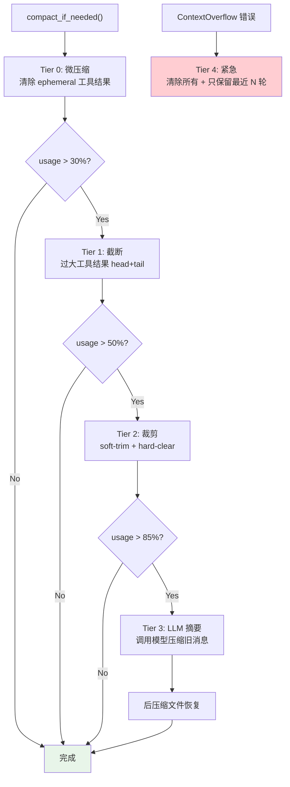
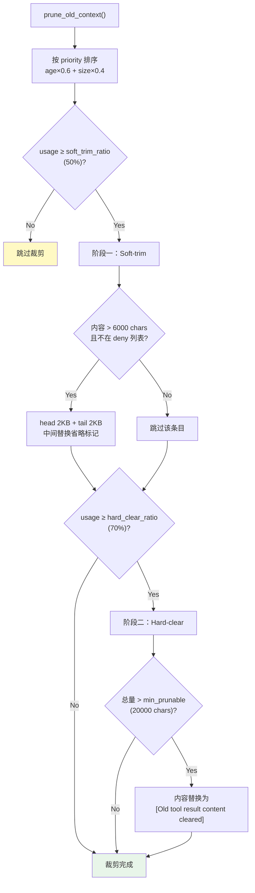
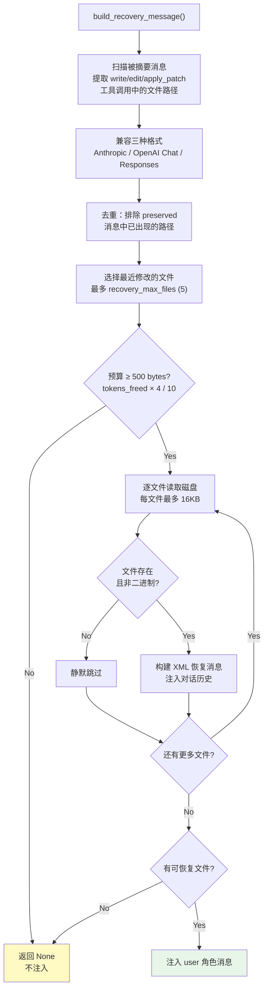

# 上下文压缩架构
> 返回 [文档索引](../README.md) | 更新时间：2026-04-05

## 概述

上下文压缩系统采用 **5 层渐进式压缩策略**，在对话 token 接近模型上下文窗口上限时，按代价从低到高逐层触发。结合 **API-Round 分组保护**确保 tool_use / tool_result 消息配对不被拆散，以及 **后压缩文件恢复**在 LLM 摘要后自动注入最近编辑文件的当前内容，省去额外的 read 工具调用。

## 压缩层级总览



## 模块结构

| 文件 | 行数 | 职责 |
|------|------|------|
| `mod.rs` | ~100 | 模块入口、常量定义、re-exports |
| `types.rs` | ~105 | 数据类型（CompactResult, TokenEstimateCalibrator, SummarizationSplit 等） |
| `config.rs` | ~205 | 配置结构 CompactConfig（全部可配置参数） |
| `estimation.rs` | ~60+ | Token 估算（chars/4 启发式、图片估算、消息字符计数） |
| `compact.rs` | ~80+ | 主入口 + Tier 0 微压缩 + Tier 4 紧急压缩 |
| `truncation.rs` | ~50+ | Tier 1 工具结果截断（head+tail、结构边界检测） |
| `pruning.rs` | ~50+ | Tier 2 上下文裁剪（soft-trim + hard-clear） |
| `summarization.rs` | ~80+ | Tier 3 LLM 摘要（消息分割、prompt 构建、摘要应用） |
| `round_grouping.rs` | ~220 | API-Round 分组（stamp/strip 元数据、round-safe 边界查找） |
| `recovery.rs` | ~360 | 后压缩文件恢复（扫描写入工具、读取磁盘、构建恢复消息） |
| **合计** | **~2260** | |

## 5 层压缩详解

### Tier 0：微压缩（Microcompact）

**零成本**清除过时的短命工具结果，无需 LLM 调用。

**触发条件**：每次请求前自动执行（`microcompact_enabled = true`）

**处理逻辑**：
1. 构建 `tool_use_id → tool_name` 映射表，兼容三种消息格式：
   - **Anthropic**：content 数组中的 `tool_use` 块（`id` + `name`）
   - **OpenAI Chat**：`tool_calls` 数组（`id` + `function.name`）
   - **OpenAI Responses**：`type=function_call` 消息（`call_id` + `name`）
2. 找到保护边界：从末尾跳过最近 `keep_last_assistants`（默认 4）个 assistant 消息
3. 清除边界之前的以下工具的结果内容：`ls`, `grep`, `find`, `process`, `sessions_list`, `agents_list`
4. 替换为空字符串（保留消息结构以维持 tool_use/tool_result 配对）

### Tier 1：截断（Truncation）

对**单个过大**的工具结果执行 head+tail 截断。

**触发条件**：单个工具结果超过上下文窗口的 30%（`MAX_TOOL_RESULT_CONTEXT_SHARE = 0.3`）

**大小限制计算**：
```
max_chars = min(context_window × 0.3 × 4 chars/token, 400KB)
```

- `CHARS_PER_TOKEN = 4`：通用文本 token 估算比率
- `HARD_MAX_TOOL_RESULT_CHARS = 400_000`：绝对上限
- `MIN_KEEP_CHARS = 2_000`：最少保留字符数

**智能尾部检测**（`has_important_tail()`）：检查尾部 2000 字符是否包含重要内容：
- 错误信息模式：`error`, `exception`, `failed`, `fatal`, `traceback`, `panic`
- JSON 闭合结构：`}`, `]`
- 结果关键词：`total`, `summary`, `result`, `complete`, `finished`

若尾部重要，采用 **head + tail** 截断（中间插入 `[... middle content omitted ...]` 标记）；否则仅保留头部。

**结构边界检测**（`find_structure_boundary()`）：在目标截断点附近寻找干净的切割位置，识别 JSON 边界、代码块边界和段落边界。

### Tier 2：裁剪（Pruning）

对历史中的多个工具结果进行**两阶段渐进裁剪**。



**优先级排序**：
```
priority = age × 0.6 + size × 0.4
```
- `age = 1.0 - (msg_index / total_messages)`：越老越优先
- `size = min(content_chars / 100000, 1.0)`：越大越优先

**阶段一：Soft-trim**（`soft_trim_ratio = 0.50` 触发）
- 对大于 `soft_trim_max_chars`（默认 6000 字符）的工具结果执行 head+tail 截断
- 保留头部 `soft_trim_head_chars`（默认 2KB）+ 尾部 `soft_trim_tail_chars`（默认 2KB）
- 中间替换为省略标记

**阶段二：Hard-clear**（`hard_clear_ratio = 0.70` 触发）
- 整个工具结果内容替换为占位符：`"[Old tool result content cleared]"`
- 跳过低于 `min_prunable_tool_chars`（默认 20000）总量的情况

**保护机制**：
- 最近 `keep_last_assistants`（默认 4）个 assistant 消息之后的内容不裁剪
- `tools_deny_prune` 列表中的工具不裁剪（默认包括 `web_search`, `web_fetch`, `save_memory`, `recall_memory` 等 8 个工具）

### Tier 3：LLM 摘要（Summarization）

调用 LLM 将旧对话历史压缩为结构化摘要。

**触发条件**：token 使用率达到 `summarization_threshold`（默认 0.85）

**流程**：
1. **split_for_summarization**：找到倒数第 `preserve_recent_turns`（默认 4，最大 12）个 user 消息作为分割点，再调整到 round-safe 边界
2. **build_summarization_prompt**：构建摘要指令，包含标识符保留策略
3. LLM 调用（`summarization_timeout_secs` 默认 60s 超时，`summary_max_tokens` 默认 4096）
4. **apply_summary**：用摘要消息替换旧历史，保留最近的消息

**摘要 System Prompt 要求保留**：
- 活跃任务及其当前状态
- 批量操作进度（如 "5/17 items completed"）
- 用户最近的请求和处理进展
- 决策及其理由
- TODO、悬而未决的问题和约束
- 承诺的后续事项
- 所有文件路径、函数名和代码引用

**标识符保留策略**（`identifier_policy`）：
- `"strict"`（默认）：严格保留所有不透明标识符（UUID、hash、ID、token、主机名、IP、端口、URL、文件名），不缩短不重构
- `"off"`：不做特殊保留
- `"custom"`：使用 `identifier_instructions` 自定义指令

**摘要上限**：`MAX_COMPACTION_SUMMARY_CHARS = 16,000` 字符

### Tier 4：紧急压缩（Emergency Compact）

**ContextOverflow** 错误触发的最后手段。

**处理逻辑**：
1. 清除所有工具结果内容
2. 只保留最近 N 轮消息（基于 round-safe 边界）
3. 丢弃所有更早的历史

## API-Round 消息分组

### 元数据标记

Tool loop 中的 assistant 消息（含 tool_use）和对应的 tool_result 消息通过 `_oc_round` 元数据标记为同一轮次：

```json
{ "role": "assistant", "content": [...], "_oc_round": "r0" }
{ "role": "user", "content": [...], "_oc_round": "r0" }
```

**Round ID 格式**：`"r{N}"`，N 为 tool loop 迭代索引（从 0 开始）。

### 关键函数

| 函数 | 说明 |
|------|------|
| `stamp_round(msg, round_id)` | 在消息上标记 round ID |
| `push_and_stamp(messages, msg, round)` | Push 消息并标记，跨 4 种 Provider 文件复用 |
| `strip_round(msg)` | 剥离单条消息的 round 元数据 |
| `prepare_messages_for_api(messages)` | Clone 并剥离所有 round 元数据，用于 API 请求体构建 |
| `find_round_safe_boundary(messages, target)` | 在 target 及之前找到 round-safe 分割点（向后搜索） |
| `find_round_safe_boundary_forward(messages, target)` | 在 target 及之后找到 round-safe 分割点（向前搜索） |

### 向后兼容

无 `_oc_round` 元数据的旧会话消息被视为独立 round，`find_round_safe_boundary` 直接返回 `target_index`。

## 后压缩文件恢复

Tier 3 摘要后，被摘要的消息中 write/edit/apply_patch 的精确文件内容从对话历史中丢失。此模块自动从磁盘读取这些文件的当前内容并注入，省去额外的 read 工具调用。

### 流程



1. **扫描被摘要消息**：提取 `write`, `write_file`, `edit`, `patch_file`, `apply_patch` 工具调用中的文件路径
   - 兼容三种格式：Anthropic tool_use、OpenAI Chat tool_calls、OpenAI Responses function_call
   - `apply_patch` 从 patch header（`*** Add File:`, `*** Update File:`, `*** Move to:`）提取路径
2. **去重**：排除在保留消息（preserved）中已出现的路径
3. **选择最近文件**：取最近修改的文件（最多 `recovery_max_files`，默认 5 个）
4. **读取磁盘内容**：每个文件最多 `recovery_max_file_bytes`（默认 16KB），超出截断并追加 `[truncated, N total bytes]`
5. **预算控制**：
   - 总预算 = `tokens_freed × 4 bytes / 10`（释放 token 的 10%）
   - 兜底上限 `MAX_RECOVERY_TOTAL_BYTES = 100,000` 字符
   - 预算不足 500 字节时跳过
6. **注入为 XML 块**：构建 user 角色消息

```xml
[Post-compaction file recovery: current contents of recently-edited files]

<file path="/path/to/file.rs">
file contents here...
</file>
```

### 容错

- 文件不存在、已删除或为二进制文件时静默跳过
- 无可恢复文件时返回 `None`，不注入任何消息

## Token 估算

### chars/4 启发式

基础估算规则：

| 值类型 | 估算方法 |
|--------|---------|
| String | `len / 4` |
| Array | 各元素估算之和 |
| Object | 各键名和值估算之和 |
| Number / Bool / Null | 1 token |
| Image content | 固定 8000 chars（`IMAGE_CHAR_ESTIMATE`） |

### TokenEstimateCalibrator

使用 EMA（指数移动平均）根据 API 返回的实际 token 数校准估算因子：

```
calibration_factor = calibration_factor × 0.7 + (actual / estimated) × 0.3
calibrated_estimate = raw_estimate × calibration_factor
```

- `alpha = 0.3`：近期观测值权重更高
- 初始 `calibration_factor = 1.0`
- 每次 API 响应后用 `(estimated, actual)` 对更新

## 配置项

| 配置路径（`compact.*`） | 默认值 | 说明 |
|------------------------|--------|------|
| `enabled` | `true` | 启用上下文压缩 |
| **Tier 0** | | |
| `microcompactEnabled` | `true` | 启用微压缩 |
| `microcompactTools` | `[ls, grep, find, process, sessions_list, agents_list]` | 微压缩目标工具列表 |
| **Tier 2** | | |
| `softTrimRatio` | `0.50` | Soft-trim 触发比率 |
| `softTrimMaxChars` | `6000` | 触发 soft-trim 的最小内容长度 |
| `softTrimHeadChars` | `2000` | Soft-trim 保留头部字符数 |
| `softTrimTailChars` | `2000` | Soft-trim 保留尾部字符数 |
| `hardClearRatio` | `0.70` | Hard-clear 触发比率 |
| `hardClearEnabled` | `true` | 启用 hard-clear 阶段 |
| `hardClearPlaceholder` | `"[Old tool result content cleared]"` | Hard-clear 占位符文本 |
| `keepLastAssistants` | `4` | 保护最近 N 个 assistant 消息 |
| `minPrunableToolChars` | `20000` | 低于此总量跳过 hard-clear |
| `toolsDenyPrune` | `[web_search, web_fetch, save_memory, ...]` | 裁剪豁免工具列表（8 个） |
| **Tier 3** | | |
| `summarizationThreshold` | `0.85` | 摘要触发比率 |
| `preserveRecentTurns` | `4`（最大 12） | 摘要时保留最近 N 轮 |
| `identifierPolicy` | `"strict"` | 标识符保留策略 |
| `identifierInstructions` | — | 自定义标识符指令（policy=custom 时） |
| `customInstructions` | — | 追加到摘要 prompt 的自定义指令 |
| `summarizationTimeoutSecs` | `60` | 摘要 LLM 调用超时（秒） |
| `summaryMaxTokens` | `4096` | 摘要最大输出 token |
| `maxHistoryShare` | `0.5` | 裁剪时历史最大上下文占比 |
| **后压缩恢复** | | |
| `recoveryEnabled` | `true` | 启用文件恢复 |
| `recoveryMaxFiles` | `5` | 最大恢复文件数 |
| `recoveryMaxFileBytes` | `16384` (16KB) | 单文件最大恢复字节数 |

## 关键源文件

| 文件 | 说明 |
|------|------|
| `crates/oc-core/src/context_compact/mod.rs` | 模块入口、硬编码常量、摘要 prompt 模板、re-exports |
| `crates/oc-core/src/context_compact/types.rs` | CompactResult, CompactDetails, PruneResult, SummarizationSplit, TokenEstimateCalibrator |
| `crates/oc-core/src/context_compact/config.rs` | CompactConfig 结构（全部可配置参数及默认值） |
| `crates/oc-core/src/context_compact/estimation.rs` | Token 估算（chars/4）、消息字符计数、工具结果提取辅助函数 |
| `crates/oc-core/src/context_compact/compact.rs` | 主入口 `compact_if_needed()` + Tier 0 `microcompact()` + Tier 4 `emergency_compact()` |
| `crates/oc-core/src/context_compact/truncation.rs` | Tier 1 `truncate_tool_results()`、head+tail 截断、结构边界检测、智能尾部检测 |
| `crates/oc-core/src/context_compact/pruning.rs` | Tier 2 `prune_old_context()`、优先级排序、soft-trim + hard-clear 两阶段 |
| `crates/oc-core/src/context_compact/summarization.rs` | Tier 3 `split_for_summarization()` + `build_summarization_prompt()` + `apply_summary()` |
| `crates/oc-core/src/context_compact/round_grouping.rs` | API-Round 分组：stamp/strip/prepare、`find_round_safe_boundary()` 双向查找 |
| `crates/oc-core/src/context_compact/recovery.rs` | 后压缩文件恢复：`build_recovery_message()`、多格式工具调用解析、磁盘读取 |
