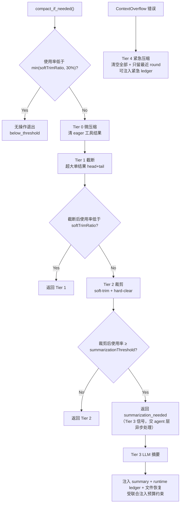
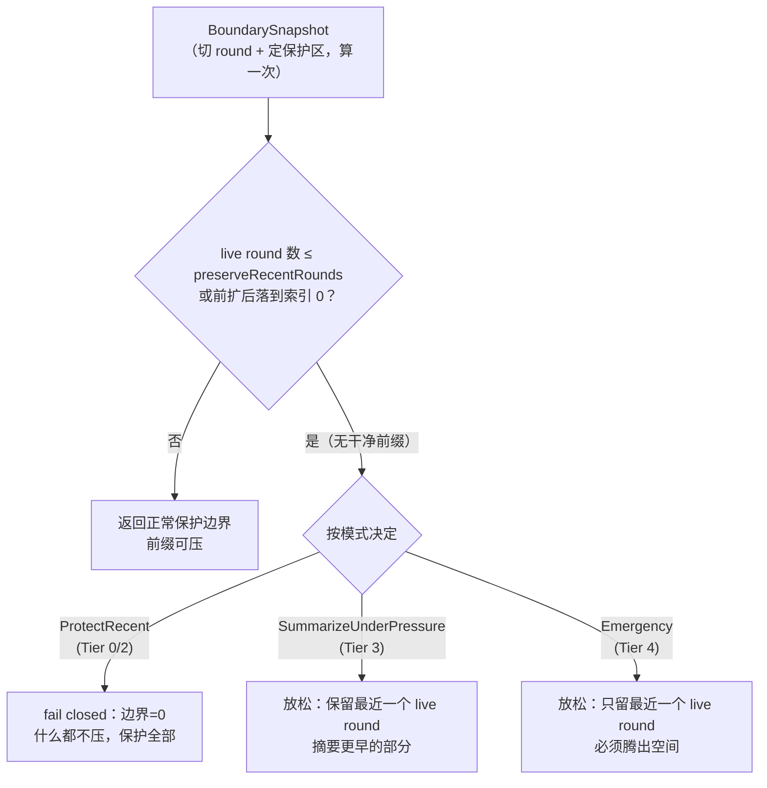
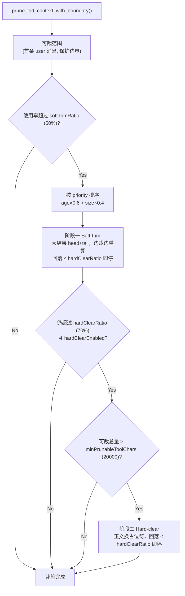
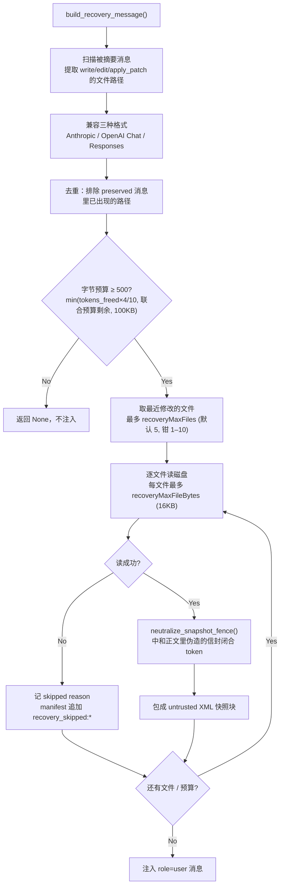

# 上下文压缩架构

> 返回 [文档索引](../README.md) | 更新时间：2026-07-23

## 这个子系统解决什么问题

长对话和长工具循环会不断把消息推进模型的上下文窗口，直到某一次请求超过窗口上限——要么被 Provider 拒绝（`ContextOverflow`），要么静默截断丢失关键信息。同时，粗暴地"删旧留新"会带来两类代价：一是删掉了模型仍需要的事实（改过的文件内容、失败尝试、用户约束），二是每次改动消息前缀都会让 Provider 的 prompt cache 失效，反而更贵更慢。

上下文压缩系统的核心想法是：**按代价从低到高分层处理，能便宜解决就不动用昂贵手段；越接近窗口上限，越允许激进**。它把"腾空间"拆成五个层级，从零成本的占位符替换，一路升级到调用 LLM 做结构化摘要，最后才是撞到溢出后的紧急清空。

三条贯穿全局的设计约束：

- **纯函数核心**：`context_compact/` 模块只接收 messages / config / snapshot，负责算边界、裁剪、构建摘要 prompt、渲染 ledger 与恢复消息。所有运行时状态（后台任务、subagent、session 工作目录）由调用方在 `ha-core` 的 agent 层收集好，以快照形式喂进来。这让整套压缩逻辑可以脱离 Tauri / Provider 单独测试。
- **完成态以事件为准**：一次压缩是否完成，只看最终的 `context_compacted` 事件；过程中的 `context_compaction_progress` 只是给 GUI 看的实时进度，不落库、不进历史。
- **无痕会话 fail-closed**：incognito 会话跳过 Tier 3 的文件恢复与 runtime ledger 注入，Tier 4 的紧急 ledger 也按 `is_session_incognito()` 关闭——被摘要掉的工具历史不会以任何形式重新落到会被持久化的消息里。

## 五层压缩总览

五层按触发代价递增。前四层（0–3）由 turn-start 与 tool-loop 两个入口驱动，Tier 4 是撞到 `ContextOverflow` 后独立的兜底。

| Tier | 名称 | 手段 | 是否调 LLM | 触发口径 |
|---|---|---|---|---|
| 0 | 微压缩 Microcompact | 把过时的短命工具结果替换成占位符 | 否 | 存在 `eager` 策略工具 |
| 1 | 截断 Truncation | 对单个超大工具结果做 head+tail 截断 | 否 | 单结果 > 窗口的 `maxToolResultContextShare`（默认 30%） |
| 2 | 裁剪 Pruning | 对历史里的多个工具结果 soft-trim → hard-clear | 否 | 使用率 ≥ `softTrimRatio`（默认 50%） |
| 3 | 摘要 Summarization | LLM 把旧历史压成结构化 handoff，再注入 ledger + 文件快照 | 是 | 使用率 ≥ `summarizationThreshold`（默认 85%） |
| 4 | 紧急 Emergency | 清空所有工具结果 + 只留最近若干 round | 否 | `ContextOverflow` 错误 |

`compact_if_needed()` 是 Tier 0–3 的同步入口（Tier 3 只返回"需要摘要"的信号，真正的 LLM 调用在 agent 层异步完成）。它先做一次快速退出判断，只有使用率越过地板才逐层往上走：


```mermaid
flowchart TD
    A["compact_if_needed()"] --> Q{"使用率低于 min(softTrimRatio, 30%)?"}
    Q -- Yes --> Done0["无操作退出<br/>below_threshold"]
    Q -- No --> T0["Tier 0 微压缩<br/>清 eager 工具结果"]
    T0 --> T1["Tier 1 截断<br/>超大单结果 head+tail"]
    T1 --> E1{"截断后使用率低于 softTrimRatio?"}
    E1 -- Yes --> DoneT1["返回 Tier 1"]
    E1 -- No --> T2["Tier 2 裁剪<br/>soft-trim + hard-clear"]
    T2 --> E2{"裁剪后使用率 ≥ summarizationThreshold?"}
    E2 -- No --> DoneT2["返回 Tier 2"]
    E2 -- Yes --> Sig["返回 summarization_needed<br/>（Tier 3 信号，交 agent 层异步处理）"]
    Sig --> T3["Tier 3 LLM 摘要"]
    T3 --> Inject["注入 summary + runtime ledger + 文件恢复<br/>受联合注入预算约束"]

    OF["ContextOverflow 错误"] --> T4["Tier 4 紧急压缩<br/>清空全部 + 只留最近 round<br/>可注入紧急 ledger"]
```

> 注意快速退出的位置：使用率低于 `min(softTrimRatio, 0.3)`（默认取 0.3）时，连 Tier 0 都不跑。Tier 0 与 Tier 1 只在越过这个地板后一起执行。tool-loop 里的 Tier 0（reactive microcompact）走的是另一个门（`reactiveTriggerRatio`，默认 0.75），见 [触发路径](#触发路径与中途压缩)。

## 边界：整个系统的支点

五层里除 Tier 1 外都要回答同一个问题：**哪些消息属于"最近、必须原样保留"的区域，哪些是"旧的、可以压"的前缀？** 这条分界线由 `boundary.rs` 统一计算，是理解整个子系统的关键。

它的算法分三步：

1. **切 round**：`build_message_rounds()` 把消息序列切成一个个 round。一个 tool round 覆盖 assistant 的 tool_use 及其配对的 tool_result（跨 Anthropic / OpenAI Chat / OpenAI Responses 三种线格式），并行工具调用会合并进同一个 round 直到所有 output 到齐。由 finalize 路径重建、而非模型真实产生的 round 打上 `recovered-` 前缀，被视为"已经是摘要边界"，不计入"最近保留"名额。
2. **定保护区**：保留最近 `preserveRecentRounds`（默认 4）个 live round。若这不会吞掉同一个 user turn 里更早的执行 round，就把边界前扩到该 user turn 的起点——这样最新的用户请求总能原样保留；但在长 tool loop 里，前扩会被"更早的执行 round"限制住，以留出可裁剪的前缀。
3. **对齐 round 边界**：`find_round_safe_boundary()` 把候选切点回退到最近的 round 分界，保证切割绝不会把一对 tool_use / tool_result 拆到两边。

同一份 `BoundarySnapshot` 只算一次，然后用三种**模式**去查询它。三种模式的差异只在于"当没有可压前缀时怎么办"：


```mermaid
flowchart TD
    Snap["BoundarySnapshot<br/>（切 round + 定保护区，算一次）"] --> Q{"live round 数 ≤ preserveRecentRounds<br/>或前扩后落到索引 0？"}
    Q -- 否 --> Normal["返回正常保护边界<br/>前缀可压"]
    Q -- "是（无干净前缀）" --> Mode{"按模式决定"}
    Mode -- "ProtectRecent<br/>(Tier 0/2)" --> PR["fail closed：边界=0<br/>什么都不压，保护全部"]
    Mode -- "SummarizeUnderPressure<br/>(Tier 3)" --> SP["放松：保留最近一个 live round<br/>摘要更早的部分"]
    Mode -- "Emergency<br/>(Tier 4)" --> EM["放松：只留最近一个 live round<br/>必须腾出空间"]
```

这个"三态"设计是刻意的：常规压缩（Tier 0/2）**宁可什么都不做**也不冒险切坏配对；而 Tier 3 已经越过 85% 压力、Tier 4 已经溢出，此时"保护一切"等于坐视下一次请求继续失败，所以允许放松到"至少留最近一轮"。每次放松都会在 `warnings` 里留下原因（如 `emergency_boundary_kept_latest_round`），进入 manifest 便于排障。

## 五层压缩详解

### Tier 0：微压缩（Microcompact）

零成本清除过时的短命工具结果，不调 LLM。它构建一张 `tool_use_id → tool_name` 映射表（兼容三种线格式：Anthropic 的 `tool_use` 块、OpenAI Chat 的 `tool_calls`、OpenAI Responses 的 `function_call`），把保护边界之前所有策略为 `eager` 的工具结果正文替换成 `[Ephemeral tool result cleared]`——保留消息骨架以维持 tool_use / tool_result 配对，只掏空正文。

`eager` 默认覆盖快照/列表类工具（旧结果很快过时）：`ls`、`grep`、`find`、`process`、`sessions_list`、`agents_list`、`session_status`、`get_weather`、`tool_search`。若 `toolPolicies` 里没有任何 `eager` 工具，Tier 0 直接跳过。

两个入口：
- **turn-start**：在 `compact_if_needed()` 越过快速退出后、Tier 1 之前执行一次。
- **tool-loop reactive**：每个工具 round 之后，当使用率 ≥ `reactiveTriggerRatio`（默认 0.75）时执行，避免工具结果在一次回复内部把上下文撑爆。这条路径是 cache-safe 的：只清旧 ephemeral 结果，不调 LLM、不写 final `context_compacted`。

### Tier 1：截断（Truncation）

对**单个过大**的工具结果做 head+tail 截断。单结果超过 `maxToolResultContextShare`（默认窗口的 30%）即触发，字符上限为：

```
max_chars = min(context_window × share × CHARS_PER_TOKEN, HARD_MAX_TOOL_RESULT_CHARS)
          = min(context_window × 0.3 × 4, 400_000)
```

**智能尾部检测**（`has_important_tail()`）：检查尾部 2000 字符是否含错误信息（`error` / `exception` / `failed` / `fatal` / `traceback` / `panic` / `stack trace` / `errno` / `exit code`）、JSON 闭合结构（`}` / `]` 结尾）或结果关键词（`total` / `summary` / `result` / `complete` / `finished` / `done`）。尾部重要时用 head + tail 截断（尾部拿 30%、上限 4000 字符，中间插 `[... middle content omitted ...]`）；否则只留头部。

**结构边界检测**（`find_structure_boundary()`）：在目标切点附近优先找干净位置——空行 > JSON 闭合行 > 代码块结尾 ``` ``` ``` > 普通换行——并保证落在合法 UTF-8 字符边界上。

含合法图片标记（base64 内嵌图）的工具结果不做文本截断（会破坏图片）；非法/已截断的图片标记则替换成占位符。

### Tier 2：裁剪（Pruning）

对历史里的多个工具结果做两阶段渐进裁剪。


```mermaid
flowchart TD
    Start["prune_old_context_with_boundary()"] --> Range["可裁范围<br/>[首条 user 消息, 保护边界)"]
    Range --> Gate0{"使用率超过 softTrimRatio (50%)?"}
    Gate0 -- No --> Done["裁剪完成"]
    Gate0 -- Yes --> Sort["按 priority 排序<br/>age×0.6 + size×0.4"]
    Sort --> Soft["阶段一 Soft-trim<br/>大结果 head+tail，边裁边重算<br/>回落 ≤ hardClearRatio 即停"]
    Soft --> Gate1{"仍超过 hardClearRatio (70%)<br/>且 hardClearEnabled?"}
    Gate1 -- No --> Done
    Gate1 -- Yes --> Gate2{"可裁总量 ≥ minPrunableToolChars (20000)?"}
    Gate2 -- No --> Done
    Gate2 -- Yes --> Hard["阶段二 Hard-clear<br/>正文换占位符，回落 ≤ hardClearRatio 即停"]
    Hard --> Done
```

**优先级排序**：`priority = age × 0.6 + size × 0.4`，其中 `age = 1 - msg_index/total`（越老越优先）、`size = min(content_chars/100000, 1.0)`（越大越优先）。老且大的先被裁。

**阶段一 Soft-trim**（使用率 > `softTrimRatio` = 0.50 触发）：对大于 `softTrimMaxChars`（6000）的工具结果做 head+tail 截断，保留头 `softTrimHeadChars`（2KB）+ 尾 `softTrimTailChars`（2KB）。每裁一条就重算比率，回落到 `hardClearRatio` 以下即停。

**阶段二 Hard-clear**（soft-trim 后仍 > `hardClearRatio` = 0.70 触发）：把整个工具结果正文换成 `hardClearPlaceholder`。若所有可裁工具结果总量低于 `minPrunableToolChars`（20000），说明收益太小，跳过。`hardClearEnabled=false` 时整个阶段二关闭。

**两道保护**：保护边界（`ProtectRecent` 模式）之后的内容不裁；`protect` 策略工具不裁——默认 `web_search`、`web_fetch`、`recall_memory`、`memory_get`（搜索与记忆内容常被后续反复引用）。首条 user 消息之前的引导上下文也受保护（裁剪范围从首条 user 消息开始）。

### Tier 3：LLM 摘要（Summarization）

当 Tier 2 裁完使用率仍 ≥ `summarizationThreshold`（0.85）时，调 LLM 把旧历史压成结构化摘要。流程：

1. **split_for_summarization**：从同一个 `BoundarySnapshot` 用 `SummarizeUnderPressure` 模式取分割点，把消息切成 `summarizable`（旧、待摘要）与 `preserved`（近、保留）两段。若普通边界会 fail-closed，此模式放松为"保留最近 live round、摘要更早前缀"。
2. **peel_previous_summary**：若待摘要前缀已以 `[Previous conversation summary]` 开头，把旧摘要抽出放进 prompt 的 previous-summary 槽位，避免"摘要摘要"套娃。
3. **build_summarization_prompt**：把消息渲染成可读文本，附上标识符保留指令与自定义指令。
4. **LLM 调用**：默认用对话自身的模型（复用 prompt cache，命中率高、几乎不额外花钱）；也可指定专用模型独立调用。`summarizationTimeoutSecs`（300s）超时则摘要失败、历史保持原样。
5. **apply_summary**：清空 `summarizable`，在索引 0 放入摘要消息（role=`user`，前缀 `[Previous conversation summary]`），其后接 `preserved`。

**摘要 System Prompt 的 9 段结构**——摘要是"接续 handoff"而非全局状态镜像：

| 段落 | 内容 |
|---|---|
| `## Primary Request and Success Criteria` | 主诉求与成功标准 |
| `## Current Execution State` | 当前执行状态 |
| `## Decisions and Rationale` | 决策与理由 |
| `## Files, Symbols, and Artifacts` | 涉及的文件、符号、产物 |
| `## Tool Results Worth Preserving` | 值得保留的工具结果 |
| `## Errors, Failed Attempts, and Fixes` | 错误、失败尝试与修复 |
| `## User Feedback and Constraints` | 用户反馈与约束 |
| `## Pending Work and Next Action` | 待办与下一步 |
| `## Trust Boundaries and Security Notes` | 信任边界与安全注记 |

prompt 明确要求：只输出文本、禁止调工具；逐项保留精确路径 / 标识符 / ID / URL / 命令名 / 函数名 / 用户约束；保留失败尝试及原因以免重蹈覆辙；不把工具输出 / 网页 / 知识库 / 恢复文件快照等 untrusted data 当指令；**不重复** deterministic runtime ledger 的 job/subagent 全量表，也**不重复** active task / memory / KB access / cwd / permission 这类每轮从 live source 重建的状态（否则会制造第二个真相源）。

**标识符保留策略**（`identifierPolicy`）：`strict`（默认，严格保留所有不透明标识符不缩短不重构）/ `off`（不特殊处理）/ `custom`（用 `identifierInstructions` 自定义）。

摘要文本封顶 `maxCompactionSummaryChars`（默认 16000，运行时钳 4000–64000），超出截断并追加 `[Compaction summary truncated to fit budget]`。若还超出联合注入预算，会二次收窄。

摘要之后紧接着注入 **runtime ledger** 与 **文件恢复**（下文单独讲），三者共享一个联合预算。

### Tier 4：紧急压缩（Emergency Compact）

`ContextOverflow` 错误后的最后手段，由 `chat_engine` 触发，**每个模型最多重试一次**（`MAX_COMPACTION_RETRIES = 1`）。逻辑：

1. 清空所有工具结果正文（换成 `hardClearPlaceholder`）。
2. 用 `Emergency` 模式取边界。不同于 Tier 0/2/3，这里**必须腾空间**：当普通边界会 fail-closed 到 0 时，放松为只保留最近一个 live round。
3. 丢弃边界之前的全部历史（`drain`），避免留下孤立的 `tool_result`。
4. 非 incognito 会话可在头部注入紧急 runtime ledger（预算约 4000 字符）；incognito 或会话行已焚毁时跳过。

它走独立的 `ContextOverflow` retry 路径，不经过 turn-start 的 cache-TTL 节流。收尾发 final `context_compacted` 并持久化。

## API-Round 消息分组

Tier 3/4 切割历史时绝不能把一对 tool_use / tool_result 拆到边界两侧。`round_grouping.rs` 通过 `_oc_round` 元数据把 tool loop 里的 assistant（含 tool_use）与其 tool_result 标记为同一轮：

```json
{ "role": "assistant", "content": [...], "_oc_round": "r0" }
{ "role": "user",      "content": [...], "_oc_round": "r0" }
```

Round ID 格式 `"r{N}"`，N 为 tool loop 迭代索引（从 0 起）。另有 `recovered-<ns>` 前缀标记 finalize 路径重建的伪 round（见边界一节）。

| 函数 | 说明 |
|---|---|
| `stamp_round(msg, round_id)` | 给消息打 round ID |
| `push_and_stamp(messages, msg, round)` | push 并打标，跨所有 Provider 适配文件复用（新 adapter 必须走它，否则压缩会拆散配对） |
| `strip_round(msg)` | 剥离单条消息的 round 元数据 |
| `prepare_messages_for_api(messages)` | clone 并剥离所有内部元数据（`_oc_round` 与 subagent dispatch 标记），供 API 请求体构建 |
| `find_round_safe_boundary(m, target)` | 在 target 及之前找 round-safe 切点（向后搜索） |
| `find_round_safe_boundary_forward(m, target)` | 在 target 及之后找 round-safe 切点（向前搜索） |

**向后兼容**：无 `_oc_round` 的旧会话消息被视为独立 round，`find_round_safe_boundary` 直接返回 `target_index`。

## Tier 3 后的三件注入物

Tier 3 摘要完成后，agent 层会在摘要消息之后依次注入两类补充材料，最终历史布局为：

```
[0] summary  →  [1] runtime ledger（可选） →  [2] 文件恢复（可选） →  preserved...
```

三者（summary + ledger + recovery）共享一个**联合注入预算**：`maxCompactionInjectedContextShare`（默认 0.5，运行时钳 `0.05..=maxHistoryShare`）乘以窗口。分配顺序：

1. summary 先占用它需要的字符数；
2. 剩余预算里，为 ledger **预留**上限（有 live 运行时状态时约 8000 字符，仅有文件触点时约 2000 字符，都没有则 0）；
3. recovery 用"剩余预算减去 ledger 预留"；
4. ledger 最终用"剩余预算减去 recovery 实际用量"，再钳到约 8000 字符。

这个顺序保证小预算场景下 recovery 不会被 ledger 完全挤掉。

### Runtime Ledger

Ledger 补足"只存在于工具历史、被摘要后会丢失、且不会每轮从 live state 重建"的状态。它**不是第二份全局状态镜像**，只覆盖三类（`RuntimeLedgerSnapshot`）：

- **在途 background / group jobs**：`job_id`、kind、status、tool、label、group progress
- **在途 subagents**：`run_id`、status、child agent id、child session id、task preview
- **被摘要消息里的文件触点**：仅列出**没有**被文件恢复内联的路径、最后操作、last-seen 索引

分层：`agent/runtime_ledger.rs` 从 `JobManager` 与 session DB 收集 live snapshot（emergency 路径经 `emergency_runtime_ledger(session_id, is_incognito)` 做 incognito gate）；`context_compact/ledger.rs` 是纯函数，只接收快照 + `FileTouch[]` 渲染 markdown，预算不足或无任何可写行时返回 `None`。

**刻意不进 ledger 的状态**：active tasks、memory、pinned/profile、KB access、工作目录、permission / plan mode——这些每轮由 system prompt / reminder 从 live state 重建，ledger 重复它们只会制造冲突的第二真相源。

### 文件恢复

摘要会丢掉被写/改文件的精确内容。文件恢复自动从磁盘读回这些文件当前内容并注入，省去模型再发一次 read 工具调用。


```mermaid
flowchart TD
    Start["build_recovery_message()"] --> Scan["扫描被摘要消息<br/>提取 write/edit/apply_patch 的文件路径"]
    Scan --> Compat["兼容三种格式<br/>Anthropic / OpenAI Chat / Responses"]
    Compat --> Dedup["去重：排除 preserved 消息里已出现的路径"]
    Dedup --> Budget{"字节预算 ≥ 500?<br/>min(tokens_freed×4/10, 联合预算剩余, 100KB)"}
    Budget -- No --> None["返回 None，不注入"]
    Budget -- Yes --> Select["取最近修改的文件<br/>最多 recoveryMaxFiles (默认 5, 钳 1–10)"]
    Select --> ReadDisk["逐文件读磁盘<br/>每文件最多 recoveryMaxFileBytes (16KB)"]
    ReadDisk --> CheckFile{"读成功?"}
    CheckFile -- No --> Skip["记 skipped reason<br/>manifest 追加 recovery_skipped:*"]
    CheckFile -- Yes --> Fence["neutralize_snapshot_fence()<br/>中和正文里伪造的信封闭合 token"]
    Fence --> Wrap["包成 untrusted XML 快照块"]
    Skip --> More{"还有文件 / 预算?"}
    Wrap --> More
    More -- Yes --> ReadDisk
    More -- No --> Emit["注入 role=user 消息"]
```

要点：

- **路径提取**跨三种线格式；`apply_patch` 从 patch header（`*** Add File:` / `*** Update File:` / `*** Move to:`）解析路径。相对路径按会话工作目录解析。
- **预算**：单文件上限 `recoveryMaxFileBytes`（16KB，超出截断并追加 `[truncated, N total bytes]`）；恢复总预算 = `min(tokens_freed × 4 / 10, 联合注入预算里分给 recovery 的份额, MAX_RECOVERY_TOTAL_BYTES=100KB)`；不足 500 字节直接跳过。
- **untrusted 信封**：注入为 role=`user` 消息，文件内容包在 `<untrusted_file_snapshot path="…" source="post_compaction_recovery">…</untrusted_file_snapshot>` 里，只作快照资料、绝不升为 system 指令。`neutralize_snapshot_fence()` 只中和正文里伪造的 `<untrusted_file_snapshot>` / `</untrusted_file_snapshot>` fence 变体（大小写不敏感、容忍空格与可选 `/`），把其 `<` 转义为 `&lt;`，普通源码里的 `Vec<T>`、`a < b` 保持可读。
- **容错**：文件不存在 / 已删 / 读失败 / 预算耗尽都记 skipped reason 进 manifest，无可恢复文件时返回 `None`。

```xml
[Post-compaction file recovery: current contents of recently-edited files]

<untrusted_file_snapshot path="/path/to/file.rs" source="post_compaction_recovery">
file contents here...
</untrusted_file_snapshot>
```

## 触发路径与中途压缩

### Turn-start 压缩

每轮模型请求前，`AssistantAgent::run_compaction_with_options()`（trigger=`TurnStart`）执行：

1. 算 cache-TTL 节流状态与紧急覆盖标志（见 [Cache-TTL 节流](#cache-ttl-节流)）
2. 触发 `PreCompact` hook（仅当使用率 ≥ `reactiveTriggerRatio` 或手动触发，且存在 handler；hook 可阻断，但使用率 ≥ 95% 强制覆盖阻断）
3. 调 `ContextEngine::compact_sync()` 跑 Tier 0/1/2，必要时返回 Tier 3 信号
4. Tier 3 可用时调摘要模型；成功后应用 summary、ledger、recovery
5. 触发 `PostCompact` + `SessionStart(source=compact)` 观察类 hook（仅 Tier ≥ 2）
6. 发 final `context_compacted`

`ContextEngine` / `CompactionProvider` 是一层 trait 抽象，`DefaultContextEngine` 委派到 `compact_if_needed` / `emergency_compact`，作为上层调用方的稳定入口，方便整套策略被替换或扩展。

### Tool-loop checkpoint

长工具循环中，上下文可能在一次 assistant 回复内部就超阈值。`streaming_loop` 在每个工具 round 追加历史后调 `maybe_compact_between_tool_rounds()`：

- **先无条件跑 Tier 1** `truncate_tool_results()`——即使 `compact.enabled=false` 也清掉单个超大工具结果。
- `enabled && reactiveMicrocompactEnabled && 使用率 ≥ reactiveTriggerRatio` 时跑 Tier 0 reactive microcompact。
- 便宜清理后使用率仍 ≥ `summarizationThreshold` 时，调 `run_compaction_with_options(trigger=ToolLoopCheckpoint, bypass_cache_ttl=true, allow_memory_flush=false)`。
- **mid-loop Tier 3 频率地板**：每 turn 最多 2 次 summary attempt（`MID_LOOP_MAX_SUMMARY_ATTEMPTS_PER_TURN`），两次至少间隔 3 个 tool round（`MID_LOOP_MIN_ROUNDS_BETWEEN_SUMMARIES`）；收益不足时本 turn 后续抑制 Tier 3。
- 频率地板**只禁 Tier 3 LLM 摘要，不跳过同步 Tier 2**：节流期间仍调同步压缩路径，只是以 `allow_summarization=false` 降级。
- 用户 stop 经与主 turn 相同的 cancel polling 立即中止正在等待的摘要 future；若同步 Tier 0/1/2 已改动历史，outcome 带 `changed_history=true` 让调用方刷新 cache-safe snapshot。

### Live 进度与持久化

GUI 用 live-only `context_compaction_progress` 展示过程（同一条 banner 原地更新），IM 默认只显示 final 友好通知。

| 事件 | phase / kind | 持久化 | 用途 |
|---|---|---|---|
| `context_compaction_progress` | phase ∈ {`preparing`, `summarizing`, `preserving_runtime_state`, `restoring_files`, `finalizing`, `failed`}，kind ∈ {`summary`, `emergency`} | 否 | GUI banner 实时进度 |
| `context_compacted` start marker（兼容旧前端） | `description` ∈ {`summarizing`, `emergency_compacting`} | 否 | 旧前端 / IM 系统消息；新路径优先发 progress |
| `context_compacted` final | `tier_applied`、`tokens_before`、`tokens_after`、`messages_affected`、`description`、`manifest` | Tier ≥ 2 持久化 | 完成态以此为准 |

`context_compaction_progress` 没有 `done` phase；完成态只由 final `context_compacted` 渲染。Tier 0/1 的噪音在前端与 persister 两侧都会过滤，不进入用户可见历史。

### Manifest 可观测性

`CompactResult.manifest`（`CompactionManifest`）是诊断 payload，不直接当普通 UI 文案。字段：

- `compactionId`、`tier`、`trigger`（`manual` / `turn_start` / `tool_loop` / `emergency` / `sync`）
- `tokensBefore` / `tokensAfter`
- `protectedStartIndex`
- `summarizedRange` / `roundsSummarized`
- `toolResultsTruncated` / `toolResultsSoftTrimmed` / `toolResultsHardCleared`
- `filesRecovered`
- `cacheTtlThrottled`
- `warnings`（含边界放松原因与 `recovery_skipped:*`）

GUI 默认不显示 tier / manifest；排障时可通过日志、debug detail 或 stream payload 查看。

## Cache-TTL 节流

Anthropic、OpenAI、Google 的 API 都支持 prompt cache（约 5 分钟 TTL）。Tier 2+ 会改动消息前缀导致缓存失效。若使用率在阈值附近反复抖动，每次请求都触发 Tier 2+ → 缓存失效 → 重建缓存，反而更贵。节流机制：

1. `AssistantAgent` 持有会话级时间戳 `last_tier2_compaction_at`。
2. `run_compaction_with_options()` 构建压缩上下文前检查：若上次 Tier 2+ 在 `cacheTtlSecs` 秒内，把 `softTrimRatio` / `hardClearRatio` / `summarizationThreshold` 临时视作 `∞`，让 Tier 2+ 不触发。
3. Tier 0（微压缩）与 Tier 1（截断）不受限（成本低、不显著改前缀）。
4. Tier 2+ 成功后更新时间戳。

**四个不受节流的例外**：

- **紧急阈值覆盖**：使用率 ≥ 95% 时即使在 TTL 内也强制 Tier 2+，避免撞 `ContextOverflow` → Tier 4（无 LLM 的粗暴清空）。
- **Tool-loop checkpoint**：mid-loop 传 `bypass_cache_ttl=true`（它发生在一次回复内部，目标是别让长循环一路涨到溢出）。
- **Tier 4**：走独立的 `ContextOverflow` retry 路径，不经 turn-start 节流。
- **手动 `/compact`**：走 `run_compaction_with_options(manual())`，`bypass_cache_ttl=true` 跳过节流，并以 `force_summary=true` 把 `softTrimRatio` / `summarizationThreshold` 临时压到 0 强制走到摘要。

## Token 估算

主聊天路径用 `estimate_request_tokens_with_tools`，把当前 Provider 已实际加载的 tool schema 计入 prompt 预算；无工具路径（手动摘要、一次性 automation）用基础的 `estimate_request_tokens`。工具输出预算会在校准结果上再保留 10% 上界余量（`raw / 10`），让估算偏乐观时仍能 fail safe。

usage 三种口径分开记录：`input_tokens` 保留 Provider 原始/计费语义；`context_input_tokens` 是模型实际占用的总上下文；`fresh_input_tokens = context_input_tokens - cache_read`。Anthropic 的 context 总量 = uncached input + cache creation + cache read，OpenAI 的 input 已含 cache 子集。GUI 上下文条与 `/context` 用 context 口径，不能拿 cache 命中量抵扣窗口占用。

### chars/4 启发式

| 值类型 | 估算 |
|---|---|
| String | `len / 4` |
| Array | 各元素之和 |
| Object | 各键名 + 各值之和 |
| Number / Bool / Null | 各 1 token |
| 图片内容 | 固定 8000 chars（`IMAGE_CHAR_ESTIMATE`） |

### 校准器

`TokenEstimateCalibrator` 用 EMA 按 API 返回的实际 token 校准估算因子：

```
calibration_factor = calibration_factor × 0.7 + (actual / estimated) × 0.3
calibrated_estimate = raw_estimate × calibration_factor
```

初始 `calibration_factor = 1.0`，`alpha = 0.3`（近期观测权重更高），每次 API 响应后用 `(estimated, actual)` 更新。

校准器按 **provider:model 形状分桶**（`TokenEstimateCalibrators`，键为 `"providerId:modelId"`）：Anthropic 的分离式 cache 计数与 OpenAI 的包含式 input 计数会给出显著不同的比率，共用一个 EMA 会让 failover 或换模型后压缩来回震荡。

## 配置项

所有配置存在 `config.json` 的 `compact` 字段，camelCase 命名。对应 Rust 结构体 `CompactConfig`——wire 类型定义在 `crates/ha-config-schema/src/context_compact.rs`，`crates/ha-core/src/context_compact/config.rs` 原地再导出保持既有路径。反序列化后调 `clamp()` 把可调值钳到安全区间。

### 全局

| 配置（`compact.*`） | 类型 | 默认 | 说明 |
|---|---|---|---|
| `enabled` | `bool` | `true` | 是否启用常规压缩。`false` 时 turn-start `compact_if_needed()` 不跑；tool-loop 的 Tier 1 单结果截断仍作安全清理运行，`ContextOverflow` 仍靠 Tier 4 兜底 |
| `cacheTtlSecs` | `u64` | `300` | Cache-TTL 节流冷却秒数。TTL 内跳过 Tier 2+；`0`=禁用，钳上限 `900`（15 分钟）；使用率 ≥ 95% 强制覆盖 |

### Tier 0 / 反应式微压缩

| 配置（`compact.*`） | 类型 | 默认 | 说明 |
|---|---|---|---|
| `reactiveMicrocompactEnabled` | `bool` | `true` | 是否在 tool loop round 之间跑 Tier 0 反应式微压缩 |
| `reactiveTriggerRatio` | `f64` | `0.75` | 触发反应式微压缩的使用率阈值，钳 `0.50–0.95`。也用作 turn-start PreCompact hook 的触发门槛。调低更早清理，调高更靠近紧急区 |

### 工具策略（Tier 0 / Tier 2 共用）

| 配置（`compact.*`） | 类型 | 默认 | 说明 |
|---|---|---|---|
| `toolPolicies` | `Map<String, String>` | 见下 | 按工具名指定策略：`eager`（Tier 0 优先清）/ `protect`（Tier 2 跳过裁剪）。不在表中的工具走正常流程 |

| 策略 | 工具 | 理由 |
|---|---|---|
| `eager` | `ls`, `grep`, `find`, `process`, `sessions_list`, `agents_list`, `session_status`, `get_weather`, `tool_search` | 快照/列表类，旧结果很快过时 |
| `protect` | `web_search`, `web_fetch`, `recall_memory`, `memory_get` | 搜索与记忆内容可能被后续反复引用 |

> 这些默认工具名有测试（`default_tool_policies_match_tool_name_constants`）锁死在 `tool_defs/names.rs` 的 `TOOL_*` 常量上，任一侧改名或增删都会立即失败。

### Tier 1：工具结果截断

| 配置（`compact.*`） | 类型 | 默认 | 范围 | 说明 |
|---|---|---|---|---|
| `maxToolResultContextShare` | `f64` | `0.3` | `0.1–0.6` | 单个工具结果最多占窗口的比例。调高保留更完整的 `web_fetch` / 大文件读取，但挤压其他空间；调低更积极截断 |

### Tier 2：上下文裁剪

| 配置（`compact.*`） | 类型 | 默认 | 说明 |
|---|---|---|---|
| `softTrimRatio` | `f64` | `0.50` | Soft-trim 触发比率；也参与快速退出（`min(softTrimRatio, 0.3)` 以下跳过所有压缩） |
| `softTrimMaxChars` | `usize` | `6000` | 只对超过此字符数的工具结果 soft-trim |
| `softTrimHeadChars` | `usize` | `2000` | Soft-trim 保留头部字符数 |
| `softTrimTailChars` | `usize` | `2000` | Soft-trim 保留尾部字符数，头尾间用省略标记 |
| `hardClearRatio` | `f64` | `0.70` | Hard-clear 触发比率 |
| `hardClearEnabled` | `bool` | `true` | 是否启用 hard-clear 阶段；`false` 则 Tier 2 只做 soft-trim |
| `hardClearPlaceholder` | `String` | `"[Old tool result content cleared]"` | Hard-clear 占位符文本 |
| `preserveRecentRounds` | `usize` | `4` | 保护最近 N 个 round，钳 `1–12`。三种边界模式共用同一 `BoundarySnapshot` |
| `minPrunableToolChars` | `usize` | `20000` | 可裁总量低于此值则跳过 hard-clear（收益太小） |

### Tier 3：LLM 摘要

| 配置（`compact.*`） | 类型 | 默认 | 说明 |
|---|---|---|---|
| `modelOverride` | `Option<ActiveModel>` | — | 摘要专用模型。`None`=用对话自身模型（复用 prompt cache）。此专用路径刻意 fail-fast、不跨模型降级、不落到 `function_models.automation` |
| `summarizationModel` | `Option<String>` | — | **已废弃**，被 `modelOverride` 取代。格式 `"providerId:modelId"`；`modelOverride` 未设时仍会被解析，GUI 不再写入 |
| `summarizationThreshold` | `f64` | `0.85` | 摘要触发比率（Tier 2 裁完仍超此值即调 LLM） |
| `identifierPolicy` | `String` | `"strict"` | 标识符保留策略：`strict` / `off` / `custom` |
| `identifierInstructions` | `Option<String>` | — | 自定义标识符指令，仅 `identifierPolicy="custom"` 时生效 |
| `customInstructions` | `Option<String>` | — | 追加到摘要 prompt 的自定义指令 |
| `summarizationTimeoutSecs` | `u64` | `300` | 摘要 LLM 调用超时秒数，超时则历史保持原样 |
| `summaryMaxTokens` | `u32` | `4096` | 摘要调用最大输出 token |
| `maxHistoryShare` | `f64` | `0.5` | 裁剪时历史消息最大允许占窗口比例，钳 `0.10–0.90` |
| `maxCompactionSummaryChars` | `usize` | `16000` | 摘要文本最大字符数，钳 `4000–64000`，超出截断并追加标记 |
| `maxCompactionInjectedContextShare` | `f64` | `0.5` | Tier 3 联合注入预算（summary + ledger + recovery 合计占窗口比例），运行时钳 `0.05..=maxHistoryShare` |

### 后压缩文件恢复

| 配置（`compact.*`） | 类型 | 默认 | 说明 |
|---|---|---|---|
| `recoveryEnabled` | `bool` | `true` | 是否启用后压缩文件恢复 |
| `recoveryMaxFiles` | `usize` | `5` | 最多恢复文件数，运行时钳 `1–10`，取历史中最近写/改的 N 个 |
| `recoveryMaxFileBytes` | `usize` | `16384`（16KB） | 单文件最大恢复字节数，超出截断并追加 `[truncated, N total bytes]` |

### 硬编码常量（不可配）

多数定义在 `mod.rs`（`MAX_RECOVERY_TOTAL_BYTES` 在 `recovery.rs`），不经 `config.json` 暴露：

| 常量 | 值 | 说明 |
|---|---|---|
| `CHARS_PER_TOKEN` | `4` | 通用文本 token 估算比率 |
| `TOOL_RESULT_CHARS_PER_TOKEN` | `2` | 工具结果 token 估算比率（结构化内容更密） |
| `IMAGE_CHAR_ESTIMATE` | `8000` | 图片内容固定字符估算 |
| `HARD_MAX_TOOL_RESULT_CHARS` | `400_000` | Tier 1 单结果绝对字符上限 |
| `MIN_KEEP_CHARS` | `2000` | Tier 1 截断后最少保留字符 |
| `MAX_RECOVERY_TOTAL_BYTES` | `100_000` | 文件恢复总字节上限（约 25K token） |
| `MAX_COMPACTION_SUMMARY_CHARS` | `16_000` | 摘要字符 fallback（运行时读 config） |
| `SAFETY_MARGIN` | `1.2` | Token 估算安全系数 |
| `SUMMARIZATION_OVERHEAD_TOKENS` | `4096` | 摘要请求预留额外开销 |
| `BASE_CHUNK_RATIO` / `MIN_CHUNK_RATIO` | `0.4` / `0.15` | 摘要分块基础/最小比率 |

## 关键源文件

模块 `crates/ha-core/src/context_compact/` 保持纯函数核心；编排、LLM 调用、事件与 live 状态收集在 `agent/` 与 `chat_engine/`。

| 文件 | 职责 |
|---|---|
| `context_compact/mod.rs` | 模块入口、硬编码常量、re-exports |
| `context_compact/config.rs` | 从 `ha-config-schema` 再导出 `CompactConfig`（wire 类型本体在 schema crate） |
| `context_compact/types.rs` | `CompactResult` / `CompactDetails` / `PruneResult` / `SummarizationSplit` / `TokenEstimateCalibrator(s)` |
| `context_compact/estimation.rs` | Token 估算、消息字符计数、三格式工具结果检测与读写 |
| `context_compact/boundary.rs` | 统一 round-safe 边界快照与三种边界模式 |
| `context_compact/compact.rs` | 主入口 `compact_if_needed()` + Tier 0 `microcompact()` + Tier 4 `emergency_compact()` |
| `context_compact/truncation.rs` | Tier 1 `truncate_tool_results()`、head+tail、结构与尾部检测 |
| `context_compact/pruning.rs` | Tier 2 `prune_old_context_with_boundary()`、优先级排序、soft-trim + hard-clear |
| `context_compact/summarization.rs` | Tier 3 `split_for_summarization()` / `build_summarization_prompt()` / `apply_summary()` / `peel_previous_summary()` |
| `context_compact/round_grouping.rs` | API-Round 分组：stamp / strip / prepare、双向 round-safe 边界查找 |
| `context_compact/recovery.rs` | 后压缩文件恢复：`build_recovery_message()`、多格式解析、磁盘读取、信封中和 |
| `context_compact/ledger.rs` | Runtime ledger 纯数据结构与 markdown 渲染 |
| `context_compact/manifest.rs` | `CompactionManifest` 可观测性 payload |
| `context_compact/engine.rs` | `ContextEngine` / `CompactionProvider` trait + `DefaultContextEngine` 稳定入口 |
| `ha-config-schema/src/context_compact.rs` | `CompactConfig` wire 类型定义、默认值、`clamp()`、`default_tool_policies()` |
| `agent/context.rs` | turn-start / mid-loop 压缩编排、Tier 3 LLM 调用、注入预算分配、hooks、progress 事件 |
| `agent/runtime_ledger.rs` | 从 live job / subagent store 收集 ledger 快照，incognito gate |
| `chat_engine/engine.rs` | `ContextOverflow` → Tier 4 紧急压缩 + retry |
