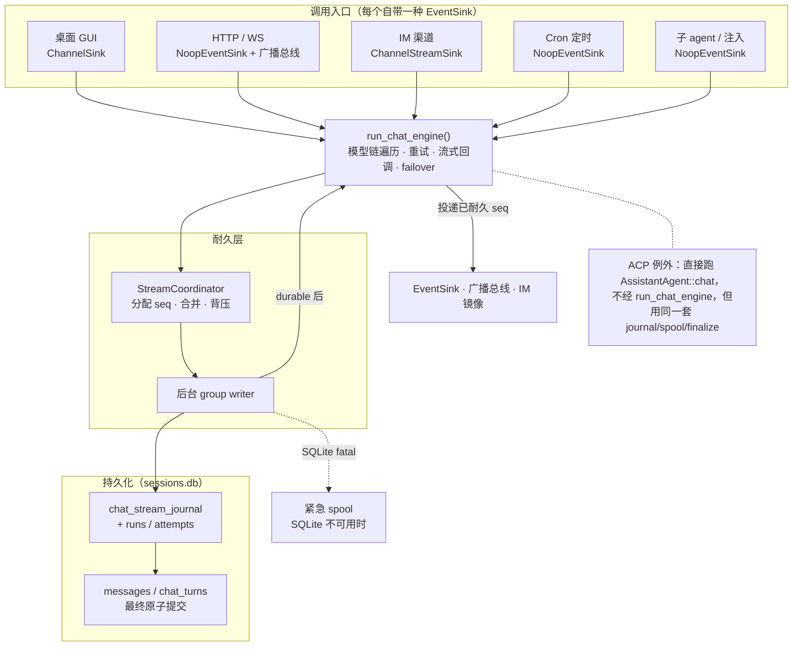
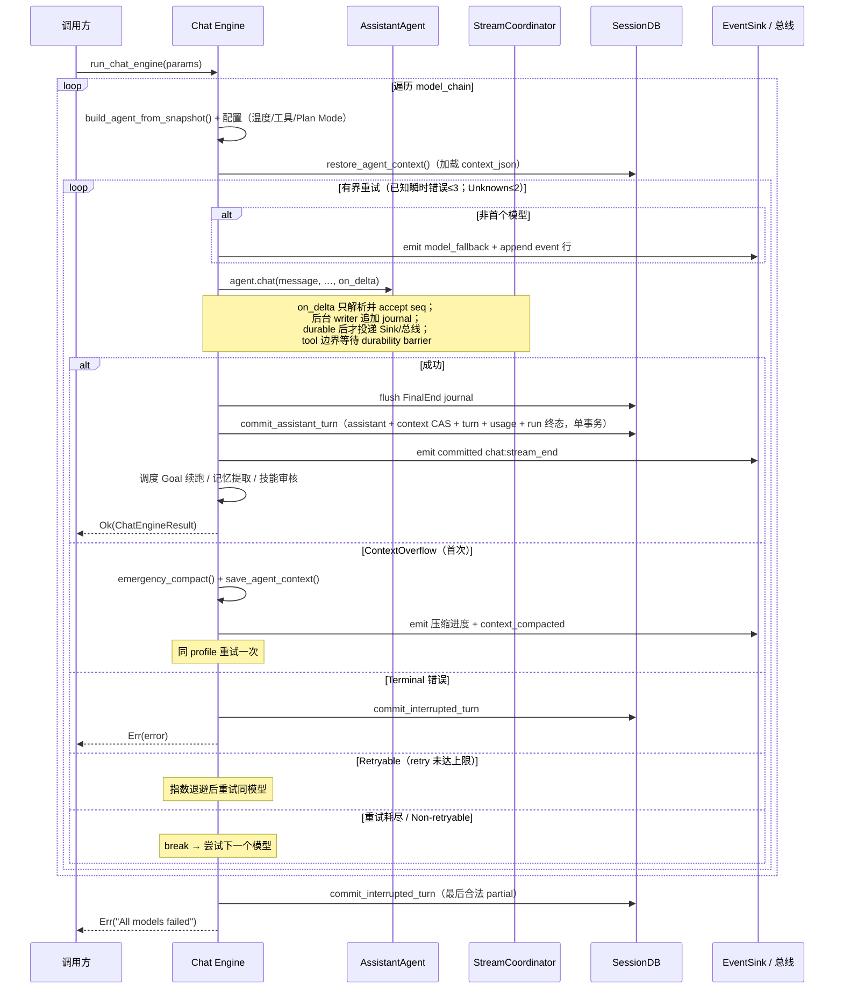
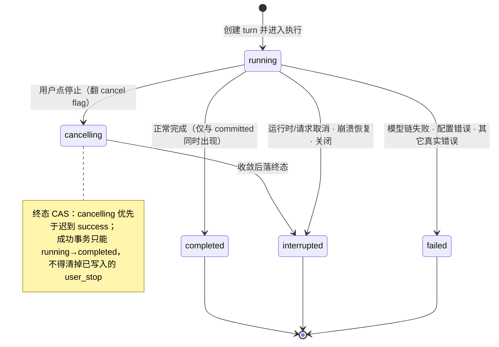
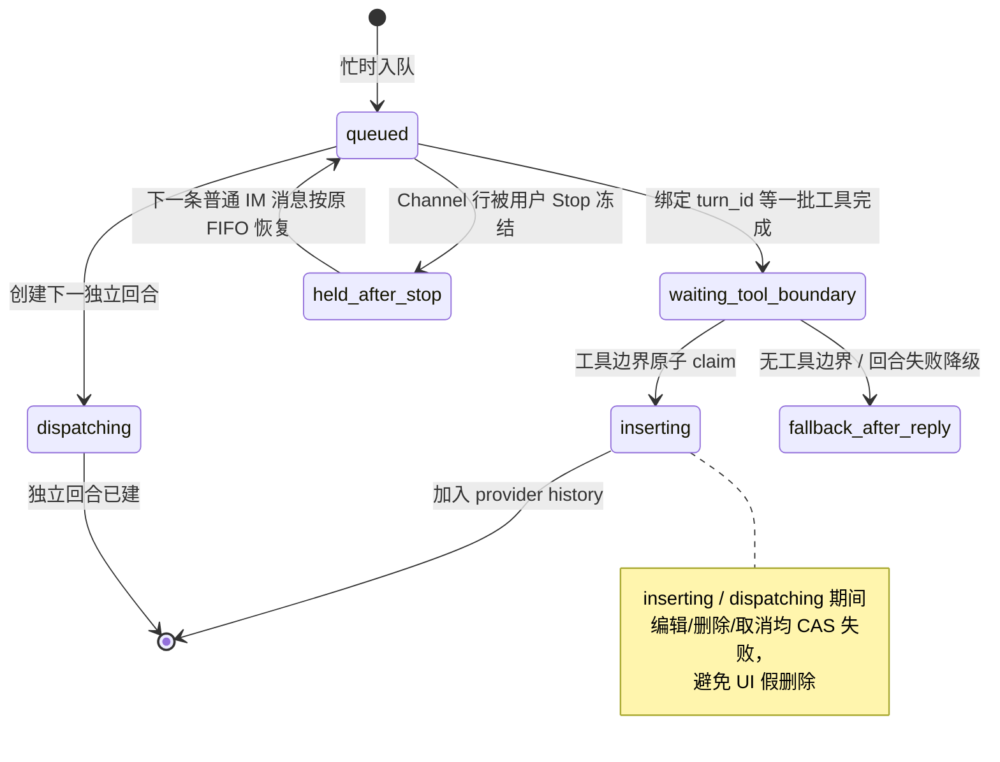
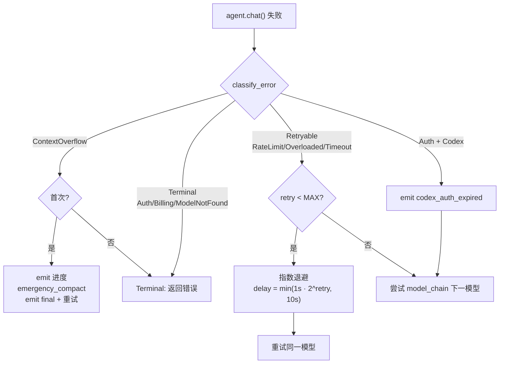
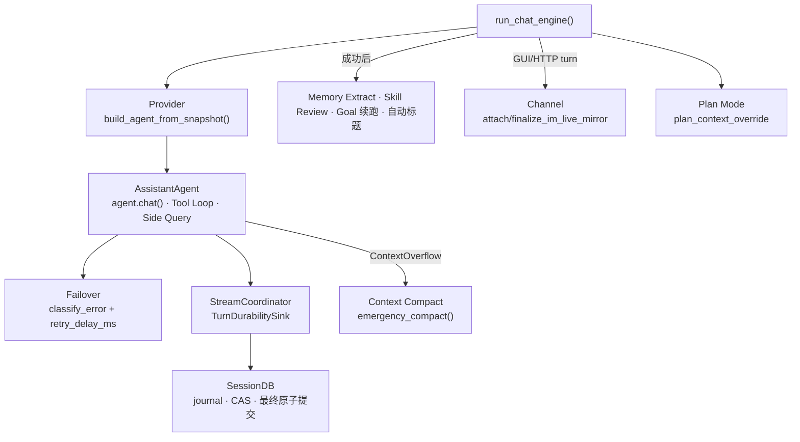

# Chat Engine 对话引擎架构

> 返回 [文档索引](../../README.md) | 更新时间：2026-08-10

**关联源码**

- 引擎入口：[`chat_engine/engine.rs`](../../../crates/ha-core/src/chat_engine/engine.rs) 的 `run_chat_engine()`
- 类型与 sink：[`chat_engine/types.rs`](../../../crates/ha-core/src/chat_engine/types.rs)
- 耐久流协调器：[`chat_engine/durability.rs`](../../../crates/ha-core/src/chat_engine/durability.rs) + [`session/stream_persistence.rs`](../../../crates/ha-core/src/session/stream_persistence.rs)
- 停止与终态收敛：[`chat_engine/stop.rs`](../../../crates/ha-core/src/chat_engine/stop.rs) · [`chat_engine/finalize/`](../../../crates/ha-core/src/chat_engine/finalize/mod.rs) · [`chat_engine/active_turn.rs`](../../../crates/ha-core/src/chat_engine/active_turn.rs)
- 中性 durability trait：[`turn_durability.rs`](../../../crates/ha-core/src/turn_durability.rs)
- 相关子系统：[failover](../agent/failover.md) · [context-compact](context-compact.md) · [session](session.md) · [memory](memory.md)

---

## 目录

- [核心思想](#核心思想)
- [模块结构](#模块结构)
- [核心类型](#核心类型)
- [请求流程](#请求流程)
- [耐久流协调器](#耐久流协调器)
- [流式事件协议](#流式事件协议)
- [广播与重载恢复](#广播与重载恢复)
- [Turn 生命周期与 Stop 恢复](#turn-生命周期与-stop-恢复)
- [统一 Turn Finalize](#统一-turn-finalize)
- [用户消息持久队列](#用户消息持久队列)
- [Failover 集成](#failover-集成)
- [Post-turn Effects 与记忆提取门控](#post-turn-effects-与记忆提取门控)
- [GUI ↔ IM live 流式镜像](#gui--im-live-流式镜像)
- [集成关系](#集成关系)
- [文件清单](#文件清单)

---

## 核心思想

一个 AI 助手会从很多地方收到"请回一句话"的请求：桌面用户在窗口里打字、外部 HTTP 客户端调 API、IM 渠道转发一条消息、定时任务到点触发、子 agent 递归调用、IDE 走 ACP 协议直连。这些入口的**输出通道**各不相同（Tauri IPC、WebSocket、Telegram 消息编辑、stdio……），但它们**背后要做的事完全一样**：构建 Agent、恢复上下文、驱动一轮 LLM + 工具循环、把增量流式吐出去、失败了降级重试、成功了原子落库、再排一些后处理。

Chat Engine 就是把这套"后台要做的事"收敛成**唯一编排入口** `run_chat_engine()`。每个调用方只需要做两件事：准备一个 `ChatEngineParams` 参数包，塞进一个实现了 `EventSink` 的输出适配器。引擎不关心事件最终流到哪个屏幕，只负责把"发生了什么"以稳定的 JSON 事件协议推给 sink。

它要解决的三个关键难题，构成了本文的主线：

1. **一份逻辑，多种传输** —— 用 `EventSink` trait 抽象输出层、用 `ChatSource` 枚举区分来源语义，业务代码不再为每个入口复制一份工具循环 / 上下文落库路径。
2. **耐久后展示（durable-before-display）** —— 用户看到的每一段文字，落盘副本必然已经存在。provider 吐出的 delta 先进 `StreamCoordinator` 拿到单调 `seq` 并写进 journal，事务成功后才准许广播到任何屏幕。这样刷新页面、进程崩溃、热重启都能无损重放，永远不会出现"界面显示了但数据库里没有"的幽灵内容。
3. **确定性的中断与恢复** —— 用户停止、运行时取消、模型链失败、压缩失败、进程崩溃……所有"非自然完成"都汇入统一的 finalize 协议，按当前 Provider 的原生格式重建 partial，落一个可解释的系统事件，并保证终态写入幂等——迟到的成功提交绝不能把已经中断的回合翻回成功。



各入口与其 `EventSink` 实现的对应关系：

| 来源（`ChatSource`） | EventSink 实现 | 实时输出如何到达用户 |
|---|---|---|
| 桌面 GUI（`Desktop`） | `ChannelSink`（包裹 `tauri::ipc::Channel`，定义在 `src-tauri`） | 事件直接推给 Tauri WebView 前端 |
| HTTP / WS（`Http`） | `NoopEventSink`（定义在 ha-core） | per-call sink 丢弃，浏览器通过 `chat:stream_delta` 广播总线 + `/ws/events` 取流 |
| IM 渠道（`Channel`） | `ChannelStreamSink` | 双路：`channel:stream_delta` 事件给 GUI 镜像 + `mpsc` 转发驱动 IM 渐进式消息编辑 |
| Cron 定时（`Cron`） | `NoopEventSink` | 无实时消费方；最终结果由 Cron delivery 处理 |
| 子 agent / 注入（`Subagent` / `ParentInjection`） | `NoopEventSink` | 后台执行；`ParentInjection` 的回合仍走广播总线可被前端重连 |
| ACP 协议（`Acp`） | stdio 协议输出层 | IDE 直连；不经 `run_chat_engine`，但创建同类 durability run |

## 模块结构

```
crates/ha-core/src/chat_engine/
├── mod.rs               模块声明、re-export、Stop watchdog 编排
├── types.rs             EventSink trait · ChatEngineParams/Result · CapturedUsage · ChannelStreamSink
├── engine.rs            run_chat_engine() 核心引擎（模型链遍历 · 重试循环 · 流式处理 · failover）
├── context.rs           Agent 构建 · 上下文恢复/保存 · 记忆提取门控
├── durability.rs        StreamCoordinator：分配 seq · group commit · 背压 · 耐久后广播
├── spool.rs             SQLite 不可用时的校验帧紧急日志
├── stream_broadcast.rs  chat:stream_delta / chat:stream_end / channel:stream_delta 事件名 + 广播抽象
├── stream_seq.rs        ChatSource 枚举 + 每会话流序号注册表（重载恢复去重 cursor）
├── stop.rs              统一停止服务：stop_session / stop_all_sessions
├── finalize/            统一终态收敛：mod.rs（协调）· copy.rs（文案）· rebuild.rs（provider-native partial）· sentinel.rs（启动因由标记）
├── active_turn.rs       内存 active-turn 注册表 + finalize 重入保护 ring
├── sink_registry.rs     次级 sink fan-out 注册表（GUI turn → IM 镜像）
├── turn_injection.rs    后台结果回注前台的入口辅助
├── quote.rs             用户消息引用/截断
├── im_error_message.rs  IM 渠道错误/取消通知模板
├── im_system_message.rs IM 渠道系统提示（重试/压缩/思考开关）文案
├── persister.rs         legacy placeholder writer（占位行模型），新流不使用、仅兼容期保留
└── active_persisters.rs 进程级 legacy persister 弱引用注册表（信号/崩溃时兜底 flush）
```

中性接口 [`turn_durability.rs`](../../../crates/ha-core/src/turn_durability.rs) 定义 `TurnDurabilitySink`，因此 `AssistantAgent` 通过它把 delta 交给协调器，而不反向依赖 `chat_engine`。

> `persister.rs` / `active_persisters.rs` 是历史"占位行"落库模型（首个 delta 插一行 `streaming`，每 500ms / 1KB 节流 UPDATE，SIGKILL 后由启动 sweep 翻 `orphaned`）。新流已改用 journal + spool 的耐久后展示协议，生产路径不再构造 `StreamPersister`；两文件保留仅为兼容期旧数据与信号处理器的兜底 flush。

## 核心类型

### EventSink trait

抽象事件输出层，把引擎和具体输出通道解耦：

```rust
pub trait EventSink: Send + Sync + 'static {
    fn send(&self, event: &str);
}
```

三种实现：

- **`ChannelSink`**（定义在 `src-tauri/src/commands/chat.rs`）—— 包裹 `tauri::ipc::Channel<String>`，桌面模式 UI 直连，事件直接推到 WebView 前端。
- **`NoopEventSink`**（定义在 `chat_engine/types.rs`）—— 丢弃所有事件。HTTP one-shot、Cron、子 agent fork-and-forget 这类"没有实时 UI 消费方"的入口共用；HTTP 模式真正的浏览器流式输出走 `chat:stream_delta` 广播总线到 `/ws/events`，不依赖 per-call sink。
- **`ChannelStreamSink`**（定义在 `chat_engine/types.rs`）—— IM 渠道 worker 用。它做两件事：(1) 把每帧 raw event 通过 `event_tx`（`mpsc`）转发给后台流式预览任务，驱动 Telegram 等渠道的消息实时编辑；(2) 视 `broadcast_to_bus` 决定是否额外把事件 re-emit 到 `channel:stream_delta` EventBus，让镜像同一 IM 会话的桌面 GUI 也能实时渲染。它还内嵌一个 `RoundTextAccumulator`，按"一轮模型输出 = narration + tool_call + tool_result"分桶，供 engine 返回后 dispatcher 按 `ImReplyMode` fan-out 文本与媒体。

`ChannelStreamSink` 字段一览：

| 字段 | 作用 |
|---|---|
| `event_tx` | 转发 raw event 给流式预览后台任务 |
| `system_notice_tx` | 预格式化的 IM 系统提示（重试/降级/压缩/思考自动关闭），单独成条 `send_message`，不混进 per-round 文本 |
| `round_texts: Arc<Mutex<RoundTextAccumulator>>` | 逐轮累积文本 + 媒体，engine 返回后交给 dispatcher |
| `show_thinking` | per-account `/reason` 状态；`false` 时思考增量从 IM 路径整体丢弃（总线广播仍发，桌面镜像照渲染） |
| `broadcast_to_bus` | IM 入站 turn 为 `true`（GUI 可镜像）；GUI → IM live 镜像为 `false`（原 turn 已驱动 `chat:stream_delta`，再发会双渲） |

### ChatEngineParams

完整的请求参数包，调用方（`commands/chat.rs`、`channel/worker.rs` 等）从 `State<AppState>` 或磁盘一次性构建后传入。

| 分组 | 字段 | 类型 | 说明 |
|---|---|---|---|
| 基础 | `session_id` | `String` | 会话 ID |
| | `agent_id` | `String` | Agent ID |
| | `turn_id` | `Option<String>` | 面向用户的桌面/HTTP 回合持久化 turn id；非交互入口（Cron/subagent/注入/IM）恒 `None`（见下文） |
| | `message` | `String` | 发给模型的用户消息 |
| | `incoming_turn` | `Option<IncomingTurnWire>` | typed mention/slash sidecar；绑定 canonical text digest、UTF-8 source anchors 与 prompt/mention contract version |
| | `display_text` | `Option<String>` | 友好呈现文案（例如显示原始 slash 命令）；不参与 typed binding 真实性或模型 authority |
| | `attachments` | `Vec<Attachment>` | 多模态附件 |
| | `session_db` | `Arc<SessionDB>` | 会话数据库 |
| 模型链 | `model_chain` | `Vec<ActiveModel>` | 预解析的模型降级链 |
| | `providers` | `Vec<ProviderConfig>` | Provider 配置快照 |
| | `codex_token` | `Option<(String, String)>` | Codex OAuth `(access_token, account_id)`；可传 `None`，引擎在链真命中 Codex 时从磁盘 hydrate + refresh，三入口行为一致 |
| Agent 配置 | `resolved_temperature` | `Option<f64>` | 三层覆盖后的温度值 |
| | `compact_config` | `CompactConfig` | 上下文压缩配置 |
| | `run_context` | `Option<RunInstructionContext>` | 封闭来源的受信 Run instruction + 独立 untrusted run-data；不能承载 Skill/Note/File/任意外部正文 |
| | `reasoning_effort` | `Option<String>` | 推理强度 |
| 工具与权限 | `skill_allowed_tools` | `Vec<String>` | Skill 工具白名单（激活带 `allowed-tools` 的技能时设置） |
| | `denied_tools` | `Vec<String>` | 调用方执行策略级工具黑名单（与 schema 级过滤双重防御） |
| | `tool_scope` | `Option<ToolScope>` | 工具可见性收窄（知识空间侧栏传 `Some(Knowledge)`）；仅收窄 schema，非安全边界 |
| | `subagent_depth` | `u32` | 当前子 agent 嵌套深度，用于工具 schema 过滤与子 spawn 限制 |
| | `steer_run_id` | `Option<String>` | 关联 subagent run id；每轮 tool round 末尾 drain 对应 steer mailbox |
| | `auto_approve_tools` | `bool` | true 时所有工具调用免审批（IM 渠道 auto-approve 模式） |
| | `plan_context_override` | `Option<PlanResolvedContext>` | Plan Mode 覆盖：`Some` 时调用方是真相源、引擎不读后端 `plan_mode`（`spawn_plan_subagent` 用）；`None` 时引擎自读且中途探测可 re-sync |
| 行为开关 | `cancel` | `Arc<AtomicBool>` | 取消信号 |
| | `follow_global_reasoning_effort` | `bool` | Provider 循环是否在 turn 中途重读全局 reasoning effort |
| | `post_turn_effects` | `bool` | 成功后是否调度记忆提取 / 技能审核（subagent 等关掉）；会话标题有独立门控，不受此开关控制 |
| | `abort_on_cancel` | `bool` | 取消时是否返回 `Err`；已耐久 partial/tool 仍原子收敛，不因 source 不可见而丢弃 |
| | `persist_final_error_event` | `bool` | 引擎是否落自身的最终错误事件（Channel 等已自管的入口设 false） |
| 路由与身份 | `source` | `ChatSource` | 流入口标识，驱动 `/api/server/status` 的 `activeChatCounts` 分类与多处输出语义 |
| | `ui_surface` | `Option<ChatUiSurface>` | 发起本 turn 的第一方消息列表/输入面；仅产品路由元数据，绝不进模型消息 |
| | `origin_source` | `Option<KbAccessSource>` | 整条调用链的 KB access 来源；子 agent 承接父 turn 的 origin，防 IM 起源链经中性 `Subagent` 重获 KB access |
| | `channel_kb_context` | `Option<ChannelKbContext>` | IM 起源身份，用于 KB access opt-in 门；仅 IM 起源 turn 为 `Some` |
| 输出 | `event_sink` | `Arc<dyn EventSink>` | 事件输出通道 |

#### Typed 资源冻结、准入与耐久发布

引擎在任何 Provider/profile 尝试之前完成一次 turn resolution：验证 sidecar；以 canonical containment + 单次只读文件句柄冻结 typed `@file` 字节。打开过程是 descriptor/handle-rooted 而非 pathname 复检：Unix 从 `/` fd 开始对 canonical root 与相对目标逐组件 `openat(O_NOFOLLOW)`，目录组件叠 `O_DIRECTORY`，final 叠 `O_NONBLOCK` 后用 handle metadata 拒绝 FIFO/device；Windows 从 drive/UNC share root 起逐组件打开 direct-directory handle，拒 reparse point、核对每个 handle 的 final path，并在打开最终文件前一直以禁 `FILE_SHARE_DELETE` 的方式持有整条目录链，因而目录 rename/replacement 只能失败，证明后直接返回同一 file handle。Plans 页产生的 typed `@plan` 由后端独立重解析 registry path、与客户端附件做 canonical 精确匹配，并和 `@file` 作为一个原子批次冻结；解析 `@note`/`@skill`/capability/`@agent`；固定 Skill ceiling；构造 user-role Turn Envelope。Tauri/HTTP 的 direct 与 queue 入口都在任何附件/队列持久化前先做 message-bound/version 校验，并要求 unique File/Plan target set 与 `mention`/`plan_mention` attachment 数量逐类精确对应；同一 target 的重复 mention 共用一个 attachment，额外、缺失或无 sidecar 的 typed source 一律拒绝，ChatEngine 与 queue persistence 再各留一层 defense-in-depth。冻结前的 typed attachment 必须 `data=None`、不得混入 upload/quote metadata，name/MIME/client path 都有 byte 与控制字符上限；服务端冻结后再次验证 name/MIME。文件/Plan 批次的 256 MiB hard ceiling 同时计入 compact raw `Arc<[u8]>`、Attachment 上保留的 Base64、单文件 acquisition/decode peak、每资源 fail-visible reference envelope，以及 direct image 在 canonical conversation、Provider-normalized round、request value、诊断序列化与 HTTP body 间可能并存的 bulk payload copies；reference reserve 从“两次最大合法 filename 的 XML escape 上界 + 固定信封”推导，不依赖裸魔数。batch admission 另留一个不计作已消费的 256 KiB continuation floor，首轮 extraction 不得占用，保证即使只能 reference 也至少可请求一个小的 exact Base64 页。`get_base64_data` 对内联数据只借用，避免进入 Provider payload 前再 clone 一份。超限在分配/发布前显式失败；handle stat 与实际读取长度必须精确相等，stat 后增长或缩短都 fail closed，Vec 的 spare capacity 也在进入 retained turn state 前丢弃。这个上限约束 typed-resource bulk allocations，不代表 source-content 能力或注入字符上限。只读 acquisition 先留在内存，persistent stream run 建立后才把固定长度 snapshot basename（run UUID + resource ref，不含用户文件名）绑定到服务端生成的 run UUID；ownership ledger 在文件原子发布前先独立提交，因此文件不会在尚无 durable owner 时落盘。真正的 filesystem publish 在 `TransactionBehavior::Immediate` writer transaction 中先验证 live run/session、完整 ownership set 与所有 `cleanup_pending=0`，再保持写锁同步发布并 commit；run/session delete trigger 与 drain writer 只能在 gate 提交后推进。若 delete+`NotFound` drain 在 gate 前已完成，row pending/缺失会让晚到发布在写文件前失败；publish/commit 失败则显式把 ownership 标为 pending，由同一可恢复 GC 收敛，不使用时间 lease。普通会话的资源证据还包含 installation-keyed object identity 与 content fingerprint，不把绝对路径、文件正文或 raw hash 写入 receipt/Debug/日志；Incognito 只保留内存 bytes。`initial_context_committed` 事件把 receipt、source anchors、Agent refs、Skill ceiling 与 Run source 写入现有 append-only stream journal，并在 Provider I/O 前 flush。兼容字段 `fileSnapshots` 由 `resourceSnapshotVersion=2` 标识，v2 可同时承载 File/Plan resource snapshot；不另存第二份真相。每个 failover attempt 只引用同一 revision 0 快照，不重新读磁盘、Plan、Note、Skill 或 Hook。

#### Typed 资源恢复与 ownership GC

发布到首次 `initial_context_committed` flush 之间的崩溃窗口由同一 run UUID 收敛：正常失败/取消由 Drop guard 删除未提交批次；live abandoned recovery 与启动恢复先校验该 run **所有 attempt** 的 checksum 和连续 sequence，再扫描会话附件目录的精确 run 前缀。启动恢复还枚举仍由文件表示的 terminal run owner，覆盖 terminal DB commit 与 Drop 之间进程退出的窄窗口。只要任一已验证的 v2 Initial Context 引用某 basename 就保留，否则删除；journal 损坏、identity 不匹配或 basename 非单组件时 fail closed，文件留存而不猜测删除。terminal journal 的 24 小时 GC、消息 edit/retry 或 session cascade 删除 run 时，由 `BEFORE DELETE` trigger 在同一 DB 事务把独立 ownership ledger 标为 cleanup pending；ledger 不对 run/session 设 cascade FK，因而不会在 best-effort `remove_dir_all` 失败时丢掉唯一重试证据。后台先按精确 session/run/basename rooted unlink，Unix 逐组件 `openat` 后 `unlinkat`，Windows 在禁 delete-share 的目录 handle 链存活时删除 final entry；两端都不跟随 symlink/reparse ancestor，final link 只删除目录项本身。`NotFound` 视作崩溃重试成功，再删除 ledger row。清理按 high-watermark 分批跑完，单条失败留到下轮但不阻塞后项；session 整目录删除成功时由同一 `NotFound` ack 收敛。没有 ledger 的 missing/unknown owner 永不猜删。恢复绝不消费 client/journal 提供的任意路径。手输/粘贴的 `@plan:` 同形文本没有 typed sidecar 时只作为普通文本，不触发读取。

#### Typed 资源首轮 materialization

文件类资源首轮 materialization 使用模型上下文窗口的 20% 字符估算预算（总量钳在 8K–200K 字符），多资源等分，避免第一个大文件吃掉整个份额。份额内标记 `materialization="full"`；超限时确定性保留头部 75% 与尾部 25%，标记 `preview`、包含/提取字符数和继续读取工具。文本类型判定只有 `file_extract::is_text_like` 一份，首轮与续读不得各维护扩展名白名单。

#### Typed 资源续读、Office 抽取与 turn 内存账本

typed `@file/@plan` 的后续读取只接受 Turn Envelope 中的 opaque `resourceRef`，始终消费同一冻结 bytes；普通受管附件仍使用既有 `read` 路径。UTF-8 原文用 iterator 做行分页，单页正文最多 64 KiB，超长行通过同一行的 UTF-8 `byte_offset` 继续，不构造全文件 `lines Vec`。DOCX/PPTX/XLSX 首轮和续读共用 manual bounded Office extractor：ZIP 索引、entry 数、单 entry/aggregate declared size 在分配前检查，local/central declaration 必须一致，解压写入固定长度 Vec 后以栈上 1-byte probe 证明 EOF，并校验 CRC；内存 slice XML 走 borrowed event 读取，单属性 raw value/单元素属性数、text event/reference/element-name、最大深度、quick-xml opened-name Vec 的最坏 capacity、XLSX 单 cell 和各解析阶段 live set 都有分配前硬界。XML 的 encoding、attributes、decode/unescape、entity 和 EOF element state 任一异常都让整次抽取失败，且错误离开 bounded parser 前转成固定短分类，不回显恶意 tag/attribute；绝不返回 partial/full。XLSX 按 workbook relationship 保留用户 sheet 名和顺序，并支持 shared/inline string、布尔、错误和常见数值文本。Office 抽取达到 200K 字符上限时显式返回 `extractionTruncated=true`，最终文本页也不能冒充文档 EOF；剩余原始证据只可继续 Base64。

`read_context_resource` 是串行工具。首轮 materialization 在抽取前验证全 turn refs 非空、共享同一 owner 且 baseline/ref-set 一致，并持有 turn ledger 锁直到实际消费提交；无法记账时只把 typed 部分降为预留过的 reference envelope、清掉 typed media，普通附件不受影响。ledger 记录首轮**实际总消费**（text/Office preview 与 PPT embedded media），Provider/profile rebuild 以 `max` 幂等替换、不会重复累加；续读成功结果才累计 retained charge，失败不扣。工具按 `ctx` 的全 turn refs 重建同一 raw/Base64/direct-image/reference baseline，减去 ledger 的 initial + cumulative continuation 后，再为解压、图片 decode 或结果 String/Base64 做 allocation-before-use reservation。ledger Arc 随 refs clone 穿过 Provider/profile rebuild，新 turn 创建新 owner、turn 释放即回收，不依赖进程全局表；因此不能把 256 MiB 当成每次调用的新额度。小且可完整 decode 的图片在同一预算内用 image marker 返回视觉上下文；损坏、像素工作集过大或总预算不足时明确引导 bounded Base64。PDF、legacy XLS 和未知 binary 不走进程内 eager parser，auto/text fail-visible，并保留每页最多 64 KiB 的 exact Base64 访问；请求页超过剩余额度时须缩小 `limit`。preview 是显式投递状态，不冒充模型已完整处理资源。

### ChatEngineResult

```rust
pub struct ChatEngineResult {
    pub response: String,                 // 最终响应文本
    pub model_used: Option<ActiveModel>,  // 实际使用的模型
    pub usage: CapturedUsage,             // 本回合捕获的 token 用量（workflow 子 agent 的 durable 预算据此扣减）
    pub agent: Option<AssistantAgent>,    // Agent 实例（UI chat 用于更新 State）
}
```

### CapturedUsage

从流式 `usage` 事件里折叠出来的 token 用量与性能指标。字段远不止"输入/输出"两项——它把**累计口径**与**最近一轮口径**、以及 **prompt 缓存**读写都分开记，供 Dashboard 用量总账与缓存命中分析使用：

```rust
pub struct CapturedUsage {
    pub input_tokens: Option<i64>,                    // 累计输入
    pub output_tokens: Option<i64>,                   // 累计输出
    pub last_input_tokens: Option<i64>,               // 最近一轮 API 请求的输入
    pub context_input_tokens: Option<i64>,            // 上下文（历史）部分
    pub fresh_input_tokens: Option<i64>,              // 新增（本轮新写入）部分
    pub last_context_input_tokens: Option<i64>,
    pub last_fresh_input_tokens: Option<i64>,
    pub model: Option<String>,
    pub ttft_ms: Option<i64>,                         // Time To First Token
    pub cache_creation_input_tokens: Option<i64>,     // 缓存写（Anthropic prompt cache）
    pub cache_read_input_tokens: Option<i64>,         // 缓存读（命中 / OpenAI cached_tokens）
    pub last_cache_creation_input_tokens: Option<i64>,
    pub last_cache_read_input_tokens: Option<i64>,
}
```

`absorb_event()` 只在事件里真的出现某字段时覆写它，因此多帧 usage 累积不会把已知值抹回 `None`。

## 请求流程

`run_chat_engine()` 遍历模型降级链，对每个模型跑一个有界重试循环，直到成功或全链耗尽：



关键步骤：

1. **初始化** —— 从 `model_chain` 构建 Agent，配置温度、工具限制、Plan Mode 等。
2. **上下文恢复** —— `restore_agent_context()` 从 DB 加载 `context_json`，反序列化后设回 Agent。
3. **流式执行** —— `agent.chat()` 启动 LLM 请求 + Tool Loop，通过 `on_delta` 回调实时处理增量。
4. **增量耐久** —— 协调器追加 journal，事务提交后才把对应 `seq` 广播；工具边界使用强制 durability barrier。
5. **最终提交** —— `commit_assistant_turn()` 在单个事务里原子写 assistant、context CAS、chat turn、usage 与 run 终态。
6. **可见收尾** —— 最终事务成功后才发 committed `chat:stream_end`，再后台调度 Goal 续跑 / 记忆提取 / 技能审核。
7. **错误处理** —— 分类错误，决定重试 / 降级 / 终止，非自然完成一律走统一 finalize。

## 耐久流协调器

这是整个引擎的心脏，也是"耐久后展示"原则的落地处。

**问题**：LLM 流式输出是逐 token 到达的。如果边收边推给界面、事后再落库，那么进程在中途崩溃时，用户已经看到的半截回答就没有可恢复的副本；刷新页面也会丢掉尚未落库的尾部。反过来，如果每个 token 都同步写一次 SQLite，回调热路径会被磁盘 IO 拖垮。

**解法**：在 provider delta 和"展示/落库"之间插入 `StreamCoordinator`，把两者解耦成一条流水线——**先耐久，再展示**。回调热路径只做解析、短锁追加、通知 writer；真正的 SQLite 事务在后台 writer 里批量做；只有已经落盘的 `seq` 才准许投递到任何屏幕。

```mermaid
flowchart LR
    Delta["provider delta<br/>(on_delta 回调)"] --> Coord

    subgraph Coord["StreamCoordinator（短锁热路径）"]
        Seq["分配单调 seq"]
        Merge["合并相邻 text/thinking"]
        Buf["dirty buffer"]
    end

    Coord --> Writer

    subgraph Writer["后台 group writer"]
        Flush["100ms / 16KiB 触发<br/>tool/round/stop/end 立即 barrier"]
        Backp["背压：lag/dirty 超阈值<br/>先停读 provider"]
    end

    Writer -->|正常| Journal["chat_stream_journal<br/>WAL + synchronous=FULL<br/>BLAKE3 checksum"]
    Writer -.->|SQLite fatal| Spool["stream_spool/{run}.log<br/>0600 · sync_data 后才广播"]

    Journal --> Durable{{"durable_seq 推进"}}
    Spool --> Durable

    Durable -->|seq ≤ durable_seq| Fan

    subgraph Fan["fan-out（耐久后才发）"]
        Sink1["per-call EventSink"]
        Bus["chat:stream_delta 总线"]
        Mirror["SinkRegistry → IM 镜像"]
    end
```



### run / attempt / journal 主台账与 typed snapshot ledger

每个跑 `AssistantAgent::chat` + tool loop 的会话 turn 都有独立 `persistence_run_id`。流恢复事实落在三张主表；typed 资源另用一张不可随 run/session cascade 丢失的 ownership ledger（均定义在 [`session/stream_persistence.rs`](../../../crates/ha-core/src/session/stream_persistence.rs)）：

| 表 | 主键 | 记什么 |
|---|---|---|
| `chat_stream_runs` | `run_id` | 一次 turn 的 run 头：`accepted / durable / checkpoint / committed` 四条水位、`status`、可选 `turn_id`、`base_context_json` |
| `chat_stream_attempts` | `(run_id, attempt_no)` | 每次 profile/model 尝试的状态与水位；失败尝试标 `superseded`，journal 保留 |
| `chat_stream_journal` | `(run_id, attempt_no, block_no)` | 追加式 compact payload、`seq_start/seq_end` 范围与 BLAKE3 `checksum` |
| `chat_stream_typed_snapshots` | `(run_id, snapshot_name)` | File/Plan snapshot 的独立 ownership ledger：filesystem publish 前先登记；publish gate 在 `IMMEDIATE` 事务内校验 live owner、精确 basename 集合与 `cleanup_pending=0`；run/session 删除先由 trigger 标 pending，rooted GC 删除文件或确认 `NotFound` 后才 ack 删除行 |

另有 `chat_stream_context_checkpoints` 保存 provider-native context 的中途快照（`through_seq`），供 round checkpoint 与恢复重建。

一些非显然的规则：

- **每个 attempt 递增 `attempt_no`**。切换 attempt 时在一个事务内把 session context CAS 恢复到 run 起点、删除该 run 已产生的 checkpoint materialized rows、标记旧 attempt superseded；工具调用审计仍完整留在 journal。新 attempt 的 reset marker 只在该事务完成后才广播。
- **模型链全部失败**时，选最后一个含合法可见前缀的尝试，生成 partial assistant。
- **不启动模型流的确定性本地回复**（如 Plan sub-agent 的"已转发/已启动"确认）不创建空 journal run，但仍走同一个 `commit_assistant_turn(run_id=None)` 原子写 assistant、CAS context、完成 chat_turn，且提交后才展示。
- `messages.persistence_run_id + logical_block_seq` 的部分唯一索引保证恢复重放幂等；终态 journal 默认保留 24 小时，再由每日运行的后台 GC 删除。

### Flush、group commit 与背压

默认 100ms 或 16KiB 触发普通 flush；tool call/result、role/round 边界、stop 和 final end 使用立即 durability barrier。进程级 writer 可把多个 session 的批次合进同一短事务，目标是单活跃流每秒普通提交不超过 10–20 次。

背压阈值（[`durability.rs`](../../../crates/ha-core/src/chat_engine/durability.rs) 常量）：

| 触发 | 阈值 | 动作 |
|---|---|---|
| soft lag / dirty | durable 落后 > 2s **或** dirty buffer > 1MiB | 停止继续读取 provider，等 writer 追上 |
| hard lag / dirty | 落后 > 10s **或** dirty > 4MiB | 取消模型，收敛为 `PersistenceUnavailable`；未耐久内容不得广播 |

工具执行前必须 `flush(ToolBoundary)`，所以工具副作用发生前，tool call 及前文已在 journal；tool result 在下一轮模型请求前同样 checkpoint。执行器只有在 tool-call durable barrier 完成后才允许产生副作用。

`HA_STREAM_DURABILITY_LEGACY_WRITER=1` 可关闭跨会话 group commit，回退为逐 run 事务，供紧急诊断使用；它**不**回退最终原子事务、错误传播或耐久后展示规则。

### Context CAS 与最终原子提交

`sessions.context_revision / context_run_id` 是上下文写入的 CAS 边界；run/attempt 的 `checkpoint_seq` 记录 provider-native context 已覆盖到哪个 durable journal seq。round checkpoint 在同一事务中物化 durable journal 前缀、推进 checkpoint 水位并更新 context；compaction 与最终提交都必须携带预期 revision。**冲突时 fail closed**，不允许旧 Agent 快照覆盖新上下文。失败/崩溃收敛只把 checkpoint 后缀按 Anthropic / OpenAI Chat / Responses / Codex 原生结构重建，避免重复已完成 round，同时为未完成 tool call 合成匹配 result。

正常完成只有一个 `commit_assistant_turn` 事务，依次完成 journal 物化、最终 assistant、legacy trailing placeholder 清理、完整 context、交互式 `chat_turns`、usage ledger、run/attempt 终态和 session 时间。任何 SQL 失败整体回滚，turn 不得伪装 completed。成功 `chat:stream_end` 只能在该事务提交后发送。

停止/失败由 `commit_interrupted_turn` 原子收敛：只物化 checksum 正确且 seq 连续的最大前缀，写明确恢复/中断事件，并把 turn/run 标为 interrupted/failed/recovered。

### 紧急 spool 与 Incognito

`sessions.db` 使用 WAL + `synchronous=FULL`。SQLite fatal 或持续不可用时，非无痕 run 写 `~/.hope-agent/stream_spool/{run_id}.log`：目录 0700、文件 0600、拒绝 symlink / canonical escape，每帧带长度、attempt/block、seq 范围、BLAKE3 checksum，并在广播前 `sync_data`；Unix 首次建文件还会 fsync 0700 父目录确保目录项耐久。启动导入并完成 DB 事务后才删除 spool。SQLite 与 spool 都失败时立即停止 provider，不展示无法恢复的尾部。损坏 spool 的合法前缀恢复后，原文件改名隔离并保留 24 小时由 journal GC 同步清理——不会因恢复成功就立即销毁损坏证据。

Incognito 使用纯内存 coordinator，不创建 run/journal/spool/usage 行；其"关闭即焚"隐私契约优先，因此不承诺进程崩溃恢复。

正常 journal flush 以结构化 debug 日志记录 batch 数、payload bytes 和 latency；背压、commit 失败、spool fallback、恢复 bytes、checksum/gap 只记录 run/seq/尺寸/错误，不记录正文。

## 流式事件协议

所有事件通过 `EventSink.send()` 以 JSON 字符串推送，前端按 `type` 字段分发：

| type | 主要字段 | 说明 |
|---|---|---|
| `usage` | `input_tokens, output_tokens, model, ttft_ms, duration_ms` | Token 用量和性能指标 |
| `text_delta` | `text` | 文本增量 |
| `thinking_delta` | `content` | 思考内容增量 |
| `tool_call` | `call_id, name, arguments, replay_safe` | 工具调用发起；`replay_safe=true` 仅用于并发安全的只读工具 |
| `tool_result` | `call_id, result, duration_ms, is_error, replay_safe` | 工具执行结果；`replay_safe` 与对应调用一致 |
| `model_fallback` | `model, from_model, provider_id, model_id, reason, attempt, total, error` | 模型降级通知 |
| `model_retry` | `model, provider_id, model_id, reason, attempt, total, delay_ms, recovery_id, can_switch_model` | 同模型退避重试；GUI 显示倒计时/进度并可精确控制本次等待 |
| `model_chain_retry` | `reason, attempt, total, delay_ms, recovery_id, can_switch_model=false` | fallback chain 整轮恢复；GUI 只提供"立即开始" |
| `profile_rotation` | `provider_id, model_id, from_profile, to_profile, reason` | 同模型内切换 auth profile（预算耗尽轮换 Key） |
| `context_compaction_progress` | `data.phase, data.kind` | live-only 压缩进度；不持久化，GUI 用同一条 banner 原地更新 |
| `context_compacted` | `data` | 压缩完成；final 事件是完成态唯一真相源，Tier ≥ 2 持久化 |
| `codex_auth_expired` | `error` | Codex OAuth Token 过期，触发重新授权流程 |
| `event` | （通用） | 其他系统事件 |

### 流式回调如何工作

`on_delta` 闭包在 `agent.chat()` 流式输出过程中被调用，只做解析、内存追加与通知 writer：

- **累积与 flush**：相邻 text/thinking 在 per-run buffer 合并，journal 只追加增量块、不反复覆盖累计全文；100ms / 16KiB 触发普通 flush，语义边界异步等待 durable 水位；最终响应先 flush 到 `accepted_seq == durable_seq` 再进最终事务。`thinking_start_time` 记录首个 `thinking_delta` 的时间以计算思考总耗时。
- **工具事件持久化**：`tool_call`/`tool_result` 都先作为 journal event 耐久；checkpoint / final commit 再按 `persistence_run_id + logical_block_seq` 幂等物化 Tool 消息。执行器只有在 tool-call durable barrier 完成后才允许产生副作用。

## 广播与重载恢复

每条已耐久的 stream delta 走双通道投递：

1. **主路径** —— `EventSink.send()` 直接推 per-call sink（桌面 IPC Channel / `NoopEventSink`）。
2. **广播路径** —— 同一事件经 `stream_broadcast` 注入序号后，通过 `EventBus` 发 `chat:stream_delta`（带 `{sessionId, seq}`）；HTTP / Tauri 前端订阅 `/ws/events` 或 Tauri 事件总线时统一从这里取流。

seq 由 coordinator 在 accept 时分配，只有 `seq <= durable_seq` 才能进入上述通道；`lastSeq` 只是 `acceptedSeq` 的兼容别名。`SessionStreamState` 还暴露 `durableSeq / committedSeq / persistenceRunId`，但前端不得把 cursor 直接跳到尚未通过 DB 快照验证的 accepted 水位。

**重载 handshake** 顺序固定为：先注册 delta/end listener，再并行读取 DB 消息窗口、`get_session_stream_state` 和 `get_session_stream_snapshot`；用 snapshot 替换尾部临时 assistant，按 seq 重放 durable prefix，最后应用请求期间缓存的 `seq > throughSeq` 事件。已 committed/recovered 的 snapshot 已被 canonical DB messages 表示，不重复重放 journal。重复 delta/snapshot/迟到 stream_end 都按 `(stream_id, seq)` 幂等。

`chat:stream_end` 增量字段为 `finalSeq / durableSeq / assistantMessageId / persistenceStatus`。只有 `persistenceStatus=committed` 才允许 `status=completed`；pending/degraded end 可以解除 loading，但不能清掉当前已展示的耐久内容。

来源之间的输出语义由 `ChatSource` 区分（`broadcasts_to_user_ui` / `tracks_seq` / `fires_user_lifecycle_hooks` / `holds_foreground_idle_guard` 等谓词）：所有来源共用同一耐久协议，但 IM 渠道刻意走独立的 `channel:stream_delta` 事件名，避免与主 chat 流混淆（两条路径没有共享 `_oc_seq` 可去重）。`sessions_send(wait=true)` 也必须走 Chat Engine；其调用超时会先设置 cancel，并给统一中断事务一个有界收敛窗口，禁止再直接 drop 私有 `AssistantAgent::chat` future。

**启动恢复严格在 async jobs / subagent injection 重放前运行**：先兼容旧 streaming/orphaned 行，再导入 spool、扫描非终态 run、校验 checksum 与 seq 连续性，按 run/attempt 幂等物化最大合法前缀并写 Crash/Shutdown marker。缺口之后的 journal 不会被拼接，损坏原文保留到 GC。

所有 stream 统一走 `/ws/events` 单通道。

## Turn 生命周期与 Stop 恢复

用户可见的桌面 / HTTP chat turn 在进入 Chat Engine **前**就创建持久化 `chat_turns` 记录，并把 `turn_id` 传入 `ChatEngineParams`。turn 生命周期独立于 Plan task、stream seq 与消息持久化：



- `running`：turn 已创建并进入执行路径。
- `cancelling`：用户请求停止，后端只标记对应 session + turn 的 cancel flag。
- `completed`：正常完成，**只允许与 committed 同时出现**。
- `interrupted`：用户停止、运行时取消、崩溃恢复等非错误中断。
- `failed`：模型链失败、配置错误或其它真实错误。

终态写入是幂等的，`finish_chat_turn_once` / `finish_chat_turn_after_execution` 不会让 late success 覆盖已中断 turn。Chat Engine 在可见 stream 结束时广播 `chat:stream_end`，payload 带 `sessionId / streamId / turnId / status / interruptReason / error / finalSeq / durableSeq / assistantMessageId / persistenceStatus`，前端据此清理 loading 并恢复停止后的展示状态。

### 主动 Stop 的退出预算

停止不是一个瞬时操作——在途工具可能正在写文件、子进程正在跑、审批弹窗正在等。Stop 编排把"尽快让出前台"和"别丢已耐久内容"分层处理，各有独立时间预算：

| 层 | 预算 | 动作 |
|---|---|---|
| cancel flag | 立即 | 阻止新 provider round / 新 tool dispatch |
| 在途 tool | ≤ 5s | 撤销审批、结束子进程、回收刚 detach 的 job（`STOP_RUNTIME_CLEANUP_TIMEOUT`） |
| Agent loop 协作收尾 | ≤ 6s | 已产生可见 runtime 事件的 loop 协作退出；超时 drop future 进统一中断提交（`CHAT_CANCEL_COOPERATIVE_GRACE`） |
| watchdog 兜底 | 8s | 只作最后的 journal 收敛兜底，不与正常 finalizer 抢终态（`CHAT_STOP_WATCHDOG_GRACE`） |

Stop 编排自身也有独立预算：先同步翻转所有已知 cancel flag、广播 `cancelling` 并启动 watchdog，再并行执行 DB 标记（2s）、审批/问答撤销（2s）与 runtime 清理（5s）。编排开始时须建立 session 的短暂 Stop gate（全局 Stop 用 process-wide gate），阻止替代 turn 在旧资源快照完成前 acquire；runtime 先快照精确 job/subagent/process id 再逐项取消，超时后不得重新按 session 枚举。审批/问答直接 timeout 原 future（禁止 detach 会话级 sweep），因此迟到清理不会消费续聊新建的交互。

一些容易踩坑的、不读代码看不出来的约束：

- **watchdog 必须再校验 `turn_id`**：读 session-keyed live durability 时若 turn 不匹配，只按旧 turn 查找并恢复其 persistence run，绝不能把新 turn 的 journal 提交到旧 turn。进入仅按 session 定位的 legacy fallback 前须重建 Stop gate、确认没有不同 active turn、旧 turn 仍是 DB 最新一代；即使续聊已快速完成、live coordinator 已注销，也不得从最新消息反向重建旧 turn。
- **停止发生在用户消息落库前**：`UserPromptSubmit` 预检必须与该 turn 的 cancel flag 竞争；此时须先广播终态并释放精确 active-turn guard，前端把未发出内容恢复为草稿。空会话/worktree 的 Git-aware 回滚随后在后台按 durable bootstrap row 收敛，不能让 Git/SQLite 清理阻塞续聊。
- **请求生命周期资源也要能立即 abort**：GUI 的 plan mention 展开、文件系统配置读取、附件 staging 都属 request 生命周期；本地 Stop 必须立即 abort 等待。上传若不可物理取消，迟到返回的 upload lease 必须自动 discard，不得形成孤儿附件，也不得把用户停止显示为上传失败。
- **项目首轮 bootstrap 已完成时**：回滚必须先把 bootstrap 置为终态并经 Git-aware 路径 discard 托管 worktree，再删空会话；禁止先靠 session FK cascade 丢掉 worktree 注册行。
- **懒创建会话的定位**：`session_created` 前用不透明 `clientRequestId` 定位 active turn，此时点停止不得退化成"停止所有会话"；已知 session 但 `turn_started` 尚未到达的窗口也用同一 request id latch。

### 统一停止入口

Desktop、HTTP 与 IM `/stop` 在解析出 session 后必须统一进入 [`chat_engine::stop::stop_session`](../../../crates/ha-core/src/chat_engine/stop.rs)：设置精确 active-turn cancel、写 `cancelling`、拒绝待审批、撤销 live `ask_user` 并取消 session-owned runtime；共享服务也翻转该 session 的全部 Channel preflight registrations，所以 GUI/HTTP 停止 attached session 时不会漏掉 IM 的 active-turn 注册前窗口。同 session 的并发入站逐个注册、一次 Stop 全部翻转；交互入口与 stream transport 可以不同，停止的业务语义不得分叉。

无 target 的全局紧急停止统一进入 `stop_all_sessions`，Desktop / HTTP shell 只负责先翻转各自 transport-local handle；全局路径不复制一套 DB、审批或 runtime 清理逻辑。

ACP 的 `session/cancel` 也调用同一 session-stop 服务；由于 ACP prompt 同步占用业务主循环，stdio reader 必须独立读取并先翻转每轮独立 token，不能等 prompt 返回后才处理 cancel。ACP 的 hook、provider 构造、重试和 Agent loop 均须观察该 token，停止胜出后同样以 `Interrupted/user_stop` 保留 journal 前缀。

**终态 CAS**：`cancelling` 优先于迟到的 success commit——成功事务只能从 `running` 转 `completed`，不得清掉已写入的 `user_stop` 并把会话翻回成功。前端的 loading / optimistic placeholder 归属具体 chat request；旧请求即使在 watchdog 放行后才返回，其 `finally`、status、stream end 及 success commit 都必须按 request/turn ownership 拒绝覆盖新回合。

启动恢复会把 DB 中残留的 `running` / `cancelling` turn 走统一 finalize（见下节）拿到正确的 `Shutdown` / `Crash` reason 落终态，同时清理内存 `active_turn` registry，避免热重启后 DB 已中断但内存仍报 active。

### Bundled HTTP UI：turn 不挂在请求 future 上

`POST /api/chat/ui` 不把 Chat Engine 生命周期挂在 Axum request future 上：通过浏览器来源校验且非 incognito 的请求先进入 server-owned Tokio task，完成 Session、user message、`chat_turn(running)` 同一持久化边界后立即返回 `202` ACK `{sessionId, turnId, accepted:true}`；worker 独立继续执行。`clientRequestId` + payload SHA-256 指纹随 turn 落 SQLite，进程内 registry 只负责合并提交前的并发 waiter——因此服务重启或 registry 淘汰后，相同 payload 重试仍返回原 Session/turn（不重复落用户消息），不同 payload 复用同 id 返回 409。浏览器用 `/ws/events` 接收流，并以 `GET /api/chat/turns/{turnId}` 补齐 ACK/end 竞态或断线期间漏掉的精确终态；页面、WebSocket 或反向代理断开只丢观察者，不再取消 worker。

server-owned UI turn 运行期间注册 session-scoped `ReattachableUiSessionGuard`：即使当前没有 `/ws/events` 客户端，后续 Ask 仍走正常 pending 审批，用户重开页面后可恢复回答；它沿后台 subagent 的排队 + 执行生命周期传播，并由结果回投及其 `PENDING_INJECTIONS` 重排队继续持有，避免父 turn 先结束后子任务/回投被误判为无人值守。它不自动批准任何操作，cron 的恒 Unattended 判定仍优先。所有派生工作终态后 guard 自动撤销。Incognito 仍遵守 close-and-burn；公共同步 API `POST /api/chat` 也保留"请求返回即回合结束"的兼容契约。

同步 HTTP / incognito 路径仍持有两个 Drop 兜底 guard：一是只移除本次请求注册的 cancel flag，避免客户端断开时把 stale cancel 留在 `chat_cancels`；二是 request future 被丢弃时，外层 guard 只把 turn 标 `cancelling/runtime_cancel`，由 Chat Engine `StreamLifecycle::Drop` 按精确 `persistence_run_id` 从 durable prefix 后台收敛并广播终态。服务进程退出则不透明重放任意副作用，交给启动恢复标记 Interrupted。

`turn_id = None` 是非交互入口的显式设计：Cron、subagent、parent injection、IM channel worker 与 ACP 不参与 GUI/HTTP 的 turn 级 stop 与 active-turn registry；但它们全部拥有 `persistence_run_id` 并使用相同 journal/spool/最终提交协议。两种标识不能混用。

### 后台结果回注与前台让行

"后台任务仍在运行"和"用户能否继续聊天"是正交的——唯一共享的是 provider / 机器资源与有界并发配额：

- Desktop / HTTP / IM / Cron 的前台回合在 `run_chat_engine` 入口持有 `ChatSessionGuard`。subagent、异步工具和 Workflow 阶段结果调用 `inject_and_run_parent` 时先等该计数归零，因此不会把后台结果插进正在流式输出的用户回合。
- 同一 session 只允许一个 parent injection；其他 source 进入 `PENDING_INJECTIONS` 串行队列。等待超时不丢结果，而是继续排队，由前台 guard drop 后唤醒。
- 用户新发消息会取消当前 injection model turn 并重新排队；若 source 已被模型通过结果查询显式消费，`mark_run_fetched` 按 source run id 取消并抑制重试。Workflow checkpoint 另有 durable delivered/suppressed 事件，重启只补尚未 settled 的阶段结果。
- 后台工具与 Workflow 脚本有各自 worker/队列，子 Agent 运行在独立 child session；它们等待终态不持有前台 `ChatSessionGuard`。

## 统一 Turn Finalize

所有"非自然完成"的 turn 路径（用户停止 / 运行时/请求取消 / 模型链失败 / 压缩失败 / 应用关闭 / 崩溃 / 配置缺失 / 其它内部异常）走统一的 reason → 文案 → provider-native 重建协议。新 journal run 最终由 `commit_interrupted_turn` 原子提交，legacy 行走 [`finalize_turn_context`](../../../crates/ha-core/src/chat_engine/finalize/mod.rs) 收敛点，把"发生了什么"以三种形态同步出去：

1. **`context_json`**：按 reason 在 history 末尾拼一条 `[系统事件] …` 中文 marker，让模型下一轮明确感知；partial 内容（已产生的 text / thinking / tool_use）按当前 Provider 的 native 格式重建为结构化 blocks，被中断的 `tool_use` 自动合成 `tool_result = "Tool execution was interrupted"`，防止 Anthropic 等强校验 API 下一轮返 400。
2. **`messages` 表 `role=event` 行**：用户版陈述性文案（已停止 / 应用已关闭 / 认证失败 …），`is_error` 视 reason 设置；GUI 走现有事件居中渲染管线。
3. **IM 渠道通知（如 attach）**：复用 [`im_error_message`](../../../crates/ha-core/src/chat_engine/im_error_message.rs) 的 `CANCEL_NOTICE` / `format_im_engine_error` 模板，背景 task spawn 不阻塞 engine 返回。

### TerminationReason 八种

| reason | chat_turn status | interrupt_reason | 触发点 |
|---|---|---|---|
| `UserStop` | Interrupted | UserStop | engine 失败收敛 + 成功路径 cancel 检测；`abort_on_cancel=true` 的 Subagent 仍返回 Err，但已耐久 partial/tool 同样原子收敛 |
| `RuntimeCancel` | Interrupted | RuntimeCancel | engine future 被 runtime/request Drop；按 run_id 重放 durable prefix 后才结束 stream |
| `NoProfileAvailable` | Failed | NoProfile | engine 收敛时 `last_reason=None && last_error=None` + 配置缺失入口 |
| `ProviderFailed { last_kind, last_message, is_codex_auth }` | Failed | ProviderFailed | engine 收敛时 `ExecutorError::Exhausted` |
| `CompactionFailed { detail }` | Failed | CompactionFailed | emergency_compact 跑过仍 over-threshold，下一轮再返 ContextOverflow |
| `Shutdown` | Interrupted | Shutdown | 启动 sweep 看到 sentinel 文件（`~/.hope-agent/.shutdown-clean`），含 SIGTERM/SIGINT 与 dev 热重载 |
| `Crash` | Interrupted | CrashRecovery | 启动 sweep 看到 sentinel 缺失（panic / SIGKILL / 断电 / OOM） |
| `Other { message }` | Failed | Unknown | 内部异常 / 边角失败兜底 |

只有 `UserStop` 被认定为用户主动发起，其余都是系统侧中断（`is_user_initiated()`）。

### provider-native partial 重建

[`rebuild::rebuild_partial_assistant_blocks`](../../../crates/ha-core/src/chat_engine/finalize/rebuild.rs) 按 `provider_kind` 分三个形态重建被中断的 assistant，让下一轮请求不会因结构不合法被 Provider 拒绝：

- **Anthropic**：`{role:assistant, content:[thinking, text, tool_use…]}`，thinking 不需要 signature；tool_use 必须有匹配 tool_result（自动补一条 `{role:user, content:[tool_result blocks]}`）。
- **OpenAI Chat**：`{role:assistant, content, reasoning_content, tool_calls}`，缺失字段直接省略；tool_result 用独立 `{role:tool, tool_call_id, content}` 消息。
- **OpenAI Responses / Codex**：`{type:message, role:assistant, content:[output_text]}` + 顶层 `{type:function_call …}` items。reasoning items 因缺 `encrypted_content`（runtime partial 拿不到），thinking 折叠进 `output_text` 文本；tool_result 用 `{type:function_call_output, call_id, output}` 顶层 item。

partial blocks 在 `[系统事件]` marker 之前 push，所以模型读 history 时先看到结构化 partial，再看到"上面那段被中断了"的解释。

### 启动 sweep（`app_init::recover_startup_session_state`）

执行顺序（同步）：

1. `sentinel::read_and_clear()` → `StartupCause::Clean` / `Crash`（读并原子删标记文件；任何 I/O 错误按 `Crash` 兜底）。
2. `mark_orphaned_streaming_rows()` 把旧版本残留 `streaming` 翻 `orphaned`。
3. `recover_durable_chat_streams()` group-import 紧急 spool，扫描非终态 run，校验各 attempt 的 checksum/seq 连续性并原子重放最大合法前缀；事务完成后才删除正常 spool，损坏 spool 隔离保留到 GC。
4. `find_stale_chat_turns_for_finalize()` 列仍为 `running` / `cancelling` 的 legacy turn（只读、不 UPDATE）。
5. 每个 legacy turn 调 `finalize_turn_context_blocking(cause.to_termination_reason(), …)`：reverse-rebuild 从 messages 表反查 partial 文本 / thinking / tool 行重建结构化 blocks 写回 context_json，并写 event 行 + chat_turn 终态。
6. `active_turn::clear_all()` 清内存 registry。
7. 之后 `start_background_tasks` 才 spawn `async_jobs::replay_pending_jobs`，保证 dispatch_injection 看到的 history 已 finalize。

### 信号处理器（`crash_flush::install_signal_handlers`）

SIGTERM / SIGINT / Ctrl+C / Ctrl+Break 触发 `run_clean_shutdown()`：

1. `sentinel::write_clean_marker()` 写 `~/.hope-agent/.shutdown-clean`，标记下次启动认作 Shutdown。
2. `active_persisters::flush_all_blocking()` 只扫兼容期 legacy streaming placeholder；新流已展示的 seq 此前已落 journal/spool，不依赖信号抢救内存 buffer。
3. `finalize_active_turns_for_shutdown()` 只对**没有 running persistence run** 的 legacy turn 调 `finalize_turn_context_blocking(Shutdown, …)`；新 run 保持非终态，交给下次启动按 journal/spool 原子恢复。
4. `std::process::exit(0)`。

**次序红线**：legacy `flush_all_blocking` 必须在 legacy finalize **之前**；running 新 run 及其关联 chat_turn 必须整体跳过 legacy shutdown finalize，由下次启动的 journal/spool recovery 幂等、原子收敛，禁止先推进 context 或写一个抢跑的 turn 终态。

### panic hook（`crash_flush::install_panic_hook`）

当前是幂等 no-op stub（仅 set 一个 `OnceLock`），**不设全局 `set_hook`、不做 flush、不引用进程组终止**。曾考虑过一个 SIGKILL 已注册 exec 子进程的全局 panic hook，但被否决：tokio task panic 常经 `JoinHandle` 边界被恢复而进程不退出，任意线程 panic 上的全局 kill 会拆掉不相关的长跑用户命令。per-task 子进程清理由 `ProcessGroupGuard::Drop` 负责；新流以每次广播前已耐久的 journal/spool 为保证，不靠 panic hook。panic 不写 sentinel，等同 crash，下次启动 sweep 按 Crash reason 处理。

### exec 孙进程清理（`tools::exec::ProcessGroupGuard`）

`spawn_exec_waiter` 内的 RAII guard：spawn child 后 attach guard，正常完成调 `disarm()`；timeout / 任务 panic / runtime shutdown 时 Drop 自动调 `terminate_process_tree(pid)` 杀整个进程组。它替换了 tokio 的 `kill_on_drop(true)`——后者只 SIGKILL 直接子进程，遇到 `exec` 跑 `sh -c 'cmd1 & cmd2 & wait'` 会把孙进程遗留为孤儿。

### 重入保护

`active_turn::mark_finalized(turn_id) -> bool` 是 test-and-insert 原语：首次 finalize 返回 `true`，同一 turn 后续调用返回 `false`。`finalize_turn_context_blocking` 据此把重复进入 surface 成 `FinalizeOutcome::was_already_finalized = true`，调用方 short-circuit，防止 marker / event 行重复落盘。传 `None`（无 turn_id 的 sweep 路径）恒返 `true`，这些调用方另靠 DB UPDATE 条件保证幂等。

## 用户消息持久队列

忙时（模型正在流式输出）发送的用户消息，以 `sessions.db.queued_turn_user_messages` 为唯一真相源。前端只持有当前会话投影，并在会话切换、窗口恢复和 `chat:turn_queue_changed` 后重新查询。队列按自增 `id` 保证同一 owner 会话内 FIFO，每会话硬上限 `MAX_QUEUED_TURN_MESSAGES_PER_SESSION = 100` 条。`source = desktop | http | channel` 同时标记执行所有权：Desktop / HTTP 行由对应客户端续发；Channel 行由后端泵续发，列表投影带 `managedBy="channel"`，GUI 只能观察，禁止编辑、删除、强插或误 claim。



- `queued | fallback_after_reply`：可编辑、删除，也可作为下一独立回合发送。
- `waiting_tool_boundary`：绑定当前 `turn_id`，等待一批工具全部完成。
- `inserting`：工具边界已原子 claim；编辑、删除、取消均 CAS 失败。
- `dispatching`：正在创建下一独立回合；同样不可变。
- `held_after_stop`：用户从 Desktop / HTTP / IM 任一入口显式 Stop 后冻结的 Channel 行；启动恢复与后端泵都不消费，下一条普通 IM 模型消息才按原 FIFO 恢复，并排在该批旧消息之后。

**完整 turn sidecar 边界**：工具边界插入只携带一条原始 `user` message，不能消费 typed mention、Skill ceiling 或 Knowledge inline injection。因此，非空 `incomingTurn.mentions`、非空 `skillAllowedTools`，以及正文中会被保留兼容路径消费的 legacy `[[wikilink]]` 都必须转 `fallback_after_reply`，由下一完整 turn 解析；future/malformed sidecar 同样 fail closed。版本合法且 mentions 为空的普通 wire 可插入，普通 Markdown `[label](url)` 不触发此守卫。owner 编辑排队正文时会在同一 SQLite 事务移除旧 `incomingTurn`/Skill ceiling 与 `mention|plan_mention` attachments，只保留普通 upload/quote；否则旧 typed attachment 会变成无 sidecar 的不可派发行。legacy detector 与 `ha-knowledge` injector 共用 `knowledge::legacy_wikilink_targets`；当前兼容 injector 是 raw-text scanner，故代码 span/fence 内的 `[[Roadmap]]` 也会解析，队列必须镜像为完整 turn，不能为了减少误挡而先行改变语义。未来若 injector 改为跳代码，两处须通过该共享 detector 同步切换。

**Composer → durable queue 竞态契约**：忙时从可见 composer 入队时，前端先快照原文、typed mention spans/bindings、文件与引用，并在第一次异步 digest、附件持久化或 Transport 调用之前同步清空 composer 的文本、typed provenance、附件和引用状态。用户可以在 queue write 尚未完成时继续输入，新草稿不会再被迟到的成功回调清空。若持久化失败，前端先丢弃本次已取得的 upload leases、移除 `saving` 投影，再把失败消息放在等待期间新草稿之前；`mergeTypedMentionDrafts` 保留两侧各自的 typed binding，把新草稿 spans 按实际插入前缀精确平移，并只留下 `text[start..end] == raw` 的 provenance，绝不从同形文本重新推断 binding。若用户已切换会话，恢复结果合并进原会话的 draft cache，而不是污染当前 composer；文件和两类 quote 也按同一“失败旧稿在前、期间新稿保留”规则恢复。

**桌面投影契约**：输入框上方只把这些持久状态投影成轻量的“待发送”消息条，不另建前端队列状态机。默认只展示前 2 条，更多消息可展开；`queued | fallback_after_reply` 显示“回复后发送”：当前回合仍运行且后端声明 `canForceInsert` 时提供“插入”，当前回合已 idle 时则只给 FIFO 队首“立即发送”（`autoSendPending=false` 或崩溃恢复后仍必须有人工出口）；`waiting_tool_boundary` 显示“等待插入”，菜单可“改为回复后发送”；`inserting | dispatching | saving` 显示进行中状态并锁定编辑、删除和重复动作；`held_after_stop` 的非 Channel 兼容投影只允许删除，真实 `managedBy=channel` 行全程只读。按钮与 Tooltip 必须使用用户术语“插入”，并明确它会等待**本批正在执行的工具全部完成**，不会中断批次中的工具；没有后续安全边界时仍按“回复后发送”收敛。队列编辑保存遵守统一的 `saving → saved/failed` 两秒反馈契约，失败或 Promise rejection 保留草稿并可重试。

**消息交付与运行控制正交**：`force_insert` 只决定这条真实 `user` message 何时进入当前主回合，不得从队列、Transport 或前端入口自动取消 Subagent、Async Job、Process、Team、Workflow 或 Cron。主模型看到最新消息后，才按各运行单元的原生工具与 owner 校验决定保留、调整、暂停或关闭；无关补充和状态询问不能因为使用了“插入”而触发无差别取消。

普通续发只传 `queuedRequestId`。Desktop / HTTP 壳从 SQLite 取回真实正文、元数据和附件引用，防止刷新后依赖浏览器 `File` 对象，也避免 HTTP 列表暴露服务端绝对路径。用户消息落库时把 request id 写进 `messages.queue_request_id`（partial unique index）；启动恢复先删除已存在对应消息的队列行，再将未提交的 `dispatching` 恢复为 `queued`、将未完成的工具插入恢复为 `fallback_after_reply`，实现崩溃后的 exactly-once 收敛。

工具插入只在 `assistant + tool_result` 已完整写入 provider-native history 后 claim 并 drain；插入落库与 Stop / turn 收尾通过 active-turn insertion gate 线性化，Stop 已赢时不能在其后偷偷提交用户消息。没有出现工具边界或回合失败时，`StreamLifecycle::finish` 把剩余绑定项原子降级为 `fallback_after_reply`；用户 Stop 则由共享 Stop 服务把 Channel 行转为 `held_after_stop`。消息和附件在首次入队时即持久化；上传图片只在队列表保存 session-owned `file_path`，不把 base64 大块长期写进 SQLite。

**Channel 忙时路径有两个出口**：若当前是仍接受插入的 Channel turn，入队后只允许 FIFO 队首绑定其 `turn_id`，在下一安全工具边界把该用户消息加入正在运行的 provider history，并保证边界之后至少还有一轮模型调用（若已到最后一轮，round budget 增加一个终轮）；Desktop / HTTP turn 不接受 Channel 插入（owner 与 Channel 的权限、KB access 和审批上下文不同），此时队列由 `channel::worker::turn_queue` 后端泵在 owner turn 收尾后创建独立 Channel turn。该行持久化后才允许把下一行绑定到未来边界，避免一个 burst 在同一边界批量塞成一次无中间回复的 user turn。

fresh dispatcher 与恢复泵共用全局模型并发 semaphore；同一 session 只允许一个泵，且存在 Channel backlog 时新 webhook 必须入队，不能越过已 claim 的队首。泵在 worker 启动时扫描恢复，领取并发 permit 后才 claim，处理后的 reconciliation 持续重试，并用 `messages.queue_request_id` 作提交标记在"用户消息已落库但队列表清理/进程崩溃"的窄窗口 exactly-once 收敛。`channel_origin_json` 只存 channel/account/chat/thread/message 等最小路由字段，不存 provider token、`raw` webhook 或正文。

接口必须保持双 Transport 对齐：Tauri commands 与 HTTP `GET/POST/PATCH/DELETE /api/chat/turn-message…` 同时提供 list / enqueue / edit / delete / insert / cancel。

## Failover 集成

Chat Engine 内置完整的模型降级和重试逻辑。退避基数 / 上限 / 单模型重试次数统一来自 `failover::FailoverPolicy::chat_engine_default()`（详见 [failover.md](../agent/failover.md)）：



**退避参数**（`chat_engine_default`）：已知瞬时错误最多重试 3 次（`max_retries`），Unknown 谨慎重试 2 次（`max_unknown_retries`）；退避基数 1s、上限 10s。每次等待前发 `model_retry`。当前 Key 的预算耗尽后才轮换 profile（发 `profile_rotation`），再耗尽才切模型。引擎本地保留 `MAX_COMPACTION_RETRIES = 1`，以及最多 2 轮的 model-chain pass：仅 Timeout / Unknown 且尚未跨过任何 tool boundary 时才启动第 2 轮并发 `model_chain_retry`。

GUI 按 `delay_ms` 显示真实倒计时/进度条并可跳过等待；存在下一模型时可立即进入 fallback，整链等待则只允许"立即开始"。动作必须匹配该事件的随机 `recovery_id`，旧提示不能影响新等待。

**工具边界即安全边界**：任意工具边界都会停止同模型 / Key 内部重试与整链重启，避免 supersede 已完成的工具上下文。并发安全的只读工具事件显式携带 `replay_safe=true`，仍可随失败 attempt 一起切到本轮尚未尝试的下一模型；一旦可变更状态的工具开始执行、或旧事件缺该元数据，向后模型切换也 fail closed，避免重复副作用。GUI 与 IM 都会收到恢复进度提示。

**Codex 特殊处理**：Auth 错误时若当前 Provider 是 Codex 类型，额外发送 `codex_auth_expired` 通知前端触发重新授权。

**ContextOverflow 特殊处理**：Chat Engine 重构造同 profile 的临时 Agent，恢复 history 后执行 Tier 4 `emergency_compact()`，保存压缩后的 `context_json`，写回 `PROFILE_STICKY`，并用同一 profile 重试一次。非 incognito 会话把 runtime ledger snapshot 交给 emergency compaction；incognito 或会话行已焚毁时跳过 ledger，避免 job/subagent id 被注入或持久化。

## Post-turn Effects 与记忆提取门控

成功响应、assistant 落库、可见 stream 收尾并记录 stop lifecycle 后，Chat Engine 会依次做几件事——注意它们的门控互不相同：

**Goal 续跑**（不受 `post_turn_effects` 控制）：若当前会话有 active Goal 仍需推进，`goal::maybe_schedule_goal_continuation(...)` 通过 wakeup 排一个短延迟 `<goal-continuation>` 注入，让模型下一轮先调 `goal_status` 再决定继续/完成/阻塞。它属于 durable Goal runtime 的续跑语义，不是普通后处理。Subagent source、paused/completed/cancelled/真实 blocked/budget exhausted 的 Goal 不续跑；同一 turn 去重，同一 Goal revision 有上限防自激活失控。

**自动标题**（不受 `post_turn_effects` 控制）：自主 Goal / Loop / Workflow turn 在模型执行前调 `session_title::maybe_schedule_autonomous_start(...)`，避免长任务数分钟后才命名；每个成功回合在 assistant 落库后调 `maybe_schedule_after_success(...)` 作带上下文的兜底。两条路径异步、按 session 去重，因此 Loop 的 `ParentInjection` 回合也能生成 LLM 标题。会话标题受严格 title-source CAS 保护。

**普通后处理**（受 `post_turn_effects=true` 控制，均为后台 spawn 不阻塞调用方）：

1. **自动记忆提取** —— `schedule_memory_extraction_after_turn(...)` 走下述四道 Gate；同时累积本轮 token / message 计入 Agent 维度的 extraction stats。
2. **技能审核（auto_review）** —— 复用同一轮统计，调 `skills::author` 的 auto-review 通道对本轮新增/修改的 skill draft 做安全扫描与 promotion 决策。

`post_turn_effects=false` 用于 subagent fork-and-forget、cron 子调用等"不该执行普通用户后处理"的入口，只跳过记忆 / 技能两项，不跳过会话标题。

### 记忆提取门控

`schedule_memory_extraction_after_turn()` 在每次成功响应后检查门控；满足阈值时 `tokio::spawn` 后台执行提取。可见聊天流在最终 assistant 行落库后立即结束，自动提取不会阻塞停止按钮、会话列表转圈或 `POST /chat` 返回：

| 门控 | 条件 | 说明 |
|---|---|---|
| Gate 1 | `auto_extract == true` | 全局或 Agent 级配置 |
| Gate 2 | `manual_memory_saved == false` | 本轮未手动调用 save_memory |
| Gate 3 | 冷却保护 | 距上次提取 ≥ `extract_time_threshold_secs`（默认 **300s**） |
| Gate 4 | 内容阈值（任一满足） | Token ≥ `extract_token_threshold`（默认 **8000**）或 消息数 ≥ `extract_message_threshold`（默认 **10**） |

Gate 1、Gate 2 是硬前置；Gate 3（冷却）与 Gate 4（内容）需**同时**满足才调度。后台提取调度后重置追踪状态。

**空闲超时兜底**：阈值提取未触发时（追踪状态未重置），调度延迟任务（默认 `extract_idle_timeout_secs` = **1800s / 30 分钟**）。超时后从 DB 加载历史执行最终提取。新建会话时 `create_session()` 调 `flush_all_idle_extractions()` 立即执行所有待提取。

提取使用的 provider/model 可独立配置（Agent 级 > 全局 `modelOverride` > 当前模型），支持用廉价模型做提取以降本。

## GUI ↔ IM live 流式镜像

GUI / HTTP 入口的 turn，在这个会话被某个 IM chat attach 的那一侧，会额外走一条 live 流式镜像：IM 用户能实时看到 typewriter / per-round 边界 finalize / 媒体投递，与 IM 入站 turn 对称。实现走 [`ha-channel/src/im_mirror.rs`](../../../crates/ha-channel/src/im_mirror.rs)：

- `attach_im_live_mirror(session_id, source, last_user)` —— 仅 `Desktop` / `Http` source 才返非空 state（其余 source 直接 no-op）。它通过 `channel_db.get_conversation_by_session(session_id)` 拿到 1:1 attach 行，读对应账号的 `im_reply_mode()` / `show_thinking()` + plugin `capabilities()`，spawn ha-channel 的流式预览任务，并把一个 `ChannelStreamSink`（`broadcast_to_bus=false`）注册到 [`SinkRegistry`](../../../crates/ha-core/src/chat_engine/sink_registry.rs)。`emit_stream_event` 末尾的 `sink_registry().emit(session_id, &payload)` 把每帧 streaming event fan-out 到 IM 流式预览任务。
- `finalize_im_live_mirror(state, response)` —— drop SinkHandle（RAII 卸载 sink → 关闭 `event_tx` → stream task drain 后 EOF），`.await` stream task 拿 `StreamPreviewOutcome`，drain `RoundTextAccumulator`，按 `ImReplyMode` 复用 dispatcher 的 [`deliver_split` / `deliver_final_only` / `deliver_preview_merged`](../../../crates/ha-channel/src/channel/worker/dispatcher.rs) 投递。

**两个通道各走各的发送通路**：GUI 永远走 Tauri IPC stream / HTTP `chat:stream_delta` 广播，不受 `imReplyMode` 影响；`imReplyMode` 仅决定 IM 端的呈现形态。

主 `event_sink`（GUI 的 `ChannelSink` / HTTP 的 `NoopEventSink`）**不入 SinkRegistry**——每个消费方恰好收一次事件，SinkRegistry 只承载 fan-out 到 IM 的**次级** sink。

**错误 / 取消路径**：engine 走 Err 时不调 finalize，`ImLiveMirrorState` Drop 自动卸载 sink，IM 端保留半截 preview，与 IM 入站的 cancel 行为一致。`source ∈ {Subagent, ParentInjection, Channel, Cron}` 在 attach 入口直接 no-op（其中 `ParentInjection` 的后台回投另走 `attach_im_injection_mirror` 直接 await finalize，因为注入跑在短命 runtime 上，`spawn` 的 finalize 会被腰斩）。

## 集成关系

Chat Engine 是薄的编排层，重活分派给各子系统：



| 模块 | 交互方式 | 说明 |
|---|---|---|
| **SessionDB** | `TurnDurabilitySink` / 最终事务 | journal、上下文 CAS、消息物化、turn 与 usage 原子提交 |
| **Provider** | `build_agent_from_snapshot()` | 按 Provider 配置构建 Agent |
| **AssistantAgent** | `agent.chat()` | Tool Loop、流式输出、Side Query |
| **Failover** | `classify_error()` + `FailoverPolicy::chat_engine_default()` | 错误分类和退避计算，见 [failover.md](../agent/failover.md) |
| **Context Compact** | `emergency_compact()` | ContextOverflow 时紧急压缩，见 [context-compact.md](context-compact.md) |
| **Memory Extract** | `run_extraction()` | 自动记忆提取，见 [memory.md](memory.md) |
| **Channel** | `attach_im_live_mirror()` + `finalize_im_live_mirror()` | GUI/HTTP turn → IM live 流式镜像（复用 dispatcher 投递路径） |
| **Plan Mode** | `plan_context_override` | 透传到 Agent 限制工具和路径，见 [plan-mode.md](../agent/plan-mode.md) |

## 文件清单

| 文件 | 职责 |
|---|---|
| `crates/ha-core/src/chat_engine/mod.rs` | 模块声明、re-export、Stop watchdog 编排 |
| `crates/ha-core/src/chat_engine/types.rs` | EventSink trait、ChatEngineParams/Result、CapturedUsage、ChannelStreamSink |
| `crates/ha-core/src/chat_engine/engine.rs` | `run_chat_engine()` 核心引擎：模型链遍历、重试循环、流式处理、failover |
| `crates/ha-core/src/chat_engine/context.rs` | Agent 构建、上下文恢复/保存、记忆提取门控 |
| `crates/ha-core/src/chat_engine/durability.rs` | seq、buffer、group writer、背压、spool fallback 与耐久后广播 |
| `crates/ha-core/src/chat_engine/spool.rs` | 安全紧急 spool 帧读写与完整性校验 |
| `crates/ha-core/src/chat_engine/stop.rs` | 统一停止服务 `stop_session` / `stop_all_sessions` |
| `crates/ha-core/src/chat_engine/finalize/` | 统一终态收敛：reason 映射、文案、provider-native 重建、启动因由 sentinel |
| `crates/ha-core/src/chat_engine/active_turn.rs` | 内存 active-turn 注册表 + finalize 重入保护 |
| `crates/ha-core/src/chat_engine/sink_registry.rs` | 次级 sink fan-out（GUI turn → IM 镜像） |
| `crates/ha-core/src/chat_engine/stream_broadcast.rs` | 事件名常量 + 广播抽象 |
| `crates/ha-core/src/chat_engine/stream_seq.rs` | `ChatSource` 枚举 + 每会话流序号注册表 |
| `crates/ha-core/src/chat_engine/persister.rs` · `active_persisters.rs` | legacy placeholder 兼容；新流不使用 |
| `crates/ha-core/src/turn_durability.rs` | Agent 可见的中性 durability trait、flush reason 与 snapshot 类型 |
| `crates/ha-core/src/session/stream_persistence.rs` | additive schema、journal append/checkpoint、成功/中断事务、snapshot 与 GC |
| `crates/ha-channel/src/im_mirror.rs` | GUI/HTTP turn → IM live 流式镜像 |
