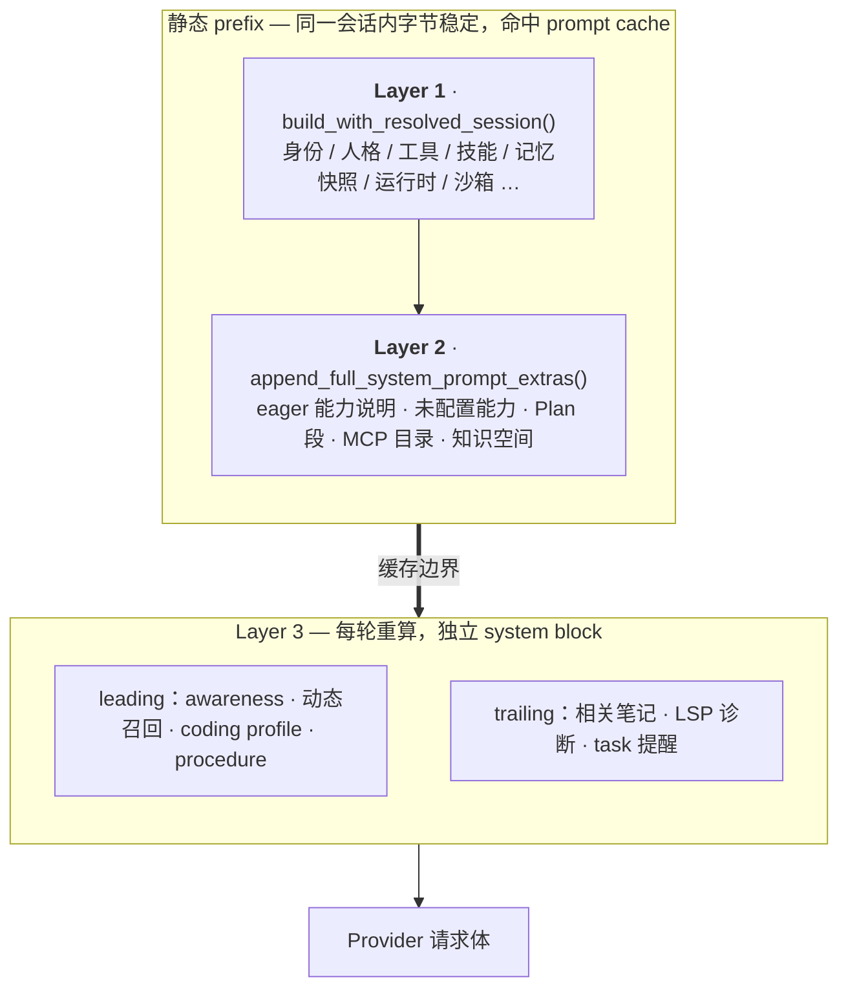
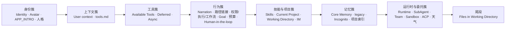
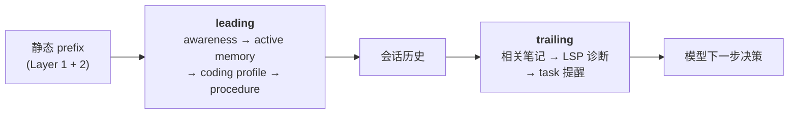
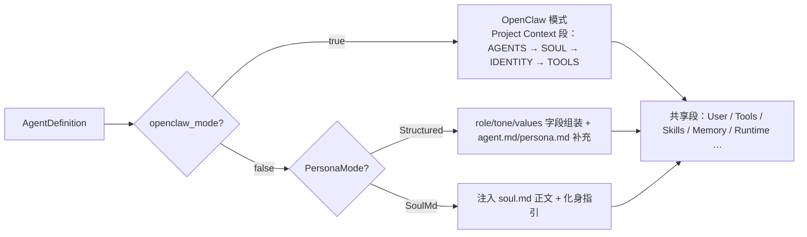

# Hope Agent 提示词系统技术文档

> 返回 [文档索引](../../README.md) | 更新时间：2026-08-07

## 目录

- [核心思想](#核心思想)
- [三层结构与缓存边界](#三层结构与缓存边界)
  - [Layer 1 — 静态基础段](#layer-1--静态基础段)
  - [Layer 2 — 静态能力补充](#layer-2--静态能力补充)
  - [Layer 3 — 每轮动态后缀](#layer-3--每轮动态后缀)
- [两种组装模式](#两种组装模式)
  - [OpenClaw 兼容模式](#openclaw-兼容模式)
  - [Legacy 兜底路径](#legacy-兜底路径)
- [Agent Home 与会话工作目录](#agent-home-与会话工作目录)
- [会话状态段：权限 / 执行 / 工作流 / IM](#会话状态段权限--执行--工作流--im)
- [Per-Tool 描述系统](#per-tool-描述系统)
  - [工具描述清单](#工具描述清单)
  - [动态工具段生成](#动态工具段生成)
- [硬编码行为约束](#硬编码行为约束)
  - [Tool-Call Narration](#tool-call-narration)
  - [Human-in-the-loop](#human-in-the-loop)
  - [Memory Guidelines](#memory-guidelines)
- [Plan Mode 提示词](#plan-mode-提示词)
- [上下文压缩提示词](#上下文压缩提示词)
- [条件注入段](#条件注入段)
  - [Sub-Agent Delegation](#sub-agent-delegation)
  - [Sandbox Mode](#sandbox-mode)
  - [ACP External Agents](#acp-external-agents)
  - [桌面专属 Markdown 路径链接](#桌面专属-markdown-路径链接)
- [Prompt 缓存优化](#prompt-缓存优化)
- [关键文件索引](#关键文件索引)

---

## 核心思想

发给大模型的第一段上下文（system prompt）决定了它的身份、能看到哪些工具、遵守哪些行为约束、记得哪些长期信息。Hope Agent 把这段上下文当作**可组装的产品**，而不是一个大字符串：它由几十个独立段落（section）按固定顺序拼接，每段可以按 Agent 配置、会话状态或运行模式独立启用、禁用或过滤。

这套设计围绕三个相互支撑的想法：

1. **稳定前缀 + 动态后缀 = 缓存友好**。LLM 的 prompt 缓存按**前缀**命中：只要请求开头的字节完全一致，那一段就免于重新 prefill，省钱又省首字延迟。因此系统把会话内基本不变的内容（人格、工具、技能、记忆快照、运行时信息）放进一个**静态 prefix**，把每轮都会变的内容（跨会话行为感知、动态记忆召回、任务提醒、LSP 诊断）拆成**动态后缀**，由 Provider 适配器作为独立 system block 追加。**层与层的边界，就是缓存的边界**——后缀的抖动不会波及前缀。

2. **行为红线编译进二进制，用户删不掉**。人格模板 `agent.md` 允许用户自定义甚至彻底重写。如果把「什么时候该问用户」「沙箱不是权限绕过」这类硬约束写进模板，用户一改就可能整段删掉，约束随之丢失。所以这些指引以编译期常量的形式由组装器直接注入，不经过任何用户可编辑的文件。

3. **Per-Agent 差异化过滤，减少无关 token**。每个 Agent 的工具、技能、子 Agent 权限、记忆策略都可独立配置。工具描述、技能触发语按 allow/deny 列表过滤——Agent 只看到被授权的能力，未授权的既不占 token 也不诱导模型去调用。

理解了这三点，后面所有的段序、条件、缓存策略都只是它们的落地细节。

---

## 三层结构与缓存边界

一次请求的系统上下文由三层拼成。前两层是**同一个静态字符串**（缓存前缀），第三层是每轮重算、由适配器作为独立 block 追加的动态后缀。



这个划分明确了「谁进稳定前缀、谁进动态后缀」的判定标准：凡是每轮都变的内容，一旦混进前缀，就会让整段前缀在每轮都 cache-miss——所以它们必须留在 Layer 3，且**不得反向改写前缀**。

**易变内容刻意后置**。即使在 Layer 1 内部，越易变的段越靠后：会话级的权限 / 执行 / 工作流模式段集中放在工具描述之后，`/mode`、`/permission` 翻转只 bust 较小的一段；工作目录顶层文件清单作为最后一段 emit，增删一个文件只失效这一尾块，前面的工具 / 技能 / 记忆前缀纹丝不动。

### Layer 1 — 静态基础段

入口 `build_with_resolved_session()`。段落按 `sections.push()` 的实际顺序追加，空段在最终 `join("\n\n")` 前被过滤掉。逻辑上可分成几个簇：



完整段序（权威顺序以本表为准）：

| # | 段 | 恒定 / 条件 | 条件 |
| - | -- | ----------- | ---- |
| 1 | Identity 行 | 恒定 | OpenClaw 模式省略 role 后缀；结构化模式在 `PersonaMode::SoulMd` 下同样省略 |
| 2 | Avatar 行 | 条件 | `AgentConfig.avatar` 非空、非 `data:` URL、长度 ≤ `MAX_AVATAR_LEN`（1024） |
| 3 | `APP_INTRO` | 恒定 | 一句话说明 Hope Agent 是什么 |
| 4 | `# Project Context`（4 文件）+ SOUL 化身指引 | 条件 | 仅 `openclaw_mode`；化身段还需 SOUL.md 非空 |
| 5 | Personality | 条件 | 仅非 OpenClaw。`SoulMd` 模式注入 soul.md 正文 + 化身段；否则 `build_personality_section()` 非空时注入 |
| 6 | agent.md | 条件 | 非 OpenClaw 且文件非空 |
| 7 | persona.md | 条件 | 非 OpenClaw 且文件非空 |
| 8 | User context | 条件 | `load_user_config()` 成功且 `build_user_context()` 返回 `Some` |
| 9 | tools.md | 条件 | 非 OpenClaw（OpenClaw 已并入 `# Project Context`）且文件存在 |
| 10 | `# Available Tools` | 恒定 | 内容由 `dispatch::resolve_tool_fate` 过滤 |
| 11 | `# Additional Tools`（deferred 目录） | 条件 | 开启 deferred 工具加载 |
| 12 | 异步工具指南 | 条件 | 异步工具功能启用 |
| 13 | Tool-Call Narration | 条件 | `AppConfig.tool_call_narration_enabled`（默认 `true`） |
| 14 | `# File Path Formatting` | 条件 | `app_init::is_desktop()`，见[桌面专属 Markdown 路径链接](#桌面专属-markdown-路径链接) |
| 15 | `# Current Permission Mode` | 恒定 | 内容随 `default` / `smart` / `yolo` 变 |
| 16 | `# Execution Mode` | 条件 | `execution_mode != off` |
| 17 | `# Workflow Mode` | 条件 | `workflow_mode != off` |
| 18 | `# Active Goal` | 条件 | 非无痕且会话有 active goal |
| 19 | 工具轮次预算提醒 | 条件 | `capabilities.max_tool_rounds` 有界（非 0） |
| 20 | `# Human-in-the-loop` | 恒定 | 编译常量，agent.md 不可覆盖 |
| 21 | Skills | 恒定 | 按 allow/deny 与会话 `paths:` 激活过滤，可能整段为空被过滤 |
| 22 | `# Current Project` | 条件 | 非 OpenClaw 且会话属于项目 |
| 23 | `# Working Directory`（含 `## Working Directory Instructions`） | 条件 | 会话 `working_dir` 非空 |
| 24 | `# IM Channel Attachment` | 条件 | 会话绑定 IM chat |
| 25 | `# Core Memory`（V2 三作用域） | 条件 | `v2_core_enabled` 且渲染结果非空 |
| 26 | legacy Memory 段（Core 文件 / Pinned / Profile / SQLite + Guidelines） | 条件 | `memory_enabled`；子段再受 `legacy_core_enabled` / `legacy_static_enabled` 门控 |
| 27 | `# Incognito Session` | 条件 | `incognito` |
| 28 | 项目自动记忆索引 | 条件 | `legacy_core_enabled` 且传入了 `project_auto_memory_index` |
| 29 | `# Runtime` | 恒定 | 含日期（精确到天）、模型 / provider、Agent home |
| 30 | Sub-Agent Delegation | 条件 | subagent capability 开启 **且** `subagent` 工具 eager **且** 段非空 |
| 31 | Agent Team | 条件 | `team.enabled` 且 `team` 工具 eager 且段非空 |
| 32 | Sandbox Mode | 条件 | 有效 `sandbox_mode.enabled()` |
| 33 | ACP External Agents | 条件 | `acp.enabled` 且 `acp_spawn` 工具 eager 且段非空 |
| 34 | 天气上下文 | 条件 | 天气特征 crate 已 wire 且缓存中有数据 |
| 35 | `# Files in Working Directory` | 条件 | 会话 `working_dir` 非空且清单非空 |

**记忆段的稳定性契约**：25–28 属于 Layer 1 静态 prefix，同一会话的 `CoreMemorySnapshot` 在 reload / Tier 3 compact / 资格变化 / 进程重启前保持字节稳定。自动的 Fast/Deep Recall、Profile、Procedure、Awareness 一律走 Layer 3，不得反向改写这几段。完整预算与 fail-closed 契约见 [记忆系统架构](memory.md)。

**代码位置**：`crates/ha-core/src/system_prompt/build.rs` — `build_with_resolved_session()`。

### Layer 2 — 静态能力补充

入口 `Agent::append_full_system_prompt_extras()`。它仍写在同一个前缀字符串里，追加在 Layer 1 之后，按以下顺序：

1. **eager 能力补充说明**：`send_notification` / `image_generate` / `audio_generate` / `canvas`——各自工具 eager 时才追加；`ToolScope` 收窄后按 scope 再过滤一遍（知识空间侧栏对话就不该宣传被裁掉的能力）。
2. **`# Unconfigured Capabilities`**：`ToolFate::HintOnly` 的工具，即「功能存在但尚未全局配置」的升级提示。hints 先 `sort()` 保证顺序稳定以利缓存；`ToolScope` 非 `None` 时整段清空。
3. **`extra_system_context`**：调用方注入的一次性任务框架（cron 任务描述、subagent 角色、IM 入站 turn 的 `## IM Channel Context`、发送时解析的 `[[note]]` 与 `@skill` 注入等）。
4. **Plan 段**（`plan_extra_context`，以 `ArcSwap` 存放，便于流式循环 mid-turn 探测后热替换）。
5. **MCP catalog 片段**：需 agent `mcp_enabled` + 全局 `mcp_global.enabled` + `ToolScope` 允许 MCP 工具，且至少一个 server 到达 `Ready`。
6. **`# Knowledge Bases`**：附着的知识空间，经 `Agent::resolve_kb_access()` 与 `note_*` 工具同源；无可达 KB 时整段省略。

第 5、6 项刻意排在最后：它们只在 MCP server 状态或知识空间 attach/detach 时改变，前面的段对不用这些功能的用户保持字节稳定。

**代码位置**：`crates/ha-core/src/agent/mod.rs` — `append_full_system_prompt_extras()`（经 `build_full_system_prompt` / `prepare_full_system_prompt` 进入）。

### Layer 3 — 每轮动态后缀

顺序由 `streaming_adapter::leading_dynamic_suffixes` / `trailing_dynamic_suffixes` 定义，四个 Provider 适配器（Anthropic / OpenAI Chat / OpenAI Responses / Codex）共用同一顺序，由 `dynamic_context_contract_tests` 锁定。



leading 组在 Responses 形态 API 上位于会话历史之前，trailing 组紧贴模型的下一次决策。Chat / Anthropic 适配器把两组按同一顺序合并进 system-block 序列。

| 组 | 后缀 | 说明 |
| -- | ---- | ---- |
| leading | `awareness_suffix` | 跨会话行为感知 |
| leading | `active_memory_suffix` | 动态记忆召回 |
| leading | `coding_profile_suffix` | Coding Mode 每轮确定性策略块 |
| leading | `procedure_memory_suffix` | Procedure Memory 软流程指引，每轮都变 |
| trailing | `related_notes_suffix` | 被动相关笔记（untrusted，永不作指令） |
| trailing | `lsp_diagnostics_suffix` | LSP 语义诊断：本轮改过的文件优先 + 全局最严重填余位（untrusted） |
| trailing | `task_reminder_suffix` | 任务追踪提醒（+ 排空的 pending hook context），恒最后 |

**动态后缀不带缓存标记**：Anthropic 适配器只给静态 prefix 那个 system block 打 `cache_control`，awareness、active memory、coding profile 直到 task 提醒这些动态后缀一律作为普通 system block 追加、不带 `cache_control`——它们每轮都可能变，缓存也难命中。所以 Anthropic 端的缓存断点落在两处：静态 prefix system block，以及 tools 数组里最后一个 eager 工具；`api.anthropic.com` 还会在整个请求体上再挂一层 `cache_control`。

**`merge_dynamic_system_prompt()` 只服务预算记账**：它把 awareness / coding profile 后缀并进一份字符串（`system_prompt_for_budget`）供压缩预算计算——这**不是**发给 Provider 的那一份。请求体用的是静态 `system_prompt` + `RoundRequest` 上的独立后缀字段（trailing 后缀的 token 记账走 `token_manifest` 的 `dynamic_parts`）。

**代码位置**：
- Layer 3 顺序契约：`crates/ha-core/src/agent/streaming_adapter.rs`（`RoundRequest` / `leading_dynamic_suffixes` / `trailing_dynamic_suffixes`）
- 每轮组装：`crates/ha-core/src/agent/streaming_loop.rs`

---

## 两种组装模式

`build()` 根据 `config.openclaw_mode` 二选一，二者互斥，优先级 OpenClaw > 结构化。结构化模式内部还有一个 `SoulMd` 人格子变体（注入 `soul.md` 正文而非从字段组装）。第 4 段起的共享段（用户上下文、工具、技能、记忆、运行时……）两模式照常注入。



|               | 结构化模式（默认）                          | OpenClaw 兼容模式                 |
| ------------- | ------------------------------------------- | --------------------------------- |
| 触发条件      | 默认                                        | `openclaw_mode: true`             |
| Identity 行   | `"You are {name}, a {role}, running in Hope Agent on {os} {arch}."` | `"You are {name}, running in Hope Agent on {os} {arch}."` |
| Avatar 行     | `AgentConfig.avatar` 非空时追加 `"Your avatar image is at: {path}"`（跳过 `data:` URL 与超过 1KB 的字符串，防止 base64 图片膨胀 prompt） | 同左 |
| Personality   | `PersonalityConfig` 字段组装（或 SoulMd 注入 soul.md） | 跳过                              |
| agent.md      | 补充身份说明                                | 不使用                            |
| persona.md    | 补充个性说明                                | 不使用                            |
| OpenClaw 文件 | —                                           | 注入 `# Project Context` 段       |

### OpenClaw 兼容模式

启用 `openclaw_mode` 后，提示词采用 OpenClaw 风格的 4 文件组装，按固定顺序拼进 `# Project Context` 段（只注入非空文件）：

```
# Project Context

The following project context files have been loaded:

## AGENTS.md    ← 工作空间规则、红线、记忆指导
## SOUL.md      ← 性格、价值观、语气、边界
## IDENTITY.md  ← 身份元数据（名称、生物类型、风格）
## TOOLS.md     ← 本地环境说明（摄像头、SSH、TTS）
```

如果 SOUL.md 存在且非空，追加化身指引（`SOUL_EMBODIMENT_GUIDANCE`）：

> "If SOUL.md is present, embody its persona and tone throughout all interactions."

**文件存储**：`~/.hope-agent/agents/{id}/agents.md`、`identity.md`、`soul.md`（`tools.md` 复用现有文件）。

**模板预填充**：首次启用时空文件自动填充内置模板（`crates/ha-core/templates/openclaw_*.md`，纯英文）。

**UI 行为**：启用后 Identity/Personality tab 禁用（显示提示），行为 tab 工具指导只读，记忆 tab 提示核心记忆与 OpenClaw MEMORY.md 兼容。

**与其他段的关系**：OpenClaw 模式下 `tools.md` 已并入 `# Project Context`，跳过独立的 tools.md 段；其余共享段照常注入。

**代码位置**：`crates/ha-core/src/system_prompt/build.rs` — `build()` 开头的 `if definition.config.openclaw_mode` 分支。

### Legacy 兜底路径

`build_legacy()` 在 `load_agent()` 加载 Agent 配置失败时（配置文件损坏或不存在）作为降级路径，拼出一个能用的基础 system prompt：

- 用默认 agent.md 模板作身份段，注入**全部**工具描述（不按 Agent 过滤）
- 从全局 `AppConfig` 加载技能
- 保留 Tool-Call Narration（同样受 `tool_call_narration_enabled` 门控）、异步工具指南、工具预算、运行时段
- **不注入** Human-in-the-loop、权限 / 执行 / 工作流模式、Markdown 路径链接、Memory、SubAgent、Sandbox、ACP 等需要 Agent 定义或会话状态的段

它是异常路径下的最小可用 prompt，正常会话永远走 `build()`。

**代码位置**：`crates/ha-core/src/system_prompt/build.rs` — `build_legacy()`。

---

## Agent Home 与会话工作目录

这两个目录在 prompt 中必须语义分离，否则模型会把 Agent 自己的内部目录误当成用户的项目目录。

| 概念 | 来源 | Prompt 呈现 | 用途 |
| ---- | ---- | ----------- | ---- |
| **Agent home** | `paths::agent_home_dir(agent_id)`，形如 `~/.hope-agent/{agent_id}-home/` | `# Runtime` 段中的 `- Agent home: ...` | Agent 自己的长期 scratch/home，可存工作期间的内部文件和状态 |
| **会话工作目录** | `sessions.working_dir`，由 `set_session_working_dir` 设置 | 独立 `# Working Directory` 段 | 当前会话用户希望默认读写的业务目录 |

`Agent home` 不再在 prompt 中叫「Working directory」。`# Working Directory` 段在会话 `working_dir` 设置时注入（项目会话总有工作目录——显式 `working_dir` 或懒创建的默认 workspace），位置在 `# Current Project` 之后、Memory 之前；段内指令子节 `## Working Directory Instructions` 会同步发现并注入目录约定（按 AGENTS.md 优先、CLAUDE.md fallback，含其 `@`-引入的文件），无需用户每轮重复。

**项目指令没有数据库副本**：设置页直接编辑项目根 `AGENTS.md`，添加已有目录时可显式选择不创建缺失文件；`# Current Project` 只描述项目元数据，`# Working Directory` 是项目指令的唯一注入点。

**顶层文件清单是另一个独立尾段 `# Files in Working Directory`**，emit 在所有静态段之后（最末）：非递归、只列名字、名称排序、跳过隐藏与 `.git`/`node_modules`/`target`/`__pycache__`/`.venv` 等目录、cap 100 条。它刻意拆成尾段——增删一个顶层文件只 bust 这一尾块，同一目录状态渲染 byte-identical 文本，不波及静态前缀缓存。模型靠普通 `read` 工具按需读工作目录里的具体文件，system prompt 不再内联文件正文。

执行层与 prompt 保持一致：path-aware 工具的相对路径按「显式绝对路径 > 会话工作目录 > Agent home」解析；`exec` 无 `cwd` 时再回退到用户 home。详细工具层规则见 [tool-system.md](tool-system.md#2-文件系统)。

**代码位置**：
- Runtime / Working Directory / 文件清单段：`crates/ha-core/src/system_prompt/sections.rs`
- 注入顺序：`crates/ha-core/src/system_prompt/build.rs`
- 会话 working dir 取值：`crates/ha-core/src/agent/config.rs`、`crates/ha-core/src/agent/mod.rs`

---

## 会话状态段：权限 / 执行 / 工作流 / IM

`build_with_resolved_session()` 从 `SessionMeta` 读取当前会话状态，注入四类轻量状态段。它们都是**行为提示**而非权限开关——真正的裁决仍在权限引擎、sandbox、hook、workflow runtime。四段集中放在工具描述之后的动态执行控制区，避免 `/mode` 翻转冲掉更大的静态前缀缓存。

| 段落 | 来源 | 触发条件 | 作用 |
| ---- | ---- | -------- | ---- |
| `# Current Permission Mode` | `sessions.permission_mode` | 所有正常 `build()` 路径 | 告诉模型当前处于 `default` / `smart` / `yolo`，合理决定工具调用自主度；权限引擎仍是唯一真相 |
| `# Execution Mode` | `sessions.execution_mode` | `guarded` / `deep` / `autonomous`；`off` 不注入 | 告诉模型长任务推进策略、验证深度、修复次数和停止条件 |
| `# Workflow Mode` | `sessions.workflow_mode` | `on` / `ultracode`；`off` 不注入 | 告诉模型可自主动态编排；由模型判断是否调 `workflow_run` 创建 durable run |
| `# IM Channel Attachment` | `SessionMeta.channel_info`（`channel_conversations` join） | 会话绑定 IM chat | 告诉模型回复可能镜像到 IM chat，包括桌面 / HTTP 发起的 turn |

### Permission Mode

`build_permission_mode_guidance()` 按三档生成不同正文：

- **`default`**：照常调用必要工具，是否弹审批由系统决定；不要因为「可能弹窗」而提前停下。
- **`smart`**：在 default 语义上说明 `_confidence: "high"` 自报字段——`write`/`edit`/`apply_patch` 判断安全时可加此字段跳过审批（工作目录内常规编辑、本对话已改过的文件通常合格）；大范围覆盖、删除、目录外写入应留给审批。保护路径（`~/.ssh`、`.env`）与危险命令（`rm -rf /`、`git push --force`）永远不能靠该字段放行。
- **`yolo`**：当前会话审批层已授予全部权限，鼓励模型在目标与范围明确时更自由主动地推进；同时强调授权不代表可偏离用户目标，Plan Mode 与后端硬安全仍可覆盖。

### Execution Mode

`ExecutionMode::system_prompt_section()` 生成，枚举 `off | guarded | deep | autonomous`：

- **`off`**：默认，不注入。
- **`guarded`**：非平凡 coding work 走 observe → plan → edit → targeted validate → report；验证失败**最多一次**定向修复。
- **`deep`**：更充分的仓库侦察与回归风险判断，适合跨模块 / 长任务；验证失败**最多两次**定向修复。
- **`autonomous`**：允许在普通 observe/edit/validate 步骤间持续推进而不逐步等确认，但保留全部权限、hook、sandbox、审批和项目边界——此模式绝不绕过审批门。

它只影响模型的行为规划；持久 workflow 的创建 / 审批 / 暂停 / 恢复 / 取消仍由 [Workflow](../agent/workflow.md) 的 runtime / owner API 执行。

### Workflow Mode

`WorkflowMode::system_prompt_section()` 生成，枚举 `off | on | ultracode`：

- **`off`**：默认，不注入段，也不向模型暴露 `workflow_run`。
- **`on`**：提示模型在多阶段、宽搜索/比较、connector 或文件证据、长时间运行、独立验证、可恢复后台执行或需可审计轨迹时自行调 `workflow_run`；tiny 对话、单个显然动作、已验证机械任务保持 inline。
- **`ultracode`**：在 `on` 基础上更偏质量和覆盖，实质任务默认作为 workflow 候选。

该段明确 Workflow 不是 coding-only、也不是「让用户写脚本」的功能——模型应自己生成 workflow script 并创建 durable run。执行层仍由 `workflow_run` 工具、Workflow Script Gate、permission preview、primary launcher、pause/resume/cancel/recovery 兜底。

### IM Channel Attachment

`# IM Channel Attachment` 只描述稳定的 attach 状态，区别于 IM 入站 turn 通过 `extra_system_context` 携带的 `## IM Channel Context`（后者只在 IM 消息触发的 turn 存在，含当前 inbound sender / chat context）；前者覆盖桌面 / HTTP 在同一 IM 绑定 session 中继续发消息并镜像到 IM 的场景。IM metadata 来自外部平台，以单行 JSON 作为**不可信 routing/audience context** 渲染，模型必须把字段值当数据而非指令。

**代码位置**：
- Permission mode guidance：`crates/ha-core/src/system_prompt/constants.rs`
- Execution mode section：`crates/ha-base/src/execution_mode.rs`
- Workflow mode section：`crates/ha-base/src/workflow_mode.rs`
- IM attachment section：`crates/ha-core/src/system_prompt/sections.rs`
- 会话状态解析：`crates/ha-core/src/agent/config.rs`

---

## Per-Tool 描述系统

每个工具拥有一条独立的详细描述常量，取代把所有工具挤在一起的单一字符串。这带来三个好处：

1. **精准过滤**：Agent 只看到被授权的工具描述，减少无关 token。
2. **详细指南**：每条描述包含使用方式、最佳实践、常见陷阱。
3. **工具优先级**：`exec` 明确标注「优先使用专用工具」，防止模型绕过 `read`/`edit`/`grep`/`find` 直接用 shell。

### 工具描述清单

工具描述以 `TOOL_DESC_*` 常量定义，通过 `TOOL_DESCRIPTIONS` 数组（`name → 常量`）映射。

| 分类         | 工具               | 常量                           | 描述要点                                                 |
| ------------ | ------------------ | ------------------------------ | -------------------------------------------------------- |
| **执行**     | exec               | `TOOL_DESC_EXEC`               | cwd/timeout/background/sandbox；**强调优先使用专用工具** |
|              | process            | `TOOL_DESC_PROCESS`            | 管理 legacy 后台 exec session；禁止 sleep 轮询           |
| **文件操作** | read               | `TOOL_DESC_READ`               | 分页/图片检测/PDF 分页；**先读后改**                     |
|              | write              | `TOOL_DESC_WRITE`              | 优先用 edit；不创建不必要的文件                          |
|              | edit               | `TOOL_DESC_EDIT`               | old_text 唯一性；replace_all 重命名                      |
|              | ls                 | `TOOL_DESC_LS`                 | 目录列表；创建前先验证                                   |
|              | grep               | `TOOL_DESC_GREP`               | **禁止用 exec 替代**；regex + multiline                  |
|              | find               | `TOOL_DESC_FIND`               | **禁止用 exec 替代**；glob 模式                          |
|              | apply_patch        | `TOOL_DESC_APPLY_PATCH`        | 多文件补丁；3-pass fuzzy matching                        |
| **网络**     | web_search         | `TOOL_DESC_WEB_SEARCH`         | 搜索当前信息                                             |
|              | web_fetch          | `TOOL_DESC_WEB_FETCH`          | 抓取网页内容                                             |
|              | browser            | `TOOL_DESC_BROWSER`            | 无头浏览器；动态页面交互                                 |
| **记忆**     | save_memory        | `TOOL_DESC_SAVE_MEMORY`        | 事实/截止日期/临时上下文；禁止保存临时信息               |
|              | recall_memory      | `TOOL_DESC_RECALL_MEMORY`      | 关键词/语义搜索；include_history                         |
|              | update_memory      | `TOOL_DESC_UPDATE_MEMORY`      | 更新已有记忆                                             |
|              | delete_memory      | `TOOL_DESC_DELETE_MEMORY`      | 删除过期记忆                                             |
|              | update_core_memory | `TOOL_DESC_UPDATE_CORE_MEMORY` | 持久指令写入 Core（兼容别名）                            |
|              | memory_get         | `TOOL_DESC_MEMORY_GET`         | 按 ID 获取完整记忆                                       |
| **委托**     | subagent           | `TOOL_DESC_SUBAGENT`           | spawn/send/check/kill；异步执行与受限 continuation       |
|              | agents_list        | `TOOL_DESC_AGENTS_LIST`        | 列出可委托 Agent                                         |
|              | acp_spawn          | `TOOL_DESC_ACP_SPAWN`          | 外部 ACP Agent（Claude Code/Codex）                      |
| **会话**     | sessions_list      | `TOOL_DESC_SESSIONS_LIST`      | 跨会话通信发现                                           |
|              | session_status     | `TOOL_DESC_SESSION_STATUS`     | 会话详细状态                                             |
|              | sessions_search    | `TOOL_DESC_SESSIONS_SEARCH`    | FTS 检索会话消息并返回上下文窗口                         |
|              | sessions_history   | `TOOL_DESC_SESSIONS_HISTORY`   | 分页历史记录                                             |
|              | sessions_send      | `TOOL_DESC_SESSIONS_SEND`      | 跨会话消息发送                                           |
| **媒体**     | image              | `TOOL_DESC_IMAGE`              | 视觉输入；把图片附件带入下一轮模型并用 task/question 指定目标 |
|              | image_generate     | `TOOL_DESC_IMAGE_GENERATE`     | AI 图片生成；failover                                    |
|              | audio_generate     | `TOOL_DESC_AUDIO_GENERATE`     | 音频生成（TTS 语音 / 音乐 / 音效）；failover             |
|              | pdf                | `TOOL_DESC_PDF`                | PDF 文本提取；大文件必须分页                             |
| **其他**     | canvas             | `TOOL_DESC_CANVAS`             | 富内容制品                                               |
|              | manage_cron        | `TOOL_DESC_MANAGE_CRON`        | 定时任务管理                                             |
|              | send_notification  | `TOOL_DESC_SEND_NOTIFICATION`  | 系统通知                                                 |
|              | ask_user_question  | `TOOL_DESC_ASK_USER_QUESTION`  | 结构化交互问答；**WHEN / WHEN NOT / HOW 三段触发规则**   |
|              | get_weather        | `TOOL_DESC_GET_WEATHER`        | 天气查询                                                 |
|              | task_create        | `TOOL_DESC_TASK_CREATE`        | 计划任务创建                                             |
|              | task_update        | `TOOL_DESC_TASK_UPDATE`        | 任务状态/字段更新                                        |
|              | task_list          | `TOOL_DESC_TASK_LIST`          | 列出当前任务                                             |

**代码位置**：`crates/ha-core/src/system_prompt/constants.rs`。

### 动态工具段生成

`# Available Tools` 段只放当次真正 eager 的工具描述，判定源是 `dispatch::resolve_tool_fate`：

```rust
fn build_tools_section(agent_id, agent_config, incognito) -> String {
    let ctx = DispatchContext { agent_id, agent_config, incognito, app_config };
    let eager = all_dispatchable_tools()
        .filter(|tool| matches!(resolve_tool_fate(tool, &ctx), InjectEager));
    let descs = TOOL_DESCRIPTIONS
        .filter(|(name, _)| eager.contains(name));
    format!("# Available Tools\n\n{}", descs.join("\n\n"))
}
```

- Core 工具按 tier 直接注入；Standard / Configured 工具先按 `capabilities.tools.allow/deny` 覆盖 tier 默认值。
- Configured 工具未完成全局配置时不进 Available Tools，而进入 `# Unconfigured Capabilities` 提示（Layer 2）。
- deferred 工具不进 Available Tools，进入 `# Additional Tools (use tool_search to discover)`。
- **共享同一套语义**：`# Available Tools`、`agent/mod.rs::build_tool_schemas()`、`tool_search` 和执行层兜底都以 `dispatch::resolve_tool_fate()` 为准。

**代码位置**：`crates/ha-core/src/system_prompt/sections.rs` — `build_tools_section()`。

### 运行控制语义与最小提示词

插入中的用户消息最终以真正的 `user` message 进入 provider history，模型天然能看到最新要求；因此**不得**为“插入”另加一段全局状态机提示，也不得把 UI 状态、工具路由表或取消进度复制进 system prompt。默认基线是零新增“插入场景专用”的跨工具全局指令；只允许精简校准既有工具摘要、schema 与 action 可发现性，避免稳定前缀膨胀和工具契约漂移。

模型能否查看、调整、关闭、暂停或恢复某类运行单元，以各工具 schema 的 action 枚举、描述和执行层校验为准：普通 Subagent 支持查看、发送调整、关闭与受限 continuation，但没有 pause；Async Job 和 Process 只有查看/取消类能力；Team 与 Workflow 的 `pause/resume` 必须出现在各自工具描述的关键动作中；Cron 的 pause/resume 只控制 schedule 生命周期，不冒充冻结或恢复当前 run。`runtime_cancel` 只描述可证明属于当前会话的 kind，不能把应用级全局对象包装成模型可取消对象。

工具描述必须区分“取消请求已接受”和“目标已进入终态”，并写明不可恢复的停止原因。只有专项评测稳定证明模型在收到新 user message 后不会重新评估已有委派时，才允许补充一条跨工具原则；具体动作和生命周期仍留在工具描述，不上升为新的长篇行为段。

当前不提供统一的模型侧 `runtime_status` 或 `stop_everything`：各子系统的 `list/check/status` 保留自己的真相源、owner 边界和生命周期语义，模型按需发现并分域操作。只有真实模型专项评测持续证明现有发现路径不足，才可另行评估只读聚合状态；它不得顺带成为新的写入口，也不得把不同运行单元压成虚假的统一 pause/resume。

---

## 硬编码行为约束

以下三段以编译期常量注入，用户改 `agent.md` 也删不掉——它们是模型行为的底线，必须和工具 schema 一起始终可用。

### Tool-Call Narration

紧跟异步工具指南、先于 Human-in-the-loop 注入。`build()` / `build_legacy()` 两条路径都在 `AppConfig.tool_call_narration_enabled` 为真时注入（默认 `true`，用户可关）——这是它与「无条件注入」的 Human-in-the-loop 的唯一区别。

**动机**：对齐「边说边做」的体验。Messages API / OpenAI streaming 原生支持在一个 assistant turn 内 `text_delta` 与 `tool_use` block 交替输出，模型完全可以「先吐一句自然语言预告 → 再 emit 工具调用」。体验的核心不在流式或 UI 管线，而在 system prompt 是否显式要求模型这样做。

段标题为 `# Text output (does not apply to tool calls)`，指令要点：

- 第一次工具调用前用一句话说清即将做什么
- 只在出现新发现、方向改变、阻塞、委托或完成时更新叙述，连续两次调用之间不重复同一意图
- 禁止叙述内部独白（「let me think…」）
- 用完整、简洁的句子，末尾说清 what changed / what's next

**代码位置**：常量 `TOOL_CALL_NARRATION_GUIDANCE`（`constants.rs`）；注入见 `build.rs`；门控旗标 `AppConfig.tool_call_narration_enabled`（默认 `true`）。

### Human-in-the-loop

紧跟工具描述 / Tool-Call Narration 之后注入，始终启用（`ask_user_question` 是 Core Interaction 工具，不受非 Core 工具开关影响）。它给模型一个**全局思维框架**：把 `ask_user_question` 当作「主动协作的常规通道」，而非「卡住时的兜底升级」。

三段结构：

| 段落 | 用途 | 要点 |
|------|------|------|
| **Ask the user when** | 强触发器 | 不可逆/高代价操作（删 >5 文件 / DB 迁移 / force push / 依赖 major bump）、真实歧义、多路径相近、≥2 次失败 |
| **Do NOT ask when** | 反触发器（刹车） | 可自查的（read/grep/ls 能查、AGENTS.md 已记）、低成本可撤销、纯风格/格式/命名 |
| **How to ask** | 节流约束 | 相关问题合并成一次调用（最多 4 问）、每任务 ≤1–2 次、优先前置 |

**与工具描述层的协同**：`TOOL_DESC_ASK_USER_QUESTION` 也含 WHEN / WHEN NOT / HOW 三段，但聚焦**工具调用的具体规则**（参数语法、Plan Mode 禁令、approval 边界）；Human-in-the-loop 段则提供**全局思维框架**。两层措辞不同——工具描述说「怎么问」，全局指引说「何时切换到问的模式」。详细对比见 [ask-user.md](../agent/ask-user.md)。

**代码位置**：常量 `HUMAN_IN_THE_LOOP_GUIDANCE`（`constants.rs`）；注入见 `build.rs`（Tool-Call Narration 之后）。

### Memory Guidelines

`MEMORY_GUIDELINES` 常量，作为 Memory 段的 guidelines 子段追加，仅在有效 Memory policy 允许时注入。它指导 Agent 区分各记忆工具的使用场景，且**从记忆预算里预留自身长度**——避免过大的 `MEMORY.md` 把这段指引挤掉，让模型失去用工具的方法。

| 工具                                  | 使用场景                                      |
| ------------------------------------- | --------------------------------------------- |
| `core_memory`                         | 三层 Core 索引 / topic 的读取、写入、提升与 reload |
| `update_core_memory`                  | 旧长期指令写入兼容入口，内部映射到 Core       |
| `project_memory`                      | Project Core topic 的兼容入口，仅项目会话可用 |
| `save_memory`                         | 事实、截止日期、临时上下文、值得备注的发现    |
| `recall_memory`                       | 查找先前偏好/约束/上下文                      |
| `recall_memory(include_history=true)` | 搜索历史对话（「last time」「we discussed」） |

**禁止保存**：临时任务细节、代码片段、调试步骤、可从代码库推导的信息。

默认只把会话冻结的 Global / Agent / Project `CoreMemorySnapshot` 与紧凑工具协议放进稳定 Memory 段；SQLite memories、Profile Snapshot、Pinned Claims、Episode、Procedure、Graph 均走当轮的 Dynamic Recall 后缀（Layer 3），不再默认常驻。只有完整 V1 rollback 或显式 `compatibility.legacyStaticMemory=true` 才恢复旧静态块。完整预算、迁移、会话 policy 和 fail-closed 契约见 [记忆系统架构](memory.md)。

**代码位置**：常量 `MEMORY_GUIDELINES`（`constants.rs`）；渲染与预算记账在 `build.rs` 的 `build_memory_section()`；V2 三作用域 Core 渲染在记忆模块的 `render_core_memory_v2_for_context()`。

---

## Plan Mode 提示词

Plan Mode 使用独立于主 system prompt 的额外提示词，注入到对话上下文中。详细架构见 [Plan Mode 架构文档](../agent/plan-mode.md)。四条常量都在 `crates/ha-core/src/plan/constants.rs`。

### 5 阶段规划 Prompt

**常量**：`PLAN_MODE_SYSTEM_PROMPT`

```
Phase 1: Deep Exploration        → subagent 并行探索（最多 3 个），梳理关键要素和依赖
Phase 2: Requirements Clarification → ask_user_question 结构化问答，带选项卡片
Phase 3: Design & Architecture    → 方案对比，风险识别
Phase 4: Plan Composition         → submit_plan 提交
Phase 5: Review & Refinement      → 用户审核，inline comment 修订
```

**工具限制**：

- 禁止修改项目文件：`apply_patch`、`canvas`（连带 `write`/`edit`/`artifact` 一并锁死）
- `write`/`edit` 只能操作 `~/.hope-agent/plans/` 下的 `.md` 计划文件
- `exec`（shell 命令）需用户审批
- 允许：`read`、`grep`、`find`、`web_search`、`web_fetch`、`subagent`、`ask_user_question`、`submit_plan`

**计划格式要求**：

- 以**逻辑单元为中心**组织步骤，而非抽象阶段
- 主步骤用有序列表 `1. <动词> — <文件路径或交付物>`；复杂计划可用 `### Step N` 标题
- 涉及代码修改时包含代码片段、文件引用、wire-up 细节；引用已有内容标注来源
- **不使用 markdown 复选框语法**（`- [ ]` / `- [x]`）——计划是可读的执行指南，细粒度执行 todo 由执行阶段的 task 工具单独跟踪
- 代码任务须含 `Critical Files / Files` 段；末尾 `Verification` 段列出具体验证方法

### 执行阶段 Prompt

**常量**：`PLAN_EXECUTING_SYSTEM_PROMPT_PREFIX`

- 已审批计划在执行期**冻结**——不改 plan 文件；需结构性修订时退出再重新进入 plan mode 增量编辑
- 用 `task_create` / `task_update` 追踪进度（三态：pending / in_progress / completed），同一时刻至多一个 `in_progress`
- 执行期新发现的工作追加为 todo，而非改计划文件
- 执行前已建 git checkpoint，失败可回滚

### 完成阶段 Prompt

**常量**：`PLAN_COMPLETED_SYSTEM_PROMPT`

- 总结完成情况
- 高亮失败/跳过的步骤并解释原因
- 建议后续行动

### 子 Agent 上下文隔离

**常量**：`PLAN_SUBAGENT_CONTEXT_NOTICE`

Plan Mode 用子 Agent 探索时注入此 notice，提醒 planning subagent：执行 Agent **看不到**你的探索历史，计划必须**自包含**（关键细节、来源引用、前置条件）——「The plan IS the only context」。

---

## 上下文压缩提示词

上下文压缩采用 5 层渐进式结构（Tier 0 反应式微压缩 + Tier 1–4），Prompt System 仅在压缩动作发生时复用下列常量参与第 3 层 LLM 摘要。触发条件、mid-loop checkpoint、ledger/recovery 等实现细节见 [context-compact.md](context-compact.md)。

### Summarization System Prompt

**常量**：`SUMMARIZATION_SYSTEM_PROMPT`（`context_compact/summarization.rs`）

```
You are a context compaction assistant.
CRITICAL: Respond with TEXT ONLY. Do NOT call tools.

You are creating a continuation summary for a long-running local AI assistant session.
The old conversation history will be replaced by your summary, followed by
deterministic runtime state and recent messages.

Include these sections:
## Primary Request and Success Criteria
## Current Execution State
## Decisions and Rationale
## Files, Symbols, and Artifacts
## Tool Results Worth Preserving
## Errors, Failed Attempts, and Fixes
## User Feedback and Constraints
## Pending Work and Next Action
## Trust Boundaries and Security Notes
```

**设计要点**：

- 摘要是 continuation handoff，不是全局状态镜像；下一个模型实例应能立即接手。
- 明确 no-tools guard：摘要模型只输出文本。
- 9 段结构化输出，覆盖成功标准、执行状态、决策、文件/符号、值得保留的工具结果、失败尝试、用户纠正、下一步和信任边界。
- 精确保留路径、ID、URL、命令名、函数名和用户约束；逐条保留用户反馈以免压缩后重复犯错。
- 不把 tool output / web / KB / recovered file snapshot 这类 untrusted data 当指令。
- 不重复 runtime ledger，也不复述每轮会从 live state 重建的 task/memory/KB/cwd/permission 状态，避免第二真相源。

### 标识符保留策略

**常量**：`IDENTIFIER_PRESERVATION_INSTRUCTIONS`（`context_compact/mod.rs`）

```
Preserve all opaque identifiers exactly as written (no shortening or reconstruction),
including UUIDs, hashes, IDs, tokens, hostnames, IPs, ports, URLs, and file names.
```

通过 `CompactConfig.identifier_policy` 配置：

| 策略             | 行为                                     |
| ---------------- | ---------------------------------------- |
| `strict`（默认） | 使用内置保留指令                         |
| `off`            | 不注入保留指令                           |
| `custom`         | 使用用户自定义 `identifier_instructions` |

### 压缩配置参数

| 参数                         | 默认值 | 说明                         |
| ---------------------------- | ------ | ---------------------------- |
| `soft_trim_ratio`            | 0.50   | Tier 2 软截断触发比例        |
| `hard_clear_ratio`           | 0.70   | Tier 2 硬清除触发比例        |
| `preserve_recent_rounds`     | 4      | 保护最近 N 个消息 round；普通短回合尽量扩到所属 user turn，长 tool loop 保持可裁剪前缀 |
| `soft_trim_max_chars`        | 6,000  | 超过此值才软截断             |
| `soft_trim_head_chars`       | 2,000  | 软截断保留头部               |
| `soft_trim_tail_chars`       | 2,000  | 软截断保留尾部               |
| `summarization_threshold`    | 0.85   | Tier 3 总结触发比例          |
| `summary_max_tokens`         | 4,096  | 总结输出最大 token           |
| `summarization_timeout_secs` | 300    | 总结调用超时                 |
| `max_compaction_injected_context_share` | 0.5 | Tier 3 摘要、ledger、recovery 的联合注入预算 |

**代码位置**：`CompactConfig` 结构与默认值在 `crates/ha-config-schema/src/context_compact.rs`；摘要提示词与 split 逻辑在 `crates/ha-core/src/context_compact/summarization.rs`。

---

## 条件注入段

### Sub-Agent Delegation

**触发条件**：subagent capability 开启 **且** `subagent` 工具 eager **且** 段非空。

**注入内容**：

- 可委托 Agent 列表（emoji + name + id + description）
- 使用方式：spawn → 异步执行 → 自动推送结果；canonical `send` 调整活跃 attempt 或为允许续跑的终态创建新 immutable attempt，`steer` / `resume` 仅为兼容别名；check 查看状态；kill 只请求关闭，确认终态后才能宣称已停止
- spawn 选项：label、files、model override
- 当前深度显示 `Current depth: N/M`

**过滤规则**：列出自身并标注 `*(self — fork for parallel work)*` 支持 self-fork 并行；受 `SubagentConfig.allow/deny` 控制。

**代码位置**：`crates/ha-core/src/system_prompt/sections.rs` — SubAgent Delegation 段构建。

### Sandbox Mode

**触发条件**：当前有效 `sandbox_mode.enabled()`；有 `session_id` 时用 `sessions.sandbox_mode`，无 `session_id` 的构建路径回落到 `AgentConfig.capabilities.effective_default_sandbox_mode()`。

**注入内容**：

- 当前会话沙箱模式和一句话行为
- `exec` 按 session policy 自动在 Docker 容器内执行，无需额外传 `sandbox=true`
- 当前 `SandboxConfig` 快照：镜像、network mode、rootfs 读写、capability policy、no-new-privileges、PID limit、tmpfs mount
- 工作目录在容器内挂载为 `/workspace`，持久化语义由模式决定
- 四种非 `off` 模式差异：`standard` 不放松审批、`isolated` 临时副本不持久化、`workspace` 真实工作区挂载并放松部分软审批、`trusted` 沙箱内最大自治但 strict 仍审批
- 安全/持久化边界：**沙箱不是权限绕过**；`write`/`edit`/`apply_patch` 仍是 host-side durable file 工具

**边界**：该段是模型行为提示，不是安全边界。实际执行以当前 `SessionMeta.sandbox_mode` 经 `ToolExecContext.sandbox_mode` 传入工具执行层为准；会话可在创建后切换 sandbox mode。

### ACP External Agents

**触发条件**：`config.acp.enabled == true` 且 `acp_spawn` 工具 eager 且段非空（全局 `acp_control.enabled` 折进 tool-fate 判定）。

**注入内容**：

- 可用 ACP 后端列表（检测 binary 是否存在）
- 使用场景区分：`subagent`（内部）vs `acp_spawn`（外部）
- 异步执行 + check(wait=true) 阻塞等待

**代码位置**：`crates/ha-core/src/system_prompt/sections.rs` — ACP External Agents 段构建。

### 桌面专属 Markdown 路径链接

**触发条件**：`app_init::is_desktop()`（即 `runtime_role() == Some("desktop")`）。Server / ACP 模式跳过——server 用户点了也无从响应，ACP 的路径由外部编辑器接管。它是 Layer 1 段序里的第 14 段，紧跟 Tool-Call Narration、先于 `# Current Permission Mode`。

**注入内容**（`MARKDOWN_PATH_LINKS_GUIDANCE`，标题 `# File Path Formatting`）：

- 提到本地文件一律写成可点击 markdown 链接：`[file.ext](/absolute/path/file.ext)`，可带行号锚点 `[file.ext:42](/absolute/path/file.ext#L42)`
- 目标含空格时用尖括号包裹
- 禁止相对路径、`file://`、裸绝对路径和行内代码包裹的路径
- 该规则不适用于命令和标识符

**动机**：模型默认会吐 `/Users/.../foo.ts` 或行内代码形式的裸路径，两者都难读且不可点击。Markdown 链接同时解决「显示文本短」和「目标可点击」。

**前端消费路径**：

1. `MarkdownRenderer.tsx` 的 `localPathFromHref()` 判定一个 anchor 是否指向本机路径——接受 `/` 与 `~/` 前缀；也还原 Tauri/WebKit 有时把 `/Users/...` 暴露成同源绝对 URL 的情况（同源 origin 或 `tauri.localhost`，以及 `file:` 协议）。**只承诺 Unix 风格路径**：Streamdown 用固定 `defaultSchema` 的 `rehype-sanitize`，Windows `C:\` 路径的 href 在 sanitize 阶段就被剥掉，根本到不了这里。
2. `normalizeLocalPath()` 剥掉 `#L<line>` 锚点再 `decodeURI`。**当前不接 IDE 协议，行号会被丢弃**——prompt 允许模型写 `:42` / `#L42` 只为可读性，点击后仍按整文件打开。
3. 命中本地路径的 anchor 交给 `MarkdownFileLink`，走统一文件操作策略（`useFileResource` + `FileContextMenu`，见 [file-operations.md](file-operations.md)）：按 `fileKind` × 运行模式决议预览 / 打开 / 下载。桌面 Transport 的 `openFilePath()` 最终 `invoke("open_directory")`；HTTP Transport 的 `supportsLocalFileOps()` 返回 `false`，且 `/api/desktop/open-directory` 在 server 侧是 no-op（返回 `ok:false` + 说明），避免在 server 主机上误开文件。
4. **未命中本地路径**的 anchor 不付出任何 hook 与 ContextMenu 代价，直接渲染成普通 `<a>`（或 `MarkdownWebLink`）——一条流式消息可能渲染上百个 anchor，这是该文件的核心性能约束。

**例外（红线）**：这些 anchor 的悬浮提示用原生 HTML `title`，**不用 shadcn Tooltip**。包 `TooltipTrigger` 会在长回复里炸 DOM 并破坏 anchor 的组件签名。这是「Tooltip 必须用 `@/components/ui/tooltip`」的一处登记例外。

**代码位置**：
- 常量：`crates/ha-core/src/system_prompt/constants.rs` — `MARKDOWN_PATH_LINKS_GUIDANCE`
- 运行模式判定：`crates/ha-core/src/app_init.rs`（`is_desktop`，实现下沉 `ha-base::runtime_role`）
- 前端解析与分流：`src/components/common/MarkdownRenderer.tsx`
- Transport：`src/lib/transport-tauri.ts`（`openFilePath()`）；`src/lib/transport-http.ts`（`supportsLocalFileOps()`）；`crates/ha-server/src/routes/desktop.rs`（`open_directory()`）

---

## Prompt 缓存优化

整个提示词系统的组装策略最终服务一个目标：**最大化 prompt 缓存命中，压低费用与首字延迟**。

**请求诊断只记形状不记正文**。`agent::token_manifest` 每轮生成 content-free 的 `RoundTokenManifest`：只记各 prompt/tool/history 段的字节数、估算 token、BLAKE3 指纹、工具计数和 transport body 大小，不记录正文。稳定 system + eager tools 位于前缀，awareness/召回/task 等动态段位于其后；deferred 工具通过 Provider 原生 reference 或客户端下一轮追加，不得重排稳定 eager 集合。

**返回后按 provider/model/round 记实际用量**。`contextInputTokens`、`freshInputTokens`、cache read/write、output 与 TTFT。Prompt Cache 只改变 fresh prefill、费用和 TTFT；`contextInputTokens` 始终表示模型本轮实际占用的完整上下文，不因 cache hit 减少。

**缓存路由 key**。`prompt_cache_key` 形如 `ha:{provider}:{model}:v2:{scope_hash}:{prompt_hash}`——包含 provider、model、prompt contract version、agent/session scope hash 与稳定 prompt fingerprint。适配器只在端点已知支持该字段时才发送（OpenAI Chat 端点做一次探测并记住结果）。

**OpenAI Responses 的显式缓存**。仅 `api.openai.com` 上的 GPT-5.6+ 走显式缓存：稳定系统提示放在首个 `developer` `input_text` block，并设 `prompt_cache_breakpoint: {mode: explicit}` 与 `prompt_cache_options: {mode: explicit, ttl: 30m}`。5.4/5.5 保持自动缓存；Codex 和未知兼容端不假设支持这些字段。

**渐进式披露压低前缀体积**。工具详细描述只为 eager 工具注入；deferred 目录用紧凑名称索引，完整 schema 只在激活后出现。Skills 首轮只保留名称和有界触发语句，完整 SKILL.md 由 `skill` 工具加载。Subagent/Team/ACP 的长指南在工具 eager 时进入静态 prompt；deferred 时随完整 schema 组成 activation package，客户端激活和 Provider 原生 tool reference 都能加载而不改变稳定缓存前缀。

具体策略：

| 策略         | 实现                          | 效果                              |
| ------------ | ----------------------------- | --------------------------------- |
| 日期精确到天 | `date +%Y-%m-%d %Z`（无时间） | 同一天的 system prompt 完全相同   |
| 固定段顺序   | 段落按固定顺序组装            | prompt prefix 稳定，利于 KV cache |
| 常量描述     | 工具/行为描述为编译时常量     | 不受运行时数据影响                |
| 截断上限     | markdown 注入限制 20K 字符    | 防止动态内容过大破坏缓存          |
| 易变内容后置 | mode 段、工作目录文件清单靠后 | 翻转只失效小段，前缀不动          |

**日期函数**：`current_date()`（`system_prompt/helpers.rs`）——文档注释明确说明排除时间是为缓存优化；需要精确时间时模型可 `exec date`。

---

## 关键文件索引

| 文件                                            | 内容                                                                      |
| ----------------------------------------------- | ------------------------------------------------------------------------- |
| `crates/ha-core/src/system_prompt/build.rs`     | **核心**：结构化 / OpenClaw 两模式组装、`build_with_resolved_session()` 段序、记忆段预算 |
| `crates/ha-core/src/system_prompt/constants.rs` | `TOOL_DESCRIPTIONS` 映射（每项对应一个 `TOOL_DESC_*` 常量）、`HUMAN_IN_THE_LOOP_GUIDANCE` / `TOOL_CALL_NARRATION_GUIDANCE` / `MARKDOWN_PATH_LINKS_GUIDANCE` / `MEMORY_GUIDELINES` 等行为常量、`build_permission_mode_guidance()` |
| `crates/ha-core/src/system_prompt/sections.rs`  | 各 section builder（personality/tools/skills/runtime/subagent/acp/working-dir） |
| `crates/ha-core/src/agent/mod.rs`               | Layer 2 `append_full_system_prompt_extras()`、`merge_dynamic_system_prompt()`、知识空间段 |
| `crates/ha-core/src/agent/streaming_adapter.rs` | Layer 3 顺序契约：`RoundRequest` + `leading/trailing_dynamic_suffixes`     |
| `crates/ha-base/src/execution_mode.rs` · `workflow_mode.rs` | 执行 / 工作流模式枚举与 `system_prompt_section()`           |
| `crates/ha-core/src/agent_config.rs`            | Agent 配置结构（personality/tools/skills/memory/subagents/openclaw_mode）  |
| `crates/ha-core/src/agent_loader.rs`            | Agent 加载（agent.json + md 文件 + OpenClaw 模板）                        |
| `crates/ha-core/templates/openclaw_*.md`        | OpenClaw 兼容模式 4 个模板文件（纯英文）                                  |
| `crates/ha-core/src/plan/constants.rs`          | Plan Mode 提示词常量（规划 / 执行 / 完成 / 子 Agent 隔离）                 |
| `crates/ha-core/src/context_compact/`           | 上下文压缩（摘要 system prompt + 标识符保留）；`CompactConfig` 结构在 `crates/ha-config-schema/src/context_compact.rs` |
| `crates/ha-core/src/user_config.rs`             | 用户上下文构建（name/role/birthday/timezone/…）                          |
| `crates/ha-skills/src/skills/`                  | 技能目录加载（扫描 + 解析 + budget 裁剪），经 `ha_core::skills_hooks::load_all_skills_with_budget` 回调 |
| `crates/ha-core/src/skills/prompt.rs`           | 技能段渲染 `build_skills_prompt`（纯格式化，留 kernel）                   |
| `crates/ha-core/src/tools/definitions/` + `tool_defs/` | 工具 JSON Schema 定义（发送给 LLM 的 function calling schema） |
