# 图片生成工具技术架构文档

> 返回 [文档索引](../README.md)

## 概述

OpenComputer 的图片生成系统采用 **Trait 抽象 + Capabilities 声明 + 动态工具描述 + 自动降级** 的架构，支持 7 个内置 Provider，覆盖文生图和参考图编辑两种模式。整个系统遵循「上层不感知 Provider」原则——工具入口函数 `tool_image_generate()` 通过统一的 `ImageGenProviderImpl` trait 与所有 Provider 交互，不包含任何 Provider 特定逻辑。

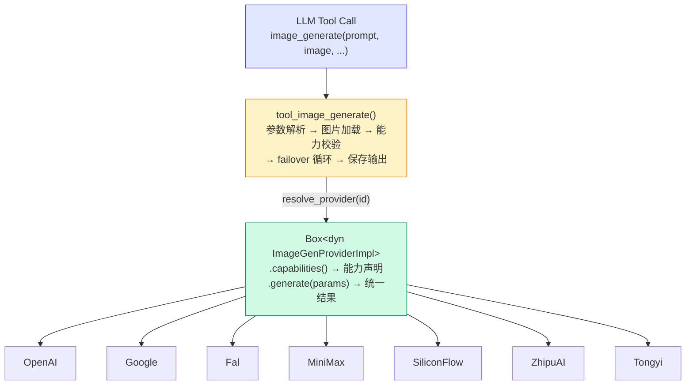

---

## 核心类型系统

### Provider Trait

```rust
pub(crate) trait ImageGenProviderImpl: Send + Sync {
    fn id(&self) -> &str;                          // "openai", "google", ...
    fn display_name(&self) -> &str;                // "OpenAI", "Google", ...
    fn default_model(&self) -> &str;               // "gpt-image-1", ...
    fn capabilities(&self) -> ImageGenCapabilities; // 能力声明
    fn generate<'a>(
        &'a self, params: ImageGenParams<'a>,
    ) -> Pin<Box<dyn Future<Output = Result<ImageGenResult>> + Send + 'a>>;
}
```

每个 Provider 是一个零大小 unit struct（如 `pub(crate) struct OpenAIProvider;`），实现此 trait 的 5 个方法。

### Capabilities 声明

```rust
pub(crate) struct ImageGenCapabilities {
    pub generate: ImageGenModeCapabilities,   // 文生图能力
    pub edit: ImageGenEditCapabilities,       // 图片编辑能力
    pub geometry: Option<ImageGenGeometry>,   // 几何约束
}

pub(crate) struct ImageGenModeCapabilities {
    pub max_count: u32,              // 单次最多生成图片数
    pub supports_size: bool,         // 是否支持自定义尺寸
    pub supports_aspect_ratio: bool, // 是否支持 aspectRatio 参数
    pub supports_resolution: bool,   // 是否支持 resolution 参数
}

pub(crate) struct ImageGenEditCapabilities {
    pub enabled: bool,               // 是否支持编辑
    pub max_count: u32,              // 编辑模式最多输出图片数
    pub max_input_images: u32,       // 最多接受参考图数量
    pub supports_size: bool,
    pub supports_aspect_ratio: bool,
    pub supports_resolution: bool,
}

pub(crate) struct ImageGenGeometry {
    pub sizes: Vec<&'static str>,          // ["1024x1024", "1024x1536", ...]
    pub aspect_ratios: Vec<&'static str>,  // ["1:1", "16:9", ...]
    pub resolutions: Vec<&'static str>,    // ["1K", "2K", "4K"]
}
```

`validate_capabilities()` 在 failover 循环内自动校验：若某 Provider 不支持当前请求的参数组合（如 OpenAI 不支持编辑），则跳过该 Provider 并记录 failover 日志，无需上层感知。

### 统一参数与结果

```rust
pub(crate) struct ImageGenParams<'a> {
    pub api_key: &'a str,
    pub base_url: Option<&'a str>,
    pub model: &'a str,
    pub prompt: &'a str,
    pub size: &'a str,                    // "1024x1024"
    pub n: u32,                           // 生成数量
    pub timeout_secs: u64,
    pub extra: &'a ImageGenProviderEntry,  // Provider 特定配置（如 Google thinkingLevel）
    pub aspect_ratio: Option<&'a str>,    // "1:1", "16:9", ...
    pub resolution: Option<&'a str>,      // "1K", "2K", "4K"
    pub input_images: &'a [InputImage],   // 参考图（编辑模式）
}

pub(crate) struct InputImage {
    pub data: Vec<u8>,   // 原始字节
    pub mime: String,     // "image/png", "image/jpeg", ...
}

pub(crate) struct ImageGenResult {
    pub images: Vec<GeneratedImage>,
    pub text: Option<String>,  // 伴随文本（Gemini 会返回文字说明）
}

pub(crate) struct GeneratedImage {
    pub data: Vec<u8>,
    pub mime: String,
    pub revised_prompt: Option<String>,
}
```

---

## 7 个内置 Provider

### 能力矩阵

| Provider | ID | 默认模型 | 最大数量 | 编辑 | 参考图上限 | Size | AspectRatio | Resolution |
|----------|-----|---------|---------|------|-----------|------|-------------|------------|
| **OpenAI** | `openai` | `gpt-image-1` | 4 | - | - | 3 种 | - | - |
| **Google** | `google` | `gemini-3.1-flash-image-preview` | 4 | **5 张** | 5 | 5 种 | 10 种 | 1K/2K/4K |
| **Fal** | `fal` | `fal-ai/flux/dev` | 4 | **1 张** | 1 | 5 种 | 5 种 | 1K/2K/4K |
| **MiniMax** | `minimax` | `image-01` | 9 | **1 张** | 1 | - | 8 种 | - |
| **SiliconFlow** | `siliconflow` | `Qwen/Qwen-Image` | 4 | **1 张** | 1 | 8 种 | - | - |
| **ZhipuAI** | `zhipu` | `cogView-4-250304` | 1 | - | - | 6 种 | - | - |
| **Tongyi Wanxiang** | `tongyi` | `wanx-v1` | 4 | **1 张** | 1 | 3 种 | - | - |

### 支持尺寸详情

| Provider | 支持尺寸 |
|----------|---------|
| OpenAI | 1024x1024, 1024x1536, 1536x1024 |
| Google | 1024x1024, 1024x1536, 1536x1024, 1024x1792, 1792x1024 |
| Fal | 1024x1024, 1024x1536, 1536x1024, 1024x1792, 1792x1024 |
| MiniMax | _不支持自定义尺寸_ |
| SiliconFlow | 1024x1024, 1328x1328, 1664x928, 928x1664, 1472x1140, 1140x1472, 1584x1056, 1056x1584 |
| ZhipuAI | 1024x1024, 1024x1536, 1536x1024, 1024x1792, 1792x1024, 2048x2048 |
| Tongyi | 1024x1024, 720x1280, 1280x720 |

### 各 Provider 编辑实现方式

| Provider | 编辑机制 | 请求字段 | 模型切换 |
|----------|---------|---------|---------|
| **Google** | `inlineData` 多模态部件 | `contents.parts[].inlineData` | 不切换，同一模型 |
| **Fal** | data URI + 路径追加 | `image_url` | 路径自动追加 `/image-to-image` |
| **MiniMax** | subject_reference 角色参考 | `subject_reference[].image_file` | 不切换 |
| **SiliconFlow** | 自动切换 Edit 模型 | `image` | `Qwen/Qwen-Image` → `Qwen/Qwen-Image-Edit` |
| **Tongyi** | 切换 endpoint + 模型 | `input.base_image_url` | `wanx-v1` → `wanx2.1-imageedit`，endpoint 从 `text2image` → `image2image` |

---

## 工具入口流程

### `tool_image_generate(args)` 主流程

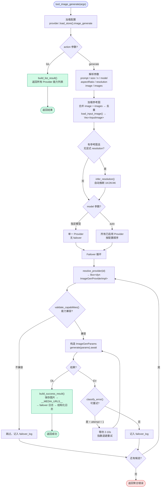

### 参考图加载流程

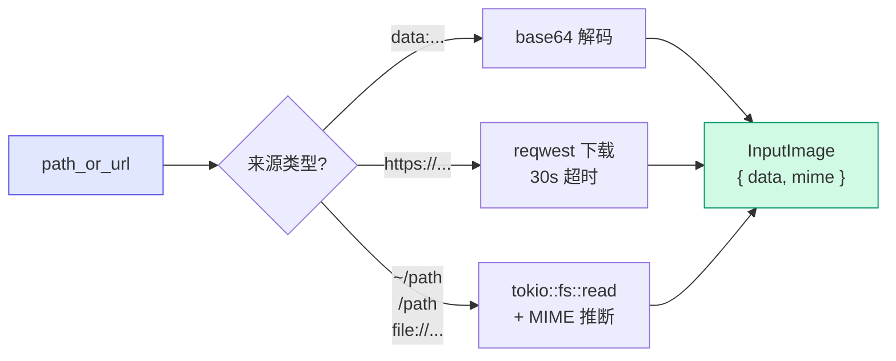

### Resolution 自动推断

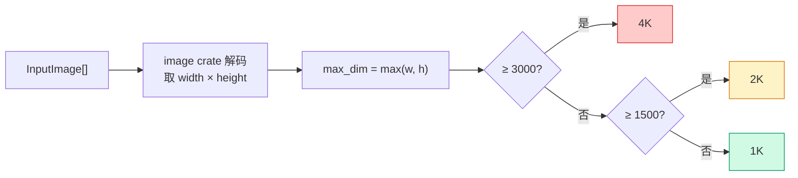

---

## 动态工具描述

`get_image_generate_tool_dynamic(config)` 在每次注入工具时调用，根据当前已启用的 Provider **动态生成**工具的 JSON Schema 描述：

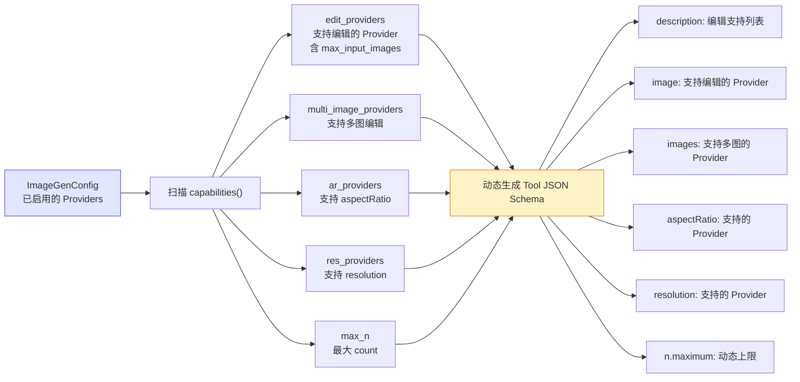

新增或移除 Provider 时，工具描述自动更新，无需手动维护。

---

## 降级与重试策略

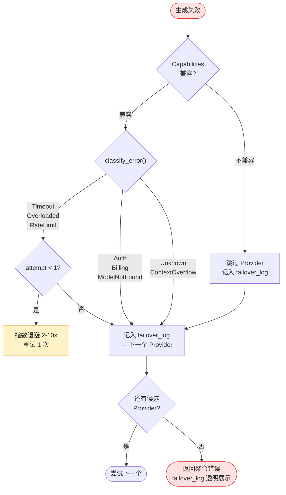

---

## Provider 特殊机制

### Google: Size → AspectRatio 映射

Google API 不直接接受像素尺寸，通过 `imageConfig` 传递：

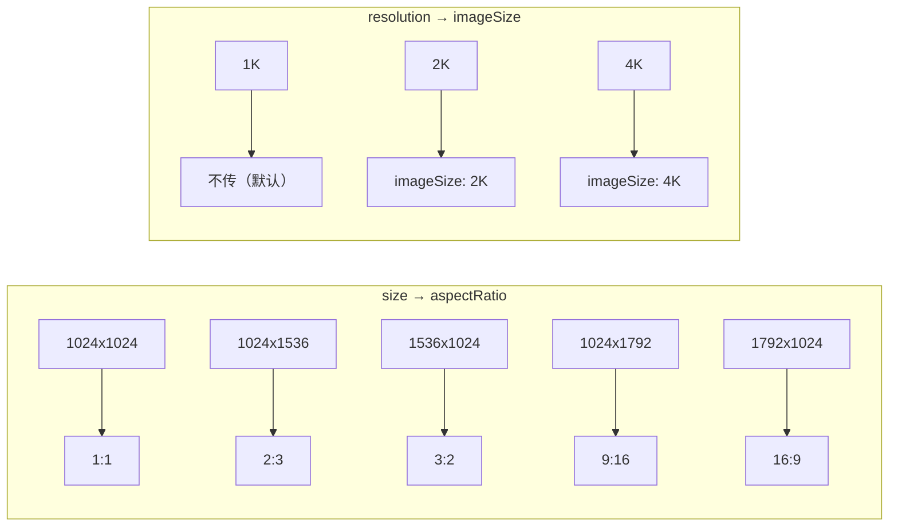

### Google: ThinkingLevel

通过 `ImageGenProviderEntry.thinking_level` 配置（`"MINIMAL"` 或 `"HIGH"`），控制 Gemini 在图片生成时的推理深度。注入到 `generationConfig.thinkingConfig.thinkingLevel`。

### Fal: AspectRatio 枚举映射

Fal API 使用枚举而非比例字符串：

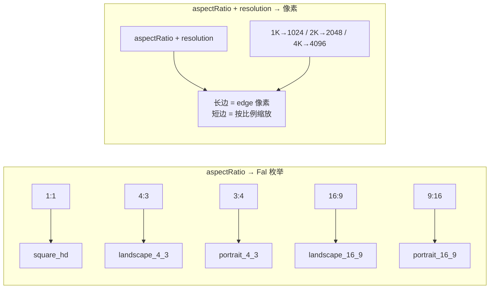

### Fal: 编辑路径自动追加

有参考图时，自动在 model 路径后追加 `/image-to-image`：

```
"fal-ai/flux/dev" → "fal-ai/flux/dev/image-to-image"
```

已包含 `/image-to-image` 或 `/edit` 后缀的路径不重复追加。

### SiliconFlow: 自动模型切换

有参考图时自动切换模型：
- 文生图：`Qwen/Qwen-Image`（默认 50 步推理）
- 图片编辑：`Qwen/Qwen-Image-Edit`（20 步推理 + guidance_scale=7.5）

### Tongyi: 异步轮询架构

通义万相采用异步任务模式，是唯一需要轮询的 Provider：

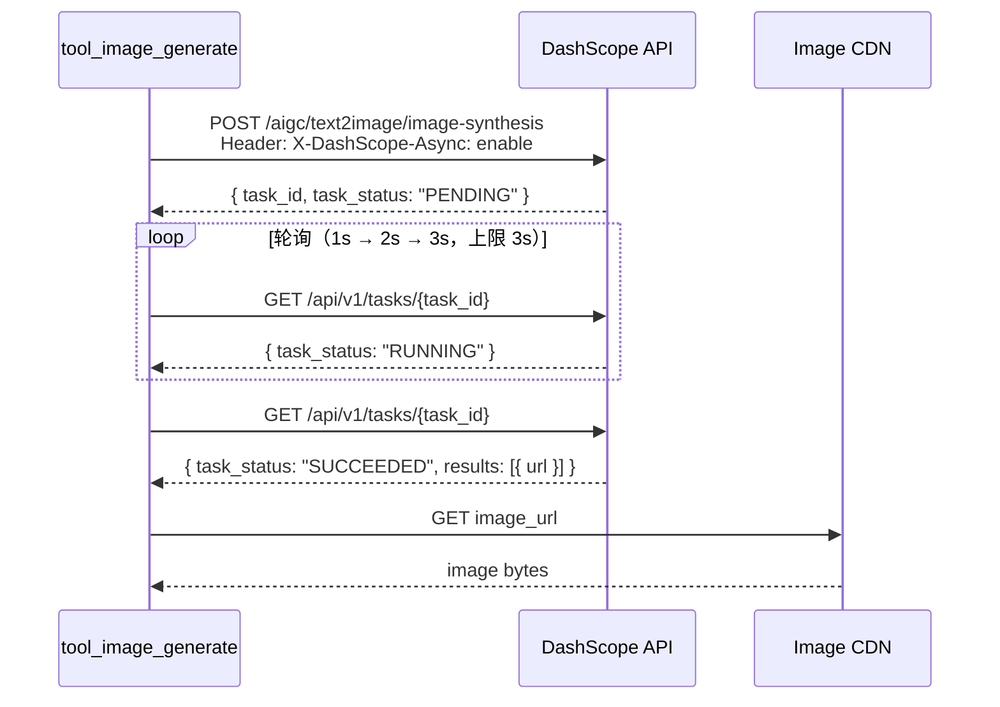

- 文生图 endpoint：`/api/v1/services/aigc/text2image/image-synthesis`
- 编辑 endpoint：`/api/v1/services/aigc/image2image/image-synthesis`（模型切换为 `wanx2.1-imageedit`，`function: "description_edit"`）
- 超时：`timeout_secs`（默认 60s）

### Tongyi: Size 格式转换

通义 API 使用 `*` 分隔尺寸（如 `1024*1024`），而非标准的 `x`：

```rust
fn convert_size_format(size: &str) -> String {
    size.replace('x', "*")
}
```

---

## 持久化配置

### 配置结构

```rust
pub struct ImageGenConfig {
    pub providers: Vec<ImageGenProviderEntry>,  // 有序列表（顺序 = 优先级）
    pub timeout_seconds: u64,                    // 默认 60
    pub default_size: String,                    // 默认 "1024x1024"
}

pub struct ImageGenProviderEntry {
    pub id: String,                    // "openai", "google", ...
    pub enabled: bool,
    pub api_key: Option<String>,
    pub base_url: Option<String>,      // 自定义 API 地址
    pub model: Option<String>,         // 自定义模型名
    pub thinking_level: Option<String>,// Google 专用
}
```

存储位置：`~/.opencomputer/config.json` 的 `imageGenerate` 字段。

### 配置自动补齐

`backfill_providers()` 在每次加载配置时调用：
1. 规范化已有 Provider ID（向后兼容：`"OpenAI"` → `"openai"`，`"MiniMax"` → `"minimax"` 等）
2. 检查 `known_provider_ids()` 列表，补齐缺失的 Provider（disabled 状态）

新增 Provider 后，用户已有的 `config.json` 会自动补齐新条目，无需迁移。

---

## 前端设置面板

### 组件：`ImageGeneratePanel.tsx`

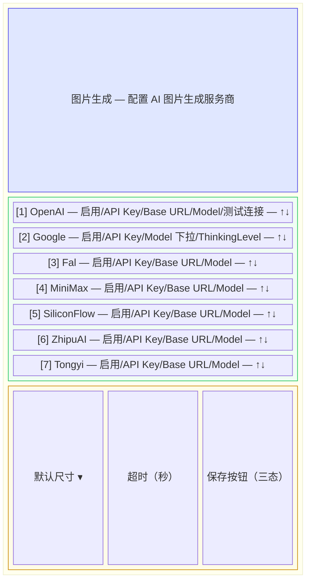

- **优先级排序**：上下箭头调整顺序，顺序即 failover 优先级
- **测试连接**：调用 `test_image_generate` 命令验证 API Key 可用性
- **Google 模型选择器**：内置 6 个预设模型 + 自定义模式
- **三态保存按钮**：saving（旋转动画）→ saved（绿色 ✓）→ idle

### Tauri 命令

| 命令 | 功能 |
|------|------|
| `get_image_generate_config` | 加载配置（含 backfill） |
| `save_image_generate_config` | 保存配置到 config.json |
| `test_image_generate(provider_id, api_key, base_url)` | 测试 Provider 连通性 |

---

## 文件结构

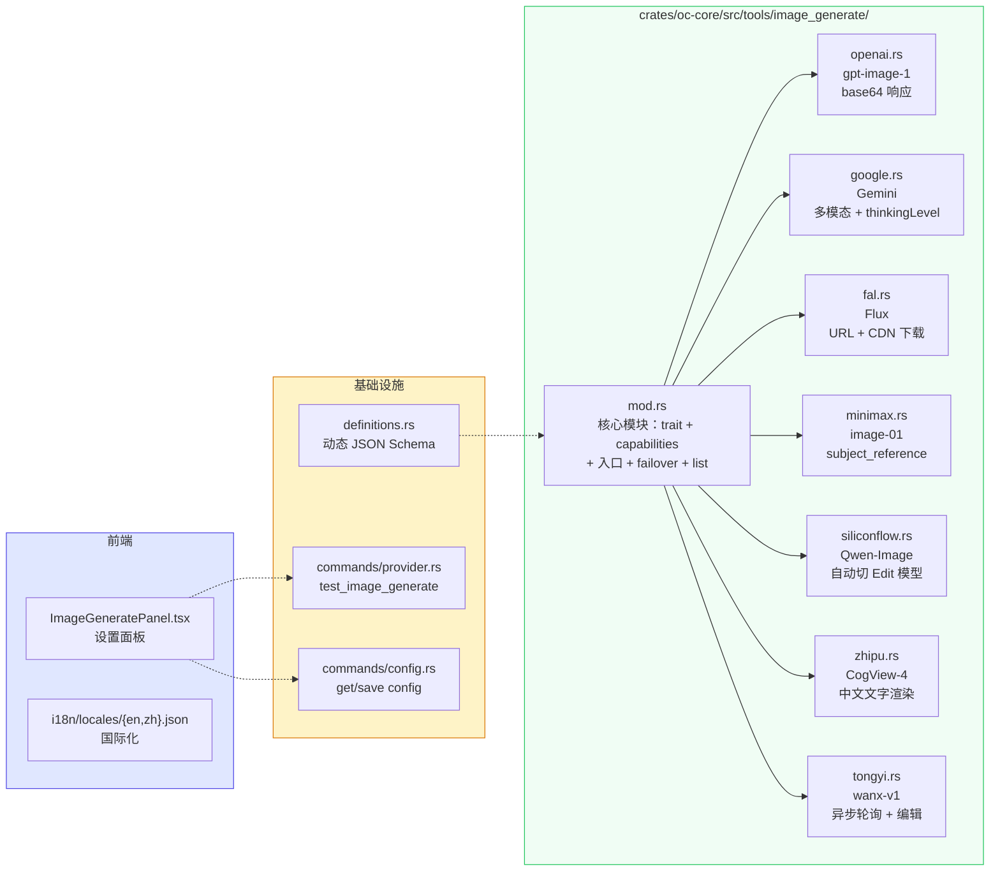

---

## 扩展新 Provider 指南

新增一个 Provider 只需 4 步：

### 1. 新建 Provider 文件

`crates/oc-core/src/tools/image_generate/{provider_id}.rs`，参照 `minimax.rs` 模板：

```rust
pub(crate) struct MyProvider;

impl ImageGenProviderImpl for MyProvider {
    fn id(&self) -> &str { "myprovider" }
    fn display_name(&self) -> &str { "MyProvider" }
    fn default_model(&self) -> &str { "model-v1" }
    fn capabilities(&self) -> ImageGenCapabilities { /* 声明能力 */ }
    fn generate<'a>(&'a self, params: ImageGenParams<'a>)
        -> Pin<Box<dyn Future<Output = Result<ImageGenResult>> + Send + 'a>> {
        Box::pin(generate_impl(params))
    }
}

async fn generate_impl(params: ImageGenParams<'_>) -> Result<ImageGenResult> {
    // 1. 解析 base_url（默认值 + 用户自定义覆盖）
    // 2. 构建请求体（根据 params.input_images 判断生成/编辑模式）
    // 3. 日志记录
    // 4. 发送 HTTP 请求（使用 crate::provider::apply_proxy 代理）
    // 5. 解析响应 → Vec<GeneratedImage>
    // 6. 返回 ImageGenResult
}
```

### 2. 注册到 mod.rs

```rust
pub(crate) mod myprovider;

// resolve_provider() 加分支
"myprovider" => Some(Box::new(myprovider::MyProvider)),

// known_provider_ids() 加 id
&[..., "myprovider"]

// normalize_provider_id() 加映射
"MyProvider" => "myprovider".to_string(),

// default_providers() 加条目
ImageGenProviderEntry { id: "myprovider".to_string(), ..Default::default() },
```

### 3. 前端面板 + test 命令

- `ImageGeneratePanel.tsx` 的 `PROVIDER_DISPLAY` 和 `DEFAULT_CONFIG` 加条目
- `provider.rs` 的 `test_image_generate()` 加 test 分支
- `en.json` / `zh.json` 加 i18n key

### 4. 文档

- `CHANGELOG.md` 记录
- `CLAUDE.md` / `AGENTS.md` / `.agent/rules/default.md` 更新 Provider 数量

**无需修改**：`tool_image_generate()`、`build_success_result()`、`validate_capabilities()`、`get_image_generate_tool_dynamic()`——这些函数通过 trait 和 capabilities 自动适配新 Provider。
