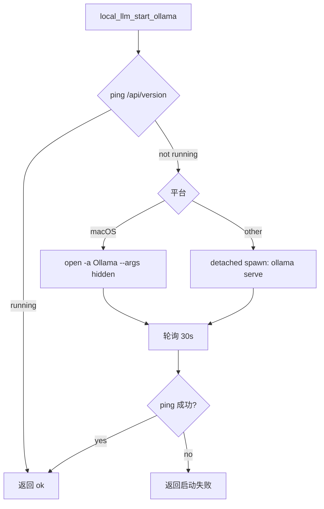
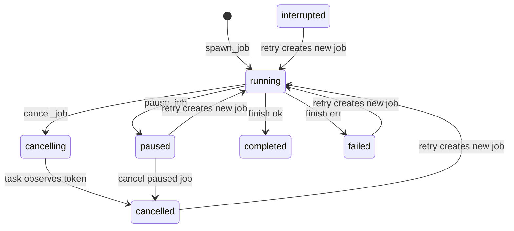
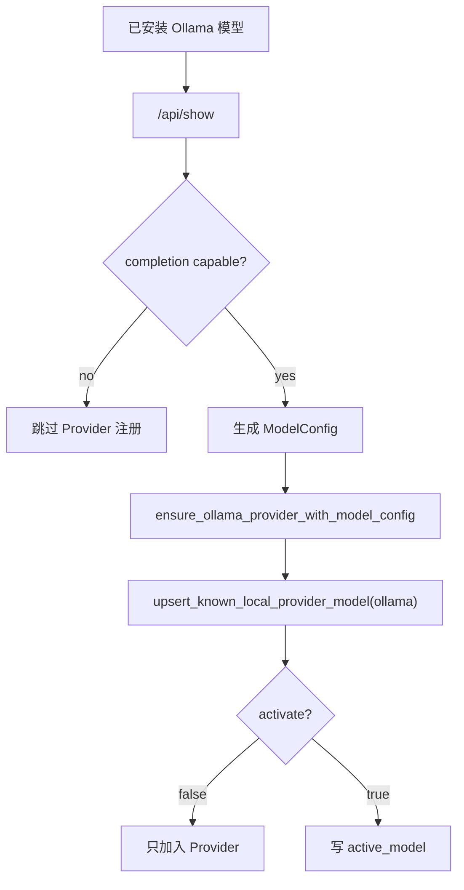
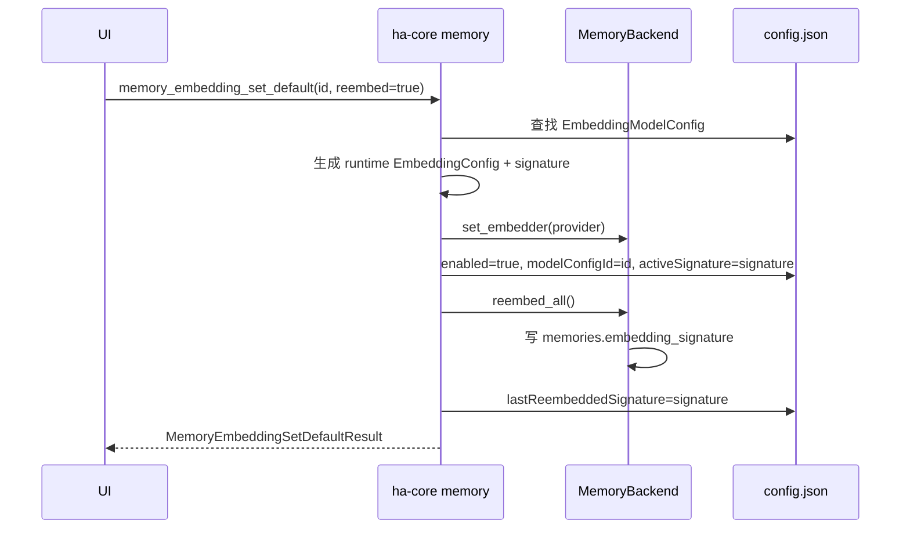
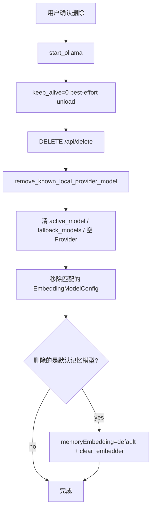

# 本地模型加载与 Embedding 配置

> 返回 [文档索引](../README.md) | 更新时间：2026-04-27

## 概述

Hope Agent 的本地模型体系当前只实现 **Ollama** 后端，面向两类模型：

| 类型 | 用途 | 配置目标 | 典型模型 |
| --- | --- | --- | --- |
| LLM | 对话、工具调用、推理 | Ollama Provider + 全局默认模型 | `qwen3.6:*`, `gemma4:*` |
| Embedding | 向量检索，目前用于记忆 | Embedding 模型配置 + 默认记忆模型 | `embeddinggemma:300m` |

设计上有两套入口，但复用同一组后端能力：

- **快捷卡**：省心入口。一键完成安装 Ollama、下载推荐模型、写入对应配置，并在需要时切换默认模型。
- **本地模型 Tab**：显式管理入口。负责搜索、下载、任务进度、启动/停止、加入配置、设为默认、删除；其中模型库里的「下载」只下载，不写 Provider，不写 Memory，也不切默认。

应用不接管 Ollama daemon 生命周期：只在需要时尝试启动 `ollama serve` 或 macOS Ollama.app；应用退出不杀 Ollama，避免影响用户其它工具。

## 代码分层

| 层 | 文件 | 职责 |
| --- | --- | --- |
| 核心 Ollama 能力 | `crates/ha-core/src/local_llm/mod.rs` | 硬件探测、推荐模型、Ollama 安装/启动、`/api/pull` 流解析、快捷 LLM 注册 |
| 本地模型管理 | `crates/ha-core/src/local_llm/management.rs` | 已安装模型聚合、Ollama Library 搜索/缓存、预加载/停止、删除、Provider/Embedding 配置写入 |
| Embedding 快捷链路 | `crates/ha-core/src/local_embedding.rs` | Ollama Embedding 推荐模型、拉取、创建 Embedding 配置、设为默认记忆模型 |
| 后台任务 | `crates/ha-core/src/local_model_jobs.rs` | 安装/下载 job 持久化、事件、日志、暂停/取消/重试 |
| Provider 去重写入 | `crates/ha-core/src/provider/local.rs` | known local backend catalog、Ollama Provider upsert/remove |
| Embedding 配置 | `crates/ha-core/src/memory/embedding/config.rs` | `EmbeddingModelConfig` / `MemoryEmbeddingSelection` / signature |
| 记忆向量后端 | `crates/ha-core/src/memory/sqlite/` | `embedding_signature`、cache signature、重建向量与搜索过滤 |
| Tauri 薄壳 | `src-tauri/src/commands/local_llm.rs`, `local_model_jobs.rs`, `memory.rs` | IPC 命令适配、桌面 active agent 热同步 |
| HTTP 薄壳 | `crates/ha-server/src/routes/local_llm.rs`, `local_model_jobs.rs`, `config.rs` | REST 路由适配 |
| 前端 | `src/components/settings/local-llm/`, `embedding-models/`, `memory-panel/` | 本地模型页、快捷卡、Embedding 配置页、记忆向量设置页 |

## 运行时对象

### Ollama 状态

`local_llm_detect_ollama` 返回 `OllamaStatus`：

```ts
type OllamaPhase = "not-installed" | "installed" | "running"

interface OllamaStatus {
  phase: OllamaPhase
  baseUrl: string
  installScriptSupported: boolean
}
```

- `not-installed`：未检测到可执行 Ollama。
- `installed`：检测到 Ollama，但 `http://127.0.0.1:11434` 不可用。
- `running`：Ollama API 可 ping 通。
- `installScriptSupported=false` 时，前端引导用户打开 `https://ollama.com/download`，不尝试脚本安装。

### 已安装模型

`local_llm_list_models` 合并三类数据：

1. `/api/tags`：已安装模型与大小、digest、基础 details。
2. `/api/ps`：运行中模型、VRAM 占用、过期时间。
3. `/api/show`：capabilities、context length、embedding length。

并叠加 Hope 使用状态：

```ts
interface LocalModelUsage {
  activeModel: boolean       // 当前全局默认 LLM
  fallbackModel: boolean     // 当前 fallback chain 引用
  providerModel: boolean     // 已加入 Ollama Provider
  embeddingConfig: boolean   // 已加入 Embedding 模型配置
  embeddingModel: boolean    // 当前默认记忆模型
  running: boolean           // Ollama /api/ps 正在加载
  providerId?: string | null
  embeddingConfigId?: string | null
}
```

本地模型 UI 根据 capability 分流：

- LLM 模型：启动/停止、加入模型配置、设为默认、删除。
- Embedding 模型：启动/停止、加入 Embedding 配置、设为默认记忆模型、删除。
- 如果模型同时声明 completion + embedding，则两类动作都可显示。

## Ollama 生命周期

### 启动 daemon

`local_llm_start_ollama` 只保证 Ollama 可访问，不负责关闭：



### 安装 Ollama

`local_model_job_start_ollama_install` 创建 `LocalModelJobKind::OllamaInstall`：

- macOS/Linux：下载官方 install.sh，并通过系统授权执行。
- Windows：不支持脚本安装，前端引导到官网下载。
- 安装完成后再次探测 Ollama 状态。

安装 job 只安装 Ollama，不下载模型，不写 Provider/Memory。

## 后台任务

后台任务持久化到 `~/.hope-agent/local_model_jobs.db`，避免弹层关闭后丢进度。前端订阅 EventBus 事件：

| 事件 | payload | 说明 |
| --- | --- | --- |
| `local_model_job:created` | `LocalModelJobSnapshot` | job 创建 |
| `local_model_job:updated` | `LocalModelJobSnapshot` | 进度、阶段、字节数、状态更新 |
| `local_model_job:log` | `LocalModelJobLogEntry` | 安装脚本或 pull 流日志 |
| `local_model_job:completed` | `LocalModelJobSnapshot` | completed / failed / cancelled / paused / interrupted |

### Job 类型与副作用

| Kind | 入口 | 用途 | 完成后的副作用 |
| --- | --- | --- | --- |
| `chat_model` | 快捷 LLM 卡 | 安装 Ollama + 下载推荐 LLM | 加入 Ollama Provider，设为全局默认模型，Tauri 热更新 `AppState.agent` |
| `embedding_model` | 记忆快捷卡 | 安装 Ollama + 下载推荐 Embedding | 创建/更新 Embedding 配置，设为默认记忆模型，自动全量重建向量 |
| `ollama_install` | 本地模型 Tab 顶部按钮 | 只安装 Ollama | 无配置副作用 |
| `ollama_pull` | 本地模型库/手动 tag 下载 | 安装 Ollama + pull 模型 | 只表示本地已下载，不注册 Provider，不写 Memory，不设默认 |

### 状态机



`paused` 的实现是 best-effort：取消当前底层任务，把 job 标记为 paused；恢复时创建一个新 job。Ollama pull 的 chunk cache 会让下一次 pull 复用已下载层。

### 下载速度与 ETA

Ollama `/api/pull` 流会返回 `completed` / `total` 字节数。core 层将其映射到：

```ts
interface LocalModelJobSnapshot {
  percent?: number | null
  bytesCompleted?: number | null
  bytesTotal?: number | null
}
```

前端根据相邻 snapshot 的 `bytesCompleted` 差值计算速度和 ETA。速度不持久化，只在 UI 运行时估算；字节数会持久化，关闭再打开仍可显示已下载量。

## 本地模型 Tab

模型设置页新增「本地模型」Tab，对应 `LocalModelsPanel`。

### 顶部状态区

- 显示 Ollama 未安装 / 已安装 / 运行中。
- 未安装时按钮只安装 Ollama 或打开官网下载页。
- 已安装未运行时显示启动按钮。
- 刷新会同时刷新 Ollama 状态、已安装模型、推荐模型和下载任务。

### 已安装列表

每个模型显示：

- `LLM` / `Embedding` capability badge。
- `运行中`：来自 `/api/ps`。
- `已加入 Provider`：Ollama Provider 中已有该模型。
- `默认`：全局 active model 指向该 Ollama Provider model。
- `已加入 Embedding 配置`：`embeddingModels` 中已有对应 Ollama 配置。
- `用于记忆`：`memoryEmbedding` 当前选择该配置。

动作分流：

| 条件 | 动作 |
| --- | --- |
| 未运行 | `local_llm_preload_model` |
| 运行中 | `local_llm_stop_model` |
| LLM 且未加入 Provider | `local_llm_add_provider_model` |
| LLM 且已加入 Provider 但非默认 | `local_llm_set_default_model` |
| Embedding 且未加入配置 | `local_llm_add_embedding_config` |
| Embedding 已加入配置但非默认记忆模型 | `memory_embedding_set_default(reembed=true)` |
| 任意模型 | `local_llm_delete_model` |

### 模型库

`local_llm_search_library` / `local_llm_get_library_model` 从 Ollama Library HTML 解析模型 family 与 tag：

- 目录源：`https://www.ollama.com/search` 与 `/library/{model}/tags`。
- 缓存：`~/.hope-agent/local_llm_library_cache.db`，TTL 24 小时。
- 网络失败时，如果有缓存则返回 `fromCache=true, stale=true`。
- cloud-only tag 不允许下载。
- 搜索为空时，展示推荐模型列表；用户也可以手动输入 tag 下载。

模型库的「下载」统一走 `local_model_job_start_ollama_pull`，只下载，不写配置。

## 启动与停止模型

这里的“启动模型”不是启动 Ollama daemon，而是将模型预加载到 Ollama 内存。

| 动作 | keep_alive | 语义 |
| --- | --- | --- |
| 启动/加载 | `-1` | 常驻内存，直到用户停止或 Ollama 自行退出 |
| 停止/卸载 | `0` | 从 Ollama 内存卸载 |

endpoint 根据 `/api/show` capabilities 自动选择：

| 模型能力 | endpoint | 请求体关键字段 |
| --- | --- | --- |
| embedding-only | `/api/embed` | `{ model, input: "warmup", keep_alive }` |
| completion/chat/vision/tools/thinking 或未知 | `/api/generate` | `{ model, prompt: "", stream: false, keep_alive }` |

`keep_alive` 必须用数字 `-1` / `0`，不能用字符串 `"-1"`，否则 Ollama 会报 duration unit 错误。

删除模型前会 best-effort 调一次 `keep_alive=0` 卸载模型，再调用 `/api/delete`。卸载失败会写 warn 日志，但仍继续 delete，让 Ollama 返回最终结果。

## Provider 配置

LLM 模型加入配置时走 `register_ollama_model_as_provider`：



Ollama Provider 统一为：

- `apiType = openai-chat`
- `baseUrl = http://127.0.0.1:11434`
- `allowPrivateNetwork = true`
- `thinkingStyle = Qwen`

写入必须走 `provider/local.rs` 的 known backend upsert：

- 按 backend catalog 匹配 host/port，避免重复 Provider。
- 已有 Provider 时只补模型并启用。
- `activate=true` 时写全局 `active_model`。

Tauri 的 `local_llm_set_default_model` 会在写配置后调用 `set_active_model_core`，同步刷新桌面端 `AppState.agent`。删除 active 模型时，Tauri wrapper 会清空 `state.agent`，避免继续用已删除模型聊天。

## Embedding 模型配置

Embedding 不再直接在记忆设置里编辑 base URL / API key / model。新的配置模型拆成两层：

```rust
EmbeddingModelConfig {
  id,
  name,
  providerType,
  apiBaseUrl,
  apiKey,
  apiModel,
  apiDimensions,
  source,
}

MemoryEmbeddingSelection {
  enabled,
  modelConfigId,
  activeSignature,
  lastReembeddedSignature,
}
```

- `EmbeddingModelConfig` 是可复用的模型服务配置。
- `MemoryEmbeddingSelection` 是记忆向量检索当前使用哪个配置。
- 记忆设置页只负责启用/禁用、选择默认记忆模型、触发重建。
- `EmbeddingConfig` 保留为运行时 payload，由 `modelConfigId` 解析生成。

### 模板

`embedding_model_config_templates` 返回常见模板：

- OpenAI
- Google Gemini
- Jina AI
- Cohere
- SiliconFlow
- Voyage AI
- Mistral
- Ollama (`http://127.0.0.1:11434` + `embeddinggemma:300m`)

### Ollama Embedding 接入

已安装的 Ollama Embedding 模型执行「加入 Embedding 配置」时：

1. `/api/show` 读取 `embedding_length`。
2. 创建 OpenAI-compatible 配置：
   - `apiBaseUrl = http://127.0.0.1:11434`
   - `apiKey = ollama`
   - `apiModel = modelId`
   - `apiDimensions = embedding_length`
   - `source = ollama`
3. 保存到 `embeddingModels`，不设为默认记忆模型。

「设为默认记忆模型」统一走 `memory_embedding_set_default(modelConfigId, reembed=true)`。

### 切换默认记忆模型

切换默认记忆模型必须二次确认，并自动全量重建向量：



如果重建失败：

- 新默认模型仍保留。
- 返回 `reembedError`。
- `lastReembeddedSignature` 不更新，`needsReembed=true`。
- UI 提示用户需要重试重建。

### Active 配置保存

保存当前默认 Embedding 配置时，后端有两个约束：

1. 如果修改会改变 signature 的字段（provider/base URL/model/dimensions），直接拒绝，要求用户先切换或禁用。
2. 如果只改 name/API key/source 等 signature 不变字段，允许保存，并立即热加载 embedder，让新凭据不用重启即可生效。

## 向量签名隔离

Embedding signature 由以下字段生成：

- provider type
- base URL
- model
- dimensions

它用于阻止不同向量空间混用：

| 数据 | 处理 |
| --- | --- |
| `memories.embedding_signature` | 每条记忆的 embedding 记录生成时使用的 signature |
| `embedding_cache.signature` | cache key 从 `(hash, provider, model)` 扩展为 `(hash, provider, model, signature)` |
| 向量搜索 | 只查询 `embedding_signature == activeSignature` 的行 |
| stats `with_embedding` | 只统计当前 active signature |
| reembed | 重写 embedding BLOB 和 `embedding_signature` |

这保证切换模型后旧向量不会参与检索，也不会错误复用旧 cache。

## 删除模型

删除 Ollama 模型时的清理顺序：



删除确认文案会提示这些引用：

- running：Ollama 当前加载。
- active model：全局默认 LLM。
- fallback model：降级链引用。
- provider model：已加入 Provider。
- embedding config：已加入 Embedding 配置。
- memory model：当前默认记忆模型。

删除成功后，前端刷新已安装列表和使用状态。Tauri 桌面端如果删除了 active model 或整个 Provider，会清空 `AppState.agent`。

## 快捷卡与完整管理页的边界

| 入口 | 用户意图 | 后端 job | 完成后写配置 |
| --- | --- | --- | --- |
| 模型设置快捷卡 | “帮我装一个能聊天的本地模型并直接用起来” | `chat_model` | Ollama Provider + active model |
| 记忆设置快捷卡 | “帮我装一个本地向量模型并用于记忆” | `embedding_model` | Embedding config + default memory model + reembed |
| 本地模型库下载 | “下载这个 Ollama tag” | `ollama_pull` | 无 |
| 本地模型页安装 Ollama | “只安装 Ollama” | `ollama_install` | 无 |
| 已安装模型加入 Provider | “把这个 LLM 放进模型配置” | direct command | Provider model |
| 已安装 Embedding 加入配置 | “把这个向量模型放进 Embedding 配置” | direct command | EmbeddingModelConfig |
| 已安装 Embedding 设为记忆默认 | “切换记忆向量模型” | direct command | MemoryEmbeddingSelection + reembed |

这条边界很重要：下载和配置是独立动作，只有快捷卡可以自动配置。

## 接口清单

### Tauri / HTTP 对等接口

| Tauri command | HTTP route | 说明 |
| --- | --- | --- |
| `local_llm_detect_hardware` | `GET /api/local-llm/hardware` | 硬件预算与推荐依据 |
| `local_llm_recommend_model` | `GET /api/local-llm/recommendation` | 推荐 LLM 模型 |
| `local_llm_detect_ollama` | `GET /api/local-llm/ollama-status` | Ollama 状态 |
| `local_llm_known_backends` | `GET /api/local-llm/known-backends` | 本地后端 catalog |
| `local_llm_start_ollama` | `POST /api/local-llm/start` | 启动 Ollama daemon |
| `local_llm_list_models` | `GET /api/local-llm/models` | 已安装模型聚合 |
| `local_llm_search_library` | `GET /api/local-llm/library/search` | 搜索 Ollama Library |
| `local_llm_get_library_model` | `POST /api/local-llm/library/model` | 读取 family tag 列表 |
| `local_llm_preload_model` | `POST /api/local-llm/preload` | `keep_alive=-1` |
| `local_llm_stop_model` | `POST /api/local-llm/stop-model` | `keep_alive=0` |
| `local_llm_delete_model` | `POST /api/local-llm/delete-model` | 删除模型并清理引用 |
| `local_llm_add_provider_model` | `POST /api/local-llm/provider-model` | 加入 Ollama Provider |
| `local_llm_set_default_model` | `POST /api/local-llm/default-model` | 加入 Provider 并设为默认 |
| `local_llm_add_embedding_config` | `POST /api/local-llm/embedding-config` | 加入 Embedding 配置 |
| `local_model_job_start_chat_model` | `POST /api/local-model-jobs/chat-model` | 快捷 LLM job |
| `local_model_job_start_embedding` | `POST /api/local-model-jobs/embedding` | 快捷 Embedding job |
| `local_model_job_start_ollama_install` | `POST /api/local-model-jobs/ollama-install` | 只安装 Ollama |
| `local_model_job_start_ollama_pull` | `POST /api/local-model-jobs/ollama-pull` | 下载-only |
| `local_model_job_list` | `GET /api/local-model-jobs` | job 列表 |
| `local_model_job_get` | `GET /api/local-model-jobs/{id}` | job 详情 |
| `local_model_job_logs` | `GET /api/local-model-jobs/{id}/logs` | job 日志 |
| `local_model_job_pause` | `POST /api/local-model-jobs/{id}/pause` | 暂停 |
| `local_model_job_cancel` | `POST /api/local-model-jobs/{id}/cancel` | 取消 |
| `local_model_job_retry` | `POST /api/local-model-jobs/{id}/retry` | 重试 |
| `local_model_job_clear` | `DELETE /api/local-model-jobs/{id}` | 清除终态记录 |

### Embedding 配置接口

| Tauri command | HTTP route | 说明 |
| --- | --- | --- |
| `embedding_model_config_list` | `GET /api/config/embedding-models` | 列出配置 |
| `embedding_model_config_templates` | `GET /api/config/embedding-models/templates` | 模板 |
| `embedding_model_config_save` | `PUT /api/config/embedding-models` | 新增/编辑 |
| `embedding_model_config_delete` | `POST /api/config/embedding-models/delete` | 删除配置 |
| `embedding_model_config_test` | `POST /api/config/embedding-models/test` | 连接测试 |
| `memory_embedding_get` | `GET /api/config/memory-embedding` | 当前记忆模型状态 |
| `memory_embedding_set_default` | `POST /api/config/memory-embedding/default` | 切换默认并重建 |
| `memory_embedding_disable` | `POST /api/config/memory-embedding/disable` | 禁用向量检索 |

## 日志与排查

本地模型管理相关日志分类：

| category | subcategory | 场景 |
| --- | --- | --- |
| `local_llm` | `ollama_api` | Ollama API 请求、状态码、解析失败 |
| `local_llm` | `keep_alive` | 启动/停止模型 |
| `local_llm` | `delete_model` | 删除和引用清理 |
| `local_llm` | `register_provider` | Provider 注册 |
| `local_model_jobs` | `spawn` / `finish` / `job_log` | job 生命周期与错误日志 |
| `memory` | `embedding_models` | Embedding 配置保存/删除/热加载 |
| `memory` | `embedding` | 默认记忆模型切换、重建、cache prune |

排查顺序：

1. `local_model_job_list` 看任务状态。
2. `local_model_job_logs(jobId)` 看 Ollama install/pull 原始日志。
3. 本地日志搜索 `local_llm/ollama_api` 判断是 Ollama 返回错误还是网络/解析错误。
4. 删除失败时看是否 unload 失败以及 `/api/delete` 返回体。
5. 向量检索异常时看 `memory_embedding_get.needsReembed` 和 `MemoryStats.with_embedding`。

## 开发检查

本功能改动的最小验证组合：

```bash
cargo fmt --all
cargo check -p ha-core
cargo check -p ha-server
cargo check -p hope-agent
pnpm typecheck
node scripts/sync-i18n.mjs --check
git diff --check
```

用户明确要求 push 时，按仓库 pre-push 规则再跑完整检查或交给 `.husky/pre-push` 兜底。
