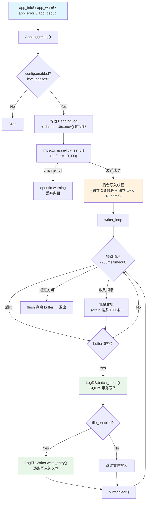
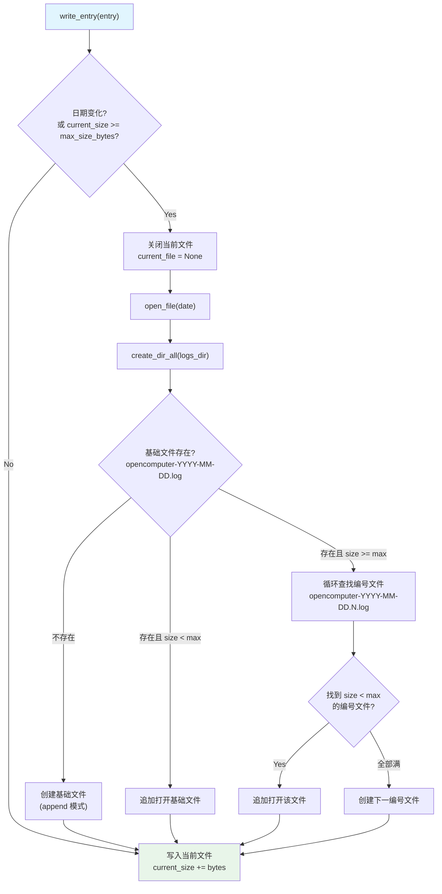

# 统一日志系统架构
> 返回 [文档索引](../README.md) | 更新时间：2026-04-05

## 模块结构

| 文件 | 职责 |
|------|------|
| `mod.rs` | 模块入口，定义 `app_info!` / `app_warn!` / `app_error!` / `app_debug!` 全局宏 |
| `types.rs` | 数据结构：`LogEntry`、`LogFilter`、`LogConfig`、`LogStats`、`LogQueryResult`、`PendingLog` |
| `app_logger.rs` | `AppLogger` 异步非阻塞日志器，mpsc channel + 后台写入线程 |
| `db.rs` | `LogDB` SQLite 数据库管理器，CRUD + 统计 + 清理 |
| `file_writer.rs` | `LogFileWriter` 纯文本日志文件写入器，按日期 + 大小自动轮转 |
| `file_ops.rs` | 日志文件操作（列出/读取/清理旧文件）+ `redact_sensitive()` 脱敏函数 |
| `config.rs` | `LogConfig` 持久化（`log_config.json`）+ 数据库路径 helper |

## AppLogger 架构



### 关键设计

- **非阻塞写入**：`log()` 方法通过 `try_send()` 将日志推入 mpsc channel（容量 10,000），不阻塞调用方
- **独立线程**：后台写入使用 `std::thread::spawn` + 独立 `tokio::runtime::Runtime`，避免 Tauri `.manage()` 阶段 reactor 未就绪的 panic
- **批量刷写**：200ms 间隔或累积 100 条时批量写入 SQLite（单事务 `unchecked_transaction`），减少 I/O 次数
- **双写**：同一条日志同时写入 SQLite（结构化查询）和纯文本文件（外部工具 / Agent 自检）
- **开发模式**：`#[cfg(debug_assertions)]` 下额外输出到 stderr（`[HH:MM:SS] LEVEL [category] source -- message`），方便控制台调试
- **优雅关闭**：channel 关闭时 flush 剩余 buffer 后退出写入循环

## 日志宏用法

项目**禁止使用 `log` crate 宏**（`log::info!` 等），统一使用自定义宏：

```rust
// 四个宏签名完全一致，区别仅在于 level
app_info!("category", "source", "message {} {}", arg1, arg2);
app_warn!("category", "source", "something went wrong: {}", err);
app_error!("category", "source", "fatal: {}", err);
app_debug!("category", "source", "verbose detail: {}", val);
```

宏内部调用 `crate::get_logger()` 获取全局 `AppLogger` 实例，若未初始化则静默跳过。每个宏展开为：

```rust
if let Some(logger) = crate::get_logger() {
    logger.log("info", $cat, $src, &format!($($arg)+), None, None, None);
}
```

`log()` 完整签名支持 7 个参数：

| 参数 | 类型 | 说明 |
|------|------|------|
| `level` | `&str` | `error` / `warn` / `info` / `debug` |
| `category` | `&str` | 模块类别（如 `agent`、`tool`、`channel`） |
| `source` | `&str` | 来源标识（如 `agent::run`、`tool::exec`） |
| `message` | `&str` | 日志正文 |
| `details` | `Option<String>` | 可选详细信息（宏默认 `None`） |
| `session_id` | `Option<String>` | 关联会话 ID（宏默认 `None`） |
| `agent_id` | `Option<String>` | 关联 Agent ID（宏默认 `None`） |

唯一例外：`lib.rs` 的 `run()` 中 AppLogger 初始化之前，以及 `main.rs` 的 panic 恢复可使用 `log` crate。

## LogEntry 字段

| 字段 | 类型 | 说明 |
|------|------|------|
| `id` | `i64` | SQLite 自增主键 |
| `timestamp` | `String` | RFC 3339 UTC 时间戳（`chrono::Utc::now().to_rfc3339()`） |
| `level` | `String` | `error` / `warn` / `info` / `debug` |
| `category` | `String` | 模块类别（如 `agent`、`cron`、`sandbox`） |
| `source` | `String` | 来源标识（如 `anthropic`、`scheduler`） |
| `message` | `String` | 日志正文 |
| `details` | `Option<String>` | 可选附加详情（如 API 请求/响应体） |
| `session_id` | `Option<String>` | 关联会话 ID |
| `agent_id` | `Option<String>` | 关联 Agent ID |

序列化使用 `camelCase`，`details` / `session_id` / `agent_id` 为 `None` 时跳过序列化（`skip_serializing_if`）。

## SQLite Schema

```sql
CREATE TABLE IF NOT EXISTS logs (
    id          INTEGER PRIMARY KEY AUTOINCREMENT,
    timestamp   TEXT NOT NULL,
    level       TEXT NOT NULL,
    category    TEXT NOT NULL,
    source      TEXT NOT NULL DEFAULT '',
    message     TEXT NOT NULL DEFAULT '',
    details     TEXT,
    session_id  TEXT,
    agent_id    TEXT
);

CREATE INDEX IF NOT EXISTS idx_logs_timestamp  ON logs(timestamp DESC);
CREATE INDEX IF NOT EXISTS idx_logs_level      ON logs(level);
CREATE INDEX IF NOT EXISTS idx_logs_category   ON logs(category);
CREATE INDEX IF NOT EXISTS idx_logs_session_id ON logs(session_id);
```

PRAGMA 配置：`journal_mode=WAL`、`synchronous=NORMAL`，兼顾并发读写性能与数据安全。

## 文件轮转



### 文件命名规则

| 场景 | 文件名 |
|------|--------|
| 当日首个文件 | `opencomputer-2026-04-05.log` |
| 基础文件满后（第 1 个溢出） | `opencomputer-2026-04-05.1.log` |
| 继续增长 | `opencomputer-2026-04-05.2.log`, `opencomputer-2026-04-05.3.log`, ... |

默认单文件上限 10MB（`file_max_size_mb` 可配置），运行时通过 `update_max_size()` 热更新。

### 日志行格式

```
[2026-04-05T10:30:00Z] INFO [agent] agent::run — Starting chat session
[2026-04-05T10:30:01Z] ERROR [tool] tool::exec — Command failed | exit code: 1, stderr: ...
```

格式：`[TIMESTAMP] LEVEL [CATEGORY] SOURCE — MESSAGE`，有 `details` 时追加 ` | DETAILS`。

## 脱敏 `redact_sensitive()`

对日志中的敏感值进行自动替换为 `[REDACTED]`，支持两种匹配模式。API 请求体写入日志前经过脱敏 + 32KB 截断。

### 完整 key 列表

| Key | 说明 |
|-----|------|
| `api_key` | API 密钥（snake_case） |
| `apiKey` | API 密钥（camelCase） |
| `api-key` | API 密钥（kebab-case） |
| `access_token` | 访问令牌（snake_case） |
| `accessToken` | 访问令牌（camelCase） |
| `refresh_token` | 刷新令牌（snake_case） |
| `refreshToken` | 刷新令牌（camelCase） |
| `authorization` | 授权头（小写） |
| `Authorization` | 授权头（大写开头） |
| `x-api-key` | 自定义 API 密钥头 |
| `bearer` | Bearer 令牌 |
| `password` | 密码 |
| `secret` | 密钥/秘密 |

### 匹配模式

**模式 1 - JSON 字符串值**：匹配 `"key":"value"` 或 `"key": "value"`，将 value 替换为 `[REDACTED]`

```
"api_key": "sk-ant-xxx..." → "api_key": "[REDACTED]"
```

**模式 2 - URL 查询参数**：匹配 `?key=value` 或 `&key=value`，在 `&`、空格、引号、换行处截断

```
?api_key=sk-xxx&other=1 → ?api_key=[REDACTED]&other=1
```

两种模式均支持同一 key 在字符串中多次出现的情况（循环替换）。

## 查询系统 LogFilter

```rust
pub struct LogFilter {
    pub levels: Option<Vec<String>>,      // 按级别过滤（如 ["error", "warn"]）
    pub categories: Option<Vec<String>>,  // 按类别过滤（如 ["agent", "tool"]）
    pub keyword: Option<String>,          // 消息关键字模糊搜索（LIKE %keyword%）
    pub session_id: Option<String>,       // 按会话 ID 精确匹配
    pub start_time: Option<String>,       // 时间范围起始（RFC 3339）
    pub end_time: Option<String>,         // 时间范围结束（RFC 3339）
}
```

查询方法：

| 方法 | 说明 |
|------|------|
| `query(filter, page, page_size)` | 分页查询，返回 `LogQueryResult { logs, total }` |
| `export(filter)` | 全量导出（内部调用 `query` 且 `page_size = u32::MAX`） |
| `get_stats(db_path)` | 返回 `LogStats`：总数、按 level 分组、按 category 分组、DB 文件大小 |

### LogStats 结构

```rust
pub struct LogStats {
    pub total: u64,                         // 总日志条数
    pub by_level: HashMap<String, u64>,     // 按级别分组计数
    pub by_category: HashMap<String, u64>,  // 按类别分组计数
    pub db_size_bytes: u64,                 // 数据库文件大小（字节）
}
```

## 清理策略

| 清理目标 | 方法 | 说明 |
|----------|------|------|
| SQLite 按时间 | `LogDB.cleanup_old(max_age_days)` | 计算 `cutoff = now - max_age_days`，删除 `timestamp < cutoff` |
| SQLite 按日期 | `LogDB.clear(Some(before_date))` | 删除指定日期前的所有记录 |
| SQLite 全量 | `LogDB.clear(None)` | 清空 logs 表所有记录 |
| 纯文本文件 | `cleanup_old_log_files(max_age_days)` | 从文件名 `opencomputer-YYYY-MM-DD` 提取日期，与 cutoff 比较后删除 |

## LogConfig

```rust
pub struct LogConfig {
    pub enabled: bool,           // 日志总开关（默认 true）
    pub level: String,           // 最低记录级别（默认 "info"）
    pub max_age_days: u32,       // 最大保留天数（默认 30）
    pub max_size_mb: u32,        // SQLite 数据库最大大小（默认 100MB）
    pub file_enabled: bool,      // 纯文本文件输出开关（默认 true）
    pub file_max_size_mb: u32,   // 单个日志文件最大大小（默认 10MB）
}
```

持久化路径：`~/.opencomputer/log_config.json`。运行时通过 `AppLogger.update_config()` 热更新（`Arc<RwLock<LogConfig>>`）。

### 级别优先级

| 级别 | 优先级数值 | 说明 |
|------|-----------|------|
| `error` | 0 | 最高，总是记录 |
| `warn` | 1 | 警告 |
| `info` | 2 | 常规信息（默认级别） |
| `debug` | 3 | 调试详情 |

`should_log()` 判断：当 entry 的优先级数值 <= config level 的优先级数值时记录。配置 `level: "warn"` 时只记录 `error`(0) 和 `warn`(1)。

## 前端集成

前端通过 `src/lib/logger.ts` 封装日志写入，经 Tauri `invoke()` 调用后端命令：

### 日志写入

- 单条写入：调用后端日志命令，传递 `level`、`category`、`source`、`message`、`details`、`session_id`
- 批量写入：前端缓冲后批量提交

### 文件操作

| 操作 | 函数 | 说明 |
|------|------|------|
| 列出文件 | `list_log_files()` | 返回 `Vec<LogFileInfo>`（name + size_bytes + modified），按文件名倒序 |
| 读取文件 | `read_log_file(filename, tail_lines)` | 支持 tail 模式（最后 N 行），文件名安全检查防路径遍历 |
| 当日路径 | `current_log_file_path()` | 返回 `~/.opencomputer/logs/opencomputer-YYYY-MM-DD.log` 路径 |

### 安全防护

- `read_log_file()` 拒绝包含 `/`、`\`、`..` 的文件名，防止路径遍历攻击
- API 请求体写入日志前经过 `redact_sensitive()` 脱敏 + 32KB 截断

## 关键源文件

| 文件 | 路径 | 职责 |
|------|------|------|
| 模块入口 | `src-tauri/src/logging/mod.rs` | 宏定义、模块 re-export |
| 数据结构 | `src-tauri/src/logging/types.rs` | LogEntry、LogFilter、LogConfig、LogStats、PendingLog |
| 异步日志器 | `src-tauri/src/logging/app_logger.rs` | AppLogger（mpsc channel + writer_loop） |
| SQLite 管理器 | `src-tauri/src/logging/db.rs` | LogDB（insert/batch_insert/query/clear/export/get_stats） |
| 文件写入器 | `src-tauri/src/logging/file_writer.rs` | LogFileWriter（日期 + 大小双轮转） |
| 文件操作 & 脱敏 | `src-tauri/src/logging/file_ops.rs` | list/read/cleanup + redact_sensitive() |
| 配置持久化 | `src-tauri/src/logging/config.rs` | load_log_config / save_log_config / db_path |
| 前端日志工具 | `src/lib/logger.ts` | 前端日志封装 |
