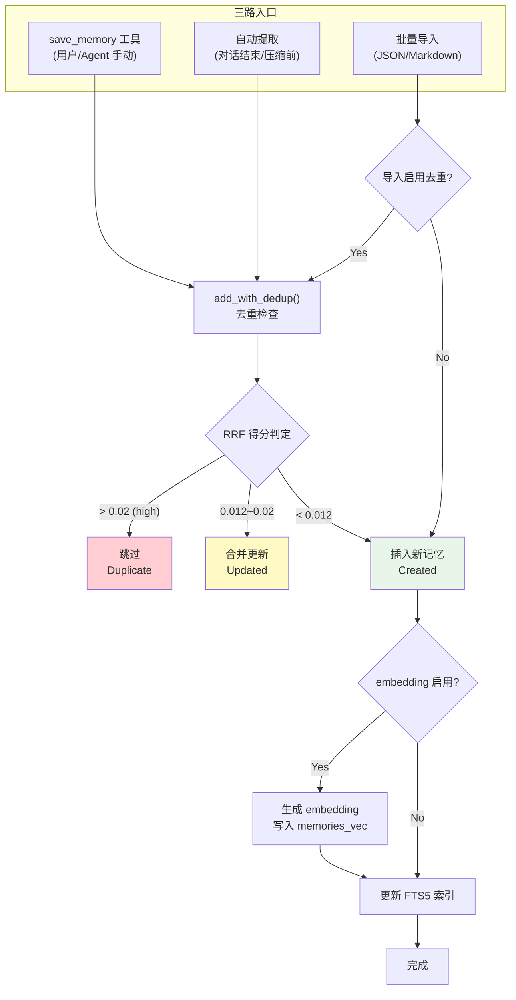
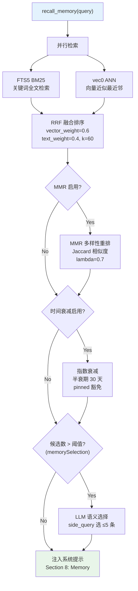
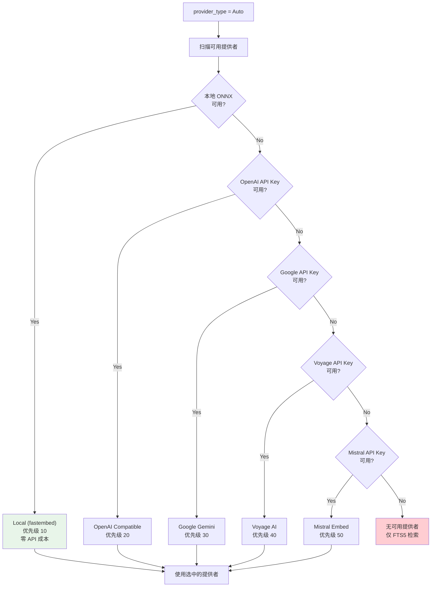

# 记忆系统架构
> 返回 [文档索引](../README.md) | 更新时间：2026-04-05

## 概述

记忆系统基于 **SQLite + FTS5 + sqlite-vec** 构建混合检索引擎，为 AI 助手提供跨会话的长期记忆能力。支持关键词全文检索与向量近似最近邻（ANN）检索的融合排序，通过 RRF（Reciprocal Rank Fusion）算法合并两路结果。记忆可由用户手动保存、Agent 自动提取，或通过文件批量导入。

## 数据模型

### MemoryEntry

| 字段 | 类型 | 说明 |
|------|------|------|
| `id` | `i64` | 自增主键 |
| `memory_type` | `MemoryType` | 记忆类型：`User`（用户信息）/ `Feedback`（偏好与反馈）/ `Project`（项目上下文）/ `Reference`（参考资料） |
| `scope` | `MemoryScope` | 作用域：`Global`（全局共享）/ `Agent { id }`（特定 Agent 私有） |
| `content` | `String` | 记忆内容文本 |
| `tags` | `Vec<String>` | 标签列表，JSON 序列化存储 |
| `source` | `String` | 来源：`"user"`（手动保存）/ `"auto"`（Agent 自动提取）/ `"import"`（批量导入） |
| `source_session_id` | `Option<String>` | 来源会话 ID |
| `pinned` | `bool` | 是否置顶（置顶记忆始终优先注入系统提示，时间衰减豁免） |
| `attachment_path` | `Option<String>` | 附件文件绝对路径（存储于 `~/.opencomputer/memory_attachments/`） |
| `attachment_mime` | `Option<String>` | 附件 MIME 类型（如 `image/jpeg`、`audio/mpeg`） |
| `created_at` | `String` | 创建时间 |
| `updated_at` | `String` | 更新时间 |
| `relevance_score` | `Option<f32>` | 检索时填充的相关性得分，不持久化 |

## 存储后端

### SQLite 表结构

**主表 `memories`**：

```sql
CREATE TABLE memories (
    id INTEGER PRIMARY KEY AUTOINCREMENT,
    memory_type TEXT NOT NULL DEFAULT 'user',
    scope_type TEXT NOT NULL DEFAULT 'global',
    scope_agent_id TEXT,
    content TEXT NOT NULL,
    tags TEXT NOT NULL DEFAULT '[]',
    source TEXT NOT NULL DEFAULT 'user',
    source_session_id TEXT,
    embedding BLOB,
    pinned INTEGER NOT NULL DEFAULT 0,
    created_at TEXT NOT NULL,
    updated_at TEXT NOT NULL
);
```

**索引**：
- `idx_memories_pinned` — `(pinned DESC, updated_at DESC)`，置顶记忆优先
- `idx_memories_scope` — `(scope_type, scope_agent_id)`，按作用域过滤
- `idx_memories_type` — `(memory_type)`，按类型过滤
- `idx_memories_updated` — `(updated_at DESC)`，按更新时间排序

**FTS5 全文索引 `memories_fts`**：

```sql
CREATE VIRTUAL TABLE memories_fts USING fts5(
    content, tags,
    content='memories',
    content_rowid='id',
    tokenize='unicode61'
);
```

通过 `AFTER INSERT / UPDATE / DELETE` 触发器自动与主表保持同步。

**向量表 `memories_vec`**：

使用 sqlite-vec 扩展创建的 `vec0` 虚拟表，存储 `float[N]` 维度的 embedding 向量，支持 ANN（近似最近邻）检索。维度 N 由当前 embedding 提供者决定。

**Embedding 缓存表 `embedding_cache`**：

```sql
CREATE TABLE embedding_cache (
    hash TEXT NOT NULL,
    provider TEXT NOT NULL,
    model TEXT NOT NULL,
    embedding BLOB NOT NULL,
    dimensions INTEGER NOT NULL,
    created_at TEXT NOT NULL DEFAULT (datetime('now')),
    PRIMARY KEY (hash, provider, model)
);
```

按内容哈希 + 提供者 + 模型名做联合主键，避免重复计算。超过 `max_entries`（默认 10000）时自动清理最旧条目。

### 并发模型

- **1 个写连接**（`Mutex<Connection>`）：独占写入，同时作为读连接的 fallback
- **4 个读连接**（`Vec<Mutex<Connection>>`，`READ_POOL_SIZE = 4`）：并发只读查询
- **WAL 模式**：读写互不阻塞
- **Round-robin + fallback**：读请求通过 `AtomicUsize` 轮询分配到读连接池，锁竞争时退化到写连接

## 三路创建

### 创建流程总览



### 1. save_memory 工具 → `add_with_dedup()`

用户或 Agent 通过 `save_memory` 工具显式保存记忆，自动执行去重检查：

| RRF 得分范围 | 行为 |
|-------------|------|
| `> threshold_high`（默认 0.02） | **跳过** — 判定为重复，返回 `Duplicate { existing_id, score }` |
| `threshold_merge..threshold_high`（默认 0.012..0.02） | **合并** — 更新已有记忆的内容，返回 `Updated { id }` |
| `< threshold_merge` | **插入** — 创建新记忆，返回 `Created { id }` |

### 2. 自动提取

Agent 在以下时机自动提取记忆（inline 执行，非 `tokio::spawn`）：

- **Tier 3 压缩前**（`flush_before_compact = true`）：在 LLM 摘要压缩对话历史之前，先提取有价值的记忆
- **对话结束后**：每轮对话结束时触发

自动提取特性：
- 复用 `side_query` 缓存共享，降低 LLM 调用成本
- 频率上限：每会话最多 `max_extractions_per_session` 次（默认 5）
- 最小轮数门槛：`extract_min_turns`（默认 3 轮）后才开始提取
- **互斥保护**：检测到当前轮次已调用 `save_memory` / `update_core_memory` 工具时，跳过自动提取

### 3. 导入

支持两种格式的批量导入：

- **JSON 格式**：`NewMemory` 数组的 JSON 文件
- **Markdown 格式**：按 section 分隔的 Markdown 文件

导入时可选启用去重（`dedup` 参数），返回 `ImportResult { created, skipped_duplicate, failed, errors }`。

## 混合检索引擎

### 检索流水线总览



### 双路并行检索

1. **FTS5 BM25 关键词检索**：基于 `memories_fts` 表的全文匹配，返回按 BM25 得分排序的结果
2. **vec0 ANN 向量检索**：基于 `memories_vec` 表的近似最近邻检索，需要 embedding 提供者已配置

两路检索并行执行，结果通过 RRF 算法融合。

### RRF 融合排序

```
rrf_score = vector_weight / (k + rank_vec) + text_weight / (k + rank_fts)
```

- `vector_weight`：向量检索权重（默认 0.6）
- `text_weight`：关键词检索权重（默认 0.4）
- `k`：RRF 常数（默认 60），k 越大各排名权重越均匀

### 可选 MMR 多样性重排

启用后（默认开启），对 RRF 融合结果进行 MMR（Maximal Marginal Relevance）重排，减少返回结果中的冗余：

- 使用 **Jaccard 系数**计算文本间相似度
- `lambda` 参数控制相关性与多样性的权衡：0 = 最大多样性，1 = 最大相关性（默认 0.7）

### 可选时间衰减

启用后（默认关闭），对检索得分施加指数时间衰减：

- 半衰期：`half_life_days`（默认 30 天），超过半衰期后得分减半
- **pinned 记忆豁免**：置顶记忆不受时间衰减影响，始终保持原始得分

## Embedding 提供者

### 提供者类型

| 类型 | 说明 | 示例 |
|------|------|------|
| `Local` (fastembed) | 本地 ONNX 模型，零 API 成本 | bge-small-en, multilingual-e5-small |
| `OpenaiCompatible` | OpenAI `/v1/embeddings` 兼容 API | OpenAI, Jina, Cohere, SiliconFlow, Voyage, Mistral, Ollama |
| `Google` | Google Gemini Embedding API（独立格式） | gemini-embedding-001 |
| `Auto` | 自动选择最佳可用提供者 | 优先本地，退化到 API |

### 自动选择流程



### 自动选择优先级

当 `provider_type = Auto` 时，按以下优先级选择：

1. **Local**（优先级 10）— 本地 ONNX 模型，零成本
2. **OpenAI**（优先级 20）— 复用 LLM API Key
3. **Google**（优先级 30）— Gemini embedding
4. **Voyage**（优先级 40）— Voyage AI
5. **Mistral**（优先级 50）— Mistral embed

### 本地模型

| 模型 ID | 名称 | 维度 | 大小 | 最低内存 | 语言 |
|---------|------|------|------|----------|------|
| `multilingual-e5-small` | Multilingual E5 Small | 384d | 90MB | 8GB | 多语言 |
| `bge-small-zh-v1.5` | BGE Small Chinese v1.5 | 384d | 33MB | 4GB | 中文 |
| `bge-small-en-v1.5` | BGE Small English v1.5 | 384d | 33MB | 4GB | 英文 |
| `bge-large-en-v1.5` | BGE Large English v1.5 | 1024d | 335MB | 16GB | 英文 |

### API 预设模板

| 预设 | 提供者类型 | 默认模型 | 默认维度 |
|------|-----------|---------|---------|
| OpenAI | OpenaiCompatible | text-embedding-3-small | 1536 |
| Google Gemini | Google | gemini-embedding-001 | 768 |
| Jina AI | OpenaiCompatible | jina-embeddings-v3 | 1024 |
| Cohere | OpenaiCompatible | embed-multilingual-v3.0 | 1024 |
| SiliconFlow | OpenaiCompatible | BAAI/bge-m3 | 1024 |
| Voyage AI | OpenaiCompatible | voyage-3 | 1024 |
| Mistral | OpenaiCompatible | mistral-embed | 1024 |
| Ollama | OpenaiCompatible | nomic-embed-text | 768 |

### 多模态支持

- **Gemini** 支持图片和音频的 embedding（通过 `embed_multimodal()` 接口）
- 其他提供者 fallback 为文本描述的 embedding（使用 `label` 字段）
- 支持的图片格式：jpg, jpeg, png, webp, gif, heic, heif
- 支持的音频格式：mp3, wav, ogg, opus, m4a, aac, flac
- 最大文件大小：`max_file_bytes`（默认 10MB）

## LLM 语义选择

当候选记忆数量超过阈值（`threshold`，默认 8 条）时，通过 `side_query` 调用 LLM 从候选列表中选择最相关的记忆：

- 最多选择 `max_selected` 条（默认 5）
- 选择在 compaction 后、cache 快照前执行，确保精简后的系统提示被缓存
- **opt-in 配置**：`memorySelection.enabled = true` 启用
- 失败时退化为全量注入（无记忆丢失）

选择 prompt 格式：向 LLM 提供用户当前消息 + 候选记忆列表（id: preview），要求返回 JSON 数组 `[3, 7, 1]`。

## 系统提示注入

记忆通过 `format_prompt_summary()` 格式化为 Markdown 并注入系统提示的 Section 8：

```markdown
# Memory

## About the User
- ★ [pinned memory content]
- [regular memory content]

## Preferences & Feedback
- ...

## Project Context
- ...

## References
- ...
```

特性：
- 按类型分组（User → Feedback → Project → Reference），每组内 pinned 优先
- 字符预算控制，超出时追加 `[... truncated ...]`
- **Prompt 注入防护**：`sanitize_for_prompt()` 检测并过滤可疑指令注入模式（如 "ignore previous instructions"），转义特殊 LLM token

## 导入/导出

- **JSON 导出/导入**：`NewMemory` 数组格式，保留完整字段
- **Markdown 导出**：按 scope 和 type 分 section 输出人类可读格式
- 导入支持可选去重（复用 `add_with_dedup()` 逻辑）

## 配置项

| 配置路径 | 字段 | 默认值 | 说明 |
|---------|------|--------|------|
| `embedding` | `enabled` | `false` | 启用向量检索 |
| `embedding` | `providerType` | `"openai-compatible"` | 提供者类型 |
| `embedding` | `apiBaseUrl` / `apiKey` / `apiModel` / `apiDimensions` | — | API 模式配置 |
| `embedding` | `localModelId` | — | 本地模型 ID |
| `hybridSearch` | `vectorWeight` | `0.6` | 向量检索权重 |
| `hybridSearch` | `textWeight` | `0.4` | 关键词检索权重 |
| `hybridSearch` | `rrfK` | `60.0` | RRF 常数 k |
| `mmr` | `enabled` | `true` | 启用 MMR 多样性重排 |
| `mmr` | `lambda` | `0.7` | MMR lambda（0=多样性，1=相关性） |
| `temporalDecay` | `enabled` | `false` | 启用时间衰减 |
| `temporalDecay` | `halfLifeDays` | `30.0` | 半衰期（天） |
| `memorySelection` | `enabled` | `false` | 启用 LLM 语义选择 |
| `memorySelection` | `threshold` | `8` | 触发选择的候选数阈值 |
| `memorySelection` | `maxSelected` | `5` | 最大选择数 |
| `dedup` | `thresholdHigh` | `0.02` | 去重跳过阈值 |
| `dedup` | `thresholdMerge` | `0.012` | 去重合并阈值 |
| `multimodal` | `enabled` | `false` | 启用多模态 embedding |
| `multimodal` | `modalities` | `["image", "audio"]` | 支持的模态 |
| `multimodal` | `maxFileBytes` | `10485760` (10MB) | 最大附件大小 |
| `embeddingCache` | `enabled` | `true` | 启用 embedding 缓存 |
| `embeddingCache` | `maxEntries` | `10000` | 最大缓存条目数 |
| `memoryExtract` | `autoExtract` | `true` | 启用自动提取 |
| `memoryExtract` | `extractMinTurns` | `3` | 最小轮数门槛 |
| `memoryExtract` | `flushBeforeCompact` | `true` | 压缩前提取 |
| `memoryExtract` | `maxExtractionsPerSession` | `5` | 每会话最大提取次数 |

## 关键源文件

| 文件 | 说明 |
|------|------|
| `src-tauri/src/memory/mod.rs` | 模块入口与 re-exports |
| `src-tauri/src/memory/types.rs` | 数据结构定义（MemoryEntry, MemoryType, MemoryScope, 各配置类型） |
| `src-tauri/src/memory/traits.rs` | MemoryBackend trait + EmbeddingProvider trait |
| `src-tauri/src/memory/sqlite/backend.rs` | SQLite 后端实现（表创建、连接池、WAL） |
| `src-tauri/src/memory/sqlite/trait_impl.rs` | MemoryBackend trait 的 SQLite 实现 |
| `src-tauri/src/memory/sqlite/prompt.rs` | 系统提示注入格式化 + prompt 注入防护 |
| `src-tauri/src/memory/embedding/mod.rs` | Embedding 模块入口 |
| `src-tauri/src/memory/embedding/config.rs` | Embedding 配置、预设模板、本地模型定义 |
| `src-tauri/src/memory/embedding/local_provider.rs` | 本地 ONNX 模型提供者（fastembed-rs） |
| `src-tauri/src/memory/embedding/api_provider.rs` | API embedding 提供者（OpenAI 兼容 + Google） |
| `src-tauri/src/memory/embedding/fallback_provider.rs` | Fallback 提供者（主备切换） |
| `src-tauri/src/memory/embedding/factory.rs` | Embedding 提供者工厂（Auto 模式选择逻辑） |
| `src-tauri/src/memory/mmr.rs` | MMR 多样性重排实现 |
| `src-tauri/src/memory/selection.rs` | LLM 语义选择（prompt 构建 + 响应解析） |
| `src-tauri/src/memory/import.rs` | 批量导入/导出（JSON + Markdown） |
| `src-tauri/src/memory/helpers.rs` | 辅助函数（加载配置等） |
| `src-tauri/src/memory_extract.rs` | 自动记忆提取逻辑 |
