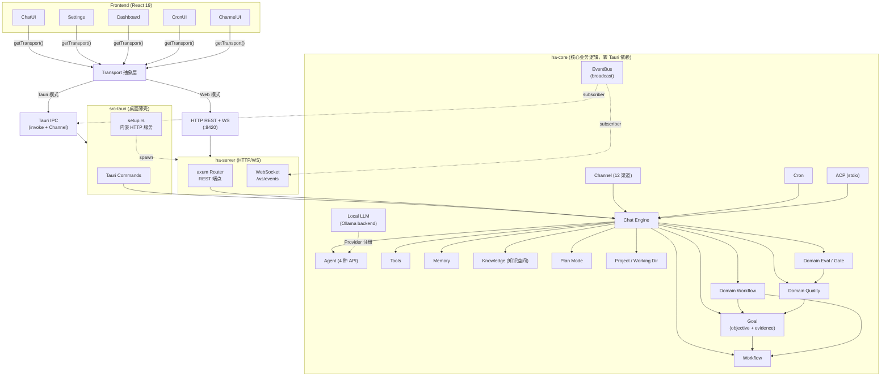
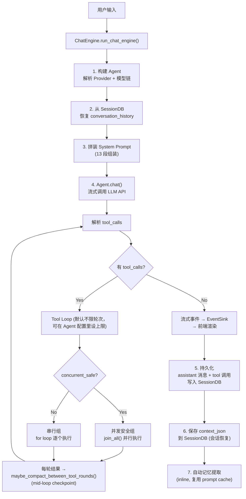
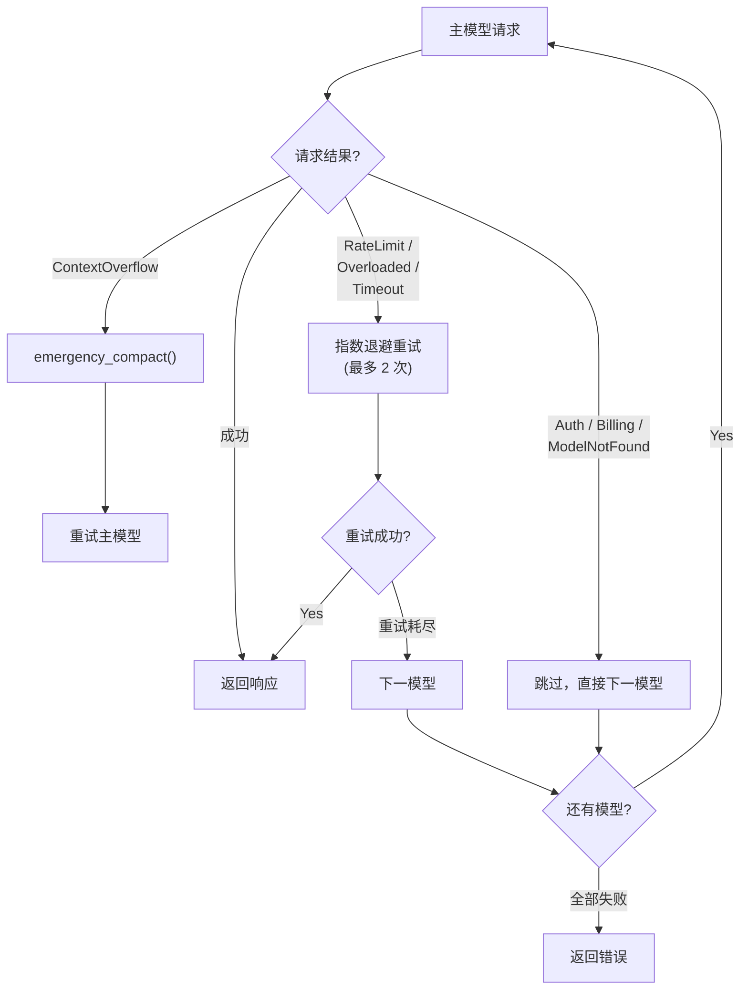
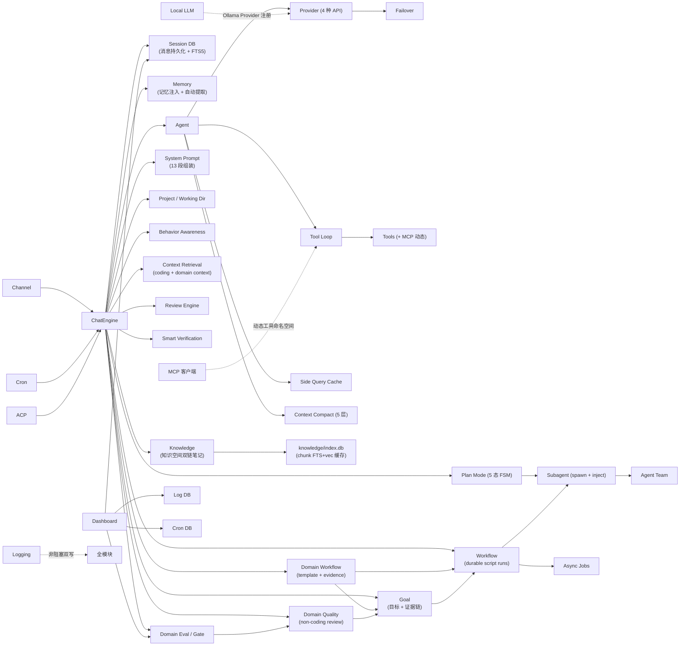

# Hope Agent 系统架构总览

> 返回 [文档索引](../README.md) | 更新时间：2026-07-21

## 系统定位

基于 Rust 的本地 AI 助手，支持三种运行模式：桌面 GUI（Tauri）、HTTP/WS 守护进程、ACP stdio。核心设计目标：**一切复杂逻辑在 ha-core**（零 Tauri 依赖），前端只负责展示和交互，Tauri 和 HTTP 服务都是薄壳。

> 三层架构详细设计见 [前后端分离架构](backend-separation.md)

## 技术栈

| 层 | 技术 |
|---|---|
| 前端 | React 19 + TypeScript, Vite 8, Tailwind CSS v4, shadcn/ui (Radix UI) |
| 前端通信 | Transport 抽象层（Tauri IPC 或 HTTP/WebSocket 双模式） |
| 桌面 | Tauri 2（薄壳，调用 ha-core） |
| 服务器 | axum 0.8（HTTP REST API + WebSocket 流式） |
| 核心 | ha-core（Rust, tokio, reqwest，零 Tauri 依赖） |
| 渲染 | Streamdown + Shiki + KaTeX + Mermaid |
| 存储 | SQLite (WAL) + FTS5 + vec0 向量扩展 |
| 多语言 | i18next (12 种语言) |

## 架构全景

> Tauri 命令、HTTP 端点、工具数量是会增长的活数据；以 [API 参考](api-reference.md) 为单一真相源，其它文档不重复维护精确数字。

## 核心数据流

### 用户消息 → 模型响应（主流程）

### Failover 降级链

## 模块依赖关系

## 项目（Project）与会话工作目录

侧边栏里「会话」和「项目」是并列的一等节点。项目是一组会话的容器，同时承载一份持久的项目级上下文——工作目录、项目记忆、项目指令。

一个项目绑定一个工作目录，该目录下的会话默认都在这里读写文件。上传到项目的文件直接落在这个真实目录里，没有单独的文件表，也不做文本提取注入——模型通过工作目录的顶层文件清单加 `read` 工具按需感知。改动项目工作目录会立即对该项目下未单独设置目录的会话生效（延迟解析，不是创建时固化）。

项目记忆的优先级高于 Agent 和全局记忆，预算紧张时最先保留；属于项目的会话默认把自动提取的记忆写进项目作用域。

删除项目会连带删掉它自建的工作目录和项目记忆，但绝不会碰用户显式指定的外部目录。

详见 [Project 系统](project.md)。

## 知识空间（Knowledge Base）

「知识空间」是与聊天、Project 平级的第四种知识容器：一个本地优先、AI 原生的双链笔记子系统。笔记就是磁盘上真实的 `.md` 文件（唯一真相源），可以直接绑定现成的 Obsidian / Logseq vault（默认只读，可显式放开写），文件层面与它们非破坏性共存。`knowledge/index.db` 只是检索用的缓存，删掉能从 `.md` 全量重建。

和 Obsidian / Logseq「AI 是插件」的形态相反，这里 AI 是一等公民：agent 通过 `note_*` 工具对笔记有完整的增删改查、双链、图谱、检索能力，还能把零散记忆提炼成结构化笔记。访问默认拒绝、需显式 attach，无痕会话零访问。检索走独立的全文加向量混合链路，和记忆系统物理隔离、互不干扰。

详见 [知识空间（Knowledge Base）](knowledge-base.md)。

## 本地模型加载

`local_llm/` 模块把本地 Ollama 当作一个 Provider 接入（走 Ollama 的 OpenAI 兼容端点）。它内置一份模型目录，按机器可用内存或显存预留出一定余量后，从大到小推荐能跑得动的模型；Ollama 进程由用户自己管理，app 不接管其生命周期。安装、模型拉取、Embedding 下载都走后台任务表异步执行。详见 [本地模型加载](local-model-loading.md)。

## 存储架构

| 数据库 | 路径 | 用途 |
|--------|------|------|
| sessions.db | `~/.hope-agent/sessions.db` | 会话、消息、Goal/Event/Link、WorkflowRun/Op/Event、Subagent/ACP/Team 运行记录 |
| memory.db | `~/.hope-agent/memory.db` | 记忆条目、Dreaming claim、情节记忆，配 FTS5 + vec0 索引与 embedding 缓存（**Core Memory 正文不在这里**，见下行） |
| Core Memory `.md` | `~/.hope-agent/memory/`、`agents/{id}/memory/`、`projects/{id}/memory/` | 全局 / Agent / 项目三个作用域各一份 Core Memory：`MEMORY.md` 索引 + `topics/*.md` 主题笔记，磁盘 `.md` 为唯一真相源（不入库） |
| knowledge/index.db | `~/.hope-agent/knowledge/index.db` | 知识空间 chunk 索引（FTS5 + vec0），可重建缓存；笔记 `.md` 真相在 `knowledge/{id}/notes/` 或外部 vault，registry 在 sessions.db |
| logs.db | `~/.hope-agent/logs.db` | 结构化日志（可查询/过滤） |
| cron.db | `~/.hope-agent/cron.db` | 定时任务 + 执行日志 |
| background_jobs.db | `~/.hope-agent/background_jobs.db` | 统一后台任务缓存（exec / web_search / image_generate / audio_generate 后台化 + subagent/group 投影） |
| local_model_jobs.db | `~/.hope-agent/local_model_jobs.db` | 本地模型安装 / 拉取后台任务 |
| local_llm_library_cache.db | `~/.hope-agent/local_llm_library_cache.db` | Ollama Library 搜索 / Tag 元数据缓存 |
| recap/recap.db | `~/.hope-agent/recap/recap.db` | 会话深度复盘缓存 |
| canvas/canvas.db | `~/.hope-agent/canvas/canvas.db` | Canvas 画布数据 |
| config.json | `~/.hope-agent/config.json` | Provider 配置、模型链、全局设置 |
| agent.json | `~/.hope-agent/agents/{id}/agent.json` | 每 Agent 独立配置 |
| projects/ | `~/.hope-agent/projects/{id}/` | 项目目录：`workspace/` 默认工作区（真实文件）+ `memory/` 项目记忆（`.md`）。删项目即 `rm -rf` 整个目录，记忆随之删除 |
| credentials/ | `~/.hope-agent/credentials/` | OAuth token、MCP server 凭据（0600 原子写） |

所有路径由 `paths.rs` 集中管理，统一挂在 `~/.hope-agent/` 下。配置的读写都经过一层带缓存的统一入口，避免各处手动加载再保存造成竞争（详见 [配置系统](config-system.md)）。

## 文档导航

完整的模块清单与逐篇说明见 [技术文档索引](../README.md)；本篇只负责讲清系统整体如何运转，索引不在此重复维护。
