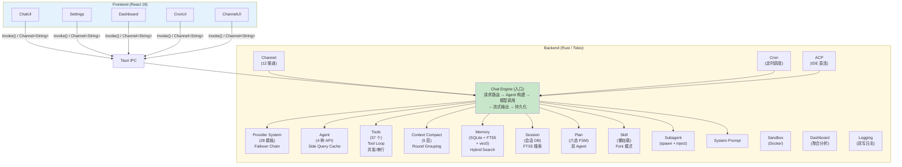
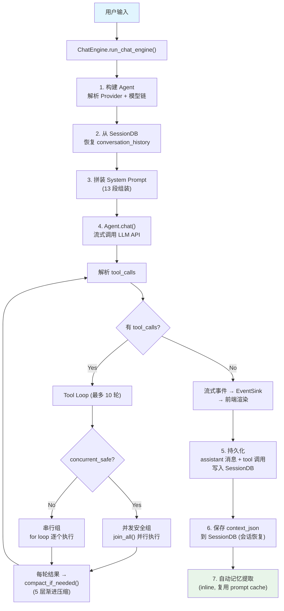
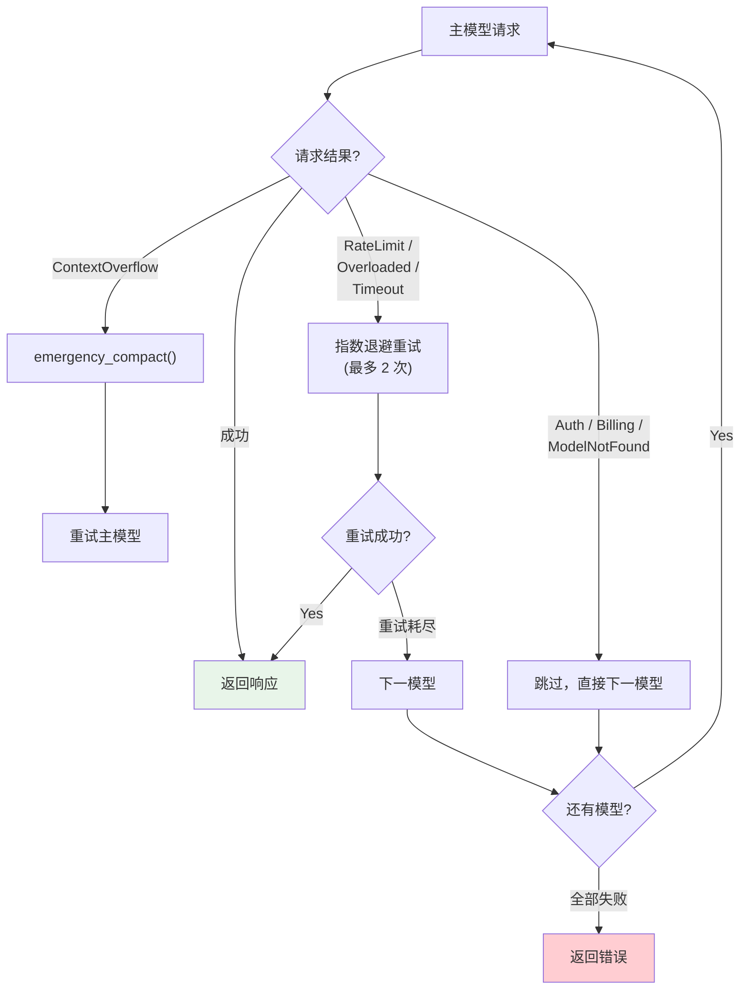
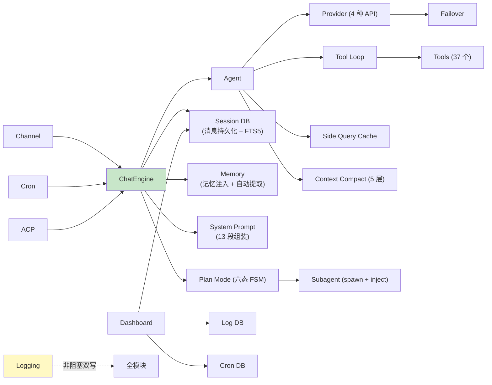

# OpenComputer 系统架构总览

> 返回 [文档索引](../README.md) | 更新时间：2026-04-05

## 系统定位

基于 Tauri 2 + React 19 + Rust 的本地 AI 助手桌面应用。核心设计目标：**一切复杂逻辑在 Rust 后端**，前端只负责展示和交互。

## 技术栈

| 层 | 技术 |
|---|---|
| 前端 | React 19 + TypeScript, Vite 8, Tailwind CSS v4, shadcn/ui (Radix UI) |
| 桌面 | Tauri 2 (IPC via `invoke()`, 流式输出 via `Channel<String>`) |
| 后端 | Rust, tokio, reqwest |
| 渲染 | Streamdown + Shiki + KaTeX + Mermaid |
| 存储 | SQLite (WAL) + FTS5 + vec0 向量扩展 |
| 多语言 | i18next (12 种语言) |

## 架构全景

## 核心数据流

### 用户消息 → 模型响应（主流程）

### Failover 降级链

## 模块依赖关系

## 存储架构

| 数据库 | 路径 | 用途 |
|--------|------|------|
| sessions.db | `~/.opencomputer/sessions.db` | 会话、消息、Subagent/ACP 运行记录 |
| memory.db | `~/.opencomputer/memory.db` | 记忆条目 + FTS5 + vec0 向量 + embedding cache |
| logs.db | `~/.opencomputer/logs.db` | 结构化日志（可查询/过滤） |
| cron.db | `~/.opencomputer/cron.db` | 定时任务 + 执行日志 |
| config.json | `~/.opencomputer/config.json` | Provider 配置、模型链、全局设置 |
| agent.json | `~/.opencomputer/agents/{id}/agent.json` | 每 Agent 独立配置 |

所有路径通过 `paths.rs` 集中管理，统一在 `~/.opencomputer/` 目录下。

## 文档导航

各模块详细架构见对应文档：

| 模块 | 文档 |
|------|------|
| 对话编排 & 流式输出 | [Chat Engine](chat-engine.md) |
| Provider & Failover | [Provider 系统](provider-system.md) |
| 提示词 13 段组装 | [提示词系统](prompt-system.md) |
| 工具定义/执行/权限 | [工具系统](tool-system.md) |
| 上下文压缩 5 层 | [上下文压缩](context-compact.md) |
| 会话 & 消息持久化 | [Session 系统](session.md) |
| 记忆检索 & 提取 | [记忆系统](memory.md) |
| Plan 六态状态机 | [Plan Mode](plan-mode.md) |
| 技能发现 & 隔离 | [技能系统](skill-system.md) |
| IM 渠道插件 | [IM Channel](im-channel.md) |
| 图像生成 | [图像生成](image-generation.md) |
| 斜杠命令 | [斜杠命令](slash-commands.md) |
| Side Query 缓存 | [Side Query](side-query.md) |
| 子 Agent 系统 | [Subagent](subagent.md) |
| 定时任务 | [Cron 调度](cron.md) |
| Docker 沙箱 | [Docker Sandbox](sandbox.md) |
| 数据大盘 | [Dashboard](dashboard.md) |
| 日志系统 | [Logging](logging.md) |
| ACP IDE 直连 | [ACP 协议](acp.md) |
