# OpenComputer Plan Mode 架构文档

> 返回 [文档索引](../README.md)
>
> 更新时间：2026-03-29

## 目录

- [概述](#概述)（含系统架构总览图）
- [核心概念](#核心概念)
- [六态状态机](#六态状态机)（含状态流转图）
- [后端架构](#后端架构)
  - [Plan 状态管理](#plan-状态管理)（含数据结构）
  - [工具限制与路径权限](#工具限制与路径权限)（含过滤流程图）
  - [系统提示词注入](#系统提示词注入)（5 阶段规划流程）
  - [Plan 文件持久化](#plan-文件持久化)（项目本地化存储）
  - [Markdown Checklist 解析](#markdown-checklist-解析)
  - [交互式问答（ask_user_question）](#交互式问答ask_user_question)
  - [计划提交（submit_plan）](#计划提交submit_plan)
  - [步骤进度追踪（update_plan_step）](#步骤进度追踪update_plan_step)（含事件流图）
  - [执行中计划修改（amend_plan）](#执行中计划修改amend_plan)
  - [Git Checkpoint 回滚](#git-checkpoint-回滚)
  - [计划版本管理](#计划版本管理)
  - [Planning/Executing 独立模型](#planningexecuting-独立模型)
  - [子 Agent 安全继承](#子-agent-安全继承)
- [斜杠命令 /plan](#斜杠命令-plan)（含命令分发图）
- [Tauri 命令一览](#tauri-命令一览)
- [前端架构](#前端架构)
  - [usePlanMode Hook](#useplanmode-hook)（含状态流图）
  - [ChatInput 集成](#chatinput-集成)（含 UI 示意图）
  - [PlanCardBlock 摘要卡片](#plancardblock-摘要卡片)
  - [AskUserQuestionBlock 交互问答](#planquestionblock-交互问答)
  - [PlanPanel 右侧面板](#planpanel-右侧面板)（含 UI 示意图）
  - [planParser 解析器](#planparser-解析器)
- [完整交互流程](#完整交互流程)（含全链路时序图）
- [DB Schema](#db-schema)
- [事件系统](#事件系统)
- [安全设计](#安全设计)
- [与 Claude Code / OpenCode 对比](#与-claude-code--opencode-对比)
- [文件清单](#文件清单)

---

## 概述

Plan Mode 是 OpenComputer 的可视化交互计划模式，实现六态状态机驱动的完整规划-审查-执行工作流。

**双模式架构**：Planning 阶段支持两种模式（通过 `config.json` 的 `plan_subagent` 字段切换）：
- **内联模式**（默认，`plan_subagent: false`）：主 Agent 内联制定计划，上下文连续
- **子 Agent 模式**（`plan_subagent: true`）：独立子 Agent 负责探索信息和制定计划，主 Agent 上下文不被规划阶段的探索细节占用，执行阶段更干净

两种模式共用同一套 5 阶段规划流程（深度探索→需求澄清→架构设计→计划编写→审查优化）和以逻辑单元为中心的富细节计划格式。用户可在 Review 阶段审查计划、请求修改、浏览版本历史。批准后进入 Executing 阶段，实时追踪步骤进度，支持暂停/恢复、执行中修改计划、Git Checkpoint 一键回滚。

**核心设计原则：**

1. **零侵入集成**：复用现有 `denied_tools` + `extra_system_context` + 条件工具注入机制，不改变核心 chat 流程
2. **可视化优先**：ChatInput 工具栏按钮（主入口）+ `/plan` 斜杠命令（辅助入口），PlanCardBlock 内嵌卡片 + PlanPanel 右侧面板双视图
3. **交互式规划**：`ask_user_question` 结构化问答 + `submit_plan` 计划提交，LLM 与用户迭代讨论
4. **实时追踪**：`update_plan_step` + `amend_plan` 工具 + Tauri 全局事件驱动前端 UI 实时更新
5. **安全可靠**：细粒度路径权限 + 子 Agent 限制继承 + Git Checkpoint 回滚 + 步骤进度 DB 持久化
6. **会话级隔离**：Plan Mode 状态绑定到 session，不影响其他会话

### 系统架构总览

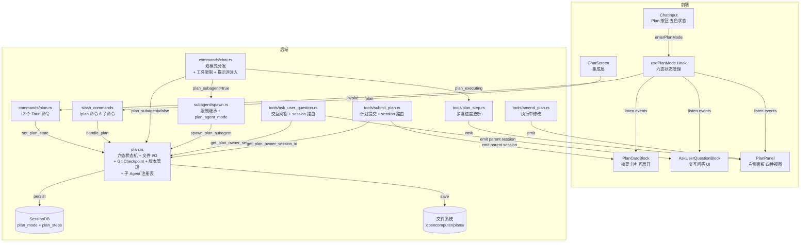

---

## 核心概念

| 概念 | 说明 |
|------|------|
| **PlanModeState** | 六态枚举：Off / Planning / Review / Executing / Paused / Completed |
| **PlanStep** | 计划中的单个步骤，包含 index、phase、title、description、status、duration |
| **PlanMeta** | 计划元数据，包含 state、steps、file_path、version、checkpoint_ref、paused_at_step 等 |
| **AskUserQuestion** | 结构化问答（独立模块 `ask_user/`），包含选项、多选、自定义输入、recommended 标记、template 分类 |
| **ask_user_question** | 通用交互问答工具（不限于 Plan Mode），LLM 发起结构化提问，前端渲染可视化卡片。详见 [ask-user 架构文档](ask-user.md) |
| **submit_plan** | Planning 阶段的计划提交工具，触发 Planning→Review 状态转换 |
| **update_plan_step** | Executing 阶段的步骤进度工具，LLM 实时报告执行进度 |
| **amend_plan** | Executing/Paused 阶段的计划修改工具，支持插入/删除/更新步骤 |
| **Plan File** | Markdown 格式的计划文件，项目本地存储于 `.opencomputer/plans/` |
| **Git Checkpoint** | 执行前自动创建 git 分支快照，失败时可一键回滚 |
| **plan_subagent** | 全局设置（`config.json`），控制 Planning 阶段使用内联模式（false，默认）还是子 Agent 模式（true） |
| **PLAN_SUBAGENT_SESSIONS** | 子 Agent 模式的会话注册表，将子 Agent 的 session_id 映射到父 session_id，确保事件正确路由 |

---

## 六态状态机

Plan Mode 有六个状态，按 session 隔离：

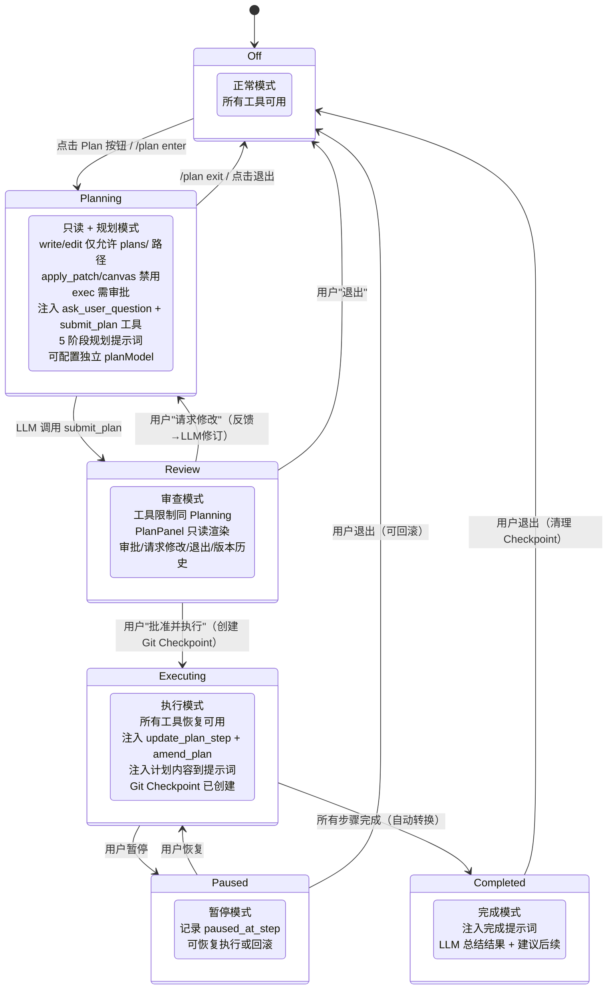

### 各状态的行为差异

| 维度 | Off | Planning | Review | Executing | Paused | Completed |
|------|-----|----------|--------|-----------|--------|-----------|
| write/edit | 可用 | **仅 plans/ 路径** | **仅 plans/ 路径** | 可用 | 可用 | 可用 |
| apply_patch/canvas | 可用 | **禁用** | **禁用** | 可用 | 可用 | 可用 |
| exec 工具 | 按权限 | **强制审批** | **强制审批** | 按权限 | 按权限 | 按权限 |
| ask_user_question | 不注入 | **注入** | 不注入 | 不注入 | 不注入 | 不注入 |
| submit_plan | 不注入 | **注入** | 不注入 | 不注入 | 不注入 | 不注入 |
| update_plan_step | 不注入 | 不注入 | 不注入 | **注入** | 不注入 | 不注入 |
| amend_plan | 不注入 | 不注入 | 不注入 | **注入** | **注入** | 不注入 |
| 系统提示词 | 无额外 | 5 阶段规划指令 | 计划上下文 | 计划内容 + 执行指令 | 计划 + 暂停指令 | 完成总结指令 |
| 模型 | 主模型 | **planModel 覆盖** | 主模型 | 主模型 | 主模型 | 主模型 |
| ChatInput | 灰色按钮 | 蓝色高亮 | 紫色 | 绿色 + 进度% | 黄色 | 绿色 |

---

## 后端架构

### Plan 状态管理

**文件**：`crates/oc-core/src/plan/`

使用全局 `OnceLock<Arc<RwLock<HashMap<String, PlanMeta>>>>` 管理 per-session 状态：

```rust
// 六态枚举
pub enum PlanModeState { Off, Planning, Review, Executing, Paused, Completed }

// 步骤状态
pub enum PlanStepStatus { Pending, InProgress, Completed, Skipped, Failed }
  // is_terminal() → Completed | Skipped | Failed

// 核心元数据
pub struct PlanMeta {
    pub session_id: String,
    pub title: Option<String>,
    pub file_path: String,
    pub state: PlanModeState,
    pub steps: Vec<PlanStep>,
    pub created_at: String,
    pub updated_at: String,
    pub paused_at_step: Option<usize>,    // 暂停时记录步骤位置
    pub version: u32,                      // 版本计数器
    pub checkpoint_ref: Option<String>,    // Git 分支名
}

pub struct PlanStep {
    pub index: usize,
    pub phase: String,        // "Phase 1: 分析"
    pub title: String,        // "读取 config 文件"
    pub description: String,  // 步骤详细描述
    pub status: PlanStepStatus,
    pub duration_ms: Option<u64>,
}

// 交互问答（定义在独立模块 ask_user/types.rs，不依赖 plan）
// 详见 ask-user.md

pub struct PlanVersionInfo {
    pub version: u32,
    pub file_path: String,
    pub modified_at: String,
    pub is_current: bool,
}
```

**公共 API**：

```rust
// 状态管理
pub async fn get_plan_state(session_id: &str) -> PlanModeState
pub async fn set_plan_state(session_id: &str, state: PlanModeState)
pub async fn get_plan_meta(session_id: &str) -> Option<PlanMeta>
pub async fn update_plan_steps(session_id: &str, steps: Vec<PlanStep>)
pub async fn update_step_status(session_id: &str, index: usize, status: PlanStepStatus, duration_ms: Option<u64>)
pub async fn restore_from_db(session_id: &str, plan_mode_str: &str)  // 崩溃恢复

// 交互问答（已迁移到独立模块 ask_user/，详见 ask-user.md）
// ask_user::register_ask_user_question / submit_ask_user_question_response / cancel_pending_ask_user_question

// 文件 I/O
pub fn save_plan_file(session_id: &str, content: &str) -> Result<String>
pub fn load_plan_file(session_id: &str) -> Result<Option<String>>
pub fn delete_plan_file(session_id: &str) -> Result<()>
pub fn parse_plan_steps(markdown: &str) -> Vec<PlanStep>

// 版本管理
pub fn list_plan_versions(session_id: &str) -> Result<Vec<PlanVersionInfo>>
pub fn load_plan_version(file_path: &str) -> Result<String>

// Git Checkpoint
pub fn create_git_checkpoint(session_id: &str) -> Option<String>
pub async fn get_checkpoint_ref(session_id: &str) -> Option<String>
pub fn rollback_to_checkpoint(checkpoint_ref: &str) -> Result<String>
pub fn cleanup_checkpoint(checkpoint_ref: &str)

// 路径权限
pub fn is_plan_mode_path_allowed(file_path: &str) -> bool
```

**持久化策略**：三层持久化

| 层 | 存储 | 用途 |
|----|------|------|
| 内存 HashMap | `PLAN_STORE` | 快速访问，per-request 查询 |
| DB `plan_mode` + `plan_steps` 列 | SessionDB | 崩溃恢复，步骤进度持久化（JSON） |
| Plan 文件 | `.opencomputer/plans/*.md` | 计划内容持久化 + 版本历史 |

### 工具限制与路径权限

> 详见 [工具系统架构](tool-system.md) 了解完整的工具权限模型。

**文件**：`src-tauri/src/commands/chat.rs`（桌面）/ `crates/oc-server/src/routes/chat.rs`（HTTP）→ 调用 `crates/oc-core/src/plan/`

```rust
// 常量定义（plan.rs）
pub const PLAN_MODE_DENIED_TOOLS: &[&str] = &["write", "edit", "apply_patch", "canvas"];
pub const PLAN_MODE_ASK_TOOLS: &[&str] = &["exec"];
pub const PLAN_MODE_PATH_AWARE_TOOLS: &[&str] = &["write", "edit"];
```

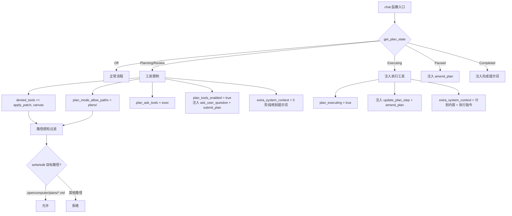

**路径检查函数**（`is_plan_mode_path_allowed`）：
- 允许：`.opencomputer/plans/` 目录下的 `.md` 文件
- 允许：`~/.opencomputer/plans/` 全局目录下的 `.md` 文件
- 拒绝：所有其他路径

### 系统提示词注入

#### Planning 阶段：5 阶段规划流程

```
# Plan Mode Active — 5-Phase Planning Workflow

## Phase 1: Deep Exploration
- 收集相关信息、阅读相关文件
- Launch up to 3 subagent tasks IN PARALLEL to explore different aspects
- 梳理关键要素和依赖关系

## Phase 2: Requirements Clarification
- Use ask_user_question tool to ask structured questions
- Support recommended options, multi_select, template categories

## Phase 3: Design & Architecture
- Consider edge cases, constraints, trade-offs

## Phase 4: Plan Composition
- Use submit_plan tool to submit the final plan
- Plan must be execution-ready, structured by logical units

## Phase 5: Review & Refinement
- User reviews and approves or requests changes
- Support inline comments on plan sections

## Plan Format — 以逻辑单元为中心
### Context (2-3 sentences only)
### Step N: <description>（代码任务可加文件路径）
  - 涉及代码时包含代码片段和文件引用
  - 引用已有内容时标注来源
  - - [ ] sub-tasks for trackable items
### Verification（验证方法：测试命令、手动检查等）

## Restrictions
- CANNOT modify files outside .opencomputer/plans/
- CAN read files, search information, browse the web
- Shell commands (exec) require user approval
```

**子 Agent 模式追加提示**（`PLAN_SUBAGENT_CONTEXT_NOTICE`）：
- 告知 LLM 执行 Agent 无法访问探索历史
- 要求计划自包含所有关键细节（来源引用、前置条件等）

#### Executing 阶段

```
# Executing Plan

Follow the steps below in order.
After completing each step, call update_plan_step to mark progress:
- update_plan_step(step_index=N, status="in_progress") when starting
- update_plan_step(step_index=N, status="completed") when done

If you need to modify the plan during execution, use amend_plan tool:
- amend_plan(action="insert", title="...", after_index=N)
- amend_plan(action="delete", step_index=N)
- amend_plan(action="update", step_index=N, title="...")

## Plan Content
[完整的 Plan Markdown 内容]
```

#### Completed 阶段

```
# Plan Execution Completed

All steps have been executed. Please:
1. Summarize what was accomplished
2. Highlight any steps that failed or were skipped, with reasons
3. Suggest follow-up actions or improvements
4. Note any issues discovered during execution
```

### Plan 文件持久化

**项目本地化存储**：优先存储在项目本地 `.opencomputer/plans/`，非 git 仓库回退到全局 `~/.opencomputer/plans/`。

```
# git 仓库项目
project-root/
└── .opencomputer/
    └── plans/
        ├── plan-a1b2c3-20260328.md          # 当前版本
        ├── plan-a1b2c3-20260328-v1.md       # 历史版本 1
        ├── plan-a1b2c3-20260328-v2.md       # 历史版本 2
        └── ...

# 非 git 项目（回退）
~/.opencomputer/
└── plans/
    └── ...
```

支持 `plansDirectory` 配置项自定义路径。加载时自动查找全局目录兼容旧计划。

**文件格式**：标准 Markdown，无 frontmatter，直接存储 LLM 通过 `submit_plan` 提交的 checklist 内容。

### Markdown Checklist 解析

**函数**：`plan::parse_plan_steps(markdown) -> Vec<PlanStep>`

解析规则：
- `### Phase N: title` → phase 分组
- `- [ ] text` → Pending 步骤
- `- [x] text` → Completed 步骤
- 步骤 index 从 0 开始连续编号
- 支持步骤描述（缩进行）

### 交互式问答（ask_user_question）

**文件**：`crates/oc-core/src/tools/ask_user_question.rs`

**条件注入**：仅在 `plan_tools_enabled = true`（Planning 状态）时注入。

**执行流程**：

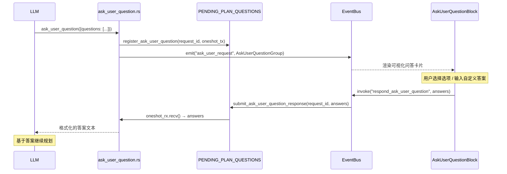

**超时**：10 分钟无响应自动取消。

**问答 UI 特性**：
- `recommended` 选项显示 ★ 标记
- `template` 控制图标分类（scope / tech_choice / priority）
- `multi_select` 支持多选
- `allow_custom` 支持自定义输入

### 计划提交（submit_plan）

**文件**：`crates/oc-core/src/tools/submit_plan.rs`

**条件注入**：仅在 `plan_tools_enabled = true`（Planning 状态）时注入。

**执行流程**：
1. 解析 `title` + `content` 参数
2. 调用 `parse_plan_steps()` 解析步骤
3. 调用 `save_plan_file()` 持久化（自动备份旧版本）
4. 持久化步骤到 DB（`save_plan_steps`）
5. 状态转换：Planning → Review
6. 发射 `plan_submitted` 事件
7. 发射 `plan_mode_changed` 事件（state: "review"）

### 步骤进度追踪（update_plan_step）

**文件**：`crates/oc-core/src/tools/plan_step.rs`

**条件注入**：仅在 `plan_executing = true`（Executing 状态）时注入。

**参数**：

| 参数 | 类型 | 必填 | 说明 |
|------|------|------|------|
| step_index | integer | 是 | 步骤的零基索引 |
| status | string | 是 | "in_progress" / "completed" / "skipped" / "failed" |
| summary | string | 否 | 步骤摘要，完成时保存到结果文件 |

**工具属性**：`internal: true`（不需要用户审批）

**执行流程**：

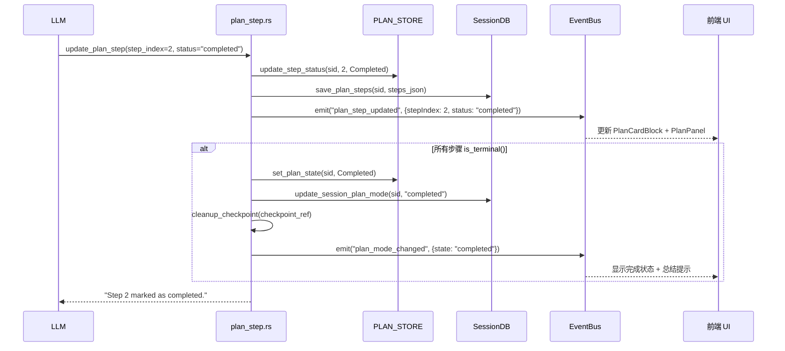

### 执行中计划修改（amend_plan）

**文件**：`crates/oc-core/src/tools/amend_plan.rs`

**条件注入**：Executing 或 Paused 状态时注入。

**操作**：

| action | 参数 | 说明 |
|--------|------|------|
| `insert` | after_index?, title, phase?, description? | 在指定步骤后插入新步骤 |
| `delete` | step_index | 删除步骤（已完成步骤不可删除） |
| `update` | step_index, title?, description?, phase? | 更新步骤信息（终态步骤不可更新） |

**执行后**：
- 自动重编号所有步骤
- 再生成计划 Markdown 文件
- 持久化步骤到 DB
- 发射 `plan_amended` 事件通知前端刷新

### Git Checkpoint 回滚

**执行流程**：

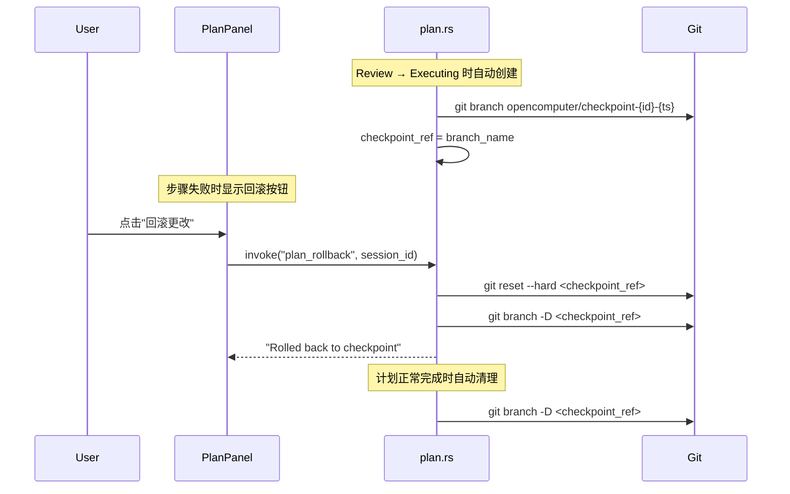

**分支命名**：`opencomputer/checkpoint-{short_session_id}-{timestamp}`

### 计划版本管理

每次保存计划时自动备份旧版本为 `plan-{stem}-v{N}.md`，`PlanMeta.version` 计数器自增。

**功能**：
- `list_plan_versions()` → 列出当前版本 + 所有历史版本
- `load_plan_version()` → 读取指定版本内容
- `restore_plan_version()` → 恢复旧版本（覆盖当前 + 重新解析步骤）

前端 PlanPanel 提供版本历史浏览和一键恢复。

### Planning/Executing 独立模型

**配置**：`AgentModelConfig.plan_model: Option<String>`

Planning 阶段可配置便宜/快速模型（如 Sonnet），节省 60-80% 探索成本。`commands/chat.rs` 在检测到 Planning 状态时，将 `plan_model` 作为模型链首选项覆盖。

前端 Agent 设置面板提供 Plan Model 选择器。

### 子 Agent 安全继承与计划子 Agent

**文件**：`crates/oc-core/src/subagent/spawn.rs`、`crates/oc-core/src/plan/`

#### 安全继承

```rust
// 普通子 Agent 继承 Planning/Review 阶段工具限制
// 但拥有 plan_agent_mode 的计划子 Agent 跳过此限制（它本身就是计划 Agent）
if plan_agent_mode.is_none() {
    let parent_plan_state = plan::get_plan_state(&parent_session_id).await;
    if matches!(parent_plan_state, Planning | Review) {
        for tool in PLAN_MODE_DENIED_TOOLS {
            if !denied.contains(&tool) { denied.push(tool); }
        }
    }
}
```

防止子 Agent 绕过 Planning 阶段的文件修改限制。这是 OpenCode 已知的安全漏洞（Issue #18515），我们在架构层面已修复。

#### 计划子 Agent 模式（`plan_subagent: true`）

当全局设置 `plan_subagent=true` 时，Planning 阶段由独立子 Agent 执行：

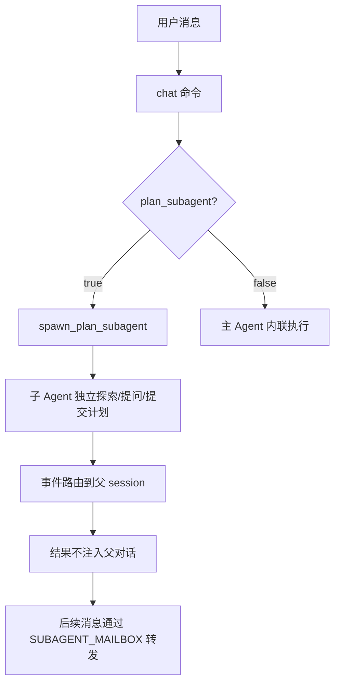

**关键数据结构**：

| 组件 | 说明 |
|------|------|
| `SpawnParams.plan_agent_mode` | 为子 Agent 配置 PlanAgent 工具限制 |
| `SpawnParams.skip_parent_injection` | 子 Agent 完成后不注入结果到父对话 |
| `SpawnParams.extra_system_context` | 注入 PLAN_MODE_SYSTEM_PROMPT + PLAN_SUBAGENT_CONTEXT_NOTICE |
| `PLAN_SUBAGENT_SESSIONS` | `HashMap<child_session_id, PlanSubagentInfo>` 映射注册表 |
| `get_plan_owner_session_id()` | ask_user_question/submit_plan 用此函数路由事件到父 session |
| `cancel_plan_subagent` | Tauri 命令，退出 Plan Mode 时自动取消活跃子 Agent |

---

## 斜杠命令 /plan

**文件**：`crates/oc-core/src/slash_commands/handlers/plan.rs`

| 子命令 | 说明 | CommandAction |
|--------|------|---------------|
| `/plan` 或 `/plan enter` | 进入 Planning | `EnterPlanMode` |
| `/plan exit` | 退出 Plan Mode | `ExitPlanMode` |
| `/plan approve` | 批准计划并执行（创建 Checkpoint） | `ApprovePlan` |
| `/plan show` | 显示当前计划内容 | `ShowPlan` |
| `/plan pause` | 暂停执行 | `PausePlan` |
| `/plan resume` | 恢复执行 | `ResumePlan` |

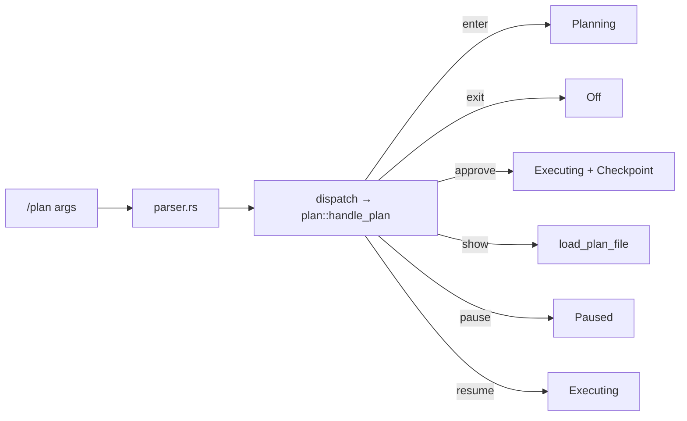

---

## Tauri 命令一览

| 命令 | 参数 | 返回 | 说明 |
|------|------|------|------|
| `get_plan_mode` | session_id | String | 获取当前 plan mode 状态 |
| `set_plan_mode` | session_id, state | () | 设置 plan mode（含 Checkpoint 创建/清理） |
| `get_plan_content` | session_id | Option\<String\> | 读取 plan 文件内容 |
| `save_plan_content` | session_id, content | () | 保存 plan 文件 + 解析 steps |
| `get_plan_steps` | session_id | Vec\<PlanStep\> | 获取步骤列表 |
| `update_plan_step_status` | session_id, step_index, status | () | 更新步骤状态（含自动完成检测） |
| `respond_ask_user_question` | request_id, answers | () | 回复交互问答 |
| `get_plan_versions` | session_id | Vec\<PlanVersionInfo\> | 列出版本历史 |
| `load_plan_version_content` | file_path | String | 读取指定版本内容 |
| `restore_plan_version` | session_id, file_path | () | 恢复旧版本 |
| `plan_rollback` | session_id | String | Git Checkpoint 回滚 |
| `get_plan_checkpoint` | session_id | Option\<String\> | 获取 Checkpoint 分支名 |

---

## 前端架构

### usePlanMode Hook

**文件**：`src/components/chat/plan-mode/usePlanMode.ts`

```typescript
interface UsePlanModeReturn {
  planState: PlanModeState  // "off"|"planning"|"review"|"executing"|"paused"|"completed"
  setPlanState: Dispatch<SetStateAction<PlanModeState>>
  planSteps: PlanStep[]
  setPlanSteps: Dispatch<SetStateAction<PlanStep[]>>
  planContent: string
  setPlanContent: Dispatch<SetStateAction<string>>
  showPanel: boolean
  setShowPanel: Dispatch<SetStateAction<boolean>>
  progress: number           // 0-100
  completedCount: number
  planCardInfo: PlanCardInfo | null
  pendingQuestionGroup: AskUserQuestionGroup | null
  enterPlanMode: () => Promise<void>
  exitPlanMode: () => Promise<void>
  approvePlan: () => Promise<void>
  pauseExecution: () => Promise<void>
  resumeExecution: () => Promise<void>
}
```

**事件监听**：

| 事件 | payload | 动作 |
|------|---------|------|
| `plan_step_updated` | `{sessionId, stepIndex, status, durationMs?}` | 更新 planSteps 对应步骤 |
| `plan_mode_changed` | `{sessionId, state, reason?}` | 更新 planState |
| `plan_submitted` | `{sessionId, title, stepCount, phaseCount, steps[]}` | 设置 planCardInfo + planSteps |
| `plan_amended` | `{sessionId, steps[], stepCount}` | 刷新 planSteps |
| `ask_user_request` | serialized AskUserQuestionGroup | 设置 pendingQuestionGroup |
| `plan_content_updated` | `{sessionId, stepCount, content}` | 更新 planContent |

### ChatInput 集成

**文件**：`src/components/chat/ChatInput.tsx`

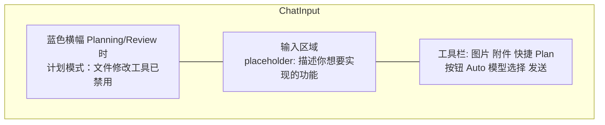

**Plan 按钮五色状态**：

| 状态 | 颜色 | 显示 |
|------|------|------|
| Off | 灰色 | 图标，无文字 |
| Planning | 蓝色 | 高亮 + "Plan" 文字 |
| Review | 紫色 | 高亮 |
| Executing | 绿色 | 高亮 + "75%" 进度 |
| Paused | 黄色 | 高亮 |

### PlanCardBlock 摘要卡片

**文件**：`src/components/chat/plan-mode/PlanCardBlock.tsx`

在聊天消息流中渲染的计划摘要卡片，LLM 调用 `submit_plan` 后触发 `plan_submitted` 事件时插入。

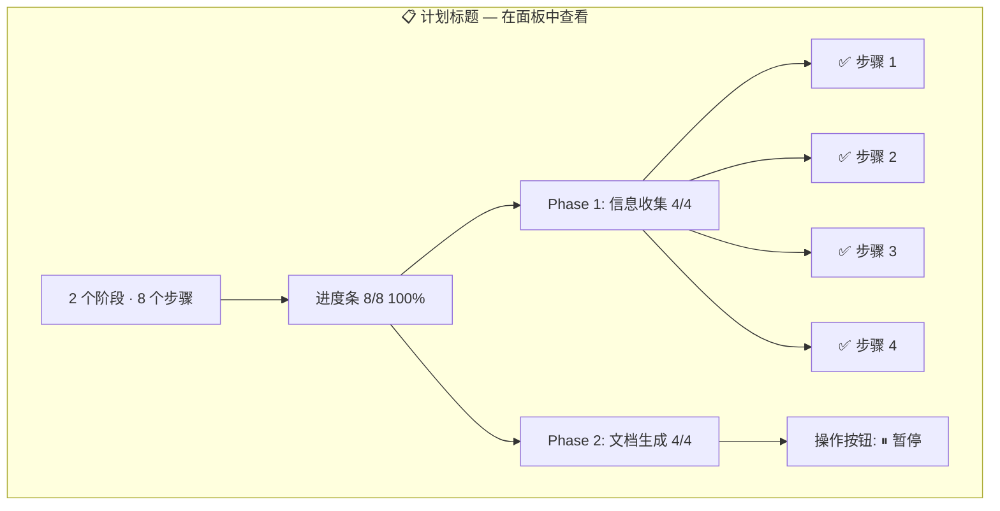

**操作按钮**（按状态切换）：
- Review：`[▶ 批准并执行]` `[✕ 退出不执行]`
- Executing：`[⏸ 暂停]`
- Paused：`[▶ 恢复]` `[✕ 退出]`
- Completed：`✅ 计划执行完成`
- Planning：`🔄 正在规划...`

### AskUserQuestionBlock 交互问答

**文件**：`src/components/chat/ask-user/AskUserQuestionBlock.tsx`

LLM 调用 `ask_user_question` 后在消息流中渲染的可视化问答卡片：

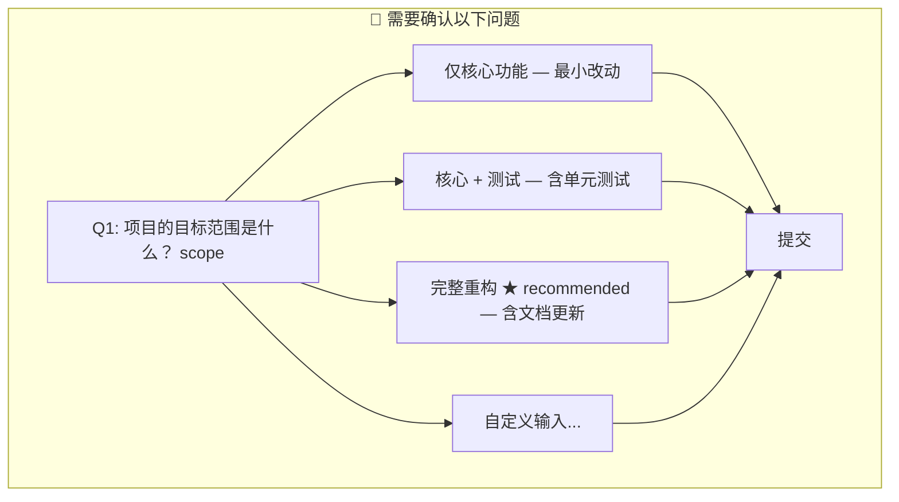

### PlanPanel 右侧面板

**文件**：`src/components/chat/plan-mode/PlanPanel.tsx`

四种视图模式：

**Review 视图**：

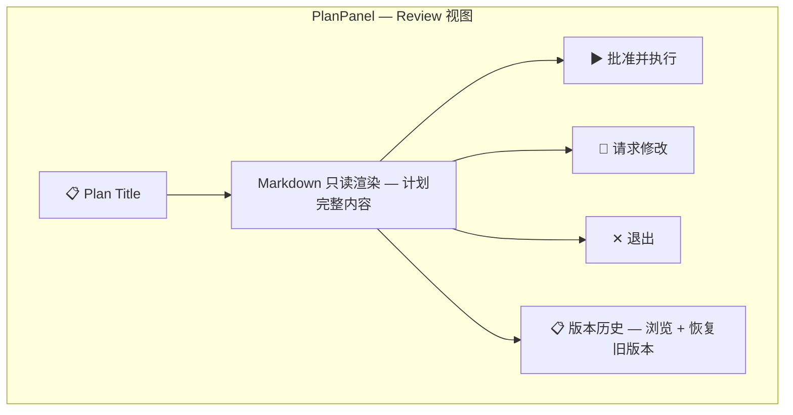

**Executing 视图**：

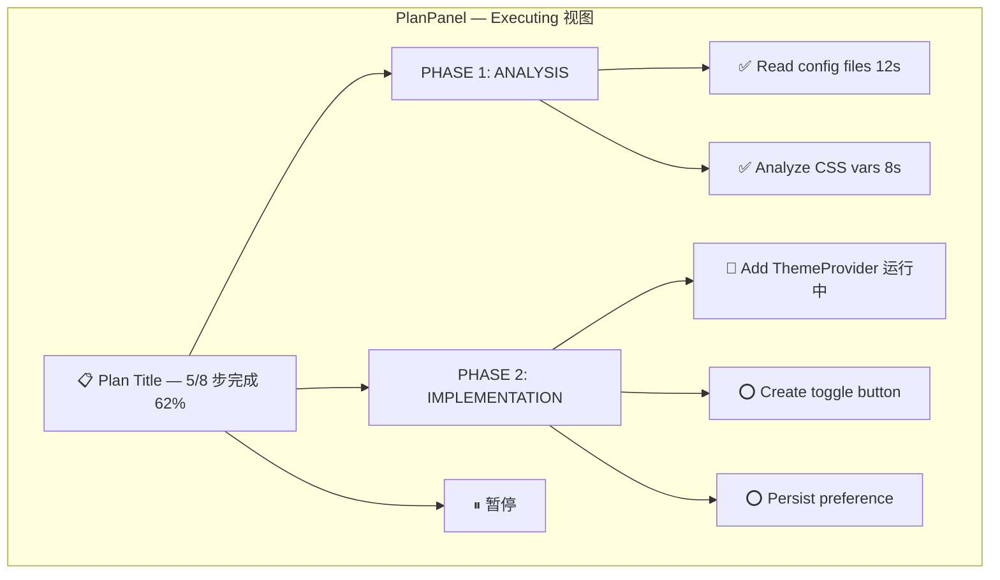

**Paused 视图**：增加回滚按钮（有 Checkpoint 时显示）

**Completed 视图**：显示完成状态 + 执行摘要

**布局**：`w-[400px] shrink-0 max-w-[40vw]`，与 CanvasPanel 互斥显示。

**状态图标**：

| 状态 | 图标 | 颜色 |
|------|------|------|
| pending | Circle | text-muted-foreground |
| in_progress | Loader2 (spin) | text-blue-500 |
| completed | CheckCircle | text-green-500 |
| failed | XCircle | text-red-500 |
| skipped | MinusCircle | text-gray-400 |

### planParser 解析器

**文件**：`src/components/chat/plan-mode/planParser.ts`

| 函数 | 说明 |
|------|------|
| `detectPlanContent(content)` | 检测消息是否包含 Plan 格式，返回 `{ isPlan, steps, title }` |
| `groupStepsByPhase(steps)` | 按 phase 分组，返回 `{ name, steps }[]` |
| `formatDuration(ms)` | 格式化毫秒为 "12s" / "1m30s" 等 |

---

## 完整交互流程

### 1. Planning → Review → Executing → Completed

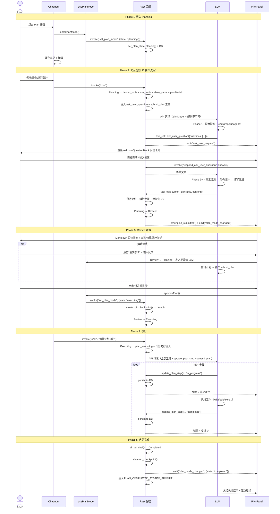

### 2. 失败回滚流程

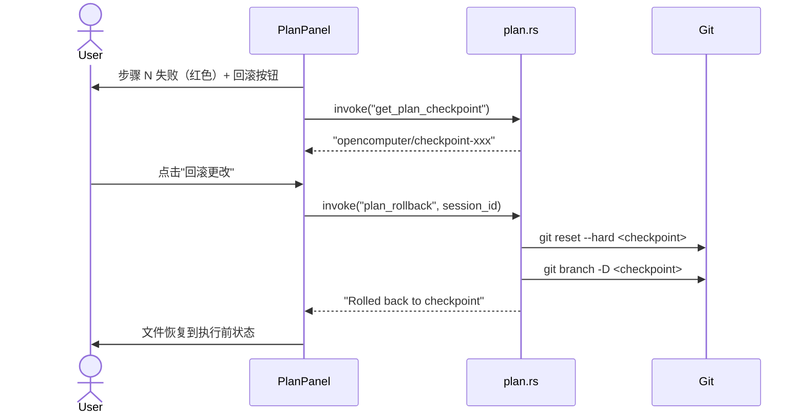

### 3. 子 Agent 安全继承

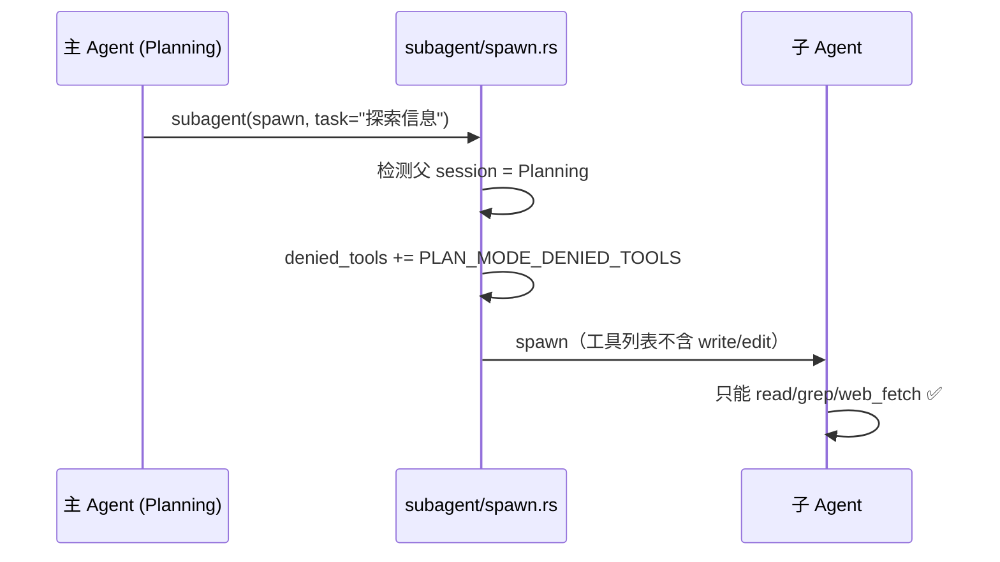

---

## DB Schema

### sessions 表

```sql
-- plan_mode 列
ALTER TABLE sessions ADD COLUMN plan_mode TEXT DEFAULT 'off';
-- 值域："off"|"planning"|"review"|"executing"|"paused"|"completed"

-- plan_steps 列（崩溃恢复）
ALTER TABLE sessions ADD COLUMN plan_steps TEXT;
-- JSON 序列化的 Vec<PlanStep>，每次 update_step_status 后自动写入
```

**崩溃恢复策略**：
1. `restore_from_db()` 读取 `plan_mode` 重建状态
2. 优先从 `plan_steps` 列加载步骤（JSON）
3. 回退到从 plan 文件重新解析

---

## 事件系统

| 事件名 | 触发来源 | Payload | 监听方 |
|--------|----------|---------|--------|
| `plan_step_updated` | plan_step.rs / commands/plan.rs | `{sessionId, stepIndex, status, durationMs?}` | usePlanMode → 更新步骤状态 |
| `plan_mode_changed` | submit_plan / set_plan_mode / 自动完成 | `{sessionId, state, reason?}` | usePlanMode → 状态切换 |
| `plan_submitted` | submit_plan.rs | `{sessionId, title, stepCount, phaseCount, steps[]}` | usePlanMode → 设置 planCardInfo |
| `plan_amended` | amend_plan.rs | `{sessionId, steps[], stepCount}` | usePlanMode → 刷新步骤列表 |
| `ask_user_request` | ask_user_question.rs | serialized AskUserQuestionGroup | usePlanMode → 渲染问答 UI |
| `plan_content_updated` | save_plan_content | `{sessionId, stepCount, content}` | usePlanMode → 更新 planContent |

---

## 安全设计

### 细粒度路径权限

- Planning/Review 状态下 `write`/`edit` 工具仅允许操作 `.opencomputer/plans/` 目录下的 `.md` 文件
- `apply_patch`/`canvas` 完全禁用
- `exec` 强制用户审批
- 路径检查通过 `is_plan_mode_path_allowed()` + `plan_mode_allow_paths` 在 `ToolExecContext` 中传播

### 子 Agent 限制继承

Planning/Review 状态下 spawn 的子 Agent 自动继承 `PLAN_MODE_DENIED_TOOLS`，防止工具限制逃逸。

### 内部工具不需审批

`update_plan_step` 和 `amend_plan` 标记为 `internal: true`，不触发用户审批流程。

### 步骤进度不丢失

每次步骤状态更新后自动持久化到 DB `plan_steps` 列，崩溃后可恢复。

### Git Checkpoint 保护

执行前自动创建 git 分支快照，失败时可回滚到执行前状态，正常完成后自动清理。

---

## 与 Claude Code / OpenCode 对比

| 特性 | Claude Code | OpenCode | OpenComputer |
|------|-------------|----------|--------------|
| 入口 | Shift+Tab / CLI flag | Tab 键切换 | **工具栏按钮** + /plan 命令 |
| 状态数 | 4 (default/acceptEdits/plan/auto) | 2 (Plan/Execute) | **6 (Off/Planning/Review/Executing/Paused/Completed)** |
| 规划模式 | 内联（同一 Agent） | 内联（同一 Agent） | **双模式可切换（内联 / 子 Agent）** |
| 规划流程 | 5 阶段（Explore→Plan→Review→Write→Exit） | 5 阶段（复刻 Claude Code） | **5 阶段 + 结构化问答 + 以逻辑单元为中心的计划格式** |
| 计划格式 | ≤40 行精简（文件+改动） | 增量写入 plan 文件 | **以逻辑单元为中心，代码任务含代码片段/文件引用，非代码任务含交付标准** |
| Plan 展示 | Plan 文件 + 编辑器 | 终端文本 | **PlanCardBlock + PlanPanel 双视图** |
| 交互问答 | AskUserQuestion | 普通 question 工具 | **ask_user_question 类型化选项 + UI 卡片** |
| 进度追踪 | 无 | 无（依赖 todoread/todowrite） | **实时步骤追踪（工具 + 事件 + DB 持久化）** |
| 暂停/恢复 | 无 | 无 | **Paused 状态 + paused_at_step** |
| 执行中修改 | 无 | 无 | **amend_plan（insert/delete/update）** |
| 完成总结 | 无 | 无 | **Completed 状态 + 总结提示词** |
| 工具限制 | 文件系统级只读 | deny/ask 配置 | **路径感知权限（plans/ 路径可写）** |
| 子 Agent 安全 | N/A | **已知逃逸问题** | **继承 denied_tools（计划子 Agent 除外）** |
| Plan 存储 | `~/.claude/plans/` | `.opencode/plans/` | **项目本地 + 全局回退** |
| 版本管理 | 无 | 无 | **自动备份 + 版本历史 + 恢复** |
| Git 回滚 | 无 | 无 | **Checkpoint 分支 + 一键回滚** |
| 模型优化 | 同一模型 | Planning/Executing 独立模型 | **planModel 覆盖（节省 60-80%）** |
| 审批选项 | 4 种执行模式 | 确认/取消 | **批准/请求修改/退出/版本恢复** |

---

## 文件清单

### 后端文件

| 文件 | 用途 |
|------|------|
| `crates/oc-core/src/plan/` | 核心：六态状态机 + 文件 I/O + 解析 + 常量 + 路径权限 + Git Checkpoint + 版本管理 + 问答注册 + 子 Agent 注册表 + spawn_plan_subagent |
| `src-tauri/src/commands/plan.rs` | 11 个 Tauri 命令 |
| `crates/oc-core/src/slash_commands/handlers/plan.rs` | /plan 斜杠命令处理（6 子命令） |
| `crates/oc-core/src/tools/ask_user_question.rs` | ask_user_question 交互问答工具 |
| `crates/oc-core/src/tools/submit_plan.rs` | submit_plan 计划提交工具 |
| `crates/oc-core/src/tools/plan_step.rs` | update_plan_step 步骤进度工具 |
| `crates/oc-core/src/tools/amend_plan.rs` | amend_plan 执行中修改工具 |
| `crates/oc-core/src/subagent/spawn.rs` | 子 Agent 计划模式限制继承 + plan_agent_mode 支持 + skip_parent_injection |
| `crates/oc-core/src/subagent/types.rs` | SpawnParams 扩展（plan_agent_mode / plan_mode_allow_paths / skip_parent_injection / extra_system_context） |

### 前端文件

| 文件 | 用途 |
|------|------|
| `src/components/chat/plan-mode/usePlanMode.ts` | Hook：六态状态管理 + 事件监听 |
| `src/components/chat/plan-mode/PlanCardBlock.tsx` | 摘要卡片（可展开 Phase 步骤） |
| `src/components/chat/ask-user/AskUserQuestionBlock.tsx` | 交互问答 UI（选项卡片 + recommended 标记） |
| `src/components/chat/plan-mode/PlanPanel.tsx` | 右侧详情面板（四种视图 + 版本历史 + 回滚） |
| `src/components/chat/plan-mode/PlanStepItem.tsx` | 步骤行组件（状态图标 + 耗时） |
| `src/components/chat/plan-mode/PlanBlock.tsx` | 容器组件 |
| `src/components/chat/plan-mode/planParser.ts` | Markdown Plan 格式检测与解析 |

### 修改文件

| 文件 | 改动点 |
|------|--------|
| `crates/oc-core/src/lib.rs` | `pub mod plan` 模块导出 |
| `src-tauri/src/lib.rs` | 注册 12 个 Tauri 命令（含 cancel_plan_subagent） |
| `crates/oc-core/src/paths.rs` | `plans_dir()` + 项目本地路径解析 |
| `crates/oc-core/src/agent_config.rs` | `AgentModelConfig.plan_model` 字段 |
| `crates/oc-core/src/session/db.rs` | 迁移（plan_mode + plan_steps 列）+ 读写方法 |
| `crates/oc-core/src/session/types.rs` | `SessionMeta.plan_mode` 字段 |
| `src-tauri/src/commands/chat.rs` | 六态分支：双模式分发（plan_subagent 设置）+ 工具限制 + 路径权限 + 模型覆盖 + 提示词注入 |
| `crates/oc-core/src/provider/` | AppConfig 新增 `plan_subagent: bool` 全局设置 |
| `crates/oc-core/src/agent/mod.rs` | plan_ask_tools + plan_executing + plan_tools_enabled + plan_mode_allow_paths |
| `crates/oc-core/src/agent/providers/*.rs` | 消费 `agent/mod.rs` 已注入/已过滤的 plan 工具 schema 并发起 API 请求 |
| `crates/oc-core/src/tools/mod.rs` | 4 个 plan 工具模块 + 常量 |
| `crates/oc-core/src/tools/execution.rs` | 4 个工具 dispatch |
| `crates/oc-core/src/tools/definitions.rs` | 4 个工具定义 |
| `crates/oc-core/src/slash_commands/registry.rs` | 注册 /plan 命令 |
| `crates/oc-core/src/slash_commands/types.rs` | 6 个 CommandAction 变体 |
| `src/components/chat/ChatScreen.tsx` | usePlanMode + PlanPanel + handleCommandAction |
| `src/components/chat/ChatInput.tsx` | Plan 按钮五色 + 横幅 + placeholder |
| `src/i18n/locales/zh.json` | planMode.* 翻译 |
| `src/i18n/locales/en.json` | planMode.* 翻译 |
