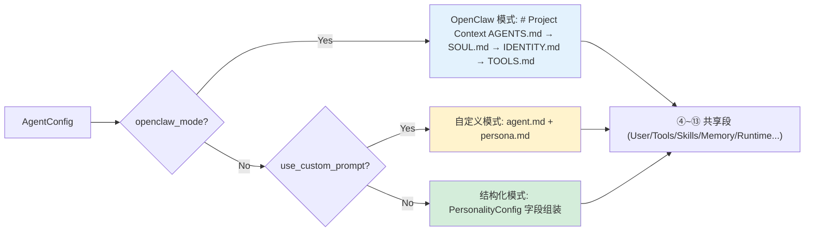
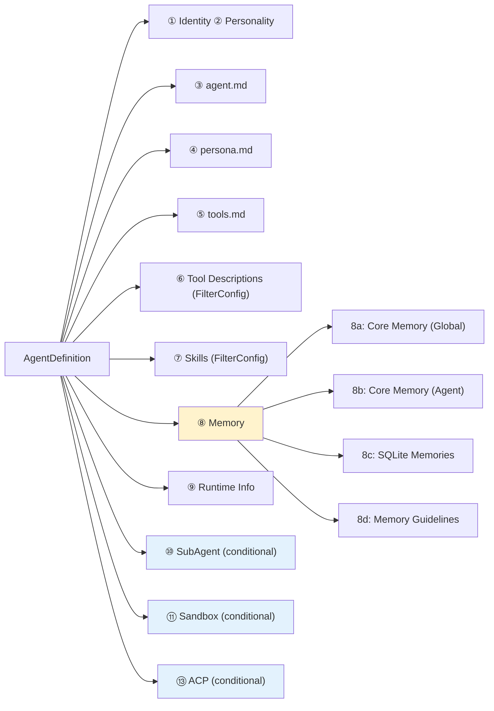
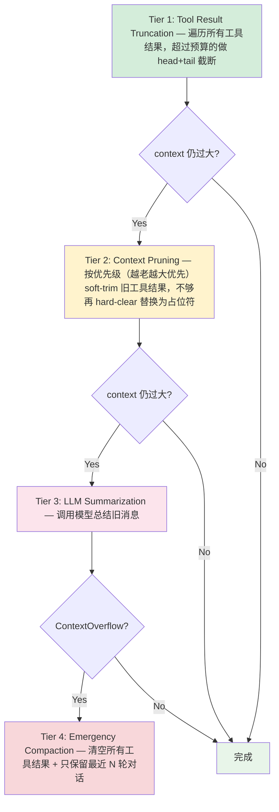

# OpenComputer 提示词系统技术文档

> 返回 [文档索引](../README.md) | 更新时间：2026-04-05

## 目录

- [概述](#概述)（含架构总览图）
- [System Prompt 组装流程](#system-prompt-组装流程)
  - [13 段组装顺序](#13-段组装顺序)
  - [三种组装模式](#三种组装模式)
  - [Legacy 兼容路径](#legacy-兼容路径)
- [Per-Tool 描述系统](#per-tool-描述系统)
  - [设计理念](#设计理念)
  - [工具描述清单（32 个工具）](#工具描述清单32-个工具)
  - [动态过滤机制](#动态过滤机制)
- [Plan Mode 提示词](#plan-mode-提示词)
  - [5 阶段规划 Prompt](#5-阶段规划-prompt)
  - [执行阶段 Prompt](#执行阶段-prompt)
  - [完成阶段 Prompt](#完成阶段-prompt)
  - [子 Agent 上下文隔离](#子-agent-上下文隔离)
- [Memory Guidelines（记忆指导）](#memory-guidelines记忆指导)
- [上下文压缩提示词](#上下文压缩提示词)
  - [4 层渐进式压缩](#4-层渐进式压缩)
  - [Summarization System Prompt](#summarization-system-prompt)
  - [标识符保留策略](#标识符保留策略)
- [条件注入段](#条件注入段)
  - [Sub-Agent Delegation](#sub-agent-delegation)
  - [Sandbox Mode](#sandbox-mode)
  - [ACP External Agents](#acp-external-agents)
- [Prompt 缓存优化](#prompt-缓存优化)
- [关键文件索引](#关键文件索引)

---

## 概述

OpenComputer 的提示词系统采用**模块化组装**架构，由 `system_prompt::build()` 统一编排。System Prompt 由最多 12 个独立段落（section）按固定顺序拼接，每段可独立启用/禁用/过滤，支持 Agent 级别的差异化配置。支持三种互斥的组装模式：**结构化模式**（默认 GUI 配置）、**自定义模式**（自由 Markdown）、**OpenClaw 兼容模式**（4 文件配置）。

```mermaid
graph TD
    subgraph SP["System Prompt 13 段组装"]
        direction LR
        S1["① Identity"] --> S2["② agent.md / Project Context"] --> S3["③ persona.md"]
        S4["④ User Context"] --> S5["⑤ tools.md"] --> S6["⑥ Tool Descriptions (filtered)"]
        S7["⑦ Skills (filtered)"] --> S8["⑧ Memory Guidelines"]
        S9["⑨ Runtime Info"] --> S10["⑩ SubAgent Delegation"] --> S11["⑪ Sandbox Mode"]
        S12["⑫ reserved"] --> S13["⑬ ACP Ext Agents"]
    end
    S3 --> S4
    S6 --> S7
    S8 --> S9
    S11 --> S12
    style SP fill:#f5f5f5
```



**三种组装模式**：



**核心设计原则**：

| 原则                 | 说明                                                                                                      |
| -------------------- | --------------------------------------------------------------------------------------------------------- |
| **Per-Agent 差异化** | 每个 Agent 的工具、技能、记忆、子 Agent 权限可独立配置                                                    |
| **动态过滤**         | 工具描述和技能描述按 allow/deny 列表过滤，减少无关 token                                                  |
| **缓存友好**         | 日期只精确到天，避免每次请求都改变 system prompt                                                          |
| **安全截断**         | 注入的 markdown 文件限制 20,000 字符，head(70%)+tail(20%) 截断                                            |
| **条件注入**         | Sandbox、SubAgent、ACP 段仅在配置启用时注入                                                               |
| **OpenClaw 兼容**    | 支持 OpenClaw 风格 4 文件配置（AGENTS/IDENTITY/SOUL/TOOLS.md），与 OpenClaw 的 MEMORY.md 核心记忆格式互通 |

---

## System Prompt 组装流程

### 13 段组装顺序

组装由 `system_prompt::build()` 函数执行，入口参数为 `AgentDefinition`（Agent 完整配置）：



**代码位置**：`crates/oc-core/src/system_prompt/build.rs` — `pub fn build()`

### 三种组装模式

`build()` 函数根据 `config.openclaw_mode` 和 `config.use_custom_prompt` 选择组装模式，三者互斥，优先级：OpenClaw > 自定义 > 结构化。

|               | 结构化模式（默认）                          | 自定义模式                        | OpenClaw 兼容模式                 |
| ------------- | ------------------------------------------- | --------------------------------- | --------------------------------- |
| 触发条件      | 默认                                        | `use_custom_prompt: true`         | `openclaw_mode: true`             |
| Identity 行   | `"You are {name}, a {role}, running on..."` | `"You are {name}, running on..."` | `"You are {name}, running on..."` |
| Personality   | `PersonalityConfig` 字段组装                | 跳过                              | 跳过                              |
| agent.md      | 补充说明                                    | 主要 identity                     | 不使用                            |
| persona.md    | 补充个性                                    | 主要个性                          | 不使用                            |
| OpenClaw 文件 | —                                           | —                                 | `# Project Context` 段注入        |

#### OpenClaw 兼容模式

启用 `openclaw_mode` 后，提示词采用 OpenClaw 风格的 4 文件组装，按以下顺序注入 `# Project Context` 段：

```
# Project Context

The following project context files have been loaded:

## AGENTS.md    ← 工作空间规则、红线、记忆指导
## SOUL.md      ← 性格、价值观、语气、边界
## IDENTITY.md  ← 身份元数据（名称、生物类型、风格）
## TOOLS.md     ← 本地环境说明（摄像头、SSH、TTS）
```

如果 SOUL.md 存在且非空，追加指导语：

> "If SOUL.md is present, embody its persona and tone throughout all interactions."

**文件存储**：`~/.opencomputer/agents/{id}/agents.md`、`identity.md`、`soul.md`（`tools.md` 复用现有文件）

**模板预填充**：首次启用时，空文件自动填充适配后的 OpenClaw 官方模板（`crates/oc-core/templates/openclaw_*.md`，纯英文）

**UI 行为**：启用后，Identity/Personality tab 禁用（显示提示），BehaviorTab 工具指导只读，MemoryTab 提示核心记忆与 OpenClaw MEMORY.md 兼容

**与其他段的关系**：OpenClaw 模式下 `tools.md` 已包含在 `# Project Context` 中，跳过独立的 ⑤ tools.md 注入。其余段（④ 用户上下文、⑥ 工具定义、⑦ 技能、⑧ 记忆、⑨ 运行时等）照常注入。

**代码位置**：`crates/oc-core/src/system_prompt/build.rs` — `build()` 函数开头的 `if definition.config.openclaw_mode` 分支

### Legacy 兼容路径

`build_legacy()` 在 `load_agent()` 加载 Agent 配置失败时（如配置文件损坏或不存在）作为降级路径，拼出一个基础 system prompt：

- 注入全部工具描述（不过滤）
- 从全局 `ProviderStore` 加载技能
- 无 Memory、SubAgent、Sandbox、ACP 段

**代码位置**：`crates/oc-core/src/system_prompt/build.rs` — `pub fn build_legacy()`

---

## Per-Tool 描述系统

### 设计理念

每个工具拥有独立的详细描述常量。相比之前的单一 `TOOLS_DESCRIPTION` 字符串（所有工具挤在一起），新架构的优势：

1. **精准过滤**：Agent 只看到被授权的工具描述，减少无关 token 消耗
2. **详细指南**：每个工具包含使用指南、最佳实践、常见陷阱
3. **工具优先级**：`exec` 工具明确标注「优先使用专用工具」规则，防止模型绕过专用工具直接用 shell

### 工具描述清单（32 个工具）

工具描述以 `TOOL_DESC_*` 常量定义，通过 `TOOL_DESCRIPTIONS` 数组映射：

| 分类         | 工具               | 常量                           | 描述要点                                                 |
| ------------ | ------------------ | ------------------------------ | -------------------------------------------------------- |
| **执行**     | exec               | `TOOL_DESC_EXEC`               | cwd/timeout/background/sandbox；**强调优先使用专用工具** |
|              | process            | `TOOL_DESC_PROCESS`            | 管理后台 exec session；禁止 sleep 轮询                   |
| **文件操作** | read               | `TOOL_DESC_READ`               | 分页/图片检测/PDF 分页；**先读后改**                     |
|              | write              | `TOOL_DESC_WRITE`              | 优先用 edit；不创建不必要的文件                          |
|              | edit               | `TOOL_DESC_EDIT`               | old_text 唯一性；replace_all 重命名                      |
|              | ls                 | `TOOL_DESC_LS`                 | 目录列表；创建前先验证                                   |
|              | grep               | `TOOL_DESC_GREP`               | **禁止用 exec 替代**；regex + multiline                  |
|              | find               | `TOOL_DESC_FIND`               | **禁止用 exec 替代**；glob 模式                          |
|              | apply_patch        | `TOOL_DESC_APPLY_PATCH`        | 多文件补丁；3-pass fuzzy matching                        |
| **网络**     | web_search         | `TOOL_DESC_WEB_SEARCH`         | 搜索当前信息                                             |
|              | web_fetch          | `TOOL_DESC_WEB_FETCH`          | 抓取网页内容                                             |
|              | browser            | `TOOL_DESC_BROWSER`            | 无头浏览器；动态页面交互                                 |
| **记忆**     | save_memory        | `TOOL_DESC_SAVE_MEMORY`        | 4 种类型；禁止保存临时信息                               |
|              | recall_memory      | `TOOL_DESC_RECALL_MEMORY`      | 关键词/语义搜索；include_history                         |
|              | update_memory      | `TOOL_DESC_UPDATE_MEMORY`      | 更新已有记忆                                             |
|              | delete_memory      | `TOOL_DESC_DELETE_MEMORY`      | 删除过期记忆                                             |
|              | update_core_memory | `TOOL_DESC_UPDATE_CORE_MEMORY` | 持久指令写入 memory.md                                   |
|              | memory_get         | `TOOL_DESC_MEMORY_GET`         | 按 ID 获取完整记忆                                       |
| **委托**     | subagent           | `TOOL_DESC_SUBAGENT`           | spawn/check/steer/kill；异步执行                         |
|              | agents_list        | `TOOL_DESC_AGENTS_LIST`        | 列出可委托 Agent                                         |
|              | acp_spawn          | `TOOL_DESC_ACP_SPAWN`          | 外部 ACP Agent（Claude Code/Codex）                      |
| **会话**     | sessions_list      | `TOOL_DESC_SESSIONS_LIST`      | 跨会话通信发现                                           |
|              | session_status     | `TOOL_DESC_SESSION_STATUS`     | 会话详细状态                                             |
|              | sessions_history   | `TOOL_DESC_SESSIONS_HISTORY`   | 分页历史记录                                             |
|              | sessions_send      | `TOOL_DESC_SESSIONS_SEND`      | 跨会话消息发送                                           |
| **媒体**     | image              | `TOOL_DESC_IMAGE`              | 图片分析；prompt 指定分析目标                            |
|              | image_generate     | `TOOL_DESC_IMAGE_GENERATE`     | AI 图片生成；failover                                    |
|              | pdf                | `TOOL_DESC_PDF`                | PDF 文本提取；大文件必须分页                             |
| **其他**     | canvas             | `TOOL_DESC_CANVAS`             | 富内容制品                                               |
|              | manage_cron        | `TOOL_DESC_MANAGE_CRON`        | 定时任务管理                                             |
|              | send_notification  | `TOOL_DESC_SEND_NOTIFICATION`  | 系统通知                                                 |

**代码位置**：`crates/oc-core/src/system_prompt/constants.rs`

### 动态过滤机制

```rust
fn build_tools_section(filter: &FilterConfig) -> String {
    let no_filter = filter.allow.is_empty() && filter.deny.is_empty();
    let descs: Vec<&str> = TOOL_DESCRIPTIONS
        .iter()
        .filter(|(name, _)| no_filter || filter.is_allowed(name))
        .map(|(_, desc)| *desc)
        .collect();
    format!("# Available Tools\n\n{}", descs.join("\n\n"))
}
```

- `allow` 为空且 `deny` 为空 → 注入全部工具描述
- `allow` 非空 → 只注入白名单中的工具
- `deny` 非空 → 排除黑名单中的工具
- 过滤后为空 → 不注入工具段

**代码位置**：`crates/oc-core/src/system_prompt/sections.rs` — `build_tools_section()`

---

## Plan Mode 提示词

Plan Mode 使用独立于主 system prompt 的额外提示词，注入到对话上下文中。详细架构见 [Plan Mode 架构文档](plan-mode.md)。

### 5 阶段规划 Prompt

**常量**：`PLAN_MODE_SYSTEM_PROMPT`（`plan.rs`）

```
Phase 1: Deep Exploration    → subagent 并行探索，梳理关键要素和依赖关系
Phase 2: Requirements         → plan_question 结构化问答，带选项卡片
Phase 3: Design & Architecture → 方案对比，风险识别
Phase 4: Plan Composition      → submit_plan 提交，checklist 格式
Phase 5: Review & Refinement   → 用户审核，inline comment 修订
```

**工具限制**：

- 禁止：apply_patch、canvas（项目文件不可修改）
- 限制：write/edit 只能操作 `~/.opencomputer/plans/` 路径
- 需审批：exec（shell 命令需用户同意）
- 允许：read、grep、find、web_search、web_fetch、subagent、plan_question、submit_plan

**计划格式要求**：

- 以**逻辑单元为中心**组织步骤
- 步骤标题描述具体任务（涉及代码时可加文件路径）
- 涉及代码修改时包含代码片段和文件引用
- 引用已有内容时标注来源
- 使用 `- [ ]` 子任务便于追踪
- 末尾 Verification 段列出验证方法

### 执行阶段 Prompt

**常量**：`PLAN_EXECUTING_SYSTEM_PROMPT_PREFIX`（`plan.rs`）

- 逐步执行已审批计划
- `update_plan_step(step_index, status)` 追踪进度
- `amend_plan()` 动态修改计划（insert/delete/update）
- Git checkpoint 已创建，失败可回滚

### 完成阶段 Prompt

**常量**：`PLAN_COMPLETED_SYSTEM_PROMPT`（`plan.rs`）

- 总结完成情况
- 高亮失败/跳过的步骤并解释原因
- 建议后续行动

### 子 Agent 上下文隔离

**常量**：`PLAN_SUBAGENT_CONTEXT_NOTICE`（`plan.rs`）

当 Plan Mode 使用子 Agent 模式时，注入此 notice 提醒 planning subagent：

- 执行 Agent **不会**看到你的探索历史
- 计划必须**自包含**：关键细节、来源引用、前置条件
- "The plan IS the only context"

---

## Memory Guidelines（记忆指导）

**位置**：`system_prompt/sections.rs`（⑧ Memory 段的 8d 子段）

仅在 `config.memory.enabled = true` 时注入。指导 Agent 正确使用 4 个记忆工具：

| 工具                                  | 使用场景                                      |
| ------------------------------------- | --------------------------------------------- |
| `update_core_memory`                  | 长期指令：「always」「never」「from now on」  |
| `save_memory`                         | 事实、截止日期、临时上下文、值得备注的发现    |
| `recall_memory`                       | 查找先前偏好/约束/上下文                      |
| `recall_memory(include_history=true)` | 搜索历史对话（「last time」「we discussed」） |

**禁止保存**：临时任务细节、代码片段、调试步骤、可从代码库推导的信息。

记忆段还包括 Core Memory 注入（8a 全局、8b Agent 级别）和 SQLite 记忆检索结果（8c）。

---

## 上下文压缩提示词

### 4 层渐进式压缩

上下文压缩系统在对话历史逼近上下文窗口限制时自动触发：



**代码位置**：`crates/oc-core/src/context_compact/mod.rs`

### Summarization System Prompt

**常量**：`SUMMARIZATION_SYSTEM_PROMPT`（`context_compact/summarization.rs`）

```
You are a context compaction assistant.

MUST PRESERVE:
- Active tasks and their current status (in-progress, blocked, pending)
- Batch operation progress (e.g., "5/17 items completed")
- The last thing the user requested and what was being done about it
- Decisions made and their rationale
- TODOs, open questions, and constraints
- Any commitments or follow-ups promised
- All file paths, function names, and code references mentioned

PRIORITIZE recent context over older history.

Output format:
## Decisions
## Open TODOs
## Constraints/Rules
## Pending user asks
## Exact identifiers
## Conversation summary
```

**设计要点**：

- 优先保留近期上下文（"正在做什么"比"讨论过什么"更重要）
- 6 段结构化输出，确保关键信息不丢失
- 所有标识符（UUID、路径、函数名）原样保留

### 标识符保留策略

**常量**：`IDENTIFIER_PRESERVATION_INSTRUCTIONS`（`context_compact/mod.rs`）

```
Preserve all opaque identifiers exactly as written (no shortening or reconstruction),
including UUIDs, hashes, IDs, tokens, hostnames, IPs, ports, URLs, and file names.
```

通过 `CompactConfig.identifier_policy` 配置：

| 策略             | 行为                                     |
| ---------------- | ---------------------------------------- |
| `strict`（默认） | 使用内置保留指令                         |
| `off`            | 不注入保留指令                           |
| `custom`         | 使用用户自定义 `identifier_instructions` |

### 压缩配置参数

| 参数                         | 默认值 | 说明                         |
| ---------------------------- | ------ | ---------------------------- |
| `soft_trim_ratio`            | 0.50   | Tier 2 软截断触发比例        |
| `hard_clear_ratio`           | 0.70   | Tier 2 硬清除触发比例        |
| `keep_last_assistants`       | 4      | 保护最近 N 条 assistant 消息 |
| `soft_trim_max_chars`        | 6,000  | 超过此值才软截断             |
| `soft_trim_head_chars`       | 2,000  | 软截断保留头部               |
| `soft_trim_tail_chars`       | 2,000  | 软截断保留尾部               |
| `summarization_threshold`    | 0.85   | Tier 3 总结触发比例          |
| `preserve_recent_turns`      | 4      | 总结时保留最近 N 轮对话      |
| `summary_max_tokens`         | 4,096  | 总结输出最大 token           |
| `summarization_timeout_secs` | 60     | 总结调用超时                 |

**代码位置**：`crates/oc-core/src/context_compact/config.rs`

---

## 条件注入段

### Sub-Agent Delegation

**触发条件**：`config.subagents.enabled == true` 且 `depth < max_spawn_depth`

**注入内容**：

- 可委托 Agent 列表（emoji + name + id + description）
- 使用方式：spawn → 异步执行 → 自动推送结果
- steer 重定向、check 状态检查、kill 终止
- spawn 选项：label、files、model override
- 当前深度显示：`Current depth: N/M`

**过滤规则**：

- 列出自身并标注 `*(self — fork for parallel work)*`，支持 self-fork 并行
- 受 `SubagentConfig.allow/deny` 控制

**代码位置**：`crates/oc-core/src/system_prompt/sections.rs` — SubAgent Delegation 段构建

### Sandbox Mode

**触发条件**：`config.behavior.sandbox == true`

**注入内容**：

- 所有 exec 自动在 Docker 容器内执行
- 只读根文件系统（/workspace, /tmp, /var/tmp, /run 可写）
- 无网络访问
- 所有 Linux capabilities 已 drop
- 进程数限制

### ACP External Agents

**触发条件**：`config.acp.enabled == true` 且全局 `acp_control.enabled == true`

**注入内容**：

- 可用 ACP 后端列表（检测 binary 是否存在）
- 使用场景区分：subagent（内部）vs acp_spawn（外部）
- 异步执行 + check(wait=true) 阻塞等待

**代码位置**：`crates/oc-core/src/system_prompt/sections.rs` — ACP External Agents 段构建

---

## Prompt 缓存优化

为最大化 LLM prompt 缓存命中率，系统采取以下策略：

| 策略         | 实现                          | 效果                              |
| ------------ | ----------------------------- | --------------------------------- |
| 日期精确到天 | `date +%Y-%m-%d %Z`（无时间） | 同一天的 system prompt 完全相同   |
| 固定段顺序   | 13 段按固定顺序组装           | prompt prefix 稳定，利于 KV cache |
| 常量描述     | 工具/行为描述为编译时常量     | 不受运行时数据影响                |
| 截断上限     | markdown 注入限制 20K 字符    | 防止动态内容过大破坏缓存          |

**日期函数**：`current_date()`（`system_prompt/helpers.rs`）— 文档注释明确说明排除时间是为缓存优化。

---

## 关键文件索引

| 文件                                            | 内容                                                                      |
| ----------------------------------------------- | ------------------------------------------------------------------------- |
| `crates/oc-core/src/system_prompt/build.rs`     | **核心**：三模式组装（结构化/自定义/OpenClaw）、13 段拼接逻辑             |
| `crates/oc-core/src/system_prompt/constants.rs` | 32 个工具描述常量、3 个行为指导常量                                       |
| `crates/oc-core/src/system_prompt/sections.rs`  | 各 section builder（personality/tools/skills/runtime/subagent/acp）       |
| `crates/oc-core/src/agent_config.rs`            | Agent 配置结构（personality/tools/skills/memory/subagents/openclaw_mode） |
| `crates/oc-core/src/agent_loader.rs`            | Agent 加载（agent.json + md 文件 + OpenClaw 模板）                        |
| `crates/oc-core/templates/openclaw_*.md`        | OpenClaw 兼容模式 4 个模板文件（纯英文）                                  |
| `crates/oc-core/src/plan/`                      | Plan Mode 提示词常量                                                      |
| `crates/oc-core/src/context_compact/`           | 上下文压缩（4 层 + 总结 system prompt + 标识符保留）                      |
| `crates/oc-core/src/user_config.rs`             | 用户上下文构建（name/role/birthday/timezone/...）                         |
| `crates/oc-core/src/skills/`                    | 技能加载 + prompt 构建 + budget 管理                                      |
| `crates/oc-core/src/tools/definitions/`         | 工具 JSON Schema 定义（发送给 LLM 的 function calling schema）            |
