# 对话与模型服务架构

> 返回 [文档索引](../README.md)

> 模型 Provider 系统、对话流程、Thinking/Reasoning 回传、Failover 降级、上下文管理的完整技术文档。

---

## 1. Provider 系统

### 1.1 核心类型

**`src-tauri/src/provider.rs`**

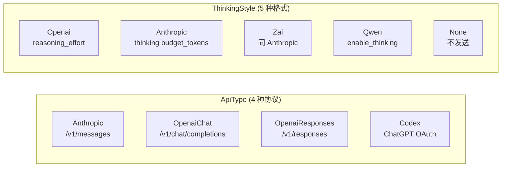

**`ProviderConfig`** — 单个 Provider 的完整配置：

| 字段 | 类型 | 说明 |
|------|------|------|
| `id` | UUID | 唯一标识 |
| `name` | String | 用户自定义显示名 |
| `api_type` | ApiType | 协议类型 |
| `base_url` | String | API 端点 |
| `api_key` | String | 认证凭据（Codex 为空） |
| `models` | Vec\<ModelConfig\> | 可用模型列表 |
| `enabled` | bool | 启用/禁用 |
| `thinking_style` | ThinkingStyle | 推理参数格式 |

**`ModelConfig`** — 单个模型的配置：

| 字段 | 类型 | 说明 |
|------|------|------|
| `id` | String | 模型标识（如 `claude-sonnet-4-6`） |
| `input_types` | Vec\<String\> | `["text", "image", "video"]` |
| `context_window` | u32 | 上下文窗口（tokens） |
| `max_tokens` | u32 | 最大输出 tokens |
| `reasoning` | bool | 是否支持推理 |
| `cost_input` / `cost_output` | f64 | 百万 token 定价（USD） |

**`ProviderStore`** — 全局配置根，持久化到 `~/.opencomputer/config.json`：
- `providers`: 已注册的 Provider 列表
- `active_model`: 当前选中的模型 `{providerId, modelId}`
- `fallback_models`: 降级模型链
- 子配置：`compact`、`notification`、`imageGenerate`、`canvas`、`webSearch` 等

### 1.2 前端模板

**`src/components/settings/provider-setup/templates.ts`**

28 个内置 Provider 模板，108+ 个预设模型，覆盖：
- 国际：Anthropic、OpenAI (×2)、DeepSeek、Google Gemini、xAI、Mistral、OpenRouter、Groq、Together、NVIDIA、Hugging Face
- 国内：Moonshot、通义千问、火山引擎、智谱、MiniMax、Kimi Coding、小米 MiMo、百度千帆、阿里云百炼、BytePlus
- 安全/代理：Chutes (TEE)、Cloudflare AI Gateway、LiteLLM
- 本地：Ollama、vLLM、LM Studio

---

## 2. Agent 核心

### 2.1 LlmProvider 枚举

**`src-tauri/src/agent/types.rs`**

```rust
enum LlmProvider {
    Anthropic { api_key, base_url, model },
    OpenAIChat { api_key, base_url, model },
    OpenAIResponses { api_key, base_url, model },
    Codex { access_token, account_id, model },
}
```

### 2.2 AssistantAgent 结构体

**`src-tauri/src/agent/types.rs`**

| 字段 | 说明 |
|------|------|
| `provider` | LlmProvider 枚举，决定走哪个 API |
| `thinking_style` | ThinkingStyle，控制推理参数格式 |
| `conversation_history` | `Mutex<Vec<JSON>>`，完整对话状态 |
| `context_window` | 模型上下文窗口大小 |
| `compact_config` | 上下文压缩配置 |
| `denied_tools` | 深度分层工具策略 |
| `plan_agent_mode` | Plan/Build Agent 模式切换 |

### 2.3 Chat 分发器

**`src-tauri/src/agent/mod.rs`**

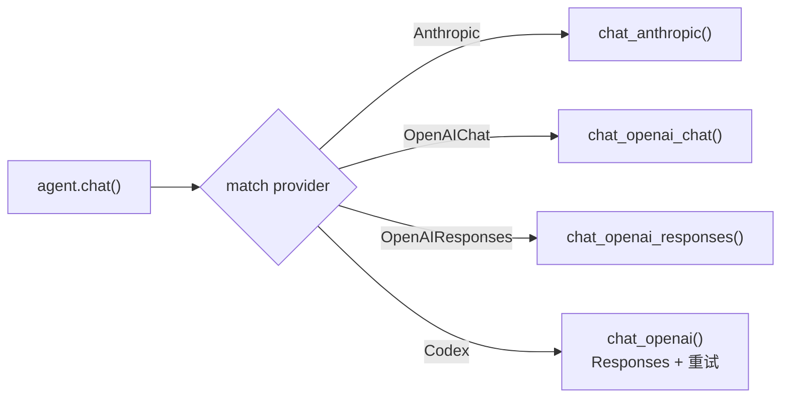

---

## 3. 对话流程

### 3.1 主流程

**`src-tauri/src/commands/chat.rs`**

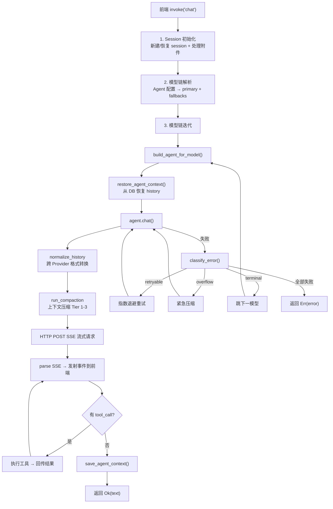

### 3.2 事件流 (Channel\<String\>)

Provider 通过 `on_delta` 回调实时推送 JSON 事件：

| 事件类型 | 字段 | 说明 |
|---------|------|------|
| `text_delta` | `content` | 增量文本 |
| `thinking_delta` | `content` | 增量推理内容 |
| `tool_call` | `call_id`, `name`, `arguments` | 工具调用开始 |
| `tool_result` | `call_id`, `result`, `duration_ms`, `is_error` | 工具执行结果 |
| `usage` | `input_tokens`, `output_tokens`, `model`, `ttft_ms` | Token 用量 |
| `context_compacted` | `tier_applied`, `tokens_before`, `tokens_after` | 上下文压缩通知 |
| `model_fallback` | `model`, `from_model`, `reason` | 模型降级通知 |

### 3.3 前端事件处理

**`src/components/chat/useChatStream.ts`**

- `text_delta` + `thinking_delta`：缓冲 + `requestAnimationFrame` 批量刷新（60fps）
- `tool_call` → 先同步 flush 缓冲区 → 创建 ToolCallBlock 组件（pending 状态）
- `tool_result` → 更新 ToolCallBlock（完成/错误状态）
- `thinking_delta` → ThinkingBlock 组件（可折叠，自动展开配置）

---

## 4. Provider 实现详解

### 4.1 Anthropic Messages API

**`src-tauri/src/agent/providers/anthropic.rs`**

**请求格式：**
```json
{
  "model": "claude-sonnet-4-6",
  "max_tokens": 16384,
  "system": [{ "type": "text", "text": "...", "cache_control": { "type": "ephemeral" } }],
  "messages": [...],
  "tools": [...],
  "stream": true,
  "thinking": { "type": "enabled", "budget_tokens": 4096 }
}
```

> `cache_control` 用于 Prompt Cache 复用，详见 [Side Query 缓存架构](side-query.md)。

**History 格式（assistant 消息）：**
```json
{
  "role": "assistant",
  "content": [
    { "type": "thinking", "thinking": "推理过程..." },
    { "type": "text", "text": "回复内容" },
    { "type": "tool_use", "id": "call_123", "name": "read", "input": {...} }
  ]
}
```

**Thinking 回传**：thinking 块写入 content 数组，下一轮原样回传给 API，保证多轮推理连贯。

### 4.2 OpenAI Chat Completions API

**`src-tauri/src/agent/providers/openai_chat.rs`**

**ThinkingStyle 分发（`apply_thinking_to_chat_body`）：**

| ThinkingStyle | 参数格式 | 适用 Provider |
|---------------|---------|-------------|
| Openai | `reasoning_effort: "high"` | OpenAI、DeepSeek、Mistral、xAI 等 |
| Anthropic | `thinking: { type: "enabled", budget_tokens: N }` | MiniMax、Kimi Coding |
| Zai | 同 Anthropic | 智谱 Z.AI |
| Qwen | `enable_thinking: true` | 通义千问、阿里云百炼 |
| None | 不发送 | 自定义 Provider |

**Thinking 来源（两种）：**
1. **`reasoning_content` 字段**（o3/o4-mini 等原生推理模型）→ 直接从 SSE delta 提取
2. **`<think>` 标签**（Qwen/DeepSeek 等）→ `ThinkTagFilter` 状态机实时解析，分离 thinking 和 text

**History 格式（assistant 消息）：**
```json
{
  "role": "assistant",
  "content": "回复内容",
  "reasoning_content": "推理过程...",
  "tool_calls": [{ "id": "call_123", "type": "function", "function": { "name": "read", "arguments": "{...}" } }]
}
```

### 4.3 OpenAI Responses API

**`src-tauri/src/agent/providers/openai_responses.rs`**

**请求格式：**
```json
{
  "model": "o3",
  "store": false,
  "stream": true,
  "instructions": "系统提示词",
  "input": [...],
  "reasoning": { "effort": "high", "summary": "auto" },
  "include": ["reasoning.encrypted_content"],
  "tools": [...]
}
```

**关键特性：`reasoning.encrypted_content` 回传**

1. 请求中加 `include: ["reasoning.encrypted_content"]`
2. SSE 响应中，`response.output_item.done` 事件携带完整 reasoning item（含加密内容）
3. 通过 raw JSON 解析捕获完整 reasoning item（保留所有字段）
4. reasoning items 存入 `conversation_history`，下一轮原样回传
5. 对齐 OpenClaw 的 `thinkingSignature` 机制

**SSE 事件处理：**

| 事件 | 处理 |
|------|------|
| `response.reasoning_summary_text.delta` | → `emit_thinking_delta` + 累积 |
| `response.reasoning_summary_part.done` | → 追加 `\n\n` 段落分隔 |
| `response.output_text.delta` | → `emit_text_delta` + 累积 |
| `response.output_item.added` (function_call) | → 创建 pending tool call |
| `response.output_item.done` (reasoning) | → 捕获完整 reasoning item JSON |
| `response.output_item.done` (function_call) | → 完成 tool call |
| `response.completed` | → 提取 usage + fallback 文本提取 |

**History 格式：**
```json
[
  { "role": "user", "content": "问题" },
  { "type": "reasoning", "id": "rs_xxx", "encrypted_content": "...", "summary": [...] },
  { "type": "message", "role": "assistant", "content": [{ "type": "output_text", "text": "回复" }], "status": "completed" },
  { "type": "function_call", "id": "fc_xxx", "call_id": "fc_xxx", "name": "read", "arguments": "{...}" },
  { "type": "function_call_output", "call_id": "fc_xxx", "output": "文件内容" }
]
```

### 4.4 Codex OAuth API

**`src-tauri/src/agent/providers/codex.rs`**

与 OpenAI Responses API 相同的请求/响应格式，额外特性：
- **OAuth 认证**：`Authorization: Bearer {access_token}` + `chatgpt-account-id` header
- **重试逻辑**：最多 3 次指数退避重试（1s → 2s → 4s）
- **共享 SSE 解析**：调用 `parse_openai_sse()`（与 Responses API 共享）

---

## 5. Thinking/Reasoning 系统

### 5.1 推理参数映射

**`src-tauri/src/agent/config.rs`**

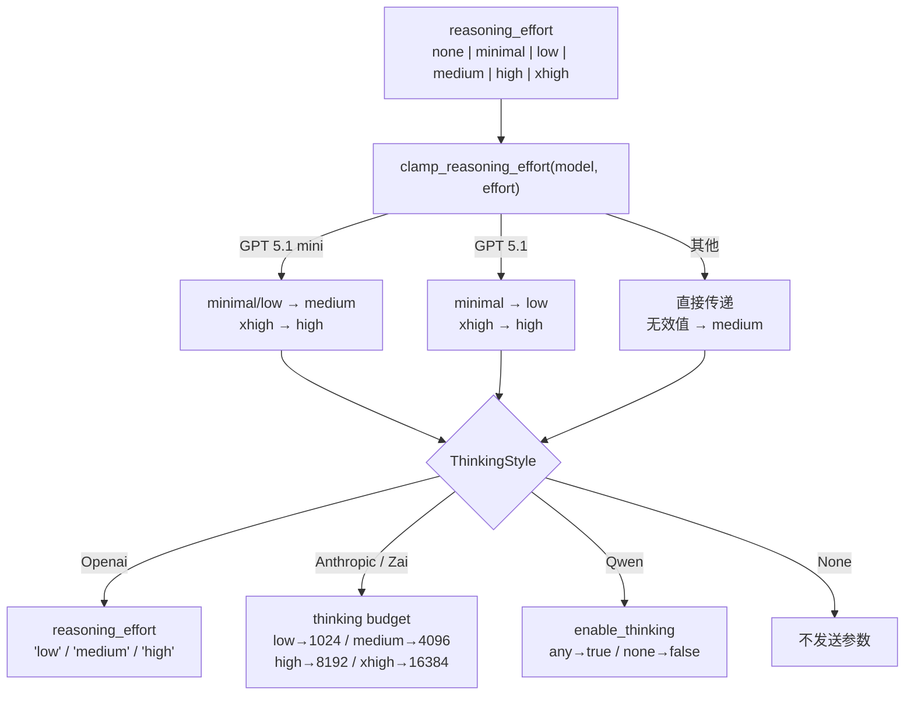

### 5.2 ThinkTagFilter

**`src-tauri/src/agent/types.rs`**

有状态的流式解析器，用于从 Chat Completions 响应中提取 `<think>` 标签内的内容：

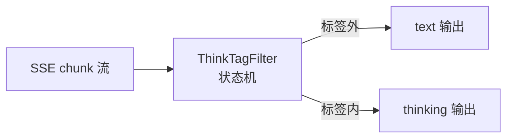

- 支持 `<think>`、`<thinking>`、`<thought>` 标签（大小写不敏感）
- 处理跨 chunk 边界的部分标签
- 当 `reasoning_effort == "none"` 时丢弃 thinking 内容

### 5.3 多轮 Thinking 回传

每个 Provider 在 conversation_history 中保存 thinking 内容，确保下一轮对话时模型能看到之前的推理：

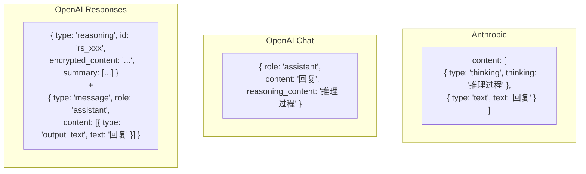

---

## 6. History 格式标准化

### 6.1 问题

当 failover 降级或用户手动切换模型时，`conversation_history` 中可能包含**另一个 Provider 格式**的消息。例如 Responses API 的 `{ type: "reasoning" }` 项被发送给 Anthropic API 会导致错误。

### 6.2 解决方案

**`src-tauri/src/agent/context.rs`** 中三个标准化函数，每个 Provider 在读取 history 时调用：

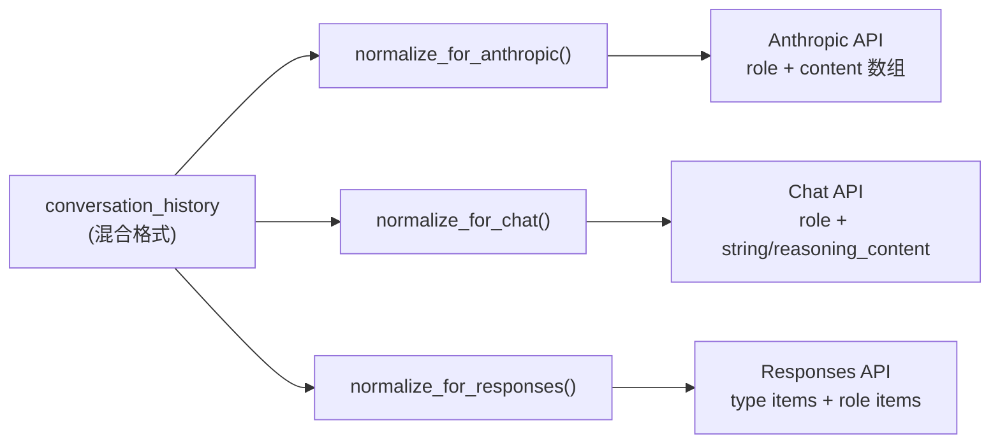

**`normalize_history_for_anthropic()`**

| 输入格式 | 转换 |
|---------|------|
| `type: "reasoning"` (加密) | 跳过 |
| `type: "function_call"` | 跳过（Anthropic 用 tool_use） |
| `type: "function_call_output"` | 跳过 |
| `type: "message"` (Responses) | 提取 output_text → `{ role, content: text }` |
| `reasoning_content` 字段 (Chat) | 转为 `[{ type: "thinking" }, { type: "text" }]` 数组 |
| 标准 role 消息 | 直通 |

**`normalize_history_for_chat()`**

| 输入格式 | 转换 |
|---------|------|
| `type: "reasoning"` | 跳过 |
| `type: "function_call"` / `function_call_output` | 跳过 |
| `type: "message"` (Responses) | 提取 text → `{ role, content: text }` |
| Anthropic content 数组 (thinking+text) | text → `content`，thinking → `reasoning_content` |
| 标准 role 消息 | 直通 |

**`normalize_history_for_responses()`**

| 输入格式 | 转换 |
|---------|------|
| 原生 Responses 项 | 直通 |
| Anthropic tool_use/tool_result 数组 | 跳过（Responses 用 function_call） |
| Anthropic content 数组 | 提取 text → `{ role, content: text }` |
| `reasoning_content` 字段 | 移除 |
| 标准 role 消息 | 直通 |

### 6.3 调用时机

```rust
// 每个 Provider 的 chat_* 方法开头：
let mut messages = Self::normalize_history_for_anthropic(&self.conversation_history.lock().unwrap());
let mut messages = Self::normalize_history_for_chat(&self.conversation_history.lock().unwrap());
let mut input = Self::normalize_history_for_responses(&self.conversation_history.lock().unwrap());
```

---

## 7. Failover 降级系统

### 7.1 错误分类

**`src-tauri/src/failover.rs`**

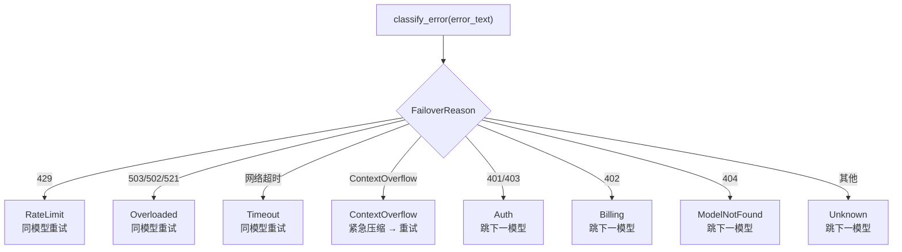

### 7.2 模型链解析

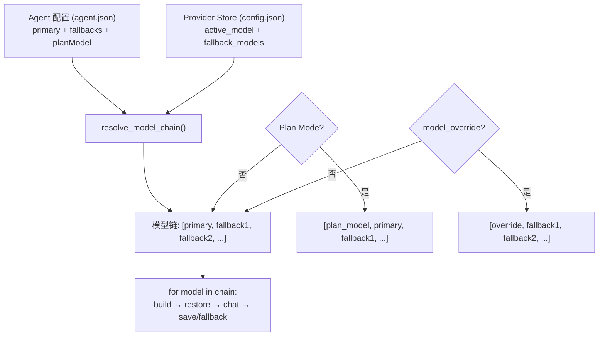

### 7.3 重试策略

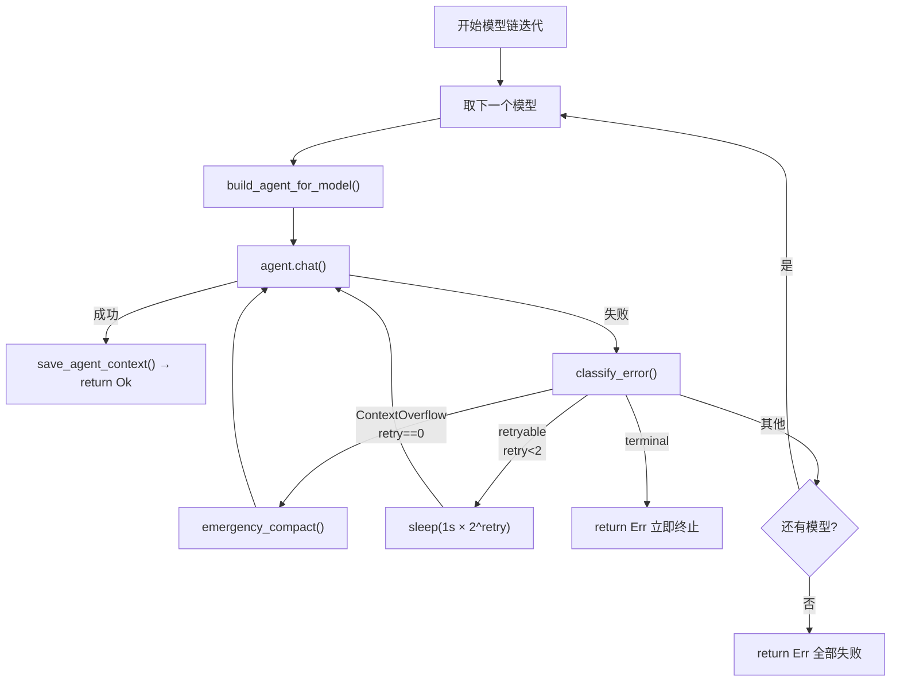

---

## 8. 数据落盘存储与加载

### 8.0 双轨存储架构

对话数据存在**两条并行的持久化通道**，服务于不同目的：

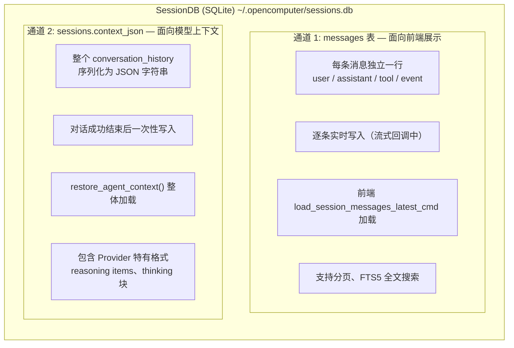

**为什么需要两条通道？**
- `messages` 表：行式结构，方便前端分页展示、搜索、统计 token 用量
- `context_json` 列：保留完整的 Provider API 格式，直接喂给下一轮 API 调用，无需格式转换

### 8.1 通道 1：messages 表 — 逐条实时写入

**Schema（`src-tauri/src/session/db.rs`）：**

```sql
CREATE TABLE messages (
  id              INTEGER PRIMARY KEY AUTOINCREMENT,
  session_id      TEXT NOT NULL,
  role            TEXT NOT NULL,      -- user|assistant|tool|text_block|thinking_block|event
  content         TEXT DEFAULT '',     -- 消息文本内容
  timestamp       TEXT NOT NULL,
  attachments_meta TEXT,               -- 附件 JSON 元数据
  model           TEXT,                -- 使用的模型 ID
  tokens_in       INTEGER,             -- 输入 token 数
  tokens_out      INTEGER,             -- 输出 token 数
  reasoning_effort TEXT,               -- 推理强度
  tool_call_id    TEXT,                -- 工具调用 ID
  tool_name       TEXT,                -- 工具名
  tool_arguments  TEXT,                -- 工具参数 JSON
  tool_result     TEXT,                -- 工具结果
  tool_duration_ms INTEGER,            -- 工具执行耗时
  is_error        INTEGER DEFAULT 0,   -- 是否工具错误
  thinking        TEXT,                -- 思维过程（独立列）
  ttft_ms         INTEGER,             -- Time to First Token
  FOREIGN KEY (session_id) REFERENCES sessions(id) ON DELETE CASCADE
);

-- FTS5 全文搜索（仅索引 user/assistant 消息）
CREATE VIRTUAL TABLE messages_fts USING fts5(content, content='messages', content_rowid='id');
CREATE TRIGGER messages_fts_ai AFTER INSERT ON messages
  WHEN new.role IN ('user', 'assistant') AND length(new.content) > 0
  BEGIN INSERT INTO messages_fts(rowid, content) VALUES (new.id, new.content); END;
```

**写入时机（`src-tauri/src/commands/chat.rs`）：**

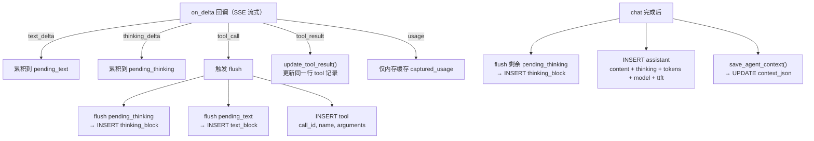

**消息角色（`MessageRole` 枚举）：**

| Role | 说明 | 写入时机 |
|------|------|---------|
| `user` | 用户输入 | chat 命令开始时 |
| `assistant` | AI 最终回复 | chat 完成后 |
| `tool` | 工具调用记录 | tool_call 事件时（result 后续更新） |
| `text_block` | 中间文本片段 | tool_call 前 flush |
| `thinking_block` | 中间思维片段 | tool_call 前 flush |
| `event` | 系统事件（降级通知等） | failover / 错误时 |

**为什么需要 text_block / thinking_block？**

多轮 tool loop 中，消息顺序是：thinking → text → tool_call → tool_result → thinking → text → tool_call → ...

如果只在最后写一条 assistant 消息，中间的 thinking/text 片段与 tool_call 的时序关系会丢失。`text_block` 和 `thinking_block` 保留了多轮执行过程中的完整时序。

### 8.2 通道 2：context_json — 整体序列化

**Schema：**
```sql
-- sessions 表的 context_json 列
ALTER TABLE sessions ADD COLUMN context_json TEXT;
```

**写入（`save_agent_context`）：**
```rust
fn save_agent_context(db: &SessionDB, session_id: &str, agent: &AssistantAgent) {
    let history: Vec<Value> = agent.get_conversation_history();
    let json_str: String = serde_json::to_string(&history);
    db.save_context(session_id, &json_str);
    // → UPDATE sessions SET context_json = ?1 WHERE id = ?2
}
```

**加载（`restore_agent_context`）：**
```rust
fn restore_agent_context(db: &SessionDB, session_id: &str, agent: &AssistantAgent) {
    if let Some(json_str) = db.load_context(session_id) {
        let history: Vec<Value> = serde_json::from_str(&json_str);
        agent.set_conversation_history(history);
    }
    // → SELECT context_json FROM sessions WHERE id = ?1
}
```

**context_json 中的数据格式（取决于最后使用的 Provider）：**

```json
// Anthropic 格式
[
  { "role": "user", "content": "你好" },
  { "role": "assistant", "content": [
    { "type": "thinking", "thinking": "用户在打招呼..." },
    { "type": "text", "text": "你好！" }
  ]},
  { "role": "user", "content": [{ "type": "tool_result", "tool_use_id": "call_1", "content": "..." }] }
]

// OpenAI Responses 格式
[
  { "role": "user", "content": "你好" },
  { "type": "reasoning", "id": "rs_xxx", "encrypted_content": "...", "summary": [...] },
  { "type": "message", "role": "assistant", "content": [{ "type": "output_text", "text": "你好！" }], "status": "completed" },
  { "type": "function_call", "id": "fc_xxx", "call_id": "fc_xxx", "name": "read", "arguments": "{...}" },
  { "type": "function_call_output", "call_id": "fc_xxx", "output": "文件内容" }
]

// OpenAI Chat 格式
[
  { "role": "system", "content": "..." },
  { "role": "user", "content": "你好" },
  { "role": "assistant", "content": "你好！", "reasoning_content": "用户在打招呼..." },
  { "role": "assistant", "content": null, "tool_calls": [{ "id": "call_1", "type": "function", "function": { "name": "read", "arguments": "{...}" } }] },
  { "role": "tool", "tool_call_id": "call_1", "content": "文件内容" }
]
```

### 8.3 写入时序全景

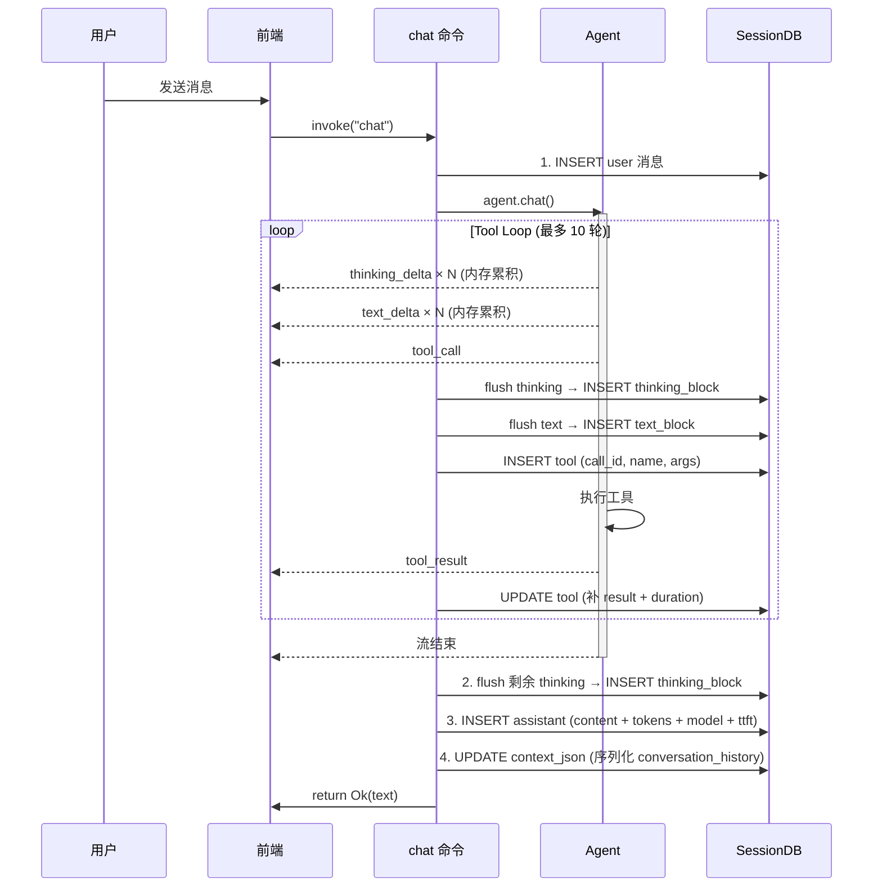

### 8.4 加载时序

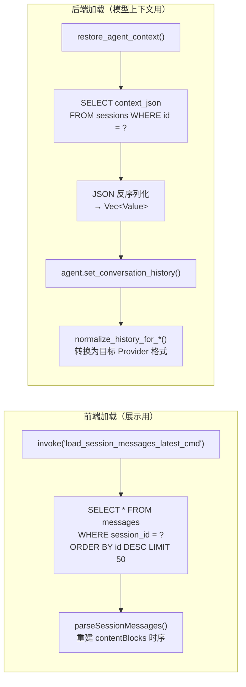

### 8.5 Failover 场景的存储交互

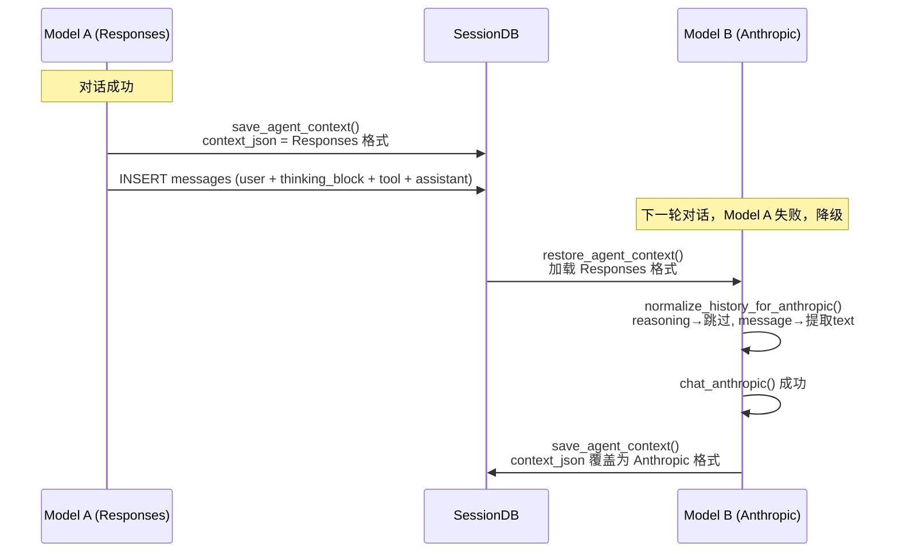

### 8.6 附件存储

```
~/.opencomputer/
  attachments/
    {session_id}/
      {uuid}.png        ← 图片文件
      {uuid}.pdf        ← 文件附件
  generated-images/
    {timestamp}_{uuid}.png  ← AI 生成的图片
```

- 附件在 chat 命令开始时保存到磁盘
- `attachments_meta` JSON 存入 messages 表（名称、MIME、大小、路径）
- Session 删除时级联清理附件目录

---

## 9. 上下文管理

### 9.1 4 层渐进式压缩

**`src-tauri/src/context_compact/`**

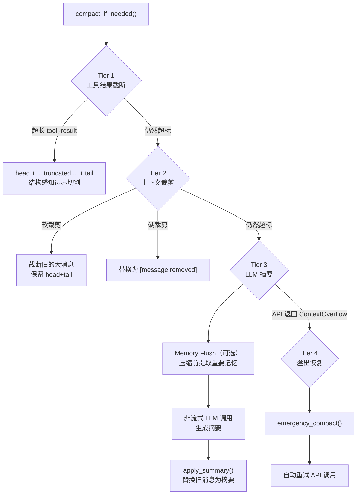

### 9.2 Summarization 消息格式处理

**`src-tauri/src/context_compact/summarization.rs`**

摘要构建时，需要正确处理所有 Provider 格式的消息：

| 消息格式 | 摘要处理 |
|---------|---------|
| `type: "reasoning"` (加密) | 跳过（不可读） |
| `type: "function_call"` | `[tool_call]: name(args_preview)` |
| `type: "function_call_output"` | `[tool_result]: output_preview` |
| `type: "message"` (Responses) | 提取 output_text → `[assistant]: text` |
| Anthropic `thinking` 块 | `[assistant/thinking]: preview(300chars)` |
| Anthropic `text` 块 | `[assistant]: text` |
| Chat `reasoning_content` | `[assistant/thinking]: preview(300chars)` |
| 简单字符串 content | `[role]: text` |
| `tool_result` (Anthropic) | `[tool_result]: preview(500chars)` |

### 9.3 Session 持久化

**`src-tauri/src/session/db.rs`**

```sql
-- 核心表结构
sessions (id, title, agent_id, provider_id, model_id, plan_mode, plan_steps, ...)
messages  (id, session_id, role, content, thinking, model, tokens_in, tokens_out,
           tool_call_id, tool_name, tool_arguments, tool_result, tool_duration_ms, ttft_ms, ...)
messages_fts (FTS5 全文搜索索引，覆盖 user/assistant 消息)
```

**上下文保存/恢复：**
```rust
// 保存：序列化 conversation_history 为 JSON 存入 DB
save_agent_context(db, session_id, agent)
  → agent.get_conversation_history() → JSON string → db.save_context()

// 恢复：从 DB 加载 JSON 反序列化为 Vec<Value>
restore_agent_context(db, session_id, agent)
  → db.load_context() → Vec<Value> → agent.set_conversation_history()
```

---

## 10. 数据流全景图

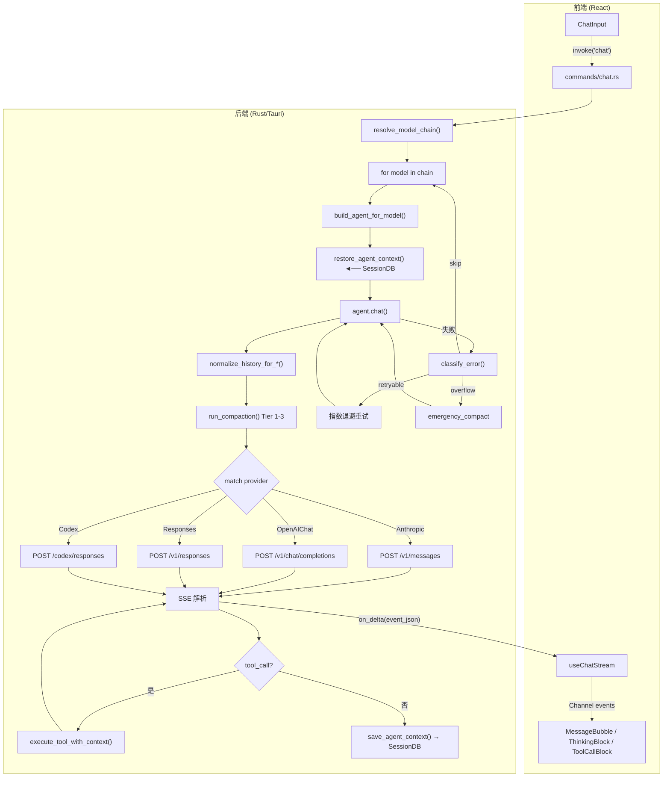

---

## 11. 关键文件索引

| 模块 | 文件 | 职责 |
|------|------|------|
| Provider 配置 | `src-tauri/src/provider.rs` | ApiType、ThinkingStyle、ProviderConfig、模型链解析 |
| Agent 核心 | `src-tauri/src/agent/mod.rs` | 构造器、chat 分发、系统提示词组装 |
| Agent 类型 | `src-tauri/src/agent/types.rs` | LlmProvider、AssistantAgent、ThinkTagFilter |
| Anthropic | `src-tauri/src/agent/providers/anthropic.rs` | Messages API + thinking 块回传 |
| Chat Completions | `src-tauri/src/agent/providers/openai_chat.rs` | ThinkingStyle 分发 + reasoning_content 回传 |
| Responses API | `src-tauri/src/agent/providers/openai_responses.rs` | encrypted_content 回传 + reasoning item 捕获 |
| Codex OAuth | `src-tauri/src/agent/providers/codex.rs` | Responses 变体 + 重试逻辑 |
| 推理参数 | `src-tauri/src/agent/config.rs` | 5 种 ThinkingStyle 映射、effort 钳制 |
| 内容构建 | `src-tauri/src/agent/content.rs` | 各 Provider 的用户消息格式构建 |
| 事件发射 | `src-tauri/src/agent/events.rs` | text_delta、thinking_delta、tool_call 等 |
| 上下文管理 | `src-tauri/src/agent/context.rs` | history 标准化、push_user_message、run_compaction |
| 上下文压缩 | `src-tauri/src/context_compact/` | 4 层压缩 + 摘要构建 |
| Failover | `src-tauri/src/failover.rs` | 错误分类、重试策略 |
| Session DB | `src-tauri/src/session/` | SQLite 持久化、消息 FTS 搜索 |
| Chat 命令 | `src-tauri/src/commands/chat.rs` | 主流程编排、模型链迭代、上下文保存恢复 |
| 前端模板 | `src/components/settings/provider-setup/templates.ts` | 28 个 Provider 模板 |
| 前端 Hook | `src/components/chat/useChatStream.ts` | 事件处理、delta 批量刷新 |
| Dashboard 定价 | `src-tauri/src/dashboard.rs` | `estimate_cost()` 50+ 模型定价规则 |
