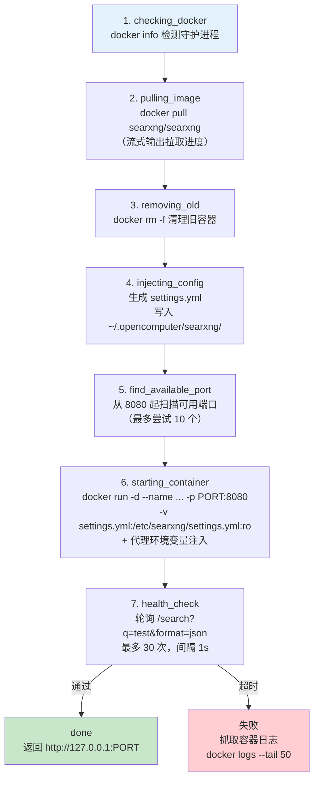
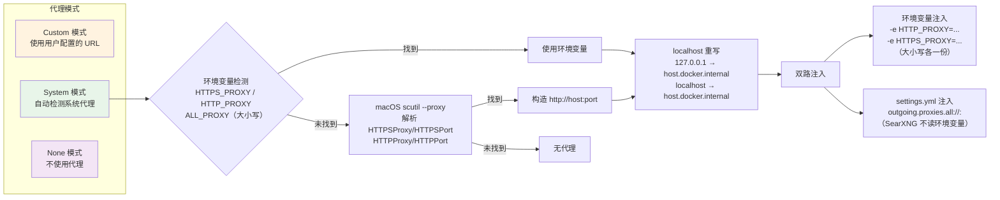

# Docker Sandbox 架构
> 返回 [文档索引](../README.md) | 更新时间：2026-04-05

## 概述

Docker Sandbox 模块为 OpenComputer 提供本地 SearXNG 搜索引擎的容器化部署与管理能力。该模块负责 Docker 环境检测、SearXNG 镜像拉取与容器部署、配置注入（`settings.yml`）、代理转发、健康检查以及完整的容器生命周期管理（启动/停止/删除）。

核心设计原则：
- **全异步**：所有 Docker CLI 操作通过 `tokio::process::Command` 异步执行，不阻塞 UI
- **并发安全**：`AtomicBool` 互斥锁防止并发部署/生命周期操作
- **状态缓存**：5 秒 TTL 缓存避免冗余状态查询和搜索测试
- **代理透传**：三模式代理架构确保容器内引擎可访问外部搜索服务

## 模块结构

| 文件 | 行数 | 职责 |
|------|------|------|
| `mod.rs` | 66 | 模块入口、常量定义、全局状态（`DEPLOYING`/`DEPLOY_PROGRESS`/`STATUS_LOCK`）、日志工具 |
| `status.rs` | 130 | 状态聚合查询（`SearxngDockerStatus`），带 TTL 缓存的 `status()` |
| `deploy.rs` | 204 | 7 步部署流水线，流式进度回调 |
| `lifecycle.rs` | 80 | 容器启动 / 停止 / 删除操作 |
| `helpers.rs` | 314 | Docker CLI 封装、端口探测、配置生成、健康检查、搜索测试 |
| `proxy.rs` | 96 | 代理解析（Custom / System / None 三模式），macOS `scutil` 系统代理检测 |
| **合计** | **890** | |

## 常量定义

| 常量 | 值 | 说明 |
|------|----|------|
| `CONTAINER_NAME` | `"opencomputer-searxng"` | Docker 容器名称 |
| `IMAGE` | `"searxng/searxng"` | Docker Hub 镜像 |
| `DEFAULT_HOST_PORT` | `8080` | 宿主机默认映射端口 |
| `SEARXNG_DIR_NAME` | `"searxng"` | 配置目录名（`~/.opencomputer/searxng/`） |
| `STATUS_CACHE_TTL_SECS` | `5` | 状态缓存有效期（秒） |

## Docker 可用性检测

`docker_status()` 函数执行两步检测：

1. **CLI 检测**：执行 `docker --version`，判断 Docker CLI 是否安装
2. **守护进程检测**：执行 `docker info`，判断 Docker daemon 是否运行

返回 `(cli_installed: bool, daemon_running: bool)` 元组。`status_inner()` 在此基础上逐层检查容器存在性、运行状态、端口映射、健康检查和搜索测试，最终聚合为 `SearxngDockerStatus` 结构体。

状态查询通过 `tokio::sync::Mutex` + 5 秒 TTL 缓存保护，避免前端高频轮询时重复执行昂贵的搜索测试。

## 部署流程



部署通过 `AtomicBool::compare_exchange` 实现互斥，防止并发部署。部署进度通过 `DEPLOY_PROGRESS`（`LazyLock<Mutex<DeployProgress>>`）共享给 UI，保留最近 100 行日志。部署完成后自动清除进度并失效状态缓存。

## 配置注入：settings.yml 生成

`prepare_searxng_config()` 在 `~/.opencomputer/searxng/` 目录下生成 `settings.yml`，通过 Docker volume mount（`:ro`）注入容器：

```yaml
use_default_settings: true
server:
  secret_key: "<随机32位十六进制或复用已有>"
  limiter: false
search:
  formats:
    - html
    - json
# 以下仅在代理开启时生成
outgoing:
  proxies:
    all://:
      - http://host.docker.internal:1082
  request_timeout: 10.0
```

关键设计：
- **secret_key 持久化**：首次生成随机密钥，后续部署从已有 `settings.yml` 中解析复用，避免容器重启后密钥变更导致崩溃
- **limiter 关闭**：本地部署无需速率限制
- **JSON 格式启用**：供 `web_search` 工具通过 JSON API 调用

## 代理架构



代理注入受 `web_search.searxng_docker_use_proxy` 配置项控制（默认开启）。SearXNG 使用自有网络模块，不读取标准 `HTTP_PROXY` 环境变量，因此必须通过 `settings.yml` 的 `outgoing.proxies` 配置。环境变量注入作为补充，覆盖其他可能的网络请求。

## 网络隔离

| 层面 | 策略 |
|------|------|
| **端口映射** | 仅映射 `127.0.0.1:PORT -> 8080`，不暴露到外网 |
| **配置挂载** | `settings.yml` 以 `:ro`（只读）挂载，容器无法修改宿主配置 |
| **健康检查** | 使用 `reqwest::Client::no_proxy()` 直连本地，避免代理干扰 |
| **代理地址重写** | 容器内通过 `host.docker.internal` 访问宿主机代理服务 |
| **端口探测** | 部署前通过 `TcpListener::bind` 检测端口可用性，冲突时自动递增（最多 +10） |

## 生命周期操作

| 操作 | 函数 | Docker 命令 | 前置检查 | 附加行为 |
|------|------|-------------|----------|----------|
| **启动** | `start()` | `docker start` | `DEPLOYING` 互斥 | 启动前重新生成 `settings.yml`（使代理变更生效）；启动后执行健康检查（5 次 / 1s 间隔） |
| **停止** | `stop()` | `docker stop` | `DEPLOYING` 互斥 | - |
| **删除** | `remove()` | `docker rm -f` | `DEPLOYING` 互斥 | 强制删除（`-f`），无论容器是否运行 |
| **部署** | `deploy()` | 完整 7 步流水线 | `compare_exchange` 原子互斥 | 部署后清除进度、失效状态缓存 |

所有生命周期操作在 `DEPLOYING` 标志为 `true` 时直接返回错误，防止部署过程中的冲突操作。

## 错误处理

| 错误场景 | 处理策略 |
|----------|----------|
| Docker 未安装 | `status()` 返回 `docker_installed: false`，部署时 bail |
| Docker daemon 未运行 | `status()` 返回 `docker_not_running: true`，提示用户启动 Docker Desktop |
| 镜像拉取失败 | 捕获 stderr，通过进度回调输出错误日志，bail 中止部署 |
| 容器启动失败 | 捕获 stderr，bail 并附带错误详情 |
| 健康检查超时（30s） | 自动抓取容器最近 50 行日志（`docker logs --tail 50`），附带日志 bail |
| 端口占用 | 从 `DEFAULT_HOST_PORT` 起递增扫描，最多尝试 10 个端口 |
| 并发部署冲突 | `AtomicBool::compare_exchange` 原子操作，返回 "already in progress" 错误 |
| 并发生命周期冲突 | 检查 `DEPLOYING` 标志，部署中时拒绝 start/stop/remove |
| `DEPLOY_PROGRESS` 锁中毒 | `unwrap_or_else` 恢复，记录警告日志 |
| `settings.yml` 解析失败 | 生成新的随机 `secret_key`，不中断流程 |
| 搜索测试失败 | 非阻塞，`search_ok: false` + 记录 `unresponsive_engines`，不影响容器运行状态 |

## 关键源文件

| 文件路径 | 核心导出 |
|----------|----------|
| `src-tauri/src/docker/mod.rs` | `CONTAINER_NAME`, `IMAGE`, `DEFAULT_HOST_PORT`, `DEPLOYING`, `DEPLOY_PROGRESS`, `STATUS_LOCK` |
| `src-tauri/src/docker/status.rs` | `SearxngDockerStatus`, `status()` |
| `src-tauri/src/docker/deploy.rs` | `deploy()` |
| `src-tauri/src/docker/lifecycle.rs` | `start()`, `stop()`, `remove()` |
| `src-tauri/src/docker/helpers.rs` | `docker_status()`, `inspect_container()`, `inspect_port()`, `prepare_searxng_config()`, `health_check()`, `search_test()` |
| `src-tauri/src/docker/proxy.rs` | `resolve_proxy_for_container()` |
