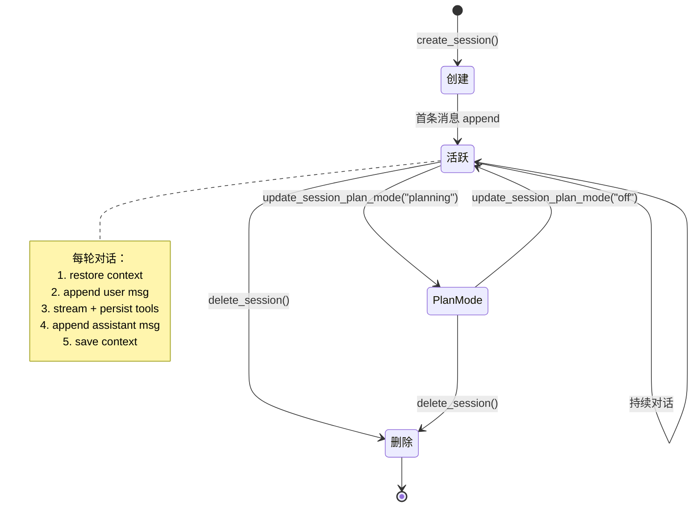
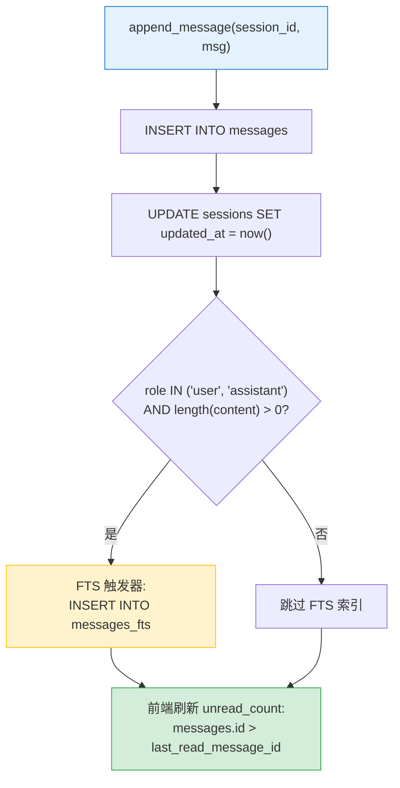

# Session 会话系统架构

> 返回 [文档索引](../README.md) | 更新时间：2026-04-05

## 目录

- [概述](#概述)
- [数据模型](#数据模型)
  - [SessionMeta](#sessionmeta)
  - [SessionMessage](#sessionmessage)
  - [MessageRole](#messagerole)
  - [NewMessage Builder](#newmessage-builder)
- [SQLite Schema](#sqlite-schema)
- [核心 API](#核心-api)
  - [会话管理](#会话管理)
  - [消息 CRUD](#消息-crud)
  - [元数据更新](#元数据更新)
  - [上下文持久化](#上下文持久化)
  - [Plan Mode 崩溃恢复](#plan-mode-崩溃恢复)
  - [已读状态](#已读状态)
  - [全文搜索](#全文搜索)
  - [Subagent 运行记录](#subagent-运行记录)
  - [ACP 运行记录](#acp-运行记录)
- [会话生命周期](#会话生命周期)
- [特殊设计](#特殊设计)
- [关联文档](#关联文档)
- [文件清单](#文件清单)

---

## 概述

Session 模块是 OpenComputer 的会话与消息持久化系统，基于 SQLite WAL 模式实现高并发读写。所有对话数据（会话元信息、消息内容、工具调用记录、Agent 上下文快照、子 Agent 运行记录、ACP 运行记录）统一存储在 `~/.opencomputer/sessions.db`。

核心职责：

1. **会话生命周期管理** — 创建、列表（分页）、删除、元数据更新
2. **消息持久化** — user / assistant / tool / event / text_block / thinking_block 六种角色
3. **上下文快照** — conversation_history JSON 序列化存储，支持跨重启恢复
4. **全文搜索** — FTS5 虚拟表 + unicode61 分词器，自动触发器同步
5. **未读追踪** — 基于 `last_read_message_id` 水位线的轻量已读/未读机制
6. **子系统记录** — Subagent 运行和 ACP 运行的完整 CRUD

## 数据模型

### SessionMeta

会话元信息，用于列表展示和路由。

| 字段 | 类型 | 说明 |
|---|---|---|
| `id` | `String` | UUID v4 主键 |
| `title` | `Option<String>` | 会话标题（首条消息自动生成，≤50 字符） |
| `agent_id` | `String` | 关联 Agent ID，默认 `"default"` |
| `provider_id` | `Option<String>` | 当前使用的 Provider ID |
| `provider_name` | `Option<String>` | Provider 显示名称 |
| `model_id` | `Option<String>` | 当前使用的模型 ID |
| `created_at` | `String` | RFC 3339 创建时间 |
| `updated_at` | `String` | RFC 3339 最后更新时间 |
| `message_count` | `i64` | 消息总数（子查询计算） |
| `unread_count` | `i64` | 未读消息数（子查询计算） |
| `is_cron` | `bool` | 是否为定时任务创建的会话 |
| `parent_session_id` | `Option<String>` | 父会话 ID（子 Agent 会话） |
| `plan_mode` | `String` | Plan Mode 状态：`"off"` / `"planning"` / `"executing"` |
| `channel_info` | `Option<ChannelSessionInfo>` | IM Channel 关联信息（LEFT JOIN channel_conversations） |

### SessionMessage

单条消息记录，涵盖所有消息类型的超集字段。

| 字段 | 类型 | 说明 |
|---|---|---|
| `id` | `i64` | 自增主键 |
| `session_id` | `String` | 所属会话 ID |
| `role` | `MessageRole` | 消息角色 |
| `content` | `String` | 消息内容 |
| `timestamp` | `String` | RFC 3339 时间戳 |
| `attachments_meta` | `Option<String>` | 附件元信息 JSON（User 消息） |
| `model` | `Option<String>` | 响应模型名（Assistant 消息） |
| `tokens_in` / `tokens_out` | `Option<i64>` | Token 用量统计 |
| `reasoning_effort` | `Option<String>` | 推理强度设置 |
| `ttft_ms` | `Option<i64>` | Time To First Token（毫秒） |
| `tool_call_id` | `Option<String>` | 工具调用 ID |
| `tool_name` | `Option<String>` | 工具名称 |
| `tool_arguments` | `Option<String>` | 工具参数 JSON |
| `tool_result` | `Option<String>` | 工具执行结果 |
| `tool_duration_ms` | `Option<i64>` | 工具执行耗时（毫秒） |
| `is_error` | `Option<bool>` | 工具是否执行失败 |
| `thinking` | `Option<String>` | 思考内容（Assistant 消息内联存储） |

### MessageRole

6 种消息角色枚举：

```
User          — 用户输入
Assistant     — 模型响应
Event         — 系统事件（错误通知、模型降级等）
Tool          — 工具调用及结果
TextBlock     — 中间文本块（工具调用前的文本输出，保持顺序）
ThinkingBlock — 中间思考块（工具调用前的思考输出，保持多轮思考顺序）
```

`TextBlock` 和 `ThinkingBlock` 是流式输出中的中间态消息。当模型在输出过程中穿插工具调用时，引擎会将已累积的文本/思考 flush 为独立消息，确保 UI 展示顺序与模型输出顺序一致。

### NewMessage Builder

`NewMessage` 提供 6 个便捷构造函数，统一设置时间戳和角色：

| 构造函数 | 角色 | 说明 |
|---|---|---|
| `NewMessage::user(content)` | User | 简单用户消息 |
| `NewMessage::assistant(content)` | Assistant | 模型响应 |
| `NewMessage::tool(call_id, name, args, result, duration, is_error)` | Tool | 工具调用记录 |
| `NewMessage::text_block(content)` | TextBlock | 中间文本块 |
| `NewMessage::thinking_block(content)` | ThinkingBlock | 中间思考块 |
| `NewMessage::thinking_block_with_duration(content, duration_ms)` | ThinkingBlock | 带耗时的思考块 |
| `NewMessage::event(content)` | Event | 系统事件 |

## SQLite Schema

数据库在 `SessionDB::open()` 时自动创建表和索引，并通过渐进式 Migration 添加新列。

### 主表

```sql
-- 会话表
CREATE TABLE sessions (
    id TEXT PRIMARY KEY,
    title TEXT,
    agent_id TEXT NOT NULL DEFAULT 'default',
    provider_id TEXT,
    provider_name TEXT,
    model_id TEXT,
    created_at TEXT NOT NULL,
    updated_at TEXT NOT NULL,
    context_json TEXT,              -- Agent conversation_history 快照
    last_read_message_id INTEGER DEFAULT 0,
    is_cron INTEGER NOT NULL DEFAULT 0,
    parent_session_id TEXT,
    plan_mode TEXT DEFAULT 'off',
    plan_steps TEXT                 -- Plan 步骤进度 JSON（崩溃恢复）
);

-- 消息表
CREATE TABLE messages (
    id INTEGER PRIMARY KEY AUTOINCREMENT,
    session_id TEXT NOT NULL,
    role TEXT NOT NULL,
    content TEXT NOT NULL DEFAULT '',
    timestamp TEXT NOT NULL,
    attachments_meta TEXT,
    model TEXT,
    tokens_in INTEGER,
    tokens_out INTEGER,
    reasoning_effort TEXT,
    tool_call_id TEXT,
    tool_name TEXT,
    tool_arguments TEXT,
    tool_result TEXT,
    tool_duration_ms INTEGER,
    is_error INTEGER DEFAULT 0,
    thinking TEXT,
    ttft_ms INTEGER,
    FOREIGN KEY (session_id) REFERENCES sessions(id) ON DELETE CASCADE
);
```

### 索引

```sql
CREATE INDEX idx_messages_session_id ON messages(session_id);
CREATE INDEX idx_sessions_agent_id ON sessions(agent_id);
CREATE INDEX idx_sessions_updated_at ON sessions(updated_at DESC);
```

### FTS5 全文搜索

```sql
-- 虚拟表（unicode61 分词器支持 CJK）
CREATE VIRTUAL TABLE messages_fts USING fts5(
    content,
    content='messages',
    content_rowid='id',
    tokenize='unicode61'
);

-- 自动同步触发器（仅索引 user/assistant 非空消息）
CREATE TRIGGER messages_fts_ai AFTER INSERT ON messages
WHEN new.role IN ('user', 'assistant') AND length(new.content) > 0
BEGIN
    INSERT INTO messages_fts(rowid, content) VALUES (new.id, new.content);
END;

CREATE TRIGGER messages_fts_ad AFTER DELETE ON messages
WHEN old.role IN ('user', 'assistant') AND length(old.content) > 0
BEGIN
    INSERT INTO messages_fts(messages_fts, rowid, content) VALUES('delete', old.id, old.content);
END;
```

### 子 Agent / ACP 运行表

```sql
-- 子 Agent 运行记录
CREATE TABLE subagent_runs (
    run_id TEXT PRIMARY KEY,
    parent_session_id TEXT NOT NULL,
    parent_agent_id TEXT NOT NULL,
    child_agent_id TEXT NOT NULL,
    child_session_id TEXT NOT NULL,
    task TEXT NOT NULL,
    status TEXT NOT NULL DEFAULT 'spawning',  -- spawning/running/completed/error
    result TEXT,
    error TEXT,
    depth INTEGER NOT NULL DEFAULT 1,
    model_used TEXT,
    started_at TEXT NOT NULL,
    finished_at TEXT,
    duration_ms INTEGER,
    label TEXT,
    attachment_count INTEGER DEFAULT 0,
    input_tokens INTEGER,
    output_tokens INTEGER
);

-- ACP 运行记录
CREATE TABLE acp_runs (
    run_id TEXT PRIMARY KEY,
    parent_session_id TEXT NOT NULL,
    backend_id TEXT NOT NULL,
    external_session_id TEXT,
    task TEXT NOT NULL,
    status TEXT NOT NULL DEFAULT 'starting',  -- starting/running/completed/error/timeout/killed
    result TEXT,
    error TEXT,
    model_used TEXT,
    started_at TEXT NOT NULL,
    finished_at TEXT,
    duration_ms INTEGER,
    input_tokens INTEGER,
    output_tokens INTEGER,
    label TEXT,
    pid INTEGER
);
```

## 核心 API

### 会话管理

| 方法 | 说明 |
|---|---|
| `create_session(agent_id)` | 创建新会话，返回 `SessionMeta` |
| `create_session_with_parent(agent_id, parent_id)` | 创建子 Agent 会话 |
| `get_session(session_id)` | 获取单个会话元信息（含 Channel LEFT JOIN） |
| `list_sessions(agent_id)` | 列出所有会话（按 updated_at DESC） |
| `list_sessions_paged(agent_id, limit, offset)` | 分页列表，返回 `(sessions, total_count)` |
| `delete_session(session_id)` | 删除会话（CASCADE 删消息 + 清理 plan 文件 + 附件目录） |

### 消息 CRUD

| 方法 | 说明 |
|---|---|
| `append_message(session_id, msg)` | 追加消息并更新 `updated_at`，返回消息 ID |
| `load_session_messages(session_id)` | 加载全部消息（ASC 排序） |
| `load_session_messages_latest(session_id, limit)` | 加载最新 N 条消息 + 总数（首屏加载） |
| `load_session_messages_before(session_id, before_id, limit)` | 向上翻页加载（scroll up） |
| `update_tool_result(session_id, call_id, result, duration, is_error)` | 更新工具执行结果（按 call_id 匹配） |

### 元数据更新

| 方法 | 说明 |
|---|---|
| `update_session_title(session_id, title)` | 更新会话标题 |
| `update_session_model(session_id, provider_id, provider_name, model_id)` | 更新当前模型信息 |
| `mark_session_cron(session_id)` | 标记为 Cron 会话 |
| `update_session_plan_mode(session_id, plan_mode)` | 更新 Plan Mode 状态 |

### 上下文持久化

| 方法 | 说明 |
|---|---|
| `save_context(session_id, context_json)` | 保存 Agent 的 `conversation_history` JSON |
| `load_context(session_id)` | 加载上下文 JSON（无则返回 None） |

上下文以 `Vec<serde_json::Value>` 序列化为 JSON 字符串，存储在 `sessions.context_json` 列。Chat Engine 在每次请求开始时调用 `restore_agent_context()` 恢复，请求结束后调用 `save_agent_context()` 持久化。

### Plan Mode 崩溃恢复

| 方法 | 说明 |
|---|---|
| `save_plan_steps(session_id, steps_json)` | 持久化 Plan 步骤进度 JSON |
| `load_plan_steps(session_id)` | 加载 Plan 步骤进度 |

Plan 执行过程中，步骤进度实时写入 `sessions.plan_steps` 列。应用崩溃重启后可从此列恢复执行进度，避免重复执行已完成步骤。

### 已读状态

基于 `last_read_message_id` 水位线机制：未读数 = `messages.id > last_read_message_id AND role != 'user'` 的记录数。

| 方法 | 说明 |
|---|---|
| `mark_session_read(session_id)` | 标记单个会话已读 |
| `mark_session_read_batch(session_ids)` | 批量标记已读 |
| `mark_all_sessions_read()` | 全部标记已读 |

### 全文搜索

```rust
pub fn search_messages(query, agent_id, limit) -> Vec<SessionSearchResult>
```

- 使用 FTS5 `MATCH` 语法，每个 token 用双引号包裹实现精确匹配
- 自动排除 `is_cron = 1` 和 `parent_session_id IS NOT NULL` 的会话
- 返回 `SessionSearchResult`：session_id, session_title, message_role, content_snippet（≤300 字符）, timestamp, relevance_rank

### Subagent 运行记录

| 方法 | 说明 |
|---|---|
| `insert_subagent_run(run)` | 插入运行记录 |
| `update_subagent_status(run_id, status, result, error, model, duration)` | 更新状态 |
| `set_subagent_finished_at(run_id, finished_at)` | 设置完成时间 |
| `get_subagent_run(run_id)` | 获取单条记录 |
| `list_subagent_runs(parent_session_id)` | 列出父会话的全部运行 |
| `list_active_subagent_runs(parent_session_id)` | 列出活跃运行（spawning/running） |
| `count_active_subagent_runs(parent_session_id)` | 计数活跃运行 |
| `cleanup_orphan_subagent_runs()` | 启动时清理孤儿运行（标记为 error） |

### ACP 运行记录

| 方法 | 说明 |
|---|---|
| `insert_acp_run(run_id, parent_session_id, backend_id, task, label)` | 插入运行记录 |
| `update_acp_run_status(run_id, status, pid, external_session_id)` | 更新状态和进程信息 |
| `finish_acp_run(run_id, status, result, error, input_tokens, output_tokens)` | 完成运行（自动计算 duration） |
| `get_acp_run(run_id)` | 获取单条记录 |
| `list_acp_runs(parent_session_id)` | 列出父会话的全部运行 |

## 会话生命周期



## 特殊设计

### 消息持久化流程



### 消息顺序保持（TextBlock / ThinkingBlock）

LLM 流式输出中，模型可能在输出文本的中途发起工具调用。为保持 UI 展示顺序与模型实际输出顺序一致，Chat Engine 在遇到 `tool_call` 事件时将已累积的 text / thinking 内容 flush 为独立的 `TextBlock` / `ThinkingBlock` 消息，插入到 tool_call 消息之前。

### 未读追踪

使用水位线方案而非逐条标记，避免大量 UPDATE。`last_read_message_id` 记录用户最后阅读到的消息 ID，未读数通过子查询实时计算。

### 会话删除清理

`delete_session()` 除了 CASCADE 删除消息外，还清理：
- `~/.opencomputer/plans/{session_id}.md` — Plan 文件
- `~/.opencomputer/attachments/{session_id}/` — 附件目录

### FTS 索引容错

- 仅索引 `user` 和 `assistant` 角色的非空消息（tool/event 等不索引）
- 删除时 WHEN 条件与插入一致，避免删除未索引消息导致 FTS 损坏
- `open()` 时执行 `FTS rebuild` 修复可能的已有损坏
- `delete_session()` 失败时尝试 rebuild FTS 后重试

### Channel 集成

会话列表通过 `LEFT JOIN channel_conversations` 获取 IM Channel 关联信息，前端据此展示渠道标识（Telegram / WeChat 等图标和发送者名称）。

### 自动标题生成

`auto_title()` 从首条用户消息生成标题：取第一行，≤50 字符直接使用，超过则截断到 47 字符 + `"..."`。使用字符计数（非字节长度）正确处理 CJK 和 emoji。

## 关联文档

- [Chat Engine](chat-engine.md) — 对话引擎，Session 的主要调用方
- [Plan Mode](plan-mode.md) — Plan Mode 状态管理与步骤持久化
- [Subagent](subagent.md) — 子 Agent 系统，使用 subagent_runs 表

## 文件清单

| 文件 | 行数 | 职责 |
|---|---|---|
| `crates/oc-core/src/session/mod.rs` | 9 | 模块声明和 re-export |
| `crates/oc-core/src/session/types.rs` | 284 | SessionMeta, SessionMessage, MessageRole, NewMessage 类型定义 |
| `crates/oc-core/src/session/db.rs` | 894 | SessionDB 核心实现（open, CRUD, FTS, 已读, Migration） |
| `crates/oc-core/src/session/helpers.rs` | 33 | auto_title + db_path 辅助函数 |
| `crates/oc-core/src/session/subagent_db.rs` | 200 | Subagent 运行记录 CRUD |
| `crates/oc-core/src/session/acp_db.rs` | 237 | ACP 运行记录 CRUD |
| `src-tauri/src/commands/session.rs` | 131 | Tauri 命令层（11 个命令） |
