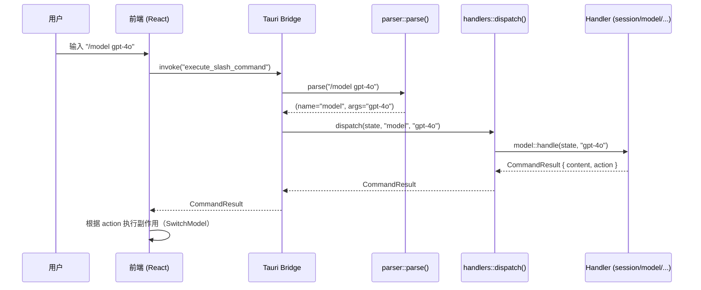
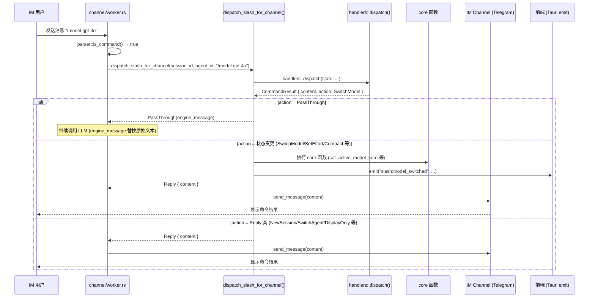
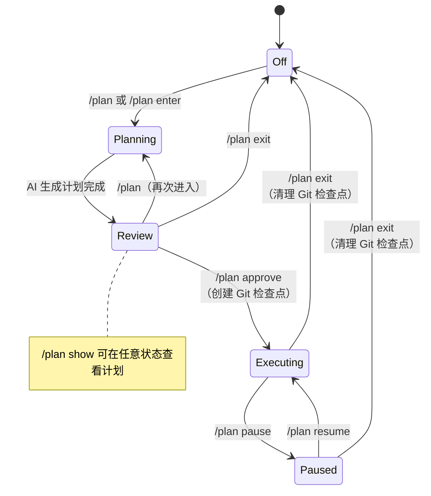

# 斜杠命令系统 (Slash Commands)

OpenComputer 内置斜杠命令系统，用户在**聊天输入框**或**任意 IM 渠道**（Telegram 等）中输入 `/` 前缀即可触发。命令按类别分组，支持参数、模糊匹配和动态技能扩展。

## 架构概述

```
src-tauri/src/slash_commands/
├── mod.rs          # Tauri 命令入口（list / execute / is_slash_command）
├── types.rs        # 数据结构（SlashCommandDef / CommandResult / CommandAction）
├── parser.rs       # 解析器（"/" 前缀 → 命令名 + 参数）
├── registry.rs     # 命令注册表（所有内置命令定义）
└── handlers/       # 命令处理器
    ├── mod.rs      # dispatch 分发入口
    ├── session.rs  # 会话类命令
    ├── model.rs    # 模型类命令
    ├── memory.rs   # 记忆类命令
    ├── agent.rs    # Agent 类命令
    ├── plan.rs     # 计划模式命令
    └── utility.rs  # 工具类命令
```

### 处理流程

斜杠命令有两条分发路径，共用同一套 `handlers::dispatch()`：

**路径 A — UI 前端（聊天输入框）**



**路径 B — IM 渠道（Telegram 等）**



### 前端通信（UI 路径专用）

| Tauri 命令 | 功能 |
|---|---|
| `list_slash_commands` | 列出所有可用命令（含动态技能命令），用于 UI 菜单渲染 |
| `execute_slash_command` | 执行斜杠命令，返回 `CommandResult` |
| `is_slash_command` | 快速判断文本是否为斜杠命令 |

---

## 命令分类

### 📋 Session — 会话管理

| 命令 | 参数 | 说明 | 副作用 (Action) |
|---|---|---|---|
| `/new` | 无 | 创建新会话 | `NewSession` |
| `/clear` | 无 | 删除当前会话所有消息 | `SessionCleared` |
| `/compact` | 无 | 压缩当前会话上下文（触发渐进式压缩） | `Compact` |
| `/stop` | 无 | 停止当前流式回复 | `StopStream` |
| `/rename` | `<title>` 必需 | 重命名当前会话标题 | `DisplayOnly` |
| `/plan` | `[exit\|show\|approve\|pause\|resume]` | 进入/管理计划模式（详见下方） | 多种 |

### 🤖 Model — 模型控制

| 命令 | 参数 | 说明 | 副作用 (Action) |
|---|---|---|---|
| `/model` | `[name]` 可选 | 无参数：列出所有可用模型（标记当前活跃模型）；有参数：模糊匹配切换模型 | `SwitchModel` 或 `DisplayOnly` |
| `/think` | `<level>` 必需 | 设置推理思考强度 | `SetEffort` |

**`/model` 模糊匹配优先级**：精确 ID → 精确名称 → 前缀匹配 → 包含匹配。歧义时列出所有候选项。

**`/think` 可选值**：

| 值 | 说明 |
|---|---|
| `off` / `none` | 关闭思考模式 |
| `low` | 低强度思考 |
| `medium` | 中等强度思考 |
| `high` | 高强度思考 |
| `xhigh` | 超高强度思考 |

### 🧠 Memory — 记忆管理

| 命令 | 参数 | 说明 | 副作用 (Action) |
|---|---|---|---|
| `/remember` | `<text>` 必需 | 保存一条记忆（Global 作用域，User 类型） | `DisplayOnly` |
| `/forget` | `<query>` 必需 | 搜索并删除最匹配的一条记忆 | `DisplayOnly` |
| `/memories` | 无 | 列出所有记忆（最多 20 条），显示类型、ID 和内容预览 | `DisplayOnly` |

### 🕵️ Agent — Agent 管理

| 命令 | 参数 | 说明 | 副作用 (Action) |
|---|---|---|---|
| `/agent` | `<name>` 必需 | 模糊匹配切换 Agent（自动创建新会话） | `SwitchAgent` |
| `/agents` | 无 | 列出所有可用 Agent（含 emoji、名称、描述） | `DisplayOnly` |

### 🔧 Utility — 实用工具

| 命令 | 参数 | 说明 | 副作用 (Action) |
|---|---|---|---|
| `/help` | 无 | 显示所有命令列表（按类别分组） | `DisplayOnly` |
| `/status` | 无 | 显示当前会话状态（Agent、模型、会话 ID、消息数） | `DisplayOnly` |
| `/export` | 无 | 将当前会话导出为 Markdown 文件 | `ExportFile` |
| `/usage` | 无 | 显示当前会话的 Token 用量统计（输入/输出/总数/轮数） | `DisplayOnly` |
| `/permission` | `<mode>` 必需 | 设置工具权限模式 | `SetToolPermission` |
| `/search` | `<query>` 必需 | 将搜索请求传递给 LLM 处理 | `PassThrough` |

**`/permission` 可选值**：

| 值 | 说明 |
|---|---|
| `auto` | 自动批准工具调用 |
| `ask` / `ask_every_time` | 每次工具调用前询问用户 |
| `full` / `full_approve` | 完全批准模式 |

### 🎯 Skill — 动态技能命令

技能命令不在注册表中硬编码，而是在运行时从技能系统动态加载。通过 `list_slash_commands` 接口合并返回。

- 技能名称通过 `normalize_skill_command_name()` 规范化为命令名
- 与内置命令名冲突时自动添加 `_skill` 后缀
- 支持两种分发模式：
  - **工具分发** (`command_dispatch == "tool"`)：包装为工具调用指令传递给 LLM
  - **直接传递**：包装为技能调用指令传递给 LLM

---

## `/plan` 子命令详解

计划模式（Plan Mode）是一个六态状态机，`/plan` 命令控制状态转换：



| 子命令 | 说明 | 前置状态 | Action |
|---|---|---|---|
| `/plan` 或 `/plan enter` | 进入计划模式 | 任意 | `EnterPlanMode` |
| `/plan show` | 显示当前计划内容 | 任意 | `ShowPlan` |
| `/plan approve` | 批准计划，开始执行（创建 Git 检查点） | Review | `ApprovePlan` |
| `/plan pause` | 暂停执行中的计划 | Executing | `PausePlan` |
| `/plan resume` | 恢复暂停的计划 | Paused | `ResumePlan` |
| `/plan exit` | 退出计划模式，清理 Git 检查点 | 任意 | `ExitPlanMode` |

---

## CommandAction 类型一览

`CommandResult.action` 字段告诉前端需要执行什么副作用：

| Action | 说明 | 触发命令 | IM 渠道行为 | 前端事件 |
|---|---|---|---|---|
| `NewSession` | 切换到新创建的会话 | `/new` | ✅ 更新 channel_db 映射到新 session | — |
| `SessionCleared` | 会话消息已清空 | `/clear` | ✅ DB 已清理 + 回复确认 | `slash:session_cleared` |
| `SwitchAgent` | 切换 Agent 并创建新会话 | `/agent <name>` | ✅ 更新 channel_db 映射到新 session | — |
| `PassThrough` | 将消息传递给 LLM 处理 | `/search`, 技能命令 | ✅ 以转换后的指令作为 LLM 输入 | — |
| `DisplayOnly` | 仅显示内容，无副作用 | `/help`, `/status`, `/usage`, `/memories` 等 | ✅ 直接回复 content | — |
| `SwitchModel` | 切换活跃模型 | `/model <name>` | ✅ 调用 `set_active_model_core` 持久化切换 | `slash:model_switched` |
| `SetEffort` | 设置推理强度 | `/think <level>` | ✅ 调用 `set_reasoning_effort_core` 写入 AppState | `slash:effort_changed` |
| `SetToolPermission` | 设置工具权限模式 | `/permission <mode>` | ⚡ 返回"不适用"提示（Channel 固定 auto-approve） | — |
| `ExportFile` | 下载导出文件 | `/export` | ✅ 自动写入 `~/.opencomputer/exports/` 并回复路径 | — |
| `StopStream` | 停止流式输出 | `/stop` | ✅ 通过 `ChannelCancelRegistry` 取消活跃流 | — |
| `Compact` | 触发上下文压缩 | `/compact` | ✅ 调用 `compact_context_now_core` 执行压缩 | — |
| `ViewSystemPrompt` | 查看系统提示词 | `/prompts` | ✅ 构建完整 system prompt 作为回复返回 | — |
| `EnterPlanMode` | 进入计划模式 | `/plan` | ✅ DB 状态已持久化 + 回复确认 | `slash:plan_changed` |
| `ExitPlanMode` | 退出计划模式 | `/plan exit` | ✅ DB 状态已持久化 + Git 检查点清理 | `slash:plan_changed` |
| `ApprovePlan` | 批准并开始执行计划 | `/plan approve` | ✅ DB 状态已持久化 + Git 检查点创建 | `slash:plan_changed` |
| `ShowPlan` | 在面板中显示计划 | `/plan show` | ✅ 将 plan 内容作为回复返回 | `slash:plan_changed` |
| `PausePlan` | 暂停计划执行 | `/plan pause` | ✅ DB 状态已持久化 + 回复确认 | `slash:plan_changed` |
| `ResumePlan` | 恢复计划执行 | `/plan resume` | ✅ DB 状态已持久化 + 回复确认 | `slash:plan_changed` |

> **前端事件说明**：Channel 执行状态变更类命令后，会通过 Tauri `emit()` 发送 `slash:*` 事件通知前端 UI 同步更新（如模型选择器、effort 指示器、消息列表等）。前端在 `ChatScreen.tsx` 中统一监听这些事件。
>
> **⚡ 标注说明**：`/permission` 在 Channel 中不适用，因为 Channel 对话固定使用 auto-approve 模式，不需要交互式权限审批。

---

## 参数选项 (arg_options)

部分命令定义了 `arg_options`——预设的可选参数列表。在不同端有不同的交互方式：

### 前端 UI

`SlashCommandMenu` 对 `arg_options` 命令渲染可展开子菜单：

- 用户输入 `/<cmd>` 后回车或点击命令 → 展开选项子菜单
- 键盘方向键在选项间导航，回车执行选定选项
- Escape / 左箭头 返回命令列表
- 仍可手动输入参数（如 `/think high`）跳过子菜单

### IM 渠道 (Telegram)

Channel 对有 `arg_options` 的命令提供 inline keyboard 按钮：

- 用户发送无参数的命令（如 `/think`）→ 返回选项按钮，每个选项一行
- 按钮 `callback_data` 格式：`slash:<command> <option>`（如 `slash:think high`）
- 用户点击按钮 → Telegram 发送 `CallbackQuery` → `polling.rs` 转换为 `/<command> <option>` 文本
- `dispatch_slash_for_channel` 正常执行命令

**特殊处理 — `/model` 无参数**：

- 返回所有可用模型的 inline keyboard 按钮（每行最多 2 个）
- 当前活跃模型标记 `✓` 前缀
- 按钮 `callback_data` 格式：`slash:model <model_name>`
- 最多展示 20 个模型

### 有 arg_options 的命令

| 命令 | 选项 |
|---|---|
| `/think` | `off`, `low`, `medium`, `high`, `xhigh` |
| `/plan` | `enter`, `exit`, `show`, `approve`, `pause`, `resume` |
| `/permission` | `auto`, `ask`, `full` |

---

## 命令快速参考表

| 命令 | 分类 | 参数 | 需要活跃会话 | 说明 |
|---|---|---|---|---|
| `/new` | Session | 无 | 否 | 开始新对话 |
| `/clear` | Session | 无 | 是 | 清空当前对话 |
| `/compact` | Session | 无 | 否 | 压缩上下文 |
| `/stop` | Session | 无 | 否 | 停止当前回复 |
| `/rename` | Session | `<title>` | 是 | 重命名对话 |
| `/plan` | Session | `[子命令]` | 是 | 计划模式 |
| `/model` | Model | `[name]` | 否 | 切换/列出模型 |
| `/think` | Model | `<level>` | 否 | 设置思考强度 |
| `/remember` | Memory | `<text>` | 否 | 保存记忆 |
| `/forget` | Memory | `<query>` | 否 | 删除记忆 |
| `/memories` | Memory | 无 | 否 | 列出记忆 |
| `/agent` | Agent | `<name>` | 否 | 切换 Agent |
| `/agents` | Agent | 无 | 否 | 列出 Agent |
| `/help` | Utility | 无 | 否 | 显示所有命令 |
| `/status` | Utility | 无 | 否 | 会话状态 |
| `/export` | Utility | 无 | 是 | 导出 Markdown |
| `/usage` | Utility | 无 | 是 | Token 用量 |
| `/permission` | Utility | `<mode>` | 否 | 工具权限模式 |
| `/search` | Utility | `<query>` | 否 | 搜索网络 |
