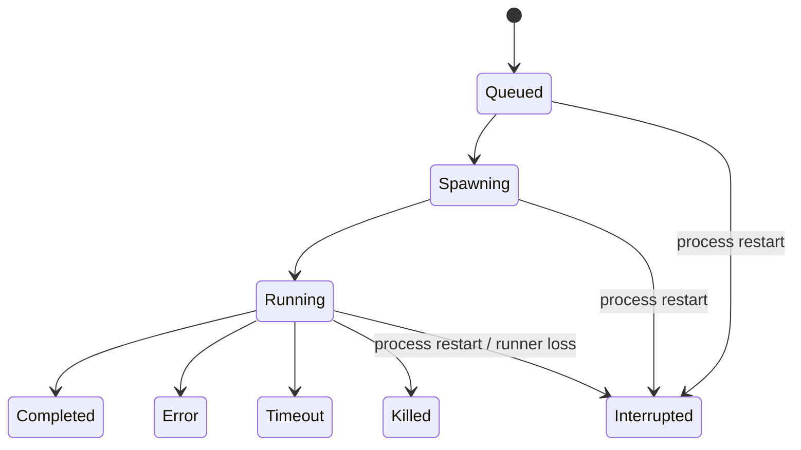
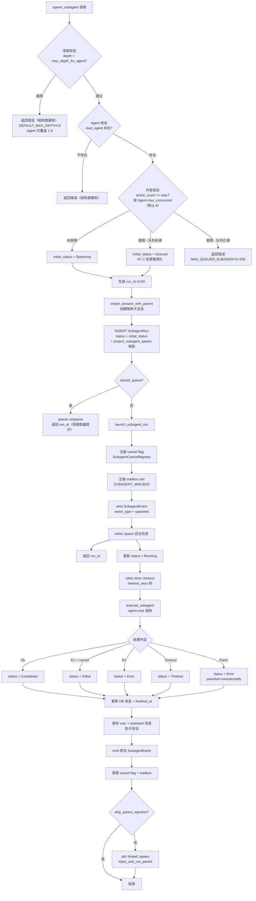
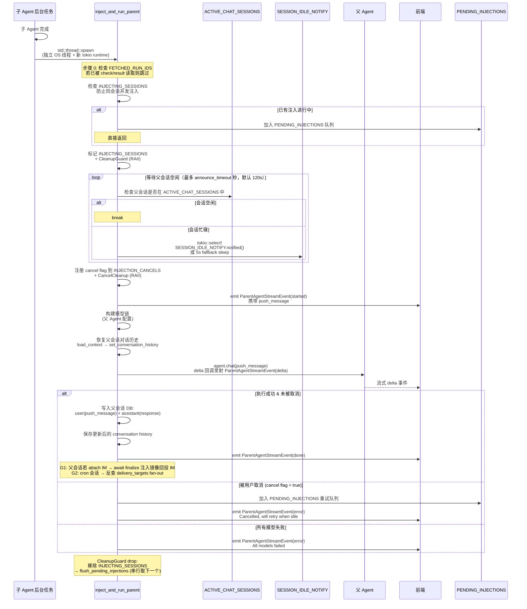

# 子 Agent 系统架构
> 返回 [文档索引](../README.md) | 更新时间：2026-07-23

## 概述

子 Agent 系统允许主 Agent 异步调用子 Agent 执行独立任务。子 Agent 运行在隔离会话中，完成后结果自动注入父会话触发父 Agent 继续对话。系统支持多级嵌套（默认最大深度 3，Agent 可覆盖至 5）、并发限制（单会话默认 8 个，可按 Agent 经 `subagents.maxConcurrent` 配置，clamp 1–50）、实时引导（Steer Mailbox）、终态续跑（Resume）、取消机制、以及前台等待自动转后台的 `spawn_and_wait` 模式。

命中单会话并发上限时**不再拒绝而是排队**（R7.2，新增 `Queued` 状态 + 进程级调度器在槽位空出时按会话提升；结构类上限——深度 / Agent 不存在 / batch 大小 / 权限——仍硬拒，排队解决不了），见「[并发排队（R7.2）](#并发排队r72)」。后台 subagent 命中内层审批点时，会把它在统一后台任务表里的投影置为 **AwaitingApproval**（R8 follow-up），见「[Background Job 投影（R6）](#background-job-投影r6)」末「内层审批投影」行。

注入机制采用事件驱动设计：通过 `SESSION_IDLE_NOTIFY`（tokio::Notify）等待父会话空闲，结合 `ChatSessionGuard` RAII 守卫实现用户消息优先级高于自动注入的语义，被取消的注入任务进入 `PENDING_INJECTIONS` 队列在父会话空闲后串行重试。

## 模块结构

| 文件 | 职责 |
|------|------|
| `subagent/mod.rs` | 模块入口、常量定义（深度/并发/超时/截断）、7 个全局静态量、re-exports |
| `subagent/types.rs` | `SubagentThread`、`SubagentRun`、Owner/Delivery/TerminalReason、SpawnParams、SubagentStatus、事件类型 |
| `subagent/spawn.rs` | `spawn_subagent()` 入口（validate → enqueue \| `launch_subagent_run()`）+ `execute_subagent()` 后台执行逻辑 |
| `subagent/queue.rs` | （R7.2）并发上限排队：`PendingSubagentSpawn` 队列 + per-session 提升调度器 `run_subagent_scheduler()` |
| `subagent/injection.rs` | `inject_and_run_parent()` 结果注入 + `PendingInjection` 队列 + `flush_pending_injections()` |
| `subagent/cancel.rs` | `SubagentCancelRegistry`（AtomicBool cancel flag 注册表） |
| `subagent/mailbox.rs` | `SubagentMailbox`（per-run 消息队列）+ `ChatSessionGuard`（RAII 守卫） |
| `subagent/helpers.rs` | 事件发射、字符串截断、`CleanupGuard`、`cleanup_orphan_runs`、`mark_run_fetched` |
| `tools/subagent.rs` | 工具接口层：canonical `send` + spawn/query/cancel/兼容 alias 的参数解析与调度 |

## 数据模型

### SubagentStatus（八态枚举）

`Queued`（R7.2）：命中单会话并发上限时入队等待，**非终态、不持槽位**（被 `count_active_subagent_runs` 的 `IN ('spawning','running')` 排除——否则排队项会撑高自己的活跃计数、永不提升，死锁）；调度器在槽位空出时把它提升为 `Spawning` 并真正发射。

终态判定：`Completed | Error | Timeout | Killed | Interrupted` 均为 `is_terminal() = true`（`Queued` / `Spawning` / `Running` 非终态）。`Interrupted` 是基础设施终态，不伪装成模型错误；启动恢复把上个进程遗留的 live attempt 原子改为该状态，并保留可续跑建议所需的稳定 `terminal_reason=process_interrupted`。

### Thread / Attempt 身份

- `thread_id` 是稳定子对话身份，当前实现等于 `child_session_id`；同一 thread 复用对话历史与 working dir。
- `run_id` 是一次不可变 attempt。续跑只新增 attempt，并以 `continuation_of_run_id` 连接前驱，绝不把旧 run 从终态改回 running。
- `subagent_threads.current_run_id + lease_epoch` 是单写者 fence。所有生命周期写入必须同时命中当前 run 与 epoch；旧 worker 的晚到完成回调是成功 no-op。
- `owner_kind + owner_id` 是稳定控制域：`parent_session`、`workflow`、`team`、`internal`。知道 run id 不等于获得控制权；普通父 Agent 不能 steer/resume/cancel Workflow 或 Team thread。
- `lifecycle_state=open|user_stopped|quarantined|closed` 是 thread 控制契约；续跑执行层只接受 `open`。V1 尚不提供模型可调用的 reopen，也不启用 heartbeat watchdog 自动切 quarantine；`Killed` 与不可恢复 `terminal_reason` 已在 run 层 fail closed，未来 owner UI / watchdog 只能通过受控 service 推进 lifecycle。

### SubagentRun（SQLite 持久化记录）

| 字段 | 类型 | 说明 |
|------|------|------|
| `run_id` | `String` | UUID v4，运行唯一标识 |
| `thread_id` | `String` | 稳定子对话标识；多个 continuation attempt 共享 |
| `parent_session_id` | `String` | 父会话 ID |
| `parent_agent_id` | `String` | 父 Agent ID |
| `child_agent_id` | `String` | 子 Agent ID（如 `"ha-main"`） |
| `child_session_id` | `String` | 隔离子会话 ID（通过 `create_session_with_parent` 创建，关联父会话） |
| `task` | `String` | 任务描述原文 |
| `status` | `SubagentStatus` | 七态状态枚举（含 `Queued`，R7.2） |
| `result` | `Option<String>` | 执行结果文本（截断至 `MAX_RESULT_CHARS = 10,000` 字符） |
| `error` | `Option<String>` | 错误信息 |
| `depth` | `u32` | 嵌套深度（从 1 开始，每级 +1） |
| `model_used` | `Option<String>` | 实际使用的模型标识（如 `"provider_id::model_id"`） |
| `started_at` | `String` | 创建时间（RFC 3339） |
| `finished_at` | `Option<String>` | 完成时间（RFC 3339） |
| `duration_ms` | `Option<u64>` | 执行耗时（毫秒） |
| `label` | `Option<String>` | 可选显示标签，用于前端追踪 |
| `attachment_count` | `u32` | 传入附件数量 |
| `input_tokens` | `Option<u64>` | 输入 token 用量（预留，当前为 None） |
| `output_tokens` | `Option<u64>` | 输出 token 用量（预留，当前为 None） |
| `continuation_of_run_id` | `Option<String>` | 前一 attempt；初次 spawn 为 None |
| `trigger_kind` | `String` | `spawn` / `parent_followup` / `workflow_resume` / `internal` 等稳定触发来源 |
| `terminal_reason` | `Option<SubagentTerminalReason>` | 稳定终止分类，用于恢复建议与审计 |
| `runner_owner` / `lease_epoch` / `last_heartbeat_at` | runner/epoch/time | 进程与 attempt fencing、恢复诊断；V1 heartbeat 在生命周期转换时刷新，不运行独立轮询 ticker |
| `delivery_kind` | `parent|group|workflow|none` | 结果交付域，执行层真相源 |
| `launch_spec_json` | `Option<String>` | 不含凭据/附件正文的续跑规格摘要 |
| `owner_kind` / `owner_id` | owner tuple | Thread 控制域；普通 session 不得接管 Workflow/Team/internal |

### Durable 控制与交付表

| 表 | 作用 |
| --- | --- |
| `subagent_threads` | 稳定 thread、owner、lifecycle、current attempt、lease epoch |
| `subagent_dispatches` | steer/resume 指令的 accepted/delivered/refused/consumed 审计与排队恢复 |
| `subagent_result_deliveries` | 普通父会话结果的 pending/injecting/delivered/suppressed CAS；启动时只重放未完成交付 |

run 终态与普通 parent delivery row 在同一事务写入；显式 `check/result/wait` 或续跑会先 durable suppress，再触发进程内取消信号。这样 app 在“子 Agent 已完成但父 Agent 尚未收到”窗口崩溃时可重放，而已经消费的结果不会因重启重复回注。

### SpawnParams（调用参数）

| 字段 | 类型 | 说明 |
|------|------|------|
| `task` | `String` | 任务描述 |
| `agent_id` | `String` | 目标 Agent ID |
| `parent_session_id` | `String` | 父会话 ID |
| `parent_agent_id` | `String` | 父 Agent ID |
| `depth` | `u32` | 当前嵌套深度 |
| `timeout_secs` | `Option<u64>` | 执行超时秒数；`None` 使用父 Agent 默认（产品默认 `0` = 不超时），显式 `0` 也表示不超时，正数由工具层 cap 到 1800 |
| `model_override` | `Option<String>` | 模型覆盖（优先级最高） |
| `label` | `Option<String>` | 显示标签 |
| `attachments` | `Vec<Attachment>` | 文件附件列表（支持 base64 和 UTF-8 文本） |
| `plan_agent_mode` | `Option<PlanAgentMode>` | Plan 模式配置（用于 Plan 创建子 Agent） |
| `plan_mode_allow_paths` | `Vec<String>` | Plan 模式文件写入白名单 |
| `skip_parent_injection` | `bool` | 是否跳过自动结果注入 |
| `extra_system_context` | `Option<String>` | 额外系统上下文（如 `PLAN_MODE_SYSTEM_PROMPT`） |
| `skill_allowed_tools` | `Vec<String>` | Skill fork 模式继承的工具白名单 |
| `isolate_worktree` | `bool` | 是否为 child session 尝试创建 Managed Worktree 隔离执行目录 |

`isolate_worktree` 的默认产品语义：

- 用户可见的 `subagent` / `batch_spawn` 工具默认 `true`，让并行实现和长任务探索默认不污染父工作区。
- 内部 plan / team / hook / skill fork helper 默认 `false`，避免只读分析或短生命周期 helper 大量制造 worktree。
- 创建成功后 child session `working_dir` 指向 worktree path，并注入额外 system context 告知子 Agent 当前隔离路径和 worktree id。
- 创建失败时记录告警并继承父会话有效 working dir，避免因环境不支持 git worktree 而使整个父回合失败。需要强隔离保证的上层应显式检查 managed worktree 状态。

### SubagentEvent（前端事件）

| 字段 | 类型 | 说明 |
|------|------|------|
| `event_type` | `String` | `"spawned"` / `"running"` / `"completed"` / `"error"` / `"timeout"` / `"killed"` |
| `run_id` | `String` | 运行 ID |
| `parent_session_id` | `String` | 父会话 ID |
| `child_agent_id` | `String` | 子 Agent ID |
| `child_session_id` | `String` | 子会话 ID |
| `task_preview` | `String` | 任务预览（截断至 50 字符） |
| `status` | `SubagentStatus` | 当前状态 |
| `result_preview` | `Option<String>` | 结果预览（截断至 200 字符） |
| `error` | `Option<String>` | 错误信息 |
| `duration_ms` | `Option<u64>` | 执行耗时 |
| `label` | `Option<String>` | 显示标签（`skip_serializing_if = None`） |
| `input_tokens` | `Option<u64>` | 输入 token（终态事件，`skip_serializing_if = None`） |
| `output_tokens` | `Option<u64>` | 输出 token（终态事件，`skip_serializing_if = None`） |
| `result_full` | `Option<String>` | 完整结果文本（仅终态事件携带，用于前端 push 交付） |

### ParentAgentStreamEvent（注入流式事件）

| 字段 | 类型 | 说明 |
|------|------|------|
| `event_type` | `String` | `"started"` / `"delta"` / `"done"` / `"error"` |
| `parent_session_id` | `String` | 父会话 ID |
| `run_id` | `String` | 关联的子 Agent run ID |
| `push_message` | `Option<String>` | 仅 `"started"` 事件携带，注入的用户消息内容 |
| `delta` | `Option<String>` | 仅 `"delta"` 事件携带，父 Agent 的流式响应增量（raw JSON） |
| `error` | `Option<String>` | 仅 `"error"` 事件携带 |

## Spawn 流程

### execute_subagent 内部逻辑

1. 加载 Agent 配置，解析模型链（model_override > subagents.model > agent.model.primary）
2. 构建 `AssistantAgent`，注入执行上下文（深度信息、任务描述、隔离声明）
3. 若有 `plan_agent_mode`，配置 Plan 模式 + allow_paths
4. 若有 `skill_allowed_tools`，配置工具白名单
5. 继承父 Agent 的 `denied_tools` + Plan 模式限制（防止子 Agent 绕过 Plan 安全）
6. 解析 `model_chain`（`resolve_model_chain`）后委托 `crate::chat_engine::run_chat_engine`——**failover / 重试由 chat engine 内部承担**，`execute_subagent` 自身不跑模型轮换循环；全链失败映射为 `All models failed for sub-agent`
7. cancel flag 经 `cancel: Arc<AtomicBool>` 传入引擎，在 tool loop 迭代与 API 调用前检查，支持即时取消
8. `catch_unwind` 包裹整个执行，保证 panic 不会导致事件丢失

## 结果注入机制

### 注入流程关键设计

- **独立线程**：注入在 `std::thread::spawn` + 独立 `current_thread` tokio runtime 中运行，避免 `inject_and_run_parent → agent.chat() → spawn_subagent → tokio::spawn` 的 Send 循环依赖
- **串行注入**：同一父会话同时只有一个注入在执行（`INJECTING_SESSIONS` 互斥），多个完成的子 Agent 排队
- **用户优先**：`ChatSessionGuard::new()` 立即设置 `INJECTION_CANCELS` 取消正在进行的注入，用户消息永远优先
- **重试保证**：被取消的注入进入 `PENDING_INJECTIONS`，`ChatSessionGuard::drop()` 时 `flush_pending_injections` 每次只取一个重试（串行），下一个在 `CleanupGuard::drop()` 时触发
- **空闲门超时不丢弃（G3/G5）**：父会话忙到 `announce_timeout` 仍未空闲时，**不再 `Abandoned` 到重启 replay**，而是携 `on_injected` 重排队进 `PENDING_INJECTIONS`，在长前台 turn 结束（`ChatSessionGuard::drop`）时重试。对 subagent / Group 注入（`on_injected=None`，无 `injected=0` 重启兜底）尤其关键——Group 合并注入因此不再永久丢失。`Abandoned` 仅剩锁中毒兜底
- **后台完成回投外部面（G1/G2）**：注入 turn 成功后，若父会话 attach 了 IM chat，经 `im_mirror::attach_im_injection_mirror` + **await** `finalize_im_live_mirror` 按 `imReplyMode` 回投 IM（必须 await：注入跑在短命 current-thread runtime 上，spawned finalize 会被腰斩）；cron 会话经 `cron::delivery::deliver_injection_for_session`（反查 `cron_run_logs` → job）下发 `delivery_targets`
- **跳过已读**：`mark_run_fetched(run_id)` 在 check/result 工具中调用，注入前和等待中均检查 `FETCHED_RUN_IDS`

### 异步工具任务复用注入管道

异步工具任务（`async_jobs`，覆盖 `exec` / `web_search` / `image_generate` 等 `BackgroundPolicy::GenericJob` 工具的后台化执行）作为该注入管道的**第二个消费者**：finished tool job 完成后由 `crates/ha-core/src/async_jobs/injection.rs::dispatch_injection` 把任务结果格式化为 push message，并把 `job_id` 当作伪 `run_id` 传给 `subagent::injection::inject_and_run_parent`，复用同一套 idle-wait / 取消 / 重试机制。

`subagent` 工具本身声明为 `BackgroundPolicy::SelfManaged { work_kind: SubagentRun }`，不属于上述通用 job。`spawn` / `resume` 在完成持久化后直接返回 `{workKind:"subagent_run", backgroundPolicy:"self_managed", runId, threadId, waitRequired:false}`，后台 runner、队列、重启恢复、取消与 durable push 均由 `subagent_runs` 状态机负责。执行层拒绝给它传 `run_in_background:true`，避免同时出现外层 `job_id` 与内层 `run_id` 两套状态、取消和投递语义。Workflow 内部 spawn 使用同一 handle 形状，并由 Workflow owner 接管恢复与结果收集。

| 维度 | SubagentRun | 异步工具任务（async_jobs） |
|------|------|------|
| 注入入口 | `spawn::execute_subagent` 完成后 spawn 注入 | `async_jobs::injection::dispatch_injection` |
| 传入的 `run_id` | 真实 `SubagentRun.run_id`（UUID v4） | `AsyncJob.job_id`（伪 run_id） |
| `child_agent_id` 标签 | 子 Agent 的真实 ID | `tool_job:<tool_name>`，前端据此区分 |
| 共享机制 | `inject_and_run_parent` / `INJECTING_SESSIONS` / `PENDING_INJECTIONS` / `SESSION_IDLE_NOTIFY` / `INJECTION_CANCELS` |
| 进程内去重 | `FETCHED_RUN_IDS`（check/result 标记） | `dispatching_set()`（in-flight HashSet）+ `mark_injected` DB flag |

设计要点：

- **零重复**：注入路径只此一处，`subagent::injection::inject_and_run_parent` 不感知调用方是 SubagentRun 还是 async_jobs，所有"等空闲 → 取消 cancel → 串行重试"语义自动继承
- **前端识别**：`child_agent_id` 前缀 `tool_job:` 让前端可以按 prefix 区分两类来源（真实子 Agent vs 异步工具任务）展示不同 UI
- **持久化分离**：SubagentRun 落 `session.db.subagent_runs`，async_jobs 落独立 `~/.hope-agent/background_jobs.db` + spool 目录；只有"注入"这一段共享代码

来源：`crates/ha-core/src/async_jobs/injection.rs`、`crates/ha-core/src/subagent/injection.rs`。

## Background Job 投影（R6）

把**用户委派的后台 subagent run** 投影进统一的 `background_jobs` 表（`kind=subagent`，`subagent_run_id` FK），让它和后台工具 job 一样出现在 `job_status` 的 `list` / `status` / `cancel` 面（以及未来 R4 的后台任务面板），无需另起一套 subagent 专属查询。

**契约：严格单向投影。** `subagent_runs` 是执行内容的唯一真相源；`background_jobs` 投影只承载**调度/生命周期**（status、completed_at），**绝不持有 run 正文（task / result / error）、绝不反写 `subagent_runs`**。结果仍从 `subagent_runs` 读（`subagent(action='result')`）。

| 关注点 | 实现 |
|--------|------|
| **建** | `spawn_subagent` 插入 run 行后，gate `!skip_parent_injection`（排除 plan / team / hook 内部 spawn）`&& !parent_incognito`（关闭即焚不留痕）→ `JobManager::project_subagent_spawn`。投影 `args_json="{}"`、result/error 恒 `None`、`injected=true`，status 镜像 run 的 `initial_status`（R7.2 起可为 `Queued`） |
| **同步** | 单一 choke point `SessionDB::update_subagent_status` 末尾 → `JobManager::sync_subagent_projection`（先释放 SessionDB 锁再跨库）。覆盖 run 生命周期（Spawning→Running→终态）+ 三处 kill fallback。映射 `Queued→Queued`（R7.2）、`Spawning/Running→Running`、`Error→Failed`、`Timeout→TimedOut`、`Killed→Cancelled`。`update_subagent_projection_status` scoped `kind='subagent'`、terminal 冻结（`status NOT IN (终态)`）防 late/duplicate sync 重开 |
| **注入隔离** | 投影 `injected=true` → 永不进工具 job 的 `list_pending_injection` / replay 注入路径；subagent 自有 `inject_and_run_parent`，**无双注入** |
| **取消** | `async_jobs::cancel_job` 对 `kind=Subagent` 分支路由到 `subagent::request_cancel_run`（注册表 cancel + DB-`Killed` 兜底，与 `kill` 工具同源），**不跑工具 job 的 hook/注入**；run 终态经同步落到投影 Cancelled。`cancel_jobs_for_session`（会话删除）因此也会取消其后台 subagent（此前缺口） |
| **重启** | `cleanup_orphan_subagent_runs`（R7.2 起 sweep `status IN ('queued','spawning','running')`，含排队但未发射的 run——内存队列重启即失）走 raw SQL 绕过同步 choke point，故投影由 `replay_pending_jobs` 的 `list_running` 标 `Interrupted` 兜底（与 run 的 `Error` 终态属轻微 cosmetic 分歧，投影只是视图） |
| **内层审批投影（R8 follow-up）** | 后台 subagent 在隔离子会话内命中审批点时，`async_jobs::approval_projection_watcher` 订阅 EventBus 的 `approval_required` / `approval:resolved`（事件名不对称：required 下划线、resolved 冒号），按 child_session_id 经 `find_active_run_by_child_session` 找到 run + 投影，调 `JobManager::reflect_subagent_inner_approval` 把投影置 `AwaitingApproval` / 复位（复用 R8 kind-agnostic 的 park/resume，status-WHERE 守卫、仅 true 时 emit `job:updated`）。**只动投影视图、不碰 `subagent_runs` 真相源**；`AwaitingApproval` 非终态，run 真正落终态时由同步 choke point 覆盖 |

来源：`crates/ha-core/src/async_jobs/manager.rs`（`project_subagent_spawn` / `sync_subagent_projection` / `reflect_subagent_inner_approval`）、`crates/ha-core/src/async_jobs/approval_projection_watcher.rs`、`crates/ha-core/src/subagent/{spawn.rs,queue.rs,mod.rs}`、`crates/ha-core/src/session/subagent_db.rs`、`crates/ha-core/src/async_jobs/{db.rs,mod.rs}`。

## Group fan-out（R5）

`batch_spawn` 把 N 个后台 subagent 升格为一个 **Group**：一条 `kind=group` 协调行 + N 个 `kind=subagent` 子投影（共享 `group_id` 列 = group 的 `job_id`）。全部子到终态时**合并注入一轮**（一条 `<task-notification>` 汇总所有子结果），而不是每个子各起一轮计费 turn——收口 PRD P2「委派并发后台工作并等齐收集结果」。**join-all-settle**：等所有子到终态（不 fail-fast），一并返回部分成功 + 各自终态，失败不丢弃其余结果。

**与 R6 的关系**：Group 是 R6 单向投影的编排层。子投影仍是 R6 那套（`subagent_runs` 真相源、投影不持正文不反写），只是多带一个 `group_id` 并把个体注入交给 Group 统一发。group 行本身也是纯协调投影，**绝不持有 run 正文**（合并消息构建时才从 `subagent_runs` 读子结果）。

| 关注点 | 实现 |
|--------|------|
| **建** | `action_batch_spawn` **先预校验全部 task**（任一缺 `task` 字段整体拒——否则已建的子代理永不 seal → 漏交付，详见红线）→ 非 incognito 且 jobs DB 就绪时 `JobManager::spawn_group`（group 行 `status=Running`、`args_json={"sealed":false}`、`injected=true`）→ 每个子 `SpawnParams.group_id=Some(group)`。子投影建在 `spawn_subagent`（同 R6 gate），携 `group_id` |
| **附件** | 顶层 `files[]` 只解析一次并作为共享附件克隆给每个 child；`tasks[].files[]` 只追加到对应 child。UTF-8 内容落有界临时文件引用，base64 保持内存数据；解析失败整体显式报错，不再静默丢附件。`attachment_count` 记录合并后的真实数量。 |
| **抑制个体注入** | grouped 子（`effective_group_id.is_some()`）在 `spawn.rs` 完成处**跳过** `inject_and_run_parent`——Group 统一发。覆盖**全部终态含 Killed**（个体路径只发 Completed/Error/Timeout，Group 更全） |
| **seal** | spawn 循环结束后 `JobManager::seal_group`：标 `args_json={"sealed":true}` 再跑一次 `try_complete_group`（兜底「spawn 期间快子已全完成」）。`try_complete_group` 未 sealed 直接 no-op，防 spawn 中途某子完成就误判全完成 |
| **join + 合并注入** | 每个子终态经 `sync_subagent_projection` → `group_id_for_subagent_run` → `try_complete_group`：sealed + 全子终态 → **单赢 CAS** `claim_group_completion`（`Running→Completed` only if 非终态，N 个并发子只一个赢）→ `build_group_push_message`（单 `<subagent-result>` 封套，body 枚举每子 status/result/error + task/label，XML-escape）→ 复用 `inject_and_run_parent`（`child_agent_id="batch"`、`run_id=group_id`、`on_injected=None`），复用既有 `subagent_result` 前端 pill，**零前端/零文案** |
| **fetched-all 跳过** | 注入前 `take_runs_fetched(run_ids)`：若所有子已被 `wait_all`/`check`/`result` 收走则跳过冗余注入（顺带 drain 抑制注入留下的 FETCHED 泄漏）；部分收走仍发完整 summary |
| **取消** | `cancel_job` kind=Group **先标 group `Cancelled` 再取消子 run**（顺序 load-bearing：`request_cancel_run` 无 flag 兜底会**同步**标子 Killed → 同线程触发 `try_complete_group`，group 须已终态使 CAS 落败，否则给已取消批次误发合并注入）。`cancel_jobs_for_session` 会话删除同样覆盖 group + 子 |
| **投影失败回退** | grouped 子若投影插入失败 → `effective_group_id=None` → 该子回退**个体注入**（不丢结果），不依赖永不可见它的 Group join |
| **重启** | in-flight group + 子（`injected=true`）由 `replay_pending_jobs` 的 `list_running` 标 `Interrupted`，**不进注入 replay 路径**——合并注入不补发，子结果仍在 `subagent_runs` 可查（与 R6 narrow gap 对称） |

`job_status(action='status', job_id=<group>)` 对 group 行返回 N-of-M（`child_count` / `children_terminal` / `children_completed` / `children_failed`）+ 合并交付提示。当前 **Group 只 `batch_spawn` 触发**；单 `spawn` / `spawn_and_wait` 仍走 R6 个体投影 + 个体注入。

来源：`crates/ha-core/src/async_jobs/manager.rs`（`spawn_group` / `seal_group` / `try_complete_group` / `build_group_push_message` / `group_progress`）、`crates/ha-core/src/async_jobs/db.rs`（`group_children` / `group_id_for_subagent_run` / `mark_group_sealed` / `claim_group_completion`）、`crates/ha-core/src/tools/subagent.rs`（`action_batch_spawn`）、`crates/ha-core/src/subagent/spawn.rs`。

## 并发排队（R7.2）

命中**单会话并发上限**（`count_active_subagent_runs >= max_concurrent_for_agent`，默认 8、clamp 1–50）时，spawn **不再返回 `Err`**，而是把 run 落为 `Queued` 入队、由进程级调度器在槽位空出时提升——与 R7.1 的后台**工具** job reject→queue 行为对齐（这个并发上限是**资源类**,应该等待、而非拒绝）。**结构类**上限——深度（`structural_limit_tests` 守）、batch 大小（`action_batch_spawn` 的 `tasks.len() > max` 守）、Agent 不存在（spawn 入口 `load_agent`）、capability（`tools/subagent.rs` 的 `subagents.enabled` / 允许列表）——仍**硬拒**（等待也变不合法）。

### 为什么是独立队列，而非复用 R7.1 的 `SlotManager`

R7.1 的队列（`async_jobs/slots.rs`）在 `PreparedJob` 里钉死一份 live `ToolExecContext`、`run_job_to_completion` 硬编 `tools::execute_tool_with_context`；泛化它喂 subagent 要给 `PreparedJob` 套 trait-object / enum + dispatch trait，**动到刚落地的 R1–R8 工具热路径**（爆炸半径大）。subagent 的限额模型也不同：per-parent-session 的 DB 计数（无全局池），经 `tokio::spawn` 跑 `run_chat_engine`（非 R7.1 的「独立线程 + current-thread runtime」）。按既有「per-kind 双域拆分、不做投机式 per-kind struct」决策，一条**焦点 subagent 队列**更干净、隔离。

### 组件

| 组件 | 实现 |
|------|------|
| **队列态** | `subagent/queue.rs`：`static QUEUE: Mutex<VecDeque<PendingSubagentSpawn>>`（`PendingSubagentSpawn{params, run_id, child_session_id, effective_group_id}` 在内存钉住 live `SpawnParams`，含附件）+ `SCHED_NOTIFY: Notify`；上限 `MAX_QUEUED_SUBAGENTS = 256`，满则 `enqueue` 返 false → 调用方硬拒（界定内存）|
| **spawn 拆分** | `spawn_subagent` = 结构校验（depth / agent-exists）→ 并发决策 `should_queue = active_count >= max_concurrent`（+ 队列满硬拒）→ `initial_status = if should_queue { Queued } else { Spawning }` → 物化（子会话 + run 行 + 投影，均带 `initial_status`）→ `if should_queue { queue::enqueue(...); return run_id }` 否则 `launch_subagent_run(...)`。发射尾（注册 cancel/mailbox + emit spawned + `SubagentStart` hook + `tokio::spawn`）抽成 `pub(crate) launch_subagent_run`，under-limit 路径与提升器共用 |
| **调度器** | `run_subagent_scheduler()`（进程级、`AtomicBool` 幂等，镜像 `async_jobs::spawn::run_scheduler`）：`select!` 等 `SCHED_NOTIFY` + 5s 兜底 tick；per-session 取最旧 `Queued`、按各自会话的 `max_concurrent_for_agent` + 实时 `count_active_subagent_runs` 决定能否提升；提升用 **guarded CAS** `try_transition_subagent_status(Queued→Spawning)`——no-op（行已被并发 cancel 标终态）即**不 launch、不耗槽位**，再 `launch_subagent_run`。在 `app_init` 两条后台任务路径里随工具调度器一起 spawn |
| **唤醒** | 终态 choke point：`SessionDB::update_subagent_status` 在状态转**终态**后调 `queue::wake_subagent_scheduler()`（该会话可能空出槽位）；5s tick 兜底配置上调 / 漏唤醒 |

### 生命周期边界

- **取消排队中的 run（promote-vs-cancel 安全）**：cancel flag 在**入队时注册**、提升时由 `launch_subagent_run` 经 get-or-create **复用同一 flag**，故 park→launch 窗口内到达的 cancel 对最终起跑的引擎始终可见。`request_cancel_run` 用队列锁**抢占出队**（`remove_for_run` 返 `Some` = 赢得权威 → 该 run 永不 launch，直接标 `Killed`；返 `None` = 已被提升 → 触发复用 flag 让引擎 abort 自落 `Killed`）。配合提升的 guarded CAS（终态行无法转 `Spawning`），被取消的 run **绝不会被复活成运行子代理**——subagent 版的 R7.1「原子出队认领」
- **重启**：`cleanup_orphan_subagent_runs` 的 sweep 含 `'queued'` → 排队行转 Orphaned（内存队列已失），投影同步到终态
- **会话删除 / 无痕焚毁**：与取消活跃 run 同一路径调 `queue::purge_for_session(sid)`——注意 `list_active_subagent_runs` **排除** `Queued`，不 purge 就会漏掉排队 run；无痕会话的敏感 `SpawnParams` 只活在队列项里，丢弃即焚
- **R5 Group**：零特例——排队的 grouped 子拿到 `kind=subagent` 投影（`Queued` 非终态）带 `group_id`，`try_complete_group` 因此**正确等待**它；提升后跑完结算再由 `sync_subagent_projection` 复查 group（优于此前「超额 batch 子直接 error 出 group」）
- **`spawn_and_wait`**：尚未起跑的排队 run 在 `foreground_timeout` 内不会 `Completed` → 转后台（既有行为），`session_has_pending_approval` 检查不受影响

**死锁防护**：`Queued` 被活跃计数排除（槽位会真正空出）+ per-session 上限 + run 总会到终态（超时 / 取消）→ 提升永远有进展。

来源：`crates/ha-core/src/subagent/queue.rs`、`crates/ha-core/src/subagent/spawn.rs`（validate / `launch_subagent_run`）、`crates/ha-core/src/subagent/mod.rs`（`request_cancel_run` dequeue）、`crates/ha-core/src/session/subagent_db.rs`（终态唤醒 + orphan sweep）、`crates/ha-core/src/app_init.rs`、`crates/ha-core/src/session/cleanup_watcher.rs`。

## 取消注册表

`SubagentCancelRegistry` 基于 `HashMap<String, Arc<AtomicBool>>` 的内存注册表（`Mutex` 保护）。

| 方法 | 行为 |
|------|------|
| `register(run_id)` | 创建 `AtomicBool(false)` 并返回 `Arc`，spawn 时调用 |
| `cancel(run_id)` | 设置 flag 为 `true`（SeqCst），返回是否找到 |
| `cancel_all_for_session(parent_session_id, db)` | 查询 DB `list_active_subagent_runs` 获取活跃 run_id 列表，批量设置 cancel flag |
| `remove(run_id)` | 运行终止后清理，防止内存泄漏 |

子 Agent 的 `agent.chat()` 接收 `cancel: Arc<AtomicBool>`，在每次 tool loop 迭代和 API 调用前检查。

## Mailbox 系统

`SubagentMailbox` 是 per-run 的消息队列，用于父 Agent 在子 Agent 运行期间实时推送引导指令。

| 方法 | 行为 | 调用方 |
|------|------|--------|
| `register(run_id)` | 创建空 `Vec<String>` 队列 | `spawn_subagent` |
| `push(run_id, msg)` | 推送消息到队列，返回 `false` 若 run_id 不存在 | `subagent_steer` 工具 |
| `drain(run_id)` | 取出并清空所有待处理消息 | 子 Agent 的 tool loop 每轮 |
| `remove(run_id)` | 清理队列 | 后台任务完成时 |

全局静态实例 `SUBAGENT_MAILBOX`（`LazyLock<SubagentMailbox>`），底层用 `Mutex<HashMap<String, Vec<String>>>` 保护。

消息流向：父 Agent → `steer` action → `SUBAGENT_MAILBOX.push()` → 子 Agent tool loop `drain()` → 消息注入为用户消息继续对话。

## ChatSessionGuard（RAII）

标记会话正在进行前台用户/cron 发起的 turn（注入靠它判定「忙时排队、空闲再注入」）：

**创建点（R2 — 四入口统一）**：在共享的 `chat_engine::run_chat_engine` 入口按 `ChatSource::holds_foreground_idle_guard()`（`Desktop` / `Http` / `Channel` / `Cron`，cron turn 用专属 `ChatSource::Cron`）创建，使桌面 / HTTP / IM / cron 自动共享同一 idle 判定；ACP 直跑 `AssistantAgent::chat`（不经引擎），在其 turn 边界自建同一 guard。`ParentInjection`（注入自身——若建 guard 会经 `INJECTION_CANCELS` 自取消）/ `Subagent`（独立子会话）**不创建**。Tauri 壳额外保留一个更早创建的 guard，仅为「用户一发消息即取消在途注入」（早于本 turn preflight），靠下方引用计数与引擎 guard 安全重叠。**此前该 guard 只在 Tauri 壳创建 → 自托管 / IM / ACP 下 `ACTIVE_CHAT_SESSIONS` 恒为 0、注入撞活跃 turn（§5.4）**。

**构造时 (`new`)**：
1. `ACTIVE_CHAT_SESSIONS[session_id]` 引用计数 `+1`（`HashMap<String, usize>`，支持同会话多 guard 重叠）
2. 检查 `INJECTION_CANCELS`，若该会话有正在进行的注入则设置 cancel flag 为 `true`

**Drop 时**：
1. `ACTIVE_CHAT_SESSIONS[session_id]` 引用计数 `-1`；归零才移除并视为 idle（按引用释放，旧 stopped turn 不会清掉同会话新 turn）
2. 归零时 `SESSION_IDLE_NOTIFY.notify_waiters()` —— 唤醒所有等待该会话空闲的注入任务
3. 归零时 `flush_pending_injections(session_id)` —— 从 `PENDING_INJECTIONS` 队列取出该会话的待重试注入，跳过已 fetch 的，每次只触发一个（串行保证）

> 注入侧的 idle 等待逻辑抽成 `injection.rs::wait_for_session_idle(session_id, max_wait, should_abort)`（返回 `Idle` / `Aborted` / `TimedOut`），便于单测覆盖「忙时 park、fetched 时 abort、idle 时直过」三态。

## 深度与并发控制

| 常量 | 值 | 说明 |
|------|------|------|
| `DEFAULT_MAX_DEPTH` | 3 | 默认最大嵌套深度 |
| `DEFAULT_MAX_CONCURRENT_PER_SESSION` | 8 | 单会话并发子 Agent 默认/兜底上限（实际按 Agent `subagents.maxConcurrent` 配置，clamp 1–50，经 `max_concurrent_for_agent` 解析）。**R7.2 起命中此上限改排队**（`Queued`）而非拒绝，见「[并发排队（R7.2）](#并发排队r72)」|
| `MAX_QUEUED_SUBAGENTS` | 256 | （R7.2）`subagent/queue.rs` 内存等待队列上限；满则该 spawn 硬拒（界定内存）|
| `DEFAULT_TIMEOUT_SECS` | 0 | 子 Agent 默认执行超时；`0` 表示不超时 |
| `MAX_RESULT_CHARS` | 10,000 | DB 中结果文本最大字符数 |

**深度覆盖**：Agent 级别可通过 `agent.json` 的 `subagents.max_spawn_depth` 字段覆盖，`clamp(1, 5)` 限制范围。`max_depth_for_agent(agent_id)` 函数加载 Agent 配置获取有效值。

**模型选择优先级**：
1. `model_override` 参数（工具调用时指定）
2. `agent.config.subagents.model`（Agent 配置中子 Agent 专用模型）
3. `agent.config.model.primary`（Agent 主模型配置）

## 全局静态量

| 名称 | 类型 | 用途 |
|------|------|------|
| `ACTIVE_CHAT_SESSIONS` | `LazyLock<Mutex<HashMap<String, usize>>>` | 当前有前台 turn 在跑的会话 → 引用计数（支持同会话多 guard 重叠） |
| `INJECTING_SESSIONS` | `LazyLock<Mutex<HashSet<String>>>` | 当前正在注入的父会话集合（互斥） |
| `INJECTION_CANCELS` | `LazyLock<Mutex<HashMap<String, Arc<AtomicBool>>>>` | 每会话的注入取消 flag |
| `FETCHED_RUN_IDS` | `LazyLock<Mutex<HashSet<String>>>` | 已消费结果的进程内快速取消信号；durable 真相源是 `subagent_result_deliveries` |
| `PENDING_INJECTIONS` | `LazyLock<Mutex<Vec<PendingInjection>>>` | 被取消的注入重试队列 |
| `SESSION_IDLE_NOTIFY` | `LazyLock<tokio::sync::Notify>` | 会话空闲通知信号 |
| `SUBAGENT_MAILBOX` | `LazyLock<SubagentMailbox>` | 全局 steer 邮箱 |

## 工具接口

`subagent` 工具通过 `action` 字段分发，支持 12 种操作：

| Action | 必需参数 | 说明 |
|--------|----------|------|
| `spawn` | `task` | 异步调用子 Agent，返回 `run_id` |
| `send` | `thread_id`（兼容 `run_id`）, `message`, `mode?` | canonical follow-up：当前 attempt 活跃时 durable steer，已终态时创建 continuation；`mode=auto|steer_only|resume_only` 可固定分支。返回 `thread_id/run_id/previous_run_id/dispatch_id/disposition`。 |
| `resume` | `run_id`, `task` | 兼容 alias；只接受当前父会话拥有的终态 attempt。新调用优先 `send(mode=resume_only)`。 |
| `spawn_and_wait` | `task`, `foreground_timeout`(可选,默认30s,上限120s) | 前台等待，超时自动转后台 |
| `check` | `run_id`, `wait`(可选), `wait_timeout`(可选,默认60s,上限300s) | 查询运行状态，`wait=true` 轮询等待完成 |
| `result` | `run_id` | 获取完整结果（终态时标记 fetched 跳过自动注入） |
| `list` | 无 | 列出当前会话所有子 Agent 运行记录 |
| `steer` | `run_id`, `message` | 兼容 alias，等价 `send(mode=steer_only)` |
| `kill` | `run_id` | 取消指定子 Agent |
| `kill_all` | 无 | 取消当前会话所有活跃**及排队中**子 Agent（`cancel_all_for_session` 只覆盖 active，额外 `queue::purge_for_session` + `request_cancel_run` 收掉排队项，否则它们会在 kill_all 腾出槽位后被提升运行）|
| `batch_spawn` | `tasks`(数组,最多10个), `files`(可选共享附件) | 批量调用子 Agent；每个 task 还可带私有 `files`。作为一个 **Group**（R5）fan-out，全部完成时合并注入一轮，返回 `group_id`。 |
| `wait_all` | `run_ids`(数组), `wait_timeout`(可选,默认120s,上限600s), `partial?`, `result_mode?` | 等待多个子 Agent；返回 completed/failed/total/timed_out，结果粒度为 status/preview/summary/full。 |

### Send / Resume 续跑语义

- **同 session、新 run**：续跑复用旧 run 的 `child_session_id`，因此 chat engine 会恢复该子会话的完整 `context_json`，文件操作仍落在原 working dir / managed worktree；旧 run 不从终态回滚，新一轮拥有独立状态、取消 flag、用量与后台任务投影。
- **单 turn 串行**：`insert_resumed_subagent_run` 在同一 SQLite transaction 内校验 source 是 thread 当前终态、owner/lifecycle 一致、该 child session 没有 `queued|spawning|running` run，再递增 epoch、插入新行并切换 current attempt，防止两个续跑并发写同一对话历史。
- **权限重判**：工具层要求 source 的 `parent_session_id` 等于当前会话，并按当前父 Agent 的 capability / delegation allowlist 重新校验；core 再校验 child session 的 parent / agent 身份。Agent 已禁用或删除时 fail closed。
- **实时安全状态**：续跑重新计算当前父会话的 Plan 限制、Agent `denied_tools`、模型链、timeout 与 KB origin，不复活旧 run 的瞬时执行状态；附件作为新 turn 输入。若 source 仍非终态，调用方必须使用 `steer`。
- **排队 / 注入不分叉**：新 run 复用既有并发计数、`Queued` 队列、cancel/mailbox 与 Background Job 单向投影。续跑事务同时 suppress source 的 pending parent delivery，避免旧结果晚到重复注入。
- **恢复建议不等于自动重试**：`process_interrupted`、deadline 和其他允许续跑的错误可由调用者显式 `send`；`user_killed`、`approval_denied`、`parent_cancelled`、`workflow_cancelled` 默认拒绝续跑。V1 只在执行器能确定时写细分 reason，历史/不可判定错误保留 `unknown`，不从自由文本猜测分类。
- **稳态性能**：async 工具面的 SQLite 访问统一走 `SessionDB::run`；Mailbox 是低延迟通道，dispatch row 是 durable provenance。Queued/Spawning 时接受的 steer 在 launcher 注册 Mailbox 后按序恢复。

**权限校验**（`do_spawn` 内部）：
- `agent.config.subagents.enabled` 必须为 `true`
- 目标 Agent 必须在 `agent.config.subagents` 的允许列表中（`is_agent_allowed`）

### Workflow ownership 与注入去重

- `workflow.spawnAgent` / V5 `workflow.resumeAgent` 仍复用 `subagent` 的权限、并发队列、取消和运行引擎，但持久化 `owner_kind=workflow`、`owner_id=workflow_run_id`、`delivery_kind=workflow`。普通 subagent/group 行为不变，Workflow child 不走个体或 Group 的通用回注。
- 子 Agent 终态由 `SessionDB::update_subagent_status` 统一通知 Workflow；Workflow 决定主动查询、checkpoint 或 final 交付。显式读取会调用 `mark_run_fetched` 同时压掉对应待回注 source。
- `INJECTION_CANCELS` 记录 `{run_id, cancel}`，不再只有 session 级 flag。这样读取某个阶段结果只取消该 source 的活跃注入，不会误伤同会话其他后台结果；用户新发消息仍按 session 取消当前注入并在空闲后重试。

## 关键源文件索引

| 文件 | 职责 |
|------|------|
| `crates/ha-core/src/subagent/mod.rs` | 模块入口、常量（DEFAULT_MAX_DEPTH/DEFAULT_MAX_CONCURRENT_PER_SESSION 等）、7 个全局 LazyLock 静态量、re-exports |
| `crates/ha-core/src/subagent/types.rs` | SubagentRun / SpawnParams / SubagentStatus / SubagentEvent / ParentAgentStreamEvent 定义 |
| `crates/ha-core/src/subagent/spawn.rs` | `spawn_subagent()` 校验 +（排队 \| `launch_subagent_run()`）入口、`execute_subagent()` 解析 model_chain 后委托 `run_chat_engine`（failover/重试在引擎内）+ plan mode 继承 |
| `crates/ha-core/src/subagent/queue.rs` | （R7.2）`PendingSubagentSpawn` 等待队列 + per-session 提升调度器（`enqueue` / `remove_for_run` / `purge_for_session` / `run_subagent_scheduler` / `promote`）|
| `crates/ha-core/src/subagent/injection.rs` | `inject_and_run_parent()` 等待空闲+恢复历史+流式注入、`PendingInjection` 队列、`flush_pending_injections()` 串行重试、`build_subagent_push_message()` 格式化 |
| `crates/ha-core/src/subagent/cancel.rs` | `SubagentCancelRegistry`：register / cancel / cancel_all_for_session / remove |
| `crates/ha-core/src/subagent/mailbox.rs` | `SubagentMailbox`（register / push / drain / remove）、`ChatSessionGuard`（RAII：ACTIVE_CHAT_SESSIONS + INJECTION_CANCELS + flush） |
| `crates/ha-core/src/subagent/helpers.rs` | `emit_subagent_event` / `emit_parent_stream_event` / `truncate_str` / `CleanupGuard`（RAII：移除 INJECTING_SESSIONS + flush）/ `cleanup_orphan_runs` / `mark_run_fetched` |
| `crates/ha-core/src/tools/subagent.rs` | 工具接口层：canonical send、spawn / query / cancel / batch / wait 与 resume/steer 兼容 alias、owner 校验、async DB 路由 |
