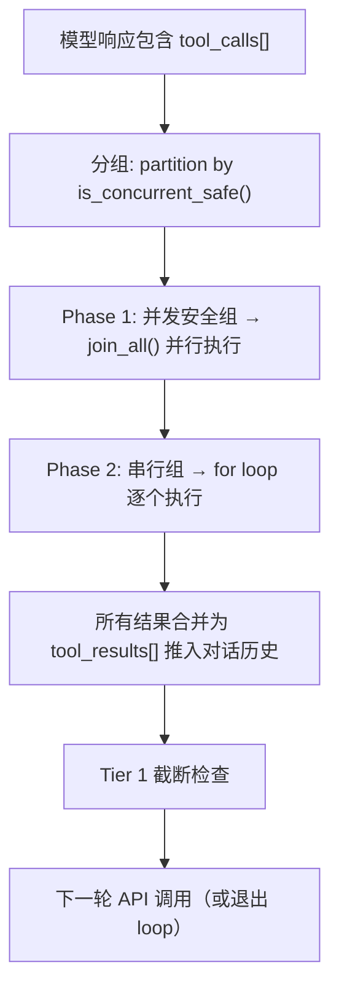
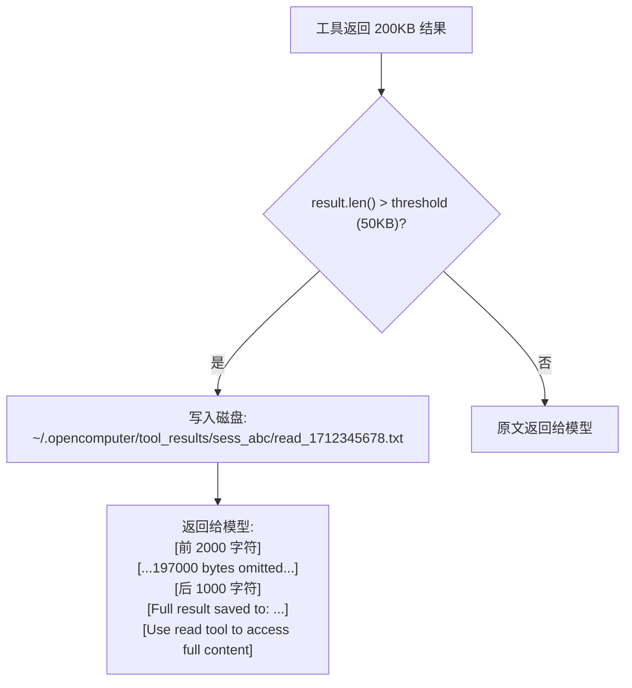
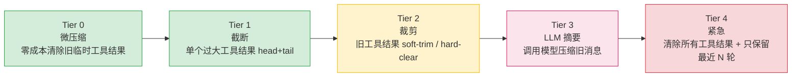
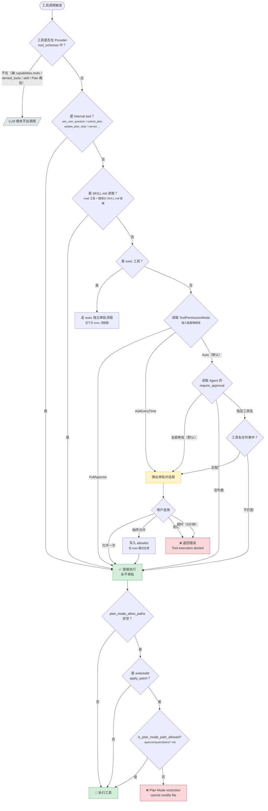
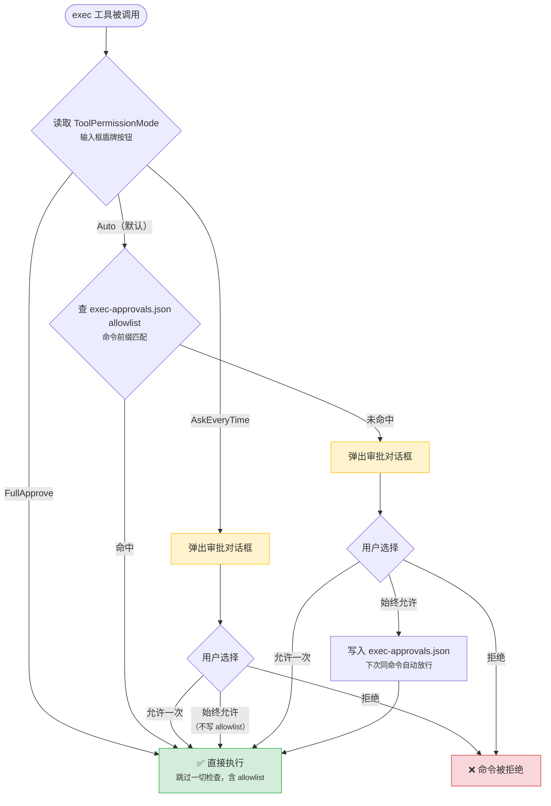
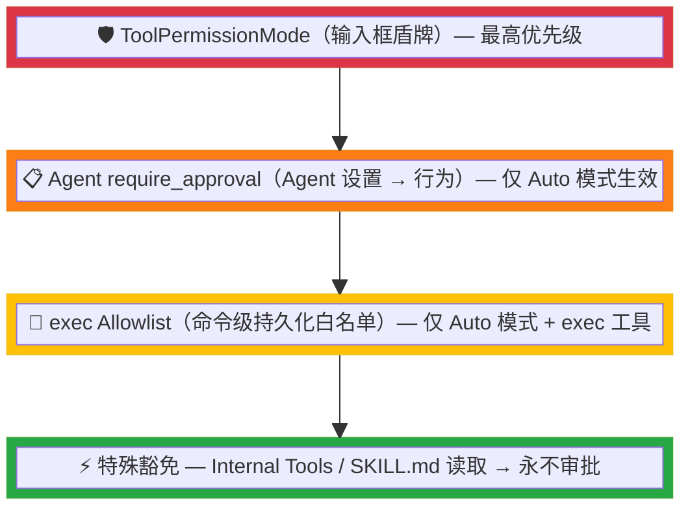

# 工具系统架构

> 返回 [文档索引](../README.md)

本文档完整涵盖 OpenComputer 工具系统的定义、执行流程、结果持久化和权限控制。

---

## 工具定义

每个工具由 `ToolDefinition` 结构体定义（`tools/definitions.rs`）：

```rust
pub struct ToolDefinition {
    pub name: String,
    pub description: String,
    pub parameters: Value,       // JSON Schema
    pub internal: bool,          // 内部工具免审批
    pub concurrent_safe: bool,   // 并发安全标记
}
```

### 并发安全标记

`concurrent_safe: bool` 决定工具是否可在同一轮次内与其他工具并行执行：

| 并发安全（parallel） | 串行执行（sequential） |
|---------------------|----------------------|
| read, ls, grep, find | exec, write, edit, apply_patch |
| recall_memory, memory_get | save_memory, update_memory, delete_memory |
| web_search, web_fetch | browser, subagent, canvas |
| agents_list, sessions_list | image_generate, sessions_send |
| session_status, sessions_history | update_core_memory, manage_cron |
| image, pdf, get_weather | send_notification, acp_spawn |
| ask_user_question | submit_plan, amend_plan, update_plan_step |

查询接口：`tools::is_concurrent_safe(name: &str) -> bool`

---

## 内置工具清单

本节枚举 OpenComputer 当前内置的全部工具（源码：`crates/oc-core/src/tools/definitions/`）。

标记含义：

- **always_load**：一定会加载到 tool schema，不受 deferred 开关影响
- **deferred**：开启延迟工具加载时默认不发送给 LLM，需通过 `tool_search` 元工具按需发现
- **internal**：`is_internal_tool()` 返回 true，**永不弹审批**（条件注入时依然遵守 Agent 权限过滤）
- **concurrent_safe**：同一轮 tool_call 可与其他安全工具并行执行（见上一节表格）
- **条件注入**：只有在对应能力开关/上下文满足时才加入 tool schema

### 1. Shell 执行与进程管理

| 工具 | 类别 | 标记 | 说明 |
|------|------|------|------|
| `exec` | Shell | always_load | 执行 shell 命令，返回 stdout/stderr。参数：`command` (必填)、`cwd`、`timeout`（秒，默认 1800，上限 7200）、`env`、`background`（立即后台化并返回 session_id）、`yield_ms`（后台化前的前台等待时间，默认 10000ms）、`pty`（伪终端）、`sandbox`（Docker 沙箱）。有独立的命令级审批流程（见 exec 流程图）。 |
| `process` | Shell | always_load | 管理 `exec` 创建的后台会话。`action`：`list` / `poll`（按 timeout 等待）/ `log`（含 offset/limit 分页）/ `write`（向 stdin 写入）/ `kill` / `clear` / `remove`。除 `list` 外均需 `session_id`。 |

### 2. 文件系统

| 工具 | 标记 | 说明 |
|------|------|------|
| `read` | always_load, concurrent_safe | 读取文件内容。支持行号分页（`offset` / `limit`），自动识别图片文件并以 base64 返回。兼容 `file_path` 别名。 |
| `write` | always_load | 写入文件（覆盖/创建），自动建父目录。兼容 `file_path` 别名。 |
| `edit` | always_load | 精确字符串替换。`old_text` 必须在文件中唯一匹配。兼容 `file_path` / `oldText` / `old_string` / `newText` / `new_string` 别名。 |
| `ls` | always_load, concurrent_safe | 列目录，返回排序条目（`/` 标记目录、`@` 标记符号链接）。支持 `~` 展开、`limit`（默认 500）。 |
| `grep` | always_load, concurrent_safe | 正则/字面量内容搜索，尊重 `.gitignore`。支持 `glob` 过滤、`ignore_case`、`literal`、`context`（上下文行数）、`limit`（默认 100）。 |
| `find` | always_load, concurrent_safe | 按 glob 模式查找文件，尊重 `.gitignore`。`limit` 默认 1000。 |
| `apply_patch` | always_load | 使用 `*** Begin Patch / *** End Patch` 格式批量创建/修改/删除/移动文件。支持 `Add File` / `Update File`（`@@` 上下文 + `-/+` 行）/ `Delete File` / `Move to` hunk。 |

### 3. Web

| 工具 | 标记 | 说明 |
|------|------|------|
| `web_fetch` | deferred, concurrent_safe | 抓取 URL 并用 Mozilla Readability 提取正文。`extract_mode`：`markdown`（默认，保留链接/标题/列表）或 `text`。`max_chars` 受服务器端上限约束。 |
| `web_search` | 条件注入, concurrent_safe | 网络搜索（需在设置中启用 Web Search）。参数：`query` (必填)、`count`、`country`（ISO 3166-1 alpha-2）、`language`（ISO 639-1）、`freshness`（`day`/`week`/`month`/`year`）。不同 provider（Brave / SearXNG / Perplexity / Google / Tavily）支持的过滤参数不同。 |

### 4. 记忆系统

均为 internal（永不审批），在 SQLite + FTS5 + 向量检索后端上操作。

| 工具 | 标记 | 说明 |
|------|------|------|
| `save_memory` | deferred, internal | 保存长期记忆。`type`：`user` / `feedback` / `project` / `reference`。`scope`：`global`（默认）或 `agent`。`pinned=true` 时始终进入系统提示不受年龄排序影响。支持 `tags`。 |
| `recall_memory` | deferred, internal, concurrent_safe | 关键词/语义检索。可按 `type` 过滤，`include_history=true` 同时搜索历史对话消息。 |
| `memory_get` | deferred, internal, concurrent_safe | 按 ID 获取单条记忆的完整内容与元数据。 |
| `update_memory` | deferred, internal | 按 ID 更新记忆 `content` 与 `tags`（tags 省略即清空）。 |
| `delete_memory` | deferred, internal | 按 ID 删除记忆。 |
| `update_core_memory` | deferred, internal | 更新常驻系统提示的 core memory 文件（`memory.md`）。`action`：`append` / `replace`；`scope`：`global` / `agent`（默认 `agent`）。 |

### 5. 定时任务

| 工具 | 标记 | 说明 |
|------|------|------|
| `manage_cron` | deferred, internal | 管理 Cron/Scheduled Tasks。`action`：`create` / `list` / `get` / `delete` / `pause` / `resume` / `run_now`。调度类型：`at`（ISO8601 单次）/ `every`（毫秒间隔，最小 60000）/ `cron`（cron 表达式 + 可选 `timezone`）。`prompt` 为触发时执行的 agent 指令（隔离会话、无历史）；`agent_id` 默认当前 agent。 |

### 6. 浏览器控制

| 工具 | 标记 | 说明 |
|------|------|------|
| `browser` | deferred | 通过 Chrome DevTools Protocol 驱动浏览器。`action` 覆盖：`connect` / `launch`（可指定 `executable_path` / `headless` / `profile`）/ `disconnect`，页面管理（`list_pages` / `new_page` / `select_page` / `close_page`）、导航（`navigate` / `go_back` / `go_forward`）、快照（`take_snapshot` 返回元素 ref、`take_screenshot` 支持 `full_page`）、交互（`click`/`double_click`/`fill`/`fill_form`/`hover`/`drag`/`press_key`/`upload_file`）、脚本（`evaluate` / `wait_for`）、对话框（`handle_dialog`）、视口（`resize` / `scroll`）、Profile 隔离（`list_profiles`）、`save_pdf`（含 paper_format / landscape / print_background）。需 Chrome 开启 `--remote-debugging-port=9222` 或走 `launch` 托管启动。 |

### 7. 多模态（分析/生成）

| 工具 | 标记 | 说明 |
|------|------|------|
| `image` | deferred, internal, concurrent_safe | 图像视觉分析。单图 shorthand：`path` 或 `url`；多图走 `images: [{type, ...}]`（最多 10 张，type 可为 `file`/`url`/`clipboard`/`screenshot`，screenshot 可指定 `monitor`）。支持 PNG/JPEG/GIF/WebP/BMP/TIFF，自动缩放过大图片，原始像素直接送模型。`prompt` 描述分析意图。 |
| `pdf` | deferred, internal, concurrent_safe | PDF 文本提取或视觉解析。`mode`：`auto`（默认，优先文本提取，扫描件自动回退 vision）/ `text` / `vision`。支持 `path`/`url` 单文件或 `pdfs` 数组（默认最多 5，上限 10）。`pages` 支持 `1-5,7,10-12` 语法，`max_chars` 控制文本模式输出长度。 |
| `image_generate` | 条件注入 | 文生图 / 图生图。`action`：`generate`（默认）/ `list`（列出已启用 provider 与能力）。参数（随启用 provider 动态）：`prompt`、`image`/`images`（参考图）、`size`、`aspectRatio`、`resolution`（`1K`/`2K`/`4K`）、`n`、`model`。默认 `auto`，按优先级顺序失败自动降级。图片落盘并附到消息。 |

### 8. 会话与跨会话通信

| 工具 | 标记 | 说明 |
|------|------|------|
| `agents_list` | deferred, internal, concurrent_safe | 列出全部可用 Agent 及描述/能力。用于选 target agent 下发 subagent。 |
| `sessions_list` | deferred, internal, concurrent_safe | 列出会话（title / agent / model / 消息数）。可按 `agent_id` 过滤，`include_cron=true` 包含 cron 触发会话。默认 limit 20，上限 100。 |
| `session_status` | deferred, internal, concurrent_safe | 查询单个会话的 agent / model / 消息数 / 时间戳。 |
| `sessions_history` | deferred, internal, concurrent_safe | 分页读取某会话的历史消息。`limit` 默认 50（上限 200），`before_id` 游标，`include_tools=false` 默认剔除 tool 细节以降噪。 |
| `sessions_send` | deferred, internal | 向其他会话发送 user 消息。`wait=true` 时阻塞直到目标 agent 回复（`timeout_secs` 默认 60，上限 300）。 |

### 9. Agent 委派

| 工具 | 标记 | 说明 |
|------|------|------|
| `subagent` | 条件注入 | 派生并管理子 Agent。`action`：`spawn` / `check`（可 `wait=true` + `wait_timeout` 阻塞）/ `list` / `result` / `kill` / `kill_all` / `steer`（向运行中子 Agent 注入 user 消息纠偏）/ `batch_spawn`（数组 `tasks`）/ `wait_all`（数组 `run_ids`）/ `spawn_and_wait`（`foreground_timeout` 默认 30s，超时自动转后台）。支持 `model` 覆盖、`label` 追踪、`files` 文件附件（UTF-8 / base64）。`timeout_secs` 默认 300，上限 1800。子 Agent 完成结果自动推送回父会话。 |
| `acp_spawn` | 条件注入 | 派生外部 ACP Agent（Claude Code / Codex CLI / Gemini CLI 等）。`action`：`spawn` / `check` / `list` / `result` / `kill` / `kill_all` / `steer` / `backends`。参数：`backend`（必填）、`task`、`cwd`、`model`、`timeout_secs`（默认 600，上限 3600）、`label`。外部进程有独立工具集与上下文。 |

### 10. Plan Mode

详见 [Plan Mode 文档](plan-mode.md)。这些工具均为 internal（不审批），且根据 Plan 状态条件注入。

| 工具 | 标记 | 注入时机 | 说明 |
|------|------|---------|------|
| `submit_plan` | internal | Planning/Review Agent | 提交最终计划，触发进入 Review 状态。参数：`title`、`content`（markdown：`## Background` + 若干 `### Phase N: <title>` + `- [ ]` 清单）。 |
| `update_plan_step` | internal | Executing/Paused Agent | 执行期更新单步状态。`step_index` 零基 + `status`（`in_progress`/`completed`/`skipped`/`failed`）。 |
| `amend_plan` | internal | Executing/Paused Agent | 执行期修改计划。`action`：`insert`（可指定 `after_index`）/ `delete` / `update`，支持 `title` / `description` / `phase`。 |

### 11. 通用结构化问答

| 工具 | 标记 | 说明 |
|------|------|------|
| `ask_user_question` | always_load, internal, concurrent_safe | 任意对话内向用户发起结构化问答。参数：`questions[]`（建议 1–4 条，每条含 `question_id`、`text`、`header` chip 标签、`options`（2–4 条，每项可选 `recommended`、`description`、`preview` + `previewKind`=`markdown`/`image`/`mermaid`）、`allow_custom`（默认 true）、`multi_select`（默认 false）、`template`（`scope`/`tech_choice`/`priority`）、`timeout_secs`、`default_values`）、`context`。Pending 持久化到 session SQLite，App 重启后重放；IM 渠道按 `supports_buttons` 发送原生按钮或 `1a`/`done`/`cancel` 文本 fallback。 |

### 12. 会话级任务追踪（TODO）

均为 internal（不审批），作用域为当前会话。

| 工具 | 标记 | 说明 |
|------|------|------|
| `task_create` | always_load, internal | 创建可追踪的任务，返回完整任务列表。参数：`content`（祈使句描述）。 |
| `task_update` | always_load, internal | 按 `id` 更新任务。`status`：`pending`/`in_progress`/`completed`；可更新 `content`。返回完整列表。 |
| `task_list` | always_load, internal, concurrent_safe | 返回当前会话所有任务的 JSON。 |

### 13. Canvas 画布

| 工具 | 标记 | 说明 |
|------|------|------|
| `canvas` | 条件注入, internal | 在沙箱预览面板创建/管理可视化项目。`action`：`create` / `update` / `show` / `hide` / `snapshot`（截图当前渲染状态供模型分析）/ `eval_js`（执行 JS）/ `list` / `delete` / `versions` / `restore` / `export`。`content_type`：`html` / `markdown` / `code` / `svg` / `mermaid` / `chart`（Chart.js）/ `slides`。支持 `html` / `css` / `js` / `content` / `language` / `version_id` / `version_message` / 导出 `format`（`html`/`markdown`/`png`）。Plan Mode 默认禁用（在 `PLAN_MODE_DENIED_TOOLS`）。 |

### 14. 桌面集成

| 工具 | 标记 | 说明 |
|------|------|------|
| `send_notification` | 条件注入, internal | 发送系统原生桌面通知。参数：`title`、`body`（必填）。用于主动提醒任务完成或需要用户注意的事件。 |
| `get_weather` | deferred, internal, concurrent_safe | 通过 Open-Meteo 获取天气（免 API key）。`location` 支持城市名或 `latitude,longitude`，省略时使用用户配置位置。`forecast_days` 1–16（默认 1）。 |

### 15. 元工具

| 工具 | 标记 | 说明 |
|------|------|------|
| `tool_search` | always_load, internal | 延迟工具发现（仅 `deferredTools.enabled` 时启用）。`query`：`select:name1,name2` 精确选取或关键词模糊检索。`max_results` 默认 5，上限 20。返回 deferred 工具完整 schema 以便后续直接调用。 |

---

## Tool Loop 执行流程



每个工具执行都通过 `tokio::select!` 与 cancel flag 竞争，支持用户随时取消。

---

## 工具结果磁盘持久化

当工具返回结果超过阈值时，自动写入磁盘：

- **阈值**：默认 50KB，通过 `config.json` → `toolResultDiskThreshold` 配置（0 = 禁用）
- **存储路径**：`~/.opencomputer/tool_results/{session_id}/{tool_name}_{timestamp}.txt`
- **上下文内容**：head 2KB + `[...N bytes omitted...]` + tail 1KB + 路径引用
- **访问方式**：模型可通过 read 工具读取完整文件



---

## 上下文压缩

工具结果的上下文压缩采用 5 层渐进式策略，完整架构见 [上下文压缩文档](context-compact.md)。



---

## 权限控制架构

系统中存在 **四个独立的工具控制维度**，按生效层级分为三大类：

| 类别 | 维度 | 作用 | 配置位置 |
|------|------|------|----------|
| **Agent 基线权限** | Agent 工具过滤（FilterConfig） | 统一裁剪 system prompt、tool schema、`tool_search` 结果，并在执行层兜底拒绝 | Agent 设置 → 能力 → 工具 → 工具注入 |
| **Schema 可见性** | 子 Agent 工具拒绝（denied_tools） | 从实际发送给 LLM API 的 tool schema 中移除 | Agent 设置 → 子 Agent |
| **执行审批** | 会话权限模式（ToolPermissionMode） | 决定工具执行前**是否弹审批** | 输入框盾牌按钮 |
| **执行审批** | Agent 审批列表（require_approval） | 指定哪些工具需要审批 | Agent 设置 → 能力 → 工具 → 工具审批 |

此外还有 **Plan Mode 路径限制** 和 **exec 命令级 Allowlist** 两个特殊机制。

---

### 1. Agent 工具过滤（FilterConfig）

**源码**：`agent_config.rs` → `AgentConfig.capabilities.tools: FilterConfig`
**UI**：Agent 设置面板 → 能力 → 工具子 tab → 工具注入折叠段落
**生效位置**：

- `system_prompt/build.rs:build_tools_section()` — 过滤 system prompt 中的工具描述
- `agent/mod.rs:build_tool_schemas()` — 过滤实际发送给 LLM API 的 `tool_schemas`
- `tools/tool_search.rs` — 过滤 deferred tool discovery 结果
- `tools/execution.rs:execute_tool_with_context()` — 执行层 defense-in-depth 兜底拒绝

```rust
pub struct FilterConfig {
    pub allow: Vec<String>,  // 白名单（非空时仅允许列表中的工具）
    pub deny: Vec<String>,   // 黑名单（始终排除）
}
```

**判断逻辑**（`FilterConfig::is_allowed()`）：

```
allow 非空 且 工具不在 allow 中 → 拒绝
工具在 deny 中 → 拒绝
其他 → 允许
```

- 默认值：`allow=[]`, `deny=[]`（即不过滤，所有用户可配置工具均可见）
- **作用范围**：这是 Agent 级**硬过滤**。同一份 `FilterConfig` 会同时影响 prompt 描述、Provider tool schema、`tool_search` 返回结果和执行层校验
- **internal 工具例外**：internal system tools（UI 中隐藏不可关闭的工具，如 `tool_search`、部分 plan / memory / canvas 能力）在这一层始终保留；若需要进一步限制，依赖 `denied_tools`、skill allowlist 或 Plan Mode 白名单

**这样设计的理由**：

- **UI 语义一致**：设置面板写的是“选择该 Agent 可使用的内置工具”，硬过滤才符合用户直觉
- **避免 deferred tools 绕过**：如果只裁剪 prompt 或主 schema，模型仍可能通过 `tool_search` 发现被禁用工具；统一过滤后不会出现这类旁路
- **执行层防绕过**：即使未来某个 Provider 解析异常、历史消息注入异常，执行层仍会按同一规则拒绝被禁用工具
- **保持层次分工**：`FilterConfig` 负责 Agent 级基础权限；`denied_tools` 负责子 Agent / 深度分层收紧；skill allowlist 和 Plan Mode 负责更强的上下文级收紧

### 2. 子 Agent 工具拒绝（denied_tools）

**源码**：`agent_config.rs` → `SubagentConfig.denied_tools: Vec<String>`
**生效位置**：`agent/mod.rs:build_tool_schemas()` — 在统一 schema 过滤阶段移除

```rust
schemas.retain(|t| {
    let name = extract_tool_name(t);
    tools::tool_visible_with_filters(
        name,
        &agent_tool_filter,
        &self.denied_tools,
        &self.skill_allowed_tools,
        plan_allowed_tools,
    )
});
```

- **作用范围**：从实际发送给 LLM API 的 tool schema 中移除，LLM 完全不知道这些工具的存在
- **使用场景**：子 Agent 深度分层工具策略，防止子 Agent 调用特定危险工具

---

### 3. 会话权限模式（ToolPermissionMode）— 最高优先级

**源码**：`tools/approval.rs` → `ToolPermissionMode` 枚举
**UI**：输入框左侧盾牌按钮（三态切换）
**生效位置**：`tools/execution.rs:execute_tool_with_context()` — 工具执行入口

```rust
pub enum ToolPermissionMode {
    Auto,           // 默认：由 Agent 配置决定
    AskEveryTime,   // 所有工具都弹审批
    FullApprove,    // 全部自动放行
}
```

**存储**：进程级全局单例（`OnceLock<TokioMutex>`），每次发消息时由前端通过 `chat` 命令参数设置。

> ⚠️ **注意**：这是进程级全局状态，多窗口/多会话共享同一个值。

### 4. Agent 审批列表（require_approval）

**源码**：`agent_config.rs` → `CapabilitiesConfig.require_approval: Vec<String>`
**UI**：Agent 设置面板 → 能力 → 工具 → 工具审批（三种模式：全部/无/自定义）
**生效位置**：`tools/execution.rs:tool_needs_approval()`

| 配置值 | 效果 |
|--------|------|
| `["*"]`（默认） | 所有非内部工具需审批 |
| `[]` | 所有工具自动放行 |
| `["exec", "web_fetch"]` | 仅指定工具需审批 |

**仅在 `ToolPermissionMode::Auto` 时生效**。

---

## 完整决策流程

> **说明**：下图描述的是“schema 可见性 + 执行审批”的硬控制链路。`FilterConfig` 已并入这条链路，会先裁剪 `tool_schemas`，并在执行层再次兜底校验。



### 审批对话框交互

当判定需要审批时，后端发射 `approval_required` 事件，前端 `ApprovalDialog` 显示三个选项：

| 选项 | 行为 |
|------|------|
| **允许一次**（AllowOnce） | 本次放行，下次同样弹出 |
| **始终允许**（AllowAlways） | Auto 模式：写入 `exec-approvals.json` allowlist；AskEveryTime 模式：等同于 AllowOnce（不写 allowlist） |
| **拒绝**（Deny） | 工具返回错误 `"Tool '{}' execution denied by user"` |

审批等待超时默认 5 分钟，可通过 `config.json` 的 `approvalTimeoutSecs` 配置，`0` 表示不限时。超时后的行为由 `approvalTimeoutAction` 控制：默认 `deny`，阻止工具执行；可选 `proceed`，记录 warning 后继续执行工具。

### IM Channel 审批交互

当工具审批发生在 IM 渠道（Telegram/Discord/Slack 等）对话中时，`channel/worker/approval.rs` 监听 EventBus 的 `approval_required` 事件，通过 `ApprovalRequest.session_id` 反查 `ChannelDB` 关联的渠道信息，将审批提示发送到 IM 渠道本身：

- **支持按钮的渠道**（`ChannelCapabilities.supports_buttons = true`）：Telegram InlineKeyboard / Discord Action Row Button / Slack Block Kit / 飞书 Interactive Card / QQ Bot Keyboard / LINE Buttons Template / Google Chat Card v2
- **不支持按钮的渠道**：发送文本提示，用户回复 "1"（允许一次）/ "2"（始终允许）/ "3"（拒绝）

按钮回调通过各渠道原生机制（callback_query / INTERACTION_CREATE / interactive envelope / card.action.trigger / postback / CARD_CLICKED）路由回 `submit_approval_response()`。

### IM Channel 自动审批

`ChannelAccountConfig.auto_approve_tools: bool`（默认 `false`）可在设置中开启。开启后该渠道的所有工具调用自动审批，通过 `ChatEngineParams.auto_approve_tools` → `AssistantAgent.auto_approve_tools` → `ToolExecContext.auto_approve_tools` 传递到执行层，在审批门控和 exec 命令审批中均直接跳过。

---

## exec 工具的独立审批流程

exec 被排除在通用审批门（`name != TOOL_EXEC`）之外，在 `tools/exec.rs` 内部实现自己的命令级审批逻辑：



**Allowlist 持久化文件**：`~/.opencomputer/exec-approvals.json`
**匹配规则**：`extract_command_prefix()` 提取命令首个空格前的单词作为 pattern，前缀匹配。

---

## Plan Mode 工具限制

Plan Mode 在权限控制层面引入了**两层独立限制**：工具可见性裁剪 + 路径级硬限制。详见 [Plan Mode 文档](plan-mode.md)。

### 常量定义（`plan.rs`）

```rust
pub const PLAN_MODE_DENIED_TOOLS: &[&str] = &["write", "edit", "apply_patch", "canvas"];
pub const PLAN_MODE_ASK_TOOLS: &[&str] = &["exec"];
pub const PLAN_MODE_PATH_AWARE_TOOLS: &[&str] = &["write", "edit"];
```

### 1. 工具可见性裁剪（Planning/Review 阶段）

**源码**：`plan.rs` → `PlanAgentConfig` + `commands/chat.rs`
**生效位置**：chat 入口根据 `get_plan_state()` 动态修改 Agent 的 `denied_tools` 和工具注入

| 配置项 | 值 | 效果 |
|--------|-----|------|
| `PlanAgentConfig.allowed_tools` | `["read", "ls", "grep", "find", "glob", "web_search", "web_fetch", "exec", "ask_user_question", "submit_plan", "write", "edit", "recall_memory", "memory_get", "subagent"]` | Plan Agent 白名单，仅这些工具对 LLM 可见 |
| `PLAN_MODE_DENIED_TOOLS` | `["write", "edit", "apply_patch", "canvas"]` | 追加到 `denied_tools`，从 LLM tool schema 中移除 |
| `PLAN_MODE_ASK_TOOLS` | `["exec"]` | 追加到 `ask_tools`，exec 在 Planning 阶段始终弹审批 |

**双 Agent 模式**（`PlanAgentMode` 枚举）：

| 状态 | Agent 模式 | 工具集 |
|------|-----------|--------|
| Off | 正常 | Agent 配置的完整工具集 |
| Planning / Review | PlanAgent | 白名单工具 + path-restricted `write`/`edit` + 条件注入 `ask_user_question`/`submit_plan` |
| Executing / Paused | ExecutingAgent | 全量工具 + 条件注入 `update_plan_step`/`amend_plan` |
| Completed | ExecutingAgent | 全量工具 + 注入 `PLAN_COMPLETED_SYSTEM_PROMPT` |

### 2. 路径级硬限制（Planning 阶段文件写入）

**源码**：`tools/execution.rs`（执行守卫）+ `plan.rs` → `is_plan_mode_path_allowed()`
**触发条件**：`ToolExecContext.plan_mode_allow_paths` 非空时（Planning 阶段由 `PlanAgentConfig.plan_mode_allow_paths = ["plans"]` 自动设置）

在审批门**之后**、实际执行**之前**做路径检查：

```rust
// tools/execution.rs
if !ctx.plan_mode_allow_paths.is_empty() {
    let is_path_aware = matches!(name, TOOL_WRITE | TOOL_EDIT | TOOL_APPLY_PATCH);
    if is_path_aware {
        let target_path = args.get("file_path")
            .or_else(|| args.get("path"))
            .and_then(|v| v.as_str()).unwrap_or("");
        if !target_path.is_empty()
            && !crate::plan::is_plan_mode_path_allowed(target_path) {
            return Err("Plan Mode restriction: cannot modify '{path}'");
        }
    }
}
```

**`is_plan_mode_path_allowed()` 判断逻辑**：

```
文件扩展名不是 .md → 拒绝
路径包含 ".opencomputer/plans/" → 允许
路径以 plans_dir()（解析后的绝对路径）开头 → 允许
其他 → 拒绝
```

允许的路径范围：
- 项目本地：`<project>/.opencomputer/plans/*.md`
- 全局目录：`~/.opencomputer/plans/*.md`
- 自定义：`plansDirectory` 配置覆盖的目录下 `*.md`

这是一个**独立于审批的硬限制**，即使审批通过也会被拦截。

### 3. 子 Agent 安全继承

**源码**：`subagent/spawn.rs`

Planning/Review 状态下 spawn 的子 Agent 自动继承 `PLAN_MODE_DENIED_TOOLS`：

```
子 Agent denied_tools = SubagentConfig.deniedTools ∪ PLAN_MODE_DENIED_TOOLS
```

防止子 Agent 绕过 Plan Mode 的工具限制（如通过子 Agent 修改文件）。

---

## 特殊豁免规则

### Internal Tools（永不审批）

通过 `ToolDefinition.internal = true` 标记，`is_internal_tool()` 检查。包括：

- Plan Mode 工具：`ask_user_question` / `submit_plan` / `update_plan_step` / `amend_plan`
- 条件注入工具：`send_notification` / `subagent` / `image_generate` / `canvas` / `acp_spawn`
- 其他内部工具：由 `INTERNAL_TOOL_NAMES` 静态集合管理

### SKILL.md 读取（技能预授权）

`is_skill_read()` 检查 — 当 `read` 工具的路径以 `/SKILL.md` 结尾时，在 `AskEveryTime` 和 `Auto` 模式下均跳过审批。

---

## 优先级总结



> **关键理解**：输入框的盾牌（ToolPermissionMode）是全局最高优先级开关，它能完全覆盖 Agent 设置中的 `require_approval` 配置。Agent 设置中的审批配置只在盾牌为 Auto（默认）时才参与决策。

---

## 关键源文件索引

| 文件 | 职责 |
|------|------|
| `crates/oc-core/src/tools/approval.rs` | ToolPermissionMode 定义、审批请求/响应、Allowlist 管理 |
| `crates/oc-core/src/tools/execution.rs` | 统一审批门（`execute_tool_with_context`）、Plan Mode 路径检查 |
| `crates/oc-core/src/tools/exec.rs` | exec 独立命令级审批逻辑 |
| `crates/oc-core/src/tools/definitions.rs` | Internal Tool 集合（`INTERNAL_TOOL_NAMES`）、`is_internal_tool()`、`is_concurrent_safe()` |
| `crates/oc-core/src/agent_config.rs` | `FilterConfig`（allow/deny）、`CapabilitiesConfig.require_approval`、`SubagentConfig.denied_tools` |
| `crates/oc-core/src/agent/mod.rs` | `build_tool_schemas()` 统一过滤 schema；`tool_context()` 构建 ToolExecContext，传递 require_approval 与工具限制 |
| `crates/oc-core/src/agent/providers/*.rs` | 消费已过滤后的 `tool_schemas` 并发送 API 请求 |
| `crates/oc-core/src/system_prompt/` | `build_tools_section()` 按 FilterConfig 过滤提示词 |
| `crates/oc-core/src/tools/tool_search.rs` | `tool_search` 按当前 Agent/Skill/Plan 限制过滤可发现工具 |
| `crates/oc-core/src/tools/execution.rs` | 工具执行前按当前限制做 defense-in-depth 校验 |
| `src-tauri/src/commands/chat.rs` | Tauri 命令层：解析前端 tool_permission_mode 参数并设置全局模式 |
| `crates/oc-server/src/routes/chat.rs` | HTTP 路由层：REST API + WebSocket 流式推送 |
| `src/components/chat/ChatInput.tsx` | 盾牌按钮 UI（三态切换） |
| `src/components/chat/ApprovalDialog.tsx` | 审批弹窗 UI |
| `src/components/settings/agent-panel/tabs/CapabilitiesTab.tsx` | Agent 能力配置 UI（工具注入 / 审批 / 技能） |
| `crates/oc-core/src/channel/worker/approval.rs` | IM Channel 审批交互（EventBus 监听、按钮/文本发送、回调处理） |
| `src/components/settings/channel-panel/EditAccountDialog.tsx` | Channel 设置中的 auto_approve_tools 开关 |
