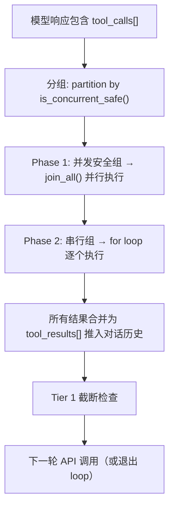
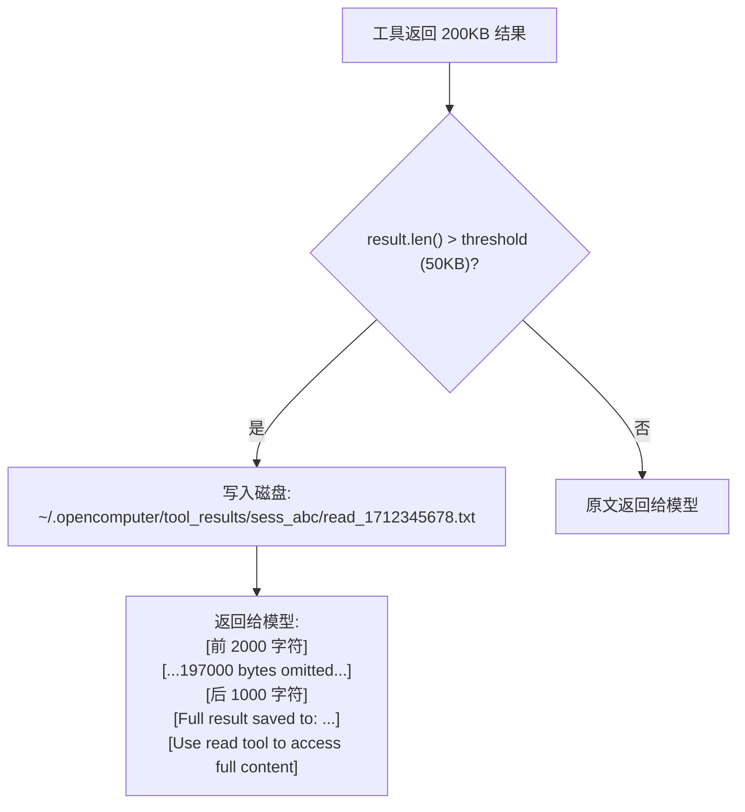
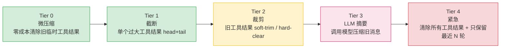
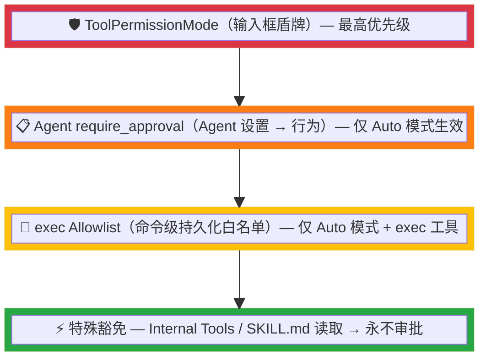

# 工具系统架构

> 返回 [文档索引](../README.md)

本文档完整涵盖 OpenComputer 工具系统的定义、执行流程、结果持久化和权限控制。

---

## 工具定义

每个工具由 `ToolDefinition` 结构体定义（`tools/definitions.rs`）：

```rust
pub struct ToolDefinition {
    pub name: String,
    pub description: String,
    pub parameters: Value,       // JSON Schema
    pub internal: bool,          // 内部工具免审批
    pub concurrent_safe: bool,   // 并发安全标记
}
```

### 并发安全标记

`concurrent_safe: bool` 决定工具是否可在同一轮次内与其他工具并行执行：

| 并发安全（parallel） | 串行执行（sequential） |
|---------------------|----------------------|
| read, ls, grep, find | exec, write, edit, apply_patch |
| recall_memory, memory_get | save_memory, update_memory, delete_memory |
| web_search, web_fetch | browser, subagent, canvas |
| agents_list, sessions_list | image_generate, sessions_send |
| session_status, sessions_history | update_core_memory, manage_cron |
| image, pdf, get_weather | send_notification, acp_spawn |
| plan_question | submit_plan, amend_plan, update_plan_step |

查询接口：`tools::is_concurrent_safe(name: &str) -> bool`

---

## Tool Loop 执行流程



每个工具执行都通过 `tokio::select!` 与 cancel flag 竞争，支持用户随时取消。

---

## 工具结果磁盘持久化

当工具返回结果超过阈值时，自动写入磁盘：

- **阈值**：默认 50KB，通过 `config.json` → `toolResultDiskThreshold` 配置（0 = 禁用）
- **存储路径**：`~/.opencomputer/tool_results/{session_id}/{tool_name}_{timestamp}.txt`
- **上下文内容**：head 2KB + `[...N bytes omitted...]` + tail 1KB + 路径引用
- **访问方式**：模型可通过 read 工具读取完整文件



---

## 上下文压缩

工具结果的上下文压缩采用 5 层渐进式策略，完整架构见 [上下文压缩文档](context-compact.md)。



---

## 权限控制架构

系统中存在 **四个独立的权限控制维度**，按作用阶段分为两大类：

| 类别 | 维度 | 作用 | 配置位置 |
|------|------|------|----------|
| **可见性控制** | Agent 工具过滤（FilterConfig） | 决定 LLM **能看到**哪些工具 | Agent 设置 → 工具 |
| **可见性控制** | 子 Agent 工具拒绝（denied_tools） | 从 LLM 可见的工具列表中移除 | Agent 设置 → 子 Agent |
| **执行审批** | 会话权限模式（ToolPermissionMode） | 决定工具执行前**是否弹审批** | 输入框盾牌按钮 |
| **执行审批** | Agent 审批列表（require_approval） | 指定哪些工具需要审批 | Agent 设置 → 行为 |

此外还有 **Plan Mode 路径限制** 和 **exec 命令级 Allowlist** 两个特殊机制。

---

### 1. Agent 工具过滤（FilterConfig）

**源码**：`agent_config.rs` → `AgentConfig.tools: FilterConfig`
**UI**：Agent 设置面板 → 工具标签页
**生效位置**：`system_prompt.rs:build_tools_section()` — 构建系统提示词时过滤工具描述

```rust
pub struct FilterConfig {
    pub allow: Vec<String>,  // 白名单（非空时仅允许列表中的工具）
    pub deny: Vec<String>,   // 黑名单（始终排除）
}
```

**判断逻辑**（`FilterConfig::is_allowed()`）：

```
allow 非空 且 工具不在 allow 中 → 拒绝
工具在 deny 中 → 拒绝
其他 → 允许
```

- 默认值：`allow=[]`, `deny=[]`（即不过滤，所有工具可见）
- **作用范围**：影响系统提示词中的工具描述（Section ⑥），但目前**不影响**实际发送给 LLM 的 tool schema 列表（仅在提示词中标注"Only the following tools are enabled"）

### 2. 子 Agent 工具拒绝（denied_tools）

**源码**：`agent_config.rs` → `SubagentConfig.denied_tools: Vec<String>`
**生效位置**：四种 Provider 实现（`anthropic.rs` / `openai_chat.rs` / `openai_responses.rs` / `codex.rs`）中 `tool_schemas.retain()` 过滤

```rust
// 所有 Provider 中的统一逻辑
if !self.denied_tools.is_empty() {
    tool_schemas.retain(|t| {
        let name = t.get("name").and_then(|v| v.as_str()).unwrap_or("");
        !self.denied_tools.contains(&name.to_string())
    });
}
```

- **作用范围**：从实际发送给 LLM API 的 tool schema 中移除，LLM 完全不知道这些工具的存在
- **使用场景**：子 Agent 深度分层工具策略，防止子 Agent 调用特定危险工具

---

### 3. 会话权限模式（ToolPermissionMode）— 最高优先级

**源码**：`tools/approval.rs` → `ToolPermissionMode` 枚举
**UI**：输入框左侧盾牌按钮（三态切换）
**生效位置**：`tools/execution.rs:execute_tool_with_context()` — 工具执行入口

```rust
pub enum ToolPermissionMode {
    Auto,           // 默认：由 Agent 配置决定
    AskEveryTime,   // 所有工具都弹审批
    FullApprove,    // 全部自动放行
}
```

**存储**：进程级全局单例（`OnceLock<TokioMutex>`），每次发消息时由前端通过 `chat` 命令参数设置。

> ⚠️ **注意**：这是进程级全局状态，多窗口/多会话共享同一个值。

### 4. Agent 审批列表（require_approval）

**源码**：`agent_config.rs` → `BehaviorConfig.require_approval: Vec<String>`
**UI**：Agent 设置面板 → 行为标签页（三种模式：全部/无/自定义）
**生效位置**：`tools/execution.rs:tool_needs_approval()`

| 配置值 | 效果 |
|--------|------|
| `["*"]`（默认） | 所有非内部工具需审批 |
| `[]` | 所有工具自动放行 |
| `["exec", "web_fetch"]` | 仅指定工具需审批 |

**仅在 `ToolPermissionMode::Auto` 时生效**。

---

## 完整决策流程

```mermaid
flowchart TD
    Start([工具调用触发]) --> InSchema{工具是否在 Provider<br/>tool_schemas 中？}

    InSchema -- "不在（被 denied_tools 移除）" --> Blocked[/LLM 根本不会调用/]
    InSchema -- 在 --> IsInternal{是 internal tool？<br/><small>plan_question / submit_plan<br/>update_plan_step / canvas ...</small>}

    IsInternal -- 是 --> DirectExec[✅ 直接执行<br/>永不审批]
    IsInternal -- 否 --> IsSkillRead{是 SKILL.md 读取？<br/><small>read 工具 + 路径以 SKILL.md 结尾</small>}

    IsSkillRead -- 是 --> DirectExec
    IsSkillRead -- 否 --> IsExec{是 exec 工具？}

    IsExec -- 是 --> ExecFlow[走 exec 独立审批流程<br/><small>见下方 exec 流程图</small>]
    IsExec -- 否 --> PermMode{读取 ToolPermissionMode<br/><small>输入框盾牌按钮</small>}

    PermMode -- FullApprove --> DirectExec
    PermMode -- AskEveryTime --> ShowApproval[弹出审批对话框]
    PermMode -- "Auto（默认）" --> AgentConfig{读取 Agent 的<br/>require_approval}

    AgentConfig -- '["*"]（默认）' --> ShowApproval
    AgentConfig -- "[]（空）" --> DirectExec
    AgentConfig -- '["具体工具名"]' --> MatchTool{工具名在列表中？}

    MatchTool -- 匹配 --> ShowApproval
    MatchTool -- 不匹配 --> DirectExec

    ShowApproval --> UserChoice{用户选择}
    UserChoice -- 允许一次 --> DirectExec
    UserChoice -- 始终允许 --> WriteAllowlist[写入 allowlist<br/><small>仅 Auto 模式生效</small>] --> DirectExec
    UserChoice -- 拒绝 --> Denied[❌ 返回错误<br/>Tool execution denied]
    UserChoice -- "超时（5分钟）" --> Denied

    DirectExec --> PlanCheck{plan_mode_allow_paths<br/>非空？}
    PlanCheck -- 否 --> Execute[🔧 执行工具]
    PlanCheck -- 是 --> IsPathAware{是 write/edit/<br/>apply_patch？}
    IsPathAware -- 否 --> Execute
    IsPathAware -- 是 --> PathAllowed{is_plan_mode_path_allowed?<br/><small>.opencomputer/plans/*.md</small>}
    PathAllowed -- 是 --> Execute
    PathAllowed -- 否 --> PlanDenied[❌ Plan Mode restriction<br/>cannot modify file]

    style DirectExec fill:#d4edda,stroke:#28a745
    style Execute fill:#d4edda,stroke:#28a745
    style Blocked fill:#e2e3e5,stroke:#6c757d
    style Denied fill:#f8d7da,stroke:#dc3545
    style PlanDenied fill:#f8d7da,stroke:#dc3545
    style ShowApproval fill:#fff3cd,stroke:#ffc107
```

### 审批对话框交互

当判定需要审批时，后端发射 `approval_required` 事件，前端 `ApprovalDialog` 显示三个选项：

| 选项 | 行为 |
|------|------|
| **允许一次**（AllowOnce） | 本次放行，下次同样弹出 |
| **始终允许**（AllowAlways） | Auto 模式：写入 `exec-approvals.json` allowlist；AskEveryTime 模式：等同于 AllowOnce（不写 allowlist） |
| **拒绝**（Deny） | 工具返回错误 `"Tool '{}' execution denied by user"` |

审批超时 5 分钟自动拒绝。

---

## exec 工具的独立审批流程

exec 被排除在通用审批门（`name != TOOL_EXEC`）之外，在 `tools/exec.rs` 内部实现自己的命令级审批逻辑：


**Allowlist 持久化文件**：`~/.opencomputer/exec-approvals.json`
**匹配规则**：`extract_command_prefix()` 提取命令首个空格前的单词作为 pattern，前缀匹配。

---

## Plan Mode 工具限制

Plan Mode 在权限控制层面引入了**两层独立限制**：工具可见性裁剪 + 路径级硬限制。详见 [Plan Mode 文档](plan-mode.md)。

### 常量定义（`plan.rs`）

```rust
pub const PLAN_MODE_DENIED_TOOLS: &[&str] = &["write", "edit", "apply_patch", "canvas"];
pub const PLAN_MODE_ASK_TOOLS: &[&str] = &["exec"];
pub const PLAN_MODE_PATH_AWARE_TOOLS: &[&str] = &["write", "edit"];
```

### 1. 工具可见性裁剪（Planning/Review 阶段）

**源码**：`plan.rs` → `PlanAgentConfig` + `commands/chat.rs`
**生效位置**：chat 入口根据 `get_plan_state()` 动态修改 Agent 的 `denied_tools` 和工具注入

| 配置项 | 值 | 效果 |
|--------|-----|------|
| `PlanAgentConfig.allowed_tools` | `["read", "ls", "grep", "find", "glob", "web_search", "web_fetch", "exec", "plan_question", "submit_plan", "write", "edit", "recall_memory", "memory_get", "subagent"]` | Plan Agent 白名单，仅这些工具对 LLM 可见 |
| `PLAN_MODE_DENIED_TOOLS` | `["write", "edit", "apply_patch", "canvas"]` | 追加到 `denied_tools`，从 LLM tool schema 中移除 |
| `PLAN_MODE_ASK_TOOLS` | `["exec"]` | 追加到 `ask_tools`，exec 在 Planning 阶段始终弹审批 |

**双 Agent 模式**（`PlanAgentMode` 枚举）：

| 状态 | Agent 模式 | 工具集 |
|------|-----------|--------|
| Off | 正常 | Agent 配置的完整工具集 |
| Planning / Review | PlanAgent | 白名单工具 + path-restricted `write`/`edit` + 条件注入 `plan_question`/`submit_plan` |
| Executing / Paused | BuildAgent | 全量工具 + 条件注入 `update_plan_step`/`amend_plan` |
| Completed | BuildAgent | 全量工具 + 注入 `PLAN_COMPLETED_SYSTEM_PROMPT` |

### 2. 路径级硬限制（Planning 阶段文件写入）

**源码**：`tools/execution.rs`（执行守卫）+ `plan.rs` → `is_plan_mode_path_allowed()`
**触发条件**：`ToolExecContext.plan_mode_allow_paths` 非空时（Planning 阶段由 `PlanAgentConfig.plan_mode_allow_paths = ["plans"]` 自动设置）

在审批门**之后**、实际执行**之前**做路径检查：

```rust
// tools/execution.rs
if !ctx.plan_mode_allow_paths.is_empty() {
    let is_path_aware = matches!(name, TOOL_WRITE | TOOL_EDIT | TOOL_APPLY_PATCH);
    if is_path_aware {
        let target_path = args.get("file_path")
            .or_else(|| args.get("path"))
            .and_then(|v| v.as_str()).unwrap_or("");
        if !target_path.is_empty()
            && !crate::plan::is_plan_mode_path_allowed(target_path) {
            return Err("Plan Mode restriction: cannot modify '{path}'");
        }
    }
}
```

**`is_plan_mode_path_allowed()` 判断逻辑**：

```
文件扩展名不是 .md → 拒绝
路径包含 ".opencomputer/plans/" → 允许
路径以 plans_dir()（解析后的绝对路径）开头 → 允许
其他 → 拒绝
```

允许的路径范围：
- 项目本地：`<project>/.opencomputer/plans/*.md`
- 全局目录：`~/.opencomputer/plans/*.md`
- 自定义：`plansDirectory` 配置覆盖的目录下 `*.md`

这是一个**独立于审批的硬限制**，即使审批通过也会被拦截。

### 3. 子 Agent 安全继承

**源码**：`subagent/spawn.rs`

Planning/Review 状态下 spawn 的子 Agent 自动继承 `PLAN_MODE_DENIED_TOOLS`：

```
子 Agent denied_tools = SubagentConfig.deniedTools ∪ PLAN_MODE_DENIED_TOOLS
```

防止子 Agent 绕过 Plan Mode 的工具限制（如通过子 Agent 修改文件）。

---

## 特殊豁免规则

### Internal Tools（永不审批）

通过 `ToolDefinition.internal = true` 标记，`is_internal_tool()` 检查。包括：

- Plan Mode 工具：`plan_question` / `submit_plan` / `update_plan_step` / `amend_plan`
- 条件注入工具：`send_notification` / `subagent` / `image_generate` / `canvas` / `acp_spawn`
- 其他内部工具：由 `INTERNAL_TOOL_NAMES` 静态集合管理

### SKILL.md 读取（技能预授权）

`is_skill_read()` 检查 — 当 `read` 工具的路径以 `/SKILL.md` 结尾时，在 `AskEveryTime` 和 `Auto` 模式下均跳过审批。

---

## 优先级总结



> **关键理解**：输入框的盾牌（ToolPermissionMode）是全局最高优先级开关，它能完全覆盖 Agent 设置中的 `require_approval` 配置。Agent 设置中的审批配置只在盾牌为 Auto（默认）时才参与决策。

---

## 关键源文件索引

| 文件 | 职责 |
|------|------|
| `crates/oc-core/src/tools/approval.rs` | ToolPermissionMode 定义、审批请求/响应、Allowlist 管理 |
| `crates/oc-core/src/tools/execution.rs` | 统一审批门（`execute_tool_with_context`）、Plan Mode 路径检查 |
| `crates/oc-core/src/tools/exec.rs` | exec 独立命令级审批逻辑 |
| `crates/oc-core/src/tools/definitions.rs` | Internal Tool 集合（`INTERNAL_TOOL_NAMES`）、`is_internal_tool()`、`is_concurrent_safe()` |
| `crates/oc-core/src/agent_config.rs` | `FilterConfig`（allow/deny）、`BehaviorConfig.require_approval`、`SubagentConfig.denied_tools` |
| `crates/oc-core/src/agent/mod.rs` | `tool_context()` 构建 ToolExecContext，传递 require_approval |
| `crates/oc-core/src/agent/providers/*.rs` | denied_tools 过滤 tool_schemas |
| `crates/oc-core/src/system_prompt/` | `build_tools_section()` 按 FilterConfig 过滤提示词 |
| `src-tauri/src/commands/chat.rs` | Tauri 命令层：解析前端 tool_permission_mode 参数并设置全局模式 |
| `crates/oc-server/src/routes/chat.rs` | HTTP 路由层：REST API + WebSocket 流式推送 |
| `src/components/chat/ChatInput.tsx` | 盾牌按钮 UI（三态切换） |
| `src/components/chat/ApprovalDialog.tsx` | 审批弹窗 UI |
| `src/components/settings/agent-panel/tabs/BehaviorTab.tsx` | Agent 审批配置 UI |
