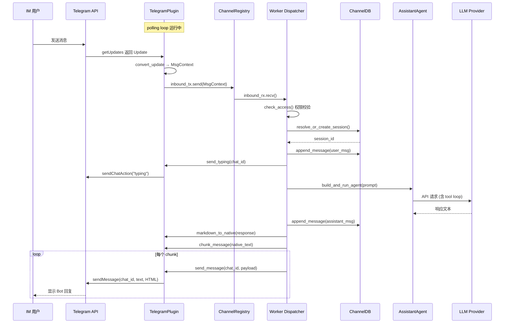

# IM Channel 系统架构文档

> OpenComputer 多渠道即时通讯接入 — 兼容 OpenClaw Channel 协议的 Rust 原生实现

## 目录

- [概述](#概述)
- [设计目标](#设计目标)
- [整体架构](#整体架构)
- [核心抽象层](#核心抽象层)
  - [ChannelId 枚举](#channelid-枚举)
  - [ChannelPlugin Trait](#channelplugin-trait)
  - [MsgContext（入站消息）](#msgcontext入站消息)
  - [ReplyPayload（出站消息）](#replypayload出站消息)
  - [ChannelCapabilities](#channelcapabilities)
  - [安全策略（SecurityConfig）](#安全策略securityconfig)
- [消息流转架构](#消息流转架构)
  - [入站流程](#入站流程)
  - [出站流程](#出站流程)
  - [完整时序图](#完整时序图)
- [模块拆分](#模块拆分)
- [Channel Registry（注册表）](#channel-registry注册表)
- [会话管理](#会话管理)
  - [channel_conversations 表](#channel_conversations-表)
  - [会话映射策略](#会话映射策略)
- [Worker 分发器](#worker-分发器)
- [Telegram 插件实现](#telegram-插件实现)
  - [架构](#telegram-架构)
  - [teloxide 封装层](#teloxide-封装层)
  - [Long-Polling 循环](#long-polling-循环)
  - [Markdown → Telegram HTML](#markdown--telegram-html)
  - [群组消息过滤](#群组消息过滤)
  - [媒体处理](#媒体处理)
- [配置格式](#配置格式)
  - [配置结构](#配置结构)
  - [Telegram 配置示例](#telegram-配置示例)
- [Tauri 命令 API](#tauri-命令-api)
- [前端设置面板](#前端设置面板)
- [与 OpenClaw 的兼容性](#与-openclaw-的兼容性)
- [扩展新渠道指南](#扩展新渠道指南)
- [安全设计](#安全设计)
- [文件清单](#文件清单)

---

## 概述

IM Channel 系统是 OpenComputer 的多渠道即时通讯接入层，允许用户通过 Telegram、Discord、Slack 等 IM 平台与 AI Agent 对话。该系统设计为**完全兼容 OpenClaw 的 Channel 协议**，同时利用 Rust 原生实现获得更好的性能和更低的资源开销。

### 核心特性

- **OpenClaw 兼容**：相同的 ChannelId（9 个内置 + 自定义扩展）、相同的配置格式、相同的能力声明
- **Rust 原生**：基于 tokio 异步运行时，零 Node.js 依赖
- **插件化架构**：一个 `ChannelPlugin` trait 定义所有渠道行为，新增渠道只需实现该 trait
- **完整 Agent 能力**：复用 `AssistantAgent` 的全部工具（30+ 内置工具）和 Failover 降级策略
- **会话持久化**：Channel 消息映射到 SessionDB，桌面端可查看所有 IM 对话历史
- **安全控制**：DM Policy（open/allowlist/pairing）+ 群组白名单 + 用户白名单

### 首发渠道

第一个实现的渠道是 **Telegram**，基于 `teloxide` crate，支持：
- 私聊（DM）和群组/超级群组
- 论坛话题（Forum Topics）
- 图片/文档/视频等媒体消息
- Markdown → Telegram HTML 格式转换
- @mention 和 /command 群组触发
- Long-polling 传输模式

---

## 设计目标

| 目标 | 说明 |
|------|------|
| **兼容 OpenClaw** | ChannelId、配置格式、能力声明与 OpenClaw 完全一致，未来可互换或共享配置 |
| **Rust 原生** | 所有核心逻辑在 Rust 后端实现，前端只负责配置界面 |
| **最小依赖** | 仅新增 `teloxide` + `tokio-util` 两个 crate |
| **插件可扩展** | 新增渠道只需实现 `ChannelPlugin` trait + 注册到 Registry |
| **复用已有架构** | 消息分发复用 `build_and_run_agent`（同 cron executor），会话复用 `SessionDB` |
| **安全优先** | Bot Token 不出现在日志中，DM/群组分级权限控制 |

---

## 整体架构

```mermaid
graph TB
    subgraph "IM 平台"
        TG["Telegram Bot API"]
        DC["Discord (Future)"]
        SL["Slack (Future)"]
    end

    subgraph "Channel Plugin Layer"
        TG_PLUGIN["TelegramPlugin<br/>telegram/mod.rs"]
        DC_PLUGIN["DiscordPlugin<br/>(future)"]
        SL_PLUGIN["SlackPlugin<br/>(future)"]
    end

    subgraph "Channel Core"
        REGISTRY["ChannelRegistry<br/>registry.rs"]
        WORKER["Worker Dispatcher<br/>worker.rs"]
        CHANNEL_DB["ChannelDB<br/>db.rs"]
        TYPES["Core Types<br/>types.rs"]
        TRAITS["ChannelPlugin Trait<br/>traits.rs"]
        CONFIG["ChannelStoreConfig<br/>config.rs"]
    end

    subgraph "OpenComputer Core"
        AGENT["AssistantAgent<br/>agent/mod.rs"]
        TOOLS["30 内置工具<br/>tools/"]
        PROVIDERS["4 种 LLM Provider<br/>agent/providers/"]
        FAILOVER["Failover 降级<br/>failover.rs"]
    end

    subgraph "持久化层"
        SESSION_DB["SessionDB<br/>sessions.db"]
        PROVIDER_STORE["ProviderStore<br/>config.json"]
    end

    subgraph "前端"
        PANEL["ChannelPanel<br/>settings"]
    end

    TG -->|getUpdates| TG_PLUGIN
    DC -->|WebSocket| DC_PLUGIN
    SL -->|Socket Mode| SL_PLUGIN

    TG_PLUGIN -->|MsgContext| REGISTRY
    DC_PLUGIN -->|MsgContext| REGISTRY
    SL_PLUGIN -->|MsgContext| REGISTRY

    REGISTRY -->|mpsc channel| WORKER
    WORKER -->|resolve session| CHANNEL_DB
    WORKER -->|build_and_run_agent| AGENT
    AGENT --> TOOLS
    AGENT --> PROVIDERS
    AGENT --> FAILOVER

    WORKER -->|send_message| REGISTRY
    REGISTRY -->|ReplyPayload| TG_PLUGIN
    TG_PLUGIN -->|sendMessage| TG

    CHANNEL_DB --> SESSION_DB
    CONFIG --> PROVIDER_STORE
    PANEL -->|invoke()| REGISTRY
```

---

## 核心抽象层

### ChannelId 枚举

与 OpenClaw 的 `CHAT_CHANNEL_ORDER` 完全一致的 9 个内置渠道 ID：

```rust
#[derive(Debug, Clone, PartialEq, Eq, Hash, Serialize, Deserialize)]
#[serde(rename_all = "lowercase")]
pub enum ChannelId {
    Telegram,       // 1. telegram
    WhatsApp,       // 2. whatsapp
    Discord,        // 3. discord
    Irc,            // 4. irc
    GoogleChat,     // 5. googlechat
    Slack,          // 6. slack
    Signal,         // 7. signal
    IMessage,       // 8. imessage
    Line,           // 9. line
    Custom(String), // 扩展渠道
}
```

使用 `serde(rename_all = "lowercase")` 确保 JSON 序列化与 OpenClaw 兼容（`"telegram"`, `"discord"` 等）。

### ChannelPlugin Trait

所有渠道插件实现的核心契约。设计上将 OpenClaw 的 8 个子适配器合并为 1 个 trait，更符合 Rust 惯用模式：

```rust
#[async_trait]
pub trait ChannelPlugin: Send + Sync + 'static {
    // 元数据
    fn meta(&self) -> ChannelMeta;
    fn capabilities(&self) -> ChannelCapabilities;

    // 生命周期 (OpenClaw GatewayAdapter)
    async fn start_account(&self, account, inbound_tx, cancel) -> Result<()>;
    async fn stop_account(&self, account_id) -> Result<()>;

    // 出站 (OpenClaw OutboundAdapter)
    async fn send_message(&self, account_id, chat_id, payload) -> Result<DeliveryResult>;
    async fn send_typing(&self, account_id, chat_id) -> Result<()>;
    async fn edit_message(...) -> Result<DeliveryResult>;   // default: not supported
    async fn delete_message(...) -> Result<()>;              // default: not supported

    // 状态 (OpenClaw StatusAdapter)
    async fn probe(&self, account) -> Result<ChannelHealth>;

    // 安全 (OpenClaw SecurityAdapter)
    fn check_access(&self, account, msg) -> bool;

    // 格式转换
    fn markdown_to_native(&self, markdown) -> String;
    fn chunk_message(&self, text) -> Vec<String>;

    // 凭据验证 (OpenClaw SetupAdapter)
    async fn validate_credentials(&self, credentials) -> Result<String>;
}
```

**OpenClaw 适配器映射关系：**

| OpenClaw 适配器 | 对应方法 | 说明 |
|----------------|---------|------|
| `GatewayAdapter` | `start_account` / `stop_account` | 渠道生命周期管理 |
| `OutboundAdapter` | `send_message` / `send_typing` / `edit_message` / `delete_message` | 消息发送 |
| `StatusAdapter` | `probe` | 健康探针 |
| `SecurityAdapter` | `check_access` | 访问控制 |
| `SetupAdapter` | `validate_credentials` | 凭据验证 |
| `MessagingAdapter` | 融入 `MsgContext` / `ReplyPayload` 结构体 | 消息路由 |
| `ThreadingAdapter` | 通过 `thread_id` 字段实现 | 线程/话题绑定 |
| `StreamingAdapter` | 未来扩展（当前为完整回复模式） | 流式输出 |

### MsgContext（入站消息）

从任何渠道收到的消息统一转换为此结构：

```rust
pub struct MsgContext {
    pub channel_id: ChannelId,           // 来源渠道
    pub account_id: String,              // Bot 账户 ID
    pub sender_id: String,               // 发送者平台 ID
    pub sender_name: Option<String>,     // 发送者显示名
    pub sender_username: Option<String>, // 发送者用户名 (@username)
    pub chat_id: String,                 // 聊天/群组 ID
    pub chat_type: ChatType,             // Dm / Group / Forum / Channel
    pub chat_title: Option<String>,      // 群组标题
    pub thread_id: Option<String>,       // 论坛话题 ID
    pub message_id: String,              // 消息唯一 ID
    pub text: Option<String>,            // 文本内容
    pub media: Vec<InboundMedia>,        // 附件媒体
    pub reply_to_message_id: Option<String>, // 回复的消息 ID
    pub timestamp: DateTime<Utc>,        // 消息时间戳
    pub raw: serde_json::Value,          // 原始平台数据（调试用）
}
```

### ReplyPayload（出站消息）

Agent 回复统一通过此结构发送到渠道：

```rust
pub struct ReplyPayload {
    pub text: Option<String>,                    // 文本内容（已转为渠道原生格式）
    pub media: Vec<OutboundMedia>,               // 附件媒体
    pub reply_to_message_id: Option<String>,     // 引用回复的消息 ID
    pub parse_mode: Option<ParseMode>,           // Html / Markdown / Plain
    pub buttons: Vec<Vec<InlineButton>>,         // 内联键盘按钮
    pub thread_id: Option<String>,               // 论坛话题 ID
}
```

### ChannelCapabilities

渠道静态能力声明，前端可据此显示/隐藏功能选项：

```rust
pub struct ChannelCapabilities {
    pub chat_types: Vec<ChatType>,        // 支持的聊天类型
    pub supports_polls: bool,             // 投票
    pub supports_reactions: bool,         // 表情回应
    pub supports_edit: bool,              // 编辑消息
    pub supports_unsend: bool,            // 撤回消息
    pub supports_reply: bool,             // 引用回复
    pub supports_threads: bool,           // 线程/话题
    pub supports_media: Vec<MediaType>,   // 支持的媒体类型
    pub supports_typing: bool,            // 输入中指示器
    pub max_message_length: Option<usize>,// 单条消息长度限制
}
```

### 安全策略（SecurityConfig）

每个渠道账户独立配置安全策略，兼容 OpenClaw 的 `dmPolicy` + `allowFrom` 模式：

```rust
pub struct SecurityConfig {
    pub dm_policy: DmPolicy,          // Open / Allowlist / Pairing
    pub group_allowlist: Vec<String>, // 允许的群组 ID 列表（空=全部允许）
    pub user_allowlist: Vec<String>,  // 允许的用户 ID 列表
    pub admin_ids: Vec<String>,       // 管理员 ID（始终允许）
}
```

**DM 策略说明：**

| 策略 | 行为 |
|------|------|
| `Open` | 任何人都可以私聊 Bot |
| `Allowlist` | 仅 `user_allowlist` + `admin_ids` 中的用户可以私聊 |
| `Pairing` | 配对模式（需要用户发起配对请求，预留未来实现） |

---

## 消息流转架构

### 入站流程

```
IM 平台 (Telegram/Discord/...)
    │
    ▼
Channel Plugin (polling/webhook)
    │ 将平台 Update 转换为 MsgContext
    ▼
mpsc::channel<MsgContext>  ← 所有渠道共享一个 inbound channel
    │
    ▼
Worker Dispatcher (worker.rs)
    ├── 1. 查找 ChannelAccountConfig
    ├── 2. check_access() 权限校验
    ├── 3. resolve_or_create_session() 查找/创建会话
    ├── 4. append_message(user_msg) 保存用户消息
    ├── 5. send_typing() 发送输入中指示器
    ├── 6. build_and_run_agent() 调用 Agent
    │       └── AssistantAgent.chat() → LLM → Tool Loop → Response
    ├── 7. append_message(assistant_msg) 保存助手回复
    ├── 8. markdown_to_native() 格式转换
    ├── 9. chunk_message() 分块（4096 字符限制）
    └── 10. send_message() 逐块发送
```

### 出站流程

```
Agent Response (Markdown)
    │
    ▼
markdown_to_native()
    │ Telegram: Markdown → HTML (<b>, <i>, <code>, <pre>, <a>)
    │ Discord:  保持原始 Markdown
    │ Slack:    Markdown → mrkdwn
    ▼
chunk_message()
    │ 按平台限制分块（Telegram: 4096 chars）
    │ 优先在段落边界(\n\n)分割
    │ 其次在行边界(\n)、句号(. )、空格处分割
    ▼
send_message() × N chunks
    │ 每个 chunk 作为独立消息发送
    │ 第一个 chunk 带 reply_to（引用原消息）
    │ 所有 chunk 带 thread_id（保持话题上下文）
    ▼
IM 平台 API
```

### 完整时序图



---

## 模块拆分

```
src-tauri/src/channel/
├── mod.rs              模块根入口，re-export 公共类型
├── types.rs            核心数据类型（20+ struct/enum）
│                       ChannelId, ChatType, MediaType, DmPolicy,
│                       MsgContext, ReplyPayload, ChannelAccountConfig,
│                       SecurityConfig, ChannelHealth, DeliveryResult...
├── traits.rs           ChannelPlugin trait 定义 + chunk_text 辅助函数
├── config.rs           ChannelStoreConfig（配置存储）
├── db.rs               ChannelDB（channel_conversations 表操作）
├── registry.rs         ChannelRegistry（插件注册 + 账户生命周期）
├── worker.rs           入站消息分发器（MsgContext → Agent → Reply）
└── telegram/
    ├── mod.rs          TelegramPlugin 实现 ChannelPlugin trait
    ├── api.rs          teloxide Bot 封装层
    ├── format.rs       Markdown → Telegram HTML 转换器
    ├── media.rs        媒体类型转换辅助
    └── polling.rs      Long-polling 循环

src-tauri/src/commands/
└── channel.rs          12 个 Tauri 命令（CRUD + 生命周期 + 健康探针）

src/components/settings/
└── ChannelPanel.tsx    渠道设置面板（账户列表 + 添加/删除/启停）
```

---

## Channel Registry（注册表）

`ChannelRegistry` 是整个 Channel 系统的核心管理器：

```rust
pub struct ChannelRegistry {
    plugins: HashMap<ChannelId, Arc<dyn ChannelPlugin>>,   // 已注册的插件
    workers: Mutex<HashMap<String, ChannelWorkerHandle>>,  // 运行中的账户
    inbound_tx: mpsc::Sender<MsgContext>,                  // 入站消息发送端
}
```

### 生命周期管理

```
App 启动
    │
    ▼
ChannelRegistry::new(256)  ← 创建 registry + mpsc channel(256)
    │
    ▼
registry.register_plugin(TelegramPlugin::new())  ← 注册插件
    │
    ▼
spawn_dispatcher(registry, channel_db, inbound_rx)  ← 启动分发器
    │
    ▼
for account in enabled_accounts:
    registry.start_account(account)  ← 自动启动已启用的账户
        │
        ├── plugin.start_account(account, inbound_tx, cancel)
        │       └── 启动 polling loop / webhook server
        └── workers.insert(account_id, ChannelWorkerHandle)

App 运行中
    │
    ├── registry.start_account()   ← 启动新账户
    ├── registry.stop_account()    ← 停止账户
    ├── registry.restart_account() ← 重启（stop + start）
    ├── registry.health()          ← 查询运行状态
    └── registry.send_reply()      ← 发送消息

App 关闭
    │
    ▼
registry.stop_all()  ← 取消所有 CancellationToken
```

### ChannelWorkerHandle

每个运行中的账户由一个 `ChannelWorkerHandle` 跟踪：

```rust
pub struct ChannelWorkerHandle {
    pub account_id: String,
    pub channel_id: ChannelId,
    cancel: CancellationToken,          // tokio_util 取消令牌
    started_at: DateTime<Utc>,          // 启动时间（计算 uptime）
}
```

---

## 会话管理

### channel_conversations 表

新增 SQLite 表，将 IM 对话映射到 OpenComputer 会话：

```sql
CREATE TABLE channel_conversations (
    id INTEGER PRIMARY KEY AUTOINCREMENT,
    channel_id TEXT NOT NULL,          -- "telegram", "discord", ...
    account_id TEXT NOT NULL,          -- bot 账户 ID
    chat_id TEXT NOT NULL,             -- 平台聊天/群组 ID
    thread_id TEXT,                    -- 论坛话题 ID（可空）
    session_id TEXT NOT NULL,          -- FK → sessions.id
    sender_id TEXT,                    -- 主要发送者 ID
    sender_name TEXT,                  -- 主要发送者名称
    chat_type TEXT NOT NULL DEFAULT 'dm',
    created_at TEXT NOT NULL,
    updated_at TEXT NOT NULL,
    FOREIGN KEY (session_id) REFERENCES sessions(id) ON DELETE CASCADE,
    UNIQUE (channel_id, account_id, chat_id, thread_id)
);
```

### 会话映射策略

每个唯一的 `(channel_id, account_id, chat_id, thread_id)` 元组对应一个会话：

| 场景 | 映射 |
|------|------|
| 用户 A 私聊 Bot | `(telegram, bot1, user_a_id, NULL)` → session_1 |
| 用户 B 私聊 Bot | `(telegram, bot1, user_b_id, NULL)` → session_2 |
| 群组 G 中的消息 | `(telegram, bot1, group_g_id, NULL)` → session_3 |
| 群组 G 话题 T 中的消息 | `(telegram, bot1, group_g_id, topic_t_id)` → session_4 |

会话的 `context_json` 字段存储渠道元信息：

```json
{
  "channel": {
    "channelId": "telegram",
    "accountId": "tg-abc123",
    "chatId": "-1001234567890",
    "threadId": "42",
    "chatType": "forum",
    "senderName": "John"
  }
}
```

---

## Worker 分发器

`worker.rs` 中的分发器是一个后台 tokio task，负责将入站消息路由到 Agent：

```rust
pub fn spawn_dispatcher(
    registry: Arc<ChannelRegistry>,
    channel_db: Arc<ChannelDB>,
    mut inbound_rx: mpsc::Receiver<MsgContext>,
) {
    tokio::spawn(async move {
        while let Some(msg) = inbound_rx.recv().await {
            // 每条消息在独立 task 中处理（并发）
            tokio::spawn(handle_inbound_message(registry, channel_db, msg));
        }
    });
}
```

**关键设计决策：**

- **并发处理**：每条入站消息在独立 `tokio::spawn` 中处理，不阻塞其他消息
- **复用 cron executor**：调用 `build_and_run_agent()` 而非直接调用 `AssistantAgent`，获得完整的 Failover 降级策略
- **格式转换后发送**：先 `markdown_to_native()` 转格式，再 `chunk_message()` 分块，最后逐块发送
- **错误通知**：Agent 执行失败时，向渠道发送错误提示消息

---

## Telegram 插件实现

### Telegram 架构

```mermaid
graph LR
    subgraph "TelegramPlugin"
        API["TelegramBotApi<br/>api.rs"]
        FORMAT["format.rs<br/>MD → HTML"]
        MEDIA["media.rs<br/>媒体转换"]
        POLL["polling.rs<br/>Long-Polling"]
    end

    subgraph "teloxide"
        BOT["Bot"]
        TYPES["types::*<br/>100+ 类型"]
    end

    subgraph "Telegram Server"
        TGAPI["Bot API<br/>api.telegram.org"]
    end

    POLL -->|getUpdates| API
    API -->|委托| BOT
    BOT -->|HTTPS| TGAPI
    TGAPI -->|Update[]| BOT

    FORMAT -.->|被 Plugin 调用| API
    MEDIA -.->|类型转换| API
```

### teloxide 封装层

`api.rs` 在 teloxide 之上提供一层薄封装，隔离框架细节：

```rust
pub struct TelegramBotApi {
    bot: teloxide::Bot,
}

impl TelegramBotApi {
    pub fn new(token, proxy_url, api_root) -> Self;
    pub async fn get_me() -> Result<Me>;
    pub async fn send_text(chat_id, text, parse_mode, reply_to, thread_id) -> Result<Message>;
    pub async fn send_text_with_fallback(...) -> Result<Message>;  // HTML → 纯文本降级
    pub async fn send_typing(chat_id) -> Result<()>;
    pub async fn edit_message_text(...) -> Result<()>;
    pub async fn delete_message(...) -> Result<()>;
    pub async fn get_updates(offset, timeout, allowed_updates) -> Result<Vec<Update>>;
    pub async fn send_photo(...) -> Result<Message>;
    pub async fn send_document(...) -> Result<Message>;
}
```

**代理支持**：通过环境变量 `HTTPS_PROXY` 注入（teloxide 的 `Bot::new()` 内部调用 `client_from_env()`），支持 channel 级别和全局级别代理。

### Long-Polling 循环

```rust
pub async fn run_polling_loop(
    api, account_id, bot_id, bot_username, inbound_tx, cancel,
) {
    let mut offset: i32 = 0;
    loop {
        tokio::select! {
            _ = cancel.cancelled() => break,
            result = api.get_updates(offset, 30, &["message", "edited_message"]) => {
                match result {
                    Ok(updates) => {
                        for update in updates {
                            offset = update.id + 1;
                            if let Some(msg_ctx) = convert_update(&update, ...) {
                                inbound_tx.send(msg_ctx).await;
                            }
                        }
                    }
                    Err(e) => {
                        // 指数退避: 2s → 4s → 8s → 16s → 30s (max)
                        sleep(backoff).await;
                    }
                }
            }
        }
    }
}
```

**特性：**
- 30 秒长轮询超时
- `CancellationToken` 优雅关闭
- 指数退避错误重试（2^n 秒，最大 30 秒）
- 自动跳过 Bot 自己发送的消息
- 群组消息仅在被 @mention 或 /command 时处理

### Markdown → Telegram HTML

Telegram 支持有限的 HTML 子集，`format.rs` 提供转换：

| Markdown | Telegram HTML |
|----------|--------------|
| `**bold**` | `<b>bold</b>` |
| `*italic*` | `<i>italic</i>` |
| `` `code` `` | `<code>code</code>` |
| ```` ```lang\n...\n``` ```` | `<pre><code class="language-lang">...</code></pre>` |
| `[text](url)` | `<a href="url">text</a>` |
| `~~strike~~` | `<s>strike</s>` |
| `> quote` | `<blockquote>quote</blockquote>` |
| `## Heading` | `<b>Heading</b>` (降级为粗体) |

**降级策略**：如果 HTML 发送失败（解析错误），自动剥离所有 HTML 标签以纯文本重发。

### 群组消息过滤

在群组/超级群组中，Bot 仅响应以下情况的消息：

1. **回复 Bot 的消息** — `reply_to_message.from.id == bot_id`
2. **@mention Bot** — 消息文本包含 `@bot_username`
3. **/ 命令** — 消息以 `/` 开头
4. **mention entity** — Telegram entity 中包含 Bot 的 mention

私聊（DM）中所有消息都会被处理（受 DmPolicy 限制）。

### 媒体处理

| 方向 | 支持的类型 | 说明 |
|------|-----------|------|
| 入站 | Photo, Document, Audio, Video, Sticker, Voice, Animation | 从 `teloxide::types` 转为 `InboundMedia` |
| 出站 | Photo, Document | 从 `OutboundMedia` 转为 `InputFile`（URL/路径/字节） |

照片选择最高分辨率版本（Telegram 发送多个尺寸）。

---

## 配置格式

### 配置结构

Channel 配置存储在 `~/.opencomputer/config.json` 的 `ProviderStore.channels` 字段中：

```typescript
// TypeScript 等效类型
interface ChannelStoreConfig {
  accounts: ChannelAccountConfig[]
  defaultAgentId?: string    // 默认使用的 Agent（默认 "default"）
  defaultModel?: ActiveModel // 默认模型（使用全局 activeModel 时为 null）
}

interface ChannelAccountConfig {
  id: string                 // 账户唯一 ID（自动生成）
  channelId: string          // "telegram" | "discord" | ...
  label: string              // 显示名称
  enabled: boolean           // 是否启用
  credentials: object        // 渠道特定凭据
  settings: object           // 渠道特定设置
  security: SecurityConfig   // 安全策略
}
```

### Telegram 配置示例

```json
{
  "channels": {
    "accounts": [
      {
        "id": "telegram-a1b2c3",
        "channelId": "telegram",
        "label": "@MyAssistantBot",
        "enabled": true,
        "credentials": {
          "token": "123456789:ABCdefGHIjklMNOpqrsTUVwxyz"
        },
        "settings": {
          "transport": "polling",
          "proxy": null,
          "apiRoot": null
        },
        "security": {
          "dmPolicy": "open",
          "groupAllowlist": [],
          "userAllowlist": [],
          "adminIds": ["123456789"]
        }
      }
    ],
    "defaultAgentId": "default",
    "defaultModel": null
  }
}
```

---

## Tauri 命令 API

| 命令 | 参数 | 返回值 | 说明 |
|------|------|--------|------|
| `channel_list_plugins` | - | `PluginInfo[]` | 列出所有已注册的 Channel 插件 |
| `channel_list_accounts` | - | `AccountConfig[]` | 列出所有配置的账户 |
| `channel_add_account` | channelId, label, credentials, settings, security | `string` (ID) | 添加新账户（自动启动） |
| `channel_update_account` | accountId, label?, enabled?, credentials?, settings?, security? | - | 更新账户配置 |
| `channel_remove_account` | accountId | - | 停止并删除账户 |
| `channel_start_account` | accountId | - | 启动指定账户 |
| `channel_stop_account` | accountId | - | 停止指定账户 |
| `channel_health` | accountId | `ChannelHealth` | 查询单个账户健康状态 |
| `channel_health_all` | - | `[string, ChannelHealth][]` | 查询所有运行中账户状态 |
| `channel_validate_credentials` | channelId, credentials | `string` (bot name) | 验证凭据有效性 |
| `channel_send_test_message` | accountId, chatId, text | `DeliveryResult` | 发送测试消息 |
| `channel_list_sessions` | channelId, accountId | `Conversation[]` | 列出渠道会话 |

---

## 前端设置面板

`ChannelPanel.tsx` 提供渠道管理界面：

### 账户列表

- 每个账户显示：状态指示灯（绿=运行/黄=启动中/灰=停止）、名称、渠道类型标签、uptime、bot name
- 操作：启用/禁用开关、启动/停止按钮、删除按钮
- 健康状态每 10 秒自动刷新

### 添加账户对话框

1. 选择渠道类型（当前仅 Telegram 可选）
2. 输入 Bot Token
3. "测试连接" 按钮 → 调用 `channel_validate_credentials` → 显示 Bot 用户名
4. 输入账户名称（测试成功后自动填充为 Bot 用户名）
5. 选择 DM 策略（Open / Allowlist）
6. 保存 → 自动启动

---

## 与 OpenClaw 的兼容性

| 维度 | OpenClaw | OpenComputer | 兼容性 |
|------|---------|-------------|--------|
| **ChannelId** | 9 built-in + extensions | 9 built-in + Custom(String) | 完全兼容 |
| **配置格式** | YAML/JSON, channels.{id}.accounts | JSON, channels.accounts[].channelId | 结构等效 |
| **DmPolicy** | pairing / allowlist / open | Open / Allowlist / Pairing | 完全兼容 |
| **Capabilities** | 独立 ChannelCapabilities 类型 | 相同字段名和结构 | 完全兼容 |
| **实现语言** | TypeScript (Node.js) | Rust (tokio) | 原生移植 |
| **Telegram 库** | grammy (Node.js) | teloxide (Rust) | 功能对等 |
| **Plugin 模式** | 8 个子适配器 trait | 1 个扁平 trait | Rust 惯用简化 |
| **传输层** | polling + webhook | polling（webhook 预留） | 部分实现 |
| **流式输出** | Draft Stream Loop（编辑消息） | 完整回复模式 | 未来扩展 |

---

## 扩展新渠道指南

添加一个新的 IM 渠道（如 Discord）只需 4 步：

### 1. 创建渠道目录

```
src-tauri/src/channel/discord/
├── mod.rs          // DiscordPlugin: impl ChannelPlugin
├── api.rs          // Discord API 封装
├── format.rs       // Markdown 格式转换（Discord 原生支持 Markdown）
└── gateway.rs      // WebSocket Gateway 连接
```

### 2. 实现 ChannelPlugin trait

```rust
pub struct DiscordPlugin { ... }

#[async_trait]
impl ChannelPlugin for DiscordPlugin {
    fn meta(&self) -> ChannelMeta {
        ChannelMeta {
            id: ChannelId::Discord,
            display_name: "Discord".into(),
            ...
        }
    }

    async fn start_account(&self, account, inbound_tx, cancel) -> Result<()> {
        // 启动 Discord Gateway WebSocket 连接
        // 监听 MESSAGE_CREATE 事件
        // 转换为 MsgContext 发送到 inbound_tx
    }

    async fn send_message(&self, account_id, chat_id, payload) -> Result<DeliveryResult> {
        // 调用 Discord REST API 发送消息
    }

    // ... 实现其余方法
}
```

### 3. 注册插件

在 `src-tauri/src/lib.rs` 的 setup 中添加：

```rust
registry.register_plugin(Arc::new(channel::discord::DiscordPlugin::new()));
```

### 4. 更新 channel/mod.rs

```rust
pub mod discord;
```

前端不需要改动 —— `ChannelPanel` 会自动从 `channel_list_plugins` 获取新渠道并显示在选择器中。仅需添加渠道特定的凭据输入字段。

---

## 安全设计

### 凭据保护

- Bot Token 存储在 `~/.opencomputer/config.json` 中（与 API Key 相同的安全级别）
- Token 不出现在任何日志中（使用 `app_info!` 宏，不记录 credentials 字段）
- 前端使用 `type="password"` 输入框

### 访问控制层级

```
入站消息
    │
    ├── Layer 1: 群组消息过滤
    │   └── 仅处理 @mention / /command / reply-to-bot
    │
    ├── Layer 2: check_access() 策略引擎
    │   ├── DM: dmPolicy (open/allowlist/pairing)
    │   ├── Group: group_allowlist + user_allowlist
    │   └── Admin: admin_ids 始终通过
    │
    └── Layer 3: Agent 工具权限
        └── 复用 OpenComputer 的工具审批机制
```

### 隔离机制

- 每个渠道对话映射到独立的 SessionDB 会话
- 不同用户/群组的对话完全隔离
- CancellationToken 确保账户停止时所有后台任务优雅退出

---

## 文件清单

### 新增文件

| 文件路径 | 行数 | 说明 |
|---------|------|------|
| `src-tauri/src/channel/mod.rs` | 15 | 模块根 |
| `src-tauri/src/channel/types.rs` | 280 | 核心数据类型 |
| `src-tauri/src/channel/traits.rs` | 140 | ChannelPlugin trait |
| `src-tauri/src/channel/config.rs` | 40 | 配置存储 |
| `src-tauri/src/channel/db.rs` | 175 | 会话映射 DB |
| `src-tauri/src/channel/registry.rs` | 160 | 插件注册表 |
| `src-tauri/src/channel/worker.rs` | 130 | 入站分发器 |
| `src-tauri/src/channel/telegram/mod.rs` | 300 | TelegramPlugin |
| `src-tauri/src/channel/telegram/api.rs` | 210 | teloxide 封装 |
| `src-tauri/src/channel/telegram/format.rs` | 250 | MD→HTML 转换 |
| `src-tauri/src/channel/telegram/media.rs` | 40 | 媒体转换 |
| `src-tauri/src/channel/telegram/polling.rs` | 200 | 长轮询循环 |
| `src-tauri/src/commands/channel.rs` | 230 | 12 个 Tauri 命令 |
| `src/components/settings/ChannelPanel.tsx` | 370 | 前端设置面板 |
| `docs/im-channel-architecture.md` | - | 本文档 |

### 修改文件

| 文件路径 | 变更 |
|---------|------|
| `src-tauri/Cargo.toml` | +teloxide, +tokio-util |
| `src-tauri/src/lib.rs` | +mod channel, +statics, +setup, +commands |
| `src-tauri/src/provider.rs` | +channels 字段 |
| `src-tauri/src/cron/mod.rs` | executor → pub(crate) |
| `src-tauri/src/commands/mod.rs` | +pub mod channel |
| `src/components/settings/SettingsView.tsx` | +channels section |
| `src/components/settings/types.ts` | +"channels" |
| `src/i18n/locales/zh.json` | +channels i18n |
| `src/i18n/locales/en.json` | +channels i18n |

### 依赖变更

| Crate | 版本 | 用途 |
|-------|------|------|
| `teloxide` | 0.13 | Telegram Bot API 框架（100+ 类型 + polling + webhook） |
| `tokio-util` | 0.7 | `CancellationToken`（优雅关闭） |
