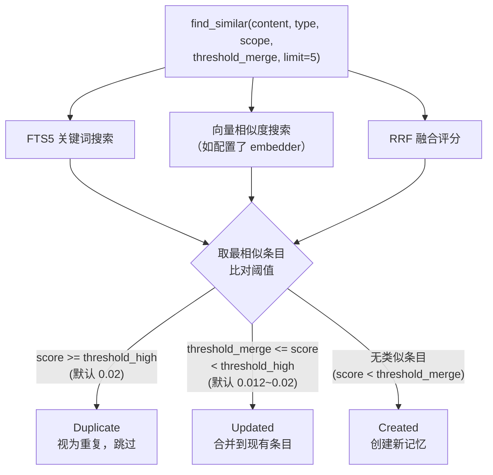
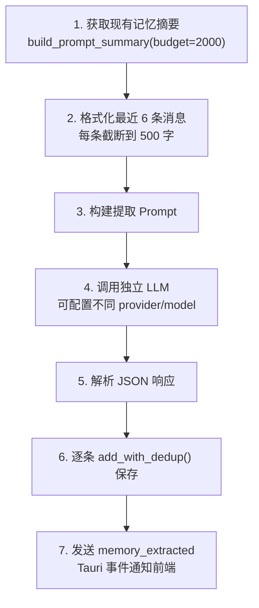
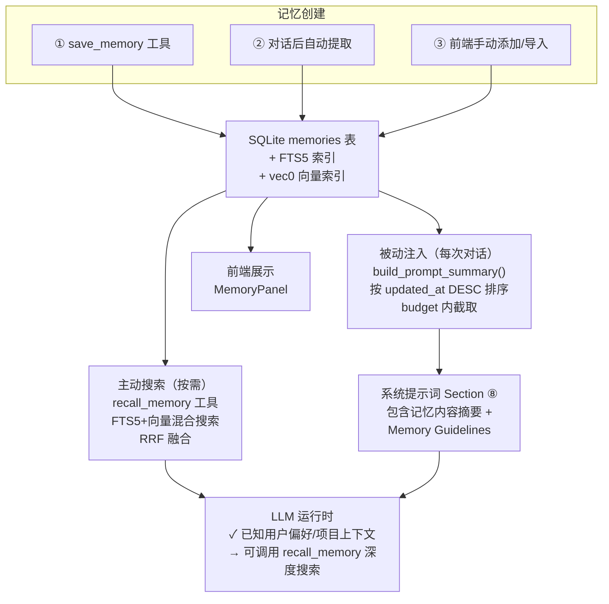
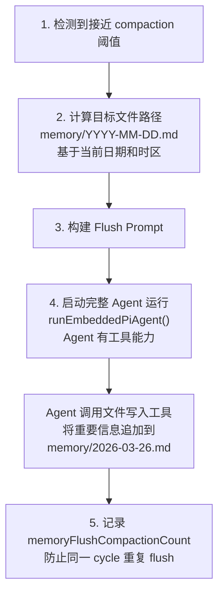
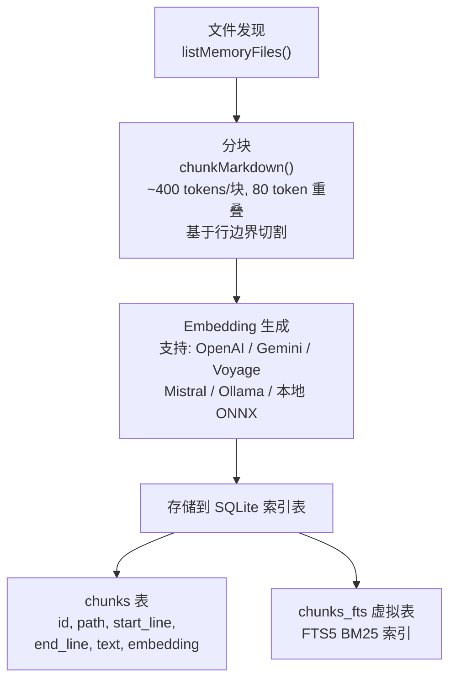
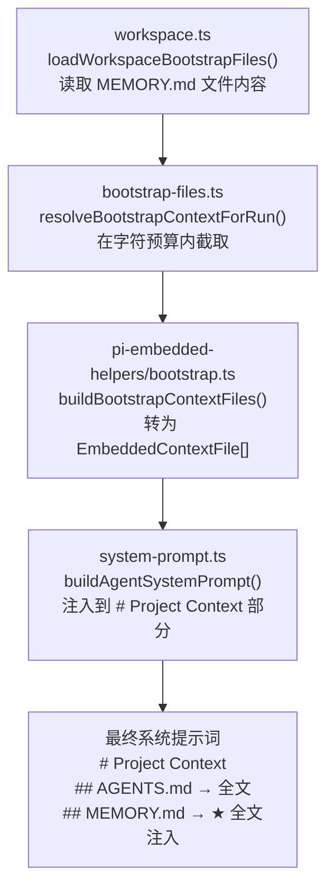
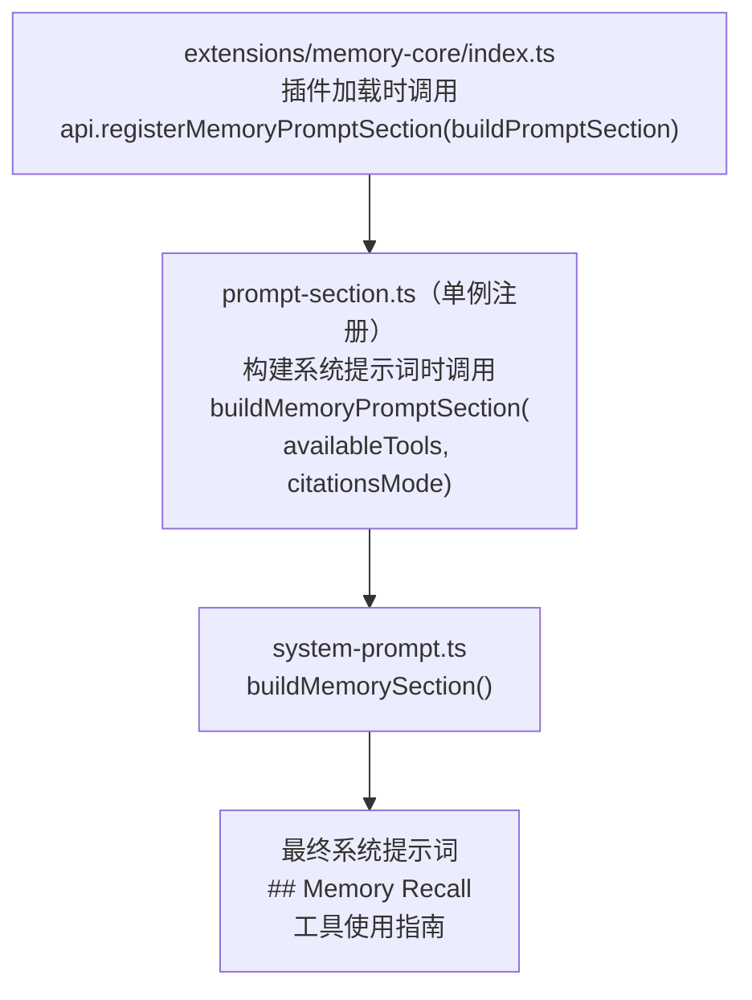
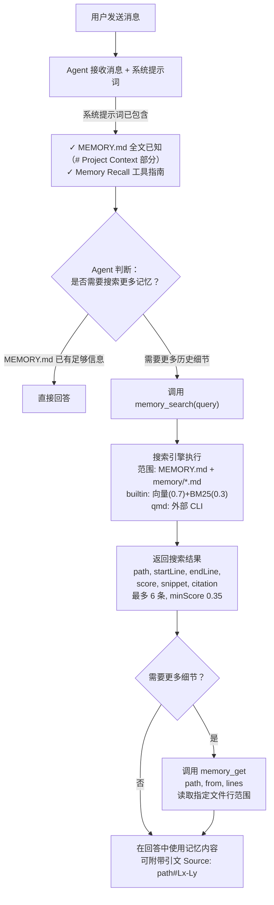
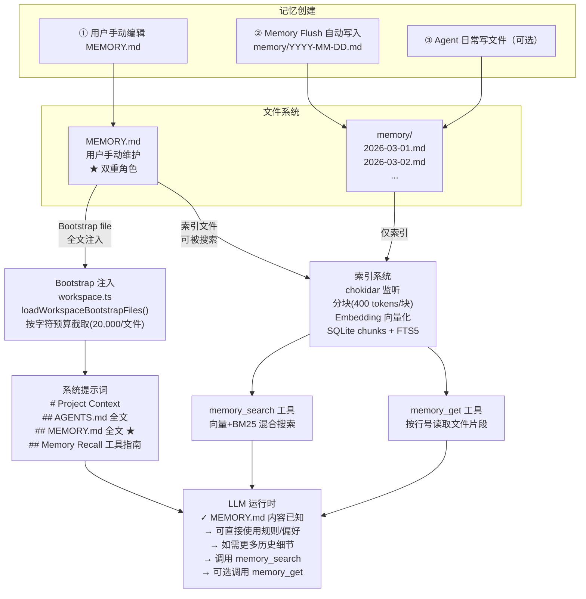

# 记忆系统对比分析：OpenComputer vs openclaw

本文档详细对比两个项目的记忆系统实现，重点分析记忆从创建到被 Agent 使用的完整工作流程。

---

## 一、架构总览

### 核心差异一句话（改进后）

| | OpenComputer（改进后） | openclaw |
|---|---|---|
| **记忆存储** | Core Memory（memory.md 文件）+ SQLite 数据库 + 会话 FTS5 索引 | 文件系统（Markdown 文件） |
| **系统提示词注入** | **三层注入**：Core Memory 全文 → SQLite 摘要（pinned 优先 ★）→ Guidelines | **直接注入 MEMORY.md 全文**（bootstrap file）+ 工具使用指南 |
| **Agent 获取记忆** | 被动读取（Core Memory + SQLite 摘要均已在提示词中）+ 主动搜索（recall_memory 工具，支持 include_history 搜索历史会话） | 被动读取（MEMORY.md 全文已在系统提示词中）+ 主动搜索（memory_search + memory_get 工具搜索 memory/*.md） |
| **记忆写入** | update_core_memory 工具写 memory.md + save_memory 写 SQLite + 对话后自动提取 + 压缩前 Memory Flush | Agent 直接写文件（memory/YYYY-MM-DD.md）+ 上下文压缩前自动 flush |
| **技术栈** | Rust + Tauri + SQLite + sqlite-vec | Node.js + SQLite + chokidar + 外部 CLI（qmd 可选） |

---

## 二、OpenComputer 记忆系统

### 2.1 数据模型

记忆存储在 SQLite 数据库中（`~/.opencomputer/memory.db`），每条记忆是一条数据库记录。

**表结构**（`src-tauri/src/memory/sqlite.rs`）：

```sql
CREATE TABLE memories (
    id              INTEGER PRIMARY KEY AUTOINCREMENT,
    memory_type     TEXT NOT NULL DEFAULT 'user',      -- user/feedback/project/reference
    scope_type      TEXT NOT NULL DEFAULT 'global',    -- global/agent
    scope_agent_id  TEXT,                              -- Agent 私有时的 agent_id
    content         TEXT NOT NULL,                     -- 记忆正文
    tags            TEXT NOT NULL DEFAULT '[]',        -- JSON 数组
    source          TEXT NOT NULL DEFAULT 'user',      -- user/auto/import
    source_session_id TEXT,                            -- 来源会话 ID
    embedding       BLOB,                              -- 向量（二进制）
    created_at      TEXT NOT NULL,
    updated_at      TEXT NOT NULL
);

-- FTS5 全文索引（通过触发器自动同步）
CREATE VIRTUAL TABLE memories_fts USING fts5(content, tags, content='memories', content_rowid='id', tokenize='unicode61');

-- 向量索引（sqlite-vec 扩展）
CREATE VIRTUAL TABLE memories_vec USING vec0(rowid INTEGER PRIMARY KEY, embedding float[N]);
```

**4 种记忆类型**：

| 类型 | 用途 | 示例 |
|------|------|------|
| `user` | 用户个人信息 | "用户是后端工程师，擅长 Rust" |
| `feedback` | 行为偏好/纠正 | "用户不喜欢代码注释，要求简洁回复" |
| `project` | 项目上下文 | "项目使用 Tauri 2 + React 19 架构" |
| `reference` | 外部资源引用 | "API 文档在 https://docs.example.com" |

**2 种作用域**：

| 作用域 | 含义 |
|--------|------|
| `Global` | 全局共享，所有 Agent 可见 |
| `Agent { id }` | 指定 Agent 私有 |

### 2.2 记忆创建的三条路径

#### 路径一：Agent 主动保存（save_memory 工具）

Agent 在对话中识别到值得保存的信息时，调用 `save_memory` 工具。

**工具定义**（`src-tauri/src/tools/memory.rs`）：
- 参数：`content`（必需）、`type`（user/feedback/project/reference）、`scope`（global/agent）、`tags`
- 去重：调用 `add_with_dedup()` 自动检测重复

**去重流程**（`add_with_dedup`）：



#### 路径二：对话后自动提取（memory_extract）

每次 LLM 响应成功后，异步检查是否需要自动提取记忆。

**触发条件**（`src-tauri/src/commands/chat.rs`）：

```
auto_extract == true  &&  对话历史长度 >= extract_min_turns × 2
```

其中 `auto_extract` 和 `extract_min_turns` 先取 Agent 配置，fallback 到全局配置（`config.json` 的 `memoryExtract` 字段）。默认 `auto_extract = false`，`extract_min_turns = 3`。

**提取流程**（`src-tauri/src/memory_extract.rs`）：



**提取 Prompt 内容**：

```
"Extract any new, memorable facts from the conversation.
 Return JSON array: [{content, type, tags}]
 Types: user / feedback / project / reference
 Rules:
 - Only extract NEW info not in 'Known memories' below
 - Be concise — 1-2 sentences each
 - Return [] if nothing worth remembering
 - Maximum 5 items

 Known memories: {现有记忆摘要}
 Conversation: {最近6条消息}"
```

#### 路径三：前端手动添加/导入

通过 MemoryPanel 设置面板，用户可以手动添加记忆或批量导入（JSON/Markdown 格式）。调用 Tauri 命令 `memory_add` / `memory_import`。

### 2.3 记忆注入系统提示词（核心流程）

**这是 OpenComputer 记忆系统最关键的特性：记忆内容被直接拼接到系统提示词中。**

#### 步骤一：生成记忆摘要

在每次构建系统提示词时调用（`src-tauri/src/agent/config.rs`）：

```rust
let memory_context = if definition.config.memory.enabled {
    crate::get_memory_backend().and_then(|b| {
        b.build_prompt_summary(
            agent_id,
            definition.config.memory.shared,       // 是否包含全局记忆
            definition.config.memory.prompt_budget, // 字符预算，默认 5000
        ).ok()
    })
} else {
    None
};
```

#### 步骤二：build_prompt_summary 的具体逻辑

（`src-tauri/src/memory/sqlite.rs`）：

```
1. 加载 Agent 作用域记忆（最新 200 条，按 updated_at DESC）
2. 如果 shared=true，加载全局记忆（最新 200 条）
3. 按类型分组，固定顺序：User → Feedback → Project → Reference
4. 在 budget 内逐条添加：
   ├─ 每条只取第一行（content.lines().next()）
   ├─ 格式："- {第一行内容}\n"
   ├─ 超出 budget 立即停止，追加 "[... truncated ...]"
   └─ 空类型跳过
```

**生成结果示例**：

```markdown
# Memory

## User
- 用户是后端工程师，擅长 Rust 和 Go
- 用户偏好简洁回复

## Feedback
- 不要在回复末尾总结刚才做了什么
- 代码修改后不需要加注释

## Project
- 项目使用 Tauri 2 + React 19 架构
- 3月5日后冻结非关键合并

[... truncated ...]
```

#### 步骤三：注入系统提示词

（`src-tauri/src/system_prompt.rs`，Section ⑧）：

```
系统提示词 = [
    ① 身份行
    ② agent.md
    ③ persona.md
    ④ 用户上下文
    ⑤ tools.md
    ⑥ 工具定义
    ⑦ 技能定义
    ⑧ Memory ← 记忆在这里
    ⑨ 运行时信息
    ⑩ 子 Agent 委派
    ⑪ 沙箱模式
]
```

Section ⑧ 的内容由两部分拼接：

```
┌───────────────────────────────────────────────────┐
│ 1. 现有记忆摘要（build_prompt_summary 的输出）    │
│    # Memory                                       │
│    ## User                                        │
│    - 用户是后端工程师...                           │
│    ## Feedback                                    │
│    - 不要在回复末尾总结...                        │
│                                                   │
│ 2. Memory Guidelines（固定文本）                  │
│    Use save_memory when:                          │
│    - The user shares personal info...             │
│    Use recall_memory when:                        │
│    - You need context about the user...           │
│    Do NOT save: ephemeral task details...         │
└───────────────────────────────────────────────────┘
```

### 2.4 记忆搜索（recall_memory 工具）

除了系统提示词中的被动注入，Agent 还可以通过 `recall_memory` 工具主动搜索。

**搜索流程**（`src-tauri/src/memory/sqlite.rs` 的 `search` 方法）：

```
输入：MemorySearchQuery { query, types, scope, limit }

Step 1: FTS5 关键词搜索
  SQL: SELECT rowid, rank FROM memories_fts WHERE memories_fts MATCH '"query"'
  返回: [(id, rank), ...]

Step 2: 向量相似度搜索（如配置了 embedder）
  a. 将 query 生成 embedding 向量
  b. SQL: SELECT rowid, distance FROM memories_vec WHERE embedding MATCH ?
  返回: [(id, distance), ...]

Step 3: RRF（Reciprocal Rank Fusion）合并
  对每个 id，计算融合分数：
    score(id) = Σ 1/(k + rank + 1)，其中 k=60
  FTS 和向量结果分别贡献各自的排名

Step 4: 按融合分数降序排列，应用 limit 和 scope 过滤
```

### 2.5 完整工作链路图



### 2.6 关键配置

**Agent 级别**（agent.json）：

```json
{
  "memory": {
    "enabled": true,           // 是否启用记忆系统
    "shared": true,            // 是否加载全局记忆
    "prompt_budget": 5000,     // 系统提示词中记忆的字符预算
    "auto_extract": null,      // null=继承全局配置
    "extract_min_turns": null,
    "extract_provider_id": null,
    "extract_model_id": null
  }
}
```

**全局**（config.json）：

```json
{
  "memoryExtract": {
    "auto_extract": false,
    "extract_min_turns": 3,
    "extract_provider_id": null,
    "extract_model_id": null
  },
  "dedup": {
    "threshold_high": 0.02,
    "threshold_merge": 0.012
  },
  "embedding": {
    "enabled": false,
    "provider_type": "OpenaiCompatible",
    "api_base_url": "...",
    "api_key": "...",
    "api_model": "text-embedding-3-small"
  }
}
```

---

## 三、openclaw 记忆系统

### 3.1 数据模型

记忆存储为**文件系统上的 Markdown 文件**，没有数据库记录的概念。

#### 两层记忆结构

openclaw 的记忆系统实际上分为**两层**，这是理解它的关键：

| 层级 | 文件 | 注入方式 | 用途 |
|------|------|---------|------|
| **第一层：Bootstrap 文件** | `MEMORY.md`（或 `memory.md`） | **直接全文注入系统提示词** | 用户手动维护的长期规则、偏好、要求 |
| **第二层：Memory 目录** | `memory/*.md` | 通过 `memory_search` / `memory_get` 工具按需搜索 | Agent 自动生成的日期归档记忆 |

#### 第一层：MEMORY.md 作为 Bootstrap File

**MEMORY.md 和 AGENTS.md、SOUL.md、TOOLS.md 一样，是 workspace bootstrap file 之一，在每次 Agent 运行时被直接读取并全文注入到系统提示词的 `# Project Context` 部分。**

Bootstrap file 列表（`src/agents/workspace.ts`）：

```
工作区根目录/
├─ AGENTS.md       ← 项目指南（类似 CLAUDE.md）
├─ SOUL.md         ← Agent 人格/语调
├─ TOOLS.md        ← 工具使用指南
├─ IDENTITY.md     ← 身份定义
├─ USER.md         ← 用户信息
├─ HEARTBEAT.md    ← 心跳配置
├─ BOOTSTRAP.md    ← 启动配置
└─ MEMORY.md       ← ★ 长期记忆（也是 bootstrap file！）
```

加载流程（`src/agents/workspace.ts` 的 `loadWorkspaceBootstrapFiles`）：

```typescript
// 固定列表：AGENTS.md, SOUL.md, TOOLS.md, IDENTITY.md, USER.md, HEARTBEAT.md, BOOTSTRAP.md
const entries = [
  { name: "AGENTS.md", filePath: path.join(dir, "AGENTS.md") },
  { name: "SOUL.md", filePath: path.join(dir, "SOUL.md") },
  // ... 其他固定文件
];

// MEMORY.md 单独处理：优先 MEMORY.md，不存在则 fallback 到 memory.md
const memoryEntry = await resolveMemoryBootstrapEntry(dir);
if (memoryEntry) {
  entries.push(memoryEntry);  // ← MEMORY.md 被加入 bootstrap 列表
}
```

注入系统提示词（`src/agents/system-prompt.ts`）：

```typescript
// 所有 bootstrap files 被注入到 # Project Context 部分
lines.push("# Project Context", "");
lines.push("The following project context files have been loaded:");
for (const file of validContextFiles) {
  lines.push(`## ${file.path}`, "", file.content, "");
  // ← MEMORY.md 的全部内容在这里被注入
}
```

**每个 bootstrap file 有字符预算限制**（默认 20,000 字符），超出会被截断。总预算 150,000 字符控制所有 bootstrap files 的总大小。

#### 第二层：memory/ 目录文件

`memory/*.md` 文件**不在** bootstrap file 列表中，不会被直接注入系统提示词。它们需要通过索引系统建立搜索能力，Agent 通过 `memory_search` / `memory_get` 工具按需搜索。

**文件发现规则**（`src/memory/internal.ts` 的 `isMemoryPath`，用于索引系统）：

```
以下路径被识别为记忆文件（用于搜索索引）：
├─ MEMORY.md          ← 也会被索引，可被 memory_search 搜索到
├─ memory.md          ← 小写变体
└─ memory/**/*.md     ← memory 目录下所有 .md 文件（递归）
    ├─ memory/2026-03-01.md
    ├─ memory/2026-03-02.md
    └─ memory/notes/important.md
```

- 支持额外自定义路径（`extraPaths` 配置）
- 符号链接被排除
- 无 frontmatter 要求，纯 Markdown 内容
- 可选支持多模态文件（图片/视频）

**关键区别**：
- `MEMORY.md` 是用户手动维护的静态文件（规则、要求、长期记忆），**既被直接注入系统提示词，又被索引可搜索**
- `memory/YYYY-MM-DD.md` 是 Agent 自动生成的日期归档文件，**只能通过搜索工具访问**

### 3.2 记忆创建的路径

#### 路径一：用户手动编辑

用户直接在工作区目录创建/编辑 `MEMORY.md` 或 `memory/*.md` 文件。这是最基本的方式——用户用文本编辑器写下要 Agent 记住的信息。

#### 路径二：Memory Flush（上下文压缩前自动保存）

**这是 openclaw 最独特的记忆写入机制。**

当会话接近上下文窗口限制时，在执行 compaction（上下文压缩）之前，系统会触发一次 Memory Flush，让 Agent 把重要信息写入文件。

**触发条件**（`src/auto-reply/reply/memory-flush.ts`）：

```
shouldRunMemoryFlush() = true 当：
  1. memoryFlush.enabled == true（默认 true）
  2. 不是心跳消息、不是 CLI 模式、工作区可写
  3. 当前 token 数 >= contextWindow - reserveTokensFloor - softThresholdTokens
     （即接近上下文窗口边界）
  4. 当前 compaction cycle 内还未执行过 flush

或者：
  会话 transcript 文件大小 >= forceFlushTranscriptBytes（默认 2MB）
```

**Flush 流程**（`src/auto-reply/reply/agent-runner-memory.ts`）：



**Flush Prompt 内容**：

```
"Pre-compaction memory flush.
 Store durable memories only in memory/YYYY-MM-DD.md
 (create memory/ if needed).
 Treat MEMORY.md, SOUL.md, TOOLS.md, AGENTS.md as
 read-only during this flush; never overwrite them.
 If memory/YYYY-MM-DD.md already exists, APPEND only.
 Do NOT create timestamped variant files.
 If nothing to store, reply with <silent/>.
 Current time: 2026-03-26 ..."
```

**关键设计点**：
- Agent 是通过**文件写入工具**来保存记忆的，不是通过专门的 memory API
- `MEMORY.md` 是只读的（flush 时不能修改），只有 `memory/YYYY-MM-DD.md` 可写
- Flush 是在 compaction 之前执行的，确保重要信息不会被压缩掉

#### 路径三：Agent 日常对话中直接写文件

Agent 也可以在正常对话过程中使用文件写入工具直接写入 `memory/*.md`，但这不是系统强制的行为——取决于 Agent 的 system prompt 是否鼓励这样做。

### 3.3 记忆索引

记忆文件通过索引系统建立搜索能力。支持两个后端：

#### builtin 后端（内置）

**索引建立流程**：



**索引同步触发点**：
- Agent 启动时（`onSessionStart: true`）
- 每次搜索请求时（`onSearch: true`）
- 文件变化时（chokidar watcher，1500ms 防抖）
- CLI 命令（`memory index`）

**同步策略**：通过文件 SHA256 hash 检测变化，未改变的文件跳过。

#### qmd 后端（外部 CLI）

- 调用外部 `qmd` 命令行工具
- 支持 3 种搜索模式：`search`（BM25）、`vsearch`（纯向量）、`query`（扩展查询）
- 5 分钟更新间隔，15 秒防抖

### 3.4 记忆注入系统提示词（核心流程）

**openclaw 的系统提示词注入分两部分：① MEMORY.md 全文注入（bootstrap）+ ② memory_search/memory_get 工具使用指南。**

#### 注入一：MEMORY.md 全文（bootstrap file 机制）



**所以用户在 MEMORY.md 中写的规则、要求，Agent 是直接就能看到的，不需要调用任何工具。**

#### 注入二：工具使用指南（memory-core 插件）



当 `memory_search` 和 `memory_get` 工具都可用时，注入的指南是：

```markdown
## Memory Recall
Before answering anything about prior work, decisions, dates, people,
preferences, or todos: run memory_search on MEMORY.md + memory/*.md;
then use memory_get to pull only the needed lines. If low confidence
after search, say you checked.

Citations: include Source: <path#line> when it helps the user verify
memory snippets.
```

**这部分只是工具使用指南**，指导 Agent 在需要时去搜索 `memory/*.md` 中的更多细节。
- 如果 `memory_search` 和 `memory_get` 都不可用，返回空数组，什么都不注入
- 引文模式可配置：`auto`（直接对话时启用）、`on`（总是）、`off`（禁用）

### 3.5 Agent 获取记忆的完整流程



### 3.6 完整工作链路图



### 3.7 关键配置

**全局**（config 对象）：

```javascript
{
  memory: {
    backend: "builtin",        // "builtin" 或 "qmd"
    citations: "auto",         // "auto" / "on" / "off"
    qmd: { /* qmd 后端配置 */ }
  },
  agents: {
    defaults: {
      memorySearch: {
        provider: "openai",
        model: "text-embedding-3-small",
        fallback: "local",
        chunking: { tokens: 400, overlap: 80 },
        query: {
          maxResults: 6,
          minScore: 0.35,
          hybrid: {
            enabled: true,
            vectorWeight: 0.7,
            textWeight: 0.3
          }
        },
        sync: {
          onSessionStart: true,
          onSearch: true,
          watch: true,
          watchDebounceMs: 1500
        }
      },
      compaction: {
        memoryFlush: {
          enabled: true,
          softThresholdTokens: 4000,
          forceFlushTranscriptBytes: 2097152  // 2MB
        }
      }
    }
  }
}
```

---

## 四、核心差异详细对比

### 4.1 系统提示词中的记忆

| 维度 | OpenComputer | openclaw |
|------|-------------|----------|
| **是否注入记忆内容** | 是，注入 SQLite 记忆摘要 | 是，注入 MEMORY.md 全文（bootstrap） |
| **注入格式** | `# Memory\n## User\n- 条目1\n- 条目2`（每条只取第一行） | `## MEMORY.md\n{文件全文内容}` |
| **注入位置** | Section ⑧（Memory 专用区域） | `# Project Context`（与 AGENTS.md 等并列） |
| **字符预算** | `prompt_budget`（默认 5000 字） | `DEFAULT_BOOTSTRAP_MAX_CHARS`（每文件限制）+ `TOTAL_MAX_CHARS`（总限制） |
| **截断策略** | 按 updated_at 排序，budget 内尽量多塞 | 文件内容超出预算时截断 |
| **注入粒度** | 数百条 SQLite 记录的摘要（每条仅第一行） | MEMORY.md 文件全文 |
| **Agent 首次感知** | Agent 看到结构化摘要列表 | Agent 看到用户原始写的 Markdown 全文 |
| **memory/ 目录** | 不适用（无此概念） | 不注入，需通过 memory_search 工具搜索 |

### 4.2 记忆写入方式

| 维度 | OpenComputer | openclaw |
|------|-------------|----------|
| **存储介质** | SQLite 数据库记录 | 文件系统 Markdown 文件 |
| **写入 API** | `save_memory` 专用工具 | Agent 通过文件写入工具写 Markdown |
| **自动写入** | 对话后异步 LLM 提取 | compaction 前 Memory Flush |
| **自动写入触发** | 每次回复后（如启用且达到 min_turns） | 接近上下文窗口限制时 |
| **去重** | 向量相似度 + 阈值判断 | 无内置去重（依赖 Agent 判断 APPEND） |
| **用户手动** | 设置面板 UI | 直接编辑文件 |

### 4.3 记忆搜索

| 维度 | OpenComputer | openclaw |
|------|-------------|----------|
| **搜索工具名** | `recall_memory` | `memory_search` + `memory_get` |
| **搜索引擎** | 单一内置（FTS5 + sqlite-vec） | 双后端可选（builtin / qmd） |
| **混合搜索** | FTS5 + 向量, RRF(k=60) 融合 | 向量(0.7) + BM25(0.3), RRF 融合 |
| **额外特性** | — | 可选 MMR 去重、时间衰减（30天半衰期） |
| **精确读取** | 无（搜索直接返回完整内容） | `memory_get` 按行号读取片段 |
| **引文** | 无 | 支持 `Source: path#Lx-Ly` 引文 |

### 4.4 记忆生命周期

| 阶段 | OpenComputer | openclaw |
|------|-------------|----------|
| **持久化** | SQLite 数据库，程序管理 | 文件系统，用户可直接浏览 |
| **版本控制** | 无（数据库记录） | 天然支持 git 版本控制 |
| **可移植性** | 需要导出（JSON/Markdown） | 直接复制文件 |
| **多 Agent** | scope 区分（Global/Agent） | 目录/文件级隔离 |

---

## 五、设计理念总结

### OpenComputer：数据库驱动 + 自动摘要注入

```
核心思路：
  记忆 → 存入 SQLite → 每次对话自动拼入系统提示词（每条仅第一行摘要）
  Agent 天然就"知道"已有记忆的概要

优点：
  ✓ Agent 立即可用记忆，无需额外工具调用
  ✓ 结构化存储，易于管理和查询
  ✓ 去重机制完善（向量相似度）
  ✓ 自动提取减少用户负担
  ✓ 细粒度控制（4 种类型 × 2 种作用域）

缺点：
  ✗ 占用系统提示词空间（默认 5000 字）
  ✗ 只注入第一行摘要，完整内容需要 recall_memory
  ✗ 无 pinned/置顶机制，按时间排序可能遗漏重要但古老的记忆
  ✗ 记忆不可直接 git 版本控制
  ✗ 用户无法直接浏览/编辑记忆（需要通过设置面板）
```

### openclaw：文件驱动 + 分层注入

```
核心思路：
  两层记忆：
  ├─ MEMORY.md → 全文注入系统提示词（bootstrap file，用户手动维护）
  └─ memory/*.md → 通过工具按需搜索（Agent 自动/手动写入）

优点：
  ✓ 核心规则（MEMORY.md）始终对 Agent 可见，无需工具调用
  ✓ 文件天然支持 git 版本控制
  ✓ 用户可直接编辑/浏览记忆文件
  ✓ Memory Flush 在压缩前自动保存重要信息
  ✓ 搜索更精确（向量+BM25+引文）
  ✓ 分层设计：核心规则全文可见 + 历史细节按需搜索

缺点：
  ✗ MEMORY.md 文件过大时占用大量系统提示词空间
  ✗ memory/*.md 需要 Agent 主动搜索才能获取
  ✗ 无内置去重，依赖 Agent 自觉 APPEND
  ✗ 索引建立需要 embedding 配置
```

### 改进后的对比

经过 P0-P3 改进，OpenComputer 已吸收了 openclaw 的核心优势：

| 能力 | OpenComputer（改进后） | openclaw |
|------|----------------------|----------|
| **固定注入** | ✅ Core Memory（memory.md 全文注入） | ✅ MEMORY.md（bootstrap file 全文注入） |
| **两层作用域** | ✅ 全局 + Agent 级 memory.md | ✅ workspace 级 MEMORY.md |
| **模型可写** | ✅ `update_core_memory` 工具（append/replace） | ❌ MEMORY.md 只读（flush 写 memory/*.md） |
| **记忆置顶** | ✅ pinned 字段 + ★ 标记优先注入 | ❌ 无（通过 MEMORY.md 间接实现） |
| **压缩前保存** | ✅ Memory Flush（Tier 3 前自动提取） | ✅ Memory Flush（compaction 前写文件） |
| **历史会话搜索** | ✅ FTS5 索引 + recall_memory(include_history) | ✅ sessions 索引 + memory_search |
| **去重** | ✅ 向量相似度 + RRF 融合 | ❌ 依赖 Agent APPEND |
| **版本控制** | ❌ SQLite 数据库 | ✅ 文件系统天然 git |

### OpenComputer 改进后的系统提示词 Section ⑧ 结构

```
⑧ Memory
├─ ## Core Memory (Global)     ← memory.md 全文（全局共享）
├─ ## Core Memory (Agent)      ← memory.md 全文（当前 Agent）
├─ # Memory                    ← SQLite 摘要（pinned ★ 优先）
│  ├─ ## About the User
│  ├─ ## Preferences & Feedback
│  ├─ ## Project Context
│  └─ ## References
└─ ## Memory Guidelines        ← 工具使用指南
   ├─ update_core_memory → 规则/指令/偏好
   ├─ save_memory → 事实/事件/引用
   └─ recall_memory → 检索（含 include_history）
```
