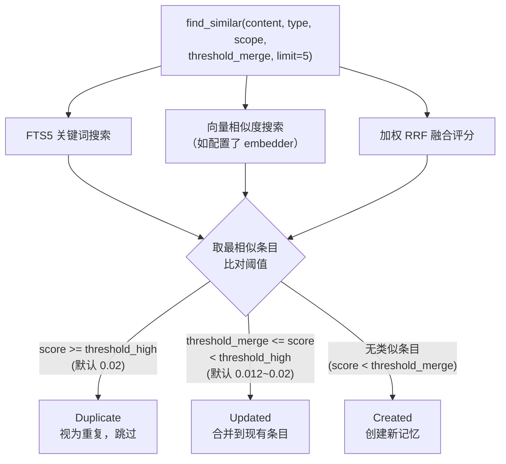
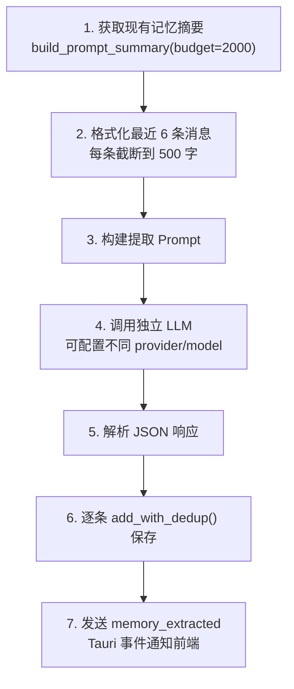
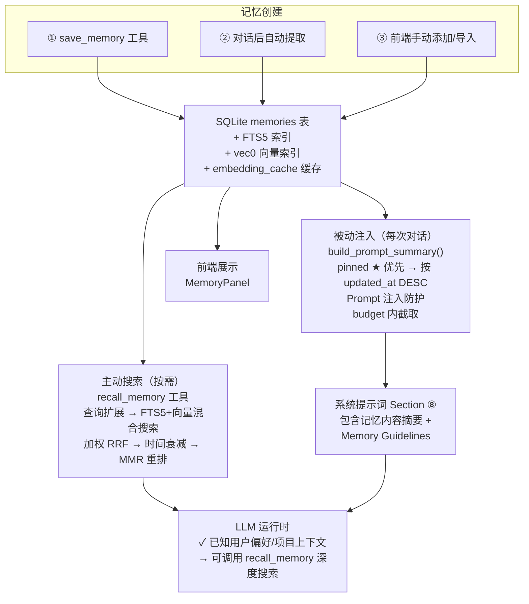
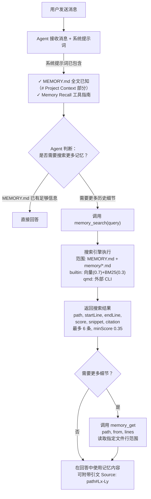

# 记忆系统对比分析：OpenComputer vs openclaw

本文档详细对比两个项目的记忆系统实现，重点分析记忆从创建到被 Agent 使用的完整工作流程。

---

## 一、架构总览

### 核心差异一句话（改进后）

| | OpenComputer（改进后） | openclaw |
|---|---|---|
| **记忆存储** | Core Memory（memory.md 文件）+ SQLite 数据库 + 会话 FTS5 索引 + Embedding 缓存 | 文件系统（Markdown 文件） |
| **系统提示词注入** | **三层注入**：Core Memory 全文 → SQLite 摘要（pinned 优先 ★，Prompt 注入防护）→ Guidelines | **直接注入 MEMORY.md 全文**（bootstrap file）+ 工具使用指南 |
| **Agent 获取记忆** | 被动读取（Core Memory + SQLite 摘要均已在提示词中）+ 主动搜索（recall_memory 工具，支持 include_history 搜索历史会话） | 被动读取（MEMORY.md 全文已在系统提示词中）+ 主动搜索（memory_search + memory_get 工具搜索 memory/*.md） |
| **记忆写入** | update_core_memory 工具写 memory.md + save_memory 写 SQLite + 对话后自动提取 + 压缩前 Memory Flush | Agent 直接写文件（memory/YYYY-MM-DD.md）+ 上下文压缩前自动 flush |
| **搜索引擎** | 加权 RRF（FTS5 + 向量）+ 查询扩展 + 时间衰减 + MMR 多样性重排 | 向量(0.7) + BM25(0.3) + 可选 MMR + 可选时间衰减 |
| **Embedding** | 8 个 Provider + Auto 自动选择 + Fallback 降级 + Batch API + 缓存 + 多模态（图片/音频） | 6 个 Provider + Auto 自动选择 + Fallback + 多模态 |
| **技术栈** | Rust + Tauri + SQLite + sqlite-vec + fastembed-rs | Node.js + SQLite + chokidar + 外部 CLI（qmd 可选） |

---

## 二、OpenComputer 记忆系统

### 2.1 数据模型

记忆存储在 SQLite 数据库中（`~/.opencomputer/memory.db`），每条记忆是一条数据库记录。

**表结构**（`src-tauri/src/memory/sqlite.rs`）：

```sql
CREATE TABLE memories (
    id              INTEGER PRIMARY KEY AUTOINCREMENT,
    memory_type     TEXT NOT NULL DEFAULT 'user',      -- user/feedback/project/reference
    scope_type      TEXT NOT NULL DEFAULT 'global',    -- global/agent
    scope_agent_id  TEXT,                              -- Agent 私有时的 agent_id
    content         TEXT NOT NULL,                     -- 记忆正文
    tags            TEXT NOT NULL DEFAULT '[]',        -- JSON 数组
    source          TEXT NOT NULL DEFAULT 'user',      -- user/auto/import
    source_session_id TEXT,                            -- 来源会话 ID
    embedding       BLOB,                              -- 向量（二进制 f32）
    pinned          INTEGER NOT NULL DEFAULT 0,        -- 置顶标记
    created_at      TEXT NOT NULL,
    updated_at      TEXT NOT NULL,
    attachment_path  TEXT,                              -- 多模态附件路径
    attachment_mime  TEXT                               -- 附件 MIME 类型
);

-- FTS5 全文索引（通过触发器自动同步）
CREATE VIRTUAL TABLE memories_fts USING fts5(content, tags, content='memories', content_rowid='id', tokenize='unicode61');

-- 向量索引（sqlite-vec 扩展）
CREATE VIRTUAL TABLE memories_vec USING vec0(rowid INTEGER PRIMARY KEY, embedding float[N]);

-- Embedding 缓存表（减少重复 API 调用）
CREATE TABLE embedding_cache (
    hash       TEXT NOT NULL,           -- 内容哈希
    provider   TEXT NOT NULL,           -- 如 "OpenaiCompatible"
    model      TEXT NOT NULL,           -- 如 "text-embedding-3-small"
    embedding  BLOB NOT NULL,           -- f32 二进制向量
    dimensions INTEGER NOT NULL,
    created_at TEXT NOT NULL DEFAULT (datetime('now')),
    PRIMARY KEY (hash, provider, model)
);
```

**4 种记忆类型**：

| 类型 | 用途 | 示例 |
|------|------|------|
| `user` | 用户个人信息 | "用户是后端工程师，擅长 Rust" |
| `feedback` | 行为偏好/纠正 | "用户不喜欢代码注释，要求简洁回复" |
| `project` | 项目上下文 | "项目使用 Tauri 2 + React 19 架构" |
| `reference` | 外部资源引用 | "API 文档在 https://docs.example.com" |

**2 种作用域**：

| 作用域 | 含义 |
|--------|------|
| `Global` | 全局共享，所有 Agent 可见 |
| `Agent { id }` | 指定 Agent 私有 |

### 2.2 记忆创建的三条路径

#### 路径一：Agent 主动保存（save_memory 工具）

Agent 在对话中识别到值得保存的信息时，调用 `save_memory` 工具。

**工具定义**（`src-tauri/src/tools/memory.rs`）：
- 参数：`content`（必需）、`type`（user/feedback/project/reference）、`scope`（global/agent）、`tags`
- 去重：调用 `add_with_dedup()` 自动检测重复

**去重流程**（`add_with_dedup`）：



#### 路径二：对话后自动提取（memory_extract）

每次 LLM 响应成功后，异步检查是否需要自动提取记忆。

**触发条件**（`src-tauri/src/commands/chat.rs`）：

```
auto_extract == true  &&  对话历史长度 >= extract_min_turns × 2
```

其中 `auto_extract` 和 `extract_min_turns` 先取 Agent 配置，fallback 到全局配置（`config.json` 的 `memoryExtract` 字段）。默认 `auto_extract = false`，`extract_min_turns = 3`。

**提取流程**（`src-tauri/src/memory_extract.rs`）：



**提取 Prompt 内容**：

```
"Extract any new, memorable facts from the conversation.
 Return JSON array: [{content, type, tags}]
 Types: user / feedback / project / reference
 Rules:
 - Only extract NEW info not in 'Known memories' below
 - Be concise — 1-2 sentences each
 - Return [] if nothing worth remembering
 - Maximum 5 items

 Known memories: {现有记忆摘要}
 Conversation: {最近6条消息}"
```

#### 路径三：前端手动添加/导入

通过 MemoryPanel 设置面板，用户可以手动添加记忆或批量导入（JSON/Markdown 格式）。调用 Tauri 命令 `memory_add` / `memory_import`。

### 2.3 记忆注入系统提示词（核心流程）

**这是 OpenComputer 记忆系统最关键的特性：记忆内容被直接拼接到系统提示词中。**

#### 步骤一：生成记忆摘要

在每次构建系统提示词时调用（`src-tauri/src/agent/config.rs`）：

```rust
let memory_context = if definition.config.memory.enabled {
    crate::get_memory_backend().and_then(|b| {
        b.build_prompt_summary(
            agent_id,
            definition.config.memory.shared,       // 是否包含全局记忆
            definition.config.memory.prompt_budget, // 字符预算，默认 5000
        ).ok()
    })
} else {
    None
};
```

#### 步骤二：build_prompt_summary 的具体逻辑

（`src-tauri/src/memory/sqlite.rs`）：

```
1. 加载 Agent 作用域记忆（最新 200 条，按 updated_at DESC）
2. 如果 shared=true，加载全局记忆（最新 200 条）
3. 按类型分组，固定顺序：User → Feedback → Project → Reference
4. 每组内 pinned ★ 置顶优先，再按 updated_at DESC 排序
5. 在 budget 内逐条添加：
   ├─ 每条只取第一行（content.lines().next()）
   ├─ Prompt 注入防护：检测可疑模式 + 转义特殊 token
   ├─ 格式："- ★ {内容}\n"（pinned）或 "- {内容}\n"
   ├─ 超出 budget 立即停止，追加 "[... truncated ...]"
   └─ 空类型跳过
```

**Prompt 注入防护**：在注入系统提示词前，每条记忆内容会经过 `sanitize_for_prompt()` 检查：
- 检测 12 种可疑模式（如 "ignore previous instructions"、"you are now"、`<|im_start|>` 等）
- 命中则替换为 `[Content filtered: potential prompt injection detected]`
- 转义 `<|`、`|>` 等特殊 token

**生成结果示例**：

```markdown
# Memory

## About the User
- ★ 用户是后端工程师，擅长 Rust 和 Go
- 用户偏好简洁回复

## Preferences & Feedback
- ★ 不要在回复末尾总结刚才做了什么
- 代码修改后不需要加注释

## Project Context
- 项目使用 Tauri 2 + React 19 架构
- [img] 项目架构图
- 3月5日后冻结非关键合并

[... truncated ...]
```

#### 步骤三：注入系统提示词

（`src-tauri/src/system_prompt.rs`，Section ⑧）：

```
系统提示词 = [
    ① 身份行
    ② agent.md
    ③ persona.md
    ④ 用户上下文
    ⑤ tools.md
    ⑥ 工具定义
    ⑦ 技能定义
    ⑧ Memory ← 记忆在这里
    ⑨ 运行时信息
    ⑩ 子 Agent 委派
    ⑪ 沙箱模式
]
```

Section ⑧ 的内容由两部分拼接：

```
┌───────────────────────────────────────────────────┐
│ 1. 现有记忆摘要（build_prompt_summary 的输出）    │
│    # Memory                                       │
│    ## About the User                              │
│    - ★ 用户是后端工程师...                        │
│    ## Preferences & Feedback                      │
│    - ★ 不要在回复末尾总结...                      │
│                                                   │
│ 2. Memory Guidelines（固定文本）                  │
│    Use save_memory when:                          │
│    - The user shares personal info...             │
│    Use recall_memory when:                        │
│    - You need context about the user...           │
│    Do NOT save: ephemeral task details...         │
└───────────────────────────────────────────────────┘
```

### 2.4 记忆搜索（recall_memory 工具）

除了系统提示词中的被动注入，Agent 还可以通过 `recall_memory` 工具主动搜索。

**搜索流程**（`src-tauri/src/memory/sqlite.rs` 的 `search` 方法）：

```
输入：MemorySearchQuery { query, types, scope, limit }

Step 1: FTS5 关键词搜索（带查询扩展）
  使用 expand_query() 提取关键词（中英双语停用词过滤）
  SQL: SELECT rowid, rank FROM memories_fts WHERE memories_fts MATCH '"keyword1" OR "keyword2"'
  返回: [(id, rank), ...]

Step 2: 向量相似度搜索（如配置了 embedder）
  a. 将 query 生成 embedding 向量（先查缓存 → 未命中再调 API）
  b. SQL: SELECT rowid, distance FROM memories_vec WHERE embedding MATCH ?
  返回: [(id, distance), ...]

Step 3: 加权 RRF（Reciprocal Rank Fusion）合并
  对每个 id，计算融合分数（权重可配）：
    score(id) += text_weight / (rrf_k + rank + 1)    // FTS 贡献
    score(id) += vector_weight / (rrf_k + rank + 1)  // 向量贡献
  默认：vector_weight=0.6, text_weight=0.4, rrf_k=60

Step 3b: 时间衰减（如启用）
  对非 pinned 记忆，按 updated_at 计算年龄：
    score *= exp(-λ * age_days)
    λ = ln(2) / half_life_days（默认 30 天）
  pinned 记忆（evergreen）不受衰减影响

Step 4: 按融合分数降序排列，应用 limit 和 scope 过滤

Step 5: MMR 多样性重排（如启用，默认开启）
  MMR = λ * relevance - (1-λ) * max_jaccard_to_selected
  从候选中迭代选出 limit 个结果（默认 λ=0.7）
  文本相似度使用 Jaccard 系数（支持 CJK unigram + bigram）
```

### 2.5 Embedding 系统

**8 个 Provider**（`src-tauri/src/memory/embedding.rs`）：

| Provider | 类型 | 默认模型 | 维度 |
|----------|------|---------|------|
| OpenAI | API (OpenAI Compatible) | text-embedding-3-small | 1536 |
| Google Gemini | API (Gemini) | gemini-embedding-001 | 768 |
| Jina AI | API (OpenAI Compatible) | jina-embeddings-v3 | 1024 |
| Cohere | API (OpenAI Compatible) | embed-multilingual-v3.0 | 1024 |
| SiliconFlow | API (OpenAI Compatible) | BAAI/bge-m3 | 1024 |
| Voyage AI | API (OpenAI Compatible) | voyage-3 | 1024 |
| Mistral | API (OpenAI Compatible) | mistral-embed | 1024 |
| Ollama | API (OpenAI Compatible) | nomic-embed-text | 768 |

**4 个本地 ONNX 模型**（via fastembed-rs）：

| 模型 | 维度 | 大小 | 最低内存 | 语言 |
|------|------|------|---------|------|
| BGE Small English v1.5 | 384 | 33MB | 4GB | 英文 |
| BGE Small Chinese v1.5 | 384 | 33MB | 4GB | 中文 |
| Multilingual E5 Small | 384 | 90MB | 8GB | 多语言 |
| BGE Large English v1.5 | 1024 | 335MB | 16GB | 英文 |

**核心特性**：

| 特性 | 说明 |
|------|------|
| **Auto 自动选择** | 按优先级 Local(10)→OpenAI(20)→Gemini(30)→Voyage(40)→Mistral(50) 自动选择，复用已配 LLM API Key，零额外配置 |
| **Fallback 降级** | `FallbackEmbeddingProvider` 包装器：primary 失败 → 自动尝试 fallback（维度必须匹配） |
| **Gemini 批量接口** | `batchEmbedContents` 端点，100 条/批次（原来逐条请求 N 次 → 现在 1 次），失败自动降级回单条 |
| **L2 向量归一化** | 所有 Provider 返回值统一 L2 归一化，确保余弦相似度一致性 |
| **Token 限制管理** | per-model 限制表 + `truncate_utf8` 安全截断（不截断到 UTF-8 边界中间） |
| **Voyage input_type** | 自动注入 `query`（搜索场景）/ `document`（索引场景）非对称 embedding |
| **Embedding 缓存** | SQLite `embedding_cache` 表，hash+provider+model 三元组去重，避免重复 API 调用，自动清理 |
| **多模态 Embedding** | 图片（jpg/png/webp/gif/heic/heif）+ 音频（mp3/wav/ogg/opus/m4a/aac/flac），Gemini embedding-2 专属。双重门控（config + provider），10MB 上限，失败自动降级文本 |

### 2.6 完整工作链路图



### 2.7 关键配置

**Agent 级别**（agent.json）：

```json
{
  "memory": {
    "enabled": true,
    "shared": true,
    "prompt_budget": 5000,
    "auto_extract": null,
    "extract_min_turns": null,
    "extract_provider_id": null,
    "extract_model_id": null,
    "flush_before_compact": null
  }
}
```

**全局**（config.json）：

```json
{
  "memoryExtract": {
    "auto_extract": false,
    "extract_min_turns": 3,
    "extract_provider_id": null,
    "extract_model_id": null,
    "flush_before_compact": false
  },
  "dedup": {
    "threshold_high": 0.02,
    "threshold_merge": 0.012
  },
  "embedding": {
    "enabled": false,
    "providerType": "auto",
    "apiBaseUrl": "...",
    "apiKey": "...",
    "apiModel": "text-embedding-3-small",
    "apiDimensions": 1536,
    "fallbackProviderType": null,
    "fallbackApiBaseUrl": null,
    "fallbackApiKey": null,
    "fallbackApiModel": null,
    "fallbackApiDimensions": null
  },
  "hybridSearch": {
    "vectorWeight": 0.6,
    "textWeight": 0.4,
    "rrfK": 60.0
  },
  "temporalDecay": {
    "enabled": false,
    "halfLifeDays": 30.0
  },
  "mmr": {
    "enabled": true,
    "lambda": 0.7
  },
  "embeddingCache": {
    "enabled": true,
    "maxEntries": 10000
  },
  "multimodal": {
    "enabled": false,
    "modalities": ["image", "audio"],
    "maxFileBytes": 10485760
  }
}
```

---

## 三、openclaw 记忆系统

### 3.1 数据模型

记忆存储为**文件系统上的 Markdown 文件**，没有数据库记录的概念。

#### 两层记忆结构

openclaw 的记忆系统实际上分为**两层**，这是理解它的关键：

| 层级 | 文件 | 注入方式 | 用途 |
|------|------|---------|------|
| **第一层：Bootstrap 文件** | `MEMORY.md`（或 `memory.md`） | **直接全文注入系统提示词** | 用户手动维护的长期规则、偏好、要求 |
| **第二层：Memory 目录** | `memory/*.md` | 通过 `memory_search` / `memory_get` 工具按需搜索 | Agent 自动生成的日期归档记忆 |

#### 第一层：MEMORY.md 作为 Bootstrap File

**MEMORY.md 和 AGENTS.md、SOUL.md、TOOLS.md 一样，是 workspace bootstrap file 之一，在每次 Agent 运行时被直接读取并全文注入到系统提示词的 `# Project Context` 部分。**

每个 bootstrap file 有字符预算限制（默认 20,000 字符），超出会被截断。总预算 150,000 字符控制所有 bootstrap files 的总大小。

#### 第二层：memory/ 目录文件

`memory/*.md` 文件**不在** bootstrap file 列表中，不会被直接注入系统提示词。它们需要通过索引系统建立搜索能力，Agent 通过 `memory_search` / `memory_get` 工具按需搜索。

### 3.2 记忆创建的路径

#### 路径一：用户手动编辑

用户直接在工作区目录创建/编辑 `MEMORY.md` 或 `memory/*.md` 文件。

#### 路径二：Memory Flush（上下文压缩前自动保存）

当会话接近上下文窗口限制时，在执行 compaction 之前触发 Memory Flush，让 Agent 把重要信息写入 `memory/YYYY-MM-DD.md`。`MEMORY.md` 在 flush 时是只读的。

#### 路径三：Agent 日常对话中直接写文件

Agent 也可以在正常对话过程中使用文件写入工具直接写入 `memory/*.md`。

### 3.3 记忆索引

记忆文件通过索引系统建立搜索能力。支持两个后端：

#### builtin 后端（内置）

- 分块：~400 tokens/块，80 token 重叠，基于行边界切割
- Embedding：支持 OpenAI / Gemini / Voyage / Mistral / Ollama / 本地 GGUF
- 存储：SQLite chunks 表 + FTS5 索引 + sqlite-vec 向量索引
- 同步：chokidar 文件监听 + SHA256 hash 变更检测

#### qmd 后端（外部 CLI）

- 调用外部 `qmd` 命令行工具
- 支持 3 种搜索模式：`search`（BM25）、`vsearch`（纯向量）、`query`（扩展查询）

### 3.4 Agent 获取记忆的完整流程



### 3.5 关键配置

```javascript
{
  memory: {
    backend: "builtin",        // "builtin" 或 "qmd"
    citations: "auto",         // "auto" / "on" / "off"
  },
  agents: {
    defaults: {
      memorySearch: {
        provider: "openai",
        model: "text-embedding-3-small",
        fallback: "local",
        chunking: { tokens: 400, overlap: 80 },
        query: {
          maxResults: 6,
          minScore: 0.35,
          hybrid: { enabled: true, vectorWeight: 0.7, textWeight: 0.3 }
        },
        sync: { onSessionStart: true, onSearch: true, watch: true, watchDebounceMs: 1500 }
      },
      compaction: {
        memoryFlush: {
          enabled: true,
          softThresholdTokens: 4000,
          forceFlushTranscriptBytes: 2097152  // 2MB
        }
      }
    }
  }
}
```

---

## 四、核心差异详细对比

### 4.1 系统提示词中的记忆

| 维度 | OpenComputer | openclaw |
|------|-------------|----------|
| **是否注入记忆内容** | 是，注入 SQLite 记忆摘要（含 Prompt 注入防护） | 是，注入 MEMORY.md 全文（bootstrap） |
| **注入格式** | `# Memory\n## User\n- ★ [img] 条目1\n- 条目2`（pinned 优先，附件标记 [img]/[audio]） | `## MEMORY.md\n{文件全文内容}` |
| **注入位置** | Section ⑧（Memory 专用区域） | `# Project Context`（与 AGENTS.md 等并列） |
| **字符预算** | `prompt_budget`（默认 5000 字） | `DEFAULT_BOOTSTRAP_MAX_CHARS`（每文件限制）+ `TOTAL_MAX_CHARS`（总限制） |
| **安全防护** | 12 种 Prompt 注入模式检测 + 特殊 token 转义 | HTML 转义 + `<relevant-memories>` 标签标记 |
| **注入粒度** | 数百条 SQLite 记录的摘要（每条仅第一行） | MEMORY.md 文件全文 |
| **Agent 首次感知** | Agent 看到结构化摘要列表（pinned ★ 优先） | Agent 看到用户原始写的 Markdown 全文 |

### 4.2 记忆写入方式

| 维度 | OpenComputer | openclaw |
|------|-------------|----------|
| **存储介质** | SQLite 数据库记录 | 文件系统 Markdown 文件 |
| **写入 API** | `save_memory` 专用工具 | Agent 通过文件写入工具写 Markdown |
| **自动写入** | 对话后异步 LLM 提取 | compaction 前 Memory Flush |
| **自动写入触发** | 每次回复后（如启用且达到 min_turns） | 接近上下文窗口限制时 |
| **去重** | 向量相似度 + 两阶阈值判断（跳过/合并） | 无内置去重（依赖 Agent 判断 APPEND） |
| **用户手动** | 设置面板 UI | 直接编辑文件 |

### 4.3 记忆搜索

| 维度 | OpenComputer | openclaw |
|------|-------------|----------|
| **搜索工具名** | `recall_memory` | `memory_search` + `memory_get` |
| **搜索引擎** | 单一内置（FTS5 + sqlite-vec） | 双后端可选（builtin / qmd） |
| **混合搜索权重** | 可配：vector_weight=0.6, text_weight=0.4 | 固定：向量(0.7) + BM25(0.3) |
| **查询扩展** | 中英双语停用词过滤 + 关键词提取 | 英语停用词过滤 + 关键词提取 |
| **时间衰减** | 可配：pinned=evergreen，按 updated_at 计算 | 可配：按文件名日期/mtime 计算 |
| **MMR 多样性重排** | 可配：Jaccard + CJK bigram, λ=0.7 | 可配：Jaccard + CJK bigram, λ=0.7 |
| **Embedding 缓存** | SQLite 表，hash+provider+model 三元组 | SQLite 表，hash+provider+model 三元组 |
| **精确读取** | 无（搜索直接返回完整内容） | `memory_get` 按行号读取片段 |
| **引文** | 无 | 支持 `Source: path#Lx-Ly` 引文 |

### 4.4 Embedding Provider 对比

| 维度 | OpenComputer | openclaw |
|------|-------------|----------|
| **Provider 总数** | **8 个** | 6 个 |
| **OpenAI** | ✅ | ✅ |
| **Google Gemini** | ✅（含 batchEmbedContents 批量接口 + 多模态 embedding） | ✅（含 batchEmbedContents + 多模态） |
| **Jina AI** | ✅ | ❌ |
| **Cohere** | ✅ | ❌ |
| **SiliconFlow** | ✅ | ❌ |
| **Voyage AI** | ✅（含 input_type 非对称 embedding） | ✅（含 input_type） |
| **Mistral** | ✅ | ✅ |
| **Ollama** | ✅ | ✅ |
| **本地模型** | 4 个 ONNX 模型（fastembed-rs） | 1 个 GGUF 模型（node-llama-cpp） |
| **Auto 自动选择** | ✅ 复用 LLM Key，零配置 | ✅ 按优先级尝试 |
| **Fallback 降级** | ✅ 维度校验 | ✅ |
| **L2 归一化** | ✅ 所有 Provider 统一 | ✅ |
| **Token 限制** | ✅ per-model 限制表 + 安全截断 | ✅ per-model 限制 + UTF-8 分割 |
| **Batch API** | ✅ Gemini batchEmbedContents | ✅ OpenAI/Gemini/Voyage 三家 Batch API（JSONL） |
| **多模态** | ✅ Gemini embedding-2（图片/音频，10MB，14 种格式） | ✅ Gemini embedding-2-preview |

### 4.5 记忆生命周期

| 阶段 | OpenComputer | openclaw |
|------|-------------|----------|
| **持久化** | SQLite 数据库，程序管理 | 文件系统，用户可直接浏览 |
| **版本控制** | 无（数据库记录） | 天然支持 git 版本控制 |
| **可移植性** | 需要导出（JSON/Markdown） | 直接复制文件 |
| **多 Agent** | scope 区分（Global/Agent） | 目录/文件级隔离 |

---

## 五、设计理念总结

### OpenComputer：数据库驱动 + 自动摘要注入 + 智能搜索

```
核心思路：
  记忆 → 存入 SQLite → 每次对话自动拼入系统提示词（每条仅第一行摘要）
  Agent 天然就"知道"已有记忆的概要

优点：
  ✓ Agent 立即可用记忆，无需额外工具调用
  ✓ 结构化存储，易于管理和查询
  ✓ 去重机制完善（向量相似度 + 两阶阈值）
  ✓ 自动提取减少用户负担
  ✓ 细粒度控制（4 种类型 × 2 种作用域 × pinned 置顶）
  ✓ Prompt 注入防护
  ✓ 搜索智能：查询扩展 + 时间衰减 + MMR 多样性重排
  ✓ 8 个 Embedding Provider + Auto 自动选择 + Fallback
  ✓ Embedding 缓存节省 API 费用
  ✓ 多模态 Embedding（图片/音频 → 向量，Gemini embedding-2）

缺点：
  ✗ 占用系统提示词空间（默认 5000 字）
  ✗ 只注入第一行摘要，完整内容需要 recall_memory
  ✗ 记忆不可直接 git 版本控制
  ✗ 用户无法直接浏览/编辑记忆（需要通过设置面板）
```

### openclaw：文件驱动 + 分层注入

```
核心思路：
  两层记忆：
  ├─ MEMORY.md → 全文注入系统提示词（bootstrap file，用户手动维护）
  └─ memory/*.md → 通过工具按需搜索（Agent 自动/手动写入）

优点：
  ✓ 核心规则（MEMORY.md）始终对 Agent 可见，无需工具调用
  ✓ 文件天然支持 git 版本控制
  ✓ 用户可直接编辑/浏览记忆文件
  ✓ Memory Flush 在压缩前自动保存重要信息
  ✓ 搜索更精确（向量+BM25+引文）
  ✓ 分层设计：核心规则全文可见 + 历史细节按需搜索
  ✓ 多模态 embedding（Gemini embedding-2-preview）
  ✓ OpenAI/Gemini/Voyage 三家完整 Batch API

缺点：
  ✗ MEMORY.md 文件过大时占用大量系统提示词空间
  ✗ memory/*.md 需要 Agent 主动搜索才能获取
  ✗ 无内置去重，依赖 Agent 自觉 APPEND
  ✗ 索引建立需要 embedding 配置
```

### 改进后的完整对比

| 能力 | OpenComputer | openclaw |
|------|-------------|----------|
| **固定注入** | ✅ Core Memory（memory.md 全文注入） | ✅ MEMORY.md（bootstrap file 全文注入） |
| **两层作用域** | ✅ 全局 + Agent 级 memory.md | ✅ workspace 级 MEMORY.md |
| **模型可写** | ✅ `update_core_memory` 工具（append/replace） | ❌ MEMORY.md 只读（flush 写 memory/*.md） |
| **记忆置顶** | ✅ pinned 字段 + ★ 标记优先注入 | ❌ 无（通过 MEMORY.md 间接实现） |
| **压缩前保存** | ✅ Memory Flush（Tier 3 前自动提取） | ✅ Memory Flush（compaction 前写文件） |
| **历史会话搜索** | ✅ FTS5 索引 + recall_memory(include_history) | ✅ sessions 索引 + memory_search |
| **去重** | ✅ 向量相似度 + 两阶阈值（跳过/合并） | ❌ 依赖 Agent APPEND |
| **Prompt 注入防护** | ✅ 12 种模式检测 + token 转义 | ✅ HTML 转义 + 标签包裹 |
| **查询扩展** | ✅ 中英双语停用词过滤 | ✅ 英语停用词过滤 |
| **时间衰减** | ✅ pinned=evergreen（更直觉） | ✅ 文件名模式判断 evergreen |
| **MMR 多样性重排** | ✅ Jaccard + CJK bigram | ✅ Jaccard + CJK bigram |
| **搜索权重可配** | ✅ 前端 UI 滑块 | ✅ 配置文件 |
| **Embedding 缓存** | ✅ SQLite 表，自动清理 | ✅ SQLite 表 |
| **Embedding Provider** | **8 个**（+Jina/Cohere/SiliconFlow） | 6 个 |
| **本地模型** | **4 个** ONNX (fastembed-rs) | 1 个 GGUF (node-llama-cpp) |
| **Auto 选择** | ✅ 复用 LLM Key，零配置 | ✅ 按优先级尝试 |
| **Fallback Provider** | ✅ 维度校验 | ✅ |
| **Gemini 批量** | ✅ batchEmbedContents | ✅ batchEmbedContents |
| **L2 归一化** | ✅ | ✅ |
| **Token 限制** | ✅ per-model 限制 + 安全截断 | ✅ |
| **多模态 embedding** | ✅ 图片+音频（14 种格式，Gemini embedding-2） | ✅ Gemini embedding-2-preview |
| **完整 Batch API** | ❌（仅 Gemini batch） | ✅ 三家 JSONL Batch |
| **版本控制** | ❌ SQLite 数据库 | ✅ 文件系统天然 git |

### OpenComputer 系统提示词 Section ⑧ 结构

```
⑧ Memory
├─ ## Core Memory (Global)     ← memory.md 全文（全局共享）
├─ ## Core Memory (Agent)      ← memory.md 全文（当前 Agent）
├─ # Memory                    ← SQLite 摘要（pinned ★ 优先，Prompt 注入防护）
│  ├─ ## About the User
│  ├─ ## Preferences & Feedback
│  ├─ ## Project Context
│  └─ ## References
└─ ## Memory Guidelines        ← 工具使用指南
   ├─ update_core_memory → 规则/指令/偏好
   ├─ save_memory → 事实/事件/引用
   └─ recall_memory → 检索（含 include_history）
```

---

## 六、关键文件清单

### OpenComputer

| 文件 | 用途 |
|------|------|
| `src-tauri/src/memory/mod.rs` | 模块导出 |
| `src-tauri/src/memory/types.rs` | 数据结构：MemoryType, MemoryScope, MemoryEntry（含 attachment_path/mime）, SearchQuery, 配置结构体（HybridSearchConfig, TemporalDecayConfig, MmrConfig, EmbeddingCacheConfig, MultimodalConfig）+ MIME 检测工具 |
| `src-tauri/src/memory/traits.rs` | MemoryBackend trait + EmbeddingProvider trait（含 MultimodalInput + supports_multimodal + embed_multimodal） |
| `src-tauri/src/memory/sqlite.rs` | SQLite 后端：schema（含 attachment 列 + embedding_cache 表）+ CRUD + 混合搜索（加权 RRF + 时间衰减 + MMR）+ Embedding 缓存 + 多模态 Embedding + Prompt 注入防护 |
| `src-tauri/src/memory/embedding.rs` | 8 个 Embedding Provider + Auto 自动选择 + Fallback + Token 限制 + L2 归一化 + Gemini 批量接口 + Gemini 多模态（call_google_multimodal） |
| `src-tauri/src/memory/mmr.rs` | MMR 多样性重排算法（Jaccard + CJK bigram） |
| `src-tauri/src/memory/helpers.rs` | FTS 查询构建 + 查询扩展（中英双语停用词）+ 配置加载器 |
| `src-tauri/src/memory/import.rs` | JSON/Markdown 导入 |
| `src-tauri/src/memory_extract.rs` | 对话后自动提取 + flush_before_compact |
| `src-tauri/src/system_prompt.rs` | 系统提示词拼装（Section ⑧ Memory） |
| `src-tauri/src/commands/memory.rs` | Tauri 命令（CRUD + 配置 get/save） |
| `src-tauri/src/tools/memory.rs` | Agent 工具：save_memory, recall_memory, update_memory, delete_memory, update_core_memory |
| `src-tauri/src/paths.rs` | 路径管理（含 memory_attachments_dir） |
| `src/components/settings/memory-panel/EmbeddingView.tsx` | 前端：Embedding 配置 + Auto 按钮 + 搜索调优面板 + 多模态开关 |
