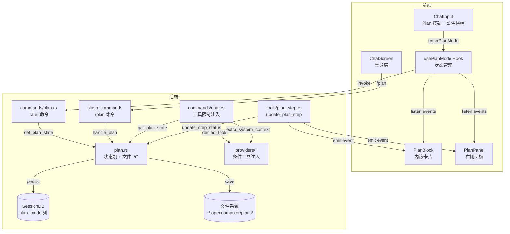
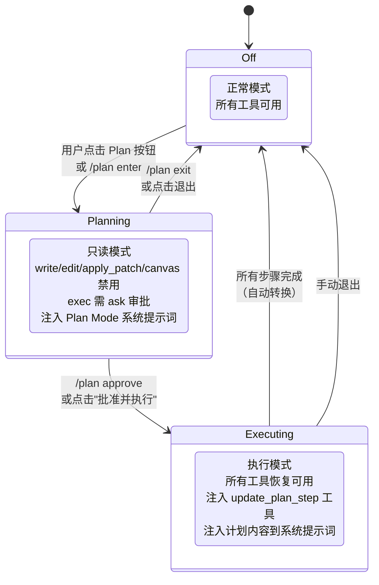
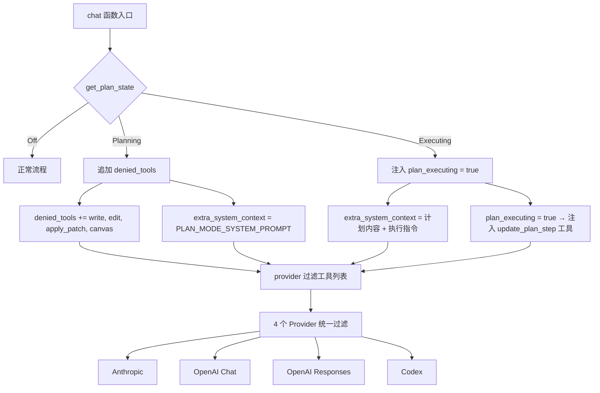
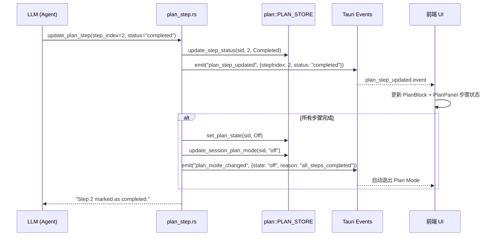
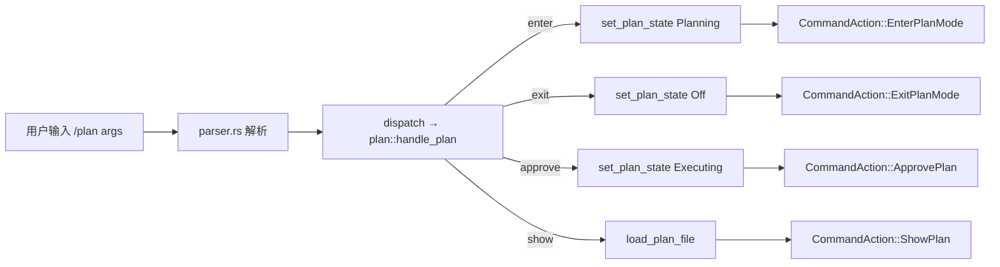
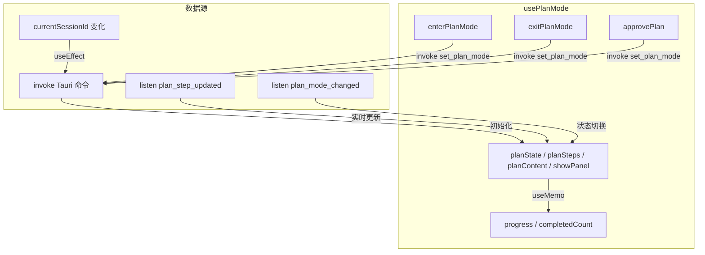
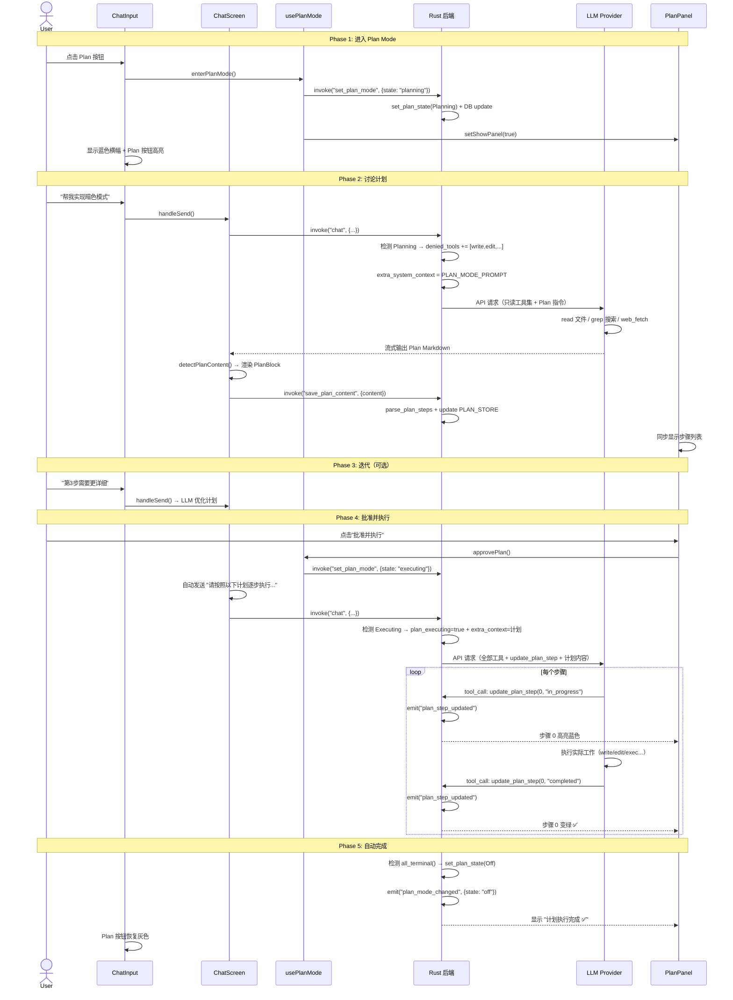

# OpenComputer Plan Mode 架构文档

> 更新时间：2026-03-26

## 目录

- [概述](#概述)（含系统架构总览图）
- [核心概念](#核心概念)
- [三态状态机](#三态状态机)（含状态流转图）
- [后端架构](#后端架构)
  - [Plan 状态管理](#plan-状态管理)（含数据结构）
  - [工具限制机制](#工具限制机制)（含过滤流程图）
  - [系统提示词注入](#系统提示词注入)
  - [Plan 文件持久化](#plan-文件持久化)
  - [Markdown Checklist 解析](#markdown-checklist-解析)
  - [update_plan_step 工具](#update_plan_step-工具)（含事件流图）
- [斜杠命令 /plan](#斜杠命令-plan)（含命令分发图）
- [Tauri 命令一览](#tauri-命令一览)
- [前端架构](#前端架构)
  - [usePlanMode Hook](#useplanmode-hook)（含状态流图）
  - [ChatInput 集成](#chatinput-集成)（含 UI 示意图）
  - [PlanBlock 内嵌卡片](#planblock-内嵌卡片)
  - [PlanPanel 右侧面板](#planpanel-右侧面板)（含 UI 示意图）
  - [planParser 解析器](#planparser-解析器)
- [完整交互流程](#完整交互流程)（含全链路时序图）
- [DB Schema 变更](#db-schema-变更)
- [事件系统](#事件系统)
- [安全设计](#安全设计)
- [与 Claude Code / OpenCode 对比](#与-claude-code--opencode-对比)
- [文件清单](#文件清单)

---

## 概述

Plan Mode 是 OpenComputer 的可视化交互计划模式。在该模式下，LLM 只能执行只读操作（读文件、搜索代码、浏览网页），不能修改任何文件，用于在执行前充分分析需求、探索代码库、设计实现方案。用户可与 LLM 迭代讨论和修改计划，满意后批准执行，执行过程中实时追踪步骤进度。

**核心设计原则：**

1. **零侵入集成**：复用现有 `denied_tools` + `extra_system_context` + 条件工具注入机制，不改变核心 chat 流程
2. **可视化优先**：ChatInput 工具栏按钮（主入口）+ `/plan` 斜杠命令（辅助入口），内嵌 PlanBlock + 右侧 PlanPanel 双视图
3. **实时追踪**：`update_plan_step` 内部工具 + Tauri 全局事件驱动前端 UI 实时更新
4. **会话级隔离**：Plan Mode 状态绑定到 session，不影响其他会话
5. **安全继承**：子 Agent 自动继承父 session 的 Plan Mode 工具限制

### 系统架构总览



---

## 核心概念

| 概念 | 说明 |
|------|------|
| **PlanModeState** | 三态枚举：Off / Planning / Executing |
| **PlanStep** | 计划中的单个步骤，包含 index、phase、title、status、duration |
| **PlanMeta** | 计划元数据，包含 session_id、state、steps、file_path、时间戳 |
| **denied_tools** | Planning 状态下被禁用的工具列表 |
| **update_plan_step** | 内部工具，LLM 在 Executing 状态下用于报告步骤进度 |
| **Plan File** | Markdown 格式的计划文件，存储在 `~/.opencomputer/plans/` |

---

## 三态状态机

Plan Mode 有三个状态，按 session 隔离：



### 各状态的行为差异

| 维度 | Off | Planning | Executing |
|------|-----|----------|-----------|
| 文件修改工具 | 可用 | **禁用** (write/edit/apply_patch/canvas) | 可用 |
| exec 工具 | 按权限模式 | 强制 ask | 按权限模式 |
| update_plan_step | 不注入 | 不注入 | **注入** |
| 系统提示词 | 无额外注入 | Plan Mode 指令 | 计划内容 + 执行指令 |
| ChatInput 外观 | 灰色 Plan 按钮 | 蓝色高亮 + 横幅 | 绿色 + 进度百分比 |
| PlanPanel | 隐藏 | 显示（步骤列表 + 审批栏） | 显示（进度条 + 实时状态） |

---

## 后端架构

### Plan 状态管理

**文件**：`src-tauri/src/plan.rs`

使用全局 `OnceLock<Arc<RwLock<HashMap<String, PlanMeta>>>>` 管理 per-session 状态：

```rust
// 核心数据结构
pub enum PlanModeState { Off, Planning, Executing }
pub enum PlanStepStatus { Pending, InProgress, Completed, Skipped, Failed }

pub struct PlanStep {
    pub index: usize,
    pub phase: String,       // "Phase 1: 分析"
    pub title: String,       // "读取 config 文件"
    pub status: PlanStepStatus,
    pub duration_ms: Option<u64>,
}

pub struct PlanMeta {
    pub session_id: String,
    pub title: Option<String>,
    pub file_path: String,
    pub state: PlanModeState,
    pub steps: Vec<PlanStep>,
    pub created_at: String,
    pub updated_at: String,
}

// 公共 API
pub async fn get_plan_state(session_id: &str) -> PlanModeState
pub async fn set_plan_state(session_id: &str, state: PlanModeState)
pub async fn get_plan_meta(session_id: &str) -> Option<PlanMeta>
pub async fn update_plan_steps(session_id: &str, steps: Vec<PlanStep>)
pub async fn update_step_status(session_id: &str, step_index: usize, status: PlanStepStatus, duration_ms: Option<u64>)
pub async fn restore_from_db(session_id: &str, plan_mode_str: &str)  // 会话恢复
```

**持久化策略**：双写机制

- **内存 HashMap**：快速访问，per-request 查询
- **DB plan_mode 列**：会话恢复时从 DB 读取，通过 `restore_from_db` 重建内存状态
- **Plan 文件**：`~/.opencomputer/plans/{session_id}.md`，计划内容持久化

### 工具限制机制

**文件**：`src-tauri/src/commands/chat.rs`（约 L415 附近）



**复用现有机制**：

- `denied_tools`：已在 4 个 Provider 的 `chat_*()` 方法中实现 `retain()` 过滤
- `extra_system_context`：已在 `build_full_system_prompt()` 末尾拼接
- `plan_executing` 布尔字段：控制 `update_plan_step` 工具的条件注入

### 系统提示词注入

Planning 状态注入的系统提示词引导 LLM 输出结构化 checklist：

```
# Plan Mode Active

You are in **Plan Mode**. Analyze requirements and create a detailed plan.

## Restrictions
- CANNOT modify files (write, edit, apply_patch disabled)
- CAN read files, search code, browse the web
- Shell commands (exec) require user approval

## Plan Output Format
Structure your plan as a markdown checklist with phases:

### Phase 1: <phase title>
- [ ] Step description (include file paths)
- [ ] Step description

### Phase 2: <phase title>
- [ ] Step description
```

Executing 状态注入的系统提示词：

```
# Executing Plan

Follow the steps below in order.
After completing each step, call `update_plan_step` to mark progress:
- update_plan_step(step_index=N, status="in_progress") when starting
- update_plan_step(step_index=N, status="completed") when done

## Plan Content

[完整的 Plan Markdown 内容]
```

### Plan 文件持久化

**路径**：`~/.opencomputer/plans/{session_id}.md`

```
plans/
├── a1b2c3d4-e5f6-7890.md    # Session A 的计划
├── b2c3d4e5-f6a7-8901.md    # Session B 的计划
└── ...
```

**文件格式**：标准 Markdown，无 frontmatter，直接存储 LLM 输出的 checklist 内容。

**生命周期**：
1. LLM 输出 Plan 格式内容 → 前端检测并调用 `save_plan_content` 保存
2. 用户 `/plan approve` → 后端读取计划内容注入系统提示词
3. 执行完成或 `/plan exit` → Plan 文件保留（供日后参考）

### Markdown Checklist 解析

**函数**：`plan::parse_plan_steps(markdown) -> Vec<PlanStep>`

解析规则：
- `### Phase N: title` → phase 分组
- `- [ ] text` → Pending 步骤
- `- [x] text` → Completed 步骤
- 步骤 index 从 0 开始连续编号

```rust
// 示例输入
"### Phase 1: Analysis
- [ ] Read config files at src/config.ts
- [x] Analyze CSS variables in theme.css
### Phase 2: Implementation
- [ ] Add ThemeProvider component"

// 解析结果
[
  PlanStep { index: 0, phase: "Phase 1: Analysis", title: "Read config files at src/config.ts", status: Pending },
  PlanStep { index: 1, phase: "Phase 1: Analysis", title: "Analyze CSS variables in theme.css", status: Completed },
  PlanStep { index: 2, phase: "Phase 2: Implementation", title: "Add ThemeProvider component", status: Pending },
]
```

### update_plan_step 工具

**文件**：`src-tauri/src/tools/plan_step.rs`

**条件注入**：仅在 `plan_executing = true` 时注入到工具列表（4 个 Provider 统一处理）。

**参数**：
| 参数 | 类型 | 必填 | 说明 |
|------|------|------|------|
| step_index | integer | 是 | 步骤的零基索引 |
| status | string | 是 | "in_progress" / "completed" / "skipped" / "failed" |

**工具属性**：`internal: true`（不需要用户审批）

**执行流程**：



---

## 斜杠命令 /plan

**文件**：`src-tauri/src/slash_commands/handlers/plan.rs`

| 子命令 | 说明 | CommandAction |
|--------|------|---------------|
| `/plan` 或 `/plan enter` | 进入 Plan Mode | `EnterPlanMode` |
| `/plan exit` | 退出 Plan Mode | `ExitPlanMode { plan_content }` |
| `/plan approve` | 批准计划并开始执行 | `ApprovePlan { plan_content }` |
| `/plan show` | 显示当前计划内容 | `ShowPlan { plan_content }` |



---

## Tauri 命令一览

| 命令 | 参数 | 返回 | 说明 |
|------|------|------|------|
| `get_plan_mode` | session_id | String | 获取当前 plan mode 状态 |
| `set_plan_mode` | session_id, state | () | 设置 plan mode（同步更新内存 + DB） |
| `get_plan_content` | session_id | Option\<String\> | 读取 plan 文件内容 |
| `save_plan_content` | session_id, content | () | 保存 plan 文件 + 解析 steps |
| `get_plan_steps` | session_id | Vec\<PlanStep\> | 获取当前 plan 的步骤列表 |
| `update_plan_step_status` | session_id, step_index, status | () | 更新步骤状态 + 发射事件 |

---

## 前端架构

### usePlanMode Hook

**文件**：`src/components/chat/plan-mode/usePlanMode.ts`



**返回接口**：

```typescript
interface UsePlanModeReturn {
  planState: "off" | "planning" | "executing"
  planSteps: PlanStep[]
  planContent: string
  showPanel: boolean
  progress: number          // 0-100
  completedCount: number
  enterPlanMode: () => Promise<void>
  exitPlanMode: () => Promise<void>
  approvePlan: () => Promise<void>
  // + setState setters for direct control
}
```

### ChatInput 集成

**文件**：`src/components/chat/ChatInput.tsx`

新增的 UI 元素：

```
┌──────────────────────────────────────────┐
│ ┌──────────────────────────────────────┐ │
│ │ 📋 计划模式：文件修改工具已禁用...  ✕ │ │ ← 蓝色横幅（Planning 时）
│ └──────────────────────────────────────┘ │
│                                          │
│  描述你想要实现的功能...                  │ ← placeholder 变化
│                                          │
├──────────────────────────────────────────┤
│ 🖼 📎 ⚡ [📋Plan] 🛡Auto  模型选择  ▶  │ ← 工具栏
└──────────────────────────────────────────┘

Plan 按钮三态：
  Off:       灰色图标，无文字
  Planning:  蓝色高亮 + "Plan" 文字
  Executing: 绿色高亮 + "75%" 进度
```

**新增 props**：

```typescript
planState?: "off" | "planning" | "executing"
planProgress?: number
onEnterPlanMode?: () => void
onExitPlanMode?: () => void
onTogglePlanPanel?: () => void
```

### PlanBlock 内嵌卡片

**文件**：`src/components/chat/plan-mode/PlanBlock.tsx`

在聊天消息流中渲染的可折叠 Plan 卡片：

```
┌── 📋 Phase 1: Analysis ─────── 2/4 📐 ──┐
│  ✅ Read config files at src/config.ts    │
│  ✅ Analyze CSS variables          [8s]   │
│  🔄 Add ThemeProvider        (运行中)     │
│  ⭕ Create toggle button                  │
├──────────────────────────────────────────┤
│  [批准并执行]  [退出不执行]               │ ← Planning 状态时
└──────────────────────────────────────────┘
```

**触发条件**：检测到 assistant 消息包含 `### Phase` + `- [ ]` 格式的 checklist（通过 planParser 检测）

**自动保存**：检测到 Plan 格式后自动调用 `save_plan_content` 保存到后端

**复用模式**：与 ThinkingBlock / SubagentBlock 相同的折叠/展开模式（ChevronRight 旋转动画）

### PlanPanel 右侧面板

**文件**：`src/components/chat/plan-mode/PlanPanel.tsx`

类似 CanvasPanel 的右侧面板，展示 Plan 完整内容和交互控制：

```
┌─────────── Plan Panel ──────────────┐
│ 📋 Plan  Phase 1: Analysis    ✕     │ ← 标题栏
├─────────────────────────────────────┤
│  3/5 步完成            60%          │ ← 进度条
│  ████████████░░░░░                  │
├─────────────────────────────────────┤
│                                     │
│  PHASE 1: ANALYSIS                  │ ← 步骤列表
│    ✅ Read config files       [12s] │    （可滚动）
│    ✅ Analyze CSS variables    [8s] │
│                                     │
│  PHASE 2: IMPLEMENTATION            │
│    🔄 Add ThemeProvider   (运行中)  │
│    ⭕ Create toggle button          │
│    ⭕ Persist theme preference      │
│                                     │
├─────────────────────────────────────┤
│  [▶ 批准并执行]                     │ ← 操作栏
│  [继续完善]  [退出不执行]           │    （Planning 时）
│                                     │
│  🔄 正在按计划执行...               │ ← Executing 时
│  ✅ 计划执行完成                    │ ← 全部完成时
└─────────────────────────────────────┘
```

**布局**：`w-[400px] shrink-0 max-w-[40vw]`，与 CanvasPanel 互斥显示

**状态图标**：

| 状态 | 图标 | 颜色 |
|------|------|------|
| pending | Circle | text-muted-foreground |
| in_progress | Loader2 (spin) | text-blue-500 |
| completed | CheckCircle | text-green-500 |
| failed | XCircle | text-red-500 |
| skipped | MinusCircle | text-gray-400 |

### planParser 解析器

**文件**：`src/components/chat/plan-mode/planParser.ts`

| 函数 | 说明 |
|------|------|
| `detectPlanContent(content)` | 检测消息是否包含 Plan 格式，返回 `{ isPlan, steps, title }` |
| `groupStepsByPhase(steps)` | 按 phase 分组，返回 `{ name, steps }[]` |
| `formatDuration(ms)` | 格式化毫秒为 "12s" / "1m30s" 等 |

**检测条件**：必须同时包含 `### ` 标题 + `- [ ]` / `- [x]` checklist 项，且步骤数 >= 2。

---

## 完整交互流程

### 1. 进入 → 讨论 → 批准 → 执行



---

## DB Schema 变更

### sessions 表

新增 `plan_mode` 列：

```sql
ALTER TABLE sessions ADD COLUMN plan_mode TEXT DEFAULT 'off';
```

值域：`"off"` | `"planning"` | `"executing"`

**迁移方式**：与现有迁移一致（`has_plan_mode` 检测 + `ALTER TABLE`），在 `SessionDB::open()` 中自动执行。

### SessionMeta 结构

```rust
pub struct SessionMeta {
    // ... existing fields ...
    pub plan_mode: String,  // "off" | "planning" | "executing"
}
```

---

## 事件系统

### plan_step_updated

当 LLM 调用 `update_plan_step` 工具或前端调用 `update_plan_step_status` 命令时发射。

```json
{
  "sessionId": "a1b2c3d4-...",
  "stepIndex": 2,
  "status": "completed",
  "durationMs": 12500
}
```

**监听方**：`usePlanMode` hook → 实时更新 `planSteps` 状态

### plan_mode_changed

当所有步骤完成后自动转换状态时发射。

```json
{
  "sessionId": "a1b2c3d4-...",
  "state": "off",
  "reason": "all_steps_completed"
}
```

**监听方**：`usePlanMode` hook → 自动更新 `planState`

---

## 安全设计

### 工具限制不可绕过

- Planning 状态下 `denied_tools` 在 `commands/chat.rs` 中追加到 agent 的 denied list
- 4 个 Provider 在构建 API 请求前统一执行 `retain()` 过滤
- LLM 无法调用不在工具列表中的工具

### 子 Agent 继承限制

当父 session 处于 Planning 状态时，通过 subagent spawn 创建的子 Agent 也会继承相同的 `denied_tools`，防止 OpenCode 已知的"子 Agent 逃逸"问题。

### 内部工具不需审批

`update_plan_step` 标记为 `internal: true`，不触发用户审批流程，避免在 Executing 状态下频繁弹窗。

---

## 与 Claude Code / OpenCode 对比

| 特性 | Claude Code | OpenCode | OpenComputer |
|------|-------------|----------|--------------|
| 入口 | Shift+Tab 循环 / CLI flag | Tab 键切换 | **工具栏按钮** + /plan 命令 |
| 状态数 | 4 (default/acceptEdits/plan/auto) | 2 (Plan/Build) | **3 (Off/Planning/Executing)** |
| Plan 展示 | Plan 文件 + Ctrl+G 编辑器 | 终端文本 | **内嵌 PlanBlock + 右侧 PlanPanel** |
| 进度追踪 | 无 | 无 | **实时步骤追踪（工具 + 事件）** |
| 工具限制 | 文件系统级 | deny/ask 配置 | **denied_tools 动态注入** |
| 子 Agent 安全 | N/A | **已知逃逸问题** | **继承 denied_tools** |
| Plan 存储 | `~/.claude/plans/` | `.opencode/plans/` | `~/.opencomputer/plans/` |
| 审批选项 | 4 种执行模式 | 确认/取消 | **批准执行 / 继续完善 / 退出** |
| 自动完成 | 无 | 无 | **全步骤完成自动退出** |

---

## 文件清单

### 新建文件

| 文件 | 用途 |
|------|------|
| `src-tauri/src/plan.rs` | 核心逻辑：状态机 + 文件 I/O + 解析 + 常量 |
| `src-tauri/src/commands/plan.rs` | 6 个 Tauri 命令 |
| `src-tauri/src/slash_commands/handlers/plan.rs` | /plan 斜杠命令处理 |
| `src-tauri/src/tools/plan_step.rs` | update_plan_step 工具执行 |
| `src/components/chat/plan-mode/usePlanMode.ts` | React hook：状态管理 + 事件监听 |
| `src/components/chat/plan-mode/PlanBlock.tsx` | 内嵌可折叠 Plan 卡片 |
| `src/components/chat/plan-mode/PlanPanel.tsx` | 右侧详情面板 |
| `src/components/chat/plan-mode/PlanStepItem.tsx` | 步骤行组件（共享） |
| `src/components/chat/plan-mode/planParser.ts` | Markdown Plan 格式检测与解析 |

### 修改文件

| 文件 | 改动点 |
|------|--------|
| `src-tauri/src/lib.rs` | `mod plan` + 注册 6 个命令 |
| `src-tauri/src/paths.rs` | `plans_dir()` + `ensure_dirs()` |
| `src-tauri/src/session/types.rs` | `SessionMeta.plan_mode` 字段 |
| `src-tauri/src/session/db.rs` | 迁移 + 5 处 SessionMeta 构造 + `update_session_plan_mode()` |
| `src-tauri/src/commands/chat.rs` | Plan Mode 工具限制 + extra context 注入 |
| `src-tauri/src/commands/mod.rs` | `pub mod plan` |
| `src-tauri/src/tools/mod.rs` | `mod plan_step` + `TOOL_UPDATE_PLAN_STEP` 常量 |
| `src-tauri/src/tools/definitions.rs` | `get_plan_step_tool()` 工具定义 |
| `src-tauri/src/tools/execution.rs` | `TOOL_UPDATE_PLAN_STEP` dispatch |
| `src-tauri/src/agent/types.rs` | `plan_executing: bool` 字段 |
| `src-tauri/src/agent/mod.rs` | 3 处构造函数 + `set_plan_executing()` + `get_denied_tools()` |
| `src-tauri/src/agent/providers/*.rs` | 4 个 Provider 条件注入 plan_step 工具 |
| `src-tauri/src/slash_commands/registry.rs` | 注册 /plan 命令 |
| `src-tauri/src/slash_commands/handlers/mod.rs` | dispatch + `pub mod plan` |
| `src-tauri/src/slash_commands/types.rs` | 4 个新 CommandAction 变体 |
| `src/components/chat/ChatScreen.tsx` | usePlanMode + PlanPanel + handleCommandAction |
| `src/components/chat/ChatInput.tsx` | Plan 按钮 + 蓝色横幅 + placeholder |
| `src/components/chat/slash-commands/types.ts` | 4 个新 CommandAction 类型 |
| `src/i18n/locales/zh.json` | planMode.* + slashCommands.plan |
| `src/i18n/locales/en.json` | planMode.* + slashCommands.plan |
