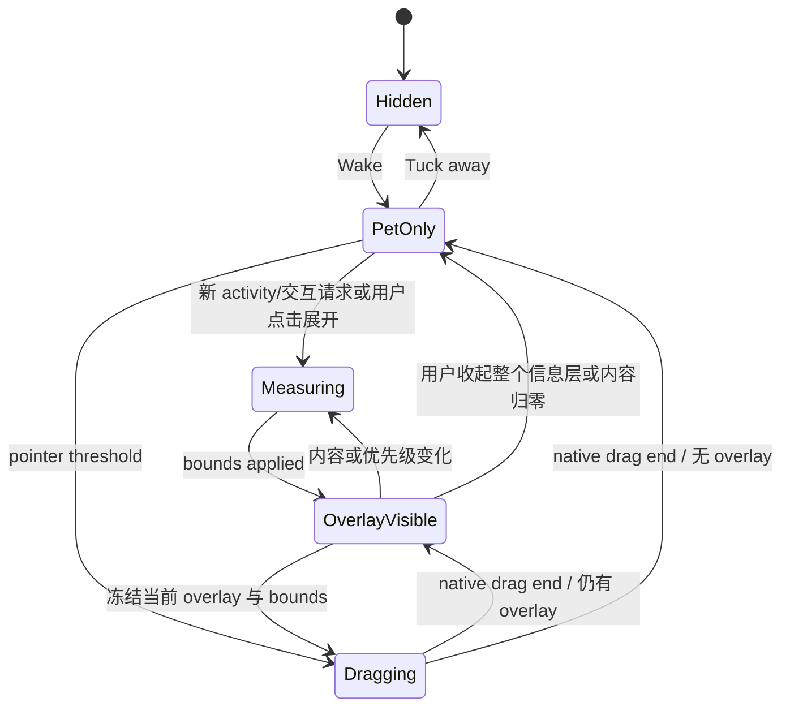
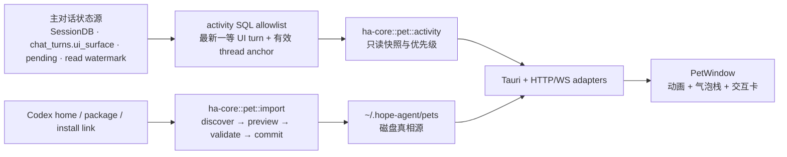

# 桌面宠物（Pet）实施计划

> 返回 [文档索引](../README.md)
>
> 状态：已实施并完成产品级 Review（更新至 2026-07-24）；运行时契约已迁入 [架构文档](../architecture/pet.md)，本文保留调研、决策与验收历史。
>
> 目标：在 Hope Agent 中提供与 Codex Pets 对齐的桌面陪伴、跨会话状态提示和自定义宠物能力，并支持现有 Codex 自定义宠物直接导入。

## 结论

Pet 的**被动常驻运行时**应当是一个零 LLM、只读消费主对话状态、桌面优先的表现层：它不改变 Agent 人格、Prompt、工具权限或任务结果，只把已有的会话运行、待用户处理、失败和未读完成状态投影到一个可移动的透明浮窗。用户明确提交气泡快捷回复时复用原 Session 的主对话链；Phase 3 的“创建宠物”则是隔离的 media-generation 工作流，不属于常驻 Pet runtime。

首版同时交付两条主线：

1. 桌面浮层、多会话气泡栈、独立交互卡、`/pet`、设置选择、位置持久化和 reduced-motion。
2. Codex v1/v2 本地宠物包的一键扫描、预览、复制导入，并覆盖文件/压缩包/批量拖拽、URL/deep link、Codex-compatible 导出与显式创作闭环。

Hope Agent 已经具备所需的状态真相源和桌面原语：`stream_seq`、普通会话 read watermark、pending interaction、durable `chat_turns`、EventBus，以及透明 `always_on_top` 的 Quick Chat 窗口。实现不应另造一套任务状态或未读计数。

### Review 后的关键收敛

| Review 发现                                                                                                                           | 最终决策                                                                                                                                                                    |
| ------------------------------------------------------------------------------------------------------------------------------------- | --------------------------------------------------------------------------------------------------------------------------------------------------------------------------- |
| 现有 `SessionMeta::is_regular_chat()` 只覆盖普通桌面对话，会排除 Knowledge、Design 和 incognito                                       | Pet activity SQL 直接校验最新 turn 的 `ui_surface` allowlist 与专属 thread anchor；不得改变或借用现有普通未读谓词                                                           |
| Knowledge / Design 已复用 `useChatStream` + `MessageList` + `ChatInput`，但没有自己的 unread 投影，且隐藏面板完成时可能被默认视作已读 | Pet 用同一个 `sessions.last_read_message_id` 读取“终态是否已看”；三个非主 ChatScreen 表面补齐统一的可见性 + 消息尾部 read receipt                                           |
| `has_error` 是“最后一条消息报错”，不等价于一条仍需用户处理的 Blocked activity                                                         | Blocked/Ready 只由**未读的最新合格主 turn 终态**产生；读过后消失，历史错误不会永久霸占宠物                                                                                  |
| `ChatSource` 表示 transport/caller，不能区分第一方 HTTP UI 与外部 API，也不能证明用了消息列表＋输入框                                 | 给主 turn 新增独立 `ChatUiSurface`；五个一等 UI 显式传播，缺省/内部请求为 `None`，Pet 只认 allowlist                                                                        |
| Design chat thread 只持久锚到 `project_id`，没有稳定 `artifact_id`                                                                    | 点击至少精准恢复 design project + thread；artifact 只作为可选、经过验证的提示，不能伪造必有锚点                                                                             |
| 当前跨页面导航只有普通会话 tray 事件，Knowledge focus 也不携带 thread                                                                 | 新建统一的 typed conversation navigation intent，由 App 壳切 view，再由专属页面消费 thread anchor；禁止 PetWindow 自拼 URL                                                  |
| 资源列表只有 `asset id` 仍不足以渲染 sprite                                                                                           | 增加 transport 专属 asset resolver：Tauri 只解析 Hope pet root 内路径，HTTP 走 Bearer 鉴权的同源 raw route + ETag；列表不返回图片 bytes 或绝对路径                          |
| 逐文件 `write_atomic` 不能保证整个宠物包原子可见，多进程导入还会竞争同名目录                                                          | pet root 使用 OS 独占锁；同 root staging 完整写入/校验/fsync 后经 `platform` 目录发布原语一次性发布                                                                         |
| 在 `pet.json` 塞 Hope 私有字段依赖 Codex 对未知字段宽容                                                                               | `pet.json` 只保留 Codex 兼容字段；Hope provenance/hash 放独立 `hope.json`，导回时不污染 Codex manifest                                                                      |
| “可选生成”不足以称为完整能力对齐                                                                                                      | 宠物创作工作室列为完整对标的必交 Phase 3；最终收敛为 owner Settings 中的显式 Create 流程，不注册 Agent skill/tool，避免模型自行发起额外生图请求；它不成为 Pet activity 来源 |

## 调研基线

### Codex 的产品行为

OpenAI 当前公开说明中的关键行为如下：

- 宠物是可选的动画陪伴，不改变 ChatGPT/Codex 如何完成任务。
- 桌面端通过 Settings > Pets 选择，`/pet`、Wake Pet 和 Tuck Away Pet 控制浮层；选择和位置跨重启保留。
- 活动状态为 Running、Needs input、Ready、Blocked；多会话时优先级为 Needs input > Blocked > Ready > Running。
- Codex 当前产品交互中，宠物旁会展示进行中对话气泡，待回答或授权时弹出可直接处理的卡片；点击气泡可回到对应聊天。
- reduced-motion 下只显示静态帧。
- 自定义宠物保存在本机；桌面、Web 和 CLI 的展示面不同，IDE 扩展没有宠物浮层。
- `codex://pets/install?name=&imageUrl=` 可打开安装流程；`name` 和 HTTPS `imageUrl` 必填，`description` 与 `spriteVersionNumber=1|2` 可选。

公开来源：[Pets](https://learn.chatgpt.com/docs/pets)、[ChatGPT desktop app commands](https://learn.chatgpt.com/docs/reference/commands)。

### 当前 Codex 文件兼容事实

以下属于 2026-07-22 对当前 Codex 桌面包及其内置 `hatch-pet` 技能的兼容性观测，不应被当成 OpenAI 承诺永久不变的公开标准：

- 当前自定义包目录为 `${CODEX_HOME:-$HOME/.codex}/pets/<pet-id>/`。
- 包含 `pet.json` 与 `spritesheet.png` 或 `spritesheet.webp`。
- Codex 同时兼容旧目录 `avatars/<id>/avatar.json`；Hope 可把它作为 legacy import source，但不在新建包时继续使用旧格式。
- manifest 接受 `id`、`displayName`、`description`、`spriteVersionNumber`、`spritesheetPath`；后两项缺省分别为 `1` 和 `spritesheet.webp`。
- v1 是 `1536 × 1872`（8 列 × 9 行），v2 是 `1536 × 2288`（8 列 × 11 行）；单格均为 `192 × 208`。
- 当前渲染器的业务状态使用前 9 行。v2 末 2 行不应被 Hope 重写、裁掉或赋予未经确认的业务含义。

因此兼容实现必须是一个显式的 `CodexPetV1` / `CodexPetV2` adapter，而不是把固定尺寸散落在 React 样式或导入按钮里。

## 产品边界

### 与 Knowledge Sprite 严格分离

仓库已有的 `crates/ha-core/src/sprite/` 是知识空间的主动写作精灵，会读取笔记上下文并触发额外模型调用。Pet 与它的契约完全不同：

| 维度     | Knowledge Sprite                    | Desktop Pet                                 |
| -------- | ----------------------------------- | ------------------------------------------- |
| 目的     | 主动给写作建议                      | 展示任务状态与陪伴动画                      |
| 模型调用 | 有，默认关闭且有费用                | 被动 runtime 无；仅显式快捷回复/Create 可有 |
| 数据输入 | 笔记、编辑、对话、Memory、Awareness | 结构化状态；Ready 只含有界 assistant 预览   |
| 主要 UI  | 知识空间建议气泡                    | 独立透明桌面浮窗                            |
| 后端模块 | `sprite`                            | 新建 `pet`                                  |

不得复用 `sprite` 配置分类、事件命名或 prompt。未来可以让同一张宠物图出现在知识空间按钮上，但这只是可选的视觉复用，不能让两套运行时耦合。

### 首版不做

- 不复制或解包 Codex 应用内置的专有宠物素材。自动导入只扫描用户自己的 Codex custom/legacy 目录；用户自行选择且有权使用的兼容包仍可导入。
- 不让宠物内容进入 system prompt、Memory、Awareness 或会话正文。
- 不给宠物增加独立 scheduler、任务引擎或未读系统。
- 不在 HTTP/ACP 模式伪造桌面浮层；这些模式只提供资源管理和状态 API，并明确返回 overlay unsupported。
- 首版不做 Computer Use 画中画吸附；保留窗口锚点接口即可。

## 用户体验

### 选择、唤醒与收起

Settings > Pets 展示内置 Hope 宠物和已导入宠物：

1. 选择宠物只改变外观。
2. Wake Pet 或 `/pet` 唤醒；再次 `/pet` 或 Tuck Away Pet 收起。
3. 宠物可拖动，位置按显示器 work area + scale factor 归一化持久化；显示器消失时钳回主屏可见区。
4. 每个活动主对话显示一条独立胶囊气泡；收起时宠物右上角用固定 28×28 正圆显示当前气泡数量（超过 9 显示 `9+`），存在 Ask/审批时数字变黄，点击数字展开，展开后同一控件变为向下箭头并负责收起整个信息层。新 activity/request 自动展开，但自动出现本身不算已读。
5. 气泡正文点击后按 typed target 回到普通/Knowledge/Design 的原对话上下文；hover 气泡才显示左上角关闭与回复/停止按钮，回复只展开这一条的快捷回复区。Ready/Blocked 经明确阅读或操作后按自身 terminal boundary 更新共享未读，不维护 Pet 私有计数。
6. `ask_user_question`、工具审批与计划确认使用独立交互卡；新请求自动展开，用户手动收起时随气泡一起收起，后续只有新的 request 才重开。处理仍复用原协议并同步撤销所有表面。
7. 气泡栈按可用高度内部滚动，快照最多返回 50 条并携带 `total` / `truncated`，避免历史未读把浮窗撑满屏。

浮层首次启用默认出现在当前显示器右下角，不自动获得键盘焦点。拖动走 Tauri 原生窗口移动，精灵动画只改变 SVG `<image>` 的裁切坐标，避免 React 布局抖动。

PetWindow 的气泡栈不是 `src-tauri/src/tray.rs` 的原生系统托盘菜单。两者的范围不同（原生托盘还会回退显示最近普通会话），首版不重写或合并原生托盘，避免宠物功能改变既有系统菜单行为。

Pet 不维护平行的“已处理”存储。自动展开不标记已读；Ready/Blocked 气泡只有在停留阅读至少 700ms 后移开、点击正文成功打开目标、提交快捷回复、明确关闭，或用户主动收起已展开的气泡栈时，才沿用该 session 的 read watermark 推进到该气泡实际展示的 terminal boundary。Running/NeedsInput 的关闭只保存当前窗口内的投影签名，绝不取消 turn、解决交互或篡改 read watermark。首次启用时已有但尚未读的合格主对话会如实出现，不批量篡改现有 unread；推进成功后侧栏未读数与 Pet activity 数字分别重查权威聚合，不能在前端维护第二套减法。

### 从 Codex 直接导入

Settings > Pets > Import > From Codex：

1. Core 在本机解析 `CODEX_HOME`；未设置时使用用户 home 下的 `.codex`。
2. 只扫描 `<root>/pets/*/pet.json` 与 legacy `<root>/avatars/*/avatar.json`；discovery 仅做 manifest、stat、图片 header 和路径边界检查，不在 500 个候选上串行 full-decode/full-hash。
3. 候选卡片不含绝对路径，显示名称、推断版本、尺寸和来源；进入 viewport 时按 `candidateId` 惰性取 idle thumbnail。
4. 用户选择候选后才运行完整 preview：读取/hash、完整 decode、atlas 校验和 warnings；服务端 preview cache 同时受条目数与总 byte budget 约束。
5. 用户确认导入后，Core 在锁内重新读取本地 source 并校验 preview hash，再把 canonical manifest 与原始图像 bytes**复制**进 Hope 自有目录。Hope 不引用 Codex 原路径。
6. packageHash 已存在时默认跳过；同名不同内容生成稳定后缀，不覆盖用户已有宠物。
7. 导入完成后立即刷新宠物库，可选择“导入并启用”。

候选发现与提交分两步，提交使用短期 `candidateId` 而不是客户端路径，避免 HTTP 客户端把任意主机文件路径伪装成 Codex 宠物。

### 其他兼容导入入口

所有入口最终进入同一个 preview → validate → commit 管线：

- 选择或拖拽 `pet.json`、完整宠物目录、zip，或者同一次拖入的 `pet.json` + manifest 引用的 PNG/WebP。
- 直接选择透明 PNG/WebP；无 manifest 时要求补充名称，版本由尺寸推断。
- 粘贴 `codex://pets/install?...` 链接。
- 粘贴受支持的 HTTPS sprite URL，并显式选择/推断 sprite version。

Hope 可以另外注册自己的 `hope-agent://pets/install`，参数与 Codex 链接保持同形；解析器内部用同一 DTO，不在两套 scheme 上复制校验逻辑。

拖拽属于 Phase 1：Settings > Pets 页面和 Import 弹窗提供明确 drop zone；拖入主窗口时只在这些界面显示接收态，透明 PetWindow 本身不接文件，避免常驻置顶窗口截获桌面拖拽。一个 drop 可包含多个目录/zip，每个包分别生成 preview card；loose files 只有在同一组里恰好存在一个 manifest 且能唯一解析 sprite 时才成包，歧义不自动猜测。拖入只做 staging/preview，不自动安装、启用或覆盖；用户逐项确认后才 commit。

Settings 的主路径使用标准 WebView Drag and Drop：从 `DataTransferItem.webkitGetAsEntry()` 有界递归顶层目录，分组后走通用 staged upload，因此在 `dragDropEnabled=false` 的主窗口也稳定可用。Tauri 原生 file-drop event 只作为平台实际提供绝对路径时的快速路径，与 picker 一样在 Core canonicalize 并执行 root/symlink/大小限制。HTTP/Web 绝不把客户端路径传给服务端；`text/uri-list`/HTML drop 不按文件导入，URL 仍走独立的 paste-link preview。目录枚举限制深度 8、最多 64 个文件，Core 对 upload group 再执行同级上限。

## UI 技术方案

不新增游戏引擎或动画依赖，全部建立在仓库现有 Tauri 2 + React 19 + TypeScript + Vite 8 + Tailwind 4 技术栈上：

| UI 层      | 技术选择                                                                                       | 实现约束                                                                                                                                                                          |
| ---------- | ---------------------------------------------------------------------------------------------- | --------------------------------------------------------------------------------------------------------------------------------------------------------------------------------- |
| 桌面浮层   | Tauri 2 `WebviewWindow`                                                                        | Rust 只负责透明/置顶窗口生命周期、平台能力、位置与尺寸；UI 独立加载 `?window=pet`，不挂载完整 `App`                                                                               |
| 组件与布局 | React 19 hooks + `src/components/ui/` 的 shadcn/Radix + Tailwind utilities                     | Settings、Import、气泡栈和交互卡复用现有交互/焦点 token；不另引入状态库、CSS-in-JS 或原生表单控件                                                                                 |
| 精灵图渲染 | DOM SVG 裁切：固定 `viewBox="0 0 192 208"`，内部一个 `<image>`                                 | atlas descriptor 计算 `<image x y width height>`；不使用 Canvas/WebGL/Lottie，不写动态 inline style 或 88 组 frame CSS class                                                      |
| 动画调度   | `usePetAnimator` hook + 基于 `performance.now()` 的链式 timer                                  | 按 descriptor 的逐帧 duration 前进；后台时移除 timer、恢复后从当前帧续播且不追赶积压帧，reduced-motion 永远停在首帧；hook 位于 memoized sprite 子树内，不让气泡栈按动画帧率重渲染 |
| 拖动浮窗   | `getCurrentWindow().startDragging()` + pointer threshold + window move event                   | 原生窗口负责平滑移动；按横向位移选择 running-left/right，拖动结束抑制同一次 click 并 debounce 持久化位置                                                                          |
| 气泡与交互 | 同一 PetWindow 内的 React panel + shadcn/Radix primitives                                      | 展开前先按宠物锚点调整 Tauri window size/position；气泡栈内部有界滚动，回复 composer 和独立问答/授权卡沿用已有提交协议                                                            |
| 跨窗口状态 | 现有 transport/EventBus + `usePetActivity` hook                                                | renderer 只取 snapshot/无正文 invalidation；不直接访问 SQLite，不复制 Core 状态优先级                                                                                             |
| 拖拽导入   | 标准 Drag and Drop + `webkitGetAsEntry()` + staged upload；桌面 `onDragDropEvent` 作可选快路径 | 两端归一为同一 `PetImportSource`；drop zone 只在 Settings/Import 挂载，透明 PetWindow 不监听文件 drop                                                                             |
| 图片资源   | Tauri 安全 asset URL；HTTP authenticated fetch → Blob URL lease                                | React 只得到已安装 pet 的安全 URL；切换/卸载时 revoke，不向 DOM 注入外部 URL                                                                                                      |

`PetWindow.tsx` 只组合 `PetSprite`、`PetBubble`、既有问答/授权组件和窗口交互 hooks；atlas 坐标、动作序列、状态优先级、导航 target 和导入校验分别保持单一来源，不能在 JSX 里复制常量。逐帧更新仅重渲染轻量 `PetSprite`（用 `React.memo` 隔离），气泡栈不随每帧重渲染；窗口拖动和 overlay 显隐优先走原生移动与 Tailwind `transform/opacity`，满足 60 fps 交互要求。

实际实现按职责拆分；导入 drop zone 收敛在设置面板中，pointer drag 收敛在 PetWindow 中，避免为单一调用点增加无状态包装层：

```text
src/PetWindow.tsx
src/components/pet/PetSprite.tsx
src/components/pet/PetBubble.tsx
src/components/pet/hooks/usePetAnimator.ts
src/components/pet/hooks/usePetActivity.ts
src/components/pet/hooks/usePetAssetUrl.ts
src/components/pet/hooks/usePetWindowLayout.ts
src/components/settings/PetSettingsPanel.tsx
```

### PetWindow 交互状态机

PetWindow 不能按“固定透明大窗 + 内部绝对定位”实现：透明区域同样可能截获桌面点击，而且气泡栈、交互卡和多语言文本会持续改变内容尺寸。首版使用显式状态机，窗口矩形始终贴合当前可见内容：



`Measuring` 是内部态：新内容已挂载但 `visibility:hidden`、不可点击，也不能被辅助技术重复播报；只有窗口 bounds 应用完成后才切到可见态。气泡栈与独立交互卡共处同一个受约束 overlay，右键菜单则使用单独 mode。

### 动态尺寸与稳定锚点

持久化的不是 PetWindow 左上角，而是**宠物本体底部中心点**相对 monitor work area 的归一化 anchor。窗口尺寸或气泡方向变化时，这个点保持不动；用户看到的是气泡从宠物旁边展开，而不是宠物被窗口 resize 推走。

布局流程固定为：

1. React 先用受约束宽度在隐藏 measurement layer 渲染气泡栈/交互卡，`ResizeObserver` 得到 logical size。
2. `usePetWindowLayout` 给请求分配单调递增 `layoutRevision`，结合 pet rect、monitor work area、scale factor 和 12px 安全边距选择 top-left/top-right/bottom-left/bottom-right placement。
3. 计算 `pet rect ∪ overlay rect ∪ shadow padding` 的最小窗口 bounds；优先翻转方向，其次压缩气泡栈高度并内部滚动，最后才 clamp，绝不把宠物本体移出可见区。
4. PetOnly → Overlay 先按目标 placement 挂载不可见正式层并 paint 一帧，使宠物 DOM 朝向在扩窗前与 next anchor 一致；关闭时继续保留已提交气泡子树完成淡出，不能因 `expanded=false` 先清空内容。`pet_apply_window_bounds_cmd` 再在原生 mutex 内串行处理 bounds 并只接受更新 revision；macOS 的尺寸与位置必须合并为一次非动画 `NSWindow.setFrame`，不能连续调用 `set_size`/`set_position` 暴露中间帧。原生已提交 anchor 是几何真相源，不能采用可能因迟到 promise 而过期的 renderer previous anchor。旧测量和旧 Tauri promise 不提交 renderer layout。
5. bounds 应用后再 paint 一帧才 reveal overlay，并以 Tailwind opacity/transform 做 180ms 入场；关闭先做同长淡出再缩窗。窗口本身不做连续尺寸动画，避免每帧 IPC 和锚点抖动。pet sprite 与 overlay 各自保持 GPU compositing layer，native resize 不应令精灵白闪。
6. reveal 后若字体加载或换行令测量变化超过 1 logical px，继续按 latest-wins 更新；普通气泡 overlay 固定 384px、含交互卡时固定 400px，并在 496px scroll viewport 内滚动，窗口尺寸钳到 440×640，避免 ResizeObserver 正反馈。瞬时 native 失败只做两次退避重试，之后恢复上一个 committed layout。
7. 关闭时先淡出 overlay，再缩回 PetOnly bounds；reduced-motion 下跳过过渡但仍走同一测量与锚点算法。

首版视觉尺寸采用 token 而不是散落常量：pet visual 为 96×104 logical px，PetOnly 加 hit/shadow padding 后约 120×128；普通气泡宽 344px、高至少 52px，交互卡宽 360px，overlay 外框分别为 384/400px、scroll viewport 高最多 496px，viewport 内左右/顶部预留 16px、底部预留 28px 的 shadow safe area，超出后内部滚动。普通气泡把标题、分隔点与摘要连续排版并钳到两行，不能因第二行继续增高，同时使用低不透明毛玻璃 surface；交互卡采用单行元信息头、紧凑选项和 28px 操作区，避免把消息列表卡片的纵向层级搬进 Pet。系统字体放大、CJK/英文长文案和 200% scale 下重新测量，不以固定高度猜测。

PetWindow 的透明矩形仍无法跨平台做到任意形状 hit-test，因此必须满足：PetOnly 时保持最小 bounds；overlay 与 pet 紧邻；气泡/交互卡只在自动或用户展开时扩张，手动收起后全部回到 PetOnly；透明间隙不使用大 padding。布局变化期间不得临时创建覆盖半个屏幕的透明窗口。

### 消息气泡与直接处理契约

气泡栈是已有主对话的桌面延伸，不是新的 Session 或独立模型通道。每个 activity 对应一个独立胶囊气泡，同一 Session 只保留一条并随状态原地更新：

- `running` 在同一行显示会话标题、父主对话实时流式正文的有界尾部和环形进度动画；正文使用现有 `animate-text-shimmer` 扫光，reduced-motion 下静态显示，首个正文 delta 前回退本地化“正在思考”。Pet 只消费 activity snapshot 已准入 session 的 `chat:stream_delta`，中途挂载先用 stream snapshot 补 durable prefix 并缓存握手期间的 live delta，不能让 side-query 或工具内部 LLM 产生气泡。
- `ready` 显示会话标题、该主 turn 最终 assistant 消息的有界预览和完成勾；Core 折叠空白并按有效 UTF-8 边界截断为最多 240 bytes，气泡在固定高度内最多排两行。实时流与完成态都先投影成轻量纯文本，保留标题、强调、代码、链接的可读内容，去掉 `#`、`*`、反引号、代码围栏等 Markdown 标记；不能挂载完整 Markdown renderer 令流式布局跳动。SQL 只读 terminal assistant row，incognito 不返回预览。
- `needs_input` / `blocked` 只显示本地化状态，不返回问题正文、审批参数或错误原文；具体内容由权威交互卡按需读取。
- hover 气泡时显示左上角关闭与右侧快捷动作；Running 提供回复 + 停止，停止复用 `stop_chat` 并显式传该 activity 的 `sessionId` 与 `turnId:null`，只中止目标主 turn，其他状态只提供适用动作。动作只改变内部文本可用宽度，不能改变气泡外框；关闭 Running/NeedsInput 只隐藏当前投影且不取消执行/权威交互，关闭 Ready/Blocked 按 terminal boundary 推进共享 read watermark；点击回复后同一时间只展开一条回复区，正文点击仍打开完整对话。
- 对正在运行的主 turn，快捷回复进入已有 durable turn-message 队列；对 Ready/Blocked 主对话，在同一 Session 发起新的 `pet_chat` 主 turn。两条路径都复用 UserPromptSubmit、消息持久化与原工具权限，不创建额外 LLM 请求。
- 发送需立即反馈 sent/queued；同步拒绝时保留输入并允许重试，已受理后的模型失败由该 Session 正常投影成 Blocked。

气泡栈收起时只显示数字，数字等于当前所有仍需展示的 activity（Running、NeedsInput、Blocked、未读 Ready）；存在 Ask/审批时数字用黄色注意态，仍不改成请求数。展开后数字控件变为向下箭头。每个新的 activity 稳定 key（session + status + boundary；active turn 使用固定占位而非 `updatedAt`）自动展开；用户手动收起后，流式 delta、倒计时和相同 key 的刷新不得重开，只有新的 activity key 或交互 request id 才可重开。自动展开不推进 read watermark；用户主动收起已经展示的栈属于确认阅读，只推进其中 Ready/Blocked 的精确 terminal boundary，Running 与权威交互等待态保持活动。

待回答/审批不嵌进原气泡，也不直接渲染消息列表的 `AskUserQuestionBlock` / `ApprovalDialog`：Pet 使用自己的紧凑卡片，只复用它们的 DTO、权限策略与提交协议。Ask group 一次只出现一道题，保留前后切换与已选答案，最后一题统一提交；富 Markdown/方向预览在 Pet 降级为标签、单行说明和推荐标记。审批卡压缩 reason/command/cwd，但 deny、allow once、allow always、strict/cron standing-grant 限制和倒计时语义不变。手动收起时卡片随普通气泡一起隐藏并留下黄色数字；新的 request id 到达时再次自动展开，多请求按 activity 优先级和请求顺序逐张处理并显示队列位置。任何表面处理成功后都依赖 `ask_user:resolved` / `approval:resolved` 同步撤销。自动出现不抢 OS 焦点。

### 指针、焦点与竞态

- macOS 的后台 WKWebView 不保证产生 DOM `:hover`。原生层用 local/global `MouseMoved | LeftMouseDragged` monitor 覆盖本应用与其他应用事件流，但只在指针命中 PetWindow 矩形时向 Pet renderer 发送窗口内 logical 坐标，并钳到约 30Hz；React 通过 `elementFromPoint` 映射当前 pet/activity/action，复用同一套显隐与按钮反馈状态。local/global 两条 monitor 必须调用同一个坐标投影，不能让 local 事件只清理 global hover，否则主窗口 active、PetWindow non-key 时每次移动都会让按钮逐帧闪烁。命中 Pet 的左键拖动开始后，原生层只轮询左键按下位并在释放时 emit 无坐标的 drag-end 信号，不能把立即返回的 AppKit/Tauri `startDragging()` Promise 当成拖拽结束；离开只发一次清理事件。禁止监听键盘、mouse-down、普通 click，禁止上传窗口外坐标、合成 DOM mouse event 或借 hover 激活应用。
- pet pointer down 后移动超过 4 logical px 才调用原生 `startDragging()`；未超过阈值才解释为 click，drag end 必须抑制同一手势产生的 click。
- 开始拖动时保持当前 overlay 与 native bounds 不变并冻结新 layout 请求，避免窗口矩形在 OS drag 中从指针下跳走；drop 后关闭 overlay、基于新 monitor/anchor 收缩，期间到达的活动只更新 snapshot 并排队。
- 鼠标进入 Pet 连续播放三个完整 `wave` 循环，单击完整播放一次 `jump`，Pet 内部移动不重启；拖拽使用左右 run 循环，并同步提交 run 帧、跨过一次浏览器 paint 后给 macOS WindowServer 留两个显示周期再进入原生拖拽循环，避免原生拖拽抓取旧的 idle 纹理。仲裁优先级固定为 Drag > Click > Hover > 业务状态 > Idle，一次性动作结束后恢复此前业务状态。
- 原生拖拽开始后持续消费 PetWindow `Moved` 事件；以连续 `x` 差的符号实时切换 `run_left` / `run_right`，同一次手势反向时动画必须同步反向，不能锁定首次越阈值的方向。
- 单击 Pet 播放 Jump 并唤起 Hope 主窗口，但不切换当前会话；数字/箭头控制气泡栈，气泡正文负责 typed navigation。拖拽超过 4px 后必须抑制同手势 click，不能因移动宠物误唤起主窗口。右键先收起信息层，再在宠物本体中心显示 28px 高的紧凑关闭胶囊；该控件不得触发 overlay 测量或扩窗，也不得在宠物外复制一张菜单卡片。
- 自动气泡不改 active window；用户点击气泡、回复区或交互卡后 PetWindow 才获取交互焦点。Escape 先关闭回复区，再收起整个信息层，不 Tuck Away；收起不 resolve 权威交互，黄色数字持续提示待处理状态。
- typed navigation 成功前不推进 read watermark；目标失效时保留 activity、关闭 overlay 并由主窗口显示错误。
- resize、activity invalidation、字体加载、monitor change 和用户 close 可能并发，统一以 `layoutRevision` 与当前 state 检查做 latest-wins；组件 unmount 后不得执行迟到的 setSize/setPosition/reveal。

## 状态投影

### 单一优先级

Pet 的公开状态只保留四态，严格对齐 Codex 的用户语义：

| 优先级 | `PetActivityStatus` | Hope 真相源                                                      | 精灵图状态/行 |
| -----: | ------------------- | ---------------------------------------------------------------- | ------------- |
|      0 | `needs_input`       | 合格 UI 主 turn 的 approval / `ask_user_question` 仍 pending     | `waiting` / 6 |
|      1 | `blocked`           | 最新合格 UI 主 turn 为 `Failed`，且其终态边界尚未读              | `failed` / 5  |
|      2 | `ready`             | 最新合格 UI 主 turn 为 `Completed`，且其终态边界尚未读           | `review` / 8  |
|      3 | `running`           | 最新合格 `chat_turns.ui_surface` 命中 allowlist 且 turn 尚未终态 | `running` / 7 |

同一会话同时命中多个条件时取最小优先级。全局宠物状态取所有 activity 中的最小优先级；同优先级按 `updated_at DESC, activity_id ASC` 稳定排序。

`ready` 是产品词，`review` 只是当前 Codex atlas 的动画行名。两者不得在业务 API 里混用。

终态是否未读不再使用 `SessionMeta.unread_count`——该字段按现有契约只服务 Regular。`pet::activity` 直接在一次只读 SQL snapshot 中比较：

```text
terminal_boundary = COALESCE(chat_turns.assistant_message_id, chat_turns.user_message_id)
terminal_unseen   = terminal_boundary > COALESCE(sessions.last_read_message_id, 0)
```

没有两个 message id 的损坏 turn 不生成 Ready/Blocked；不能用时间戳猜测已读。`Interrupted`（用户停止、runtime cancel、关机/崩溃恢复）不生成终态 activity；真正的 provider/config/compaction/internal failure 已落 `Failed`，才映射 Blocked。

每个 session 最多一条 activity，`activity_id` 直接使用 session id；`updated_at` 来自当前 turn `started_at` 或终态 `ended_at`，不能用可能被 background injection 改写的 `sessions.updated_at`。历史 `has_error` 仅继续服务现有 sidebar 红点，不作为 Pet 的单独真相源。

pending 不能只按 session id 继承资格：只有当前 active turn（或恢复期对应的最新 non-terminal turn）携带合格 `ui_surface` 时才映射 NeedsInput；同一个 session 过去曾有 UI turn，不足以让后来外部 API/ParentInjection 的 pending 混入。

### 过渡动画

- 无活动：`idle`。
- 首次出现和状态变化直接进入对应的稳定循环，避免窗口唤醒时用一次性动画推迟真实任务状态。
- ready 使用 `review` 循环；reduced-motion 下直接显示该状态第一帧。
- 拖动时根据横向位移使用 `running-left` / `running-right`；结束拖动立即回到业务状态。
- `blocked` 和 `needs_input` 不被一次性庆祝动画覆盖；hover/click 只短暂覆盖精灵表现，绝不修改业务状态。

### 活动领域

Pet 的准入边界是“可继续的主动多轮主对话”，不是“发生过一次模型调用”：

1. 有正式 session 和持久化消息历史；
2. 走主对话 turn 生命周期；
3. 在 Hope UI 中由共用 `MessageList` + `ChatInput`（或其同源封装）承载，用户点击 activity 后能回到原上下文继续对话。

三项必须同时满足。实现时由 Core activity 查询在最新 turn 上明确校验 allowlist，不能用“最近有 `model_usage`”“调用过 LLM”或“存在后台 job”推断，也不能由 PetWindow 根据当前挂载的页面猜测。关闭页面不影响一个合格主对话的 activity 资格。

首版谓词必须精确满足：

```text
turn.ui_surface IN (main_chat, quick_chat, knowledge_chat, design_chat)
AND session.parent_session_id IS NULL
AND session.is_cron == false
AND session 没有 channel_conversations 绑定
AND (
  kind == Regular
  OR (kind == Knowledge AND knowledge_chat_threads 的 kb/thread 绑定存在)
  OR (kind == Design AND design_chat_threads 锚存在)
)
```

Project、fork 和 incognito 都可以是合格主对话；`SessionMeta::is_regular_chat()` 会刻意排除 incognito/Knowledge/Design，故不得复用或修改它。Knowledge 必须有有效 kb/thread 绑定，但 note path 本来就可选；Design 必须有 project/thread 绑定。必要绑定缺失时 fail closed 排除，避免半创建 session 导航到错误空间。

新增通用 `ChatUiSurface { MainChat, QuickChat, KnowledgeChat, DesignChat, PetChat }`，从 `useChatStream`/Pet 快捷回复请求 → Tauri/HTTP chat adapter → `chat_turns.ui_surface` 全链传播；`ChatEngineParams` 只携带同一元数据以强迫所有 engine caller 显式选择，但投影只读 durable turn。各一等 UI 表面分别传固定枚举；第一方 HTTP transport 有 surface 时走 `/api/chat/ui`，公共 `/api/chat` 即使收到伪造字段也强制清空。Channel/Cron/ACP/Subagent/ParentInjection 和任何 automation/side-query 恒为 `None`。该字段只做产品分类、不是授权边界；它不能写入消息正文、system prompt、Provider 请求或模型可见工具参数。

迁移后历史 turn 的 `ui_surface` 为 NULL，并保持不接入；不能仅凭旧 `source='desktop'` 猜测它是否真的来自消息列表＋输入框。以后新增一等对话表面必须扩 `ChatUiSurface`、固定调用点、Core SQL allowlist、Pet 矩阵与 read-receipt 测试。

每个合格主对话仍保留自己的 unread/导航语义，Pet 只聚合，不反向清除：

| 对话/执行面                                                                                                                | 首版纳入                                                   | Ready 来源                             | 点击目标                                                |
| -------------------------------------------------------------------------------------------------------------------------- | ---------------------------------------------------------- | -------------------------------------- | ------------------------------------------------------- |
| Regular/Project 顶层会话                                                                                                   | 是                                                         | 同一 terminal boundary/read watermark  | 主聊天对应 session/project                              |
| Quick Chat 等复用主消息列表与输入框的多轮会话                                                                              | 是；本质仍为 Regular session                               | 同一 terminal boundary/read watermark  | 主聊天中的同一 session（不新增 QuickChat session 类型） |
| Knowledge 主对话                                                                                                           | 是                                                         | 同一 terminal boundary/read watermark  | 具体 KB + anchor note + thread                          |
| Design 主对话                                                                                                              | 是                                                         | 同一 terminal boundary/read watermark  | 具体 design project + thread；artifact 仅可选           |
| Cron / IM / ACP / 纯 session viewer                                                                                        | 否；除非未来升级成上述主对话 UI，并显式加入 Core allowlist | —                                      | —                                                       |
| Subagent / async job / workflow / loop                                                                                     | 否                                                         | —                                      | —                                                       |
| side query / automation / compact / memory / dreaming / sprite / judge / eval / embedding / STT / vision bridge / 生图生音 | 否                                                         | —                                      | —                                                       |
| Incognito 主对话                                                                                                           | 是，仅当前进程存续期；标题强制脱敏                         | 临时 session 的同一 boundary/watermark | 当前会话；关闭即随焚毁清除                              |

设计空间里 `generate` / `critique` / `extract` 等额外 automation 调用不因属于 Design 模块而获得资格；只有 Design 主对话线程本身进入 Pet。知识空间的 Sprite side query 同理不进入。

主对话 turn 内部即使调用 tool、subagent 或其他 LLM，Pet 也只观察父主对话自身的 turn 是否仍在 running/pending/terminal：不得为内部调用另建 activity，也不得在父 turn 已结束后仅因后台调用仍运行而延长宠物状态。这样用户看到的是“哪段对话需要我处理”，不是全局模型调用监视器。

`ParentInjection` 即使把结果写回一个 Regular session，也属于额外请求：它既不产生 Running，也不凭自己的终态产生 Ready/Blocked。若该 session 先前仍有一个未读 UI 主 turn，后续 injection 不得覆盖那条既有 activity 的排序时间或状态。

### 可见性与已读回执

现状中只有主 `ChatScreen` 和 `QuickChatDialog` 已正确组合“App view 被选中 + document 可见 + 窗口聚焦 + MessageList 在最新尾部”。实施 Pet 前必须把这条契约统一成共享 `useConversationReadReceipt`，并接到全部五个主对话表面：

| 表面               | `surfaceVisible` 必须满足                              |
| ------------------ | ------------------------------------------------------ |
| ChatScreen         | 当前 App view 为 chat                                  |
| QuickChatDialog    | dialog open                                            |
| QuickChatWindow    | 独立窗口 visible 且 focused                            |
| KnowledgeChatPanel | App view 为 knowledge、右栏 chat tab 激活且未折叠      |
| DesignChatPanel    | App view 为 design、project 已打开且 chat panel 未折叠 |

每个表面再叠 `MessageList.onAtBottomChange`。只有 transcript 成功渲染后，才用当前实际渲染到的最大 DB message id 调 `mark_session_read_cmd(throughMessageId)`；rendered boundary 在流式持久化期间推进时也要更新，而不是只等 turn end，这可避免用户正看着回复时宠物短暂闪成 Ready。随后重新读 DB，不能乐观把 unread 置零。仅组件 mounted、切到 links tab、折叠 chat、窗口失焦、document hidden 或用户上翻历史都不算已读。

`useChatStream.activeSessionReadableRef` 从可选改为这些主对话表面的必传参数，默认值不能继续是 `true`，否则新表面会在隐藏状态吞掉 Ready。read receipt 只推进现有 `sessions.last_read_message_id`，不新增 Pet 专属 read 表或第二套 unread。

### 快照与失效事件

Core 新增纯读异步 `pet::activity_snapshot()`：SQLite 部分经 `SessionDB::run` 用单条 SQL 读取 session、anchor、read watermark 与最新合格 durable turn，再合并一次 approval / ask-user pending snapshot；它不改变任何源状态。UI 不自行拼装四态，也不为每条 session 发 N+1 查询。索引固定为 `(session_id, ui_surface, started_at DESC)`，不建立 Pet 专属状态表。

DB 与内存 registry 无法组成同一事务：snapshot 读取前后各取一次 revision；中途 revision 变化则完整重试一次，连续高频变化时返回最新可得结果并标 `stale=true`，由下一次 invalidation/reconcile 收敛。不得靠锁住整个 chat turn 来追求强一致而阻塞主对话。

返回统一 envelope：

```rust
struct PetActivitySnapshot {
    revision: u64,                 // 进程内单调 invalidation revision
    generated_at_ms: i64,
    stale: bool,
    dominant_status: Option<PetActivityStatus>,
    activities: Vec<PetActivity>, // 已按优先级稳定排序，最多 50
    total: u32,
    truncated: bool,
}
```

普通 title 可用于 owner 本机气泡栈，但必须经 UTF-8 长度裁剪并按纯文本渲染；气泡内标题最多占内容宽度的 52%，按 CJK/ASCII 显示宽度预算预先生成单个“前缀…后缀”字符串，再用较明显但低对比的实心 `•` 与摘要衔接，为两行摘要保留稳定空间。禁止把标题拆成可压缩前缀与固定后缀两个 flex 片段，否则 WebKit 会先过度挤压前缀并吞掉省略号。incognito 固定显示本地化“无痕对话”，不暴露 title、项目名、KB/设计名称、Agent 名或回复预览。snapshot 和事件不包含 prompt、工具参数、错误原文或绝对路径；唯一正文例外是非无痕 Ready activity 的 terminal assistant 单行预览，长度和读取行均有界。

新增无正文事件 `pet:activity_changed { revision }` 作为 invalidation signal；Pet 窗口收到后重新取快照。触发点复用并覆盖：

- 带合格 `ui_surface` 的 active turn acquire/release/finalize；
- `session_pending_interactions_changed`；
- `chat_turns` terminal 状态/assistant boundary 持久化；
- 任意 session read watermark 推进（snapshot 再做资格过滤）；
- session kind/Knowledge anchor/Design anchor 创建、删除或修复；
- session 删除、incognito 焚毁。

事件是提示，不是事实；生产者允许保守 over-invalidate，最终资格与状态只由 snapshot 单一实现裁决。额外 LLM 请求产生的 `model_usage`、automation/side-query 完成事件、后台 job 状态和 Cron/IM 专属未读变化不能直接创建 activity；ParentInjection 即使造成一次保守刷新，snapshot 也必须过滤掉。

PetWindow 同时监听既有 `session:title_updated`：首消息 fallback 或异步 LLM 标题落库后合并触发一次 snapshot refresh；snapshot revision 必须包含 `title_kind/title`，让轮询和远端 transport 也能识别只改标题的快照。

事件不携带标题、prompt、工具参数或消息正文，避免一个常驻浮窗成为旁路数据通道。50 ms 内多次 invalidation 合并为一次 fetch；窗口显示时保留 5 秒低频 reconcile，隐藏时不轮询，重新显示/WS reconnect/transport resync 时立即全量取一次。

snapshot 失败时：若有上次成功值，原样保留并设 `stale=true`，不得在 10 秒后擅自清空；若从未成功，返回空列表 + `stale=true`，Pet 显示变暗的静态降级，而不是把 idle 伪装成“所有对话都完成”。

## Codex 兼容协议

### 包结构

Codex 输入：

```text
<codex-home>/pets/<folder>/
├── pet.json
└── spritesheet.webp  # 也接受 manifest 指向的 .png
```

常见 manifest：

```json
{
  "id": "pet-name",
  "displayName": "Pet Name",
  "description": "One short sentence.",
  "spriteVersionNumber": 1,
  "spritesheetPath": "spritesheet.webp"
}
```

为兼容 `hatch-pet` 已生成的包：

- `id` 缺失时用安全化后的文件夹名；`displayName` 缺失时用 id。
- `spriteVersionNumber` 缺失时先按图片尺寸推断；`1536×1872 → 1`，`1536×2288 → 2`。
- 声明版本与实际尺寸冲突时不静默改写，在预览中给出可修复错误；用户确认“按图片尺寸修正”后才提交。
- `spritesheetPath` 缺失时尝试 `spritesheet.webp`，再尝试 `spritesheet.png`。
- manifest 里的 id 永不直接成为磁盘路径；统一走 `paths::validate_pet_id` 和 collision resolver。
- `id`、`displayName`、`description` 都有长度上限并去除控制字符；名称只作为文本渲染，不能进入 HTML、CSS 或日志字段名。

### Hope 自有包

Hope 的 `pet.json` 只写 Codex 核心字段，不依赖 Codex 对未知字段的宽容行为。Hope 自己的 provenance、完整性和 schema 版本放在同目录 `hope.json`：

```json
{
  "id": "pet-name",
  "displayName": "Pet Name",
  "description": "One short sentence.",
  "spriteVersionNumber": 2,
  "spritesheetPath": "spritesheet.webp"
}
```

```json
{
  "schemaVersion": 1,
  "sourceKind": "codex",
  "sourceId": "original-id",
  "packageHash": "blake3:...",
  "assetHash": "blake3:...",
  "importedAt": "2026-07-22T00:00:00Z"
}
```

存储位置统一由 `paths.rs` 提供：

```text
~/.hope-agent/pets/<pet-id>/pet.json
~/.hope-agent/pets/<pet-id>/hope.json
~/.hope-agent/pets/<pet-id>/spritesheet.{webp|png}
```

磁盘是宠物库真相源；配置只保存 selected ref，不保存 manifest 副本或绝对路径。未知 Codex manifest 字段可作为经过大小限制的原始 source metadata 保存在 `hope.json`，但不回写 `pet.json`；导出 Codex 包时只生成已验证的核心字段并保留原始 sprite bytes，因此这里承诺的是**图像与已知字段兼容**，不是未知字段的无条件无损往返。

内置资源不复制进用户目录，使用 namespaced ref（例如 `builtin:hope-default`）；导入资源使用 `custom:<dir-id>`。manifest 的 `id` 与磁盘 `<dir-id>` 分离，custom pet 不能通过同名覆盖 builtin。配置字段明确命名为 `selectedPetRef`，避免把 namespaced ref 误当 manifest id。

成功 import/delete/restore 后 emit `pet:library_changed { revision }`，Settings 与 PetWindow 重新 list；事件不携带路径或 manifest。磁盘仍是跨进程真相源：进程收到 focus/transport resync 时强制 rescan，显示期间可做低频目录 fingerprint 校验，以覆盖另一个 Hope 进程完成变更但当前 EventBus 收不到的情况。缓存只能按 mtime/fingerprint 加速，不能成为第二真相源。

### Atlas 版本

| 版本 | 尺寸      | 网格 | 单格    | Hope 行为                                    |
| ---- | --------- | ---- | ------- | -------------------------------------------- |
| 1    | 1536×1872 | 8×9  | 192×208 | 完整播放 9 个已知状态                        |
| 2    | 1536×2288 | 8×11 | 192×208 | 前 9 行同 v1 播放；末 2 行原样保留、暂不赋义 |

导入硬门：PNG/WebP、可完整解码、文件不超过 20 MiB、尺寸与 v1/v2 匹配。缺少透明通道属于 warning；Hope 不因这一画质提示拒绝一个尺寸和解码均合法的 Codex pet。

首版把资源上限固化为版本化常量并在 Tauri/HTTP/Core 共用：manifest ≤256 KiB；sprite ≤20 MiB；zip ≤64 entries、总展开量 ≤32 MiB、单路径深度 ≤8；一次 Codex scan 最多返回 500 个候选并标记 truncated；preview token TTL 10 分钟、全局最多 128 个。`id` 原文 ≤256 Unicode scalar、display name ≤256、description ≤2048，进入 Hope 磁盘前再生成 ≤64 字节的 portable dir id。超限返回稳定 issue code，不把底层 decoder/IO 错误原文直接透给 UI。

### 前 9 行动画契约

|  行 | 状态            | 使用列 | 当前帧时长                      |
| --: | --------------- | ------ | ------------------------------- |
|   0 | `idle`          | 0–5    | 280, 110, 110, 140, 140, 320 ms |
|   1 | `running-right` | 0–7    | 120 ms，末帧 220 ms             |
|   2 | `running-left`  | 0–7    | 120 ms，末帧 220 ms             |
|   3 | `waving`        | 0–3 ×3 | 140 ms，每轮末帧 280 ms         |
|   4 | `jumping`       | 0–4    | 140 ms，末帧 280 ms             |
|   5 | `failed`        | 0–7    | 140 ms，末帧 240 ms             |
|   6 | `waiting`       | 0–5    | 150 ms，末帧 260 ms             |
|   7 | `running`       | 0–5    | 120 ms，末帧 220 ms             |
|   8 | `review`        | 0–5    | 150 ms，末帧 280 ms             |

idle 在当前 Codex 中会放慢循环；Hope 无需逐毫秒复制环境噪声，但必须保持相同行列、帧顺序和相近节奏。所有帧定位都由一个 versioned atlas descriptor 计算为 source rect；SVG renderer 使用固定单格 viewBox 与负向 `<image x/y>` 裁切，组件不得硬编码 v1 的 9 行或 v2 的 11 行。

## 后端架构



建议模块：

```text
crates/ha-core/src/pet/
├── mod.rs          # owner service 门面
├── types.rs        # manifest/config/activity/import DTO
├── atlas.rs        # v1/v2 descriptor、帧表和校验
├── builtin.rs      # 编译期嵌入的 Hope 原创默认资源
├── store.rs        # Hope 宠物库、OS lock、staging publish、trash/restore、dedup
├── asset.rs        # builtin/custom 安全解析、mime/etag/raw read
├── import.rs       # Codex/zip/file/link preview + commit
└── activity.rs     # 一等 UI 主对话资格、只读 projection、排序与 snapshot

src-tauri/src/pet_window.rs          # 窗口创建、显示、位置与多屏恢复
src-tauri/src/commands/pet.rs        # Tauri 薄壳
crates/ha-server/src/routes/pet.rs   # HTTP 薄壳，Bearer
src/PetWindow.tsx                    # 独立轻量窗口入口
src/components/settings/PetSettingsPanel.tsx
src/components/pet/                  # renderer / bubble / importer / asset lease
```

业务逻辑全部进入 `ha-core`，不得在 `src-tauri` 重写 manifest 校验、导入或状态优先级。

### 数据类型

```rust
// 通用 chat_engine 类型，不放进 pet 私有 DTO。
enum ChatUiSurface { MainChat, QuickChat, KnowledgeChat, DesignChat, PetChat }

enum PetSpriteVersion { V1, V2 }

struct PetRef(String); // wire: builtin:<id> | custom:<portable-dir-id>

struct PetManifest {
    id: String,
    display_name: String,
    description: Option<String>,
    sprite_version_number: PetSpriteVersion,
    spritesheet_path: String,
}

struct PetConfig {
    enabled: bool,
    selected_pet_ref: PetRef, // serde default = builtin:hope-default
}

enum PetActivityStatus { NeedsInput, Blocked, Ready, Running }

struct PetActivity {
    id: String, // session id
    status: PetActivityStatus,
    title: Option<String>, // incognito 必须 redact
    updated_at_ms: i64,
    target: PetNavigationTarget,
}

enum PetNavigationTarget {
    Regular { session_id: String, project_id: Option<String> },
    Knowledge { session_id: String, kb_id: String, anchor_note_path: Option<String> },
    Design { session_id: String, project_id: String, artifact_id: Option<String> },
}

struct PetImportCandidate {
    candidate_id: String,
    display_name: String,
    source_kind: PetImportSourceKind,
    detected_version: Option<PetSpriteVersion>,
    package_hash: Option<String>, // full preview 后才有
    asset_hash: Option<String>,   // full preview 后才有
    errors: Vec<PetValidationIssue>,
    warnings: Vec<PetValidationIssue>,
}
```

`PetNavigationTarget` 必须按 tagged enum 序列化，不能用一个可伪造的 URL string 代替。Core 只从已验证的 DB anchor 构造 target：Knowledge 的 `(kb_id, anchor_note_path)` 来自 `knowledge_chat_threads`；Design 的 `project_id` 来自 `design_chat_threads`。Design 当前没有持久 artifact anchor，故 `artifact_id` 默认 `None`，仅在未来增加可信 thread anchor 后填写。

点击 target 统一发给主 App 壳：App 先 show/focus 主窗口并切换 `AppView`，目标页面完成数据加载后再消费 session/thread anchor。Regular 复用现有 session switch；Knowledge 需扩展 focus intent 支持 `sessionId` 并自动打开 chat tab；Design 需新增 project/thread focus intent并展开 chat panel。目标已删除或 anchor 失效时显示脱敏错误并刷新 snapshot，不能退化成打开错误的普通聊天。

### 配置同步契约

`AppConfig.pet` 只放真正的用户配置：`enabled`（默认 false）、`selectedPetRef`（默认 `builtin:hope-default`）。窗口坐标属于桌面 UI state，写入独立的 pet window-state 文件，不进入 `ha-settings`。Wake/Tuck、Settings 开关和 `/pet` 都经 `mutate_config_async(("pet", source), …)` 修改同一 `enabled`，不能再维护前端 localStorage 可见性副本。

同一 PR 必须同步：

1. `src/components/settings/PetSettingsPanel.tsx`；
2. `crates/ha-core/src/tools/settings.rs` 读写分支、`SETTINGS_CATEGORY_RISKS`（建议 `low`）与 `core_tools.rs` category enum；
3. `skills/ha-settings/SKILL.md` 风险表。

导入/删除宠物不是 config patch，不通过 `ha-settings` 暴露给模型；它们是 owner-plane 文件操作。模型不能借设置工具读取或写入任意 sprite path。

### Tauri / HTTP 接口

| Core operation            | Tauri command                 | HTTP                                                     | 说明                                                                         |
| ------------------------- | ----------------------------- | -------------------------------------------------------- | ---------------------------------------------------------------------------- |
| list library              | `pet_list_cmd`                | `GET /api/pets`                                          | 返回 manifest + 安全 asset id                                                |
| resolve sprite descriptor | `pet_asset_path_cmd`          | `GET /api/pets/asset?assetId=`                           | Tauri 返回经 pet root 校验的路径供 `convertFileSrc`；HTTP 返回同源 raw URL   |
| raw sprite                | —                             | `GET /api/pets/sprite?assetId=`                          | HTTP 流式返回图片 + ETag，不泄露主机路径                                     |
| discover Codex            | `pet_codex_candidates_cmd`    | `GET /api/pets/codex-candidates`                         | 只扫服务端自己的 Codex home                                                  |
| candidate thumbnail       | `pet_candidate_thumbnail_cmd` | `GET /api/pets/codex-candidates/{candidateId}/thumbnail` | 惰性解码 idle 动画条；不返回 source path                                     |
| preview thumbnail         | `pet_preview_thumbnail_cmd`   | `GET /api/pets/import/previews/{previewToken}/thumbnail` | 返回有界的 1536×208 idle 行用于安装前动画预览                                |
| preview import            | `pet_import_preview_cmd`      | `POST /api/pets/import/preview`                          | link/upload/candidate；不落最终库                                            |
| commit import             | `pet_import_commit_cmd`       | `POST /api/pets/import/commit`                           | 按 preview token + hash 重验后复制；HTTP 禁止启用桌面浮层                    |
| delete                    | `pet_delete_cmd`              | `POST /api/pets/delete`                                  | owner-only，带 expected package hash，返回短期 restore token；不能删内置资源 |
| restore                   | `pet_restore_cmd`             | `POST /api/pets/restore`                                 | token 只放 JSON body；原目标仍空闲且 hash 匹配才恢复                         |
| activity                  | `pet_activity_snapshot_cmd`   | `GET /api/pets/activity`                                 | 只读快照                                                                     |

新 HTTP 端点默认 Bearer 鉴权。HTTP 不接受任意 `sourcePath`；浏览器选择与 WebView 拖拽都沿用现有分块上传/staging 机制，目录通过 `webkitGetAsEntry()` 有界递归后按顶层目录分组。原生绝对路径 drop 仅作为桌面可用时的快速路径，并在 Core 再 canonicalize；同一个 preview DTO 在 HTTP adapter 必须拒绝 local-path variant，不能只靠前端隐藏。

library DTO 不返回 base64 图片、绝对路径或原始 manifest。前端新增类似 `projectFsRawUrl` 的 `resolvePetAssetUrl(assetId)` transport 能力：Tauri 包装已校验路径为 `asset://`；HTTP 构造同源、带鉴权的 raw 请求并转成有生命周期管理的 Blob URL。切宠物/卸载组件必须 revoke Blob URL。候选列表只按 viewport 惰性取 Core 生成的 idle thumbnail，不能让 renderer 读取 Codex 原路径。禁止把导入时的外部 `imageUrl` 直接塞进 ``，因此不需要为 Pet 放宽 CSP，也不会在每次渲染时向第三方泄露 IP/Referer。

所有会触碰 SQLite/config/磁盘的 Tauri/HTTP async 壳必须走 `run_blocking` / `mutate_config_async`；两套 adapter 只做鉴权、参数形状和结果映射，导入、hash、资格判断与优先级仍只有 Core 一份。

### 接线同步清单

- `paths.rs` 新增 `pets_dir`、staging/trash helper、`pet_window_state_path`，并把稳定目录加入 `ensure_dirs`。
- `chat_turns.ui_surface` migration、row mapper、durable finalize 恢复链、Tauri/HTTP chat DTO 与前端 transport 同步；内部元数据在 Provider 请求组装前不得进入 message payload。
- `ha-core/lib.rs` 注册 `pet`；Tauri 命令加入 `invoke_handler!`；HTTP route 加入 `build_router_with_cors` 且默认 Bearer；前端 transport/HTTP command map 同步。
- 新命令、route、EventBus 事件与 asset 行为同步 `docs/architecture/api-reference.md`；`/pet` 同步 slash-command 文档。
- Settings、PetWindow、气泡栈/交互卡、导入/失败反馈的所有新 i18n key 当次覆盖全部语言，并跑 `node scripts/sync-i18n.mjs --check`。
- 用户可见功能同步中英文 `docs/user-guide/`，保持 docs parity；实现完成后再把本计划收敛为 `docs/architecture/pet.md`，不能提前把计划当现状。

### 桌面窗口

复用 Quick Chat 已验证的窗口创建策略：

- `WebviewWindowBuilder`，label `pet`，`decorations(false)`、`transparent(true)`、`always_on_top(true)`、`accept_first_mouse(true)`。
- macOS 使用 floating level、`CanJoinAllSpaces | FullScreenAuxiliary`；Windows/Linux 使用 Tauri 对等能力，平台差异统一收进 `pet_window.rs`/`platform`。
- 常态窗口只覆盖宠物 hit box；气泡栈或交互卡出现后按测量结果扩展窗口，并在 overlay 消失时恢复，避免透明大窗拦截桌面点击。
- 关闭主窗口不关闭 pet；退出应用统一销毁。pet 自身 CloseRequested 只 hide。
- `prefers-reduced-motion` 或 OS 配置开启时固定在当前状态第一帧，禁用帧动画和拖动奔跑帧。
- PetWindow 不加载主 App，大组件和消息历史不进入该 chunk；通过 `main.tsx?window=pet` 动态加载。

位置状态由 `paths.rs::pet_window_state_path()` 定位并独立保存，字段至少包括 monitor fingerprint、相对 work-area 的 `anchorX/anchorY`、最后物理 work area 与 schema version。Wake/Tuck 的持久真相仍是 `AppConfig.pet.enabled`，不得在 window state 重复。拖动结束后 250 ms debounce，经 blocking pool + `platform::write_atomic` 写入；不能照搬当前 `window_state.rs` 的同步文件写到 async 路径。恢复时优先匹配 monitor name + work-area，失败则取当前/主显示器，并保证完整 hit box 留在可见区。

overlay 展开方向按宠物所在 work area 动态选择向左/右、向上/下，窗口 resize 后保持宠物锚点不跳。常态不抢焦点；用户进入气泡回复或问答/授权卡后才进入键盘焦点序列，Escape 关闭回复区或收起普通气泡栈，关闭后把焦点还给之前窗口。宠物图提供本地化 accessible label，reduced-motion、透明失效或 compositor 不支持置顶时都有明确静态降级。

## 导入安全与一致性

### 路径和文件

- Codex root 只来自 `CODEX_HOME`/平台 home 或用户明确文件选择，不来自远端字符串路径。
- canonicalize root、package dir、manifest 和 spritesheet；拒绝 symlink escape、绝对 `spritesheetPath`、`..`、设备文件和非普通文件。
- manifest、图像和 zip 解压均有大小/条目/总展开量上限，拒绝 zip-slip 与压缩炸弹。
- 图片先校验 magic bytes，再 bounded decode；不信任扩展名或 HTTP Content-Type。
- pet root 的 import/delete/restore/cleanup 先取得跨进程 OS 独占锁；同名碰撞分配也必须在锁内完成，不能只用进程内 mutex。
- 整包写入先落同 root 的 `pets/.install-<random>/`：逐文件 `platform::write_atomic` 并按平台能力 flush 后，通过 `platform::publish_dir_atomic(staging, final)` 发布到不存在的 final dir。目录发布语义统一进 `platform/`，不能在业务模块各写一份 Windows/Unix rename fallback。
- 每次持锁变更前只清理超过 TTL 的 `.install-*`；读取 library 永远忽略点前缀 staging 与 `.trash`，因此崩溃不会暴露半包。
- 删除只允许经过 `validate_pet_id` 解析出的 Hope pet dir，并要求最近一次 list/get 返回的 expected package hash；内置 pet 标记不可删。
- GUI 删除必须二次确认；Core 在同一锁下把包移动到 `pets/.trash/<random>/` 并返回随机 restore token，10 分钟内可撤销；trash metadata 记录原 id/hash 而不信任客户端回传路径。按数量 + 年龄双上限清理，不能直接递归硬删活动包。

### URL 导入

- `codex://` 仅解析参数，不执行任何外部命令。
- 只接受精确 `codex://pets/install` 形状；`name` 去空白后非空，`imageUrl` 必填，`spriteVersionNumber` 仅 1/2，拒绝 userinfo、fragment、额外 path 和重复关键参数造成的歧义。
- `imageUrl` 必须是绝对 HTTPS URL；请求前走 `security::ssrf::check_url`。
- 手动跟随最多 5 次 redirect；每一跳都重新要求 HTTPS 并执行 SSRF 检查，客户端自动 redirect 恒关闭。
- 流式下载硬限 20 MiB，超限立刻中止；预览和提交复用已缓存的内容 hash，不重复拉取发生漂移的 URL。
- URL、完整本机路径和 manifest 原文不进普通日志；诊断只记录稳定类别与脱敏错误，不记录导入内容。
- 任何 deep link 都只打开 preview/确认页，绝不后台静默安装或自动启用；`codex://` 只能由用户粘贴解析，Hope 只向 OS 注册自己的 `hope-agent://` scheme。

### TOCTOU 与去重

preview 生成 256-bit 随机短期 token，服务端用有界内存表保存已校验 package、重验来源、upload lease 和 expiry；commit 时重新打开本地文件并比 package hash，任何变化都返回 `stale_preview`，要求刷新。URL/upload preview 缓存已经下载且校验过的 bytes，commit 不二次联网。token 只在安装及所请求的配置副作用全部成功后消费；失败保留用于安全重试，内容寻址安装保证重试幂等。

定义两个不可混用的 hash：`assetHash = BLAKE3(raw sprite bytes)`；`packageHash = BLAKE3(canonical known manifest fields || assetHash)`。精确重复按 packageHash 幂等跳过；同图不同名称/描述允许作为不同 package 导入。稳定碰撞后缀取 packageHash 前缀，目录名/displayName 本身不作为内容相等依据。重新导入同源更新必须是显式动作，默认不静默覆盖。

## 失败语义

- 宠物库损坏不能阻止主应用启动；列表读取跳过坏包并写脱敏诊断，当前选择失效时在 UI 降级到内置宠物。
- selected ref 不存在时回退到内置 Hope pet，但保留失效 ref 的修复提示，不静默改写配置。
- activity snapshot 读 DB 失败时保留最后成功值并标记 stale；没有成功值时显示变暗的静态降级，不能把“查不到”伪装成“全部完成”。
- PetWindow 创建失败只影响浮层，设置页仍能管理和导入宠物。
- HTTP/server/ACP 的 `/pet` 返回“当前运行模式不支持桌面浮层”，不返回假成功。
- reduced-motion 固定该状态第一帧；asset 解析或整张图加载失败时回退内置 pet。
- typed navigation target 已删除、anchor 丢失或权限上下文变化时保持 activity 未读，提示目标不可用并刷新列表；不能偷偷打开另一条会话后将原目标标记已读。

## `/pet` 与控制入口

新增内置 `/pet [on|off|toggle|status]`：

- 无参等价 `toggle`。
- 桌面端切换 `AppConfig.pet.enabled` 并显示/隐藏窗口。
- IM 菜单隐藏且 handler 再次拒绝；IM 用户不能远程在 owner 桌面弹出置顶窗口。
- HTTP/ACP 只允许 `status`，其他动作说明 desktop-only。
- Settings > Pets 提供 Wake / Tuck Away / Open import-create controls；PetWindow hover/focus control 可直接 Tuck Away。仓库当前没有全局 Command palette，因此不为 Pet 单独新建一套命令面。

新增命令后同步 `slash_commands/registry.rs`、handler、`IM_DISABLED_COMMANDS`、前端 i18n、`docs/architecture/slash-commands.md` 以及中英文用户手册。

## 验证计划

### 确定性单元测试

- v1/v2 dimension、row count、frame coordinate 和 duration table。
- manifest 缺省、Unicode display name、安全 id、碰撞后缀、版本推断与声明冲突。
- absolute/parent/symlink escape、坏 magic、截断图、超限文件、zip-slip、zip bomb。
- Codex current `pets/pet.json`、legacy `avatars/avatar.json` fixtures。
- preview/commit 文件变化触发 `stale_preview`。
- packageHash 精确去重、同图不同 metadata 可独立导入、同名不同内容不覆盖；并发双 import 在 OS lock 下只发布一次。
- staging 崩溃恢复、目录发布失败不见半包、restore token 成功后消费且失败可安全重试、目标占用时 restore fail closed。
- builtin/custom namespace 不碰撞；坏 selected ref 降级但不静默改配置。
- 四态单会话与跨会话优先级，pending + error + unread + running 组合矩阵。
- `ChatUiSurface` 全链持久化且历史 NULL 不猜；Regular/Project/fork/Quick Chat/Knowledge/Design/incognito 纳入，orphan anchor、公共 `/api/chat`、Cron、IM、ACP、side query、automation、subagent、ParentInjection、job、Eval 过滤。
- Completed unseen→Ready、Failed unseen→Blocked、Interrupted→无终态 activity；推进 read watermark 后消失，历史 `has_error` 不复活。
- 父主对话调用内部 tool/LLM 时只保留父 activity；父 turn 结束后后台调用不得继续占用 running。
- snapshot 单 SQL page + active/pending merge，排序、50 cap、`total/truncated`、revision 与 stale fallback。
- asset resolver 拒绝 builtin/custom root escape；HTTP raw route 校验 Bearer、mime、ETag，不返回本机路径。
- Debug 构建列出并可选择 `builtin:hope-debug`，九行纯色帧准确显示中英文 action 与零基 row/frame；Release 构建不注册、不解析也不导出该引用，开发态残留选择安全回退默认 Hope。

### 前端测试

- v1/v2 SVG viewBox/source-rect 裁切准确，renderer 不硬编码 9/11 行；Blob/asset URL 下都能显示同一帧。
- variable-duration timer 在状态切换、后台节流恢复和卸载时不重放积压帧、不遗留 timer；逐帧更新不触发气泡栈重渲染；Wave/Jump 只播放一轮并回到业务状态。
- reduced-motion 始终单帧。
- Debug Pet 直连开发 atlas、不调用普通 asset lease；九行中英文标签、row/frame 编号和尺寸与 `ACTION_ROW` 契约一致。
- wake/tuck、拖动左右状态、完成过渡、点击单活动/多活动路由。
- PetOnly/Overlay/Dragging 状态机；四个屏幕角、长 CJK/英文、系统字体放大与 100%/150%/200% scale 下气泡栈/交互卡及其阴影不裁切，resize 前后 pet anchor 漂移不超过 1 logical px。
- 隐藏测量 → 目标朝向不可见正式层 → latest-wins bounds → 下一 paint reveal 时序；展开有 180ms 入场、收起保留原内容完成 180ms 淡出，pet foot anchor 与 sprite compositing layer 全程稳定。reveal 后改由真实可见卡片驱动测量，Ask 翻页/Other 输入、快速连续 activity、字体迟到、开关气泡栈、monitor change 和 unmount 不显示旧 revision、不触发 ResizeObserver loop、不残留透明大窗。
- 多 activity 各保留一个气泡并稳定排序；收起显示总数、待处理时数字变黄、展开显示向下箭头；普通气泡固定高度内展示两行、使用毛玻璃与 Running 扫光，Markdown 标记投影为可读纯文本，hover 回复/停止固定且停止只命中目标 session；收起同时隐藏独立问答/授权卡，新 activity/request 自动重开，Ask group 一次只显示一题、前后切换保留答案并在末题完整提交。
- Running 回复只进入 durable turn-message 队列；Ready/Blocked 回复携带 `pet_chat` 在同 Session 续聊；NeedsInput 不提供绕过权威问题/审批的自由回复。
- 4px click/drag 阈值、drag 后 click suppression、自动气泡不抢焦点、Escape/焦点恢复、导航失败不误清 activity；macOS PetWindow 失焦时 pet/气泡/按钮 hover 仍有反馈，local/global monitor 切换不闪烁。
- 自动展开不标已读；Ready/Blocked 停留阅读后移开、打开、提交回复、关闭或主动收起已展示栈时只推进对应 boundary，Running/NeedsInput 不误清，侧栏未读与 Pet 数字收到失效事件后重查。
- 五个主对话表面的 visible/focus/tail 组合；Knowledge links tab、Design 折叠栏、隐藏 QuickChatWindow 和历史上翻都不得误清 Ready。
- Regular/Knowledge/Design typed navigation，目标删除/anchor 失效不误跳、不误标已读。
- import 空态、部分失败、warning 可导入、stale preview、重复和删除反馈。
- directory/zip/manifest+sprite 的拖拽接收态与批量 preview；歧义 loose files、HTML/URL drop、HTTP 伪造 local path 被拒，drop 后未经确认不 commit。
- sprite URL 的 Blob lease 切换/卸载会 revoke，外部 URL 不直接进入 DOM，CSP 无新增域名。
- 所有 IPC/HTTP/图片 decode 错误先脱敏再显示 detail。

### 桌面 smoke

- macOS 多 Space/全屏、Retina scale、拔插显示器、重启位置恢复。
- Windows 多显示器 + DPI、透明窗口点击区域、任务栏隐藏。
- Linux 主流 compositor 下的透明与置顶降级；不支持时明确提示。
- 在四角和屏幕边缘依次弹出短/长气泡、8 条气泡栈和交互卡，确认 placement 自动翻转、宠物原地不跳、窗口矩形不截断内容且不长期拦截旁边桌面点击。
- 连续制造十条完成/失败/待输入事件并在弹出期间拖动、开关气泡栈、切显示器，确认全部有效 activity 可滚动查看且无窗口闪烁或旧 bounds 回滚。
- 主窗口隐藏时 pet 常驻，退出时无孤儿窗口。
- 同时运行多个合格主对话，逐一制造 pending、error、ready、running，验证优先级和导航。
- 并发触发 design automation、Knowledge Sprite、side query、cron、subagent 与 eval，验证它们不新增或延长 activity。
- 在主窗口/QuickChat/Knowledge/Design 间切换、折叠、失焦、上翻历史和重启，验证 read receipt 与旧未读恢复。

不需要为纯设计文档运行完整测试；实现期按仓库约定开发中只跑单点 `cargo check -p <crate>` / `pnpm typecheck`，完整门禁遵循 pre-push。

## 交付阶段

### Phase 1：兼容底座与资源管理

- `pet` Core 模块、paths/store/atlas validator。
- Hope 内置原创宠物一只。
- Codex v1/v2 current + legacy 扫描、preview、批量 commit。
- picker/拖拽导入本地 `pet.json`/目录/zip/manifest+sprite/raw sprite；所有入口复用同一 validator，拖入只 preview。
- OS lock、staging publish、trash/restore、builtin/custom namespace 和安全 asset resolver。
- Settings library/import UI，配置三件套。
- Tauri + HTTP 对等 API 与安全测试。

完成标准：现有 `${CODEX_HOME}/pets` 自定义包无需手改即可一键复制导入；v1/v2 都能正确渲染 idle 预览。

### Phase 2：桌面浮层、交互与任务状态

- PetWindow 状态机、稳定 anchor 动态 bounds、多消息气泡、独立交互卡、快捷回复、拖动/焦点、位置/显示器恢复与 reduced-motion。
- `chat_turns.ui_surface` additive migration、`ChatEngineParams` 显式元数据与五个 UI 固定枚举接线。
- 最新 UI turn allowlist、终态/read-watermark projection、Ready assistant 有界两行纯文本预览与 EventBus invalidation。
- 五个主对话表面的共享 read receipt；Knowledge/Design typed thread navigation。
- `/pet`、Settings/PetWindow 控制入口、单/多活动导航。

完成标准：并行主对话能按 Needs input > Blocked > Ready > Running 稳定排序并各显一条气泡，气泡栈/交互卡展开时宠物不跳、不裁切、不抢焦点，可直接回复或处理问题/授权并进入正确上下文，未读语义不被宠物改写；任何额外 LLM/后台执行都不会独立点亮宠物。

### Phase 3：完整对标的分享与创作闭环

- HTTPS URL、`codex://pets/install` paste/import 与 `hope-agent://pets/install` deep link；全部只进 preview，不静默安装。
- 导出为 Codex-compatible package。
- Settings 中的 owner-only Create Pet 工作室：生成、validator、idle 动画预览、validation issue 展示、用户确认安装形成闭环。首版刻意不注册 Agent skill、模型工具或 `@skill` 入口，保证生图只可能来自用户在工作室中的显式操作。
- 图像生成必须走统一 `media_gen::execute_image` 并记入 `model_usage`；创作请求本身属于显式 media generation，绝不成为 Pet activity 来源。
- 可选 CLI 宠物仅在终端图形协议可用时启用，不把桌面浮层逻辑塞进 CLI。

Phase 3 不阻塞“Codex 宠物直接导入”的首版目标，但“与 Codex 宠物创作能力完整对齐”的完成标准必须包含本阶段，不能把 creator 永久标成可选。

## 验收标准

1. Codex custom pet 的 v1/v2 manifest 和 sprite 不修改即可通过扫描、picker 或拖拽目录/zip/manifest+sprite 导入；拖入只 preview，确认后复制，删除/移动 Codex 原目录不影响 Hope。
2. 解析器不接受任意主机路径、symlink escape、非 HTTPS 链接、未经逐跳 HTTPS + SSRF 校验的 redirect 或超限资源。
3. Pet 常驻 runtime、导入、渲染和状态投影不主动触发模型调用、不改变 Prompt/Memory/权限/任务状态；状态查询仅为未读 Ready 读取并截断 terminal assistant 单行预览，incognito 和其他状态不返回正文。仅用户显式快捷回复或 Create Pet 会发起对应模型工作流。
4. 四态和优先级只有一份 Core 实现，PetWindow renderer 与气泡栈不各自重写；原生系统托盘保持原契约。
5. ChatScreen、QuickChatDialog、QuickChatWindow、KnowledgeChatPanel、DesignChatPanel 与 Pet 快捷回复的一等 UI 主 turn（Tauri 或第一方 HTTP transport）全部接入；新增同类表面必须显式扩展 `ChatUiSurface`、Core allowlist 与本矩阵测试。
6. 五个表面共享 visible/focus/tail read receipt；只有主消息列表真实渲染过的 message boundary，或用户在 Pet 中明确确认阅读/处理的 terminal boundary，才能清除 Ready/Blocked，不新增 Pet 专属 unread。
7. side query、automation、compact、memory、dreaming、sprite、judge、eval、embedding、STT、vision bridge、生图生音以及无 UI-surface 的外部 HTTP API、Cron、IM、ACP、subagent、ParentInjection、job 等非主对话执行不创建或延长 activity。
8. Regular/Knowledge/Design typed target 能恢复到具体 session/thread；目标失效不误跳、不误标已读。
9. pet 包在 OS lock + staging publish 下整包原子可见；并发导入、崩溃、删除/恢复不覆盖用户文件或暴露半包。
10. renderer 只消费 Hope library 的安全 asset resolver；外部 URL 不直接进 DOM，HTTP 不泄露主机路径，CSP 不新增外部域名。
11. reduced-motion、无动画支持、snapshot stale 或坏自定义包都有静态/内置资源降级，不白屏、不阻塞主应用。
12. AppConfig 可调字段同时具备 GUI、`ha-settings` category/risk、skill 风险表；窗口坐标保持 GUI-only UI state。
13. 新 invoke 同时具有 Tauri 与 Bearer-auth HTTP 适配，`api-reference.md` 同步。
14. 完整能力对标包含 Create Pet 生成/验证/确认安装闭环；其模型与生图用量正常入账，但不进入 activity projection。
15. PetWindow 按 PetOnly/Overlay/Dragging 状态动态收缩或扩展；展开先扩窗后淡入、收起先淡出后缩窗，四角、多屏、HiDPI、长文案和字体放大下保持 pet anchor 与精灵 compositing layer，不裁切、不闪烁、不留下大面积透明点击拦截区。
16. 每个 activity 独立显示胶囊气泡；Running 实时消费父主对话的有界流式预览并扫光，Ready 只读取 terminal assistant 有界预览，NeedsInput/Blocked 使用本地模板。固定高度两行毛玻璃视觉、Markdown 纯文本投影、hover 关闭/回复/定向停止、stream snapshot 握手与 seq 去重、黄色待处理数字、整层收展、新 activity/request 自动重开、阴影安全区、Ask 单题分页/前后切换/末题完整提交、紧凑审批卡和 hover/click 一次性动画通过测试固定；自动出现不抢焦点、不清未读，只有用户明确阅读或操作才推进对应 boundary。
