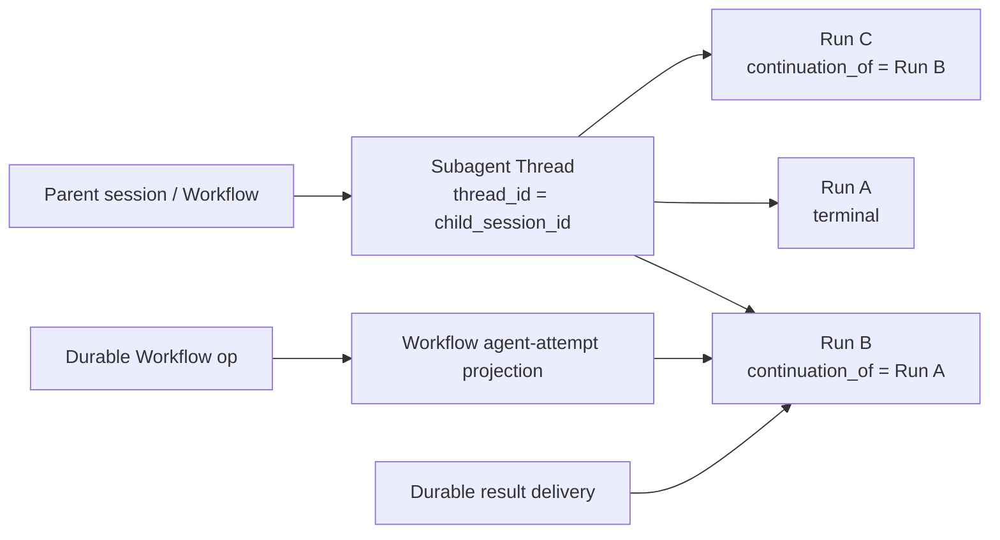
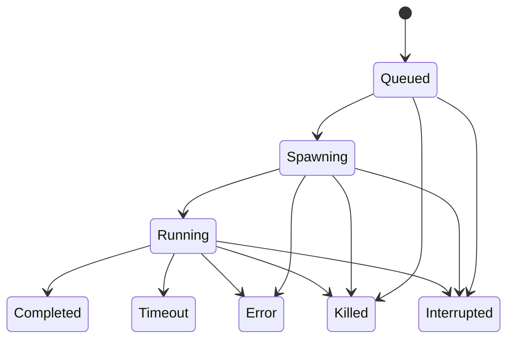
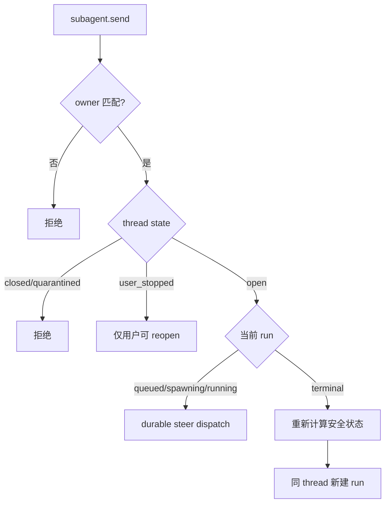
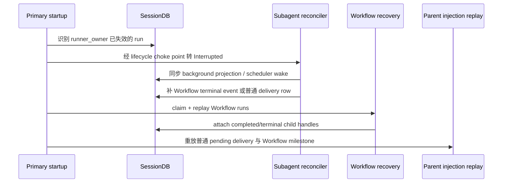

# 子 Agent 稳定线程、续跑与 Workflow 故障恢复方案

> 状态：V1 已实现并完成代码审查；跨进程 SIGKILL strict route 留作发布前手工验证
>
> 日期：2026-07-23
>
> 范围：普通 Subagent、Workflow-owned Subagent、后台投影、父会话回投、进程重启恢复
>
> 相关现状文档：[subagent](../architecture/subagent.md) · [workflow](../architecture/workflow.md) · [background-jobs](../architecture/background-jobs.md) · [process-model](../architecture/process-model.md)

## 0. 决策摘要

本方案采用以下不可分割的设计决策：

1. **不复活旧 run**：续跑永远创建新的 `run_id`，旧 run 保持不可变终态。
2. **稳定身份是 thread，不是 run**：沿用现有 `child_session_id` 作为 `thread_id`；对外返回两者，禁止继续把一次运行的 `run_id` 当作长期 Agent 身份。
3. **普通主 Agent 使用统一 follow-up 语义**：新增 canonical `subagent(action="send")`；目标正在运行时 steer，目标已终态时在同一 thread 新开 run。旧 `steer` / `resume` 保留一个 minor 作为显式兼容别名。
4. **Workflow 不使用状态依赖的隐式 send**：durable script 必须显式调用 `agentSteer` 或 `resumeAgent`，使 op replay 在相同位置得到确定的副作用类型。
5. **Workflow ownership 不得逃逸**：普通 `subagent.resume/send` 不能接管 Workflow-owned thread；Workflow 的 continuation 必须成为当前 Workflow 的新 attempt，并继续计入预算、结果消费、取消和 trace。
6. **故障恢复与自动重试分离**：系统负责把故障收敛为可观察、可续跑的 durable 状态；是否再跑由父 Agent、Workflow 脚本或用户显式决定。runtime 不在终态事件回调中暗自重试 child。
7. **用户停止是硬边界**：`user_killed` 不自动恢复，主 Agent 也不能自行 reopen；只有用户显式操作可以重新开启该 thread。
8. **Workflow 完成必须处理失败 child**：存在未处理的失败 attempt 时，`workflow.finish()` 默认 block，不能仅因所有 child 已终态就把 run 标成 `completed`。
9. **崩溃恢复必须经过生命周期 choke point**：启动期不得再只用 raw SQL 把遗留 run 改成 `error`；状态、Workflow event、后台投影、父回投和调度唤醒必须一起收敛。
10. **恢复的是持久上下文，不是旧 future/call stack**：同 thread continuation 会复用子会话 transcript、working dir / managed worktree，但重新建立模型调用、工具循环、权限快照、取消句柄和用量记录。

### 0.1 实现审查结论（2026-07-23）

V1 已落地稳定 Thread / 不可变 Attempt、owner/epoch fencing、canonical `send`、durable ordinary-parent delivery、`Interrupted` 启动收敛、Workflow API V5 `resumeAgent` / `acceptAgentFailure` / finish guard、attempt UI 与全语言文案。实现 review 额外收紧了两条边界：Workflow 内部 owner 参数必须匹配不可由模型伪造的 `ToolExecContext.workflow_run_id`；incognito 结果只允许同进程即时通知，绝不进入跨重启 delivery replay。

以下设计项在 V1 中明确采用 fail-closed 边界，而不是交付一半的“透明恢复”：

- **Queued 跨重启不透明重排队**：当前 `SpawnParams` 含 live Plan/skill/origin/cancel 状态，附件也可能仍是易失路径；启动时统一转 `Interrupted` 并通知 owner，再由父 Agent/Workflow 显式 continuation。`launch_spec_json` 只作无敏感信息的审计/后续演进基础，不能单独视为可执行 payload。
- **不启用同进程 heartbeat watchdog/quarantine 自动恢复**：当前 supervisor 只处理显式 timeout、cancel、panic 和进程死亡；不存在后台 watcher 偷偷创建 attempt。`last_heartbeat_at` 与 `quarantined` 保留为数据契约，等未来能证明旧 write-capable worker 已停止并具备 cancel ack 后再启用。
- **不新增用户 reopen transport**：当前模型/Workflow 对 `Killed` 与非可恢复 terminal reason 恒拒绝 continuation；GUI 尚无用户 reopen 入口，因此不增加空壳 Tauri/HTTP API。若后续加 GUI 操作，必须按第 14.2 节同 PR 双适配。
- **P6 strict route 不进默认测试**：本次已完成 deterministic DB/Workflow/前端契约测试；真实 SIGKILL/restart 与 write-capable partial-side-effect 场景仍按仓库约定在发布前本地显式执行。

## 1. 背景与问题定义

Hope 当前已经具备以下基础：

- 每个子 Agent 在独立 child session 中执行；`subagent_runs.child_session_id` 已天然形成稳定对话容器。
- 普通 child 的 `Completed / Error / Timeout` 会回投父会话并触发主 Agent 新一轮。
- Workflow 以 `workflow_ops.child_handle` 预登记 child run id，重启后可 replay 已完成 op 或 attach 已创建 child。
- Workflow-owned child 设置 `skip_parent_injection=true`，结果由 Workflow 的 `agentResult / waitAny / waitAll / checkpoint / finish` 消费。
- Workflow run 本身有 Primary claim、position replay、checkpoint delivery recovery 和启动恢复。

但“能恢复 Workflow”不等于“能恢复 Workflow 中故障的子 Agent”。当前仍有五个结构性缺口：

1. `run_id` 同时承担短期 attempt handle 和长期子 Agent 身份，语义混杂。
2. 普通 continuation 没有 durable provenance / owner 约束时，可能把 Workflow-owned child 续跑成普通 child，破坏结果归属。
3. 启动期 orphan sweep 只把 `queued/spawning/running` 改为错误，不触发普通父回投，也绕开 Workflow 生命周期通知。
4. Workflow Host API 只有运行中 `agentSteer`，没有终态 `resumeAgent`；脚本只能创建全新 child，无法延续原 transcript/worktree。
5. `workflow.finish()` 只等待所有 child 终态；失败 child 如果未被脚本显式处理，Workflow 仍可能显示成功。

这里的“子 Agent 挂了”至少包含四种不同情况，必须分开处理：

- Provider/API/模型链失败，但进程仍健康。
- 达到 child deadline 或被 watchdog 中断。
- App / daemon 进程崩溃，内存 future、mailbox、queue 和 cancel flag 全部丢失。
- 用户主动停止、父会话取消或 Workflow 取消。

## 2. 目标与非目标

### 2.1 目标

- 主 Agent 能向同一稳定 child thread 发送后续指令。
- 运行中的 child 接收 steer；终态 child 以新 run 继续，不丢 transcript/worktree。
- Workflow 脚本能观察失败、按策略续跑同一 child、替换 handle，并在崩溃 replay 后保持幂等。
- App 重启后，遗留 child、Workflow op、结果交付和后台投影收敛到一致状态。
- 对用户取消、审批、安全配置变化和 write-capable child 保持 fail-closed。
- UI 能同时展示 thread 和 attempt 历史，不把多次 continuation 显示成多个无关 Agent。
- 普通、Workflow、Group、Team、Cron 血缘保持各自 owner 和交付域，不因 resume 合并。

### 2.2 非目标

- 不恢复 Rust/Tokio future、QuickJS 栈、正在进行的 HTTP 流或 OS 进程现场。
- 不承诺回滚 child 在故障前已经产生的文件或外部副作用。
- 不把旧 run 的审批、Allow Once、sandbox 临时选择或凭据状态继承到新 run。
- 不允许跨 parent session、跨 Workflow run 或跨 Team 接管 thread。
- 不把所有 `Error` 都当成可自动重试错误。
- 不在本方案中合并 tool `async_jobs` 与后台 subagent 两套并发池。
- 不改变 incognito “关闭即焚”语义；incognito thread 不做跨重启恢复。

## 3. 参考实现与采用边界

### 3.1 Codex

Codex 将子 Agent 的长期身份建模为 **Agent Thread**，由主 Agent 负责 spawn、路由 follow-up、等待结果和关闭 thread。Hope 采用其“稳定 thread 身份 + 多次 turn”的核心模型，但继续保留自己的 durable SQLite、权限引擎、Workflow op replay 和本地工作区隔离。

参考：[Codex Subagents](https://learn.chatgpt.com/docs/agent-configuration/subagents)

### 3.2 Claude Code / Agent SDK

Claude Code 的 `SendMessage` 面向稳定 Agent ID：运行中的 Agent 接收消息，已完成 Agent 自动开启新一轮，用户主动停止的 Agent 拒绝恢复。Agent SDK 的 session 记录 prompt、工具调用、工具结果和响应，可按 session ID 在错误后继续。

Hope 采用：

- 消息不等于用户授权。
- completed/error 后续跑是同 session 的新执行。
- user-stopped 默认拒绝自动恢复。
- session/transcript 与 filesystem 状态是两种独立持久事实。

Hope 不照搬：

- Claude Dynamic Workflow 在暂停恢复时会重跑当时仍在运行的 Agent，退出应用后下一 session 从头开始；Hope 已有更强的 durable op store，应继续保证“已完成不重复、不可判定副作用不盲跑”。

参考：[Claude Code Subagents](https://code.claude.com/docs/en/sub-agents) · [Tools Reference](https://code.claude.com/docs/en/tools-reference) · [Agent SDK Sessions](https://code.claude.com/docs/en/agent-sdk/sessions) · [Dynamic Workflows](https://code.claude.com/docs/en/workflows)

## 4. 统一术语

| 术语 | 含义 | 生命周期 |
| --- | --- | --- |
| Thread | 一个稳定的子 Agent 对话容器，承载 transcript、working dir、worktree 和 owner | 可跨多个 run |
| Run / Attempt | Thread 上的一次具体模型/工具执行 | 不可变；一次终态后不复活 |
| Steer | 给当前非终态 run 追加指令 | 不创建新 run |
| Resume / Continue | 在同一 thread 上创建新 run，继续已有上下文 | 创建新 `run_id` |
| Restart | 新建 thread，从空白上下文重新执行 | 创建新 `thread_id` 和 `run_id` |
| Retry | 上层策略判断；可以选择 Resume，也可以 Restart | 不是底层状态转换 |
| Recovery | 将崩溃/中断留下的 durable 数据收敛为可继续状态 | 不等于自动 Retry |
| Owner | 能控制 thread 的域：普通父会话、Workflow、Team 或内部 helper | 创建时固定，禁止隐式转移 |

API 中 `thread_id` 等于现有 `child_session_id`。数据库暂不重命名 `child_session_id`，避免大规模迁移；所有新响应同时返回 `thread_id`，文档和 UI 逐步改用 thread 术语。

## 5. 总体模型



必须保持以下不变量：

- 一个 thread 同时最多一个 `queued | spawning | running` run。
- 旧 run 进入终态后永不回滚为非终态。
- 每个 continuation 都能追溯到 source run、触发者和 owner。
- Workflow attempt 投影只引用 `subagent_runs`，不反写 child 状态。
- 普通 parent delivery、Group merged delivery、Workflow checkpoint/final delivery 互斥。
- 新 run 的安全状态实时重算；thread 只提供上下文连续性，不提供权限连续性。

## 6. 数据模型

以下 schema 名称为目标设计；具体 migration 编号在实现时按当前数据库版本顺延。

### 6.1 `subagent_threads`

新增 thread 控制表，以 child session 为稳定主键：

```sql
CREATE TABLE subagent_threads (
    thread_id           TEXT PRIMARY KEY,
    parent_session_id   TEXT NOT NULL,
    parent_agent_id     TEXT NOT NULL,
    child_agent_id      TEXT NOT NULL,
    depth               INTEGER NOT NULL,
    owner_kind          TEXT NOT NULL,
    owner_id            TEXT NOT NULL,
    lifecycle_state     TEXT NOT NULL DEFAULT 'open',
    current_run_id      TEXT,
    lease_epoch         INTEGER NOT NULL DEFAULT 0,
    created_at          TEXT NOT NULL,
    updated_at          TEXT NOT NULL,
    FOREIGN KEY(thread_id) REFERENCES sessions(id) ON DELETE CASCADE,
    FOREIGN KEY(parent_session_id) REFERENCES sessions(id) ON DELETE CASCADE
);
```

字段约束：

- `owner_kind`：`parent_session | workflow | team | internal`。
- `owner_id`：普通 child 为 parent session id；Workflow child 为 workflow run id；Team child 为 team id；plan/hook/skill 等内部 helper 使用稳定内部 owner id。
- `lifecycle_state`：`open | user_stopped | quarantined | closed`。
- `current_run_id` 是快速定位和 CAS 控制字段；`subagent_runs` 仍是运行真相源。
- `lease_epoch` 每次启动新 run 递增，用于拒绝旧 worker 的迟到提交。

不把 Group 作为 thread owner。Group 是某一批 run 的交付/聚合域；该批次结束后，thread 不得因旧 Group 身份阻止后续普通 continuation。Workflow 与 Team 则是持续控制域，必须固定 owner。

### 6.2 `subagent_runs` 增量字段

保留现有字段，并新增：

```sql
ALTER TABLE subagent_runs ADD COLUMN continuation_of_run_id TEXT;
ALTER TABLE subagent_runs ADD COLUMN trigger_kind TEXT NOT NULL DEFAULT 'spawn';
ALTER TABLE subagent_runs ADD COLUMN terminal_reason TEXT;
ALTER TABLE subagent_runs ADD COLUMN runner_owner TEXT;
ALTER TABLE subagent_runs ADD COLUMN lease_epoch INTEGER NOT NULL DEFAULT 0;
ALTER TABLE subagent_runs ADD COLUMN last_heartbeat_at TEXT;
ALTER TABLE subagent_runs ADD COLUMN delivery_kind TEXT NOT NULL DEFAULT 'parent';
ALTER TABLE subagent_runs ADD COLUMN launch_spec_json TEXT;
```

语义：

- `continuation_of_run_id` 形成 attempt 链；首个 run 为 `NULL`。
- `trigger_kind`：`spawn | parent_followup | workflow_resume | crash_recovery | schema_repair | internal`。
- `terminal_reason` 使用稳定枚举，见“故障分类”。展示文案不得作为恢复判定依据。
- `runner_owner` 使用当前 runtime instance 的唯一 owner token，不只依赖 PID。
- `lease_epoch` 必须与 thread 当前 epoch 相等，状态和最终消息提交才生效。
- `delivery_kind`：`parent | group | workflow | none`，替代只存在内存参数中的 `skip_parent_injection` 语义。
- `launch_spec_json` 只保存重建执行所需的非敏感请求：task、requested model/timeout、isolation、附件引用和受控能力参数；禁止保存 API Key、OAuth token 或未脱敏 Provider 配置。

数据库增加部分唯一索引：

```sql
CREATE UNIQUE INDEX idx_subagent_one_active_run_per_thread
ON subagent_runs(child_session_id)
WHERE status IN ('queued', 'spawning', 'running');
```

应用层 transaction guard 与该索引同时存在：前者返回可理解错误，后者兜住竞争窗口。

### 6.3 `subagent_dispatches`

所有 steer/resume 请求先形成 durable dispatch，用作幂等键和 provenance：

```sql
CREATE TABLE subagent_dispatches (
    id                  TEXT PRIMARY KEY,
    thread_id           TEXT NOT NULL,
    source_run_id       TEXT NOT NULL,
    target_run_id       TEXT,
    dispatch_kind       TEXT NOT NULL,
    owner_kind          TEXT NOT NULL,
    owner_id            TEXT NOT NULL,
    message             TEXT NOT NULL,
    state               TEXT NOT NULL,
    created_at          TEXT NOT NULL,
    delivered_at        TEXT,
    FOREIGN KEY(thread_id) REFERENCES subagent_threads(thread_id) ON DELETE CASCADE
);
```

- `dispatch_kind`：`steer | resume`。
- `state`：`accepted | delivered | consumed | refused`。
- Workflow op 使用预分配 dispatch id；同一 op replay 读取原 dispatch，不重复发送消息或创建 run。
- `message` 是 child transcript 输入，不是 approval；进入 prompt 前继续按现有 user/tool data 规则处理。

### 6.4 `subagent_result_deliveries`

普通 child 的父回投必须从内存 `FETCHED_RUN_IDS` 升级为 durable 状态：

```sql
CREATE TABLE subagent_result_deliveries (
    run_id              TEXT PRIMARY KEY,
    parent_session_id   TEXT NOT NULL,
    state               TEXT NOT NULL,
    suppress_reason     TEXT,
    attempt_count       INTEGER NOT NULL DEFAULT 0,
    requested_at        TEXT NOT NULL,
    delivered_at        TEXT,
    last_error          TEXT
);
```

- `state`：`pending | injecting | delivered | suppressed`。
- `Completed / Error / Timeout / Interrupted` 的普通 child 创建 `pending`。
- `user_killed` 默认创建 `suppressed(user_stopped)` 或不创建交付行。
- 主 Agent 主动读取/续跑 source run 时，事务内标成 `suppressed(explicitly_consumed)`。
- Group child 和 Workflow child 不进入该表；分别沿用 Group merged injection 和 Workflow milestone/final delivery。

### 6.5 `workflow_agent_attempts`

新增 Workflow 单向投影，避免继续只靠 `workflow_ops.child_handle = subagent_runs.run_id` 聚合：

```sql
CREATE TABLE workflow_agent_attempts (
    workflow_run_id     TEXT NOT NULL,
    thread_id           TEXT NOT NULL,
    run_id              TEXT NOT NULL,
    source_op_id        TEXT NOT NULL,
    continuation_of_run_id TEXT,
    role                TEXT NOT NULL,
    created_at          TEXT NOT NULL,
    PRIMARY KEY(workflow_run_id, run_id)
);
```

- `role`：`initial | continuation | schema_repair | imported_read_only`。
- 表中不存 status/result 正文；读取时 join `subagent_runs`。
- Workflow usage、terminal/pending/consumed 统计覆盖同一 thread 的全部 attempt。
- `workflow_ops.child_handle` 仍保存该 op 的直接 child/dispatch handle，服务 replay；attempt 投影服务 ownership、聚合和 UI。
- `imported_read_only` 只表示 V4/V5 selective resume 复用了另一个 terminal Workflow 的只读结果；它不转移 thread owner，不授予 steer/resume/cancel，且不重复计入当前 run 的实际模型用量。

## 7. 状态机与并发控制

### 7.1 Run 状态



新增 `Interrupted` 终态，专门表达进程退出、runner lease 丢失或确定性基础设施中断，避免依赖字符串 `"Orphaned: ..."` 区分普通模型错误。

审批 park 不创建新 run，也不转 `Interrupted`。第一阶段继续让真相 run 保持 `Running`，由现有 background projection 显示 `AwaitingApproval`；parked 仍持有 subagent 槽位。后续如果要给 `subagent_runs` 增加 `AwaitingApproval`，必须同步活跃计数、queue、预算 timer 和审批 watcher，不能在本方案中顺手改一半。

### 7.2 Thread 状态

- `open`：允许父 owner steer 或 resume。
- `user_stopped`：用户明确停止；Agent 调用一律拒绝，用户 owner API 可显式 reopen。
- `quarantined`：旧 worker 是否仍可能产生副作用无法确认；禁止并发 continuation，等待进程终止、cancel ack 或用户处置。
- `closed`：父会话删除、thread 显式关闭或 owner 生命周期结束；永久拒绝新 run。

### 7.3 Fencing

创建或 continuation 的同一 transaction 必须：

1. 校验 owner、thread state 和 source run 终态。
2. 校验不存在非终态 sibling run。
3. `lease_epoch += 1`。
4. 插入新 run，写相同 epoch 和新 `runner_owner`。
5. 更新 `current_run_id`。
6. 若属于 Workflow，同事务写 `workflow_agent_attempts`。

执行器的状态更新、最终 assistant 消息落库和 result 提交必须携带 `(run_id, lease_epoch)`。epoch 不匹配说明旧 worker 已被 fenced，提交只记录审计告警，不得覆盖当前 run 或 child session context。

Fencing 只能阻止迟到 DB 提交，不能撤销已经发生的外部副作用。因此同进程 watchdog 无法确认旧 worker 已停止时，thread 进入 `quarantined`，不能为了“自动恢复”再启动第二个 write-capable worker。

## 8. 普通 Subagent API

### 8.1 Canonical `send`

新增模型工具形态：

```json
{
  "action": "send",
  "thread_id": "session_child_...",
  "message": "继续检查刚才失败的迁移；先确认已有改动，再补剩余部分",
  "mode": "auto",
  "timeout_secs": 600,
  "model": "optional-model-id",
  "files": []
}
```

`mode`：

- `auto`：active 时 steer，terminal 时 resume。
- `steer_only`：不是 active 则拒绝。
- `resume_only`：不是 terminal 则拒绝。

兼容输入允许 `run_id`，但先解析到其 thread；canonical 输出始终返回：

```json
{
  "thread_id": "...",
  "run_id": "new-or-current-run-id",
  "previous_run_id": "...",
  "dispatch_id": "...",
  "disposition": "steered | resumed | refused",
  "status": "queued | spawning | running"
}
```

决策流程：



### 8.2 兼容 action

- `steer(run_id, message)` → `send(mode=steer_only)`。
- `resume(run_id, task)` → `send(mode=resume_only)`。
- 保留一个已发布 minor；system prompt 和 schema 只推荐 `send`。
- 若未经过稳定版发布，当前原型可直接改成上述形态，不必形成历史兼容债务。

### 8.3 Ownership

普通 parent Agent 只能操作：

- `owner_kind=parent_session`；
- `owner_id == ctx.session_id`；
- `parent_session_id == ctx.session_id`；
- child Agent 仍命中当前 delegation allowlist；
- 当前 depth、Plan、KB origin、incognito 和 denied tools 规则允许本轮执行。

`owner_kind=workflow | team | internal` 的 thread 在普通工具面一律拒绝。只比较 `parent_session_id` 不足以形成安全边界。

### 8.4 安全状态重算

每个新 run 必须重新计算：

- child Agent 是否仍存在、enabled 且允许被当前 parent delegation。
- 当前 parent Plan state、permission mode、sandbox、denied tools。
- KB origin / channel identity / cron lineage。
- model chain、timeout、reasoning effort 和当前配置上限。
- worktree 是否仍 active、路径是否可用。
- EvalRunContext 身份及终态 guard。

旧 run 的 Allow Once、审批答案、临时 Provider/profile、取消 flag、mailbox 和 budget timer 不继承。消息本身永远不视为用户 approval。

## 9. Workflow Host API

### 9.0 API version

Thread-aware handle、`resumeAgent`、failure resolution 和严格 finish guard 作为 **Workflow API V5** 一起启用：

- `workflow_run_controls.api_version=5`，并写对应 fail-closed runtime marker。
- V5 是 V4 typed result、Parallel/Pipeline、isolation 和 selective resume 的超集。
- 新生成的 Workflow 使用 V5；存量 V3/V4 run 和 saved template 继续按原语义 replay，不在中途改变 `finish` 行为。
- V3/V4 仍受底层 owner 防逃逸约束，但不自动获得 V5 Host API。
- saved template 只有经过显式 upgrade/重新预检后才迁到 V5，不能静默改写 script hash 或执行语义。

现有 `resumeFromRunId` 表示“创建一个新的 Workflow run，并复用 source run 的稳定只读 op 前缀”，与本方案的 `resumeAgent` 完全不同：前者恢复 orchestration prefix，后者在同一 child thread 上开启新 attempt。

### 9.1 Handle 升级

`workflow.spawnAgent()` 返回值增量加入：

```js
{
  threadId,
  runId,
  attempt: 1,
  status,
  label,
  injectPolicy,
  resultMode,
  isolation
}
```

旧脚本只有 `runId` 时继续兼容；runtime 可从 run 解析 thread。新脚本必须把 `runId` 视为 attempt handle，而不是稳定身份。

### 9.2 `workflow.resumeAgent`

新增显式 Host API：

```js
const next = await workflow.resumeAgent(previous, {
  task: "上一次因 Provider 中断；检查已有状态后继续，避免重复副作用",
  label: "review-resume-1",
  timeout: 600,
  model: "optional-model",
});
```

规则：

- source 必须是当前 Workflow 拥有的 terminal attempt。
- source thread 必须 `open`，且没有 active attempt。
- `user_killed`、审批拒绝和 Workflow cancel 默认不可 resume。
- 新 run 复用 thread/worktree，写 `continuation_of_run_id` 和 `role=continuation`。
- 返回新 handle；后续 `waitAny/waitAll/agentResult/agentSteer/cancelAgent` 应使用新 handle。
- `agentSteer` 继续只接受 active attempt，不隐式 resume。

V4/V5 selective resume 导入的 `shared_read_only` completed child 只提供缓存结果：

- 当前 run 写 `workflow_agent_attempts(role=imported_read_only)` 和 source provenance。
- handle 标记 `control="result_only"`。
- 当前 run 可以 `agentResult` 读取该 immutable result，但不能 `agentSteer/resumeAgent/cancelAgent`。
- 如需继续调查，必须 `spawnAgent` 新建当前 Workflow 自己拥有的 thread，并把必要的已验证摘要作为 untrusted input 传入。

这样既保留现有 selective prefix reuse，又不通过“复用结果”悄悄转移另一个 Workflow 的 Agent 控制权。

Workflow 不提供 `sendAgent(auto)`，因为同一脚本位置在 replay 时根据瞬时状态选择 steer 或 resume 会改变副作用形状，破坏 position replay 的确定性。

### 9.3 Durable replay

`resumeAgent` 是 `non_idempotent` op，但按现有 `spawnAgent` 模式安全恢复：

1. runtime 预分配新 `run_id`。
2. `workflow_ops` 先写 `started + child_handle=new_run_id`。
3. transaction 校验 source ownership/terminal、创建 continuation run、写 attempt 投影。
4. op 完成后保存新 handle output。

崩溃窗口：

| 崩溃位置 | 恢复动作 |
| --- | --- |
| op started 前 | 正常执行 |
| op started 后、新 run 插入前 | 使用预分配 run id 重试同一 transaction |
| 新 run 插入后、op completed 前 | attach `child_handle`，重建 handle，不重复创建 |
| child terminal 后、Workflow terminal event 前 | 启动 reconciler 补写 event |
| op completed 后、结果消费 event 前 | 从 completed output 幂等补写 consumed/suppressed |

input hash 必须覆盖 source `runId`、task、model、timeout、附件引用、isolation 和 output schema；任一变化按现有 Workflow replay 规则 block。

### 9.4 失败消费与 `finish` guard

每个非 `Completed` terminal attempt 默认处于 `unresolved`。以下任一行为可解决：

1. `resumeAgent` 创建 continuation，且 continuation 最终成功。
2. 脚本显式调用：

```js
await workflow.acceptAgentFailure(handle, {
  reason: "其余 7 个独立样本已覆盖结论，此失败不影响报告",
});
```

3. Workflow 进入 `blocked / failed / cancelled`。
4. `workflow.finish()` 显式声明 bounded partial policy，并给出原因：

```js
await workflow.finish({
  summary,
  agentFailurePolicy: {
    mode: "allow_partial",
    reason: "2/20 个只读来源限流，已在报告中标记未验证",
  },
});
```

默认 `mode=require_resolved`。若仍有 unresolved failure，`finish` 转：

```text
Blocked(reason=workflow_unresolved_agent_failures)
```

不得用 `allCompleted` 表示全部成功；新 guide 和生成脚本只使用：

- `allTerminal`
- `allSucceeded`
- `completed`
- `failed`
- `running`
- `unresolvedFailures`

历史 `all_completed` / `allCompleted` 只保留兼容，文档明确其含义是“全部终态”。

### 9.5 脚本恢复示例

```js
let worker = await workflow.spawnAgent({
  task: "审查认证边界",
  label: "auth-review",
  isolation: "shared_read_only",
});

for (let attempt = 0; attempt < 2; attempt += 1) {
  const state = await workflow.waitAll([worker], {
    timeout: 300,
    resultMode: "status",
  });

  if (state.runs[0].status === "completed") break;

  const failure = state.runs[0];
  if (!failure.resumeRecommended) {
    await workflow.block({
      reason: `auth-review failed: ${failure.terminalReason}`,
    });
  }

  worker = await workflow.resumeAgent(worker, {
    task: "读取已有审查上下文，确认已完成范围后继续未完成部分",
  });
}

const result = await workflow.agentResult(worker, { mode: "summary" });
await workflow.finish({ summary: result.result });
```

`resumeRecommended` 只是由故障分类派生的建议，不是权限放行，也不替代脚本的 attempt/budget 上限。

## 10. 故障分类与恢复策略

新增 `SubagentTerminalReason`，状态更新只写枚举，不从 error 文本反推：

| terminal reason | status | 默认建议 | 自动恢复 |
| --- | --- | --- | --- |
| `success` | Completed | 无 | 不适用 |
| `provider_exhausted` | Error | 同 thread resume | 否；由父 Agent/脚本显式决定 |
| `model_error` | Error | 父 Agent/脚本判断 | 否 |
| `tool_error` | Error | 先检查部分副作用 | 否 |
| `deadline_exceeded` | Timeout | 同 thread resume | 否；由父 Agent/脚本显式决定 |
| `process_interrupted` | Interrupted | 同 thread resume | 否；由父 Agent/脚本显式决定 |
| `runner_panic` | Error | block 或人工判断 | 否 |
| `invalid_typed_output` | Error | 走既有 schema repair；耗尽后交上层 | 已由有界 repair 控制 |
| `approval_denied` | Error | 停止/改方案 | 否 |
| `user_killed` | Killed | 仅用户显式 reopen | 永不 |
| `parent_cancelled` | Killed | 跟随父生命周期 | 永不 |
| `workflow_cancelled` | Killed | 跟随 Workflow 生命周期 | 永不 |
| `unknown` | Error | fail-closed，人工/主 Agent判断 | 否 |

`is_resume_recommended(reason)` 是单一判定入口，供普通失败 envelope、Workflow status 和 UI 共用。它不能决定是否有权限，也不能自行开始新 run。

第一版不提供 event-driven `recoveryPolicy`。原因是 child terminal callback 在 QuickJS 执行位置之外创建 run，会让 position replay、handle 替换和预算归属变得不确定。需要有界自动化时，脚本使用显式 `for` 循环 + `resumeAgent`，每次 continuation 都形成正常 durable op。

未来若增加 `withAgentRecovery` helper，它也只能展开为脚本位置下可见的 `resumeAgent` ops；不得在后台 status watcher 中旁路创建 attempt。`user_killed/approval_denied/tool_error/unknown` 仍不得进入任何自动 helper。

## 11. 崩溃与卡死恢复

### 11.1 App / daemon 重启

Primary 启动恢复顺序固定为：



具体规则：

- `running/spawning` 且 runner owner 属于上个已死亡 Primary → `Interrupted(process_interrupted)`。
- `queued`：若 `launch_spec_json` 和附件引用完整则重新进入 durable queue；否则转 `Interrupted(queue_payload_unavailable)`，由 owner 决定 resume。
- 所有转换调用 `SessionDB::update_subagent_status` 的新 owner/epoch-aware 版本；删除当前 raw SQL 批量旁路。
- Workflow child 转终态后补 `workflow_agent_terminal`，再由 Workflow replay 的脚本分支决定 `resumeAgent / accept / block`。
- 普通 child 创建 pending result delivery，父会话空闲后注入失败 envelope 并运行主 Agent。
- Group child 不个体回投；Group reconciler 聚合 terminal attempts 后决定 merged delivery。
- Team/internal child 交回各自 owner，不走普通父回投。

### 11.2 同进程卡死

“没有输出”不等于卡死。第一版只使用可证明信号：

- 用户/Agent 配置的 `timeout_secs`。
- runner supervisor 独立更新的 heartbeat。
- 明确失效的 task JoinHandle / panic。
- cancel acknowledgement。

watchdog 流程：

1. deadline 到达，设置 cancel flag 并等待有界 grace。
2. 收到 ack → `Timeout(deadline_exceeded)`，允许后续 resume。
3. 未收到 ack 且进程仍活着 → thread 进入 `quarantined`，不启动并行 continuation。
4. 进程终止或旧 lease 确认失效 → 转 `Interrupted`，解除 quarantine。

默认 timeout 为 0（不限时）的现有语义不变。不能为了提供 resume 把所有长任务暗中加上 watchdog deadline。

### 11.3 持久附件与 queued replay

要让 `Queued` 在重启后真正重排队，spawn 前必须把附件从临时目录转存到 session 管理的 durable attachment 路径，并在 `launch_spec_json` 只保存引用。若附件仍只有易失临时路径，该 run 不具备透明重排队条件，必须转 Interrupted，不能假装恢复成功。

## 12. 父 Agent 主动回复与结果交付

普通 child 的失败 envelope 采用结构化格式：

```xml
<subagent-result>
  <thread-id>...</thread-id>
  <run-id>...</run-id>
  <status>interrupted</status>
  <terminal-reason>process_interrupted</terminal-reason>
  <resume-allowed>true</resume-allowed>
  <resume-recommended>true</resume-recommended>
  <error>bounded redacted summary</error>
</subagent-result>
```

回投注入父会话后，主 Agent 可以：

- `subagent.send(mode=resume_only)` 继续同一 thread。
- 认为失败不可恢复，直接向用户解释。
- 新建另一个 thread 交叉验证。
- 请求用户处理审批、凭据或高风险动作。

这里是“主 Agent 主动决策恢复”，不是 runtime 无条件自动重试。

Workflow-owned child 不走普通 envelope：

- Workflow script 在 worker 内通过 status/wait API 继续编排。
- `injectPolicy=checkpoint` 可把 bounded 故障 checkpoint 回投主会话。
- `final` 在 Workflow 完成/阻塞时统一交付。
- 主 Agent 即使从 checkpoint 看见 Workflow child，也只能通过 `workflow` 控制面影响它，不能调用普通 `subagent.send` 接管。

交付重放继续复用 `inject_and_run_parent` 的 foreground idle guard、用户消息优先、取消后重排队和 session 删除保护；区别是来源状态从内存集合改为 durable delivery row。

## 13. 权限、安全与隔离

- continuation 重新进入 `permission::engine::resolve_async()`，不缓存旧决议。
- Plan mode 执行层读取 live state；旧 run 在 Plan 外启动不代表新 run仍可写。
- Workflow `shared_read_only` thread 续跑后仍安装 locked minimal allowlist，不能通过 resume 切换为 worktree/write-capable。
- worktree thread 只能复用原 managed worktree；缺失/归档/restore 失败时 block，不回落父目录。
- 出站网络、SSRF、MCP OAuth、raw CDP strict 和无人值守 approval 规则不因 resume 改变。
- IM/Cron/KB 权限继续按 origin lineage 计算，不能因 child session 被续跑而洗掉来源。
- message、task、旧 result 和 error 都是 untrusted data；不得提升为 system instruction。
- 日志只记录 thread/run/owner/reason/epoch，不记录 prompt 正文、API Key、OAuth token 或附件内容。
- incognito 不创建 durable thread/dispatch/delivery；同进程可 steer，关闭或崩溃后不恢复。

## 14. UI 与 Transport

### 14.1 UI

Subagent UI 按 thread 聚合，默认显示当前/最新 attempt，同时保留可展开历史：

- Header：Agent、label、thread 状态、owner。
- Attempt timeline：Run #1 → Interrupted → Run #2 → Completed。
- 明确区分“继续同一 Agent”和“新建 Agent”。
- `user_stopped` 只显示用户可点的“重新开启”，不向模型暴露自动按钮。
- `quarantined` 显示“旧执行尚未确认停止”，禁用 resume。
- Workflow Agents 视图展示 attempt chain、failure resolution 和替代关系。
- failed/blocked Workflow 的下一步卡片说明具体 unresolved child，而不是泛化为“运行失败”。

前端不得简单丢弃旧 attempt。列表可按 `thread_id` 选最新 run，但详情必须保留完整 chain；聚合排序和去重规则的 TS/Rust 双份实现同步更新。

### 14.2 Owner transport

若 GUI 提供用户 follow-up/reopen，Core service 先落地，Tauri 与 HTTP 同 PR 双适配：

- `POST /api/subagent-threads/{threadId}/messages`
- `POST /api/subagent-threads/{threadId}/reopen`
- Tauri 对应 `subagent_send_message` / `subagent_reopen_thread`

HTTP 默认 Bearer 鉴权；所有入口调用同一 `ha-core` service，不复制 ownership/permission 逻辑。新增端点同步 [api-reference](../architecture/api-reference.md)。

## 15. Workflow guide 与模型提示

Workflow authoring guide 必须新增以下规则：

- 每个 `waitAny/waitAll` 后检查 `failed` 和 `terminalReason`。
- 需要上下文连续性时用 `resumeAgent`，需要独立验证时用 `spawnAgent`。
- continuation 返回新 handle，旧 handle 不再代表当前 attempt。
- attempt 必须有硬上限；禁止无界 while-retry。
- `resumeRecommended` 只是诊断建议。
- 调用 `finish` 前必须解决失败 attempt，或显式声明 partial policy。
- 用户停止、审批拒绝、权限失败不得自动恢复。

普通 Subagent system prompt 只保留简短规则：

- active thread 用 send/steer；terminal thread 用 send/resume。
- 收到失败回投后先判断原因和部分副作用，不要机械重试。
- `user_stopped` 不得绕过。

完整故障矩阵放按需 guide，不进入每轮常驻 system prompt。

## 16. 事件、日志与用量

新增稳定事件：

- `subagent_thread_created`
- `subagent_dispatch_accepted`
- `subagent_run_resumed`
- `subagent_run_interrupted`
- `subagent_thread_quarantined`
- `subagent_delivery_requested`
- `subagent_delivery_delivered`
- `subagent_delivery_suppressed`
- `workflow_agent_resume_requested`
- `workflow_agent_resume_attached`
- `workflow_agent_failure_accepted`
- `workflow_agent_failure_unresolved`

Workflow trace payload 至少包含 `threadId/runId/previousRunId/opKey/terminalReason`，不含完整 task/result。

每个 continuation 是新的模型推理入口，继续通过 `model_usage.rs` 入账。Workflow usage 从 `workflow_agent_attempts` 聚合所有 attempt，避免只计算首次 spawn。Dashboard 不新增 usage kind；仍属于 subagent，但 lineage 中增加 workflow run id 和 continuation attempt。

核心日志埋点：

- `category=subagent source=send|resume|recovery|delivery`
- `category=workflow source=agent_resume|agent_failure_resolution`
- owner mismatch、epoch mismatch、replay attach、quarantine 必须可 grep。

## 17. 迁移与兼容

### 17.1 数据迁移

1. 创建新表和增量列，保持旧列不删除。
2. 按 `subagent_runs.child_session_id` 回填 thread：
   - parent/agent/depth 取最早 run 与 child session 交叉校验。
   - 能关联 `workflow_ops(op_type='spawnAgent')` 的 thread 回填 `owner_kind=workflow`。
   - Team/internal 无法可靠识别的历史终态 thread 回填 `owner_kind=internal`、`lifecycle_state=closed`，禁止误开放 resume。
   - 其余回填 `owner_kind=parent_session`。
3. 历史 run 的 `terminal_reason` 留 `unknown`；不根据自由文本批量猜测。
4. 当前活跃 run migration 前由启动恢复先收敛，避免建立 partial unique index 失败。
5. 旧 Workflow attempt 从 `workflow_ops.child_handle` backfill，role=`initial`。

### 17.2 API 兼容

- 旧 `run_id` 输入继续接受一个 minor，并在响应增量返回 `thread_id`。
- `steer/resume` 作为 `send` 的严格模式别名；不会改变原本“active/terminal 不匹配即报错”的行为。
- 旧 Workflow handle 只含 `runId` 仍可用。
- 历史 Workflow 没有 `workflow_agent_attempts` 时读取层回退 `workflow_ops.child_handle`；新 run 必须写 projection。
- Workflow V5 才启用 strict finish guard；V3/V4 保持原 replay 语义。新建 run/template 不再默认生成旧版本。
- 新字段全部 additive；旧客户端忽略即可。

### 17.3 当前 resume 原型的处理

在正式暴露前先完成 P0 收口：

- 增加 durable `continuation_of_run_id`，不能只在工具响应里临时返回来源。
- 增加 owner_kind/owner_id 校验，普通 action 拒绝 Workflow-owned child。
- source result 的 fetched/suppressed 改为 durable 状态。
- UI 不只“按 child session 取最新”而永久隐藏历史，必须提供 attempt timeline。
- 未完成这些条件时，resume 只能视为本地原型，不进入发布说明。

### 17.4 Rollback

- migration 只增表/列/索引，不删除旧字段。
- feature flag 控制新 `send` / Workflow `resumeAgent` schema 暴露；关闭后旧 spawn/check/list 仍工作。
- 回滚旧 binary 时会忽略新表；不得把新状态写成旧枚举无法解析的值，`Interrupted` 枚举上线必须与 reader 同版本原子发布。
- 若 `Interrupted` 兼容风险过高，迁移期可先存 `status=error + terminal_reason=process_interrupted`，待所有 reader 更新后再启用独立状态；最终目标仍是独立状态。

## 18. 实施阶段

### P0：原型收口与边界保护

- 暂不扩大 resume 对外宣传。
- 普通 resume 拒绝 Workflow/Team/internal owner。
- 文档明确当前原型不提供 crash auto-recovery。
- 为后续 migration 加回归 fixture，确认存量 run 形态。

涉及：

- `crates/ha-core/src/tools/subagent.rs`
- `crates/ha-core/src/session/subagent_db.rs`
- `crates/ha-core/src/workflow/{db,runtime}.rs`

### P1：Thread / Attempt 核心模型

- migration、`subagent_threads`、run provenance、partial unique index。
- owner/epoch-aware lifecycle choke point。
- backfill 与旧数据读取兼容。
- EvalRunContext continuation 传播和终态 guard。

### P2：普通 `send` 与 durable delivery

- `subagent_dispatches`、canonical send、兼容 aliases。
- mailbox 改为 durable dispatch drain；内存 Notify 只做唤醒优化。
- `subagent_result_deliveries` 替换进程内 fetched 真相。
- Error/Timeout/Interrupted 重启回投父 Agent。

### P3：启动恢复与 fencing

- 删除 orphan raw SQL 旁路，统一 recovery transaction。
- runner owner 与 lease epoch fencing；记录 heartbeat/quarantine 契约，但 V1 不启用同进程 watchdog 自动接管。
- queued launch spec 仅保留脱敏审计摘要；跨重启统一收敛为 Interrupted，不用不完整的易失附件透明重放。
- 按固定顺序协调 async job replay、Workflow recovery 和注入 replay。

### P4：Workflow continuation

- `workflow_agent_attempts`。
- `resumeAgent` / `acceptAgentFailure` / finish guard。
- replay crash-window handling、usage 聚合、cancel 覆盖新 attempt。
- Parallel/Pipeline coverage 与 authoring guide 更新。

### P5：UI、Transport、i18n 与文档

- thread/attempt timeline、Interrupted 与 Workflow resolution UI；V1 不暴露无后端语义的 reopen/quarantine 操作。
- V1 没有新增 owner GUI 命令，因而不增加空壳 Tauri / HTTP transport；后续新增 reopen 时须双适配并同步 API reference。
- 所有新增 i18n key 同 PR 全语言补齐并跑 sync check。
- 实现完成后再把稳定事实同步到 architecture 和 user guide；本 plan 保留决策与迁移记录。

### P6：严格恢复证明

- 已完成 deterministic DB / Workflow crash-window 契约测试。
- 本地跨进程 kill/restart strict route 留作发布前显式执行。
- write-capable worktree partial-side-effect 场景随 strict route 验证，不进入默认测试。
- 本次没有新增 Capability Eval 执行边界，无需变更 identity/version-lock；未来新增时必须按项目契约 append-only。

## 19. 测试矩阵

### 19.1 DB / 状态机

- 两个并发 resume 只有一个成功。
- active run 存在时 steer 成功、resume 拒绝。
- source run 保持终态，新 run 正确写 continuation chain。
- partial unique index 和 application transaction 双重防并发。
- 跨 parent session、跨 Workflow、跨 Team handle 全部拒绝。
- user_stopped / quarantined / closed thread 全部 fail-closed。
- 旧 epoch worker 的状态、result、message commit 被拒绝。
- dispatch replay 不重复发送或创建 run。

### 19.2 普通父回投

- Completed/Error/Timeout/Interrupted 各只注入一次。
- user_killed 不自动注入、不被主 Agent 自动 resume。
- 主 Agent 显式 result/send 后 source delivery durable suppress。
- 父会话忙时排队，空闲后交付；重启后 pending 仍可 replay。
- 父会话删除、incognito 焚毁后 delivery 被消费/丢弃，不反复重试。

### 19.3 Workflow replay

- `resumeAgent` 的四个崩溃窗口均不重复 child。
- Workflow restart 后 attach continuation attempt。
- terminal event/checkpoint/consumed event 各自缺失窗口可幂等补写。
- failed child 未处理时 finish block。
- continuation 成功后 source failure resolved。
- allow_partial 必须有 reason，并在 final/trace 中可见。
- cancel Workflow 覆盖同一 thread 的当前 continuation。
- usage 统计包括 initial + continuation + schema repair，不重复。
- `waitAll.allTerminal=true` 与 `allSucceeded=false` 能同时成立。

### 19.4 故障与权限

- Provider 全链失败、模型错误、tool error、panic、deadline 分别映射稳定 reason。
- approval parked 不被 orphan/retry；批准后继续原 run。
- approval denied 不自动 resume。
- Plan mode、sandbox、KB、IM/Cron origin 在 continuation 时重新计算。
- Workflow shared-read-only 不能通过 resume 获得写工具。
- worktree 缺失时 block，不回落父 workspace。
- 附件缺失的 queued run 转 Interrupted，不以空附件悄悄执行。

### 19.5 跨进程 strict route

至少覆盖：

1. child Running 时 SIGKILL Primary。
2. child 已完成、delivery 尚未落 delivered 时 SIGKILL。
3. Workflow resume op started、新 child 尚未 op-complete 时 SIGKILL。
4. Workflow child terminal、checkpoint 尚未 requested 时 SIGKILL。
5. 重启后确认旧 run Interrupted、Workflow/parent 可行动、无重复副作用。

默认 `cargo test` 只保留快速契约测试；完整 kill/restart 与真实模型评测按仓库约定仅本地显式运行，不进入当前 CI。

## 20. 验收标准

功能验收：

- 普通主 Agent 收到 `Error/Timeout/Interrupted` 后，可以在同一 thread 新开 run；child 看到旧 transcript，工作目录不变。
- Workflow script 可以 `resumeAgent` 故障 child，重启后继续等待新 handle，不重复 spawn。
- App 重启后普通失败结果最终到达父 Agent，Workflow child 最终进入 script 可观察状态。
- 用户停止的 child 不会被模型或 Workflow 自动恢复。
- 未处理失败 child 的 Workflow 不会显示 Completed。

一致性验收：

- 任一 thread 同时最多一个 active run。
- 每个 continuation 都有 durable source/owner/op provenance。
- Workflow usage、取消、结果消费和 UI 都包含 continuation attempt。
- pending/delivered/suppressed 在重启前后不丢、不重复。
- 旧 worker 的迟到 DB 提交无法覆盖新 run。

安全验收：

- resume 不跨 parent/Workflow/Team owner。
- 不继承旧审批或放宽 live Plan/sandbox/KB/permission。
- 日志、event、launch spec 无 API Key/OAuth token/prompt 正文泄露。
- write-capable zombie 未确认停止时进入 quarantine，不并发启动 continuation。

兼容验收：

- 存量 `spawn/check/list/steer/resume` 调用在兼容期内可用。
- 旧 Workflow handle/replay 可读；新 Workflow 全部写 attempt projection。
- migration 可重复运行，历史未知错误不被错误归类为 retryable。

## 21. 发布与观察

建议按三档启用：

1. **内部隐藏**：只写新表/provenance/owner guard，不向模型暴露新 API。
2. **普通 Subagent Beta**：开放 `send` 和 durable parent delivery；Workflow resume 仍关闭。
3. **Workflow Beta**：开放 `resumeAgent`、finish guard 和 UI attempt chain。

每档至少观察：

- resume 请求数、成功/拒绝原因。
- thread active-run 冲突和 epoch mismatch。
- crash recovery 后 Interrupted 数量与最终处理率。
- delivery replay 次数、重复抑制数、永久失败数。
- Workflow unresolved failure block 数和 allow-partial 数。
- continuation 的 token/时长放大率。

出现 ownership 逃逸、双 active run、重复父回投、用户停止后自动恢复或 worktree 并发写时，立即关闭 API feature flag；durable 数据保留供诊断，不做破坏性回滚。
