# IDE 集成对比分析：OpenComputer vs Claude Code vs OpenClaw

> 基线对比时间：2026-04-05 | 对应主文档章节：2.10

---

## 一、架构总览

三个项目在 IDE 集成方面采用了截然不同的架构策略：

| 维度 | OpenComputer | Claude Code | OpenClaw |
|------|-------------|-------------|----------|
| 协议 | ACP (Agent Client Protocol), JSON-RPC 2.0 over NDJSON stdio | 自有 Bridge 协议, HTTP REST + WebSocket + SDK stdio | ACP (基于 `@agentclientprotocol/sdk`), NDJSON stdio |
| 角色 | 同时是 ACP **服务端**（`acp/`）和 **客户端**（`acp_control/`） | 纯 Bridge 服务端（注册 Environment → 轮询 Work → 分发 Session） | 同时是 ACP **服务端**（`acp/server.ts`）和 **客户端**（`acp/client.ts`）+ Control Plane 管理层 |
| 语言 | Rust（同步阻塞 stdio 主循环 + tokio 内嵌运行时） | TypeScript（Node.js / Bun，异步事件循环） | TypeScript（Node.js，异步事件循环） |
| 通信模型 | 直连 — IDE 进程 ↔ stdin/stdout ↔ AcpAgent | 间接 — claude.ai 服务端中转（HTTP 轮询 / WebSocket） | 直连 stdio + 远程 Gateway WebSocket 双通道 |
| 多会话 | 内存 HashMap，最大 32 并发，LRU 驱逐 | 多进程 spawn（`sessionRunner.ts`），最大 32 并发，worktree 隔离 | 内存 Map，最大 5000 并发，24h idle TTL 自动清理 |
| SDK 依赖 | 无，纯手工实现 JSON-RPC 2.0 | 无 ACP SDK，自有协议 | `@agentclientprotocol/sdk`（官方 ACP SDK） |

```mermaid
graph TB
  subgraph OpenComputer
    IDE_OC[IDE Client] -->|stdin/stdout NDJSON| ACP_Server[acp/server.rs]
    ACP_Server --> Agent_OC[AssistantAgent]
    Agent_OC -->|acp_control| External[Claude Code / Codex CLI / Gemini CLI]
  end

  subgraph Claude Code
    Web[claude.ai Web UI] -->|HTTP REST| Bridge_API[Bridge API Server]
    Bridge_API -->|Poll Work| Bridge_Main[bridgeMain.ts]
    Bridge_Main -->|spawn child| Session_Runner[sessionRunner.ts]
    Session_Runner -->|stdio SDK| Claude_CLI[claude CLI process]
  end

  subgraph OpenClaw
    IDE_OW[IDE Client] -->|stdin/stdout NDJSON| ACP_GW[AcpGatewayAgent]
    ACP_GW -->|WebSocket| Gateway[OpenClaw Gateway]
    OW_Client[ACP Client] -->|stdin/stdout| OW_Server[openclaw acp server]
  end
```

---

## 二、OpenComputer 实现

### 2.1 ACP 协议（Agent Coding Protocol）

OpenComputer 的 ACP 服务端位于 `crates/oc-core/src/acp/`，完全用 Rust 手工实现，无第三方 ACP SDK 依赖。

**协议层（`protocol.rs`）**：
- 传输层：`NdJsonTransport` — 基于 `BufReader<Stdin>` / `Stdout` 的同步 NDJSON 读写
- 每条消息是一个以 `\n` 终止的 JSON 对象
- 解析错误时发送 JSON-RPC error 并 continue（不中断连接）

**类型定义（`types.rs`）**：
- 完整实现 JSON-RPC 2.0 基础类型（`JsonRpcMessage`、`JsonRpcResponse`、`JsonRpcNotification`）
- ACP 标准方法的请求/响应结构体：
  - `initialize` / `InitializeResponse`（协议版本 0.2）
  - `session/new` / `session/load` / `session/list` / `session/close`
  - `session/prompt`（支持 text / image / resource / resource_link 四种 ContentBlock）
  - `session/setMode` / `session/setConfigOption`
  - `session/cancel`（通知，无 id）
  - `authenticate`
- 会话更新通知（`SessionUpdate` 枚举）：
  - `agent_message_chunk` / `agent_thought_chunk`（流式文本/思考）
  - `tool_call` / `tool_call_update`（工具调用进度，含 kind 推断）
  - `usage_update` / `session_info_update`
  - `available_commands_update` / `current_mode_update` / `config_option_update`
  - `user_message_chunk`（历史回放用）
- Prompt 安全限制：最大 2MB（`MAX_PROMPT_BYTES`）

**Agent 核心（`agent.rs`）**：
- `AcpAgent` 结构体持有 `NdJsonTransport`、`AcpSessionStore`、`SessionDB`
- 主循环（`run()`）：同步阻塞读取 stdin → 区分 request/notification → dispatch → 写回 stdout
- 初始化握手：检查 `initialized` 标志，未初始化时拒绝非 `initialize` 请求
- Session 创建：调用 `SessionDB.create_session()` 持久化 → 构建 `AssistantAgent` → 插入 `AcpSessionStore`
- Prompt 处理：提取文本+图片 → 保存 user message → 自动生成标题 → `run_agent_chat()` → 保存 assistant message
- `run_agent_chat()` 实现：
  - 创建 `tokio::runtime::Builder::new_current_thread()` 内嵌运行时
  - 完整的 failover 链：model_chain 遍历 + 指数退避重试（最多 2 次）
  - 通过 `std::sync::mpsc::channel` 将异步事件桥接回同步 transport
- Mode 切换：`session/setMode` 会重建 `AssistantAgent`，切换到不同的 agent 配置
- Config 选项：目前仅支持 `reasoning_effort`（low/medium/high）
- 历史回放：`loadSession` 时从 `SessionDB` 加载消息并逐条发送 ACP 通知

**事件映射（`event_mapper.rs`）**：
- 将 `AssistantAgent` 的 `on_delta` JSON 事件转换为 ACP `session/update` 通知
- 支持映射：`text_delta` → `AgentMessageChunk`、`thinking_delta` → `AgentThoughtChunk`、`tool_call` → `ToolCall`、`tool_result` → `ToolCallUpdate`、`usage` → `UsageUpdate`
- 工具结果截断为 8KB 发送到 IDE

**会话存储（`session.rs`）**：
- `AcpSessionStore`：内存 HashMap，最大 32 并发会话
- LRU 驱逐策略：当达到上限时驱逐最旧的非活跃会话
- 每个 `AcpSession` 持有独立的 `AssistantAgent` 实例、`AtomicBool` cancel 标志

### 2.2 运行时管理（ACP Control Plane）

`acp_control/` 是 OpenComputer 作为 ACP **客户端**的实现，用于管理外部 ACP 代理进程。

**架构设计**：
- `AcpRuntime` trait（`types.rs`）：可插拔后端抽象，定义完整会话生命周期（`create_session` → `run_turn` → `cancel_turn` → `close_session`）
- `StdioAcpRuntime`（`runtime_stdio.rs`）：通过 stdin/stdout NDJSON 与子进程通信
- `AcpRuntimeRegistry`（`registry.rs`）：全局后端注册表，`RwLock<HashMap<String, Arc<dyn AcpRuntime>>>`
- `AcpSessionManager`（`session_manager.rs`）：控制面核心，管理 spawn/monitor/lifecycle

**子进程管理**：
- 进程组隔离：Unix 下 `setpgid(0, 0)` 创建新进程组，可整组 kill
- 默认用 `<binary> acp` 子命令启动外部代理（Claude Code / Codex CLI / Gemini CLI）
- 握手流程：`initialize`（协议版本 0.2）→ `session/new` → 获取 `external_session_id`
- 流式事件解析：读取 stdout NDJSON，区分 response（匹配 id）和 notification（`session/update`）
- 超时控制：handshake 30s，turn 600s

**后台执行**：
- `spawn_run()` 立即返回 `run_id`，执行在 `tokio::spawn` 中异步进行
- 事件流通过 `mpsc::channel<AcpStreamEvent>` → 独立 task 转发为 Tauri 全局事件
- 完成后自动调用 `runtime.close_session()` 并持久化到 SQLite
- 支持 `steer_run()`（发送后续消息）、`kill_run()`（SIGTERM 终止进程组）、`kill_all()`

**配置（`config.rs`）**：
- 全局配置 `AcpControlConfig`：master switch、最大 5 并发、默认超时 600s、idle TTL 1800s
- 三个预注册后端：Claude Code（`claude`）、Codex CLI（`codex`）、Gemini CLI（`gemini`）
- 每 Agent 策略 `AgentAcpConfig`：`allowed_backends` / `denied_backends` 白/黑名单

**自动发现**：
- 启动时扫描 `$PATH` 查找已知二进制（`which` crate）
- 与用户配置合并，用户配置优先

### 2.3 健康检查

`health.rs` 提供 `probe_binary()` 函数：
- 执行 `<binary> --version`，10s 超时
- 通过正则提取语义版本号（`v?X.Y.Z`）
- 返回 `AcpHealthStatus`（available / binary_path / version / error / last_checked）
- 结果缓存在 `AcpRuntimeRegistry.health_cache` 中

---

## 三、Claude Code 实现

Claude Code 的 IDE 集成采用完全不同的架构 -- **Bridge 模式**（Remote Control），通过 Anthropic 云端服务中转，不使用 ACP 协议。

### 3.1 Bridge 主循环（`bridgeMain.ts`）

`runBridgeLoop()` 是 Bridge 的核心事件循环：

**注册阶段**：
- 调用 `POST /v1/environments/bridge` 注册 Environment
- 发送 machine_name / directory / branch / git_repo_url / max_sessions / worker_type
- 支持幂等重连（`reuseEnvironmentId`）
- 返回 `environment_id` + `environment_secret`

**轮询循环**：
- `GET /v1/environments/{id}/work/poll` 长轮询等待 work
- Work 类型：`session`（正常会话）或 `healthcheck`
- Work 包含 `secret`（base64url JSON），内含 `session_ingress_token` / `api_base_url` / MCP 配置 / 环境变量
- 收到 work 后调用 `acknowledgeWork()` 确认

**会话管理**：
- `SpawnMode` 三种模式：
  - `single-session`：单会话模式，结束即退出
  - `worktree`：每个会话创建 git worktree 隔离
  - `same-dir`：所有会话共享工作目录
- 最大并发 32 个会话（`SPAWN_SESSIONS_DEFAULT`）
- 达到容量时休眠，通过 `capacityWake` 信号唤醒

**心跳与 Token 刷新**：
- `heartbeatWork()` 定期续租 work lease
- JWT 过期时通过 `reconnectSession()` 触发服务端重分发
- 主动 token 刷新：在 JWT 过期前 5 分钟调度刷新

**退避策略**：
- 连接错误：2s 初始 → 120s 上限 → 10min 放弃
- 一般错误：500ms 初始 → 30s 上限 → 10min 放弃
- 系统休眠检测：间隔超过 `connCapMs * 2` 时重置错误计数

**安全机制**：
- `BridgeFatalError`：401/403/404/410 等不可重试错误
- ID 验证：`validateBridgeId()` 只允许 `[a-zA-Z0-9_-]+` 防止路径遍历
- OAuth 401 自动刷新重试

### 3.2 Bridge API（`bridgeApi.ts`）

`createBridgeApiClient()` 封装所有与 Anthropic 后端的 HTTP 交互：

| 方法 | 端点 | 用途 |
|------|------|------|
| `registerBridgeEnvironment` | `POST /v1/environments/bridge` | 注册 Bridge 环境 |
| `pollForWork` | `GET /v1/environments/{id}/work/poll` | 轮询待处理 work |
| `acknowledgeWork` | `POST .../work/{id}/ack` | 确认接收 work |
| `stopWork` | `POST .../work/{id}/stop` | 停止 work（支持 force） |
| `heartbeatWork` | `POST .../work/{id}/heartbeat` | 心跳续租 |
| `deregisterEnvironment` | `DELETE /v1/environments/bridge/{id}` | 注销 Environment |
| `archiveSession` | `POST /v1/sessions/{id}/archive` | 归档会话（409 = 幂等） |
| `reconnectSession` | `POST .../bridge/reconnect` | 重连会话 |
| `sendPermissionResponseEvent` | `POST /v1/sessions/{id}/events` | 发送权限决策 |

认证：`Bearer` OAuth token + `anthropic-version` + `anthropic-beta` headers，支持 `X-Trusted-Device-Token`。

### 3.3 REPL Bridge（`replBridge.ts`）

`initBridgeCore()` 是在已有 CLI REPL 会话中嵌入 Bridge 功能的入口：

**核心概念**：
- `BridgeCoreParams`：显式参数化（dir / machineName / branch / gitRepoUrl / baseUrl / workerType 等）
- 同时支持 REPL 包装器（使用完整 CLI 上下文）和 Daemon 调用者（使用精简 HTTP-only API）
- `ReplBridgeHandle` 提供：`writeMessages()` / `writeSdkMessages()` / `sendControlRequest()` / `sendResult()` / `teardown()`
- 状态机：`ready` → `connected` → `reconnecting` → `failed`

**传输层**：
- V1 传输（`createV1ReplTransport`）：直连 SDK URL
- V2 传输（`createV2ReplTransport`）：CCR v2 SSE + CCRClient
- `HybridTransport`：根据 `use_code_sessions` 标志选择 V1/V2

**权限处理**：
- Bridge 可接收服务端的 `control_request`（工具使用权限请求）
- 通过 `sendPermissionResponseEvent()` 回传决策（allow_once / allow_always / reject）

### 3.4 Session Runner（`sessionRunner.ts`）

`createSessionSpawner()` 管理子进程的 spawn 与监控：

- 通过 `child_process.spawn` 启动 `claude` CLI 子进程
- 传入 `--sdk-url` / `--access-token` 等参数
- stdout NDJSON 解析，提取活动信息（tool_start / text / result / error）
- `PermissionRequest` 类型：子进程发送 `control_request`，Bridge 转发到服务端
- 工具动词映射（`TOOL_VERBS`）：Read→Reading, Write→Writing, Bash→Running 等，用于 UI 状态显示
- stderr 日志环形缓冲（最近 10 行）
- `SessionHandle`：done Promise + kill/forceKill + activities ring buffer + writeStdin

### 3.5 VS Code SDK MCP（`vscodeSdkMcp.ts`）

Claude Code 通过 MCP（Model Context Protocol）与 VS Code 扩展双向通信：

- 服务端名称：`claude-vscode`
- **入站**：接收 `log_event` 通知，转发为 `tengu_vscode_*` 分析事件
- **出站**：
  - `experiment_gates` 通知：下发功能开关（review_upsell / onboarding / quiet_fern / vscode_cc_auth / auto_mode_state）
  - `file_updated` 通知：文件编辑后通知 VS Code 刷新（ant 用户专属）
- 本质上是一个轻量 IPC 通道，不涉及 Agent 会话管理

---

## 四、OpenClaw 实现

### 4.1 ACP 系统

OpenClaw 的 ACP 实现基于官方 `@agentclientprotocol/sdk`，包含完整的服务端和客户端。

#### 4.1.1 ACP 服务端（`server.ts` + `translator.ts`）

**架构**：Gateway 代理模式 -- ACP 请求不直接驱动本地 Agent，而是通过 WebSocket 转发到 OpenClaw Gateway。

**启动流程**（`serveAcpGateway()`）：
1. 加载配置，解析 Gateway 连接参数（URL / token / password）
2. 创建 `GatewayClient`，建立 WebSocket 连接并等待 `hello_ok`
3. 将 `stdin` / `stdout` 封装为 `ndJsonStream`
4. 创建 `AgentSideConnection`，实例化 `AcpGatewayAgent`

**AcpGatewayAgent（`translator.ts`）**：

这是最复杂的组件，负责双向协议翻译：

- 实现 `Agent` 接口（来自 `@agentclientprotocol/sdk`）
- 方法支持：
  - `initialize` → 返回 ACP 协议版本 + agent capabilities（image / embedded_context / session modes）
  - `session/new` → 解析 `_meta`（agentId / sessionKey / resetSession）→ 调用 Gateway `sessions.create` 或 `sessions.get`
  - `session/load` → 从 Gateway 加载会话并回放历史（支持 transcript 摘要回放，最大 1MB）
  - `session/prompt` → 提取文本 + 附件 → 构建 provenance（来源追踪）→ 调用 Gateway `chat.send` → 流式事件转 ACP 通知
  - `session/list` → 查询 Gateway 会话列表
  - `session/setMode` → 修改 thinking level
  - `session/setConfigOption` → 支持 thought_level / fast_mode / verbose_level / reasoning_level / response_usage / elevated_level
  - `session/cancel` → 通过 AbortController 取消 + 调用 Gateway `chat.cancel`

- **Prompt 处理特色**：
  - Provenance 系统（`provenanceMode`）：`off` / `meta` / `meta+receipt`，为每条消息注入来源元数据
  - CWD 前缀：可配置将工作目录前缀到 prompt 中
  - 幂等性保护：`idempotencyKey` 防止重复请求
  - 速率限制：`FixedWindowRateLimiter`，默认 120 次/10s

- **Gateway 事件处理**：
  - 实时将 Gateway 事件转换为 ACP `session/update` 通知
  - 支持 `agent_message_chunk` / `agent_thought_chunk` / `tool_call`（含 kind + locations + rawInput）/ `tool_call_update` / `usage_update` / `session_info_update`
  - 连接断线时启动 5s 宽限期（`ACP_GATEWAY_DISCONNECT_GRACE_MS`），自动恢复后继续

- **会话存储**（`session.ts`）：
  - `createInMemorySessionStore()`：内存 Map，最大 5000 并发
  - 24h idle TTL 自动清理
  - `runId → sessionId` 反向索引

#### 4.1.2 ACP 客户端（`client.ts`）

`createAcpClient()` 封装了作为 ACP 客户端连接外部代理的逻辑：

- **进程管理**：
  - `resolveAcpClientSpawnInvocation()`：跨平台进程启动（含 Windows `cmd.exe` 适配）
  - 默认自连接模式：spawn 自身进程的 `entry.js acp` 子命令
  - 支持自定义 `serverCommand` / `serverArgs`
  - 安全：自动剥离 Provider 认证环境变量（`listKnownProviderAuthEnvVarNames()`），防止泄露给子进程

- **权限系统**（`resolvePermissionRequest()`）：
  - `AcpApprovalClass` 分类：readonly_scoped / readonly_search / write / execute / unknown
  - 自动审批：只读操作自动通过
  - 交互审批：TTY 环境下弹出 `y/N` 提示，30s 超时自动拒绝
  - 选项协商：从服务端提供的 `options` 中匹配 `allow_once` / `allow_always` / `reject_once`

- **事件展示**：
  - `printSessionUpdate()`：将 ACP 通知渲染为终端输出
  - `runAcpClientInteractive()`：完整的交互式 REPL 循环

### 4.2 Control Plane

OpenClaw 的 Control Plane（`control-plane/`）是一个成熟的多会话管理系统：

#### 4.2.1 会话管理器（`manager.core.ts`）

`AcpSessionManager` 单例，职责：
- **会话初始化**：`initializeSession()` → 选择后端 → `runtime.ensureSession()` → 持久化 meta
- **Turn 执行**：`runTurn()` → 通过 `SessionActorQueue` 串行化 → `runtime.runTurn()` 异步迭代事件
- **会话关闭**：`closeSession()` → 清理 runtime + meta
- **身份调和**：启动时 `reconcileSessionIdentities()` 校验 pending 状态的会话

#### 4.2.2 运行时缓存（`runtime-cache.ts`）

`RuntimeCache` 管理活跃的 `AcpRuntime` 实例：
- `CachedRuntimeState`：runtime + handle + backend + agent + mode + cwd
- 支持 `touch()` 刷新最后活动时间
- `collectIdleCandidates()`：按 `maxIdleMs` 收集待驱逐条目

#### 4.2.3 后端注册表

- `AcpRuntime` 接口（`runtime/types.ts`）：
  - `ensureSession()` / `runTurn()` / `cancel()` / `close()`
  - 可选：`getCapabilities()` / `getStatus()` / `setMode()` / `setConfigOption()` / `doctor()`
- `requireAcpRuntimeBackend()`：通过 backend ID 获取注册的运行时

#### 4.2.4 Persistent Bindings（`persistent-bindings.*.ts`）

持久化绑定系统，将 IM 渠道（Telegram / Discord 等）的会话映射到 ACP 会话：
- `ConfiguredAcpBindingSpec`：channel + accountId + conversationId + agentId + mode
- Session key 生成：`agent:{agentId}:acp:binding:{channel}:{accountId}:{hash}`
- 双向解析：spec → record、record → spec

#### 4.2.5 后台任务（`manager.core.ts`）

- `createRunningTaskRun()` / `completeTaskRunByRunId()` / `failTaskRunByRunId()`
- 超时保护（agent 级别 + 1s 宽限）
- 终端状态检测：权限拒绝 → `blocked`，apply_patch 授权需求 → `blocked`

---

## 五、逐项功能对比

| 功能 | OpenComputer | Claude Code | OpenClaw |
|------|-------------|-------------|----------|
| **协议标准** | ACP 0.2（手工实现） | 自有 Bridge 协议 | ACP（官方 SDK） |
| **传输方式** | stdin/stdout NDJSON | HTTP REST + WebSocket | stdin/stdout NDJSON + Gateway WebSocket |
| **初始化握手** | JSON-RPC `initialize` | `registerBridgeEnvironment` HTTP | JSON-RPC `initialize`（SDK 封装） |
| **会话创建** | `session/new` → 本地 SQLite | `pollForWork` → spawn child CLI | `session/new` → Gateway `sessions.create` |
| **会话恢复** | `session/load` + 历史回放 | `reconnectSession` + work re-dispatch | `session/load` + transcript 回放（1MB 限制） |
| **会话列表** | `session/list` → SQLite 查询 | 无（服务端管理） | `session/list` → Gateway 查询 |
| **流式输出** | `session/update` 通知 | stdout NDJSON → Bridge → 服务端 | `session/update` 通知 |
| **思考流** | `agent_thought_chunk` | 支持（SDK message） | `agent_thought_chunk` |
| **工具调用展示** | `tool_call` + `tool_call_update`（含 kind 推断） | `tool_use` / `tool_result` (stdout) | `tool_call` + `tool_call_update`（含 kind + locations + rawInput） |
| **取消操作** | `session/cancel` → AtomicBool | `stopWork` HTTP + SIGTERM | `session/cancel` → AbortController + Gateway `chat.cancel` |
| **Mode 切换** | `session/setMode` → 重建 Agent | 无 | `session/setMode` → 修改 thinking level |
| **Config 选项** | `reasoning_effort`（1 个） | 无 | 6 个（thought_level / fast_mode / verbose_level / reasoning_level / response_usage / elevated_level） |
| **权限系统** | 无 | Bridge 服务端权限决策 + `sendPermissionResponseEvent` | 完整权限协商（auto-approve / interactive prompt / timeout） |
| **多会话并发** | 32 会话，内存 LRU | 32 会话，进程级隔离 | 5000 会话，24h TTL |
| **外部代理管理** | `acp_control/`（Rust trait 抽象，stdio 子进程） | 不适用（自身即 Agent） | `control-plane/`（TypeScript 接口，runtime cache + actor queue） |
| **后端自动发现** | `$PATH` 扫描（claude / codex / gemini） | 不适用 | 后端注册表 + `doctor()` 健康检查 |
| **健康检查** | `--version` 探测 + 版本提取 | 服务端 healthcheck work | `doctor()` 接口 |
| **Failover** | 模型链遍历 + 指数退避重试 | 连接退避 + OAuth 刷新 + BridgeFatalError | Gateway 级重连 + 5s disconnect grace |
| **持久化** | SQLite（SessionDB） | 服务端持久化 | Gateway 持久化 + 本地 session meta |
| **Provenance** | 无 | 无 | 三级模式（off / meta / meta+receipt） |
| **速率限制** | Prompt 大小限制（2MB） | 服务端 429 | 客户端速率限制（120/10s）+ Prompt 大小限制（2MB） |
| **安全特性** | Prompt 大小限制 | ID 验证 / OAuth 刷新 / Trusted Device Token | 环境变量剥离 / 控制字符转义 / 路径规范化 |
| **VS Code 集成** | 通过 ACP 协议直连 | MCP 双向通知（`claude-vscode`） + 功能开关下发 | 通过 ACP SDK 直连 |
| **Worktree 隔离** | 无 | 支持（`createAgentWorktree`） | 无（CWD 级隔离） |
| **图片附件** | 支持（base64 image ContentBlock） | 支持（`inboundAttachments`） | 支持（image ContentBlock → GatewayAttachment） |
| **Debug 支持** | verbose 日志到 stderr | debug file + diagnostics | verbose 日志到 stderr |

---

## 六、差距分析与建议

### 6.1 OpenComputer 的优势

1. **双角色架构**：同时实现 ACP 服务端和客户端，可以被 IDE 直连，也可以调度外部 Agent
2. **零延迟直连**：不经过云端中转，延迟最低
3. **多模型 Failover**：内置完整的模型链降级策略
4. **Rust 性能**：同步 I/O 模型简单可靠，无 JS 事件循环开销

### 6.2 OpenComputer 的差距

1. **权限系统缺失**：未实现 `requestPermission` 回调，IDE 无法审批工具调用
   - 建议：参考 OpenClaw 的 `resolvePermissionRequest()` 实现分级审批（auto-approve 只读 / prompt 写入）

2. **Config 选项较少**：仅 `reasoning_effort` 1 个选项
   - 建议：增加 thinking level / verbose level / fast mode 等，参考 OpenClaw 的 6 个维度

3. **会话容量偏低**：最大 32 并发，且无 idle TTL 自动清理
   - 建议：提高上限 + 添加 TTL 驱逐（OpenClaw 支持 5000 + 24h TTL）

4. **缺少 Provenance**：无消息来源追踪
   - 建议：参考 OpenClaw 的三级 provenance 模式，为 ACP 消息注入来源元数据

5. **无速率限制**：仅有 prompt 大小限制
   - 建议：增加会话创建速率限制（参考 OpenClaw 的 120/10s）

6. **同步阻塞模型限制**：主循环阻塞在 stdin 读取上，无法异步处理超时和多会话
   - 建议：考虑迁移到 tokio 异步主循环，或使用非阻塞 stdin

7. **未使用官方 ACP SDK**：手工实现增加维护成本
   - 建议：评估是否迁移到 Rust ACP SDK（如果有的话），或至少对齐最新 ACP 规范

8. **工具调用缺少 locations**：不像 OpenClaw 那样提取文件路径/行号信息
   - 建议：增加 `ToolCallLocation` 支持，方便 IDE 跳转到相关文件

### 6.3 Claude Code 架构差异说明

Claude Code 的 Bridge 模式与 ACP 不在同一层面：
- Bridge 是云端中转架构，适合 web IDE 和远程开发场景
- ACP 是本地直连协议，适合桌面 IDE 扩展
- 两者互补而非竞争，Claude Code 同时支持本地 SDK 模式（`--sdk-url`）

### 6.4 优先级建议

| 优先级 | 改进项 | 预期收益 |
|--------|--------|----------|
| P0 | 权限系统 | IDE 安全审批，对齐 ACP 规范核心能力 |
| P1 | Config 选项扩展 | 用户体验，IDE 可调节 Agent 行为 |
| P1 | 异步主循环 | 解锁多会话并发能力和超时管理 |
| P2 | Provenance 系统 | 消息可溯源，企业级审计需求 |
| P2 | 工具 Locations | IDE 文件跳转体验 |
| P3 | 速率限制 | 防滥用 |
| P3 | 提高会话容量 + TTL | 大规模使用场景 |
