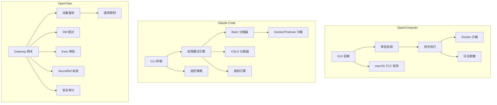

# 权限与安全对比分析：OpenComputer vs Claude Code vs OpenClaw

> 基线对比时间：2026-04-05 | 对应主文档章节：2.9

---

## 一、架构总览

| 维度 | OpenComputer | Claude Code | OpenClaw |
|------|-------------|-------------|----------|
| 产品形态 | Tauri 桌面 GUI 应用 | CLI 终端工具 | 多设备 IM 网关服务 |
| 语言 | Rust + TypeScript | TypeScript (Bun) | TypeScript (Node.js) |
| 权限模型 | 三模式审批 + Plan Mode 白名单 + macOS TCC | 六模式权限 + Bash 分类器 + 规则引擎 + YOLO 分类器 | 设备配对 + DM 策略 + 速率限制 + 角色鉴权 |
| 沙箱隔离 | Docker 容器沙箱 | Docker/Podman 沙箱 | Docker 沙箱（每 Agent 可配置） |
| 密钥管理 | 日志脱敏 + 环境变量过滤 | 分析事件脱敏 + 日志脱敏 | SecretRef 类型系统 + 多 Provider 密钥解析 |
| 组织策略 | 无 | policyLimits API + MDM remote-settings | 无（依赖渠道配置） |



---

## 二、OpenComputer 实现

### 2.1 工具审批机制

**文件**：`crates/oc-core/src/tools/approval.rs`、`crates/oc-core/src/tools/execution.rs`

OpenComputer 实现了三层工具审批系统：

#### 三种权限模式（`ToolPermissionMode`）

| 模式 | 行为 | 适用场景 |
|------|------|---------|
| `Auto`（默认） | 检查白名单 → 不在白名单则弹窗询问 | 日常使用 |
| `AskEveryTime` | 每次工具调用都弹窗询问（忽略白名单） | 高安全场景 |
| `FullApprove` | 所有工具调用自动通过 | 信任场景 / 自动化 |

#### 审批流程

1. **执行层入口**（`execute_tool_with_context`）：根据 `ToolPermissionMode` 判断是否需要审批
2. **Tauri 事件通信**：通过 `emit("approval_required", ...)` 向前端发送审批请求
3. **oneshot channel 等待**：后端创建 `tokio::sync::oneshot` 等待前端响应，超时 5 分钟
4. **三种响应**：`AllowOnce`（本次放行）、`AllowAlways`（加入白名单）、`Deny`（拒绝）

#### 白名单持久化

- 存储路径：`~/.opencomputer/exec-approvals.json`
- 匹配策略：命令前缀匹配（`starts_with`）
- `AllowAlways` 时提取命令第一个 token 作为前缀存入白名单

#### 工具级审批 vs 命令级审批

- **工具级审批**（`execution.rs`）：在所有可审批工具执行前检查，排除内部工具和 SKILL.md 读取
- **命令级审批**（`exec.rs`）：`exec` 工具内部独立的命令审批逻辑，支持白名单前缀匹配
- 两层审批互补：工具级在外层，命令级在 exec 内部

#### 特殊豁免

- `is_internal_tool()` 返回 true 的工具（plan_question、submit_plan 等）免审批
- 读取 `SKILL.md` 文件免审批（技能系统预授权）

### 2.2 Plan Mode 权限限制

**文件**：`crates/oc-core/src/plan/types.rs`、`crates/oc-core/src/plan/constants.rs`、`crates/oc-core/src/tools/execution.rs`

#### 六态状态机

Plan Mode 包含 Off → Planning → Review → Executing → Paused → Completed 六个状态。

#### 双重防护（Defense-in-depth）

1. **Schema 级过滤**：Provider 层只发送白名单工具的 schema 给 LLM
2. **执行层白名单**：`plan_mode_allowed_tools` 在 `execute_tool_with_context` 中二次拦截

#### Planning 阶段白名单

```
read, ls, grep, find, glob, web_search, web_fetch   // 只读探索
exec（需审批）                                        // 受限执行
plan_question, submit_plan                           // Plan 专用
write, edit（仅 plans/ 目录下的 .md 文件）            // 路径受限写入
recall_memory, memory_get, subagent                  // 记忆和委托
```

#### 路径约束

- `plan_mode_allow_paths` 限制 write/edit/apply_patch 只能操作 `~/.opencomputer/plans/` 下的 `.md` 文件
- `is_plan_mode_path_allowed()` 检查文件路径是否匹配

#### Executing 阶段

- 在 Planning 白名单基础上增加 `update_plan_step` 和 `amend_plan`
- 执行前自动创建 Git checkpoint，失败可回滚

### 2.3 Docker 沙箱

**文件**：`crates/oc-core/src/sandbox.rs`

#### 安全硬化配置（`SandboxConfig`）

| 参数 | 默认值 | 说明 |
|------|--------|------|
| `read_only` | `true` | 只读根文件系统 |
| `network_mode` | `"none"` | 网络完全隔离 |
| `cap_drop_all` | `true` | 丢弃所有 Linux capabilities |
| `no_new_privileges` | `true` | 禁止权限提升 |
| `memory_limit` | 512MB | 内存上限 |
| `cpu_limit` | 1.0 | CPU 限制 |
| `pids_limit` | 256 | 进程数上限 |
| `tmpfs` | `/tmp:64M, /var/tmp:32M, /run:16M` | 可写临时目录 |

#### 环境变量消毒（`sanitize_env`）

阻止向沙箱注入包含以下关键词的环境变量：
`API_KEY, TOKEN, SECRET, PASSWORD, CREDENTIAL, PRIVATE_KEY, AWS_SECRET, OPENAI_API, ANTHROPIC_API, DATABASE_URL` 等 21 种模式。

允许通过的安全变量白名单：`PATH, HOME, USER, LANG, TERM, SHELL` 等 13 个。

#### 挂载路径验证（`validate_bind_mount`）

阻止挂载以下系统路径：
`/etc, /proc, /sys, /dev, /boot, /root, /var/run/docker.sock` 等。

#### 执行流程

创建容器 → 启动 → 等待（带超时）→ 收集日志 → 强制移除容器（force + 删除 volumes）

### 2.4 macOS TCC 权限检查

**文件**：`crates/oc-core/src/permissions.rs`

覆盖 15 项 macOS 系统权限的检测与请求：

| 权限 | 检测方式 | API |
|------|---------|-----|
| Accessibility | C ABI 调用 | `AXIsProcessTrusted()` |
| Screen Recording | C ABI 调用 | `CGPreflightScreenCaptureAccess()` |
| Automation | osascript 探测 | System Events 脚本 |
| Full Disk Access | 文件系统启发式 | 读取 Safari 书签文件 |
| Location | JXA 调用 | `CLLocationManager.authorizationStatus` |
| Contacts/Calendar/Reminders/Photos | JXA 调用 | 各 Framework 的 `authorizationStatus` |
| Camera/Microphone | JXA 调用 | `AVCaptureDevice.authorizationStatus` |
| Bluetooth | JXA 调用 | `CBCentralManager.authorization` |
| Files & Folders | 文件系统探测 | 读取 Desktop/Documents/Downloads |
| App Management / Local Network | 无法编程检测 | 返回 `unknown` |

所有检测通过 `tokio::spawn_blocking` 并行执行，每项带 3 秒超时。超时或崩溃返回 `not_granted`。

请求权限时自动打开对应的系统设置面板（`x-apple.systempreferences://` URL scheme）。

非 macOS 平台所有权限返回 `granted`（跨平台兼容）。

### 2.5 API Key 脱敏

**文件**：`crates/oc-core/src/logging/file_ops.rs`、四个 Provider 实现

#### `redact_sensitive()` 函数

对 14 种敏感字段名进行 JSON 值替换：
`api_key, apiKey, api-key, access_token, accessToken, refresh_token, refreshToken, authorization, Authorization, x-api-key, bearer, password, secret`

匹配两种 JSON 模式：
- `"key":"value"` → `"key":"[REDACTED]"`
- `"key": "value"` → `"key": "[REDACTED]"`

#### 调用点

四个 Provider（Anthropic、OpenAI Chat、OpenAI Responses、Codex）在记录 API 请求体到日志前统一调用 `crate::logging::redact_sensitive(&raw_body)`。

API 请求体在日志中还进行了 32KB 截断（`truncate_utf8`）。

---

## 三、Claude Code 实现

### 3.1 六种权限模式

**文件**：`src/types/permissions.ts`、`src/utils/permissions/PermissionMode.ts`

| 模式 | 说明 | 色标 |
|------|------|------|
| `default` | 默认模式，按规则决定 allow/ask/deny | 白色 |
| `plan` | Plan Mode，只读 + 受限写入 | 蓝色 |
| `acceptEdits` | 自动接受文件编辑类操作 | 黄色 |
| `bypassPermissions` | 绕过所有权限检查（危险） | 红色 |
| `dontAsk` | 不弹窗，直接拒绝所有需要审批的操作 | 红色 |
| `auto`（内部） | Auto mode，基于 YOLO 分类器自动决策 | 橙色 |

此外还有内部 `bubble` 模式。外部用户无法使用 `auto` 模式。

#### 权限规则系统

三种规则行为：`allow`（允许）、`deny`（拒绝）、`ask`（询问）

规则来源（`PermissionRuleSource`）：
- `userSettings` — 用户级设置
- `projectSettings` — 项目级设置
- `localSettings` — 本地设置
- `flagSettings` — 特性标志
- `policySettings` — 组织策略
- `cliArg` — 命令行参数
- `command` — 用户命令
- `session` — 会话级

规则值（`PermissionRuleValue`）包含 `toolName` + 可选的 `ruleContent`，支持通配符匹配。

#### 权限决策类型

- `PermissionAllowDecision` — 允许，可附带修改后的输入
- `PermissionAskDecision` — 需要询问用户，可附带 `pendingClassifierCheck` 异步分类器检查
- `PermissionDenyDecision` — 拒绝，附带原因

决策原因（`PermissionDecisionReason`）包含 10 种类型：`rule`、`mode`、`subcommandResults`、`permissionPromptTool`、`hook`、`asyncAgent`、`sandboxOverride`、`classifier`、`workingDir`、`safetyCheck`、`other`。

### 3.2 Bash 命令分类器

**文件**：`src/tools/BashTool/bashSecurity.ts`、`src/tools/BashTool/bashPermissions.ts`

Claude Code 的 Bash 安全检查是整个权限系统中最复杂的部分。

#### 危险模式检测（bashSecurity.ts）

检测 23+ 类安全风险，每类有独立的数字标识符：

| ID | 检测项 | 示例 |
|----|--------|------|
| 1 | 不完整命令 | 缺少引号闭合 |
| 2 | jq system() 函数 | `jq 'system("rm -rf /")'` |
| 7 | 命令中换行符 | 隐藏命令注入 |
| 8 | 命令替换 `$()` | `$(rm -rf /)` |
| 9 | 输入重定向 | `< /etc/passwd` |
| 10 | 输出重定向 | `> /etc/shadow` |
| 11 | IFS 注入 | 通过修改 IFS 改变命令解析 |
| 13 | /proc/environ 访问 | 环境变量泄露 |
| 14 | 格式异常的 token | shell-quote 解析不一致 |
| 16 | 花括号展开 | `{rm,-rf,/}` |
| 17 | 控制字符 | 不可见字符注入 |
| 18 | Unicode 空白字符 | 视觉欺骗 |
| 20 | Zsh 危险命令 | `zmodload, emulate, syswrite, ztcp` 等 18 个 |

#### 命令替换模式检测

阻止 12 种命令替换/进程替换模式：
`<()`, `>()`, `=()`, `$()`, `${}`, `$[]`, `~[]`, `(e:`, `(+`, `} always {`, `<#` 等。

#### Zsh 危险命令集

完整阻止 18 个 Zsh 特有危险命令：`zmodload, emulate, sysopen, sysread, syswrite, sysseek, zpty, ztcp, zsocket, mapfile, zf_rm, zf_mv, zf_ln, zf_chmod, zf_chown, zf_mkdir, zf_rmdir, zf_chgrp`。

#### 复合命令限制

单条命令拆分后的子命令数上限为 50（`MAX_SUBCOMMANDS_FOR_SECURITY_CHECK`），超出则强制 `ask`。每条复合命令最多建议 5 条规则（`MAX_SUGGESTED_RULES_FOR_COMPOUND`）。

阻止裸 shell 前缀建议（`sh:*`, `bash:*`, `zsh:*` 等），防止通过 `-c` 执行任意代码。

### 3.3 危险模式检测

**文件**：`src/tools/BashTool/bashSecurity.ts`

上述 Bash 命令分类器已涵盖主要危险模式检测。此外还包括：

- **路径约束检查**（`pathValidation.ts`）：验证文件操作是否在允许的工作目录内
- **sed 约束检查**（`sedValidation.ts`）：检查 sed 命令的安全性
- **命令操作符权限**（`bashCommandHelpers.ts`）：检查管道、重定向等操作符的权限
- **tree-sitter AST 分析**（`treeSitterAnalysis.ts`）：使用 tree-sitter 对 bash 命令进行语法树级安全分析
- **安全检查风险等级**（`RiskLevel`）：`LOW`、`MEDIUM`、`HIGH` 三级

### 3.4 组织策略（policyLimits）

**文件**：`src/services/policyLimits/index.ts`、`src/services/policyLimits/types.ts`

#### 设计原则

- **Fail Open**：API 获取失败不阻断，无策略限制时正常运行
- **ETag 缓存**：使用 HTTP ETag 避免重复拉取
- **后台轮询**：每小时（`POLLING_INTERVAL_MS = 3600000ms`）刷新一次
- **重试策略**：最多 5 次重试（`DEFAULT_MAX_RETRIES`），10 秒超时（`FETCH_TIMEOUT_MS`）

#### 适用范围

- Console 用户（API Key）：全部适用
- OAuth 用户（Claude.ai）：仅 Team 和 Enterprise 订阅适用

#### API 响应结构

```typescript
{
  restrictions: Record<string, { allowed: boolean }>
}
```

只返回被阻止的策略。缺失的策略键表示允许。

#### 缓存

- 磁盘缓存：`~/.claude/policy-limits.json`
- 内存缓存：`sessionCache`
- 轮询：`setInterval` 后台定时刷新

#### 使用方式

`isPolicyAllowed(policyKey)` 在各功能入口处调用，包括：反馈、远程设置、远程触发、Bridge、登录、Schedule 等。

### 3.5 MDM 集成

**文件**：`src/services/remoteManagedSettings/syncCacheState.ts`

#### Remote Managed Settings

Claude Code 支持通过远程托管设置（MDM 风格）统一管理配置：

- **缓存文件**：`~/.claude/remote-settings.json`
- **三态适用性**：`undefined`（未确定）→ `false`（不适用）→ `true`（适用）
- **设置优先级**：remote-settings 覆盖本地 settings.json 中对应字段
- **触发条件**：仅 Anthropic API 用户适用（非 Bedrock / 自定义 base URL）

#### 权限规则来源层级

配合权限系统，组织策略设置（`policySettings`）的优先级高于用户设置，可强制执行：
- 强制特定权限模式
- 阻止特定工具使用
- 限制远程会话等功能

---

## 四、OpenClaw 实现

### 4.1 DM 配对安全

**文件**：`src/pairing/pairing-challenge.ts`、`src/pairing/pairing-store.ts`、`src/security/dm-policy-shared.ts`

#### 配对码机制

- **码长度**：8 字符（`PAIRING_CODE_LENGTH`）
- **字母表**：`ABCDEFGHJKLMNPQRSTUVWXYZ23456789`（32 字符，去除了易混淆的 0/O/1/I）
- **生成方式**：`crypto.randomBytes` 安全随机
- **有效期**：60 分钟（`PAIRING_PENDING_TTL_MS`）
- **最大挂起数**：3 个（`PAIRING_PENDING_MAX`）

#### DM 策略（`dm-policy-shared.ts`）

DM 消息的访问控制决策（`DmGroupAccessDecision`）：

| 决策 | 说明 |
|------|------|
| `allow` | 允许访问 |
| `block` | 拒绝访问 |
| `pairing` | 需要配对验证 |

决策原因（10 种）：
- `group_policy_allowed/disabled/empty_allowlist/not_allowlisted`
- `dm_policy_open/disabled/allowlisted/pairing_required/not_allowlisted`

支持 `allowFrom` 白名单和群组策略的多层叠加：配置文件 + 配对存储 + 运行时合并。

#### 存储安全

- 配对数据路径通过 `resolveOAuthDir()` 解析
- 文件级互斥锁（`withFileLock`）保护并发写入
- 原子写入（`writeJsonFileAtomically`）防止数据损坏

### 4.2 多层速率限制

**文件**：`src/gateway/auth-rate-limit.ts`、`src/gateway/control-plane-rate-limit.ts`

#### 认证速率限制器（`AuthRateLimiter`）

| 参数 | 默认值 | 说明 |
|------|--------|------|
| `maxAttempts` | 10 | 滑动窗口内最大失败次数 |
| `windowMs` | 60,000ms (1 分钟) | 滑动窗口大小 |
| `lockoutMs` | 300,000ms (5 分钟) | 超限后锁定时长 |
| `exemptLoopback` | `true` | 豁免本地回环地址 |
| `pruneIntervalMs` | 60,000ms | 过期条目清理间隔 |

#### 按作用域隔离

四种独立计数器：
- `default` — 通用认证
- `shared-secret` — 共享密钥认证
- `device-token` — 设备令牌认证
- `hook-auth` — Hook 认证

#### 设计特点

- 纯内存 Map 实现，无外部依赖
- 本地回环地址（`127.0.0.1` / `::1`）默认豁免
- 后台定时清理过期条目
- 控制面也有独立的速率限制器

### 4.3 审计系统

**文件**：`src/security/audit.ts`、`src/security/audit-fs.ts`、`src/security/audit-tool-policy.ts`

#### 安全审计报告结构

```typescript
type SecurityAuditReport = {
  ts: number;
  summary: { critical: number; warn: number; info: number };
  findings: SecurityAuditFinding[];
  deep?: { gateway?: { attempted, url, ok, error, close } };
};
```

#### 三级严重性

- `critical` — 严重安全风险
- `warn` — 潜在风险
- `info` — 信息性发现

#### 审计覆盖面

- **文件系统权限审计**（`audit-fs.ts`）：检查关键路径的 ACL 和 Unix 权限
- **工具策略审计**（`audit-tool-policy.ts`）：调用 `pickSandboxToolPolicy` 检查沙箱工具策略
- **配置安全审计**：检查危险配置标志（`dangerous-config-flags.ts`）
- **网络安全审计**：SSRF 防护检查（`isBlockedHostnameOrIp`）、私有网络策略
- **渠道安全审计**（`audit-channel.ts`）：IM 渠道配置安全性
- **深度审计**：可选的 Gateway WebSocket 探测

#### 危险工具默认拒绝列表

通过 Gateway HTTP `POST /tools/invoke` 默认阻止的高风险工具：
`exec, spawn, shell, fs_write, fs_delete, fs_move, apply_patch, sessions_spawn, sessions_send, cron, gateway, nodes, whatsapp_login`。

#### Exec 审批管理器

**文件**：`src/gateway/exec-approval-manager.ts`、`src/gateway/node-invoke-system-run-approval.ts`

远程命令执行审批系统：
- `ExecApprovalManager` 管理挂起的审批请求
- 支持 `allow-once` 和 `allow-always` 两种审批决策
- 审批记录包含请求方连接 ID、设备 ID、客户端 ID，防止跨客户端重放
- 15 秒宽限期（`RESOLVED_ENTRY_GRACE_MS`）保留已决审批
- `system.run` 调用需要 `operator.admin` 或 `operator.approvals` 权限

#### 外部内容安全

**文件**：`src/security/external-content.ts`

防止 Prompt 注入攻击：
- 检测 14 种可疑模式（`SUSPICIOUS_PATTERNS`），如 "ignore previous instructions"、"system: override" 等
- 使用随机 ID 的 XML 标记包裹外部内容，防止伪造边界
- 标记名：`EXTERNAL_UNTRUSTED_CONTENT` / `END_EXTERNAL_UNTRUSTED_CONTENT`

#### 上下文可见性控制

**文件**：`src/security/context-visibility.ts`

控制补充上下文（历史消息、引用、转发）对 LLM 的可见性：
- `all` — 所有内容可见
- `allowlist_quote` — 白名单用户 + 引用内容可见
- 非白名单用户的消息默认过滤

### 4.4 SecretRef 类型

**文件**：`src/secrets/ref-contract.ts`、`src/secrets/secret-value.ts`、`src/secrets/resolve.ts`

#### SecretRef 三源架构

| 来源 | 说明 | 示例 |
|------|------|------|
| `env` | 环境变量 | `SECRET_REF_ENV:default:API_KEY` |
| `file` | 文件系统 | `SECRET_REF_FILE:default:/value` |
| `exec` | 命令执行 | `SECRET_REF_EXEC:default:my-key` |

#### SecretRef 验证

- **文件路径 ID**：JSON Pointer 格式，使用 `~0`/`~1` 转义
- **Exec ID 模式**：`^[A-Za-z0-9][A-Za-z0-9._:/-]{0,255}$`，禁止目录遍历
- **Provider 别名模式**：`^[a-z][a-z0-9_-]{0,63}$`

#### 运行时解析

**文件**：`src/secrets/runtime.ts`

多种 Collector 收集密钥需求：
- `runtime-auth-collectors.ts` — 认证密钥
- `runtime-config-collectors-core.ts` — 核心配置
- `runtime-config-collectors-channels.ts` — 渠道配置
- `runtime-config-collectors-plugins.ts` — 插件配置
- `runtime-web-tools.ts` — Web 工具密钥

**解析策略**（`exec-resolution-policy.ts`）：控制 exec 类密钥的解析时机和安全边界。

#### 网关角色鉴权

**文件**：`src/gateway/role-policy.ts`

两种角色：`operator`（操作员）和 `node`（节点）。方法级鉴权：`isRoleAuthorizedForMethod()` 检查角色是否有权调用特定 Gateway 方法。

---

## 五、逐项功能对比

| 功能 | OpenComputer | Claude Code | OpenClaw |
|------|:----------:|:-----------:|:--------:|
| **工具执行审批** | 三模式 GUI 审批 | 六模式 + 规则引擎 + 分类器 | Gateway Exec 审批 |
| **命令分类** | 前缀白名单 | tree-sitter AST + 23 类模式检测 + Zsh 危险命令集 | 工具拒绝列表 |
| **Plan Mode** | 六态状态机 + 工具白名单 + 路径约束 | Plan Mode + 受限工具集 | N/A |
| **Docker 沙箱** | 完整沙箱配置（网络/内存/CPU/权限） | 支持 Docker/Podman | 每 Agent 可配置沙箱 |
| **环境变量消毒** | 21 种模式过滤 | 安全变量白名单 | N/A |
| **挂载路径验证** | 阻止 10 个系统路径 | N/A（沙箱内处理） | N/A |
| **OS 权限检测** | 15 项 macOS TCC | N/A | N/A |
| **API Key 脱敏** | JSON 字段名匹配替换 | 分析事件脱敏 | SecretRef 类型隔离 |
| **组织策略** | 无 | policyLimits API + MDM | 无 |
| **速率限制** | 无 | 无（CLI 无需） | 多层滑动窗口 |
| **设备配对** | N/A | N/A | 8 字符安全码 + TTL |
| **安全审计** | 无 | 无 | 多维审计报告（文件/网络/工具/配置） |
| **Prompt 注入防护** | 无 | 无 | 14 种模式检测 + 随机边界标记 |
| **上下文可见性** | 无 | 无 | 白名单 + 按类型过滤 |
| **危险模式检测深度** | 浅（前缀匹配） | 极深（AST + 23 类模式 + 分类器） | 中等（工具拒绝列表 + 配置审计） |
| **权限规则来源** | 单一（exec-approvals.json） | 7 种来源分层 | 配置文件 + 配对存储 + 运行时 |

---

## 六、差距分析与建议

### OpenComputer 相对 Claude Code 的差距

| 差距项 | 严重程度 | 说明 | 建议 |
|--------|---------|------|------|
| 命令安全分析深度不足 | 高 | 仅做前缀匹配，无 AST 分析、无命令替换检测、无 Zsh 特殊命令拦截 | 引入命令解析器（tree-sitter 或正则分组），检测 `$()` 替换、管道、重定向等 |
| 缺少基于规则的细粒度权限 | 中 | 只有三模式 + 白名单，无法按工具名 + 内容模式配置 allow/deny/ask 规则 | 扩展权限系统支持 `Bash(git:*)` 风格的规则匹配 |
| 缺少组织策略支持 | 中 | 无法集中管理团队级权限限制 | 如果面向企业用户，可对接 MDM 或远程配置服务 |
| 缺少 YOLO/Auto Mode 分类器 | 低 | 无 LLM 辅助的自动权限决策 | 对于 GUI 应用，当前弹窗模式用户体验可接受 |

### OpenComputer 相对 OpenClaw 的差距

| 差距项 | 严重程度 | 说明 | 建议 |
|--------|---------|------|------|
| 缺少 Prompt 注入防护 | 高 | IM 渠道场景下外部消息直接进入 LLM 上下文 | 在 channel worker 层添加外部内容标记包裹 |
| 缺少安全审计系统 | 中 | 无法系统化检查配置安全性 | 添加 `security audit` 命令，检查文件权限、网络配置、密钥暴露等 |
| 缺少速率限制 | 低 | 桌面应用场景风险较低，但 ACP 服务器可能需要 | 为 ACP 端点添加基本速率限制 |
| 缺少上下文可见性控制 | 中 | IM 渠道中非白名单用户消息可能泄露给 LLM | 在 channel 层添加消息过滤和上下文可见性策略 |

### OpenComputer 已有优势

| 优势项 | 说明 |
|--------|------|
| macOS TCC 权限检测 | 唯一实现了 15 项系统权限检测的项目 |
| Docker 沙箱深度配置 | 安全硬化最全面（网络隔离 + 能力丢弃 + 权限提升阻止 + 路径验证 + 环境变量消毒） |
| Plan Mode 六态状态机 | 比 Claude Code 的二态（plan/非 plan）更完整的生命周期管理 |
| GUI 审批体验 | 桌面弹窗比 CLI 提示更直观，支持 AllowAlways 持久化 |
| 双层防护 | Plan Mode 的 schema 级 + 执行层白名单双重检查 |
