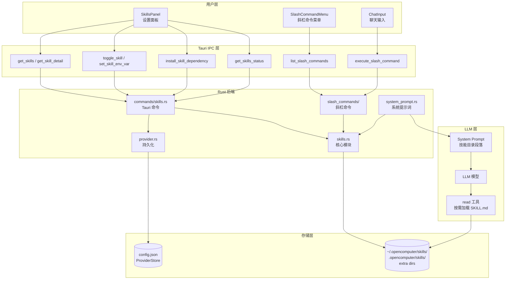

# OpenComputer 技能系统架构文档

> 更新时间：2026-03-25

## 目录

- [概述](#概述)
- [核心概念](#核心概念)
- [SKILL.md 格式规范](#skillmd-格式规范)
- [技能发现与加载](#技能发现与加载)
- [Requirements 检查](#requirements-检查)
- [Prompt 注入与预算管理](#prompt-注入与预算管理)
- [调用策略](#调用策略)
- [安装引导](#安装引导)
- [Skill 与斜杠命令统一](#skill-与斜杠命令统一)
- [缓存与版本追踪](#缓存与版本追踪)
- [健康检查](#健康检查)
- [配置项](#配置项)
- [Tauri 命令一览](#tauri-命令一览)
- [前端 UI](#前端-ui)
- [数据流全景](#数据流全景)
- [与 OpenClaw 对比](#与-openclaw-对比)
- [编写第一个 Skill](#编写第一个-skill)

---

## 概述

技能系统（Skills System）是 OpenComputer 的可扩展能力框架。每个技能是一个目录，包含一个 `SKILL.md` 文件，用 YAML frontmatter 声明元数据，用 Markdown body 提供详细指令。

**核心设计原则：**

1. **懒加载（Lazy Loading）**：系统提示词仅注入技能目录（名称 + 描述 + 文件路径），LLM 需要时才通过 `read` 工具加载 SKILL.md 全文
2. **渐进降级（Progressive Degradation）**：当技能数量超过 token 预算时，自动从 Full 格式降级到 Compact 格式再到截断
3. **Channel-Agnostic**：技能命令通过 `CommandAction` 枚举分发，桌面端/Telegram/Discord 等渠道统一处理
4. **Rust 后端驱动**：所有核心逻辑（发现、检查、缓存、prompt 生成）在 Rust 后端完成，前端仅负责展示

### 系统架构总览



**关键文件：**

| 文件 | 职责 |
|------|------|
| `src-tauri/src/skills.rs` | 核心模块：类型定义、frontmatter 解析、requirements 检查、prompt 生成、缓存、健康检查 |
| `src-tauri/src/commands/skills.rs` | 14 个 Tauri 命令：CRUD + 安装 + 健康检查 |
| `src-tauri/src/system_prompt.rs` | 系统提示词构建，调用 `build_skills_prompt` 注入技能段落 |
| `src-tauri/src/provider.rs` | `ProviderStore` 持久化技能配置（budget/allowlist/disabled/env） |
| `src-tauri/src/slash_commands/` | 斜杠命令系统，动态注册 user-invocable 技能为 `/skillname` 命令 |
| `src/components/settings/SkillsPanel.tsx` | 前端技能管理面板（列表 + 详情 + 安装 + 健康状态） |

---

## 核心概念

### 技能（Skill）

一个技能是一个目录，至少包含一个 `SKILL.md` 文件：

```
~/.opencomputer/skills/
└── github/
    ├── SKILL.md          ← 必需：frontmatter + 指令
    ├── examples.sh       ← 可选：辅助脚本
    └── README.md         ← 可选：文档
```

### 技能来源（Source）

| 来源 | 路径 | 优先级 | 说明 |
|------|------|--------|------|
| Extra dirs | 用户通过 UI 导入的目录 | 最低 | `config.json` 的 `extraSkillsDirs` |
| Managed | `~/.opencomputer/skills/` | 中 | 全局技能目录 |
| Project | `.opencomputer/skills/`（相对于 cwd） | 最高 | 项目级覆盖 |

高优先级来源的同名技能会覆盖低优先级的。

### 技能标识（Skill Key）

每个技能有两个标识：
- `name`：从 frontmatter 解析，用于 prompt 显示和命令名称
- `skill_key`：可选的自定义标识（frontmatter `skillKey:`），用于配置查找。默认等于 `name`

---

## SKILL.md 格式规范

### 基本格式

```markdown
---
name: github
description: "GitHub operations via gh CLI"
requires:
  bins: [git, gh]
  env: [GITHUB_TOKEN]
  os: [darwin, linux]
---

# GitHub Skill

When the user asks about GitHub operations, use the `gh` CLI.

## Available commands
- `gh pr list` — List pull requests
- `gh issue create` — Create an issue
- ...
```

### 完整 Frontmatter 字段

| 字段 | 类型 | 必需 | 默认值 | 说明 |
|------|------|------|--------|------|
| `name` | string | **是** | — | 技能标识符，全局唯一 |
| `description` | string | 否 | `""` | 人类可读描述，显示在 prompt 和 UI 中 |
| `skillKey` | string | 否 | 等于 `name` | 自定义配置查找键 |
| `always` | bool | 否 | `false` | 为 `true` 时跳过所有 requirements 检查 |
| `primaryEnv` | string | 否 | — | 主环境变量名，可被 skill apiKey 配置满足 |
| `user-invocable` | bool | 否 | `true` | 是否注册为斜杠命令 |
| `disable-model-invocation` | bool | 否 | `false` | 为 `true` 时不注入 prompt（仅用户可调用） |
| `command-dispatch` | string | 否 | — | 命令分发方式，目前仅支持 `"tool"` |
| `command-tool` | string | 否 | — | 当 `command-dispatch` 为 `"tool"` 时，绑定的工具名 |

### `requires:` 块

| 字段 | 类型 | 逻辑 | 说明 |
|------|------|------|------|
| `bins` | string[] | AND | 所有列出的二进制必须存在于 PATH |
| `anyBins` | string[] | OR | 至少一个列出的二进制存在即可 |
| `env` | string[] | AND | 所有列出的环境变量必须已设置且非空 |
| `os` | string[] | ANY | 支持的操作系统（`darwin`/`linux`/`windows`/`mac`/`macos`），空 = 全平台 |
| `config` | string[] | AND | 需要为 truthy 的配置路径（如 `webSearch.provider`） |

**示例 — 复合 requirements：**

```yaml
requires:
  bins: [git]
  anyBins: [rg, grep]
  env: [GITHUB_TOKEN]
  os: [darwin, linux]
  config: [webSearch.provider]
```

含义：需要 `git` 在 PATH，`rg` 或 `grep` 至少一个存在，`GITHUB_TOKEN` 已设置，运行在 macOS 或 Linux，且 webSearch provider 已配置。

### `install:` 块

声明依赖的安装方式，前端 SkillsPanel 会显示安装按钮：

```yaml
install:
  - kind: brew
    formula: gh
    bins: [gh]
    label: "Install GitHub CLI via Homebrew"
    os: [darwin]
  - kind: node
    package: "@anthropic-ai/sdk"
    bins: [anthropic]
  - kind: go
    module: github.com/user/tool@latest
    bins: [tool]
  - kind: uv
    package: my-python-tool
    bins: [my-tool]
```

| `kind` | 必需字段 | 执行命令 |
|--------|---------|---------|
| `brew` | `formula` | `brew install {formula}` |
| `node` | `package` | `npm install -g {package}` |
| `go` | `module` | `go install {module}` |
| `uv` | `package` | `uv tool install {package}` |
| `download` | *(保留)* | HTTP 下载 + 解压 |

安装完成后自动验证 `bins` 中列出的二进制是否存在于 PATH。

---

## 技能发现与加载

### 发现流程

```
load_all_skills_with_budget(extra_dirs, budget)
  │
  ├─ 1. Extra dirs（用户导入，最低优先级）
  │     └─ load_skills_from_dir(dir, source="label", budget)
  │
  ├─ 2. Managed skills: ~/.opencomputer/skills/
  │     └─ load_skills_from_dir(dir, source="managed", budget)
  │
  └─ 3. Project skills: .opencomputer/skills/
        └─ load_skills_from_dir(dir, source="project", budget)

对每个目录：
  遍历子目录（限 max_candidates_per_root=300）
    ├─ 有 SKILL.md → load_single_skill() 解析
    └─ 无 SKILL.md 但有 skills/ 子目录 → 递归扫描（嵌套检测）

同名覆盖：后加载的覆盖先加载的
最终按 name 字母排序
```

### 嵌套目录检测

自动检测 `dir/skills/*/SKILL.md` 嵌套结构：

```
my-project/
├── plugin-a/
│   └── skills/          ← 自动发现
│       ├── skill-x/SKILL.md
│       └── skill-y/SKILL.md
└── plugin-b/
    └── skills/          ← 自动发现
        └── skill-z/SKILL.md
```

### 安全限制

| 限制 | 默认值 | 说明 |
|------|--------|------|
| `max_candidates_per_root` | 300 | 每个目录最多扫描的子目录数（防 DoS） |
| `max_file_bytes` | 256 KB | 单个 SKILL.md 最大文件大小 |
| `max_count` | 150 | prompt 中最多包含的技能数 |
| `max_chars` | 30,000 | prompt 技能段落最大字符数 |

---

## Requirements 检查

### 检查流程

```rust
check_requirements(req, configured_env) -> bool
```

```
1. always == true?  ──→ 直接通过 ✓
2. OS 匹配？        ──→ 不匹配则失败 ✗
3. bins 全部存在？   ──→ 任一缺失则失败 ✗（AND 逻辑）
4. anyBins 至少一个？──→ 全部缺失则失败 ✗（OR 逻辑）
5. env 全部已设置？  ──→ 按优先级检查：
   │  a. configured_env（用户在设置面板配置的值）
   │  b. primaryEnv + apiKey 配置
   │  c. 系统环境变量
   └─ 任一未满足则失败 ✗
6. 全部通过 ✓
```

### `primaryEnv` 机制

当技能声明 `primaryEnv: MY_API_KEY` 且在 `requires.env` 中包含 `MY_API_KEY` 时，除了检查常规 env 配置外，还会检查是否通过 `__apiKey__` 字段配置了 API Key。这允许用户在设置面板中统一配置 API Key，而不需要单独设置每个环境变量。

### 详细诊断

```rust
check_requirements_detail(req, configured_env) -> RequirementsDetail {
    eligible: bool,
    missing_bins: Vec<String>,
    missing_any_bins: Vec<String>,
    missing_env: Vec<String>,
    missing_config: Vec<String>,
}
```

用于前端健康检查显示，明确告知用户缺少什么。

---

## Prompt 注入与预算管理

### 懒加载模式

系统提示词中仅注入技能**目录**，不注入 SKILL.md 全文：

```
The following skills provide specialized instructions for specific tasks.
Use the `read` tool to load a skill's file when the task matches its name.
When a skill file references a relative path, resolve it against the skill
directory (parent of SKILL.md) and use that absolute path in tool commands.
Only read the skill most relevant to the current task — do not read more than one skill up front.

- github: GitHub operations via gh CLI (read: ~/.opencomputer/skills/github/SKILL.md)
- docker: Container management (read: ~/.opencomputer/skills/docker/SKILL.md)
- ...
```

LLM 根据用户请求判断需要哪个技能，然后用 `read` 工具加载对应的 SKILL.md 获取详细指令。

### 三层渐进降级

```
┌─────────────────────────────────────────────────────────┐
│  Full Format（默认）                                      │
│  - name: description (read: ~/path/SKILL.md)            │
│  ↓ 超过 max_chars                                        │
├─────────────────────────────────────────────────────────┤
│  Compact Format（去掉描述）                               │
│  - name (read: ~/path/SKILL.md)                         │
│  + ⚠️ Skills catalog using compact format                │
│  ↓ 仍超过 max_chars                                      │
├─────────────────────────────────────────────────────────┤
│  Truncated（二分搜索最大前缀）                             │
│  前 N 条 compact 格式                                     │
│  + ⚠️ Skills truncated: showing N of M                   │
└─────────────────────────────────────────────────────────┘
```

### 路径压缩

所有路径中的 home 目录前缀被替换为 `~`：

```
/Users/alice/.opencomputer/skills/github/SKILL.md
→ ~/.opencomputer/skills/github/SKILL.md
```

每个技能节省约 5-6 tokens，150 个技能可节省 ~750-900 tokens。

### 过滤顺序

在生成 prompt 前，技能经过以下过滤：

1. 排除 `disabled_skills` 列表中的技能
2. 排除 `disable_model_invocation == true` 的技能
3. Bundled Allowlist 过滤（非空时仅允许列表中的 bundled 技能）
4. Agent 级 `FilterConfig`（allow/deny 列表）
5. Requirements 检查（当 `skill_env_check == true` 时）
6. 应用 `max_count` 数量上限

---

## 调用策略

每个技能有两个独立的调用控制开关：

| 字段 | 默认值 | 作用 |
|------|--------|------|
| `user-invocable` | `true` | 控制是否注册为斜杠命令（`/skillname`） |
| `disable-model-invocation` | `false` | 控制是否从 prompt 中隐藏 |

**四种组合：**

| user-invocable | disable-model-invocation | 效果 |
|----------------|--------------------------|------|
| `true` | `false` | 默认：用户可 `/command`，模型也能看到 |
| `true` | `true` | 仅用户可调用，模型看不到 |
| `false` | `false` | 仅模型可用，不注册为命令 |
| `false` | `true` | 完全不可用（相当于禁用） |

---

## 安装引导

### 后端执行

`install_skill_dependency` Tauri 命令执行安装：

```
1. 查找技能 → 获取 install spec
2. 检查 OS 约束（spec.os）
3. 按 kind 执行对应命令
4. 验证 bins 中的二进制是否存在
5. bump_skill_version() 刷新缓存
6. 返回安装日志 + 验证结果
```

### 安全校验

- Brew formula：不允许 `..`、`\`、以 `-` 开头
- npm package：不允许 `..`、`\`
- Go module：不允许 `..`、`\`
- OS 约束：只在匹配当前平台时执行

### 前端 InstallSpecRow 组件

每个安装 spec 显示为一行：

```
[brew] Install GitHub CLI via Homebrew     [安装]
[node] @anthropic-ai/sdk                   [安装成功 ✓]
```

按钮有三态：默认 → 安装中(旋转) → 成功(绿色)/失败(红色)。

---

## Skill 与斜杠命令统一

### 动态注册

所有 `user-invocable` 的技能自动注册为 Skill 分类的斜杠命令：

```
/github [args]     ← 技能 "github" 自动注册
/slack [args]      ← 技能 "slack" 自动注册
```

### 命令名称规范化

```
原始名称          →  命令名称
github            →  github
my-cool-skill     →  my_cool_skill
My Cool Skill!    →  my_cool_skill
---test---        →  test
(空)              →  skill
abcde...(50字符)  →  截断到 32 字符
```

### 冲突解决

```
与内置命令冲突 → 加 _skill 后缀：  model → model_skill
与其他 skill 冲突 → 加数字后缀：  test → test_2 → test_3
```

### 命令执行流程

```
用户输入 /github create issue
  │
  ├─ handlers::dispatch 匹配内置命令？ → 否
  │
  └─ handle_skill_command()
       │
       ├─ 查找匹配的 skill entry
       │
       ├─ command_dispatch == "tool"?
       │   └─ 是 → PassThrough: "Use the {tool} tool..."
       │
       └─ 否 → PassThrough: "Use the skill 'github'. Read the skill file at..."
```

当 `command-dispatch: tool` + `command-tool: exec` 时，技能命令直接告知 LLM 使用特定工具执行。

### 前端菜单

`SlashCommandMenu` 在 `CATEGORY_ORDER` 末尾显示 Skill 分类：

```
── Session ──
/new          Start a new chat
/clear        Clear conversation
── Model ──
/model        Switch model
── Skill ──                    ← 新增分类
/github       GitHub operations via gh CLI
/slack        Slack messaging
```

技能命令使用 `descriptionRaw` 直接展示描述（无需 i18n key）。

---

## 缓存与版本追踪

### 版本机制

```rust
static SKILL_CACHE_VERSION: AtomicU64 = AtomicU64::new(0);

pub fn bump_skill_version() {
    SKILL_CACHE_VERSION.fetch_add(1, Ordering::Relaxed);
}
```

以下操作会触发版本递增：
- `toggle_skill` — 启用/禁用技能
- `set_skill_env_var` / `remove_skill_env_var` — 修改环境变量
- `add_extra_skills_dir` / `remove_extra_skills_dir` — 修改技能目录
- `set_skill_env_check` — 修改环境检查开关
- `install_skill_dependency` — 安装依赖

### SkillCache

```rust
pub struct SkillCache {
    pub entries: Vec<SkillEntry>,
    pub version: u64,
    pub loaded_at: Instant,
    pub extra_dirs: Vec<String>,
}
```

验证条件（全部满足才有效）：
1. `loaded_at.elapsed() < 30 秒`
2. `version == SKILL_CACHE_VERSION`
3. `extra_dirs` 未变化

失效时重新扫描文件系统加载。

---

## 健康检查

### SkillStatusEntry

```rust
pub struct SkillStatusEntry {
    pub name: String,
    pub source: String,
    pub eligible: bool,          // 综合判断：可用
    pub disabled: bool,          // 被用户禁用
    pub blocked_by_allowlist: bool, // 被 bundled allowlist 阻止
    pub missing_bins: Vec<String>,  // 缺失的 bins
    pub missing_any_bins: Vec<String>, // anyBins 全部缺失时列出
    pub missing_env: Vec<String>,   // 缺失的环境变量
    pub missing_config: Vec<String>, // 缺失的配置路径
    pub has_install: bool,       // 是否有安装引导
    pub always: bool,            // 是否始终可用
}
```

### 前端状态徽章

SkillsPanel 列表中每个技能显示状态标签：

| 条件 | 标签 | 颜色 |
|------|------|------|
| `always == true` | "始终可用" | 绿色 |
| `has_install == true` | "安装" | 蓝色 |
| `disable_model_invocation == true` | "模型可调用: ✗" | 橙色 |
| env 未配置 | ⚠️ 图标 | 橙色 |

---

## 配置项

### config.json（ProviderStore）

```jsonc
{
  // 技能目录
  "extraSkillsDirs": ["/path/to/extra/skills"],
  // 禁用的技能名列表
  "disabledSkills": ["skill-name"],
  // 是否检查 requirements（默认 true）
  "skillEnvCheck": true,
  // 用户配置的技能环境变量
  "skillEnv": {
    "github": {
      "GITHUB_TOKEN": "ghp_xxxx..."
    }
  },
  // Prompt 预算配置
  "skillPromptBudget": {
    "maxCount": 150,
    "maxChars": 30000,
    "maxFileBytes": 262144,
    "maxCandidatesPerRoot": 300
  },
  // Bundled 技能允许列表（空 = 全部允许）
  "skillAllowBundled": []
}
```

### Agent 级过滤（agent.json）

```jsonc
{
  "skills": {
    "allow": ["github", "docker"],  // 白名单（非空时仅允许这些）
    "deny": ["dangerous-skill"]     // 黑名单
  },
  "behavior": {
    "skillEnvCheck": true  // 覆盖全局设置
  }
}
```

---

## Tauri 命令一览

| 命令 | 参数 | 返回 | 说明 |
|------|------|------|------|
| `get_skills` | — | `Vec<SkillSummary>` | 获取技能列表（含扩展字段） |
| `get_skill_detail` | `name` | `SkillDetail` | 获取技能详情（含 SKILL.md 内容） |
| `get_extra_skills_dirs` | — | `Vec<String>` | 获取额外技能目录列表 |
| `add_extra_skills_dir` | `dir` | — | 添加技能目录 |
| `remove_extra_skills_dir` | `dir` | — | 移除技能目录 |
| `toggle_skill` | `name, enabled` | — | 启用/禁用技能 |
| `get_skill_env_check` | — | `bool` | 获取环境检查开关 |
| `set_skill_env_check` | `enabled` | — | 设置环境检查开关 |
| `get_skill_env` | `name` | `HashMap<String, String>` | 获取技能环境变量（值已掩码） |
| `set_skill_env_var` | `skill, key, value` | — | 设置技能环境变量 |
| `remove_skill_env_var` | `skill, key` | — | 移除技能环境变量 |
| `get_skills_env_status` | — | `HashMap<String, HashMap<String, bool>>` | 批量获取所有技能的环境变量配置状态 |
| `get_skills_status` | — | `Vec<SkillStatusEntry>` | 获取所有技能的健康状态 |
| `install_skill_dependency` | `skill_name, spec_index` | `String` | 安装技能依赖（返回日志） |

---

## 前端 UI

### SkillsPanel 组件结构

```
SkillsPanel
├── 技能目录管理区
│   ├── ~/.opencomputer/skills/（默认，不可删除）
│   ├── Extra dirs（可删除）
│   └── [导入目录] 按钮
│
├── 环境检查开关
│
├── 技能列表
│   └── 每行：Toggle | 名称+描述+状态标签 | 来源标签 | 设置按钮 | 打开目录
│
└── 详情视图（点击技能进入）
    ├── Header：名称 + Toggle + 描述 + 来源 + 目录链接
    ├── 环境变量配置：状态点 + 输入框 + 保存/清除
    ├── 高级信息：always/anyBins/调用策略/命令绑定标签
    ├── 安装引导：InstallSpecRow（kind + label + 安装按钮）
    ├── 文件列表：技能目录中的文件/子目录
    └── SKILL.md 内容预览
```

### InstallSpecRow 组件

```
[brew]  Install GitHub CLI via Homebrew    [安装]
```

安装按钮状态流转：
- 默认：蓝色 "安装"
- 安装中：灰色 "安装中..." + 禁用
- 成功：绿色 "安装成功"
- 失败：红色 "安装失败"

---

## 数据流全景

### 技能注入到 LLM

```
应用启动 / 技能配置变更
  │
  ├─ bump_skill_version()
  │
  └─ 下次 LLM 调用时：
       │
       ├─ system_prompt.rs::build_skills_section()
       │   │
       │   ├─ load_all_skills_with_budget(extra_dirs, budget)
       │   │   └─ 扫描 3 层目录 → 解析 frontmatter → 去重 → 排序
       │   │
       │   ├─ Agent FilterConfig 过滤
       │   │
       │   └─ build_skills_prompt(skills, disabled, env_check, skill_env, budget, allow_bundled)
       │       │
       │       ├─ disable_model_invocation 过滤
       │       ├─ bundled allowlist 过滤
       │       ├─ requirements 检查过滤
       │       ├─ compact_path() 路径压缩
       │       └─ 三层降级 → 返回 prompt 字符串
       │
       └─ 注入系统提示词第 ⑦ 段落
```

### 用户通过斜杠命令调用技能

```
用户输入 /github create issue
  │
  ├─ ChatInput → useSlashCommands hook
  │   └─ invoke("list_slash_commands") → 包含 Skill 分类命令
  │
  ├─ SlashCommandMenu 显示 → 用户选择
  │
  ├─ invoke("execute_slash_command", { commandText: "/github create issue" })
  │   │
  │   ├─ parser::parse → ("github", "create issue")
  │   ├─ handlers::dispatch → 内置命令不匹配
  │   └─ handle_skill_command()
  │       │
  │       ├─ 查找 skill entry: name="github"
  │       ├─ command_dispatch == "tool"?
  │       │   ├─ 是 → PassThrough: "Use the {tool} tool..."
  │       │   └─ 否 → PassThrough: "Use the skill 'github'. Read..."
  │       └─ 返回 CommandResult { content, action: PassThrough }
  │
  └─ ChatScreen handleCommandAction
      └─ action.type == "passThrough" → 发送给 LLM
```

---

## 与 OpenClaw 对比

| 维度 | OpenComputer | OpenClaw |
|------|-------------|----------|
| **语言** | Rust（后端）+ TypeScript（前端） | TypeScript（全栈） |
| **Prompt 注入** | 懒加载：名称+描述+路径，LLM 按需 read | 懒加载：名称+路径，LLM 按需 read |
| **预算管理** | 三层降级：Full → Compact → 二分截断 | 三层降级：Full → Compact → 二分截断 |
| **Requirements** | bins(AND) + anyBins(OR) + env + os + config + always + primaryEnv | bins(AND) + anyBins(OR) + env + os + config + always + primaryEnv |
| **调用策略** | user-invocable + disable-model-invocation | user-invocable + disable-model-invocation |
| **安装引导** | brew/node/go/uv/download + **GUI 一键安装** | brew/node/go/uv/download + CLI 安装 |
| **健康检查** | `get_skills_status` + **GUI 状态徽章** | `openclaw skills check` CLI 输出 |
| **缓存** | AtomicU64 版本 + 30s TTL（**无额外进程**） | chokidar 文件 watcher + 版本号 |
| **Skill 命令** | 动态注册为斜杠命令（**Channel-Agnostic**） | 动态注册为斜杠命令 |
| **Skill 来源** | 3 层（extra/managed/project） | 6 层（extra/bundled/managed/personal/project/workspace） |
| **插件集成** | 嵌套 skills/ 检测 | Plugin manifest 声明 |
| **Skill Marketplace** | — | ClawHub 集成 |

**OpenComputer 超越 OpenClaw 的点：**
1. GUI 安装引导（设置面板一键安装 + 实时日志）
2. 可视化健康检查（GUI 状态徽章 + hover 详情）
3. Rust 原生缓存（AtomicU64，无 chokidar 额外进程）
4. Channel-Agnostic skill 命令（CommandAction 统一分发到桌面/Telegram/Discord）
5. Full format 包含描述（OpenClaw 默认只有名称+路径）

---

## 编写第一个 Skill

### 1. 创建目录

```bash
mkdir -p ~/.opencomputer/skills/my-tool
```

### 2. 编写 SKILL.md

```markdown
---
name: my-tool
description: "Interact with my custom tool via CLI"
requires:
  bins: [my-tool]
  os: [darwin, linux]
install:
  - kind: brew
    formula: my-org/tap/my-tool
    bins: [my-tool]
    label: "Install via Homebrew"
---

# My Tool Skill

When the user asks about my-tool operations, use the `my-tool` CLI.

## Usage
- `my-tool status` — Show current status
- `my-tool deploy --env production` — Deploy to production
- `my-tool logs --tail 100` — View recent logs

## Important Notes
- Always confirm destructive operations with the user
- Use `--dry-run` flag for safety when available
```

### 3. 验证

1. 打开设置面板 → Skills
2. 确认 "my-tool" 出现在列表中
3. 如果显示黄色警告，点击进入配置环境变量
4. 在聊天中输入 "/" 查看是否出现 `/my_tool` 命令
5. 对话中测试："帮我查看 my-tool 的状态"

### 4. 高级选项

**仅用户可调用（隐藏于模型）：**
```yaml
user-invocable: true
disable-model-invocation: true
```

**绑定到特定工具：**
```yaml
command-dispatch: tool
command-tool: exec
```

**始终可用（跳过所有检查）：**
```yaml
always: true
```

---

## 附录：类型定义速查

### Rust 核心类型

```rust
// 技能条目
pub struct SkillEntry {
    pub name: String,
    pub description: String,
    pub source: String,           // "managed" | "project" | 目录名
    pub file_path: String,
    pub base_dir: String,
    pub requires: SkillRequires,
    pub skill_key: Option<String>,
    pub user_invocable: Option<bool>,
    pub disable_model_invocation: Option<bool>,
    pub command_dispatch: Option<String>,
    pub command_tool: Option<String>,
    pub install: Vec<SkillInstallSpec>,
}

// 环境要求
pub struct SkillRequires {
    pub bins: Vec<String>,        // AND
    pub any_bins: Vec<String>,    // OR
    pub env: Vec<String>,         // AND
    pub os: Vec<String>,          // ANY
    pub config: Vec<String>,      // AND
    pub always: bool,
    pub primary_env: Option<String>,
}

// 安装规格
pub struct SkillInstallSpec {
    pub kind: String,             // brew | node | go | uv | download
    pub formula: Option<String>,
    pub package: Option<String>,
    pub go_module: Option<String>,
    pub bins: Vec<String>,
    pub label: Option<String>,
    pub os: Vec<String>,
}

// Prompt 预算
pub struct SkillPromptBudget {
    pub max_count: usize,         // 默认 150
    pub max_chars: usize,         // 默认 30,000
    pub max_file_bytes: u64,      // 默认 256 KB
    pub max_candidates_per_root: usize, // 默认 300
}

// 健康状态
pub struct SkillStatusEntry {
    pub name: String,
    pub source: String,
    pub eligible: bool,
    pub disabled: bool,
    pub blocked_by_allowlist: bool,
    pub missing_bins: Vec<String>,
    pub missing_any_bins: Vec<String>,
    pub missing_env: Vec<String>,
    pub missing_config: Vec<String>,
    pub has_install: bool,
    pub always: bool,
}
```

### TypeScript 核心类型

```typescript
// 技能摘要（列表用）
interface SkillSummary {
  name: string
  description: string
  source: string
  base_dir: string
  enabled: boolean
  requires_env: string[]
  skill_key?: string
  user_invocable?: boolean
  disable_model_invocation?: boolean
  has_install?: boolean
  any_bins?: string[]
  always?: boolean
}

// 斜杠命令分类
type CommandCategory = "session" | "model" | "memory" | "agent" | "utility" | "skill"

// 斜杠命令定义
interface SlashCommandDef {
  name: string
  category: CommandCategory
  descriptionKey: string
  hasArgs: boolean
  argPlaceholder?: string
  argOptions?: string[]
  descriptionRaw?: string  // skill 命令的原始描述
}
```
