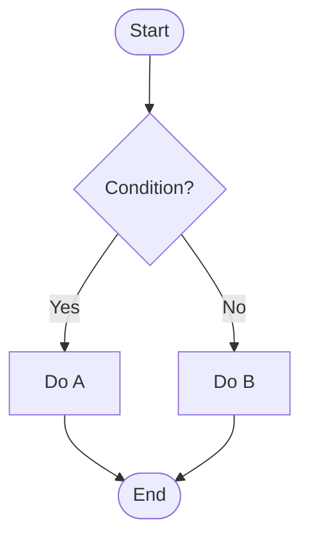
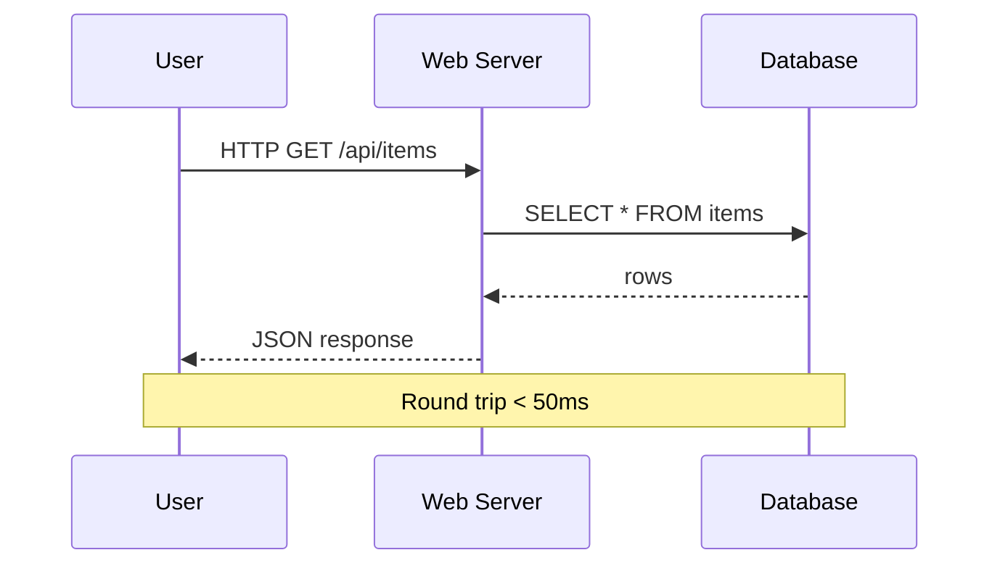
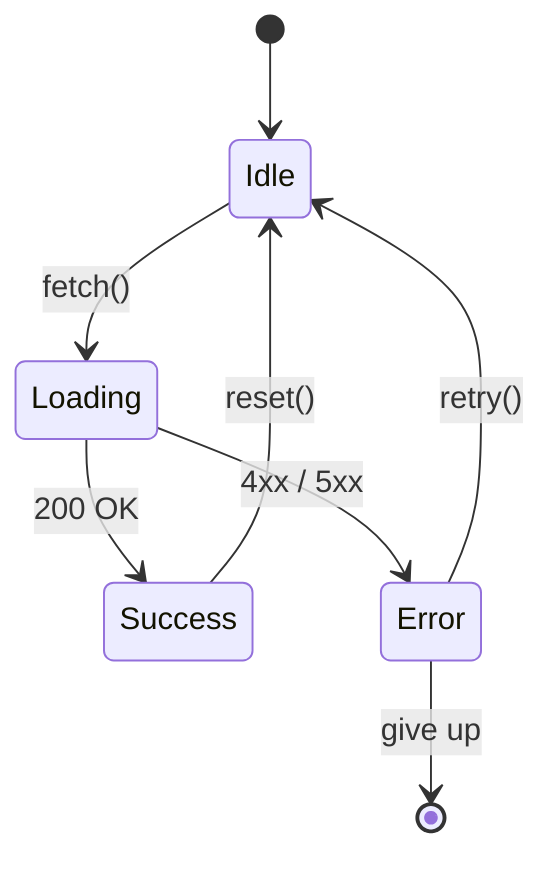
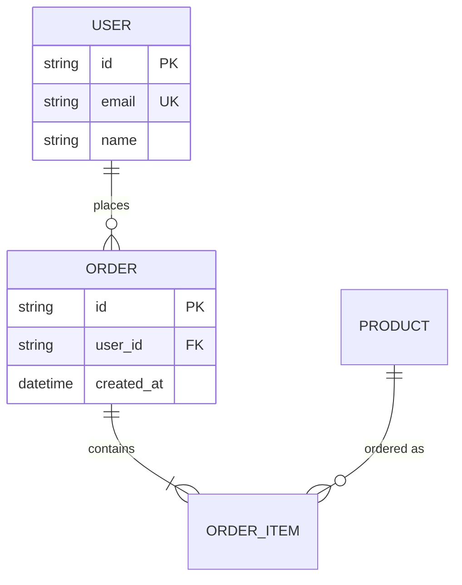
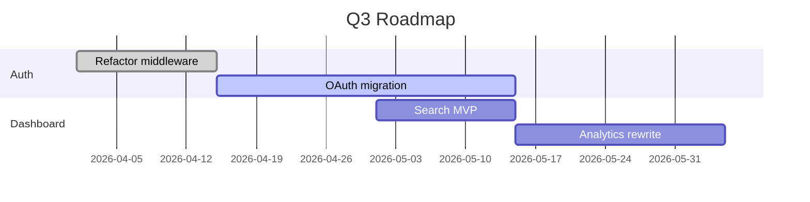
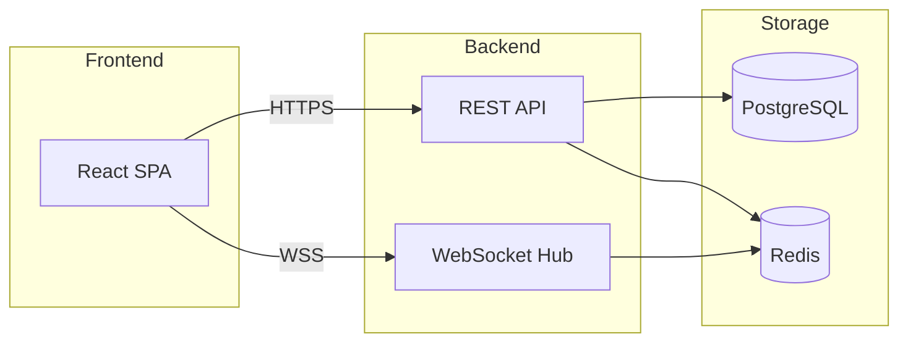

# Mermaid Diagram

## When to Use

Trigger phrases: "draw a diagram", "flowchart for …", "sequence diagram", "architecture diagram", "ER diagram", "state machine", "gantt chart", "画一个流程图", "画个架构图".

**Mermaid is rendered natively** in Hope Agent chat (via Streamdown). Just emit a fenced ```mermaid block — the user sees the rendered SVG, no setup.

For diagrams Mermaid can't express (organic shapes, custom illustrations, hand-drawn style) consider drawing-tool skills (e.g. `excalidraw` from Hermes Agent or `drawio` from Anthropic marketplace) — those need to be installed via Quick Import.

## Pick the Right Diagram Type

| Intent | Mermaid type | Use when |
|--------|--------------|----------|
| Step-by-step process | `flowchart` | Decisions, branching, "if X then Y" |
| Time-ordered messages between actors | `sequenceDiagram` | API call traces, distributed protocols |
| State transitions of a single entity | `stateDiagram-v2` | UI state machines, workflow engines |
| Data model relationships | `erDiagram` | Database schema, entity relationships |
| Project schedule / timeline | `gantt` | Roadmaps, sprints |
| Pie / distribution | `pie` | Quick share-of-X visualization |
| Tree hierarchy (org chart, decomposition) | `flowchart TD` with subgraphs | Org / breakdown trees |
| Class hierarchy with methods | `classDiagram` | OO design, type relationships |
| User journey (steps + sentiment) | `journey` | UX flows |

If unsure, default to `flowchart`. It's the most flexible.

## Templates

### Flowchart (top-down)


### Sequence Diagram


### State Diagram


### ER Diagram


### Gantt


### Architecture (flowchart with subgraphs)


## Workflow

1. **Clarify intent** — if the user just says "diagram", ask via `ask_user_question`:
   - What's the diagram showing? (process / structure / relationships / timeline)
   - Who's the audience? (engineers / execs / customers)
   - Level of detail? (high-level overview / fine-grained)

2. **Pick the simplest type that fits** — flowchart > sequence > state. Don't reach for `classDiagram` if a flowchart works.

3. **Sketch nodes first, edges second** — list the entities (boxes), then connect them. Avoid dense edge spaghetti.

4. **Iterate small** — start with 5-7 nodes. Add detail only after the user confirms the structure.

5. **Verify renderability** — if you reference Mermaid syntax that's iffy (e.g. classDiagram with annotations), keep it minimal. The user will see if it doesn't render.

## Style Rules

- **One concept per diagram** — if you're tempted to add a second flow, split into two diagrams
- **Consistent shape vocabulary**:
  - `[Square]` = process / action
  - `(Round)` = entity / data
  - `{Diamond}` = decision
  - `([Stadium])` = start / end
  - `[(Cylinder)]` = database / storage
  - `((Circle))` = external system
- **Direction**: `TD` (top-down) for hierarchies, `LR` (left-right) for pipelines / data flows
- **Labels short** — node labels ≤ 4 words. Detail goes in surrounding prose.
- **Use `Note over`** in sequence diagrams to explain non-obvious behavior, not for narration

## Multi-Diagram Output

When asked for "a few diagrams" or "show me the system from different angles", output 2-3 separate ```mermaid blocks with prose between them explaining what each shows.

```
Here's the system at three levels:

**1. High-level data flow:**
\`\`\`mermaid
flowchart LR
    ...
\`\`\`

**2. Login sequence (zoom into auth):**
\`\`\`mermaid
sequenceDiagram
    ...
\`\`\`

**3. Database relationships:**
\`\`\`mermaid
erDiagram
    ...
\`\`\`
```

## Common Pitfalls

| Mistake | Fix |
|---|---|
| Single diagram with 30+ nodes | Split into 2-3 diagrams by concern |
| Mixing types (flowchart with class fields) | Pick one type; for hybrid views, do multi-diagram |
| All boxes look the same | Use shape vocabulary (decision = diamond, etc.) |
| Long node labels | Move detail to prose; keep nodes ≤ 4 words |
| Unicode quotes (`"smart quotes"`) breaking syntax | Use ASCII `"` everywhere in Mermaid blocks |
| Mermaid `;` line endings forgotten when used | Either use newlines OR `;` consistently, not mixed |
| Forgot fenced block tag | Block must be ```mermaid (not just ```) for HA chat to render |

## Limitations to Surface to User

- No floating positioning / pixel-perfect layouts (Mermaid auto-lays out)
- Limited styling (colors via classDef but verbose)
- Some node shapes don't compose (e.g. cylinders inside subgraphs can be quirky)
- For organic / hand-drawn / heavily-styled diagrams, recommend a draw.io / excalidraw skill instead
